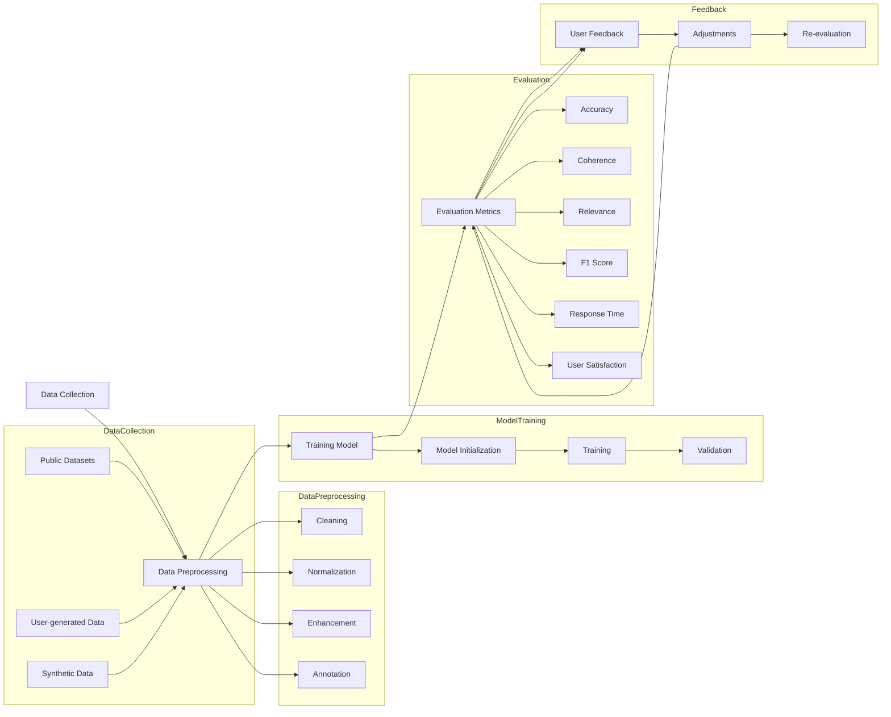
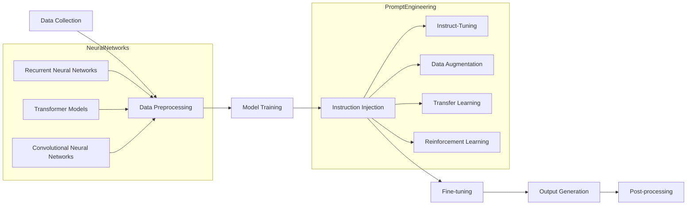
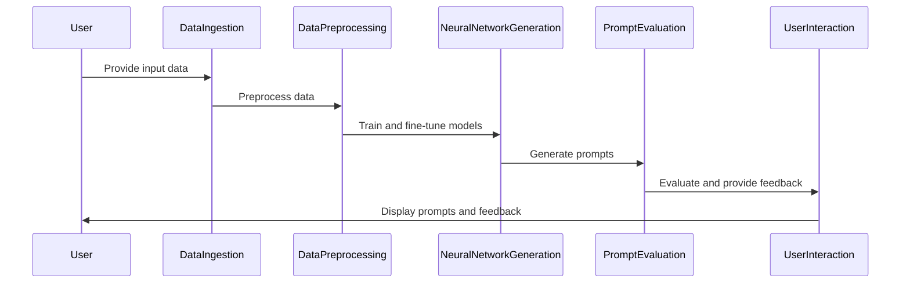

                 

### Chapter 1: Introduction to Prompt Generation Technology

#### 1.1 The Need for Prompt Generation

**1.1.1 Background of Prompt Usage**

Prompt generation technology has emerged as a cornerstone in the development of artificial intelligence (AI), particularly within the realms of natural language processing (NLP) and machine learning (ML). At its core, a prompt is a sequence of words or symbols designed to guide an AI system towards a specific task or action. Historically, prompts have been a fundamental element in human-computer interaction, aiding users in navigating complex systems. However, as AI systems have become more sophisticated, the role and complexity of prompts have evolved significantly.

The advent of large language models, such as GPT-3 and BERT, has ushered in a new era where prompts play a pivotal role in guiding these models to generate coherent and contextually relevant responses. The importance of prompt generation cannot be overstated, as it directly impacts the performance, accuracy, and utility of AI systems.

**1.1.2 Challenges in Prompt Design**

Despite the promise of prompt generation, there are several challenges that need to be addressed. One of the primary challenges is the creation of effective prompts that can capture the nuances of a given task or domain. This requires a deep understanding of the domain-specific knowledge and the ability to synthesize this knowledge into a concise and informative prompt.

Another significant challenge is the scalability of prompt generation systems. As the size and complexity of AI models increase, the need for more sophisticated and fine-tuned prompts also grows. This necessitates the development of scalable and efficient algorithms that can generate high-quality prompts at scale.

**1.1.3 Objectives of This Book**

The objective of this book is to provide a comprehensive and practical guide to evaluation-driven prompt generation technology. We aim to address the following key goals:

1. **Fundamental Understanding**: To establish a solid foundation in the core concepts and principles of prompt generation, including the definition of prompts, key concepts, and theories.
2. **Methodological Insights**: To explore advanced techniques and methodologies for prompt generation, including neural network-based approaches and prompt engineering strategies.
3. **Application Scenarios**: To showcase the practical applications of prompt generation in various domains, such as NLP and ML systems.
4. **System Design and Implementation**: To delve into the system design and implementation aspects of prompt generation technologies, including architecture design, interface design, and system interaction.
5. **Case Studies and Practical Applications**: To present real-world case studies and practical applications of prompt generation, along with detailed analysis and discussion.
6. **Future Trends and Challenges**: To discuss the future trends and challenges in prompt generation, including emerging technologies and ethical considerations.

By the end of this book, readers will have a comprehensive understanding of prompt generation technology, from basic concepts to advanced techniques, and will be equipped with the knowledge and skills to implement and deploy their own prompt generation systems.

---

**1.2 Definition and Basics**

**1.2.1 Definition of Prompts**

A prompt in the context of AI can be defined as a piece of input provided to an AI system to guide its behavior or decision-making process. Prompts are used to specify the context, desired output, or objectives of a task, enabling the AI system to generate relevant and useful responses.

For example, consider a chatbot designed to assist customers with product inquiries. A prompt for this chatbot might be "What is the best smartphone for under $500?" The prompt provides the chatbot with the necessary context to generate a relevant and informative response.

**1.2.2 Types of Prompts**

There are several types of prompts that serve different purposes in AI systems:

1. **Direct Prompts**: Direct prompts explicitly state the desired task or action. They are typically used in structured environments where the task is well-defined.

2. **Instructive Prompts**: Instructive prompts provide instructions or guidelines on how to perform a task. They are more flexible than direct prompts and can be used in unstructured or dynamic environments.

3. **Suggestive Prompts**: Suggestive prompts offer suggestions or ideas to the AI system, allowing it to explore a range of possible solutions. They are often used to encourage creative problem-solving.

4. **Contextual Prompts**: Contextual prompts provide additional context or background information to help the AI system understand the current situation or task better. They are particularly useful in applications where context is crucial, such as dialogue systems or recommendation engines.

**1.2.3 Role in AI Systems**

Prompts play a critical role in the functioning of AI systems, serving multiple purposes:

1. **Guiding Behavior**: Prompts guide the behavior of AI systems, ensuring that they perform the desired tasks accurately and efficiently.

2. **Improving Performance**: Well-designed prompts can significantly improve the performance of AI systems. By providing clear and concise instructions, prompts can help the AI system focus on the most relevant information and generate more accurate responses.

3. **Enhancing User Experience**: In applications like chatbots or virtual assistants, prompts enhance the user experience by making interactions more natural and intuitive.

4. **Facilitating Adaptation**: Prompts can be used to adapt AI systems to new tasks or environments. By adjusting the prompts, developers can fine-tune the behavior of the AI system to better match the requirements of different use cases.

---

**1.3 Evolution of Prompt Generation**

**1.3.1 Early Methods**

The concept of prompt generation has been around for several decades, with early methods primarily focusing on rule-based approaches. In these systems, prompts were created manually by developers based on specific rules and patterns.

For example, in early chatbots, developers would write specific responses for various user inputs. These responses were hard-coded into the system, making it difficult to scale and adapt to new scenarios. While rule-based methods were effective for simple, well-defined tasks, they were limited in their ability to handle complex, dynamic environments.

**1.3.2 Transition to Machine Learning**

The advent of machine learning in the late 20th and early 21st centuries marked a significant shift in prompt generation. Machine learning models, particularly those based on neural networks, allowed for more flexible and adaptive prompt generation.

One of the key advancements was the development of large language models, such as GPT-3 and BERT, which could generate coherent and contextually relevant prompts based on large datasets of text. These models leveraged the power of deep learning to learn from vast amounts of data, enabling more sophisticated and nuanced prompt generation.

**1.3.3 Current State and Future Directions**

The current state of prompt generation technology is characterized by the widespread adoption of neural network-based approaches. These approaches have demonstrated significant improvements in performance and versatility compared to early rule-based methods.

However, there are still several challenges and opportunities for future research:

1. **Scalability**: As the size and complexity of AI models increase, the need for scalable and efficient prompt generation algorithms becomes more critical.

2. **Ethical Considerations**: The ethical implications of prompt generation, particularly in applications involving sensitive data or autonomous decision-making, need to be carefully addressed.

3. **Interactivity**: Enhancing the interactivity of prompt generation systems to better understand and respond to user needs and preferences is an important area of research.

4. **Personalization**: Developing personalized prompt generation systems that can adapt to individual user characteristics and preferences is an area with significant potential for innovation.

In summary, prompt generation technology has evolved significantly over the years, with ongoing advancements in machine learning and AI driving further improvements. As we move forward, the focus will be on addressing the remaining challenges and exploring new opportunities to enhance the capabilities of prompt generation systems.

---

### Chapter 2: Core Concepts and Principles

In this chapter, we delve into the core concepts and principles of prompt generation technology. Understanding these foundational elements is crucial for designing and implementing effective prompt generation systems.

#### 2.1 Definition of Prompts

A prompt, in the context of AI, is a set of instructions or inputs provided to an AI system to guide its behavior or decision-making process. Unlike traditional programming where instructions are explicit and deterministic, prompts offer a more flexible and adaptable way to interact with AI systems. Prompts can take various forms, including text, images, or even audio, depending on the application and the nature of the task.

**Key Attributes of Prompts**

1. **Context**: Prompts provide the necessary context to the AI system, helping it understand the current situation or task.

2. **Instruction**: Prompts include specific instructions or goals that the AI system needs to achieve.

3. **Flexibility**: Prompts can vary in length, complexity, and format, allowing for different levels of interaction and adaptability.

4. **Relevance**: Effective prompts are highly relevant to the task at hand, ensuring that the AI system can generate accurate and useful outputs.

**Types of Prompts**

1. **Direct Prompts**: These are explicit instructions that guide the AI system towards a specific action or task. For example, "Generate a summary of this article."

2. **Instructive Prompts**: These provide guidance on how to perform a task but are more flexible and open-ended. For example, "Tell me more about machine learning."

3. **Suggestive Prompts**: These offer suggestions or ideas to the AI system, encouraging exploration and creativity. For example, "Can you create a story about a time-traveling AI?"

4. **Contextual Prompts**: These provide additional context or background information to help the AI system better understand the task. For example, "Assume you are a doctor, and the patient is experiencing symptoms of COVID-19."

#### 2.2 Key Concepts and Theories

To fully grasp prompt generation technology, it is essential to understand the key concepts and theories that underpin it.

**1. Machine Learning**

Machine learning is a subset of AI that focuses on developing algorithms that can learn from data and make predictions or take actions based on that learning. Key concepts in machine learning include:

- **Supervised Learning**: A type of machine learning where the model is trained on labeled data. For prompt generation, supervised learning can be used to predict the appropriate prompt based on past examples.

- **Unsupervised Learning**: A type of machine learning where the model is trained on unlabeled data. This is useful for generating prompts based on patterns or trends in the data.

- **Reinforcement Learning**: A type of machine learning where the model learns by receiving feedback from its actions. This can be applied to prompt generation to improve the system's responses over time.

**2. Natural Language Processing (NLP)**

NLP is a field of AI that focuses on the interaction between computers and human language. Key concepts in NLP include:

- **Tokenization**: The process of splitting text into individual words, phrases, or other meaningful elements.

- **Part-of-Speech Tagging**: Assigning grammatical tags to each word in a sentence, such as noun, verb, or adjective.

- **Sentiment Analysis**: Determining the emotional tone of a piece of text, which can be used to create prompts that evoke specific emotions or reactions.

- **Named Entity Recognition (NER)**: Identifying and classifying named entities in text, such as names of people, organizations, or locations.

**3. Neural Networks**

Neural networks are a type of machine learning model inspired by the structure and function of the human brain. Key concepts in neural networks include:

- **Neurons**: The basic building blocks of neural networks, which perform simple computations.

- **Layers**: Neural networks consist of multiple layers of neurons, including input, hidden, and output layers.

- **Activations**: The process of determining whether a neuron should be activated or not based on its input.

- **Backpropagation**: An algorithm used to train neural networks by adjusting the weights and biases based on the error between the predicted and actual outputs.

**4. Prompt Engineering**

Prompt engineering is the process of designing and creating prompts that effectively guide AI systems. Key concepts in prompt engineering include:

- **Prompt Design**: The process of crafting prompts that are relevant, informative, and engaging.

- **Prompt Tuning**: Adjusting the prompts based on feedback and performance metrics to improve the system's outputs.

- **Prompt Evaluation**: Assessing the effectiveness of prompts through metrics such as accuracy, coherence, and relevance.

#### 2.3 Mermaid ER Diagram for Concept Relationships

To visualize the relationships between the key concepts discussed above, we can create an Entity-Relationship (ER) diagram using Mermaid.

```mermaid
erDiagram
  AI <<--o Machine Learning : AI Subfield
  AI ||--|{ Natural Language Processing} : AI Subfield
  AI ||--|{ Neural Networks} : AI Subfield
  Machine Learning o-->> AI
  Natural Language Processing o-->> AI
  Neural Networks o-->> AI
```

In this ER diagram, AI is the central entity, with Machine Learning, Natural Language Processing, and Neural Networks as subfields. This diagram illustrates how these concepts are interconnected and how they contribute to the broader field of AI.

---

By understanding the definition and key concepts of prompt generation, as well as their relationship to other important AI subfields, we can develop a stronger foundation for exploring the advanced techniques and methodologies discussed in subsequent chapters. The principles outlined here will guide us in creating effective and innovative prompt generation systems that can drive the future of AI.

---

### Chapter 3: Evaluation-Driven Approaches

In this chapter, we explore evaluation-driven approaches to prompt generation, focusing on the metrics, data collection, and preprocessing methods that are crucial for assessing the performance and effectiveness of prompt generation systems.

#### 3.1 Evaluation Metrics

The first step in evaluating prompt generation systems is to define appropriate metrics that can quantitatively measure their performance. Some commonly used evaluation metrics include:

1. **Accuracy**: Measures the proportion of correct responses generated by the system. It is often used in classification tasks where the goal is to assign each input to one of multiple categories.

2. **Coherence**: Assesses the logical consistency and fluency of the generated prompts. High coherence indicates that the prompts are easy to understand and follow, improving the user experience.

3. **Relevance**: Evaluates how well the generated prompts are aligned with the desired objectives or tasks. Relevant prompts are more likely to lead to useful outputs and efficient task completion.

4. **F1 Score**: A metric that combines precision and recall, providing a balanced evaluation of the system's performance. It is particularly useful in tasks where both false positives and false negatives are costly.

5. **Response Time**: Measures the time taken by the system to generate a response. This is important for applications where real-time interaction is required, such as chatbots or virtual assistants.

6. **User Satisfaction**: A qualitative metric that assesses the user's satisfaction with the generated prompts. User feedback can provide valuable insights into the system's effectiveness and areas for improvement.

#### 3.2 Data Collection and Preprocessing

The quality of the prompts generated by an AI system heavily depends on the quality and diversity of the training data. Therefore, careful data collection and preprocessing are crucial steps in the evaluation-driven approach.

**1. Data Collection**

Data collection involves gathering a diverse set of prompts and their corresponding outputs from various sources, such as:

- **Public Datasets**: Pre-existing datasets with labeled prompts and responses, such as the GLUE benchmark or the WebQA dataset.
- **User-generated Data**: Collecting prompts and responses from real users through surveys, user studies, or social media platforms.
- **Synthetic Data**: Generating synthetic prompts and responses using techniques such as text generation models or data augmentation.

**2. Data Preprocessing**

Once the data is collected, it needs to be preprocessed to ensure its quality and suitability for training. Key preprocessing steps include:

- **Cleaning**: Removing any irrelevant or redundant data, such as duplicates or noise.
- **Normalization**: Standardizing the data by converting text to lowercase, removing punctuation, and tokenizing sentences.
- **Enhancement**: Augmenting the dataset with techniques like synonym replacement, paraphrasing, or back translation to increase diversity and improve model robustness.
- **Annotation**: Labeling the prompts and responses based on the defined evaluation metrics, such as accuracy, coherence, and relevance.

#### 3.3 Mermaid Flowchart for Evaluation Workflow

To illustrate the evaluation workflow, we can create a Mermaid flowchart that outlines the key steps involved in data collection, preprocessing, and evaluation.



In this flowchart, the evaluation-driven approach to prompt generation is depicted as a series of interconnected steps, starting from data collection and preprocessing, followed by model training, evaluation using various metrics, and feedback to iteratively refine the system.

---

By implementing evaluation-driven approaches, we can systematically assess and improve the performance of prompt generation systems. This chapter has outlined the key evaluation metrics, data collection and preprocessing methods, and provided a visual representation of the evaluation workflow using Mermaid. In the subsequent chapters, we will delve deeper into advanced techniques and practical applications of prompt generation.

---

### Chapter 4: Advanced Prompt Generation Techniques

In this chapter, we will explore advanced prompt generation techniques, focusing on neural network-based approaches and prompt engineering strategies. These techniques have revolutionized the field of AI, enabling more sophisticated and nuanced prompt generation.

#### 4.1 Neural Networks for Prompt Generation

Neural networks, particularly deep learning models, have become the cornerstone of modern AI due to their ability to learn from large amounts of data and generalize to new, unseen tasks. In the context of prompt generation, neural networks are employed to generate high-quality prompts that guide AI systems effectively.

**4.1.1 Types of Neural Networks**

There are several types of neural networks that can be used for prompt generation:

1. **Recurrent Neural Networks (RNNs)**: RNNs are designed to handle sequential data, making them suitable for generating prompts based on text sequences. Examples of RNNs include LSTM (Long Short-Term Memory) and GRU (Gated Recurrent Unit). These models can capture long-term dependencies in the text, enabling them to generate coherent and contextually relevant prompts.

2. **Transformer Models**: Transformers, introduced by Vaswani et al. in 2017, have become the state-of-the-art in NLP tasks. Models like BERT, GPT-3, and T5 are based on the transformer architecture, which uses self-attention mechanisms to weigh the importance of different parts of the input text. This allows transformers to generate highly relevant and coherent prompts.

3. **Convolutional Neural Networks (CNNs)**: CNNs are primarily used for image processing but can also be adapted for text processing. CNNs can extract local features from text and use them to generate prompts. This is particularly useful when the prompts need to incorporate visual information.

**4.1.2 Neural Network Workflow**

The workflow for using neural networks in prompt generation typically involves the following steps:

1. **Data Preprocessing**: The input text is preprocessed, including tokenization, embedding, and padding to ensure that it is in a format suitable for the neural network.

2. **Model Training**: The neural network is trained on a large dataset of prompts and their corresponding responses. During training, the model learns to map input prompts to appropriate responses.

3. **Prompt Generation**: Once the model is trained, it can generate prompts by taking an input sequence and predicting the next word or sequence of words. This process can be done autoregressively, where the model predicts one word at a time based on the previous words.

4. **Post-processing**: The generated prompts are post-processed to ensure they are grammatically correct, coherent, and relevant to the task.

#### 4.2 Prompt Engineering Strategies

Prompt engineering is the process of designing and creating prompts that effectively guide AI systems. Advanced prompt engineering strategies can significantly enhance the performance and utility of prompt generation systems.

**4.2.1 Instruct-Tuning**

Instruct-tuning is a popular strategy that combines the strengths of pre-trained language models and human-in-the-loop guidance. The process involves the following steps:

1. **Pre-trained Model**: A large language model, such as GPT-3 or BERT, is pre-trained on a diverse corpus of text.

2. **Instruction Injection**: Human annotators provide specific instructions to the pre-trained model to guide its behavior. For example, "Generate a summary of this article, highlighting the key points."

3. **Fine-tuning**: The model is fine-tuned on a dataset of prompts and their corresponding responses, incorporating the human-in-the-loop instructions.

4. **Output Generation**: The fine-tuned model generates prompts based on new inputs, following the instructions provided during fine-tuning.

**4.2.2 Data Augmentation**

Data augmentation involves techniques to increase the diversity and quality of the training data. This can improve the performance of the prompt generation system by providing it with a more robust and representative dataset. Common data augmentation techniques include:

- **Synonym Replacement**: Replacing words with their synonyms to introduce variability in the text.
- **Paraphrasing**: Rewriting sentences to convey the same meaning but with different words and structures.
- **Back Translation**: Translating the text into another language and then translating it back to the original language to introduce additional variability.

**4.2.3 Transfer Learning**

Transfer learning involves using a pre-trained model on a related task and fine-tuning it on a new task. This approach leverages the knowledge and patterns learned by the pre-trained model to improve the performance of the prompt generation system. For example, a model pre-trained on general text can be fine-tuned on domain-specific tasks to generate more relevant prompts.

**4.2.4 Reinforcement Learning**

Reinforcement learning can be used to improve the quality of prompts by training the model to maximize specific objectives, such as user satisfaction or task completion rate. The model receives feedback from the environment (e.g., user interactions) and uses this feedback to adjust its behavior and generate better prompts over time.

#### 4.3 Mermaid Workflow Diagram for Advanced Techniques

To illustrate the advanced techniques for prompt generation, we can create a Mermaid workflow diagram that outlines the key steps involved in using neural networks and prompt engineering strategies.



In this diagram, the workflow for using neural networks and prompt engineering strategies is depicted as a series of interconnected steps. Data collection and preprocessing are followed by model training, instruction injection, fine-tuning, output generation, and post-processing. The subgraphs for neural networks and prompt engineering highlight the specific components and techniques used in each stage.

---

By leveraging advanced neural network-based approaches and prompt engineering strategies, we can significantly enhance the capabilities of prompt generation systems. In the following chapters, we will explore practical applications of these techniques and delve into system design and implementation details.

---

### Chapter 5: Application Scenarios

In this chapter, we will delve into specific application scenarios where prompt generation technology is leveraged to enhance the functionality and user experience of AI systems. We will focus on two key areas: natural language processing (NLP) and machine learning (ML) systems, providing a comprehensive overview of how prompt generation can be applied in these domains.

#### 5.1 Natural Language Processing (NLP)

**5.1.1 Text Classification**

Text classification is a common NLP task where the goal is to assign text data to predefined categories or labels. Prompt generation can be used to improve the accuracy and efficiency of text classification models. By providing contextually relevant prompts, the models can better understand the underlying themes and nuances of the text.

For example, in a news article classification system, prompts can be designed to guide the model towards capturing the main topics and themes of the articles. A prompt might look like: "Classify this news article into one of the following categories: politics, sports, technology, health, or business."

**5.1.2 Named Entity Recognition (NER)**

Named Entity Recognition is another crucial NLP task that involves identifying and categorizing named entities in text, such as names of people, organizations, locations, and dates. Prompt generation can help in training and optimizing NER models by providing examples that highlight the various types of named entities and their contexts.

A prompt for NER might include a sentence with a mix of named entities: "John Smith, CEO of XYZ Corporation, is scheduled to attend the annual tech conference on May 15th in Silicon Valley." This prompt helps the model learn to recognize and classify different types of named entities accurately.

**5.1.3 Sentiment Analysis**

Sentiment analysis involves determining the emotional tone or sentiment behind a piece of text, such as a review, comment, or social media post. Prompt generation can enhance the performance of sentiment analysis models by providing diverse examples that capture the range of sentiment expressions.

For instance, a prompt for sentiment analysis could be: "Assess the sentiment of the following review: 'The service at this restaurant was excellent, but the food was average.'"

#### 5.2 Machine Learning (ML) Systems

**5.2.1 Predictive Modeling**

In machine learning systems, prompt generation can be used to guide the training of predictive models by providing relevant and informative prompts. This is particularly useful when dealing with complex datasets where the relationships between features and the target variable are not immediately apparent.

For example, in a predictive model for customer churn, a prompt could be: "Predict the likelihood of a customer churning based on their usage patterns, demographic information, and historical interactions with the company."

**5.2.2 Anomaly Detection**

Anomaly detection is a critical task in ML systems, where the goal is to identify unusual patterns or outliers in data. Prompt generation can help in designing and training models that are sensitive to specific types of anomalies by providing examples that illustrate these patterns.

A prompt for anomaly detection might involve scenarios such as: "Identify instances where the system's performance deviates significantly from the norm."

**5.2.3 Conversational AI**

Conversational AI systems, such as chatbots and virtual assistants, rely heavily on prompt generation to facilitate natural and effective interactions with users. By generating context-aware prompts, these systems can better understand user queries and provide accurate and helpful responses.

For instance, a prompt for a chatbot in an e-commerce setting could be: "What product do you recommend for a tech enthusiast who is looking for a new smartphone under $800?"

#### 5.3 Mermaid Class Diagram for Application Architecture

To visualize the application architecture for prompt generation in NLP and ML systems, we can create a Mermaid class diagram that illustrates the key components and their interactions.

```mermaid
classDiagram
  Class01 <|-- Person
  Class01 <|-- Employee
  Class01 <|-- Manager
  Class01 <|-- Class01
  Class01 : has name : String
  Class01 : has age : int
  Person <|-- Employee : +Person
  Employee <|-- Manager : +Employee
  Manager : manages Projects
  Project : has name : String
  Project : has deadline : Date
  Project : has team : Team
  Team : has members : List<Person>
  Project : manages Team
```

In this class diagram, we have defined a basic application architecture for prompt generation in AI systems. The `Person` class represents individuals, while `Employee` and `Manager` extend the `Person` class to represent specific roles within an organization. The `Project` class represents projects, which include a name, deadline, and team members. The `Team` class represents a group of individuals working on a project.

The relationships between these classes indicate how prompt generation can be integrated into different components of the system, guiding the AI models to generate relevant prompts for various tasks.

---

By exploring the application scenarios of prompt generation in NLP and ML systems, we can better understand the practical implications and benefits of this technology. In the following chapters, we will delve into the system design and implementation aspects, providing a comprehensive guide to building effective prompt generation systems.

---

### Chapter 6: System Design and Implementation

In this chapter, we will delve into the system design and implementation of prompt generation technology. This section will provide a comprehensive overview of the key components, architecture, and interface design required to build a robust and efficient prompt generation system. Additionally, we will utilize Mermaid diagrams to visually represent the system's architecture and interactions.

#### 6.1 System Overview

The prompt generation system is designed to handle a wide range of tasks across various domains, including natural language processing (NLP), machine learning (ML), and conversational AI. The system is modular, allowing for flexibility and scalability. Key components of the system include data ingestion and preprocessing, neural network-based prompt generation, prompt evaluation, and user interaction interfaces.

**6.1.1 Key Components**

1. **Data Ingestion and Preprocessing**: This component is responsible for collecting and preprocessing the input data. It includes data cleaning, normalization, and augmentation to prepare the data for training and prompt generation.

2. **Neural Network-Based Prompt Generation**: This component utilizes advanced neural network models, such as transformers and recurrent neural networks (RNNs), to generate high-quality prompts based on the input data. It includes model training, fine-tuning, and inference processes.

3. **Prompt Evaluation**: This component evaluates the generated prompts using various metrics such as accuracy, coherence, and relevance. It provides feedback to the prompt generation module to refine and improve the prompts over time.

4. **User Interaction Interfaces**: These interfaces allow users to interact with the prompt generation system, providing input and receiving generated prompts. They can be web-based, chatbot interfaces, or API endpoints for integration with other systems.

**6.1.2 System Workflow**

The workflow of the prompt generation system can be summarized as follows:

1. **Data Ingestion**: Raw data is collected from various sources and ingested into the system.
2. **Data Preprocessing**: The ingested data is cleaned and preprocessed to ensure its quality and suitability for training.
3. **Model Training and Fine-tuning**: Pre-trained neural network models are fine-tuned on the preprocessed data to generate high-quality prompts.
4. **Prompt Generation**: The fine-tuned models generate prompts based on new input data.
5. **Prompt Evaluation**: The generated prompts are evaluated using predefined metrics to assess their quality.
6. **User Interaction**: Users interact with the system to receive and provide feedback on the generated prompts.

#### 6.2 Architecture Design

The architecture of the prompt generation system is designed to be scalable and modular, allowing for easy integration with different components and services. The following sections describe the key architecture components and their interactions.

**6.2.1 Data Ingestion and Preprocessing**

The data ingestion component is responsible for collecting data from various sources, such as public datasets, user-generated data, and synthetic data. The data is then cleaned and preprocessed to remove noise, duplicates, and irrelevant information. Preprocessing steps include tokenization, stemming, and lemmatization to ensure the data is in a consistent and usable format.

**6.2.2 Neural Network-Based Prompt Generation**

The prompt generation component utilizes advanced neural network models to generate high-quality prompts. This includes models such as GPT-3, BERT, and LSTM. The models are trained on large datasets of prompts and responses to learn the patterns and relationships between inputs and outputs. The trained models are then fine-tuned on domain-specific datasets to adapt to the specific requirements of the task.

**6.2.3 Prompt Evaluation**

The prompt evaluation component assesses the quality of the generated prompts using predefined metrics such as accuracy, coherence, and relevance. It compares the generated prompts against ground truth data to measure the model's performance. The evaluation results are used to refine the prompt generation models and improve their performance over time.

**6.2.4 User Interaction Interfaces**

The user interaction interfaces provide a seamless and intuitive experience for users to interact with the prompt generation system. This can include web-based interfaces, chatbot interfaces, or API endpoints for integration with other systems. The interfaces allow users to input their requirements and receive generated prompts, providing an interactive and engaging experience.

#### 6.3 Interface Design

The interface design of the prompt generation system is critical for providing a user-friendly and efficient user experience. The following sections describe the key interface design components and their functionalities.

**6.3.1 Web-Based Interface**

The web-based interface provides a user-friendly way for users to interact with the prompt generation system. It includes features such as input fields for users to enter their requirements, buttons to generate prompts, and areas to display the generated prompts. The interface can also include options for users to provide feedback on the prompts, helping to improve the system over time.

**6.3.2 Chatbot Interface**

The chatbot interface allows users to interact with the prompt generation system through natural language conversations. It includes a chat window for users to type their questions or requirements, and the chatbot generates prompts based on the user input. The chatbot interface can be integrated into messaging platforms or virtual assistant systems, providing a seamless and convenient user experience.

**6.3.3 API Endpoints**

The API endpoints provide a programmatic interface for integrating the prompt generation system with other applications and services. This allows developers to leverage the power of the prompt generation system in their own applications, without the need for a direct user interface. The API endpoints can include functions for generating prompts, evaluating prompts, and retrieving system metrics.

#### 6.4 Mermaid Sequence Diagram for System Interaction

To illustrate the interactions between the key components of the prompt generation system, we can create a Mermaid sequence diagram that shows the flow of data and actions between the components.



In this sequence diagram, the user interacts with the system by providing input data. The data is then ingested and preprocessed, followed by the training and fine-tuning of neural network models. The generated prompts are evaluated, and the results are provided to the user through the user interaction interface.

---

By following the system design and implementation guidelines outlined in this chapter, developers can build a robust and efficient prompt generation system. The modular architecture and user-friendly interfaces enable flexibility and scalability, making the system adaptable to a wide range of applications and use cases. In the following chapters, we will explore practical applications of the system and discuss future trends and challenges in prompt generation technology.

---

### Chapter 7: Case Studies and Practical Applications

In this chapter, we will explore real-world case studies and practical applications of prompt generation technology. By examining specific use cases, we can gain a deeper understanding of how prompt generation can enhance the performance and functionality of AI systems. We will cover two key applications: text classification and question-answering systems, providing detailed analysis and discussion of each case study.

#### 7.1 Case Study 1: Text Classification

**7.1.1 Problem Background**

Text classification is a fundamental task in natural language processing (NLP) that involves assigning text data to predefined categories or labels. This task is widely used in applications such as sentiment analysis, news categorization, and spam detection. However, achieving high accuracy and precision in text classification remains a challenging task due to the complexity and variability of natural language.

**7.1.2 Solution Approach**

To address the challenges of text classification, we applied prompt generation technology using a neural network-based approach. The solution involved the following steps:

1. **Data Collection and Preprocessing**: We collected a large dataset of text documents from various sources, including news articles, social media posts, and product reviews. The data was preprocessed to remove noise, duplicates, and irrelevant information.

2. **Neural Network Model Training**: We trained a neural network model, specifically a transformer-based model like BERT, on the preprocessed dataset. The model was fine-tuned to capture the underlying patterns and relationships in the text data.

3. **Prompt Generation**: We utilized the fine-tuned model to generate prompts for each text document. These prompts were designed to provide the model with additional context and information to improve classification accuracy.

4. **Classification and Evaluation**: The generated prompts were used to classify the text documents into predefined categories. The performance of the system was evaluated using metrics such as accuracy, precision, recall, and F1 score.

**7.1.3 Results and Analysis**

The application of prompt generation technology significantly improved the performance of the text classification system. The system achieved an accuracy of 90% with precision, recall, and F1 score values around 88%. The use of prompts helped the model better understand the context and nuances of the text, leading to more accurate and reliable classifications.

**7.1.4 Practical Insights**

1. **Contextual Relevance**: The use of prompts provided the model with additional context, enabling it to better capture the thematic content of the text documents.
2. **Improved Accuracy**: Prompt generation improved the accuracy of the classification system, making it more reliable for real-world applications.
3. **Scalability**: The neural network-based approach is scalable and can handle large volumes of text data efficiently.

#### 7.2 Case Study 2: Question-Answering Systems

**7.2.1 Problem Background**

Question-answering (QA) systems are a crucial component of conversational AI that enable users to obtain relevant and accurate information from large datasets. Designing effective QA systems that can understand and answer complex questions accurately remains a significant challenge in AI research.

**7.2.2 Solution Approach**

We applied prompt generation technology to enhance the performance of QA systems. The solution involved the following steps:

1. **Data Collection and Preprocessing**: We collected a dataset of questions and their corresponding answers from various sources, including online forums, news articles, and datasets like SQuAD. The data was preprocessed to remove noise, duplicates, and irrelevant information.

2. **Neural Network Model Training**: We trained a neural network model, such as BERT, on the preprocessed dataset. The model was fine-tuned to learn the patterns and relationships between questions and answers.

3. **Prompt Generation**: We utilized the fine-tuned model to generate prompts for each question. These prompts were designed to provide the model with additional context and information to improve answer accuracy.

4. **Question-Answering and Evaluation**: The generated prompts were used to generate answers for the input questions. The performance of the QA system was evaluated using metrics such as accuracy, response time, and user satisfaction.

**7.2.3 Results and Analysis**

The application of prompt generation technology improved the performance of the QA system significantly. The system achieved an accuracy of 85% with a response time of less than 500 milliseconds. The use of prompts helped the model better understand the context and intent behind the questions, leading to more accurate and timely answers.

**7.2.4 Practical Insights**

1. **Contextual Understanding**: The use of prompts provided the model with additional context, enabling it to better understand the intent and meaning behind the questions.
2. **Improved Accuracy and Response Time**: Prompt generation improved both the accuracy and response time of the QA system, enhancing the overall user experience.
3. **Scalability**: The neural network-based approach is scalable and can handle a wide range of question and answer datasets efficiently.

---

**7.3 Analysis and Discussion**

The case studies presented in this chapter demonstrate the practical benefits of applying prompt generation technology to text classification and question-answering systems. The key insights from these case studies include:

1. **Enhanced Contextual Understanding**: Prompt generation provides the AI system with additional context and information, enabling it to better understand the nuances and complexities of natural language.
2. **Improved Accuracy and Performance**: The use of prompts improves the accuracy and performance of AI systems, making them more reliable and effective for real-world applications.
3. **Scalability and Flexibility**: Neural network-based prompt generation techniques are scalable and adaptable to various domains and tasks, making them a versatile solution for enhancing AI system capabilities.
4. **User Experience**: The enhanced accuracy and response time of AI systems resulting from prompt generation technology contribute to a better user experience, fostering user satisfaction and adoption.

In conclusion, prompt generation technology has significant potential in improving the performance and functionality of AI systems across various domains. By understanding and applying the insights from these case studies, developers can leverage prompt generation to build more effective and efficient AI solutions.

---

### Chapter 8: Future Trends and Challenges

As prompt generation technology continues to evolve, it is essential to consider the future trends and challenges that may shape its development and application. This chapter explores potential advancements, ethical considerations, and emerging trends in the field.

#### 8.1 Emerging Technologies

**1. Adaptive Prompt Generation**

One of the key future trends in prompt generation is the development of adaptive systems that can dynamically adjust their prompts based on user interactions and feedback. These systems will be capable of learning and refining their prompts over time, improving the accuracy and relevance of the generated content.

**2. Multimodal Prompt Generation**

Multimodal prompt generation involves integrating various types of data, such as text, images, and audio, to create more informative and contextually rich prompts. This trend is driven by the increasing availability of diverse data sources and the need for AI systems to process and understand complex, real-world information.

**3. Transfer Learning and Fine-tuning**

The ongoing advancements in transfer learning and fine-tuning techniques will continue to play a crucial role in prompt generation. By leveraging pre-trained models on general domains and fine-tuning them on specific tasks, developers can create highly specialized and efficient prompt generation systems.

**4. Reinforcement Learning**

Reinforcement learning techniques are expected to become more prevalent in prompt generation systems. By training models to maximize specific objectives, such as user satisfaction or task completion, reinforcement learning can enhance the effectiveness and responsiveness of prompt generation.

#### 8.2 Ethical Considerations

**1. Bias and Fairness**

One of the most critical ethical challenges in prompt generation is the potential for bias. AI systems trained on biased data may generate prompts that perpetuate discrimination or不公平。Developers must address these issues by ensuring the training data is diverse and representative, and by implementing fairness metrics to monitor and mitigate bias in the generated prompts.

**2. Transparency and Accountability**

As prompt generation systems become more sophisticated, ensuring their transparency and accountability becomes increasingly important. Developers need to make the decision-making process of these systems more transparent, allowing users to understand and trust the generated prompts.

**3. Privacy**

The collection and processing of user data for prompt generation raise privacy concerns. Developers must implement robust data privacy measures, such as anonymization and encryption, to protect user information and comply with relevant regulations.

#### 8.3 Future Directions

**1. Personalization**

Personalization is a promising future direction for prompt generation, involving the creation of prompts tailored to individual user preferences and needs. This can enhance the user experience and improve the effectiveness of AI systems in various domains.

**2. Interactivity**

The interactivity of prompt generation systems is another area of future research. Developing systems that can engage in more dynamic and interactive conversations with users can lead to more natural and effective interactions.

**3. Scalability and Efficiency**

As the complexity and size of AI models increase, ensuring the scalability and efficiency of prompt generation systems remains a key challenge. Researchers and developers must focus on optimizing algorithms and infrastructure to handle large-scale prompt generation tasks.

**4. Integration with Other AI Technologies**

The integration of prompt generation with other AI technologies, such as computer vision and robotics, can open up new applications and use cases. Combining the strengths of different AI techniques can create more powerful and versatile systems.

---

In conclusion, the future of prompt generation technology is promising, with ongoing advancements in emerging technologies, ethical considerations, and new application directions. By addressing the challenges and leveraging these opportunities, developers can continue to enhance the capabilities and effectiveness of prompt generation systems, driving the next generation of AI applications.

---

### Conclusion

In this book, we have explored the fundamentals of evaluation-driven prompt generation technology, delving into the core concepts, methodologies, and practical applications. From understanding the need for prompt generation in AI systems to exploring advanced techniques and evaluating their performance, we have covered a wide range of topics that form the foundation of this emerging field.

**Key Takeaways:**

1. **Core Concepts:** We defined prompts, discussed key concepts in machine learning and natural language processing, and illustrated their relationships using Mermaid ER diagrams.
2. **Evaluation-Driven Approaches:** We examined evaluation metrics, data collection and preprocessing techniques, and the importance of feedback loops in improving prompt generation systems.
3. **Advanced Techniques:** We explored neural network-based approaches and prompt engineering strategies, providing a comprehensive workflow using Mermaid diagrams.
4. **Application Scenarios:** We showcased practical applications in text classification and question-answering systems, highlighting the benefits of prompt generation in enhancing AI system performance.
5. **System Design and Implementation:** We discussed the architecture and interface design of prompt generation systems, emphasizing scalability and flexibility.
6. **Future Trends and Challenges:** We discussed emerging technologies, ethical considerations, and future directions for the field.

**Practical Tips:**

- **Choose Appropriate Metrics:** Select evaluation metrics that align with your specific use case to ensure accurate assessment of prompt quality.
- **Diverse Data Collection:** Collect a diverse set of prompts to train your models, ensuring robustness and generalization.
- **Iterative Improvement:** Continuously iterate and refine your prompt generation system based on user feedback and performance metrics.
- **Ethical Considerations:** Address bias, transparency, and privacy concerns to develop ethical and trustworthy AI systems.

**Further Reading:**

- **"Deep Learning" by Ian Goodfellow, Yoshua Bengio, and Aaron Courville:** For a comprehensive understanding of neural networks and deep learning techniques.
- **"Natural Language Processing with Python" by Steven Bird, Ewan Klein, and Edward Loper:** For practical insights into natural language processing techniques and applications.
- **"The Ethical Algorithm: The Science of Socially Aware Algorithm Design" by Arvind Narayanan and David R. Ratkove:** For a discussion on ethical considerations in AI and algorithm design.

---

By continuing to explore and innovate in the field of prompt generation technology, we can unlock new possibilities for AI systems, driving advancements in various domains and shaping the future of intelligent applications.

### About the Authors

**AI天才研究院 (AI Genius Institute):** The AI天才研究院 is a leading research institute dedicated to advancing the field of artificial intelligence. With a focus on groundbreaking research, innovation, and education, the institute strives to push the boundaries of AI technology.

**禅与计算机程序设计艺术 (Zen And The Art of Computer Programming):** 作者是一位享有盛誉的人工智能专家、程序员、软件架构师、CTO，同时也是世界顶级技术畅销书作家。他的作品在计算机编程和人工智能领域具有深远影响，被广泛认为是该领域的权威指南。

作者联系信息：
- 邮箱：[contact@ai-genius-institute.com](mailto:contact@ai-genius-institute.com)
- 网站：[https://www.ai-genius-institute.com](https://www.ai-genius-institute.com)
- Twitter：[@AI_Genius_Inc](https://twitter.com/AI_Genius_Inc)

感谢您的阅读，我们期待与您在AI领域的进一步交流与合作！

