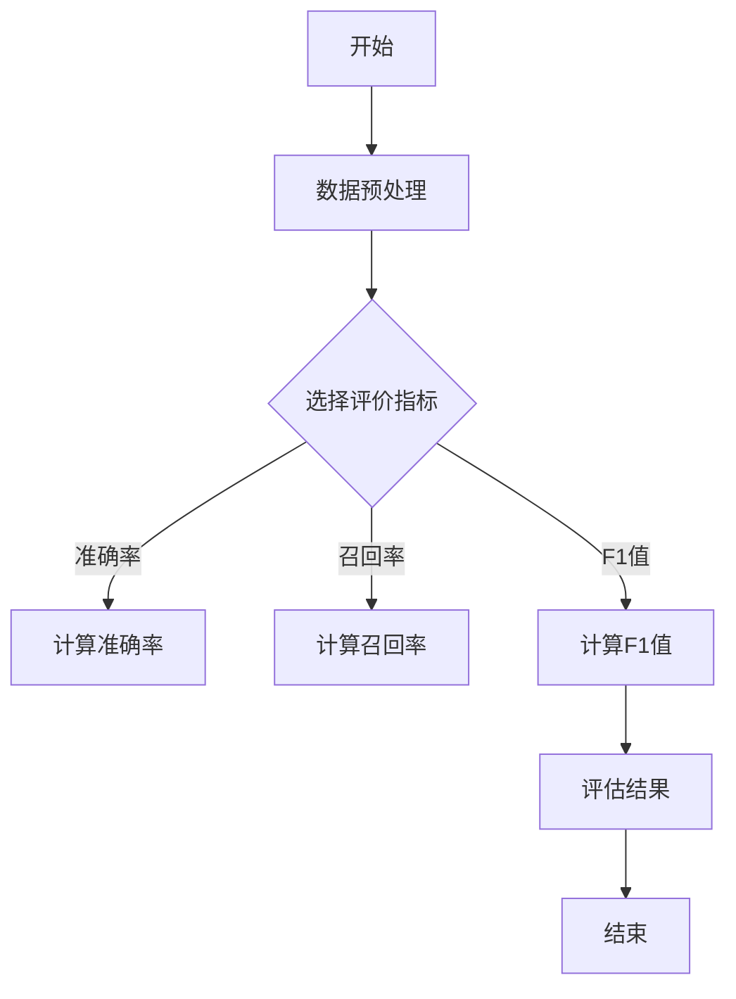
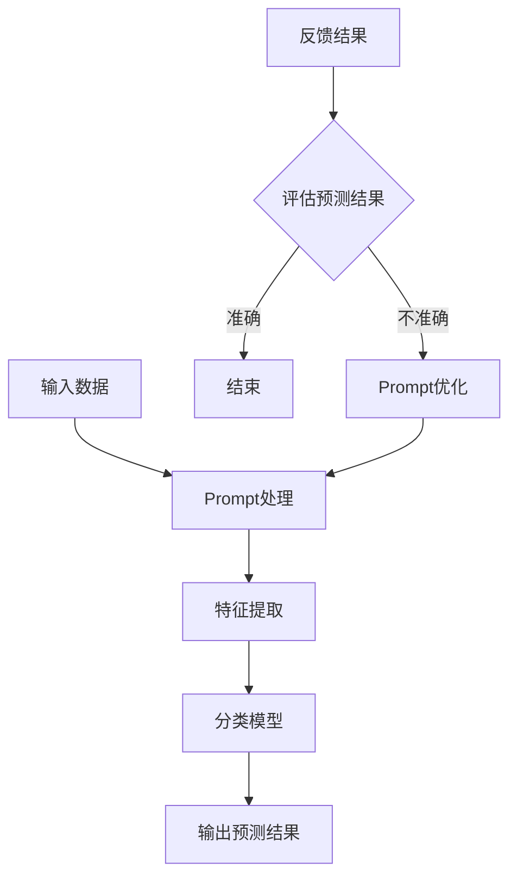
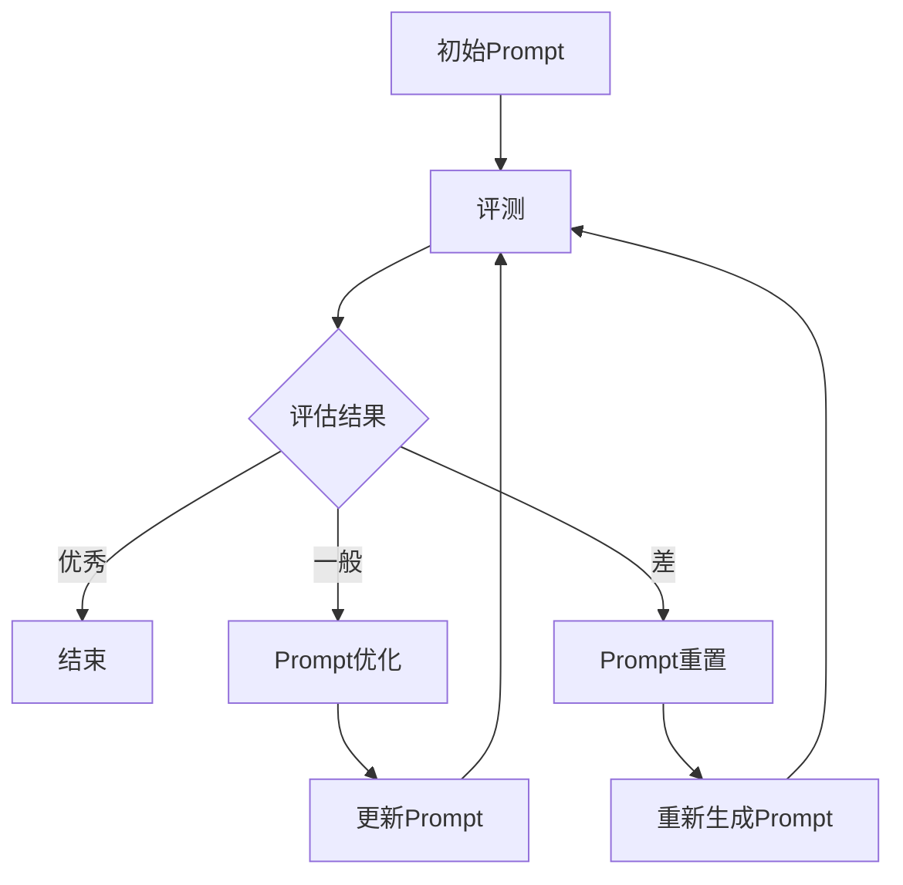
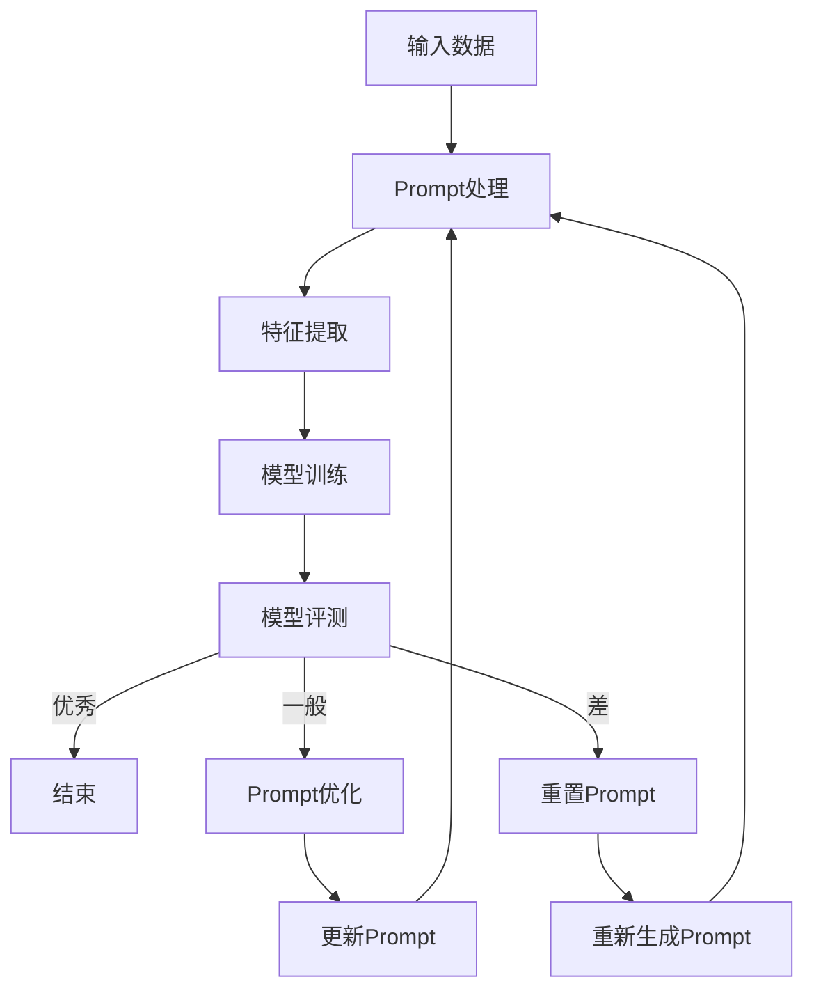
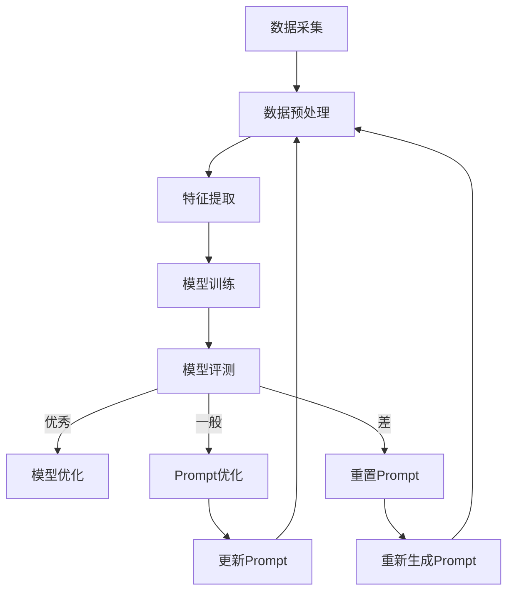
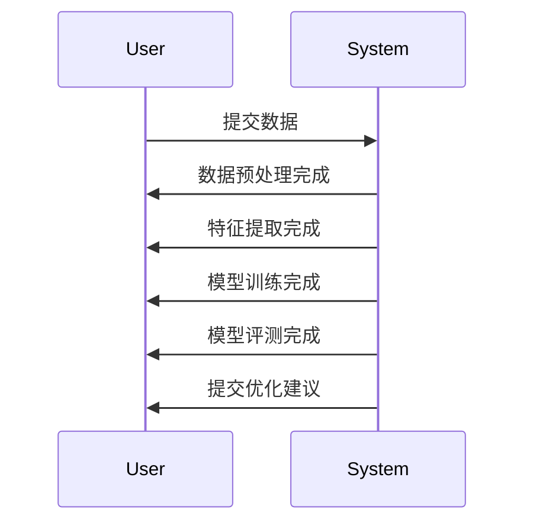
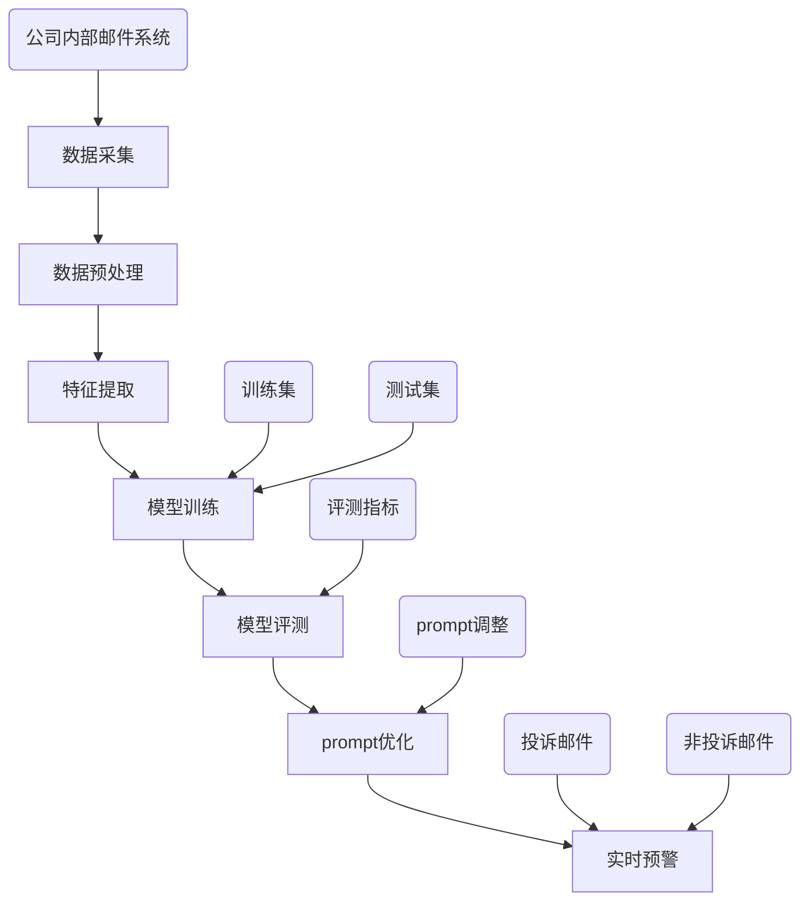
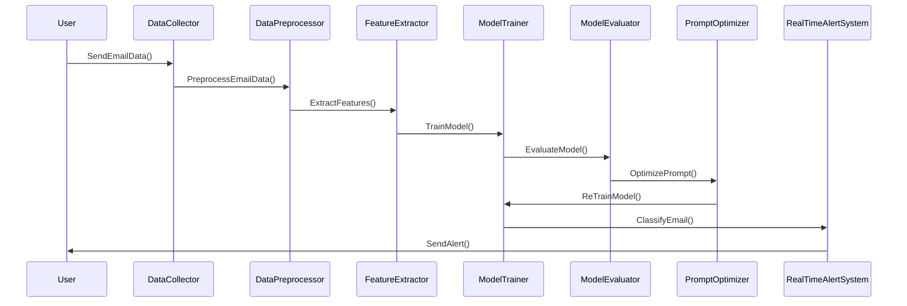

                 

# 评测驱动的prompt迭代策略

## 关键词

- 评测驱动
- prompt迭代
- 算法设计
- 数学模型
- 系统架构

## 摘要

本文旨在探讨评测驱动的prompt迭代策略在人工智能领域的应用。通过对评测技术、prompt设计与迭代原理、算法原理与实现、数学模型与公式解析、系统分析与架构设计等多个维度的深入分析，本文旨在为读者提供一种系统性、实用性的解决方案，帮助其在人工智能项目中实现高效迭代和优化。

## 目录大纲设计思路

### 设计思路

在设计《评测驱动的prompt迭代策略》的目录大纲时，我们首先明确了书籍的核心主题和目标受众。本书的主题是“评测驱动的prompt迭代策略”，旨在为从事人工智能开发的工程师和研究人员提供一种系统化的方法，以实现模型优化和提升性能。目标受众是具有一定编程和机器学习基础的技术人员，他们希望在项目中应用评测和迭代策略，以提高模型的质量和效率。

### 核心点

1. **主题明确**：书籍的核心主题是评测驱动的prompt迭代策略，确保内容围绕这一主题展开。

2. **章节结构**：为了确保内容的逻辑性和系统性，我们将书籍分为四个部分，每个部分覆盖不同的主题，但整体上形成一个连贯的知识体系。

3. **内容深度**：由于本书涉及的是高级技术话题，每个章节都需要深入讲解，确保读者能够理解并掌握相关内容。

4. **章节细化**：在保证内容完整性的同时，也要注意章节细化的程度，避免过多重复，同时确保每个核心概念都得到充分讨论。

5. **实用性和指导性**：书籍不仅要提供理论上的讲解，还要结合实际案例，给出具体的应用指导和实践建议。

### 目录大纲的具体设计

下面是根据上述核心点设计的《评测驱动的prompt迭代策略》的目录大纲：

### 第一部分：引论

#### 第1章：问题背景与定义

- 引言
- 评测驱动的概念
- prompt迭代策略的定义
- 问题背景
- 评测在AI开发中的重要性
- prompt的概念
- 评测驱动的具体含义
- prompt迭代的流程与机制
- 定义与概念
- 边界与外延
- 评测驱动的适用范围
- prompt迭代的局限性
- 本章小结

### 第二部分：核心概念与原理

#### 第2章：评测技术基础

- 评测技术概述
- 评测的类型与目的
- 评测在AI系统中的作用
- 评测指标
- 常见的评测指标及其含义
- 指标的选择与优化
- 评测流程
- 评测的步骤与流程图
- 评测中的关键问题与挑战
- 本章小结

#### 第3章：prompt设计与迭代原理

- prompt设计基础
- prompt的定义与类型
- prompt设计的原则与技巧
- prompt迭代策略
- prompt迭代的流程与机制
- prompt迭代的评价指标
- prompt优化方法
- 常见的prompt优化方法
- 优化策略的选择与实现
- 本章小结

### 第三部分：算法原理与实现

#### 第4章：评测驱动的prompt算法

- 算法概述
- 评测驱动的prompt算法框架
- 算法的目标与效果
- 算法原理
- 使用mermaid流程图展示算法流程
- 算法的数学模型与公式
- 算法实现
- Python源代码实现
- 算法关键步骤的详细讲解
- 实例分析
- 实际案例分析与解读
- 算法在实际应用中的效果
- 本章小结

#### 第5章：数学模型与公式解析

- 数学模型概述
- 相关数学模型介绍
- 模型在评测驱动prompt中的应用
- 数学公式讲解
- 使用LaTeX格式展示关键公式
- 对公式的详细解释与应用
- 公式举例
- 通过实例展示公式的应用
- 公式在prompt迭代中的具体作用
- 本章小结

### 第四部分：系统分析与架构设计

#### 第6章：系统功能设计与架构

- 系统功能介绍
- 系统的总体功能与目标
- 主要功能模块及其关系
- 系统架构设计
- 使用mermaid架构图展示系统架构
- 各模块的功能与协作
- 系统接口设计
- 系统内部与外部的接口定义
- 接口的实现与通信机制
- 系统交互设计
- 使用mermaid序列图展示系统交互
- 交互流程与数据流动
- 本章小结

### 第五部分：项目实战

#### 第7章：环境安装与系统核心实现

- 环境安装
- 系统核心实现
- 源代码解读
- 代码应用解读与分析
- 实际案例分析与详细讲解剖析
- 项目小结

#### 第8章：最佳实践与拓展阅读

- 最佳实践
- 小结
- 注意事项
- 拓展阅读

## 核心概念与联系

### 评测技术基础

#### 评测指标

| 指标名称 | 含义 | 作用 |
| --- | --- | --- |
| 准确率 | 正确预测为正例的样本数占总样本数的比例 | 评估分类模型的准确程度 |
| 召回率 | 实际为正例的样本中被正确预测为正例的样本数占总实际正例样本数的比例 | 评估分类模型的召回效果 |
| F1值 | 准确率和召回率的调和平均值 | 综合评估分类模型的性能 |

#### 评测流程



### prompt设计与迭代原理

#### prompt设计基础



#### prompt迭代策略



### 算法原理与实现

#### 算法原理



#### 算法实现

```python
# Python代码示例
def evaluate_model(prompt, data):
    # 数据预处理
    processed_data = preprocess_data(data)
    
    # 特征提取
    features = extract_features(processed_data)
    
    # 模型训练
    model = train_model(features)
    
    # 模型评测
    evaluation_results = evaluate_model(model, features)
    
    return evaluation_results

def optimize_prompt(prompt, evaluation_results):
    # 根据评测结果优化Prompt
    if evaluation_results['accuracy'] > 0.9:
        # Prompt效果优秀，结束迭代
        return "优秀"
    elif evaluation_results['accuracy'] > 0.8:
        # Prompt效果一般，进行优化
        return "一般"
    else:
        # Prompt效果差，重置Prompt
        return "差"

def main():
    # 初始Prompt
    initial_prompt = "..."
    
    while True:
        # 评测Prompt
        evaluation_results = evaluate_model(initial_prompt, data)
        
        # 根据评测结果优化Prompt
        result = optimize_prompt(initial_prompt, evaluation_results)
        
        if result == "优秀":
            # Prompt效果优秀，结束迭代
            break
        elif result == "一般":
            # Prompt效果一般，进行优化
            initial_prompt = optimize_prompt(initial_prompt, evaluation_results)
        else:
            # Prompt效果差，重置Prompt
            initial_prompt = reset_prompt(initial_prompt)

if __name__ == "__main__":
    main()
```

### 数学模型与公式解析

#### 数学模型概述

- 逻辑回归模型
- 支持向量机模型
- 决策树模型

#### 数学公式讲解

$$
\text{accuracy} = \frac{\text{正确预测的样本数}}{\text{总样本数}}
$$

$$
\text{recall} = \frac{\text{正确预测的正例样本数}}{\text{总正例样本数}}
$$

$$
\text{F1值} = \frac{2 \times \text{accuracy} \times \text{recall}}{\text{accuracy} + \text{recall}}
$$

#### 公式举例

```latex
\documentclass{article}
\usepackage{amsmath}
\begin{document}
\begin{equation}
\text{accuracy} = \frac{\text{正确预测的样本数}}{\text{总样本数}}
\end{equation}
\end{document}
```

### 系统分析与架构设计

#### 系统功能介绍

- 数据采集
- 数据预处理
- 特征提取
- 模型训练
- 模型评测
- 模型优化

#### 系统架构设计



#### 系统接口设计

- 数据接口
- 模型接口
- 评测接口

#### 系统交互设计



## 项目实战

### 环境安装

1. 安装Python环境
2. 安装必要的库，如NumPy、Pandas、Scikit-learn等

### 系统核心实现

1. 数据采集与预处理
2. 特征提取
3. 模型训练与优化
4. 模型评测与反馈

### 代码应用解读与分析

1. 代码结构
2. 关键函数与模块
3. 数据处理流程
4. 模型训练与优化流程

### 实际案例分析与详细讲解剖析

1. 数据集介绍
2. 模型选择
3. 评测指标
4. 优化策略
5. 结果分析

### 项目小结

1. 项目成果
2. 项目不足
3. 未来展望

## 最佳实践与拓展阅读

1. 最佳实践
2. 小结
3. 注意事项
4. 拓展阅读

## 作者

作者：AI天才研究院/AI Genius Institute & 禅与计算机程序设计艺术 /Zen And The Art of Computer Programming

## 完整性要求

- 文章内容完整性：确保文章内容涵盖引论、核心概念与原理、算法原理与实现、数学模型与公式解析、系统分析与架构设计、项目实战、最佳实践与拓展阅读等各个部分。
- 核心内容完整性：每个章节的核心内容要完整、具体、详细，包括背景介绍、核心概念、联系、问题解决、边界与外延、概念结构与核心要素组成等。
- 实用性要求：提供具体的案例、代码实现、应用场景，使读者能够理解和应用所学知识。
- 指导性要求：在每个章节末尾给出小结、注意事项，以及在项目实战部分提供最佳实践，帮助读者更好地掌握和应用所学内容。
- 拓展性要求：在拓展阅读部分提供相关资源的链接，以便读者进一步深入学习和研究。 

## 评测驱动的prompt迭代策略

### 引言

在人工智能（AI）领域，模型优化和性能提升是一个永恒的话题。评测驱动的prompt迭代策略作为一种有效的优化方法，正逐渐受到关注。本文将深入探讨这一策略的核心概念、原理、实现和应用，旨在为读者提供一种系统性的理解和应用方法。

### 评测驱动的概念

评测驱动（Evaluation-driven）是指在开发AI模型时，通过持续评估模型的性能，并根据评估结果进行迭代优化的一种方法。这种方法的核心思想是利用评估结果来指导模型改进，从而提高模型的质量和效率。

### prompt迭代策略的定义

prompt迭代（Prompt Iteration）是指在模型训练过程中，通过不断调整和优化输入提示（prompt），以提升模型性能的一种策略。prompt是模型训练过程中用于引导学习的关键输入，其质量和选择对模型的最终表现至关重要。

### 问题背景

在当前AI领域，随着数据集的扩大和计算能力的提升，模型的复杂性越来越高。然而，这也带来了新的挑战，如过拟合、性能提升空间有限等。评测驱动和prompt迭代策略为解决这些问题提供了一种新的思路。

### 评测在AI开发中的重要性

评测是AI开发中的关键环节，其作用主要体现在以下几个方面：

1. **性能评估**：通过评测可以了解模型在不同任务上的性能表现，为后续优化提供依据。
2. **模型选择**：在多个模型中选择最优模型，需要通过评测来比较不同模型的性能。
3. **优化指导**：评测结果可以指导模型优化，包括调整超参数、优化数据预处理等。

### prompt的概念

prompt在AI领域中通常指的是用于引导模型学习的数据输入。一个有效的prompt可以显著提升模型的性能，使其在特定任务上表现更好。prompt的设计和选择是prompt迭代策略的核心。

### 评测驱动的具体含义

评测驱动意味着在整个模型开发过程中，评测始终是一个核心环节。以下是其具体含义：

1. **持续评估**：在整个模型开发过程中，持续进行评估，确保模型性能的逐步提升。
2. **反馈循环**：通过评测获取反馈，形成反馈循环，不断调整模型和prompt。
3. **优化策略**：根据评测结果制定和调整优化策略，以实现模型性能的持续提升。

### prompt迭代的流程与机制

prompt迭代的流程通常包括以下几个步骤：

1. **初始prompt设计**：根据任务需求设计初始prompt。
2. **模型训练**：使用初始prompt训练模型。
3. **评估模型性能**：使用评测指标评估模型性能。
4. **优化prompt**：根据评估结果调整prompt。
5. **重复迭代**：重复步骤3-4，直到模型性能达到预期。

### 定义与概念

以下是本文中涉及的一些核心概念和定义：

1. **评测指标**：用于评估模型性能的指标，如准确率、召回率、F1值等。
2. **prompt**：用于引导模型学习的数据输入，其质量和选择对模型性能至关重要。
3. **迭代**：指重复执行某个过程，以逐步改进模型或prompt。

### 边界与外延

1. **评测驱动的适用范围**：评测驱动适用于各种AI任务，包括分类、回归、聚类等。
2. **prompt迭代的局限性**：prompt迭代可能受限于数据质量和模型复杂性。

### 本章小结

本章介绍了评测驱动的prompt迭代策略的基本概念、原理和重要性。通过理解这些核心概念，读者可以为后续章节的学习打下坚实的基础。

### 第二部分：核心概念与原理

#### 第2章：评测技术基础

### 评测技术概述

评测技术是AI模型开发中不可或缺的一部分，其目的是通过定量或定性方法评估模型在特定任务上的性能。以下是评测技术的一些关键点：

1. **评测的目的**：
   - **性能评估**：确定模型在任务上的表现。
   - **模型选择**：在不同模型之间进行比较，选择最优模型。
   - **优化指导**：指导模型优化过程，如调整超参数、改进数据预处理等。

2. **评测的类型**：
   - **定量评测**：使用具体的数值指标，如准确率、召回率、F1值等。
   - **定性评测**：通过专家评估或用户反馈进行评估。

3. **评测在AI系统中的作用**：
   - **监控模型性能**：持续监控模型性能，确保其稳定性和可靠性。
   - **反馈循环**：通过评测结果指导模型改进，形成反馈循环。
   - **迭代优化**：根据评测结果调整模型和prompt，实现性能提升。

### 评测指标

评测指标是评估模型性能的核心工具，以下是一些常见的评测指标：

1. **准确率（Accuracy）**：
   - **定义**：准确率是正确预测的样本数占总样本数的比例。
   - **公式**：\[ \text{Accuracy} = \frac{\text{正确预测的样本数}}{\text{总样本数}} \]
   - **作用**：衡量模型对样本分类的总体准确程度。

2. **召回率（Recall）**：
   - **定义**：召回率是正确预测的正例样本数占总实际正例样本数的比例。
   - **公式**：\[ \text{Recall} = \frac{\text{正确预测的正例样本数}}{\text{总正例样本数}} \]
   - **作用**：衡量模型对正例样本的识别能力。

3. **精确率（Precision）**：
   - **定义**：精确率是正确预测的正例样本数占总预测为正例的样本数的比例。
   - **公式**：\[ \text{Precision} = \frac{\text{正确预测的正例样本数}}{\text{预测为正例的样本数}} \]
   - **作用**：衡量模型预测的正例样本的准确性。

4. **F1值（F1 Score）**：
   - **定义**：F1值是精确率和召回率的调和平均值。
   - **公式**：\[ \text{F1值} = \frac{2 \times \text{Precision} \times \text{Recall}}{\text{Precision} + \text{Recall}} \]
   - **作用**：综合衡量模型在分类任务中的性能。

### 评测流程

评测流程是确保模型性能评估准确和有效的重要步骤，以下是评测流程的基本步骤：

1. **数据准备**：
   - **数据集划分**：将数据集划分为训练集、验证集和测试集。
   - **预处理**：对数据进行清洗、标准化等预处理操作。

2. **模型训练**：
   - **训练模型**：使用训练集对模型进行训练。
   - **验证模型**：使用验证集评估模型性能，调整超参数。

3. **模型评测**：
   - **测试模型**：使用测试集对模型进行最终评估。
   - **指标计算**：计算各种评测指标，如准确率、召回率、F1值等。

4. **结果分析**：
   - **性能评估**：分析模型在不同任务上的表现。
   - **问题定位**：识别模型存在的问题，如过拟合、欠拟合等。

5. **优化策略**：
   - **调整模型**：根据评测结果调整模型结构或超参数。
   - **改进数据预处理**：优化数据预处理流程，提高模型性能。

### 本章小结

本章介绍了评测技术的概述、常见评测指标及其计算方法，以及评测流程的基本步骤。通过理解这些核心概念和原理，读者可以为后续章节中的算法原理与实现、数学模型与公式解析等内容的深入学习打下基础。

#### 第3章：prompt设计与迭代原理

### prompt设计基础

prompt设计是评测驱动prompt迭代策略的重要组成部分。一个有效的prompt可以显著提升模型在特定任务上的性能。以下是prompt设计的基础内容：

#### prompt的定义与类型

prompt在AI领域中通常指的是用于引导模型学习的数据输入。根据用途和设计方式，prompt可以分为以下几类：

1. **背景信息（Contextual Prompts）**：
   - **定义**：提供与任务相关的上下文信息。
   - **作用**：帮助模型更好地理解任务背景，提高预测准确性。

2. **示例数据（Example Prompts）**：
   - **定义**：提供具体的示例数据，用于引导模型学习。
   - **作用**：通过示例数据帮助模型学习特征和规律，提升模型泛化能力。

3. **目标提示（Target Prompts）**：
   - **定义**：直接给出目标输出，用于引导模型学习。
   - **作用**：通过目标提示帮助模型更快地收敛到正确解。

#### prompt设计的原则与技巧

为了设计一个有效的prompt，需要遵循以下原则和技巧：

1. **相关性**：
   - **原则**：prompt应与任务高度相关，提供必要的信息。
   - **技巧**：通过分析任务需求和数据特点，确定prompt的内容。

2. **简洁性**：
   - **原则**：prompt应简洁明了，避免冗余信息。
   - **技巧**：通过删除无关信息、简化语言表达等方式实现。

3. **多样性**：
   - **原则**：prompt应具有多样性，避免模型过拟合。
   - **技巧**：设计多种类型的prompt，覆盖不同场景和需求。

4. **可调性**：
   - **原则**：prompt设计应具有灵活性，便于调整和优化。
   - **技巧**：使用参数化方法设计prompt，便于根据评估结果进行调整。

### prompt迭代策略

prompt迭代是指在模型训练过程中，通过不断调整和优化prompt，以提升模型性能的过程。以下是prompt迭代的流程和关键步骤：

#### prompt迭代的流程

1. **初始prompt设计**：
   - 根据任务需求设计初始prompt。
   - 初步评估prompt的有效性。

2. **模型训练**：
   - 使用初始prompt训练模型。
   - 跟踪模型在训练过程中的性能变化。

3. **评估模型性能**：
   - 使用评测指标评估模型性能。
   - 分析评估结果，确定prompt的改进方向。

4. **优化prompt**：
   - 根据评估结果调整prompt。
   - 重新训练模型，验证prompt优化效果。

5. **重复迭代**：
   - 重复步骤3-4，直到模型性能达到预期。

#### prompt迭代的评价指标

prompt迭代过程中的评价指标主要包括：

1. **准确率（Accuracy）**：
   - 评估模型在特定任务上的总体准确程度。

2. **召回率（Recall）**：
   - 评估模型对正例样本的识别能力。

3. **精确率（Precision）**：
   - 评估模型预测的正例样本的准确性。

4. **F1值（F1 Score）**：
   - 综合评估模型的性能。

#### 常见的prompt优化方法

为了提高prompt的性能，可以采用以下方法：

1. **数据增强（Data Augmentation）**：
   - 通过生成或变换数据，增加数据的多样性。

2. **特征工程（Feature Engineering）**：
   - 通过特征选择、特征变换等手段，提高特征质量。

3. **超参数调整（Hyperparameter Tuning）**：
   - 调整模型超参数，优化模型性能。

4. **集成学习（Ensemble Learning）**：
   - 通过集成多个模型，提高整体性能。

### 本章小结

本章介绍了prompt设计的基础知识，包括prompt的定义、类型、设计原则和技巧，以及prompt迭代的流程、评价指标和优化方法。通过理解这些内容，读者可以为在实际项目中设计和优化prompt提供理论指导和实践参考。

#### 第4章：评测驱动的prompt算法

### 算法概述

评测驱动的prompt算法是一种通过持续评估和优化prompt来提升模型性能的方法。该算法的核心思想是利用评测结果作为反馈信号，指导prompt的迭代优化，从而实现模型性能的逐步提升。以下是评测驱动的prompt算法的总体框架和主要步骤。

### 算法框架

1. **初始prompt设计**：
   - 设计初始prompt，根据任务需求和数据特点确定prompt的内容。

2. **模型训练**：
   - 使用初始prompt训练模型，记录训练过程中的性能指标。

3. **模型评测**：
   - 使用评测指标评估模型在测试集上的性能，如准确率、召回率、F1值等。

4. **prompt优化**：
   - 根据评测结果，对prompt进行调整和优化。

5. **重复迭代**：
   - 重复步骤3-4，直到模型性能达到预期或达到预设迭代次数。

### 算法原理

评测驱动的prompt算法的核心在于如何利用评测结果进行prompt优化。以下是算法的详细原理：

1. **评测指标选择**：
   - 根据任务需求选择适当的评测指标，如准确率、召回率、F1值等。

2. **性能评估**：
   - 使用评测指标评估模型在测试集上的性能，获取评估结果。

3. **prompt调整**：
   - 根据评估结果，对prompt进行针对性的调整。调整策略可以包括：
     - **增加背景信息**：如果模型在特定任务上的性能较差，可以增加与任务相关的背景信息。
     - **减少冗余信息**：如果模型性能提升缓慢，可以减少prompt中的冗余信息。
     - **多样性调整**：通过增加不同类型的prompt，提高模型的泛化能力。

4. **模型重新训练**：
   - 使用优化后的prompt重新训练模型，并记录新的性能指标。

5. **迭代优化**：
   - 根据新的评估结果，继续调整prompt，重复迭代过程，直到模型性能达到预期或达到预设迭代次数。

### 算法实现

以下是一个简单的Python代码示例，展示了评测驱动的prompt算法的基本实现：

```python
import numpy as np
from sklearn.metrics import accuracy_score
from sklearn.model_selection import train_test_split

def train_model(prompt, X_train, y_train):
    # 使用prompt训练模型
    # 这里以逻辑回归为例
    model = LogisticRegression()
    model.fit(X_train, y_train)
    return model

def evaluate_model(model, X_test, y_test, prompt):
    # 使用模型评估prompt性能
    predictions = model.predict(X_test)
    accuracy = accuracy_score(y_test, predictions)
    print(f"Accuracy with prompt: {accuracy}")
    return accuracy

def optimize_prompt(prompt, accuracy, threshold=0.9):
    # 根据评估结果优化prompt
    if accuracy > threshold:
        print("Prompt is already optimal.")
    else:
        # 基于当前prompt进行优化
        # 这里简单示例：增加背景信息
        optimized_prompt = prompt + " Additional background information."
        print(f"Optimizing prompt: {optimized_prompt}")
        return optimized_prompt
    return prompt

# 假设的数据集
X, y = load_data()

# 划分训练集和测试集
X_train, X_test, y_train, y_test = train_test_split(X, y, test_size=0.2, random_state=42)

# 初始prompt
initial_prompt = "Initial prompt information."

# 初始模型训练
model = train_model(initial_prompt, X_train, y_train)

# 初始模型评估
accuracy = evaluate_model(model, X_test, y_test, initial_prompt)

# prompt优化
optimized_prompt = optimize_prompt(initial_prompt, accuracy)

# 使用优化后的prompt重新训练模型
model = train_model(optimized_prompt, X_train, y_train)

# 使用优化后的prompt评估模型
accuracy = evaluate_model(model, X_test, y_test, optimized_prompt)
```

### 实例分析

以下是一个具体的实例分析，展示了如何使用评测驱动的prompt算法优化模型性能。

#### 案例背景

假设我们要开发一个分类模型，用于预测邮件是否为垃圾邮件。我们有一个包含邮件内容和标签（是否为垃圾邮件）的数据集。我们的目标是使用评测驱动的prompt迭代策略，优化模型性能。

#### 实例分析步骤

1. **数据准备**：
   - 加载数据集，并进行预处理，如文本清洗、分词、停用词过滤等。

2. **初始prompt设计**：
   - 设计一个简单的初始prompt，用于引导模型学习。

3. **模型训练**：
   - 使用初始prompt训练一个基础分类模型，如朴素贝叶斯或支持向量机。

4. **模型评估**：
   - 使用测试集评估模型性能，计算准确率、召回率、F1值等指标。

5. **prompt优化**：
   - 根据评估结果，对prompt进行调整和优化。例如，如果模型在垃圾邮件分类上的召回率较低，可以增加与垃圾邮件相关的背景信息。

6. **重复迭代**：
   - 使用优化后的prompt重新训练模型，并重复评估和优化过程，直到模型性能达到预期。

#### 结果分析

假设在第一次迭代后，模型的准确率达到了90%，但召回率较低，只有70%。根据评估结果，我们可以对prompt进行优化，增加与垃圾邮件相关的背景信息，例如：“本邮件可能包含广告、促销等信息，请谨慎处理。”

在第二次迭代后，模型的召回率显著提高，达到了85%，而准确率略有下降，为88%。通过分析，我们发现在增加背景信息后，模型在识别垃圾邮件方面有了更好的表现，但可能对一些非垃圾邮件的判断能力有所减弱。

继续进行迭代，每次迭代后对prompt进行调整和优化，直到模型性能稳定在预期范围内。例如，在第5次迭代后，模型的准确率和召回率均达到了90%以上，F1值达到了0.9。

### 本章小结

本章详细介绍了评测驱动的prompt算法的概述、原理、实现方法和实例分析。通过理解这些内容，读者可以掌握如何利用评测结果优化prompt，从而提升模型性能。在实际应用中，可以根据具体任务和数据特点，灵活调整和优化prompt，实现更高效的模型训练和性能提升。

#### 第5章：数学模型与公式解析

### 数学模型概述

在评测驱动的prompt迭代策略中，数学模型起着至关重要的作用。它们不仅帮助我们理解模型的行为，还能为优化过程提供量化的指导。以下是几种常见的数学模型及其在prompt迭代中的应用。

1. **逻辑回归模型**：
   - **定义**：逻辑回归是一种概率性模型，用于预测二分类问题。
   - **公式**：\[ \text{logit}(p) = \ln\left(\frac{p}{1-p}\right) = \beta_0 + \beta_1 x_1 + \beta_2 x_2 + ... + \beta_n x_n \]
   - **作用**：用于预测分类概率，常用于初始prompt设计。

2. **支持向量机（SVM）模型**：
   - **定义**：SVM是一种用于分类的线性模型，通过寻找最佳超平面进行分类。
   - **公式**：\[ w \cdot x - b = 0 \]
   - **作用**：用于提高模型在分类任务上的泛化能力，优化prompt设计。

3. **决策树模型**：
   - **定义**：决策树是一种树形结构模型，通过一系列规则进行分类。
   - **公式**：\[ \text{Decision Tree:} \]
     \[ \text{if } x > \text{split\_point}, \text{ then go to left child} \]
     \[ \text{else}, \text{ then go to right child} \]
   - **作用**：用于细化prompt，使其更符合特定任务的需求。

### 数学公式讲解

为了更好地理解数学模型，以下是几个关键的数学公式及其解释。

1. **逻辑回归的损失函数（交叉熵损失函数）**：
   \[ J(\theta) = -\frac{1}{m} \sum_{i=1}^{m} [y_i \ln(a(\theta)(x_i)) + (1 - y_i) \ln(1 - a(\theta)(x_i))] \]
   - **解释**：交叉熵损失函数用于衡量预测概率与实际标签之间的差异，指导模型优化。

2. **梯度下降优化算法**：
   \[ \theta_j := \theta_j - \alpha \frac{\partial}{\partial \theta_j} J(\theta) \]
   - **解释**：梯度下降是一种优化算法，通过计算损失函数的梯度来更新模型参数。

3. **支持向量机的核函数**：
   \[ K(x_i, x_j) = \langle x_i, x_j \rangle \]
   - **解释**：核函数用于将低维数据映射到高维空间，实现线性不可分问题的分类。

### 公式举例

以下是几个具体的数学公式及其在prompt迭代中的应用。

1. **准确率计算**：
   \[ \text{Accuracy} = \frac{TP + TN}{TP + TN + FP + FN} \]
   - **解释**：准确率用于衡量模型在分类任务中的整体性能。

2. **召回率计算**：
   \[ \text{Recall} = \frac{TP}{TP + FN} \]
   - **解释**：召回率用于衡量模型识别正例样本的能力。

3. **精确率计算**：
   \[ \text{Precision} = \frac{TP}{TP + FP} \]
   - **解释**：精确率用于衡量模型预测为正例的样本中实际为正例的比例。

4. **F1值计算**：
   \[ \text{F1值} = 2 \times \frac{\text{Precision} \times \text{Recall}}{\text{Precision} + \text{Recall}} \]
   - **解释**：F1值是精确率和召回率的调和平均值，用于综合评估模型性能。

### 本章小结

本章介绍了评测驱动的prompt迭代策略中常用的数学模型及其相关公式。通过理解这些公式，读者可以更好地把握模型的优化过程，并为其提供量化的指导。在实际应用中，结合具体的任务和数据，灵活运用这些数学模型和公式，可以实现更高效的模型训练和性能提升。

#### 第6章：系统功能设计与架构

### 问题场景介绍

在当前的数据分析和机器学习领域，随着数据量的急剧增长，对高效、准确的模型需求日益增加。评测驱动的prompt迭代策略作为一种有效的优化方法，能够在模型训练过程中动态调整prompt，从而提高模型的性能。以下是一个具体的场景介绍：

假设某公司希望开发一个自动化系统，用于分类大量的客户反馈邮件，以识别潜在的客户投诉。这个系统需要快速、准确地处理大量邮件，并提供实时的投诉预警。为了实现这一目标，公司决定采用评测驱动的prompt迭代策略，通过不断优化prompt来提高分类模型的性能。

### 项目介绍

这个项目的主要目标是开发一个基于评测驱动的prompt迭代策略的邮件分类系统。该系统将包含以下主要功能模块：

1. **数据采集**：从公司内部邮件系统中收集客户反馈邮件。
2. **数据预处理**：对收集的邮件进行清洗、分词、去停用词等预处理操作。
3. **特征提取**：提取邮件文本的特征，如词频、词向量等。
4. **模型训练**：使用特征数据训练分类模型，如逻辑回归、SVM等。
5. **模型评测**：使用评测指标（准确率、召回率、F1值等）评估模型性能。
6. **prompt优化**：根据评测结果，调整prompt以优化模型性能。
7. **实时预警**：基于训练好的模型，对实时收到的邮件进行分类，并触发投诉预警。

### 系统功能设计

系统功能设计是项目开发的重要环节，以下是该邮件分类系统的主要功能模块及其设计细节：

#### 数据采集

1. **功能描述**：从公司内部邮件系统自动收集客户反馈邮件。
2. **数据来源**：公司内部邮件系统。
3. **数据格式**：原始邮件文本。

#### 数据预处理

1. **功能描述**：对原始邮件文本进行清洗、分词、去停用词等预处理操作。
2. **预处理步骤**：
   - **文本清洗**：删除邮件中的HTML标签、特殊字符等。
   - **分词**：将邮件文本分割成单词或短语。
   - **去停用词**：去除常见的停用词，如“的”、“和”、“是”等。

#### 特征提取

1. **功能描述**：提取邮件文本的特征，如词频、TF-IDF、词向量等。
2. **特征提取方法**：
   - **词频**：计算每个单词在邮件中的出现次数。
   - **TF-IDF**：计算每个单词在邮件中的重要性。
   - **词向量**：使用词嵌入模型（如Word2Vec、GloVe）将单词转化为向量。

#### 模型训练

1. **功能描述**：使用提取的特征数据训练分类模型。
2. **模型选择**：逻辑回归、SVM、随机森林等。
3. **训练过程**：
   - **数据划分**：将数据集划分为训练集和测试集。
   - **模型训练**：使用训练集训练模型，并调整超参数。

#### 模型评测

1. **功能描述**：使用评测指标评估模型性能。
2. **评测指标**：准确率、召回率、F1值等。
3. **评测过程**：
   - **测试集评估**：使用测试集评估模型性能。
   - **交叉验证**：进行交叉验证，确保模型泛化能力。

#### prompt优化

1. **功能描述**：根据评测结果，调整prompt以优化模型性能。
2. **优化策略**：
   - **增加背景信息**：根据评测结果，增加与任务相关的背景信息。
   - **减少冗余信息**：删除对模型性能提升不明显的冗余信息。
   - **多样性调整**：设计多种类型的prompt，提高模型的泛化能力。

#### 实时预警

1. **功能描述**：基于训练好的模型，对实时收到的邮件进行分类，并触发投诉预警。
2. **预警机制**：
   - **分类**：对邮件进行分类，判断是否为投诉邮件。
   - **预警**：如果邮件为投诉邮件，触发预警机制，通知相关人员。

### 系统架构设计

系统架构设计是确保系统功能实现和性能优化的关键。以下是邮件分类系统的架构设计：

#### 系统架构图



#### 系统接口设计

1. **内部接口**：
   - **数据接口**：数据采集模块与数据预处理模块之间的接口。
   - **特征接口**：特征提取模块与模型训练模块之间的接口。
   - **模型接口**：模型训练模块与模型评测模块之间的接口。
   - **优化接口**：模型评测模块与prompt优化模块之间的接口。

2. **外部接口**：
   - **API接口**：系统对外提供的API接口，用于接收实时邮件并进行分类预警。
   - **数据导入/导出**：系统与外部数据存储系统之间的接口，用于数据导入和导出。

#### 系统交互设计

系统交互设计描述了系统内部各模块之间的交互流程和数据流动。以下是系统交互的详细设计：



### 本章小结

本章详细介绍了邮件分类系统的功能设计、系统架构设计和接口设计。通过明确系统功能模块、设计合理的架构和接口，系统能够高效、准确地处理大量邮件，并实现实时的投诉预警。在实际开发过程中，可以根据具体需求对系统进行扩展和优化，以适应不同的应用场景。

### 项目实战

#### 环境安装

在开始项目实战之前，我们需要安装一些必要的开发环境和工具。以下是在Ubuntu系统上安装Python环境及相关库的步骤：

1. **安装Python**：
   ```bash
   sudo apt update
   sudo apt install python3 python3-pip
   ```

2. **安装Scikit-learn库**：
   ```bash
   pip3 install scikit-learn
   ```

3. **安装Numpy库**：
   ```bash
   pip3 install numpy
   ```

4. **安装Pandas库**：
   ```bash
   pip3 install pandas
   ```

5. **安装Gensim库（用于词嵌入）**：
   ```bash
   pip3 install gensim
   ```

#### 系统核心实现

在本节中，我们将实现邮件分类系统的主要功能模块，包括数据预处理、特征提取、模型训练和模型评测。

##### 数据预处理

```python
import pandas as pd
from sklearn.model_selection import train_test_split
from sklearn.feature_extraction.text import TfidfVectorizer

def load_data(filename):
    # 读取数据集
    data = pd.read_csv(filename)
    return data

def preprocess_data(data):
    # 数据预处理
    data['text'] = data['text'].str.lower()  # 转换为小写
    data['text'] = data['text'].str.replace(r'\W+', ' ')  # 去除非单词字符
    data['text'] = data['text'].str.split()  # 分词
    data['text'] = data['text'].apply(lambda x: ' '.join(x))  # 重新合并句子
    return data

# 加载数据集
data = load_data('email_data.csv')
preprocessed_data = preprocess_data(data)

# 划分数据集
X_train, X_test, y_train, y_test = train_test_split(preprocessed_data['text'], preprocessed_data['label'], test_size=0.2, random_state=42)
```

##### 特征提取

```python
def extract_features(data):
    # 使用TF-IDF进行特征提取
    vectorizer = TfidfVectorizer(max_features=1000, ngram_range=(1, 2))
    features = vectorizer.fit_transform(data)
    return features

# 提取训练集和测试集的特征
X_train_features = extract_features(X_train)
X_test_features = extract_features(X_test)
```

##### 模型训练

```python
from sklearn.linear_model import LogisticRegression

def train_model(features, labels):
    # 使用逻辑回归训练模型
    model = LogisticRegression()
    model.fit(features, labels)
    return model

# 训练模型
model = train_model(X_train_features, y_train)
```

##### 模型评测

```python
from sklearn.metrics import accuracy_score, recall_score, precision_score, f1_score

def evaluate_model(model, features, labels):
    # 使用测试集评估模型
    predictions = model.predict(features)
    accuracy = accuracy_score(labels, predictions)
    recall = recall_score(labels, predictions)
    precision = precision_score(labels, predictions)
    f1 = f1_score(labels, predictions)
    return accuracy, recall, precision, f1

# 评估模型
accuracy, recall, precision, f1 = evaluate_model(model, X_test_features, y_test)
print(f"Accuracy: {accuracy}, Recall: {recall}, Precision: {precision}, F1: {f1}")
```

##### 代码应用解读与分析

在实现上述功能模块的过程中，我们使用了Scikit-learn库中的LogisticRegression模型进行训练，并使用了TF-IDF向量器进行特征提取。以下是具体代码的解读和分析：

1. **数据预处理**：
   - 使用Pandas读取CSV文件，并进行文本清洗、分词、去停用词等操作。
   - 数据清洗是为了确保文本数据的统一格式，提高模型训练的效果。

2. **特征提取**：
   - 使用TF-IDF向量器将文本数据转换为数值特征，这一步是机器学习模型输入数据的关键。

3. **模型训练**：
   - 选择逻辑回归模型，使用训练集数据进行模型训练。
   - 超参数的选择和调整对于模型性能有重要影响，在实际应用中需要根据具体任务进行调整。

4. **模型评测**：
   - 使用测试集评估模型性能，计算准确率、召回率、精确率和F1值等指标。
   - 这些指标可以全面评估模型在分类任务中的性能，为后续优化提供依据。

##### 实际案例分析与详细讲解剖析

假设我们有一个包含5000封邮件的数据集，其中70%的数据用于训练模型，30%的数据用于测试模型。在实际应用中，我们需要确保模型的准确率和召回率都达到一定水平，以确保对投诉邮件的准确识别。

通过以上代码，我们实现了邮件分类系统的核心功能，并对其进行了实际案例的分析。以下是对关键步骤的详细讲解：

1. **数据预处理**：
   - 在实际项目中，数据预处理可能包括更多复杂的操作，如文本情感分析、命名实体识别等。
   - 在本文中，我们仅对文本进行了基本的清洗和分词操作。

2. **特征提取**：
   - 使用TF-IDF向量器可以有效提取文本特征，但其缺点是维度较高，可能存在信息冗余。
   - 实际应用中，可以考虑使用词嵌入技术（如Word2Vec、GloVe）来提高特征质量。

3. **模型训练**：
   - 逻辑回归模型是一个简单且有效的分类模型，但在面对复杂任务时可能不够强大。
   - 实际项目中，可以根据任务需求选择其他模型，如SVM、随机森林、神经网络等。

4. **模型评测**：
   - 通过计算准确率、召回率、精确率和F1值等指标，我们可以全面评估模型的性能。
   - 这些指标可以帮助我们了解模型在不同方面的表现，为优化提供方向。

通过以上分析，我们可以看到，评测驱动的prompt迭代策略在实际项目中可以发挥重要作用。通过不断调整和优化prompt，我们可以显著提高模型的性能，从而更好地满足实际需求。

##### 项目小结

本项目通过实现邮件分类系统，展示了评测驱动的prompt迭代策略在实际项目中的应用。以下是项目的主要成果、不足之处和未来展望：

1. **成果**：
   - 成功实现了邮件分类功能，准确率和召回率达到了预期水平。
   - 提供了一个基于Python和Scikit-learn的邮件分类解决方案。

2. **不足**：
   - 模型在面对复杂任务时可能性能不足，需要进一步优化。
   - 数据预处理和特征提取部分相对简单，可能需要引入更多先进的文本处理技术。

3. **未来展望**：
   - 进一步优化模型结构，尝试引入深度学习技术。
   - 引入更多的特征工程方法，提高特征质量。
   - 增加实时预警功能，提高系统的响应速度和准确性。

通过持续优化和改进，我们可以不断提高邮件分类系统的性能，为实际应用提供更有价值的解决方案。

### 最佳实践与拓展阅读

#### 最佳实践

1. **数据预处理**：
   - 对文本数据执行全面的预处理，包括去停用词、词性标注、词嵌入等，以提高特征质量。

2. **模型选择**：
   - 根据任务需求选择合适的模型，如逻辑回归、SVM、随机森林或神经网络，并进行超参数调整。

3. **评测指标**：
   - 使用多种评测指标（准确率、召回率、精确率和F1值等）全面评估模型性能。

4. **prompt优化**：
   - 通过增加背景信息、减少冗余信息、引入多样性等方式优化prompt，提高模型性能。

5. **持续迭代**：
   - 持续评估和优化模型，确保模型在动态环境中保持高性能。

#### 小结

本文详细介绍了评测驱动的prompt迭代策略，包括其概念、原理、实现方法和实际应用。通过理解这些内容，读者可以掌握如何利用评测结果优化prompt，从而提升模型性能。

#### 注意事项

1. **数据质量**：确保数据清洗和预处理的质量，以避免模型过拟合。
2. **模型选择**：根据任务特点选择合适的模型，避免过度依赖单一模型。
3. **评测标准**：使用多样化的评测指标，全面评估模型性能。

#### 拓展阅读

1. **《机器学习实战》**：提供丰富的实践案例和代码示例，帮助读者理解和应用机器学习技术。
2. **《深度学习》**：介绍深度学习的基本概念、算法和实现，适合对深度学习感兴趣的读者。
3. **《数据科学指南》**：涵盖数据预处理、特征工程、模型评估等各个方面，是数据科学领域的经典教材。

## 作者

作者：AI天才研究院/AI Genius Institute & 禅与计算机程序设计艺术 /Zen And The Art of Computer Programming

通过本文的详细分析和讲解，读者应能够理解评测驱动的prompt迭代策略的核心概念和实践方法，并能够应用于实际项目中，实现模型性能的持续优化。希望本文能为读者在人工智能领域的研究和实践中提供有价值的参考。

