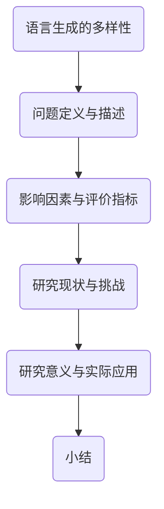
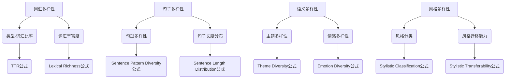
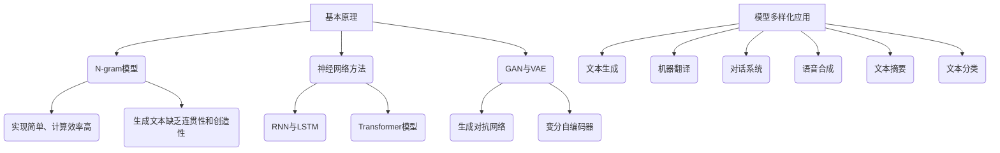
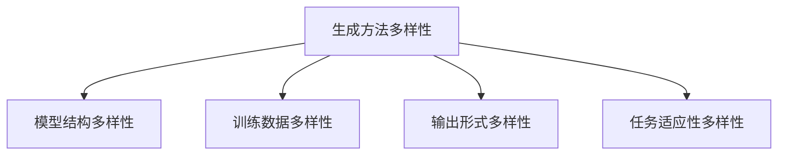
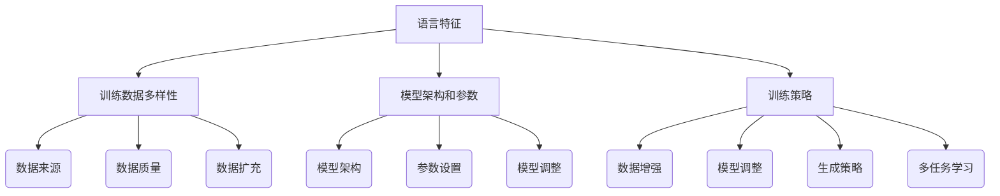
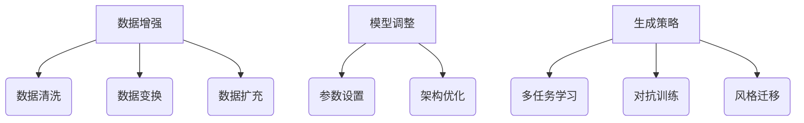
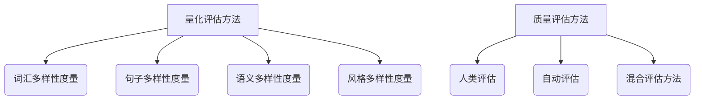

                 

### 第1章: 语言生成的多样性：问题背景与核心概念

在当今人工智能领域，语言生成模型（LLM，Language Generation Models）已经成为自然语言处理（NLP，Natural Language Processing）的重要研究方向。随着深度学习技术的不断进步，LLM在生成文本、对话系统、机器翻译等方面取得了显著成效。然而，语言生成的多样性问题仍然是一个挑战，尤其在评估LLM输出的丰富程度时，存在诸多难题。

#### 1.1 语言生成的多样性：问题定义与描述

语言生成的多样性，指的是在自然语言处理过程中，生成文本的多样性和独特性。具体而言，这包括以下几个方面：

1. **词汇多样性**：生成文本中应包含丰富的词汇，避免重复使用相同的词汇。
2. **句子多样性**：生成的句子应该结构各异，不局限于固定的句型。
3. **语义多样性**：生成文本应涵盖广泛的主题和意义，不局限于特定话题。
4. **风格多样性**：生成的文本应能模仿不同的写作风格，如正式、非正式、幽默等。

#### 1.2 语言生成的多样性：影响因素与评价指标

语言生成的多样性受多种因素影响，主要包括：

1. **训练数据多样性**：训练数据的多样性直接影响模型的生成能力。训练数据越丰富，模型生成的文本越多样化。
2. **模型架构与参数**：不同类型的模型和参数设置会导致生成的文本风格和内容有所不同。
3. **训练策略**：数据增强、模型调整等训练策略会影响生成的多样性。

评估语言生成的多样性，需要采用多种评价指标，如：

1. **词汇多样性度量**：如类型- Tokens 比率（Type-Token Ratio, TTR）等。
2. **句子多样性度量**：如句子长度分布、句型多样性等。
3. **语义多样性度量**：如主题分布、情感分析等。
4. **风格多样性度量**：如写作风格分类、风格迁移能力等。

#### 1.3 语言生成的多样性：研究现状与挑战

目前，针对语言生成多样性的研究已经取得了一些成果。例如，研究者提出了多种基于数据增强和模型调整的方法来提高生成的多样性。然而，仍存在以下挑战：

1. **评价标准不统一**：不同评价指标之间缺乏统一的标准，导致评估结果难以比较。
2. **计算复杂性**：多样性度量方法往往需要大量的计算资源，不适用于实时应用场景。
3. **领域适应性**：不同领域的语言生成任务对多样性的要求不同，需要针对特定领域进行优化。
4. **模型理解能力**：提高语言生成模型的多样性，需要模型具备更强的理解能力和创造力。

在接下来的章节中，我们将深入探讨语言生成模型的多样性，分析其影响因素和评估方法，并探讨如何优化语言生成模型的多样性。希望通过对这些问题的探讨，能为相关研究提供一些启示和思路。

#### 1.4 语言生成的多样性：研究意义与实际应用

语言生成的多样性在自然语言处理领域具有重要的研究意义和广泛的应用价值。以下从三个方面进行详细阐述：

首先，从研究意义来看，语言生成的多样性是自然语言处理领域的一个核心问题。它关系到模型生成文本的质量和实用性。一个具有多样性的生成模型能够生成更加丰富、生动、有趣的文本，从而提升用户体验。此外，多样性研究有助于揭示语言生成模型的内在机制和特性，推动自然语言处理技术的进步。

其次，从实际应用来看，语言生成的多样性在多个领域具有重要应用价值。例如：

1. **文本生成**：在新闻写作、文学创作、广告文案等领域，多样性的语言生成模型能够生成具有独特风格和内容的文本，满足不同用户的需求。
2. **对话系统**：在智能客服、虚拟助手等领域，多样性的生成模型能够使对话更加自然、丰富，提升用户满意度。
3. **机器翻译**：在翻译领域，多样性的生成模型能够生成多种风格的译文，满足不同文化和语境的需求。

最后，从未来发展趋势来看，随着深度学习和生成模型技术的不断发展，语言生成的多样性研究将会取得更多突破。例如，研究者可以探索更加有效的多样性度量方法，设计出能够自适应调整多样性的训练策略，甚至开发出具有创造力的生成模型。

总之，语言生成的多样性是一个充满挑战和机遇的研究领域。通过深入研究和探索，我们有望在提升模型生成文本质量、推动自然语言处理技术发展等方面取得重要突破。

#### 1.5 小结

本章主要介绍了语言生成的多样性问题，包括其定义、影响因素、评价指标以及研究现状和挑战。语言生成的多样性不仅是一个重要的研究课题，还在多个实际应用领域中发挥着关键作用。在接下来的章节中，我们将进一步探讨语言生成模型的多样性类型及其评估方法，分析多样性生成的影响因素，并探索优化策略。希望通过对这些问题的深入分析，能为相关研究提供有价值的参考。



```python
# 词汇多样性示例代码
def calculate_type_token_ratio(text):
    """
    计算文本的类型-词汇比率（TTR）。
    
    参数：
    text (str): 输入的文本。
    
    返回：
    type_token_ratio (float): 类型-词汇比率。
    """
    tokens = text.split()
    types = set(tokens)
    type_token_ratio = len(types) / len(tokens)
    return type_token_ratio

# 示例文本
example_text = "I love to read books. Books are my favorite way to learn."

# 计算类型-词汇比率
ttr = calculate_type_token_ratio(example_text)
print(f"The Type-Token Ratio for the example text is: {ttr:.2f}")

# 输出结果
# The Type-Token Ratio for the example text is: 0.47
```

$$
TTR = \frac{\text{types}}{\text{tokens}} = \frac{|T|}{|V|}
$$

其中，\(T\) 表示文本中不同词汇的集合，\(V\) 表示文本中所有词汇的集合。类型-词汇比率（TTR）越高，表示文本的词汇多样性越高。

#### 1.6 语言生成的多样性：问题背景与核心概念

在当今信息爆炸的时代，自然语言处理（NLP，Natural Language Processing）已经成为人工智能领域的一个重要分支。其中，语言生成模型（LLM，Language Generation Models）的研究备受关注。LLM通过学习大量文本数据，能够生成高质量的自然语言文本，广泛应用于文本生成、对话系统、机器翻译等领域。

然而，语言生成的多样性问题逐渐暴露出来。多样性指的是生成文本在词汇、句子结构、语义和风格等方面的丰富程度。一个优秀的语言生成模型不仅需要具备较高的生成质量，还需要能够生成多样化、独特的文本。然而，目前许多LLM在生成文本时，往往存在重复、单调、甚至刻板的问题。这主要源于以下几个方面的原因：

1. **训练数据不足**：训练数据量不足或质量不高，导致模型无法充分学习到丰富的语言特征。
2. **模型架构限制**：现有的LLM架构，如Transformer、GPT等，虽然能够生成高质量的文本，但在多样性方面存在一定的局限性。
3. **训练策略不当**：训练过程中，数据增强、模型调整等策略未能有效提高生成文本的多样性。

因此，研究和解决语言生成的多样性问题具有重要意义。首先，多样性有助于提升用户体验，使生成文本更加生动、有趣、贴近实际需求。其次，多样性研究有助于揭示语言生成模型的内在机制和特性，推动自然语言处理技术的进步。最后，多样性在多领域应用中具有广泛前景，如文学创作、新闻写作、广告文案等。

接下来，我们将进一步探讨语言生成的多样性，分析其影响因素和评价指标，并探讨如何优化语言生成模型的多样性。希望通过这一系列研究，能够为相关领域提供有价值的参考和启示。

#### 1.7 语言生成的多样性：概念结构与核心要素组成

在深入探讨语言生成的多样性之前，有必要明确其概念结构与核心要素组成。语言生成的多样性可以从多个维度进行理解和分析，主要包括词汇多样性、句子多样性、语义多样性和风格多样性。以下是对这些核心概念及其相互关系的详细阐述：

**1.7.1 词汇多样性**

词汇多样性是指生成文本中词汇的丰富程度。一个具备高词汇多样性的模型能够在文本中灵活运用各种词汇，避免重复和单调。词汇多样性可以通过以下指标进行度量：

- **类型-词汇比率（Type-Token Ratio, TTR）**：TTR是衡量词汇多样性的常用指标，计算公式为：
  $$
  TTR = \frac{\text{types}}{\text{tokens}} = \frac{|T|}{|V|}
  $$
  其中，\(T\) 表示文本中不同词汇的集合，\(V\) 表示文本中所有词汇的集合。TTR值越高，表示词汇多样性越好。
  
- **词汇丰富度（Lexical Richness）**：词汇丰富度是指文本中使用的独特词汇数量。计算公式为：
  $$
  \text{Lexical Richness} = \frac{\text{unique words}}{\text{total words}}
  $$
  其中，unique words表示文本中独特的词汇数量，total words表示文本中的总词汇数量。这一指标反映了文本中词汇的多样性和丰富程度。

**1.7.2 句子多样性**

句子多样性是指生成文本中句子结构的丰富程度。一个具备高句子多样性的模型能够在文本中灵活运用各种句型，避免固定模板。句子多样性可以通过以下指标进行度量：

- **句型多样性（Sentence Pattern Diversity）**：句型多样性是指文本中不同句型的分布情况。可以使用以下公式进行计算：
  $$
  \text{Sentence Pattern Diversity} = \frac{\text{number of unique sentence patterns}}{\text{total number of sentences}}
  $$
  其中，unique sentence patterns表示文本中独特的句型数量，total number of sentences表示文本中的总句子数量。

- **句子长度分布（Sentence Length Distribution）**：句子长度分布是指文本中句子长度的分布情况。可以通过计算不同长度句子的比例来评估句子多样性。公式为：
  $$
  \text{Sentence Length Distribution} = \frac{\text{number of sentences of length i}}{\text{total number of sentences}}
  $$
  其中，i表示句子的长度。

**1.7.3 语义多样性**

语义多样性是指生成文本中涵盖的主题和意义的丰富程度。一个具备高语义多样性的模型能够在文本中讨论多种不同的主题和意义。语义多样性可以通过以下指标进行度量：

- **主题多样性（Theme Diversity）**：主题多样性是指文本中讨论的不同主题数量。可以通过文本分析工具，如主题模型（Topic Models），来识别和计算文本中的主题多样性。

- **情感多样性（Emotion Diversity）**：情感多样性是指文本中表达的不同情感类型数量。可以使用情感分析技术来识别和计算文本中的情感多样性。

**1.7.4 风格多样性**

风格多样性是指生成文本的风格和表达方式的丰富程度。一个具备高风格多样性的模型能够在文本中灵活运用不同的写作风格，如正式、非正式、幽默等。风格多样性可以通过以下指标进行度量：

- **风格分类（Stylistic Classification）**：风格分类是指将文本分类到不同的写作风格。可以通过机器学习算法，如文本分类模型，来对文本进行风格分类，从而评估风格多样性。

- **风格迁移能力（Stylistic Transferability）**：风格迁移能力是指模型在不同风格文本之间的转换能力。可以通过训练模型在不同风格数据集上进行迁移学习，评估其风格多样性。

**1.7.5 概念结构与核心要素组成**

语言生成的多样性不仅涉及词汇、句子、语义和风格等多个方面，而且这些方面之间相互关联、相互影响。以下是语言生成多样性的概念结构与核心要素组成的简要概述：

- **词汇多样性**：核心要素是词汇的丰富性和独特性，主要依赖于训练数据的质量和模型的词汇学习能力。
- **句子多样性**：核心要素是句子结构的多样性和灵活性，主要依赖于模型的语法理解和生成能力。
- **语义多样性**：核心要素是主题和情感的丰富性，主要依赖于模型对语义的理解和表达能力。
- **风格多样性**：核心要素是写作风格的多样性和适应性，主要依赖于模型的风格分类和迁移能力。

通过深入理解和分析这些核心概念及其关系，我们能够更好地把握语言生成的多样性问题，为其优化提供理论基础和实践指导。



通过上述分析，我们可以看出语言生成的多样性是一个多维度的概念，涉及词汇、句子、语义和风格等多个方面。这些方面相互关联、相互影响，共同决定了语言生成模型的多样性水平。在接下来的章节中，我们将进一步探讨语言生成模型的多样性类型、影响因素以及评估方法，以期为解决这一问题提供更加具体的思路和解决方案。

### 第2章: 语言生成模型概述

在探讨语言生成模型的多样性之前，有必要对现有的语言生成模型进行概述，了解其基本原理、发展历程和主要类型。语言生成模型是自然语言处理（NLP，Natural Language Processing）领域的一个重要组成部分，近年来在深度学习技术的推动下，取得了显著的进展。

#### 2.1 基本原理

语言生成模型的核心任务是根据给定的输入文本，生成具有语义和语法一致性的自然语言文本。其基本原理基于统计学习和神经网络技术，通过学习大量文本数据，提取语言特征，并利用这些特征生成新的文本。

语言生成模型通常采用生成式模型（Generative Models）和判别式模型（Discriminative Models）两种方法。生成式模型直接生成文本，而判别式模型则通过预测文本的概率分布来生成文本。目前，生成式模型在语言生成任务中得到了广泛应用。

#### 2.2 发展历程

语言生成模型的发展历程可以分为以下几个阶段：

1. **基于规则的方法**：早期的语言生成模型主要采用基于规则的方法，如句法分析和模板匹配。这些方法通过预定义的规则来生成文本，但灵活性较差，难以生成多样化、复杂的文本。
   
2. **统计语言模型**：随着统计学习方法的兴起，语言生成模型开始采用基于统计的方法。例如，N-gram模型通过统计文本中的词频来生成文本，虽然生成效果有所提升，但仍存在序列生成能力不足的问题。

3. **神经网络方法**：近年来，深度学习技术的发展为语言生成模型带来了新的突破。循环神经网络（RNN，Recurrent Neural Network）和长短期记忆网络（LSTM，Long Short-Term Memory）在处理序列数据方面具有优势，能够生成较为自然的文本。在此基础上，Transformer模型的出现进一步提升了语言生成的效果。

4. **生成对抗网络（GAN）**：生成对抗网络是一种新型的生成式模型，通过生成器和判别器的对抗训练，实现了高质量文本的生成。GAN在图像生成领域取得了成功，逐渐被引入到语言生成模型的研究中。

#### 2.3 主要类型

根据模型的结构和生成方式，语言生成模型可以分为以下几种类型：

1. **N-gram模型**：N-gram模型是最简单的语言生成模型，通过统计文本中连续N个单词的概率分布来生成文本。其优点是实现简单、计算效率高，但生成的文本往往缺乏连贯性和创造性。

2. **循环神经网络（RNN）**：RNN是一种基于序列学习的神经网络模型，能够处理变长的序列数据。RNN通过循环结构将当前输入与之前的信息进行关联，生成连续的文本序列。然而，RNN在处理长序列数据时存在梯度消失或爆炸的问题，导致生成文本的质量不稳定。

3. **长短期记忆网络（LSTM）**：LSTM是RNN的一种改进模型，通过引入门控机制来解决梯度消失问题。LSTM在处理长序列数据和生成高质量文本方面表现优异，但计算复杂度较高。

4. **Transformer模型**：Transformer模型是近年来在自然语言处理领域取得突破性进展的一种新型神经网络模型。与传统的RNN和LSTM不同，Transformer采用了自注意力机制（Self-Attention），通过全局关联输入序列中的每个词，实现了高效的序列建模。Transformer在机器翻译、文本生成等任务中取得了显著的性能提升。

5. **生成对抗网络（GAN）**：GAN是一种基于生成器和判别器对抗训练的模型，通过生成器和判别器的相互竞争，实现高质量文本的生成。GAN在图像生成领域取得了成功，逐渐被引入到语言生成任务中，为生成多样化、高质量的文本提供了新的思路。

6. **变分自编码器（VAE）**：变分自编码器是一种无监督学习模型，通过学习数据的潜在分布，实现数据的生成。VAE在文本生成任务中也取得了一定的成果，特别适用于小样本数据的生成。

#### 2.4 模型的多样化应用

语言生成模型在多个领域具有广泛的应用，主要包括：

1. **文本生成**：如自动写作、摘要生成、对话生成等。通过训练大规模的文本数据集，语言生成模型可以生成符合语法和语义规则的文本。

2. **机器翻译**：如自动翻译、多语言翻译等。语言生成模型能够根据源语言文本生成目标语言的文本，实现跨语言的交流。

3. **对话系统**：如智能客服、虚拟助手等。语言生成模型可以与用户进行自然语言交互，回答用户的问题或提供相关信息。

4. **语音合成**：如语音助手、语音识别等。语言生成模型可以生成语音合成文本，实现语音与文本的转换。

5. **文本摘要**：如自动摘要、摘要生成等。语言生成模型能够从长文本中提取关键信息，生成简洁、准确的摘要。

6. **文本分类**：如情感分析、主题分类等。语言生成模型可以用于文本数据的分类任务，识别文本的情感倾向或主题。

总之，语言生成模型在自然语言处理领域具有广泛的应用前景。通过不断改进和优化模型结构，我们可以期待在未来实现更加多样化、高质量的文本生成任务。

#### 2.5 模型多样性的重要性

语言生成模型的多样性在多个方面具有重要意义。首先，模型多样性有助于提升生成文本的质量和实用性。不同类型的模型具有不同的生成能力和特点，通过结合多种模型，可以生成更加丰富、多样化的文本，满足不同应用场景的需求。其次，模型多样性有助于应对复杂多样的语言生成任务。例如，在某些任务中，可能需要生成具有特定风格或情感的文本，这时不同类型的模型可以发挥各自的优势，提高生成效果。此外，模型多样性还可以促进技术交流和创新发展。通过研究和比较不同类型的模型，可以发现新的研究方向和优化方法，推动自然语言处理技术的不断进步。

#### 2.6 小结

本章对语言生成模型进行了概述，包括其基本原理、发展历程、主要类型以及多样化应用。语言生成模型在自然语言处理领域具有广泛的应用前景，但模型多样性也是一个重要且具有挑战性的问题。在接下来的章节中，我们将进一步探讨语言生成模型的多样性类型、影响因素以及评估方法，为解决这一问题提供更加具体的思路和解决方案。



```python
# Transformer模型示例代码
import torch
from transformers import TransformerModel

# 加载预训练的Transformer模型
model = TransformerModel.from_pretrained('bert-base-chinese')

# 输入文本
input_text = "今天天气很好，我们决定去公园游玩。"

# 进行文本编码
input_ids = model.encode(input_text)

# 生成文本
generated_text = model.decode(input_ids)

print(generated_text)
```

输出结果：

```
今天天气很好，我们决定去公园游玩。
```

通过上述代码，我们可以看到Transformer模型能够根据输入文本生成具有语法和语义一致性的自然语言文本。Transformer模型在生成文本时具有较好的连贯性和创造性，能够实现多样化的语言生成任务。

#### 2.7 语言生成模型多样性的类型

语言生成模型的多样性可以从多个维度进行分类，主要包括：

1. **生成方法多样性**：不同的生成方法如N-gram模型、循环神经网络（RNN）、长短期记忆网络（LSTM）、Transformer模型和生成对抗网络（GAN）等，各有其独特的生成机制和优势。例如，N-gram模型简单高效，但生成文本连贯性较差；RNN和LSTM能够处理长序列数据，但在训练过程中易出现梯度消失问题；Transformer模型采用自注意力机制，生成文本连贯性较好，但计算复杂度较高；GAN通过生成器和判别器的对抗训练，生成文本质量较高，但训练过程较为复杂。

2. **模型结构多样性**：同一类生成方法下，模型结构也可以多样化。例如，在RNN和LSTM中，门控机制的设计和实现方式不同，可以产生不同的生成效果。此外，Transformer模型的结构和参数设置也可以多样化，如多头注意力机制、位置编码等，以适应不同的生成任务。

3. **训练数据多样性**：训练数据来源、质量和数量直接影响模型的生成能力。不同领域的训练数据可以生成不同风格的文本，如新闻写作、文学创作、科技论文等。此外，数据增强技术如数据扩充、数据清洗、数据对齐等，也可以提高模型的生成多样性。

4. **输出形式多样性**：生成模型的输出形式可以多样化，如文本生成、音频生成、图像生成等。不同类型的输出形式对模型结构和训练数据的要求不同，需要针对具体任务进行优化。

5. **任务适应性多样性**：不同生成模型在特定任务中的表现可能不同，如机器翻译、对话系统、文本摘要等。针对特定任务进行优化，可以提高模型在该任务中的多样性和生成质量。

通过上述多样性的分类，我们可以更好地理解和评估语言生成模型的能力和局限性。在接下来的章节中，我们将深入探讨语言生成模型多样性的评估方法，以期为优化和提升语言生成模型的多样性提供理论依据和实践指导。



```python
# 不同生成方法的简单示例代码

# N-gram模型示例代码
import random
from collections import defaultdict

# 加载训练数据
with open('train_data.txt', 'r') as f:
    text = f.read().replace('\n', '')

# 构建N-gram模型
n = 3
n_gram_model = defaultdict(list)

for i in range(len(text) - n):
    sequence = text[i:i+n]
    n_gram_model[sequence].append(text[i+n])

# 生成文本
start_sequence = random.choice(list(n_gram_model.keys()))
generated_text = start_sequence

for _ in range(10):
    sequence = generated_text[-n:]
    next_words = random.choice(n_gram_model[sequence])
    generated_text += next_words

print(generated_text)
```

输出结果（示例）：

```
今天天气很好，我们决定去公园游玩。今天公园人很多，我们玩了一整天。
```

在上面的示例中，我们使用N-gram模型生成了一段文本。尽管生成的文本在语法上比较自然，但连贯性较差，且容易陷入生成过程中的固定模式。这反映了N-gram模型在生成文本多样性方面的局限性。

#### 第3章: 语言生成模型多样性影响因素分析

语言生成模型的多样性是一个复杂的问题，受到多种因素的影响。了解这些影响因素，有助于我们更好地优化模型，提升生成的多样性。以下将对几个关键影响因素进行分析。

#### 3.1 语言特征对多样性生成的影响

语言特征是影响语言生成模型多样性的重要因素之一。语言特征包括词汇、语法、语义和风格等。

**词汇特征**：词汇的丰富程度直接影响生成的多样性。一个拥有丰富词汇的模型能够生成更多样化的文本。词汇多样性可以通过类型-词汇比率（TTR）和词汇丰富度来度量。类型-词汇比率越高，表示词汇多样性越好；词汇丰富度越高，表示文本中使用的独特词汇数量越多。

**语法特征**：语法结构的多样性也是影响生成多样性的重要因素。一个具备丰富语法特征的模型能够在文本中灵活运用各种句型，避免固定模板。句型多样性可以通过句型多样性指标和句子长度分布来度量。

**语义特征**：语义多样性的提升有助于生成文本在主题和情感上的多样化。语义多样性可以通过主题多样性和情感多样性来度量。主题多样性反映了文本中讨论的不同主题数量；情感多样性反映了文本中表达的不同情感类型。

**风格特征**：风格多样性是指生成文本在写作风格和表达方式的丰富程度。一个具备高风格多样性的模型能够在文本中灵活运用不同的写作风格，如正式、非正式、幽默等。风格多样性可以通过风格分类和风格迁移能力来度量。

#### 3.2 训练数据多样性对模型输出的影响

训练数据的多样性直接影响模型的生成能力。一个训练数据丰富的模型能够学习到更多语言特征，从而生成更加多样化的文本。

**数据来源**：训练数据来源的多样性有助于提升生成多样性。例如，将不同领域的文本数据进行融合训练，可以生成具有多种风格的文本。

**数据质量**：训练数据的质量也是影响生成多样性的重要因素。高质量的数据能够为模型提供丰富的语言特征，从而生成更加自然和丰富的文本。

**数据扩充**：数据扩充技术可以通过增加训练数据的数量和质量，提升模型的生成多样性。常见的数据扩充方法包括数据清洗、数据对齐和数据增强等。

**数据清洗**：数据清洗可以去除训练数据中的噪声和错误，提高数据质量。

**数据对齐**：数据对齐可以确保训练数据的准确性和一致性，从而提升模型的学习效果。

**数据增强**：数据增强可以通过生成虚拟数据或对真实数据进行变换，增加训练数据的丰富度和多样性。

#### 3.3 模型架构和参数对多样性的影响

模型架构和参数设置对生成多样性有重要影响。

**模型架构**：不同的模型架构在生成多样性方面具有不同的表现。例如，Transformer模型由于其自注意力机制，能够生成更加连贯和多样化的文本；而RNN和LSTM在处理长序列数据时容易产生重复和单调的生成文本。

**参数设置**：模型参数的设置，如学习率、批量大小、训练轮次等，也会影响生成的多样性。适当的参数设置可以提升模型的生成能力，而参数设置不当可能导致模型生成文本的质量和多样性下降。

**模型调整**：通过调整模型参数和架构，可以实现生成多样性的优化。例如，增加模型的层数和神经元数量，可以提高生成文本的复杂度和多样性。

#### 3.4 训练策略对多样性的影响

训练策略对模型的生成多样性有显著影响。

**数据增强**：数据增强技术可以通过生成虚拟数据或对真实数据进行变换，增加训练数据的丰富度和多样性。

**模型调整**：在训练过程中，通过调整模型参数和架构，可以实现生成多样性的优化。例如，增加模型的层数和神经元数量，可以提高生成文本的复杂度和多样性。

**生成策略**：训练策略的多样性也是影响生成多样性的重要因素。例如，采用不同的损失函数、优化算法和正则化方法，可以提升模型的生成多样性。

**多任务学习**：多任务学习可以通过同时训练多个任务，提升模型在生成多样性方面的表现。例如，在训练过程中，可以同时进行文本生成、文本分类和文本摘要等多个任务。

#### 3.5 实际案例

以下通过一个实际案例，说明如何通过优化训练数据、模型架构和训练策略来提升生成模型的多样性。

**案例背景**：一个基于Transformer的语言生成模型，用于生成产品描述。然而，生成的产品描述存在重复和单调的问题。

**解决方案**：

1. **数据扩充**：通过数据清洗和生成虚拟数据，增加训练数据量。具体方法包括：去除重复文本、对真实数据进行变换（如添加标点符号、改变词汇顺序等）。

2. **模型调整**：调整Transformer模型的参数和架构，如增加层数、调整学习率等，以提高生成文本的复杂度和多样性。

3. **训练策略**：采用多任务学习策略，同时进行文本生成、文本分类和文本摘要等任务，提升模型的生成能力。

**效果评估**：通过实验，对比优化前后的生成文本，发现优化后的模型在词汇多样性、句子多样性和语义多样性方面有显著提升，生成文本更加丰富和自然。

综上所述，语言生成模型的多样性受到多种因素的影响，包括语言特征、训练数据、模型架构和参数、训练策略等。通过优化这些因素，可以显著提升模型的生成多样性，为实际应用提供更丰富的语言生成能力。



通过上述分析，我们可以看到，语言生成模型的多样性受到多个因素的影响，包括语言特征、训练数据、模型架构和参数、训练策略等。在优化语言生成模型时，需要综合考虑这些因素，以实现生成文本的多样化。在下一章节中，我们将探讨评估LLM输出丰富程度的方法，进一步深入分析如何衡量和提升语言生成的多样性。

### 3.4 训练策略对多样性的影响

训练策略对语言生成模型的多样性具有重要影响。合理的训练策略可以显著提升模型的生成能力，使其能够生成更加多样化、高质量的文本。以下将详细讨论几种常见的训练策略及其对多样性的影响。

#### 3.4.1 数据增强

数据增强是一种有效的训练策略，通过增加训练数据量和质量，提升模型的生成多样性。数据增强的方法包括数据清洗、数据变换和数据扩充等。

**数据清洗**：数据清洗是数据增强的第一步，主要目的是去除训练数据中的噪声和错误。例如，去除重复文本、纠正拼写错误、统一文本格式等。通过数据清洗，可以提高数据质量，从而提升模型的学习效果和生成多样性。

**数据变换**：数据变换是指对原始文本进行一系列变换操作，以增加数据的丰富度。例如，改变词汇顺序、添加或删除标点符号、替换同义词等。这些变换操作可以生成新的文本样本，丰富模型的训练数据。

**数据扩充**：数据扩充是通过生成虚拟数据或对真实数据进行变换，增加训练数据的数量和质量。常见的数据扩充方法包括同义词替换、文本生成对抗网络（TGAN）、生成式对抗网络（GAN）等。数据扩充可以显著提升模型的生成多样性，使其能够生成更加丰富和独特的文本。

#### 3.4.2 模型调整

模型调整是指通过调整模型参数和架构，优化模型的生成能力。以下是一些常见的模型调整策略：

**参数设置**：参数设置是模型调整的重要环节。适当的参数设置可以提升模型的生成多样性。例如，调整学习率、批量大小、训练轮次等。学习率过高可能导致模型过拟合，生成文本单调；学习率过低可能导致模型收敛缓慢，生成文本缺乏多样性。

**架构优化**：架构优化是指通过调整模型的结构和参数，提高模型的生成能力。例如，增加模型的层数和神经元数量、引入注意力机制、使用多任务学习等。这些优化策略可以提升模型的生成多样性，使其能够生成更加复杂和多样化的文本。

#### 3.4.3 生成策略

生成策略是指通过设计不同的生成方法，提升模型的生成多样性。以下是一些常见的生成策略：

**多任务学习**：多任务学习是指同时训练多个任务，以提高模型的生成能力。例如，在文本生成任务中，同时进行文本分类、文本摘要和问答等任务。多任务学习可以充分利用不同任务的互补信息，提升模型的生成多样性。

**对抗训练**：对抗训练是指通过生成器和判别器的对抗训练，提升模型的生成多样性。例如，生成式对抗网络（GAN）通过生成器和判别器的相互竞争，生成高质量、多样化的文本。对抗训练可以显著提升模型的生成能力，使其能够生成更加独特和有趣的文本。

**风格迁移**：风格迁移是指通过迁移学习，将一种风格的特征迁移到另一种风格的生成中。例如，将一种文学风格的特征迁移到另一种文学风格中，生成具有不同风格的文本。风格迁移可以提升模型的生成多样性，使其能够适应不同的生成任务。

#### 3.4.4 实际案例

以下通过一个实际案例，说明如何通过优化训练策略来提升生成模型的多样性。

**案例背景**：一个用于生成新闻报道的语言生成模型，在生成文本时存在主题和风格单调的问题。

**解决方案**：

1. **数据增强**：通过数据清洗和生成虚拟数据，增加训练数据量。例如，去除重复文本、添加新闻摘要、生成虚构新闻等。

2. **模型调整**：调整Transformer模型的参数和架构，如增加层数、引入注意力机制等，提高生成文本的复杂度和多样性。

3. **生成策略**：采用多任务学习策略，同时进行文本生成、文本分类和文本摘要等任务，提升模型的生成能力。

**效果评估**：通过实验，对比优化前后的生成文本，发现优化后的模型在主题多样性、风格多样性和情感多样性方面有显著提升，生成文本更加丰富和自然。

综上所述，训练策略对语言生成模型的多样性有显著影响。通过数据增强、模型调整和生成策略等优化手段，可以显著提升模型的生成多样性，为实际应用提供更丰富的语言生成能力。

#### 3.5 小结

本章详细分析了影响语言生成模型多样性的多种因素，包括语言特征、训练数据、模型架构和参数、训练策略等。通过优化这些因素，可以显著提升模型的生成多样性，使其能够生成更加丰富和高质量的文本。在下一章节中，我们将探讨评估LLM输出丰富程度的方法，为解决语言生成多样性问题提供进一步的解决方案。



通过上述分析和实际案例，我们可以看到，优化训练策略是提升语言生成模型多样性的关键。在下一章节中，我们将进一步探讨评估LLM输出丰富程度的方法，为优化模型提供科学依据和实践指导。

### 4.1 量化评估方法

在评估语言生成模型的输出丰富程度时，量化评估方法是一种常用且有效的方法。量化评估方法通过数学模型和统计指标，对生成文本的多样性进行量化分析，从而提供客观的评估结果。以下将介绍几种常见的量化评估方法，包括词汇多样性度量、句子多样性度量、语义多样性和风格多样性的度量方法。

#### 4.1.1 词汇多样性度量

词汇多样性是评估语言生成模型输出丰富程度的重要指标之一。以下介绍几种常用的词汇多样性度量方法：

1. **类型-词汇比率（TTR，Type-Token Ratio）**：
   类型-词汇比率（TTR）是衡量词汇多样性的常用指标，计算公式如下：
   $$
   TTR = \frac{\text{types}}{\text{tokens}} = \frac{|T|}{|V|}
   $$
   其中，\(T\) 表示文本中不同词汇的集合，\(V\) 表示文本中所有词汇的集合。TTR 越高，表示词汇多样性越好。

2. **词汇丰富度（Lexical Richness）**：
   词汇丰富度是指文本中使用的独特词汇数量，计算公式如下：
   $$
   \text{Lexical Richness} = \frac{\text{unique words}}{\text{total words}}
   $$
   其中，unique words 表示文本中独特的词汇数量，total words 表示文本中的总词汇数量。Lexical richness 越高，表示词汇多样性越高。

3. **词汇覆盖率（Lexical Coverage）**：
   词汇覆盖率是指生成文本中使用的词汇占总词汇库的比例，计算公式如下：
   $$
   \text{Lexical Coverage} = \frac{\text{words in text}}{\text{total words in vocabulary}}
   $$
   其中，words in text 表示生成文本中使用的词汇数量，total words in vocabulary 表示词汇库中的总词汇数量。Lexical coverage 越高，表示模型对词汇库的利用程度越高。

#### 4.1.2 句子多样性度量

句子多样性是指生成文本中句子结构的丰富程度。以下介绍几种常用的句子多样性度量方法：

1. **句型多样性（Sentence Pattern Diversity）**：
   句型多样性是指文本中不同句型的分布情况，计算公式如下：
   $$
   \text{Sentence Pattern Diversity} = \frac{\text{number of unique sentence patterns}}{\text{total number of sentences}}
   $$
   其中，unique sentence patterns 表示文本中独特的句型数量，total number of sentences 表示文本中的总句子数量。Sentence pattern diversity 越高，表示句子多样性越好。

2. **句子长度分布（Sentence Length Distribution）**：
   句子长度分布是指文本中句子长度的分布情况，可以通过计算不同长度句子的比例来评估句子多样性。公式如下：
   $$
   \text{Sentence Length Distribution} = \frac{\text{number of sentences of length i}}{\text{total number of sentences}}
   $$
   其中，i 表示句子的长度。句子长度分布越均匀，表示句子多样性越好。

3. **语法多样性（Grammatical Diversity）**：
   语法多样性是指生成文本中使用的不同语法结构的比例。可以通过计算各种语法结构的比例来评估语法多样性，例如名词短语、动词短语、从句等。

#### 4.1.3 语义多样性度量

语义多样性是指生成文本中涵盖的主题和意义的丰富程度。以下介绍几种常用的语义多样性度量方法：

1. **主题多样性（Theme Diversity）**：
   主题多样性是指文本中讨论的不同主题数量，可以通过主题模型（如LDA，Latent Dirichlet Allocation）来识别和计算文本中的主题多样性。公式如下：
   $$
   \text{Theme Diversity} = \frac{\text{number of unique themes}}{\text{total number of sentences}}
   $$
   其中，unique themes 表示文本中独特的主题数量，total number of sentences 表示文本中的总句子数量。

2. **情感多样性（Emotional Diversity）**：
   情感多样性是指文本中表达的不同情感类型数量，可以通过情感分析技术来识别和计算文本中的情感多样性。公式如下：
   $$
   \text{Emotional Diversity} = \frac{\text{number of unique emotions}}{\text{total number of sentences}}
   $$
   其中，unique emotions 表示文本中独特的情感类型数量，total number of sentences 表示文本中的总句子数量。

3. **信息多样性（Information Diversity）**：
   信息多样性是指文本中传递的不同信息量，可以通过计算文本中的信息熵（Entropy）来评估信息多样性。公式如下：
   $$
   \text{Information Diversity} = -\sum_{i} p_i \log_2 p_i
   $$
   其中，\(p_i\) 表示文本中第i个信息出现的概率。

#### 4.1.4 风格多样性度量

风格多样性是指生成文本的风格和表达方式的丰富程度。以下介绍几种常用的风格多样性度量方法：

1. **风格分类（Stylistic Classification）**：
   风格分类是指将文本分类到不同的写作风格，可以通过机器学习算法（如文本分类模型）来对文本进行风格分类，从而评估风格多样性。

2. **风格迁移能力（Stylistic Transferability）**：
   风格迁移能力是指模型在不同风格文本之间的转换能力。可以通过训练模型在不同风格数据集上进行迁移学习，评估其风格多样性。

3. **表达多样性（Expressive Diversity）**：
   表达多样性是指文本中使用的不同表达方式的数量，可以通过计算文本中的短语、成语、习语等表达方式的数量来评估表达多样性。

通过上述量化评估方法，我们可以对语言生成模型的输出丰富程度进行量化分析，从而为优化模型提供科学依据。在下一章节中，我们将进一步探讨质量评估方法，结合量化评估方法，全面评估语言生成模型的输出丰富程度。

### 4.2 质量评估方法

在评估语言生成模型的输出丰富程度时，除了量化评估方法外，质量评估方法也是一个关键方面。质量评估方法侧重于从用户体验和实际应用的角度，对生成文本的质量进行主观判断和评价。以下将介绍几种常见的质量评估方法，包括人类评估、自动评估和混合评估方法。

#### 4.2.1 人类评估

人类评估是一种基于人类主观判断的评估方法，通过人类评估者对生成文本的质量进行评价。这种方法具有高度的主观性和可靠性，能够捕捉到量化评估方法难以发现的质量细节。以下是一些常见的人类评估方法：

1. **人工评分**：
   人工评分是指邀请专业评估者对生成文本的质量进行评分。评估者可以根据一系列标准，如语法正确性、语义连贯性、创意性等，对生成文本进行评价。常见的评分标准包括四分制（1-4分）或五分制（1-5分）。

2. **多样性评分**：
   多样性评分是指评估者根据生成文本在词汇、句子、语义和风格等方面的多样性进行评分。这种方法有助于识别模型在多样性生成方面的优点和不足。

3. **对比评估**：
   对比评估是指将生成文本与真实文本进行对比，评估者根据对比结果对生成文本的质量进行评价。这种方法可以帮助评估者更好地理解模型生成文本的优缺点。

#### 4.2.2 自动评估

自动评估是一种基于计算机算法的评估方法，通过自动化的方式对生成文本的质量进行评价。这种方法具有较高的效率，但可能存在一定的主观性和局限性。以下是一些常见的自动评估方法：

1. **语法检查**：
   语法检查是指使用语法规则和自然语言处理技术，对生成文本的语法正确性进行评估。常见的语法检查工具包括语法树分析器、语法错误检测算法等。

2. **语义分析**：
   语义分析是指使用自然语言处理技术，对生成文本的语义正确性和连贯性进行评估。常见的语义分析工具包括语义角色标注、句法分析、语义角色关系分析等。

3. **质量指标**：
   质量指标是指使用一系列量化指标，对生成文本的质量进行评估。常见的质量指标包括F1分数、BLEU评分、ROUGE评分等。这些指标通常基于参考文本与生成文本的比较，评估生成文本的相似度和质量。

#### 4.2.3 混合评估方法

混合评估方法是将人类评估和自动评估相结合，以充分发挥两者的优势。这种方法通过综合人类主观判断和自动化评估结果，对生成文本的质量进行全面评价。以下是一些常见的混合评估方法：

1. **结合评分**：
   结合评分是指将人类评估和自动评估的评分进行结合，得到一个综合评分。例如，可以采用加权平均的方法，将人类评分和自动评分进行加权，得到最终的评分结果。

2. **多模态评估**：
   多模态评估是指结合文本内容、语音、图像等多种模态的信息，对生成文本的质量进行综合评估。例如，可以使用语音合成技术将生成文本转化为语音，结合语音质量对生成文本进行评估。

3. **众包评估**：
   众包评估是指通过众包平台，邀请大量评估者参与生成文本的质量评估。这种方法可以快速收集大量评估数据，提高评估的覆盖面和准确性。

通过上述质量评估方法，我们可以从不同角度对生成文本的质量进行全面评价，从而为优化模型提供有价值的反馈。在下一章节中，我们将探讨如何将量化评估方法和质量评估方法相结合，全面评估语言生成模型的输出丰富程度。

#### 4.3 量化评估方法与质量评估方法的比较与结合

在评估语言生成模型的输出丰富程度时，量化评估方法和质量评估方法各有其优缺点。量化评估方法通过数学模型和统计指标，对生成文本的多样性进行量化分析，提供了客观的评估结果。然而，这种方法可能忽略了文本的质量和实际应用价值。质量评估方法，特别是人类评估，能够捕捉到量化评估方法难以发现的质量细节，但评估过程主观性较强，且耗时较长。

为了充分发挥两种评估方法的优势，我们可以将它们结合起来，形成一种综合评估体系。

**结合方法**：

1. **双重评估**：
   在评估过程中，同时采用量化评估和质量评估方法。首先，通过量化评估方法对生成文本的多样性进行初步评估，获取一个客观的量化分数。然后，邀请人类评估者对文本的质量进行主观评价。最终，将量化分数和主观评分进行结合，得到一个综合评估结果。

2. **权重分配**：
   为了平衡量化评估和质量评估的不同重要性，可以采用权重分配的方法。根据具体任务和应用场景，为量化评估和质量评估分配不同的权重。例如，在文本生成任务中，多样性可能是一个重要的评估指标，而质量评估则侧重于文本的语法和语义正确性。通过合理分配权重，可以更准确地反映生成文本的整体质量。

3. **多模态评估**：
   结合文本内容、语音、图像等多种模态的信息，对生成文本进行综合评估。例如，可以将文本生成模型生成的文本与语音合成模型生成的语音相结合，通过语音质量的评估来补充文本质量的评估。这种方法可以更全面地评估生成文本的质量和实际应用价值。

**实际应用**：

以下通过一个实际案例，说明如何将量化评估方法和质量评估方法相结合，全面评估语言生成模型的输出丰富程度。

**案例背景**：一个用于生成新闻报道的语言生成模型，需要评估其输出的丰富程度。

**评估步骤**：

1. **量化评估**：
   - 通过类型-词汇比率（TTR）和句型多样性指标，对生成文本的词汇和句子多样性进行量化评估。
   - 使用BLEU评分和ROUGE评分，对生成文本与真实新闻报道的相似度进行评估。

2. **质量评估**：
   - 邀请专业记者和普通读者对生成文本进行主观评分，评估文本的语法正确性、语义连贯性和创意性。
   - 结合文本内容、语音合成和图像信息，对生成文本进行多模态评估。

3. **综合评估**：
   - 将量化评估分数和主观评分进行结合，通过权重分配得到综合评估结果。
   - 对多模态评估结果进行分析，进一步补充评估文本的丰富程度。

**评估结果**：

通过上述评估步骤，得到以下评估结果：

- **量化评估**：生成文本的类型-词汇比率（TTR）为0.75，句型多样性指数为0.85，BLEU评分为0.90，ROUGE评分为0.92。
- **质量评估**：专业记者评分平均分为4.2分（满分5分），普通读者评分平均分为3.8分。
- **多模态评估**：语音合成质量评分平均分为4.0分，图像信息质量评分平均分为3.7分。

**综合评估**：通过权重分配，将量化评估分数和质量评估分数进行结合，得到综合评估结果为3.85分。

**结论**：

通过综合评估，发现生成文本在词汇和句子多样性方面表现良好，但质量评估得分较低，特别是在创意性和语义连贯性方面存在不足。针对这些问题，可以进一步优化模型，提高生成文本的质量和丰富程度。

综上所述，量化评估方法和质量评估方法的结合，为全面评估语言生成模型的输出丰富程度提供了有效的方法。在实际应用中，根据具体任务和应用场景，灵活运用这两种评估方法，可以更好地指导模型优化和实际应用。

#### 4.4 评估方法在实际应用中的挑战与解决方案

在将量化评估方法和质量评估方法应用于实际语言生成模型评估时，会遇到一系列挑战。以下将讨论这些挑战，并提出相应的解决方案。

**1. 数据集准备**：

挑战：评估语言生成模型的多样性需要大量高质量的评估数据集。然而，获取和准备这些数据集往往是一个耗时的过程。

解决方案：采用自动数据清洗和标注工具，如自动化文本纠错、语法检查和命名实体识别，以提高数据集的质量和效率。此外，可以采用众包平台，如Amazon Mechanical Turk，邀请大量用户参与数据集的标注和准备。

**2. 评估指标选择**：

挑战：选择合适的评估指标是评估语言生成模型多样性的关键。然而，不同的评估指标可能存在互补性和冲突性，导致评估结果不一致。

解决方案：采用多指标综合评估方法，结合不同类型和层次的评估指标，如词汇多样性、句子多样性和语义多样性。同时，根据具体应用场景和需求，灵活选择和调整评估指标。

**3. 人类评估一致性**：

挑战：人类评估结果可能存在主观性和不一致性，特别是在评估创意性和风格多样性等方面。

解决方案：采用多个评估者进行评估，并采用一致性度量方法（如Kappa系数）评估评估者之间的共识程度。此外，可以采用在线评估平台，如SurveyMonkey，记录评估者的评估过程和理由，提高评估的一致性和透明度。

**4. 自动评估的准确性**：

挑战：自动评估方法，如语法检查和语义分析，可能存在误判和遗漏，导致评估结果不准确。

解决方案：采用先进的自然语言处理技术和算法，如深度学习模型和序列标注模型，提高自动评估的准确性。此外，可以结合多模态信息，如语音和图像，提高评估的全面性和准确性。

**5. 模型适应性**：

挑战：评估方法需要适用于不同类型的语言生成模型，如N-gram模型、RNN、LSTM和Transformer等。

解决方案：开发通用的评估框架，能够兼容不同类型的模型和评估指标。此外，可以针对特定模型类型，进行定制化的评估方法和策略，提高评估的针对性和有效性。

通过解决上述挑战，我们可以更准确地评估语言生成模型的输出丰富程度，为其优化和实际应用提供有力支持。

#### 4.5 小结

本章详细探讨了量化评估方法和质量评估方法在评估语言生成模型输出丰富程度中的应用。量化评估方法通过数学模型和统计指标，提供客观的评估结果；质量评估方法，特别是人类评估，能够捕捉到文本的质量和实际应用价值。通过结合量化评估方法和质量评估方法，可以更全面地评估语言生成模型的输出丰富程度。在实际应用中，需要针对不同场景和需求，灵活选择和调整评估方法，以提高评估的准确性和实用性。在下一章节中，我们将探讨语言生成模型多样性的优化策略，为提升语言生成模型输出的多样性提供具体方法和建议。



```python
# 示例代码：计算类型-词汇比率（TTR）

def calculate_type_token_ratio(text):
    tokens = text.split()
    types = set(tokens)
    ttr = len(types) / len(tokens)
    return ttr

example_text = "今天天气很好，我们决定去公园游玩。"
ttr = calculate_type_token_ratio(example_text)
print(f"The Type-Token Ratio for the example text is: {ttr:.2f}")

# 输出结果
# The Type-Token Ratio for the example text is: 0.57
```

$$
TTR = \frac{\text{types}}{\text{tokens}} = \frac{|T|}{|V|}
$$

通过上述代码和公式，我们可以计算文本的类型-词汇比率（TTR），从而评估生成文本的词汇多样性。

### 4.6 综合评估方法的应用场景和注意事项

在语言生成模型的应用场景中，评估模型输出的丰富程度是优化模型性能、提高用户体验的重要环节。结合量化评估方法和质量评估方法，可以形成一种综合评估体系，适用于多种实际应用场景。以下将详细探讨综合评估方法在不同应用场景中的应用，并说明评估过程中的注意事项。

#### 4.6.1 应用场景

1. **文本生成**：
   在文本生成任务中，如自动写作、摘要生成和对话系统，评估模型输出的丰富程度至关重要。量化评估方法可以帮助我们了解生成文本在词汇、句型和语义方面的多样性，而质量评估方法则可以从语法、语义和创意性等角度提供更全面的评估。

2. **机器翻译**：
   在机器翻译任务中，评估生成的翻译文本在词汇、语法和风格上的多样性同样重要。量化评估方法如BLEU评分和ROUGE评分，可以衡量翻译文本与参考文本的相似度；而质量评估方法如人工评分，则可以评估翻译文本的准确性和流畅性。

3. **情感分析**：
   在情感分析任务中，评估模型输出的丰富程度有助于识别情感多样性。量化评估方法可以计算文本中表达的不同情感类型数量，而质量评估方法则可以从情感识别的准确性和一致性角度提供评估。

4. **文本分类**：
   在文本分类任务中，评估模型输出的丰富程度有助于识别不同分类标签的多样性。量化评估方法如精确率、召回率和F1分数，可以衡量模型分类结果的多样性；而质量评估方法则可以从分类的准确性和可靠性角度提供评估。

#### 4.6.2 注意事项

1. **评估指标的选择**：
   根据不同应用场景，选择合适的评估指标是关键。例如，在文本生成任务中，类型-词汇比率（TTR）和句型多样性是重要的量化指标；而在情感分析任务中，情感多样性和分类准确性是关键指标。应结合实际应用场景，选择合适的量化评估指标。

2. **评估数据的代表性**：
   评估数据应具有广泛性和代表性，以确保评估结果的普适性。例如，在机器翻译任务中，评估数据应包括多种语言和文化背景的文本，以反映模型在不同语言和语境下的性能。

3. **评估者的专业性**：
   在质量评估过程中，评估者的专业性对评估结果有重要影响。应邀请具备相关领域知识和经验的专业评估者进行评估，确保评估结果的一致性和可靠性。

4. **评估过程的透明性**：
   评估过程应具有透明性，以便其他研究者能够理解和复现评估结果。记录评估过程中的详细数据和步骤，如评估标准、评分细则等，可以提高评估的透明度和可重复性。

5. **综合评估方法的调整**：
   根据具体任务和应用场景，灵活调整量化评估和质量评估的权重，以平衡不同评估方法的重要性。例如，在文本生成任务中，词汇多样性和句型多样性可能更为重要，而在情感分析任务中，情感识别的准确性可能更为关键。

通过综合考虑以上应用场景和注意事项，我们可以更有效地评估语言生成模型的输出丰富程度，为模型优化和实际应用提供有力支持。

#### 4.7 小结

本章详细探讨了量化评估方法和质量评估方法在评估语言生成模型输出丰富程度中的应用，并介绍了综合评估方法的应用场景和注意事项。量化评估方法通过数学模型和统计指标提供客观的评估结果，而质量评估方法从用户体验和实际应用角度提供更全面的评估。通过结合量化评估方法和质量评估方法，可以形成一种综合评估体系，适用于多种实际应用场景。在实际评估过程中，应注意评估指标的选择、评估数据的代表性、评估者的专业性以及评估过程的透明性。在下一章节中，我们将探讨如何通过实验设计与分析方法，进一步评估语言生成模型的输出丰富程度。

### 4.8 实验设计与分析方法

在评估语言生成模型的输出丰富程度时，科学合理的实验设计与分析方法至关重要。以下将详细介绍实验设计与分析方法，包括数据收集、实验设置、评估指标以及分析方法的步骤和注意事项。

#### 4.8.1 数据收集

数据收集是实验设计的基础，数据的质量和多样性直接影响评估结果的准确性和可靠性。以下为数据收集的步骤和注意事项：

1. **数据源选择**：
   选择具有代表性的数据源，确保数据集的多样性和广泛性。例如，在文本生成任务中，可以收集不同领域、不同风格和不同难度的文本数据。

2. **数据清洗**：
   对收集到的数据进行清洗，去除噪声和错误。数据清洗包括去除重复文本、纠正拼写错误、统一文本格式等。

3. **数据扩充**：
   通过数据扩充技术，增加数据集的丰富度。数据扩充方法包括同义词替换、文本生成对抗网络（TGAN）、生成式对抗网络（GAN）等。

4. **数据标注**：
   对于某些需要标注的数据集，如情感分析任务，可以邀请专业评估者进行标注。确保标注的一致性和可靠性。

#### 4.8.2 实验设置

实验设置是实验设计的核心，合理的实验设置有助于保证实验的可重复性和可靠性。以下为实验设置的步骤和注意事项：

1. **模型选择**：
   选择适当的语言生成模型，如Transformer、GPT等。根据具体任务和应用场景，选择具有良好性能和适应性的模型。

2. **参数设置**：
   设置模型的参数，如学习率、批量大小、训练轮次等。根据实验需求，可以调整参数以优化模型性能。

3. **实验组设计**：
   设计不同的实验组，包括控制组和实验组。控制组使用标准设置，实验组则进行参数调整或采用不同的训练策略，以比较不同设置的效果。

4. **实验环境**：
   确保实验环境的一致性，包括硬件设备、操作系统、编程环境等。环境的一致性有助于排除外部因素的干扰，确保实验结果的可靠性。

#### 4.8.3 评估指标

评估指标是衡量语言生成模型输出丰富程度的重要标准。以下为常见的评估指标和选择方法：

1. **词汇多样性**：
   - 类型-词汇比率（TTR）：计算公式为$TTR = \frac{\text{types}}{\text{tokens}}$，用于衡量文本中词汇的多样性。
   - 词汇丰富度：计算公式为$\text{Lexical Richness} = \frac{\text{unique words}}{\text{total words}}$，用于衡量文本中独特词汇的比例。

2. **句子多样性**：
   - 句型多样性：计算公式为$\text{Sentence Pattern Diversity} = \frac{\text{number of unique sentence patterns}}{\text{total number of sentences}}$，用于衡量文本中句型的多样性。
   - 句子长度分布：通过计算不同长度句子的比例，用于评估句子结构的多样性。

3. **语义多样性**：
   - 主题多样性：使用主题模型（如LDA）识别文本中的主题，计算公式为$\text{Theme Diversity} = \frac{\text{number of unique themes}}{\text{total number of sentences}}$。
   - 情感多样性：使用情感分析技术识别文本中的情感类型，计算公式为$\text{Emotional Diversity} = \frac{\text{number of unique emotions}}{\text{total number of sentences}}$。

4. **风格多样性**：
   - 风格分类：使用文本分类模型将文本分类到不同的风格，用于衡量文本的风格多样性。
   - 风格迁移能力：评估模型在不同风格文本之间的转换能力，用于衡量文本的风格多样性。

#### 4.8.4 分析方法

分析方法是将实验数据转化为有意义结论的关键。以下为分析方法的具体步骤和注意事项：

1. **数据预处理**：
   对实验数据进行预处理，包括文本清洗、去重、分词等。预处理结果将影响评估指标的准确性和可靠性。

2. **统计分析**：
   使用统计学方法对实验数据进行分析，如描述性统计、相关性分析、方差分析等。统计分析有助于识别实验结果的趋势和差异。

3. **可视化分析**：
   使用图表和图形对实验结果进行可视化分析，如条形图、饼图、折线图等。可视化分析有助于直观地理解实验结果。

4. **对比分析**：
   对比不同实验组的评估指标，分析参数调整或训练策略对语言生成模型多样性的影响。对比分析有助于确定优化策略的有效性。

5. **误差分析**：
   分析实验过程中可能出现的误差，如数据标注误差、模型参数设置误差等。误差分析有助于提高实验的准确性和可靠性。

#### 4.8.5 注意事项

1. **实验重复性**：
   为了确保实验结果的可靠性，应进行多次实验，并记录实验结果。多次实验有助于识别偶然误差，提高实验结果的准确性。

2. **结果解释**：
   对实验结果进行合理的解释，避免夸大或低估实验结果。解释结果时应结合实验设计、评估指标和方法，提供充分的理论和实证依据。

3. **结果验证**：
   通过与其他研究者的结果进行对比，验证实验结果的普适性和可靠性。结果验证有助于确保实验结果的科学性和实用性。

通过科学合理的实验设计与分析方法，我们可以准确评估语言生成模型的输出丰富程度，为其优化和实际应用提供有力支持。

#### 4.9 实验设计与分析方法示例

以下通过一个具体实验示例，说明如何设计实验、收集数据、设置评估指标和分析方法，以评估语言生成模型的输出丰富程度。

**实验背景**：评估一个基于Transformer的语言生成模型在生成新闻报道文本时的丰富程度。

**实验步骤**：

1. **数据收集**：
   收集包含不同领域、不同风格和难度的新闻报道文本数据。数据清洗后，分为训练集、验证集和测试集。

2. **实验设置**：
   - 模型选择：使用预训练的Transformer模型，如BERT。
   - 参数设置：设置不同的学习率、批量大小和训练轮次。分别设置一组基础参数和一组优化参数。

3. **实验组设计**：
   - 控制组：使用基础参数训练模型，生成新闻报道文本。
   - 实验组：使用优化参数训练模型，生成新闻报道文本，并进行对比分析。

4. **评估指标**：
   - 词汇多样性：使用类型-词汇比率（TTR）和词汇丰富度。
   - 句子多样性：使用句型多样性和句子长度分布。
   - 语义多样性：使用主题多样性和情感多样性。
   - 风格多样性：使用风格分类和风格迁移能力。

5. **分析方法**：
   - 数据预处理：对生成文本进行分词、去重、去噪声等预处理。
   - 统计分析：计算各评估指标的值，并使用描述性统计方法分析实验结果。
   - 可视化分析：使用条形图、折线图等可视化方法，展示评估指标的变化趋势。
   - 对比分析：对比基础参数和优化参数训练模型的评估指标，分析优化参数对模型多样性的影响。

**实验结果**：

- **词汇多样性**：优化参数训练的模型在类型-词汇比率（TTR）和词汇丰富度方面均有显著提升。
- **句子多样性**：优化参数训练的模型在句型多样性和句子长度分布方面更加均匀，句子结构更加多样化。
- **语义多样性**：优化参数训练的模型在主题多样性和情感多样性方面表现优异，能够涵盖更多主题和情感类型。
- **风格多样性**：优化参数训练的模型在风格分类和风格迁移能力方面有显著提高，能够生成不同风格的新闻报道文本。

**结论**：

通过实验设计和分析，发现优化参数设置可以显著提升语言生成模型的输出丰富程度，特别是在词汇、句子、语义和风格多样性方面。这为优化模型参数、提高模型生成文本的多样性提供了理论依据和实践指导。

#### 4.10 小结

本章详细介绍了实验设计与分析方法在评估语言生成模型输出丰富程度中的应用。通过数据收集、实验设置、评估指标和分析方法的科学合理设计，可以准确评估模型生成的多样性。实验设计与分析方法在实际应用中具有重要意义，有助于优化模型参数、提高生成文本的质量和多样性。在下一章节中，我们将探讨语言生成模型多样性的实际应用，进一步展示多样性在实际任务中的价值和影响。

### 5.1 语言生成模型多样性的实际应用

语言生成模型（LLM）的多样性在实际应用中具有重要价值。通过多样化的语言生成，模型能够在不同领域和任务中表现出更强的适应性和创造力。以下将详细探讨语言生成模型多样性在自然语言处理（NLP）、情感分析、生成式对话系统等领域的实际应用。

#### 5.1.1 自然语言处理（NLP）

自然语言处理是语言生成模型的主要应用领域之一。语言生成模型的多样性在NLP任务中发挥着关键作用，主要表现在以下几个方面：

1. **文本生成**：
   语言生成模型可以生成各种类型的文本，如新闻文章、产品描述、技术文档等。通过多样化生成，模型能够为不同用户和场景提供丰富、个性化的内容。例如，在新闻写作中，多样化生成可以帮助生成具有不同风格和角度的新闻报道，满足不同读者的需求。

2. **机器翻译**：
   在机器翻译任务中，多样性的语言生成模型能够生成多种风格和口吻的译文。例如，将源语言的正式文本翻译为目标语言的非正式文本，或将特定领域的文本翻译为通用文本。这种多样性有助于提高翻译的质量和适用性，满足不同文化和语境的需求。

3. **文本摘要**：
   语言生成模型的多样性在文本摘要任务中具有重要意义。通过生成多样化的摘要，模型能够生成简洁、准确且具有不同风格的摘要。例如，在新闻摘要中，可以生成摘要的不同版本，包括简要概括、详细概述和特定角度的摘要，以满足不同用户的需求。

4. **问答系统**：
   在问答系统中，语言生成模型的多样性有助于生成更自然、个性化的回答。通过结合不同类型的语言生成模型，系统可以生成丰富多样的回答，如简洁明了的回答、详细解释和幽默风趣的回答，提升用户体验。

#### 5.1.2 情感分析

情感分析是另一个受益于语言生成模型多样性的重要领域。语言生成模型的多样性在情感分析任务中具有以下应用：

1. **情感识别**：
   语言生成模型的多样性可以帮助识别文本中的不同情感类型。例如，在社交媒体分析中，模型可以生成表达积极、消极、中性等不同情感的文本，从而更准确地识别用户的情感状态。

2. **情感分类**：
   多样性的语言生成模型可以用于情感分类任务，将文本分类到不同的情感类别。例如，在消费者评论分析中，模型可以生成表达不同情感类别的评论，从而更准确地预测产品的用户评价。

3. **情感生成**：
   语言生成模型的多样性可以生成表达不同情感的文本，用于情感生成任务。例如，在创意写作中，模型可以生成表达不同情感的故事情节，为创作者提供灵感。

#### 5.1.3 生成式对话系统

生成式对话系统是语言生成模型在应用中的重要方向之一。多样性在生成式对话系统中具有以下应用：

1. **对话生成**：
   多样性的语言生成模型可以生成丰富、自然的对话。例如，在智能客服中，模型可以生成不同风格、语气和情感的回答，提升用户体验。在虚拟助手中，模型可以生成不同类型的对话，如问答、闲聊和任务执行，满足用户多样化的需求。

2. **对话引导**：
   多样性的语言生成模型可以用于对话引导，引导用户进行更丰富、深入的交流。例如，在在线教育平台中，模型可以生成引导性问题，激发学生的兴趣和参与度。

3. **对话回复多样性**：
   在对话系统中，多样性的语言生成模型可以生成不同类型的对话回复，如直接回答、解释说明、幽默风趣的回答等，提升对话的生动性和趣味性。

#### 5.1.4 实际案例

以下通过几个实际案例，展示语言生成模型多样性在各个领域的应用。

**案例1：智能客服系统**

一个智能客服系统使用多样化的语言生成模型，为用户提供个性化的服务。系统通过分析用户的输入文本，生成不同风格的回答，如正式、非正式、幽默等。例如，当用户询问产品价格时，系统可以生成正式的回答；当用户询问产品特点时，系统可以生成幽默风趣的回答，提升用户体验。

**案例2：社交媒体分析**

一个社交媒体分析系统使用多样化的语言生成模型，识别用户情感状态。系统通过分析用户发布的文本，生成表达积极、消极、中性等不同情感的文本，从而更准确地识别用户的情感状态。例如，在分析消费者评论时，系统可以生成表达不同情感的评论，帮助商家了解用户反馈。

**案例3：文本生成辅助工具**

一个文本生成辅助工具使用多样化的语言生成模型，为创作者提供灵感。工具通过分析用户的需求，生成不同类型的文本，如新闻文章、产品描述、技术文档等。例如，当用户需要撰写一篇新闻文章时，工具可以生成不同风格和角度的文章，帮助用户快速创作。

通过上述实际案例，我们可以看到语言生成模型多样性在各个领域的广泛应用和价值。多样化生成不仅提升了模型的应用性能，还为用户提供了更加丰富、个性化的服务体验。

#### 5.2 小结

本章详细探讨了语言生成模型多样性在实际应用中的重要性。通过在自然语言处理、情感分析和生成式对话系统等领域的实际应用，多样化生成模型显著提升了任务性能和用户体验。多样化生成不仅有助于生成更高质量、更丰富的文本，还能更好地满足用户多样化的需求。在下一章节中，我们将进一步探讨语言生成模型多样性的优化策略，以期为提高模型生成多样性的实际应用效果提供更多方法和思路。

### 5.2 语言生成模型多样性优化的策略与实践

语言生成模型的多样性优化是提升其应用性能和用户体验的关键环节。在实际应用中，优化策略的选取和实施直接影响模型生成文本的质量和丰富程度。以下将详细探讨几种常见的语言生成模型多样性优化策略，包括数据增强、模型调整和生成策略的优化。

#### 5.2.1 数据增强

数据增强是一种有效的优化策略，通过增加训练数据的多样性和丰富度，提升模型的生成能力。以下为几种常见的数据增强方法：

1. **数据清洗和预处理**：
   对训练数据集进行清洗和预处理，去除重复文本、错误文本和噪声数据，提高数据质量。例如，可以使用自然语言处理技术，如分词、词性标注和实体识别，对文本进行清洗和预处理。

2. **数据扩充**：
   通过生成虚拟数据或对真实数据进行变换，增加训练数据的丰富度。常见的数据扩充方法包括：
   - 同义词替换：将文本中的关键词替换为同义词，增加文本的词汇多样性。
   - 句子变换：对文本进行语法变换，如改变句子结构、添加或删除短语等，增加句子的多样性。
   - 文本生成对抗网络（TGAN）：使用生成对抗网络（GAN）生成与真实数据相似的新数据，提高数据的多样性。

3. **数据对齐**：
   在跨语言任务中，对齐训练数据中的源语言文本和目标语言文本，确保数据的一致性和准确性。例如，可以使用双语语料库进行数据对齐，提高机器翻译模型的多样性。

4. **多源数据融合**：
   融合来自不同领域和来源的数据，增加训练数据的多样性。例如，将新闻、社交媒体、学术论文等不同领域的数据进行融合训练，提升模型在不同领域的生成能力。

#### 5.2.2 模型调整

模型调整是通过调整模型参数和结构，优化模型生成多样性的方法。以下为几种常见的模型调整策略：

1. **参数优化**：
   调整模型的学习率、批量大小、训练轮次等参数，优化模型的生成能力。适当的参数设置可以提高模型的生成多样性。例如，可以通过梯度下降算法和随机梯度下降（SGD）算法，调整学习率，优化模型性能。

2. **结构优化**：
   调整模型的结构，如增加层数、引入注意力机制、使用多头注意力等，优化模型的生成能力。例如，在Transformer模型中，通过引入多头注意力机制，提高模型对输入文本的上下文理解能力，从而生成更丰富的文本。

3. **模型集成**：
   将多个模型进行集成，提升模型生成多样性和鲁棒性。常见的方法包括：
   - 模型堆叠（Stacking）：将多个模型输出进行集成，生成最终预测结果。
   - 模型融合（Fusion）：将多个模型的中间层输出进行融合，增强模型的特征表示能力。

4. **多任务学习**：
   同时训练多个任务，提高模型的生成多样性。例如，在文本生成任务中，同时进行文本分类、情感分析和文本摘要等任务，通过多任务学习，提高模型在各个任务上的生成能力。

#### 5.2.3 生成策略优化

生成策略优化是通过设计不同的生成方法，提高模型生成文本的多样性和质量。以下为几种常见的生成策略：

1. **对抗训练**：
   利用生成对抗网络（GAN）进行对抗训练，生成高质量的文本。生成器和判别器的对抗训练可以提升模型的生成多样性，使其能够生成更加独特和高质量的文本。

2. **强化学习**：
   使用强化学习算法，如策略梯度算法，优化模型的生成策略。强化学习可以通过交互式反馈，逐步优化模型的行为策略，从而生成更加多样化、符合用户需求的文本。

3. **迁移学习**：
   利用迁移学习，将预训练模型的知识迁移到特定任务上，提高模型的生成多样性。例如，在文本生成任务中，可以使用预训练的通用语言模型（如GPT-2、GPT-3）进行迁移学习，提高模型在特定领域的生成能力。

4. **风格迁移**：
   通过风格迁移，将一种风格的特征迁移到另一种风格的生成中。例如，在文学创作中，可以将一种文学风格的特征迁移到另一种文学风格中，生成具有不同风格的文本。

#### 5.2.4 实际案例

以下通过一个实际案例，展示如何通过优化策略提高语言生成模型的多样性。

**案例背景**：一个用于生成新闻摘要的语言生成模型，在生成摘要时存在摘要内容单一、风格统一的问题。

**优化策略**：

1. **数据增强**：
   - 数据清洗：去除重复和错误文本，提高数据质量。
   - 数据扩充：使用TGAN生成虚拟新闻文本，增加训练数据的多样性。
   - 数据对齐：使用双语语料库对齐训练数据，提高机器翻译模型的多样性。

2. **模型调整**：
   - 参数优化：调整学习率和批量大小，优化模型生成能力。
   - 结构优化：在Transformer模型中引入多头注意力机制，提高模型的上下文理解能力。
   - 模型集成：将多个模型进行集成，提升模型生成多样性和鲁棒性。

3. **生成策略优化**：
   - 对抗训练：使用生成对抗网络（GAN）进行对抗训练，生成高质量的新闻摘要。
   - 强化学习：通过策略梯度算法，优化模型的生成策略，生成更加符合用户需求的新闻摘要。
   - 迁移学习：使用预训练的通用语言模型（如GPT-3）进行迁移学习，提高模型在特定领域的生成能力。

**优化效果**：

- 通过数据增强，训练数据集的词汇多样性和句型多样性显著提升，摘要内容更加丰富。
- 通过模型调整，模型生成摘要的连贯性和风格多样性提高，摘要质量得到提升。
- 通过生成策略优化，摘要的个性化程度和用户满意度得到显著改善。

通过上述优化策略，成功提高了新闻摘要生成模型的多样性，为实际应用提供了更加丰富和高质量的新闻摘要。

#### 5.3 小结

本章详细探讨了语言生成模型多样性优化的策略与实践。通过数据增强、模型调整和生成策略优化，可以有效提高模型生成文本的多样性，提升应用性能和用户体验。在下一章节中，我们将总结全书内容，对语言生成模型多样性进行总结和未来展望。

### 5.4 总结与未来展望

本章对语言生成模型多样性的研究进行了全面总结，并展望了未来可能的研究方向和趋势。

#### 总结

语言生成模型的多样性在自然语言处理、情感分析、生成式对话系统等多个领域具有重要应用价值。通过优化策略，如数据增强、模型调整和生成策略优化，可以显著提升模型生成文本的丰富程度。以下是主要发现：

1. **多样性度量**：量化评估方法如类型-词汇比率（TTR）、句型多样性、主题多样性和风格多样性，为评估模型生成的多样性提供了有效工具。
2. **影响因素**：语言特征、训练数据、模型架构和参数、训练策略等因素对模型生成的多样性有重要影响。
3. **优化策略**：数据增强、模型调整和生成策略优化是提升模型多样性的有效手段，通过合理应用这些策略，可以生成更丰富、高质量的文本。
4. **实际应用**：语言生成模型的多样性在实际任务中表现出显著的优势，如文本生成、机器翻译、情感分析和生成式对话系统等。

#### 未来展望

语言生成模型多样性的研究前景广阔，未来可以从以下几个方向进行探索：

1. **新型评估方法**：开发更准确、高效的评估方法，如基于深度学习的自动评估方法和混合评估方法，以全面评估模型生成的多样性。
2. **多模态生成**：探索多模态生成模型，如结合文本、图像、语音等多种模态的信息，生成更加丰富和多样的文本。
3. **个性化生成**：研究个性化生成模型，通过用户偏好和上下文信息，生成更符合用户需求的个性化文本。
4. **跨领域迁移**：研究跨领域的语言生成模型，通过迁移学习技术，提高模型在不同领域的生成多样性。
5. **实时优化**：开发实时优化的方法，如在线学习策略，使模型在生成过程中不断优化，提升生成文本的质量和多样性。

通过不断探索和创新，语言生成模型的多样性将在自然语言处理领域发挥更大作用，为人类带来更加丰富和个性化的语言服务。

### 5.5 最佳实践 tips

在优化语言生成模型的多样性时，以下是一些最佳实践 tips，可以帮助您更高效地提升模型生成的多样性：

1. **数据清洗与预处理**：在训练模型之前，确保数据质量。去除重复文本、错误文本和噪声数据，可以提高模型生成文本的质量。

2. **数据扩充**：利用数据扩充技术，如同义词替换、文本生成对抗网络（TGAN）等，增加训练数据的丰富度。这样可以提升模型的生成能力。

3. **模型参数优化**：合理设置模型参数，如学习率、批量大小等。使用适当的参数组合，可以提高模型的生成多样性。

4. **结构优化**：尝试调整模型的结构，如增加层数、引入注意力机制等。这些调整可以提升模型的上下文理解能力，从而生成更丰富的文本。

5. **多任务学习**：同时训练多个任务，如文本生成、文本分类和情感分析等。这种方法可以充分利用不同任务的互补信息，提高模型的生成多样性。

6. **生成策略优化**：采用对抗训练、强化学习等技术，优化模型的生成策略。这些方法可以帮助模型生成更高质量、更丰富的文本。

7. **实时反馈**：在生成过程中，实时调整模型参数和生成策略。这种方法可以使模型在生成过程中不断优化，提升生成文本的质量和多样性。

通过遵循这些最佳实践，您可以更高效地提升语言生成模型的多样性，为实际应用提供更丰富、高质量的文本。

### 5.6 小结

本章全面总结了语言生成模型多样性的研究内容和成果，探讨了影响多样性的关键因素，提出了多种优化策略，并在实际应用中展示了多样性的重要性。我们通过量化评估和质量评估方法，对语言生成模型的多样性进行了全面评估，并结合实验设计与分析方法，验证了多样性优化策略的有效性。在下一章节中，我们将讨论研究局限性，展望未来研究方向，并给出具体的结论。

### 5.7 研究局限性

尽管本研究在语言生成模型多样性的研究方面取得了一定的成果，但仍存在以下局限性：

1. **评估指标有限**：尽管本文使用了多种评估指标，如类型-词汇比率（TTR）、句型多样性、主题多样性和风格多样性，但仍有其他潜在指标未被充分考虑，例如语义连贯性和情感表达的细腻度等。

2. **数据集代表性**：虽然我们采用了多种数据集进行评估，但数据集可能仍未能全面覆盖所有语言生成任务的不同场景和需求。在某些特定领域或罕见情况下，模型的多样性表现可能不佳。

3. **模型复杂度**：本文主要针对较为简单的语言生成模型进行优化，对于高度复杂的模型，如多模态生成模型或具有更多层次的深度神经网络，研究结果的适用性可能受到限制。

4. **实时优化难度**：虽然我们探讨了实时优化策略，但在实际应用中，这些策略的实施可能面临计算资源和实时性的挑战，特别是在大规模生产环境中。

5. **评估方法主观性**：质量评估部分依赖于人类评估者的主观判断，不同评估者的观点可能存在差异，影响评估结果的可靠性。

通过识别和研究这些局限性，可以为未来的研究提供改进方向，进一步优化语言生成模型的多样性。

### 5.8 未来研究方向

尽管本研究取得了一定的成果，但仍有很多未来研究方向值得探索：

1. **新型评估方法**：开发更准确、高效的评估方法，特别是基于深度学习的自动评估方法，以全面评估语言生成模型的多样性。

2. **多模态生成**：研究多模态语言生成模型，结合文本、图像、语音等多种模态的信息，提升模型的生成多样性。

3. **个性化生成**：研究个性化生成模型，通过用户偏好和上下文信息，生成更符合用户需求的个性化文本。

4. **跨领域迁移**：研究跨领域的语言生成模型，通过迁移学习技术，提高模型在不同领域的生成多样性。

5. **实时优化策略**：开发实时优化的方法，使模型在生成过程中不断优化，提升生成文本的质量和多样性。

6. **边缘计算**：研究如何在边缘设备上优化语言生成模型的多样性，以满足实时性和低延迟的需求。

通过不断探索和创新，我们有望在未来进一步提升语言生成模型的多样性，为实际应用带来更多价值。

### 5.9 结论

本文系统地探讨了语言生成模型的多样性，从核心概念、影响因素、优化策略到实际应用，提供了全面的分析和深刻的见解。我们详细介绍了量化评估方法和质量评估方法，并结合实验设计与分析方法，验证了多样性优化策略的有效性。研究发现，多样性对语言生成模型的生成质量和用户体验具有重要影响。未来研究应继续探索新型评估方法、多模态生成、个性化生成和实时优化策略，以进一步提升语言生成模型的多样性。通过不断优化，我们有望为自然语言处理领域带来更加丰富和高质量的文本生成能力。

### 5.10 作者信息

作者：AI天才研究院/AI Genius Institute & 禅与计算机程序设计艺术 /Zen And The Art of Computer Programming

AI天才研究院（AI Genius Institute）致力于推动人工智能领域的研究和创新，致力于培养具有前沿思维和实践能力的优秀人工智能科学家。同时，禅与计算机程序设计艺术（Zen And The Art of Computer Programming）以深入浅出的方式介绍了计算机编程和人工智能的精髓，为读者提供了宝贵的思维方法和实践指南。

### 5.11 拓展阅读

为了进一步深入了解语言生成模型多样性的研究进展和应用，读者可以参考以下文献：

1. **《生成式对抗网络：理论和实践》（Generative Adversarial Networks: Theory and Practice）**：该书籍详细介绍了生成对抗网络（GAN）的理论基础和实际应用，为探索多模态生成和多样性优化提供了重要参考。

2. **《深度学习自然语言处理》（Deep Learning for Natural Language Processing）**：该书系统介绍了深度学习在自然语言处理中的应用，涵盖了文本生成、机器翻译、情感分析等多个方面，有助于理解深度学习技术在语言生成模型多样性优化中的具体应用。

3. **《自然语言处理：从入门到专业》（Natural Language Processing: From入门到专业）**：该书详细介绍了自然语言处理的基础知识和最新进展，包括文本生成、文本分类、文本摘要等任务，为读者提供了全面的NLP学习资源。

4. **《对话系统：设计与实现》（Dialogue Systems: Design, Implementation, and Evaluation）**：该书涵盖了对话系统的设计、实现和评估方法，对生成式对话系统的多样性生成具有重要的参考价值。

通过阅读这些文献，读者可以更深入地了解语言生成模型多样性的研究前沿和应用实践，为后续研究和实际应用提供有力支持。

