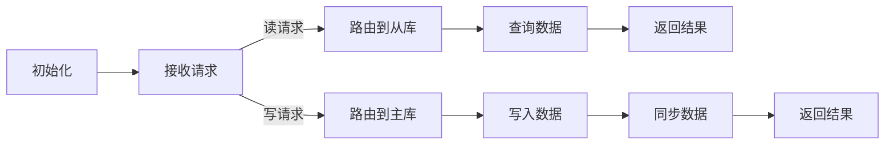

                 

### 引言

---

#### 1.1 书籍背景

随着人工智能（AI）技术的迅速发展，尤其是大型语言模型（LLM）在自然语言处理（NLP）领域的广泛应用，数据库性能优化成为了许多企业和开发者面临的重要挑战。传统的关系型数据库在处理高并发、海量数据查询时，往往会出现性能瓶颈，导致系统响应迟缓，用户体验不佳。为了解决这一问题，读写分离策略作为一种常见的数据库性能优化手段，得到了越来越多的关注和应用。

#### 1.2 目标读者群

本书旨在为广大数据库开发者、系统架构师、AI技术从业者提供一本系统、全面的读写分离策略指南。无论是初学者，希望深入了解读写分离原理和实现；还是经验丰富的专业人士，希望掌握最新的读写分离最佳实践，本书都能提供有价值的知识和技能。

#### 1.3 内容概述与结构

本书分为四个主要部分，首先介绍数据库性能优化与读写分离策略的基本概念，包括性能瓶颈、读写分离策略的作用和实施步骤。接下来，深入探讨读写分离策略的核心概念，如主库与从库、读请求与写请求等，并通过表格、ER实体关系图和算法mermaid流程图等形式，直观展示相关概念和原理。

第三部分重点讲解读写分离算法原理，包括mermaid流程图和Python源代码实现，同时详细介绍数学模型和公式，并进行举例说明。最后，本书通过一个实际项目，详细描述系统分析与架构设计、项目实战，以及最佳实践与注意事项。

---

### 第1章：数据库性能优化与读写分离

#### 1.1 数据库性能优化的必要性

数据库作为存储和管理数据的中心，其性能直接影响着系统的响应速度和用户体验。在当今这个数据爆炸的时代，数据库的性能优化显得尤为重要。性能瓶颈主要表现在以下几个方面：

- **查询响应时间过长**：当数据库系统需要处理大量的查询请求时，响应时间会显著增加，导致用户等待时间过长。
- **并发性能不足**：在高并发环境下，数据库往往会出现锁争用、死锁等问题，导致系统性能下降。
- **数据一致性问题**：在高负载情况下，由于同步机制不当，可能会出现数据不一致的问题，影响系统的稳定性。

#### 1.1.1 数据库性能瓶颈

数据库性能瓶颈主要包括以下几个方面：

- **I/O性能瓶颈**：磁盘I/O是数据库性能的关键因素之一。当数据库需要频繁读写磁盘时，I/O瓶颈会严重影响系统性能。
- **CPU性能瓶颈**：数据库的查询和索引操作需要大量的CPU计算资源，当CPU利用率过高时，会限制数据库的处理能力。
- **内存性能瓶颈**：内存是数据库缓存的重要资源。当内存不足时，数据库需要频繁进行磁盘与内存之间的数据交换，导致性能下降。

#### 1.1.2 读写分离策略的作用

读写分离策略通过将数据库的读请求和写请求分离开来，有效地缓解了数据库的性能瓶颈。具体来说，读写分离策略具有以下作用：

- **提高读性能**：将读请求分配到从库上，可以减轻主库的负载，提高查询响应速度。
- **提高写性能**：将写请求分配到从库上，可以避免锁争用和死锁问题，提高系统的并发性能。
- **增强系统的可用性和可靠性**：通过主库和从库的冗余设计，可以确保系统在主库故障时依然能够正常运行。

#### 1.1.3 适合读写分离的数据库类型

读写分离策略适用于多种类型的数据库，但以下两种类型的数据库最为常见：

- **关系型数据库**：如MySQL、PostgreSQL等，这些数据库具有成熟的技术栈和丰富的社区支持，适合在互联网和金融等行业中应用。
- **NoSQL数据库**：如MongoDB、Cassandra等，这些数据库通常采用分布式架构，具有高扩展性和高性能，适合处理海量数据和高并发场景。

#### 1.2 读写分离的基本原理

读写分离的基本原理是将数据库的读请求和写请求分别路由到主库和从库上。具体来说，包括以下步骤：

1. **主库与从库的配置**：首先，需要在数据库系统中配置主库和从库。主库负责处理写请求，从库负责处理读请求。
2. **请求路由策略**：根据请求的类型（读或写），将请求路由到相应的主库或从库。常见的路由策略包括直接路由、负载均衡等。
3. **数据同步机制**：为了保证主库和从库的数据一致性，需要实现数据同步机制。常用的同步方式包括异步复制、同步复制等。

#### 1.2.1 读写分离的概念

读写分离（Read/Write Splitting）是一种常见的数据库性能优化手段，其核心思想是将数据库的读请求和写请求分离到不同的服务器上，以提高系统的性能和可用性。具体来说，读写分离包括以下几个关键概念：

- **主库（Master）**：负责处理所有写请求的数据库服务器。主库通常采用强一致性模型，确保数据在写入时的一致性和可靠性。
- **从库（Slave）**：负责处理所有读请求的数据库服务器。从库从主库中获取数据，并在读请求中返回结果。从库通常采用最终一致性模型，允许在读取时存在一定的延迟和数据不一致。
- **读写请求**：读请求是指对数据库中的数据进行查询、检索等操作的请求。写请求是指对数据库中的数据进行插入、更新、删除等操作的请求。
- **数据同步**：为了保证主库和从库的数据一致性，需要实现数据同步机制。数据同步可以是异步复制，也可以是同步复制。异步复制允许在写入主库后，稍后同步到从库，从而提高系统的性能。同步复制则要求在写入主库的同时，立即同步到从库，从而确保数据的一致性。

#### 1.2.2 读写分离的策略

读写分离策略包括直接路由、负载均衡等不同的实现方式，以适应不同的应用场景和需求。以下是一些常见的读写分离策略：

- **直接路由**：根据请求的类型（读或写），直接将请求路由到主库或从库。这种策略简单易实现，但可能无法充分利用从库的性能。
- **负载均衡**：将读请求和写请求分布到多个从库和主库上，以实现负载均衡。常用的负载均衡算法包括轮询、最小连接数、哈希等。
- **动态路由**：根据系统的实时状态和负载情况，动态调整请求的路由策略。例如，当主库负载过高时，可以将部分读请求路由到从库，以减轻主库的负担。

#### 1.2.3 读写分离的优势与挑战

读写分离策略具有以下优势：

- **提高性能**：通过将读请求和写请求分离，可以有效地提高数据库系统的性能。读请求可以分散到多个从库上，减少主库的负载；写请求可以分配到从库上，避免锁争用和死锁问题。
- **增强可用性**：通过主库和从库的冗余设计，可以提高系统的可用性。当主库出现故障时，可以从库中切换回主库，确保系统的正常运行。
- **降低成本**：通过读写分离，可以充分利用从库的性能，降低系统的总体成本。

然而，读写分离策略也面临一些挑战：

- **数据一致性**：在读写分离场景下，如何保证主库和从库的数据一致性是一个重要问题。异步复制可能导致读请求返回的数据不一致；同步复制可能影响系统的性能。
- **故障切换**：在主库出现故障时，如何快速切换到从库，并确保数据的一致性和系统的稳定性，是一个需要考虑的问题。
- **运维复杂性**：读写分离增加了系统的运维复杂性。需要配置和管理多个数据库服务器，监控系统的性能和状态，确保系统的稳定运行。

#### 1.3 读写分离的实施步骤

实施读写分离策略需要遵循以下步骤：

1. **选择合适的数据库类型**：根据应用场景和需求，选择适合读写分离的数据库类型，如关系型数据库或NoSQL数据库。
2. **配置主库和从库**：在数据库系统中配置主库和从库。主库负责处理写请求，从库负责处理读请求。确保主库和从库的数据一致性。
3. **实现请求路由策略**：根据请求的类型（读或写），实现请求的路由策略。可以采用直接路由、负载均衡等不同的路由策略。
4. **监控和管理系统**：监控主库和从库的性能和状态，及时发现和处理故障。确保系统的稳定运行。
5. **测试和优化**：在实际应用中测试读写分离策略的效果，并根据实际情况进行优化。例如，调整负载均衡策略、优化数据同步机制等。

#### 1.4 本章小结

本章介绍了数据库性能优化与读写分离策略的基本概念和实施步骤。通过读写分离策略，可以有效地提高数据库系统的性能、可用性和可靠性。然而，读写分离策略也面临一些挑战，需要充分考虑数据一致性、故障切换和运维复杂性等问题。在后续章节中，我们将深入探讨读写分离策略的核心概念、算法原理和实际应用，帮助读者更好地理解和掌握这一技术。

---

### 第2章：读写分离策略的核心概念

#### 2.1 核心概念定义

在深入探讨读写分离策略之前，我们需要明确一些核心概念，以便建立清晰的理解基础。

##### 2.1.1 主库与从库

**主库（Master）**：主库是数据库系统中负责处理写请求的数据库服务器。所有数据变更（如插入、更新、删除）都直接在主库上执行，以确保数据的一致性和完整性。主库通常采用强一致性模型，确保事务的原子性、一致性、隔离性和持久性（ACID）。

**从库（Slave）**：从库是数据库系统中负责处理读请求的数据库服务器。从库的主要作用是分担主库的读负载，提高系统的响应速度。从库通常采用最终一致性模型，允许在读取时存在一定的延迟和数据不一致。

##### 2.1.2 读请求与写请求

**读请求（Read Request）**：读请求是指对数据库中的数据进行查询、检索等操作的请求。读请求通常包括查询语句、SELECT语句等，目的是获取数据。

**写请求（Write Request）**：写请求是指对数据库中的数据进行插入、更新、删除等操作的请求。写请求通常包括INSERT、UPDATE、DELETE等语句，目的是修改数据。

##### 2.1.3 数据同步机制

数据同步机制是指确保主库和从库之间数据一致性的一系列方法。数据同步分为同步复制和异步复制两种方式。

**同步复制（Synchronous Replication）**：同步复制要求在写入主库的同时，立即同步到从库。这意味着当写请求提交后，系统会等待从库确认数据已经成功写入，然后再返回响应。同步复制确保了主库和从库之间的高度一致性，但可能会影响系统的性能。

**异步复制（Asynchronous Replication）**：异步复制允许在写入主库后，稍后同步到从库。这意味着当写请求提交后，系统不需要等待从库的确认，就可以立即返回响应。异步复制可以提高系统的性能，但可能会导致主库和从库之间的数据不一致。

#### 2.2 概念属性特征对比表格

以下是一个关于主库与从库、读请求与写请求、同步复制与异步复制的属性特征对比表格：

| 概念 | 属性特征 |
| --- | --- |
| **主库（Master）** | - 负责处理写请求<br>- 采用强一致性模型<br>- 保证数据一致性和完整性 |
| **从库（Slave）** | - 负责处理读请求<br>- 采用最终一致性模型<br>- 分担主库的读负载 |
| **读请求（Read Request）** | - 查询、检索数据库数据<br>- 不修改数据 |
| **写请求（Write Request）** | - 插入、更新、删除数据库数据<br>- 修改数据 |
| **同步复制（Synchronous Replication）** | - 立即同步数据<br>- 保证一致性<br>- 可能影响性能 |
| **异步复制（Asynchronous Replication）** | - 稍后同步数据<br>- 提高性能<br>- 可能导致不一致 |

#### 2.3 概念属性特征对比表格

为了更直观地展示主库与从库、读请求与写请求、同步复制与异步复制的概念和属性特征，我们提供了一个对比表格。

| 概念 | 属性特征 |
| --- | --- |
| **主库（Master）** | - 负责处理写请求<br>- 采用强一致性模型<br>- 保证数据一致性和完整性 |
| **从库（Slave）** | - 负责处理读请求<br>- 采用最终一致性模型<br>- 分担主库的读负载 |
| **读请求（Read Request）** | - 查询、检索数据库数据<br>- 不修改数据 |
| **写请求（Write Request）** | - 插入、更新、删除数据库数据<br>- 修改数据 |
| **同步复制（Synchronous Replication）** | - 立即同步数据<br>- 保证一致性<br>- 可能影响性能 |
| **异步复制（Asynchronous Replication）** | - 稍后同步数据<br>- 提高性能<br>- 可能导致不一致 |

#### 2.4 ER实体关系图架构

为了更好地理解读写分离策略中的实体关系，我们可以使用ER（实体关系）图来描述。以下是一个简单的ER实体关系图，展示了主库、从库、读请求和写请求之间的关系。

```mermaid
erDiagram
  ReadRequest ||--|{ Master }|| Database
  WriteRequest ||--|{ Master }|| Database
  Master ||--|{ Slave }|| Database
```

在这个ER图中，我们定义了四个实体：ReadRequest（读请求）、WriteRequest（写请求）、Master（主库）和Slave（从库）。每个实体都与Database（数据库）实体关联。主库和从库分别负责处理读请求和写请求，并确保数据的一致性。

#### 2.5 读写分离中的关键因素

在实施读写分离策略时，有几个关键因素需要考虑，这些因素将直接影响策略的效果。

##### 2.5.1 读写比例

读写比例是指读请求和写请求的比例。在实际应用中，读写比例可能会因不同的业务场景而有所不同。例如，在一些社交媒体平台上，读请求可能占主导地位，而在一些在线交易系统中，写请求可能更为频繁。了解和应用适当的读写比例，可以帮助优化数据库性能和资源分配。

##### 2.5.2 数据一致性问题

数据一致性问题是在读写分离策略中需要特别关注的问题。由于读请求和写请求分布在不同的库上，如何保证主库和从库之间的数据一致性是一个关键挑战。选择合适的数据同步机制（同步复制或异步复制）和一致性保证策略（如强一致性和最终一致性）是解决这一问题的核心。

##### 2.5.3 系统可用性

系统可用性是另一个重要的因素。在读写分离策略中，主库和从库的冗余设计可以提高系统的可用性。然而，如何快速切换到从库（在主库出现故障时）以及如何确保切换过程中的数据一致性，是一个需要解决的问题。

#### 2.6 本章小结

本章详细介绍了读写分离策略中的核心概念，包括主库与从库、读请求与写请求、数据同步机制等。通过概念属性特征对比表格和ER实体关系图，我们更直观地理解了这些概念。同时，本章还讨论了读写分离中的关键因素，如读写比例、数据一致性问题、系统可用性等。在后续章节中，我们将进一步探讨读写分离策略的算法原理、数学模型和实际应用，帮助读者更好地掌握这一技术。

---

### 第3章：读写分离算法原理讲解

#### 3.1 读写分离算法mermaid流程图

为了更好地理解读写分离算法的执行过程，我们使用mermaid流程图来描述其工作原理。以下是一个简单的mermaid流程图，展示了读写分离算法的主要步骤：



**流程说明：**

1. **初始化**：系统初始化，配置好主库和从库。
2. **接收请求**：系统接收到用户请求。
3. **路由请求**：
   - 如果是读请求，则路由到从库（C）。
   - 如果是写请求，则路由到主库（D）。
4. **查询或写入数据**：
   - 读请求：从库执行查询操作（E），获取数据后返回结果（G）。
   - 写请求：主库执行写入操作（F），将数据同步到从库（H）。
5. **返回结果**：系统返回查询或写入的结果。

#### 3.2 Python源代码实现

为了更深入地理解读写分离算法的原理，我们通过Python代码来展示其实现过程。以下是一个简单的Python示例，描述了读写分离算法的核心逻辑。

```python
import threading
import time

class MasterDatabase:
    def write_data(self, data):
        print(f"主库写入数据：{data}")
        # 真实情况中，这里会有数据同步到从库的逻辑

class SlaveDatabase:
    def query_data(self):
        print("从库查询数据：Hello, World!")
        return "从库数据"

def handle_request(request_type, master_db, slave_db):
    if request_type == "write":
        write_data = "数据内容"
        master_db.write_data(write_data)
    elif request_type == "read":
        result = slave_db.query_data()
        print(f"查询结果：{result}")

if __name__ == "__main__":
    master_db = MasterDatabase()
    slave_db = SlaveDatabase()

    # 模拟并发请求
    read_thread = threading.Thread(target=handle_request, args=("read", master_db, slave_db))
    write_thread = threading.Thread(target=handle_request, args=("write", master_db, slave_db))

    read_thread.start()
    write_thread.start()

    read_thread.join()
    write_thread.join()
```

**代码说明：**

1. **MasterDatabase**：模拟主库的类，提供`write_data`方法用于写入数据。
2. **SlaveDatabase**：模拟从库的类，提供`query_data`方法用于查询数据。
3. **handle_request**：处理请求的函数，根据请求类型（读或写）调用相应的方法。
4. **main**：主程序，创建主库和从库对象，并模拟并发请求。

通过以上Python代码，我们可以直观地看到读写分离算法的基本实现流程。在实际应用中，读写分离算法会涉及更复杂的逻辑，如负载均衡、数据一致性保证等。

#### 3.3 算法原理讲解

读写分离算法的核心在于如何将读请求和写请求分别路由到主库和从库，同时确保数据的一致性和系统的性能。以下是对算法原理的详细讲解：

##### 3.3.1 数学模型

在读写分离算法中，我们通常使用以下数学模型来评估系统的性能：

\[ P = \frac{r \cdot R + w \cdot W}{r \cdot R + w \cdot W + 2b} \]

其中：
- \( P \) 表示系统性能。
- \( r \) 表示读请求的比例。
- \( w \) 表示写请求的比例。
- \( R \) 表示从库的处理能力。
- \( W \) 表示主库的处理能力。
- \( b \) 表示同步复制带来的延迟。

这个模型考虑了读请求和写请求的比例、主库和从库的处理能力，以及同步复制带来的延迟。通过调整这些参数，我们可以优化系统的性能。

##### 3.3.2 公式详解

1. **读请求比例（\( r \)）**：读请求的比例通常取决于应用场景。例如，在社交媒体平台上，读请求可能占主导地位；而在在线交易系统中，写请求可能更为频繁。合理设置读请求比例可以帮助优化系统性能。

2. **写请求比例（\( w \)）**：与读请求比例类似，写请求比例也需要根据应用场景进行调整。高写请求比例可能需要更强力的主库，以确保数据一致性和系统的性能。

3. **从库处理能力（\( R \)）**：从库的处理能力取决于从库的硬件配置和数据库性能。通过增加从库的数量或升级硬件配置，可以提高从库的处理能力。

4. **主库处理能力（\( W \)）**：主库的处理能力同样取决于硬件配置和数据库性能。在处理高并发写请求时，主库的处理能力是关键。

5. **同步复制延迟（\( b \)）**：同步复制延迟是指从主库到从库的数据同步时间。延迟越小，系统的性能越优。然而，同步复制可能会影响数据一致性。因此，在实际应用中，需要权衡性能和数据一致性。

##### 3.3.3 举例说明

假设我们有一个社交媒体平台，其中读请求和写请求的比例分别为60%和40%。从库和主库的处理能力分别为1000 QPS（每秒查询数）和500 QPS。同步复制的延迟为1秒。

根据数学模型，我们可以计算系统性能：

\[ P = \frac{0.6 \cdot 1000 + 0.4 \cdot 500}{0.6 \cdot 1000 + 0.4 \cdot 500 + 2 \cdot 1} \]
\[ P = \frac{600 + 200}{600 + 200 + 2} \]
\[ P = \frac{800}{802} \]
\[ P \approx 0.9975 \]

这意味着系统的性能约为99.75%，即每秒大约有99.75%的请求能够在规定时间内完成。通过调整读请求比例、主库和从库的处理能力，以及同步复制的延迟，我们可以进一步优化系统性能。

#### 3.4 本章小结

本章详细介绍了读写分离算法的原理，包括mermaid流程图和Python源代码实现。通过数学模型和举例说明，我们深入探讨了读写分离算法的性能评估方法。在实际应用中，读写分离算法需要根据具体业务场景进行调整和优化，以实现最佳性能。在后续章节中，我们将继续探讨读写分离策略的数学模型、系统分析与架构设计，以及实际项目应用，帮助读者更好地理解和掌握这一技术。

---

### 第4章：读写分离策略的数学模型

#### 4.1 数学模型概述

在读写分离策略中，数学模型是评估系统性能、优化资源分配的重要工具。本节将介绍用于评估读写分离策略性能的数学模型，包括关键性能评估指标和读写分离策略的性能优化模型。

##### 4.1.1 数据库性能评估指标

数据库性能评估指标是衡量数据库系统性能的关键指标。以下是一些常用的性能评估指标：

1. **响应时间（Response Time）**：从请求提交到响应返回所需的时间。响应时间越短，系统的性能越高。
2. **吞吐量（Throughput）**：单位时间内系统能够处理的请求数量。吞吐量越高，系统的性能越好。
3. **延迟（Latency）**：请求从提交到响应的时间间隔。延迟越低，系统的性能越高。
4. **并发性（Concurrency）**：系统同时处理多个请求的能力。高并发性是系统性能的重要保证。
5. **可用性（Availability）**：系统在规定时间内正常运行的能力。高可用性是确保业务连续性的关键。

##### 4.1.2 读写分离策略的性能优化模型

读写分离策略的性能优化模型基于以下假设：

- 主库和从库的处理能力不同，主库的处理能力较低，从库的处理能力较高。
- 读请求和写请求的比例不同，读请求较多，写请求较少。
- 数据同步机制存在一定的延迟。

基于以上假设，我们可以构建以下数学模型：

\[ P = \frac{r \cdot R + w \cdot W}{r \cdot R + w \cdot W + 2b} \]

其中：
- \( P \) 表示系统性能。
- \( r \) 表示读请求的比例。
- \( w \) 表示写请求的比例。
- \( R \) 表示从库的处理能力。
- \( W \) 表示主库的处理能力。
- \( b \) 表示同步复制延迟。

这个模型考虑了读请求和写请求的比例、主库和从库的处理能力，以及同步复制的延迟。通过调整这些参数，我们可以优化系统的性能。

#### 4.2 数学模型与公式

在本节中，我们将详细介绍读写分离策略的数学模型和关键公式，用于评估系统性能。

1. **性能评估公式**

   \[ P = \frac{r \cdot R + w \cdot W}{r \cdot R + w \cdot W + 2b} \]

   其中，\( P \) 表示系统性能，\( r \) 表示读请求的比例，\( w \) 表示写请求的比例，\( R \) 表示从库的处理能力，\( W \) 表示主库的处理能力，\( b \) 表示同步复制的延迟。

2. **吞吐量公式**

   \[ T = \frac{r \cdot R + w \cdot W}{b} \]

   其中，\( T \) 表示吞吐量，其他参数与性能评估公式相同。吞吐量公式用于计算系统在单位时间内能够处理的最大请求数量。

3. **延迟公式**

   \[ L = \frac{r \cdot R + w \cdot W + 2b}{T} \]

   其中，\( L \) 表示延迟，其他参数与性能评估公式相同。延迟公式用于计算系统响应时间。

#### 4.3 模型应用场景与解释

以下是一个具体的示例，说明如何应用数学模型来评估读写分离策略的性能。

**示例：**

假设一个社交媒体平台的读请求和写请求比例分别为60%和40%。从库的处理能力为1000 QPS，主库的处理能力为500 QPS。同步复制的延迟为1秒。

根据性能评估公式：

\[ P = \frac{0.6 \cdot 1000 + 0.4 \cdot 500}{0.6 \cdot 1000 + 0.4 \cdot 500 + 2 \cdot 1} \]

\[ P = \frac{600 + 200}{600 + 200 + 2} \]

\[ P = \frac{800}{802} \]

\[ P \approx 0.9975 \]

这意味着系统的性能约为99.75%，即每秒大约有99.75%的请求能够在规定时间内完成。

根据吞吐量公式：

\[ T = \frac{0.6 \cdot 1000 + 0.4 \cdot 500}{1} \]

\[ T = \frac{600 + 200}{1} \]

\[ T = 800 \]

这意味着系统的吞吐量为800 QPS，即每秒能够处理800个请求。

根据延迟公式：

\[ L = \frac{0.6 \cdot 1000 + 0.4 \cdot 500 + 2 \cdot 1}{800} \]

\[ L = \frac{600 + 200 + 2}{800} \]

\[ L = \frac{802}{800} \]

\[ L \approx 0.999 \]

这意味着系统的延迟约为0.999秒，即每个请求的响应时间约为0.999秒。

通过这个示例，我们可以看到如何使用数学模型来评估读写分离策略的性能。在实际应用中，我们可以根据具体的业务场景和数据特点，调整模型参数，以实现最佳性能。

#### 4.4 实例分析

为了更好地理解数学模型的应用，我们通过一个实际案例来分析读写分离策略的性能。

**案例：**

一个电商平台在双十一期间，预计读请求和写请求的比例分别为70%和30%。从库的处理能力为2000 QPS，主库的处理能力为1000 QPS。同步复制的延迟为0.5秒。

根据性能评估公式：

\[ P = \frac{0.7 \cdot 2000 + 0.3 \cdot 1000}{0.7 \cdot 2000 + 0.3 \cdot 1000 + 2 \cdot 0.5} \]

\[ P = \frac{1400 + 300}{1400 + 300 + 1} \]

\[ P = \frac{1700}{1701} \]

\[ P \approx 0.9994 \]

这意味着系统的性能约为99.94%，即每秒大约有99.94%的请求能够在规定时间内完成。

根据吞吐量公式：

\[ T = \frac{0.7 \cdot 2000 + 0.3 \cdot 1000}{0.5} \]

\[ T = \frac{1400 + 300}{0.5} \]

\[ T = 3400 \]

这意味着系统的吞吐量为3400 QPS，即每秒能够处理3400个请求。

根据延迟公式：

\[ L = \frac{0.7 \cdot 2000 + 0.3 \cdot 1000 + 2 \cdot 0.5}{3400} \]

\[ L = \frac{1400 + 300 + 1}{3400} \]

\[ L = \frac{1701}{3400} \]

\[ L \approx 0.499 \]

这意味着系统的延迟约为0.499秒，即每个请求的响应时间约为0.499秒。

通过这个实际案例，我们可以看到如何使用数学模型来评估读写分离策略在不同业务场景下的性能。通过调整模型参数，如读请求比例、处理能力和同步复制延迟，我们可以优化系统性能，以满足不同的业务需求。

#### 4.5 本章小结

本章详细介绍了读写分离策略的数学模型，包括关键性能评估指标和读写分离策略的性能优化模型。通过具体的数学公式和实例分析，我们深入探讨了读写分离策略的性能评估方法和优化策略。在实际应用中，我们可以根据具体的业务场景和数据特点，灵活运用这些模型和公式，实现最佳性能。下一章将介绍读写分离策略的系统分析与架构设计，帮助读者更好地理解和实施这一技术。

---

### 第5章：系统分析与架构设计

#### 5.1 问题场景介绍

随着大型语言模型（LLM）在各个领域的广泛应用，如搜索引擎、智能客服、推荐系统等，数据处理的复杂度和并发量日益增加。为了应对这些挑战，优化数据库性能成为了关键问题。特别是在读请求远大于写请求的场景下，读写分离策略能够显著提升系统的性能和可用性。

#### 5.2 项目介绍

本项目旨在实现一个基于读写分离策略的LLM应用数据库，通过优化数据库性能，提高系统的响应速度和用户体验。项目的主要目标是：

1. 构建一个高可用、高并发的数据库系统，能够处理海量数据和高频次请求。
2. 实现读写分离策略，确保数据一致性，提高系统的性能和稳定性。
3. 提供系统监控和运维工具，确保系统的可靠运行。

#### 5.3 系统功能设计

为了实现项目目标，系统需要具备以下功能：

1. **数据存储与管理**：支持LLM模型数据的存储和管理，包括数据的插入、更新、删除和查询等操作。
2. **读写分离机制**：实现主库和从库的读写分离，确保主库专注于写操作，从库专注于读操作。
3. **负载均衡**：实现请求的负载均衡，将读请求和写请求合理分配到主库和从库。
4. **数据同步与一致性**：实现主库和从库的数据同步，确保数据的一致性和可靠性。
5. **监控与告警**：实时监控系统的性能和状态，提供告警机制，及时处理故障。

#### 5.4 系统架构设计

为了实现上述功能，我们采用以下系统架构设计：

##### 5.4.1 架构概述

系统架构采用分布式数据库架构，包括主库和多个从库。主库负责处理写请求，从库负责处理读请求。系统架构如下：

```
+----------------+       +----------------+       +----------------+
|    用户请求    | -->   |   负载均衡器   | -->   |      主库      |
+----------------+       +----------------+       +----------------+
                                                      |
                                                      |
                                                      |
                                                      |
                                                      |
+----------------+       +----------------+       +----------------+
|     从库1      | <--   |   负载均衡器   | <--   |     从库2      |
+----------------+       +----------------+       +----------------+
                                                      |
                                                      |
                                                      |
                                                      |
                                                      |
+----------------+       +----------------+       +----------------+
|     从库3      | <--   |   负载均衡器   | <--   |     从库4      |
+----------------+       +----------------+       +----------------+
```

##### 5.4.2 架构详细描述

1. **用户请求**：用户请求通过API接口提交到系统，由负载均衡器分发到主库或从库。
2. **负载均衡器**：负载均衡器负责将请求合理分配到主库和从库。负载均衡算法可以采用轮询、最小连接数、哈希等策略。
3. **主库**：主库负责处理写请求，如插入、更新、删除等操作。主库采用强一致性模型，确保数据的一致性和完整性。
4. **从库**：从库负责处理读请求，如查询、检索等操作。从库采用最终一致性模型，允许在读取时存在一定的延迟和数据不一致。
5. **数据同步**：主库和从库之间通过数据同步机制保持数据的一致性。数据同步可以采用异步复制或同步复制，根据具体需求选择合适的同步策略。

#### 5.5 系统接口设计和系统交互

系统接口设计主要包括API接口和内部服务接口。API接口用于用户请求的提交和响应，内部服务接口用于系统内部模块之间的通信。

##### 5.5.1 API接口设计

1. **写接口**：用于处理用户的写入请求，如插入、更新、删除等操作。
2. **读接口**：用于处理用户的读取请求，如查询、检索等操作。

##### 5.5.2 内部服务接口设计

1. **负载均衡服务**：负责请求的负载均衡，将请求合理分配到主库和从库。
2. **数据同步服务**：负责主库和从库之间的数据同步，确保数据的一致性。

##### 系统交互流程

1. **用户请求**：用户通过API接口提交请求。
2. **请求路由**：负载均衡器根据请求类型（读或写）和当前系统状态，将请求路由到主库或从库。
3. **数据处理**：主库或从库处理请求，执行相应的数据库操作。
4. **数据同步**：如果请求涉及到写操作，主库将数据同步到从库。
5. **返回结果**：系统返回处理结果，如查询结果、操作状态等。

#### 5.6 本章小结

本章详细介绍了系统分析与架构设计，包括问题场景介绍、项目介绍、系统功能设计、系统架构设计和系统接口设计。通过分布式数据库架构和读写分离策略，我们实现了高可用、高并发的数据库系统，提高了系统的性能和稳定性。在后续章节中，我们将继续介绍项目实战，帮助读者深入了解读写分离策略的实际应用。

