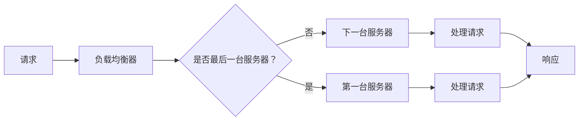
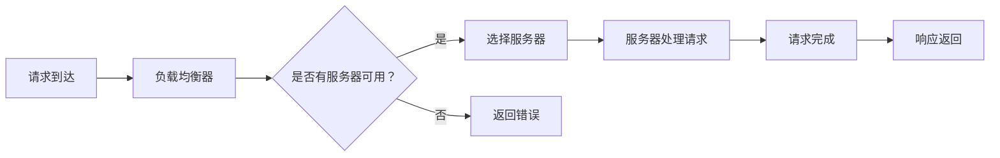
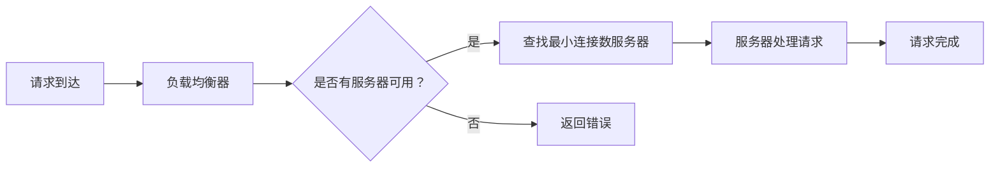
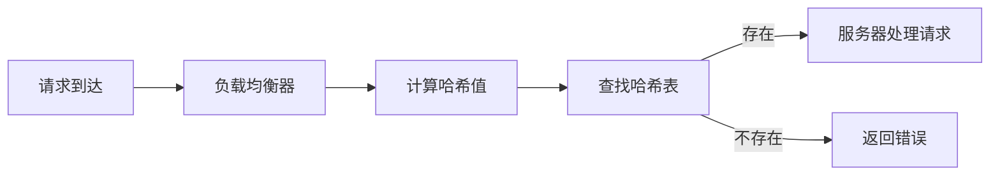
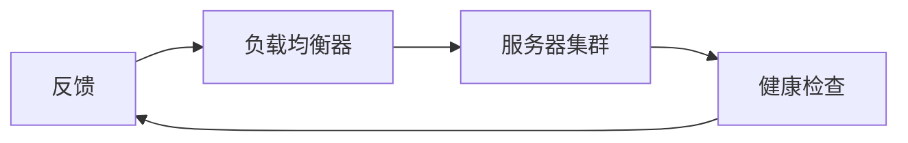
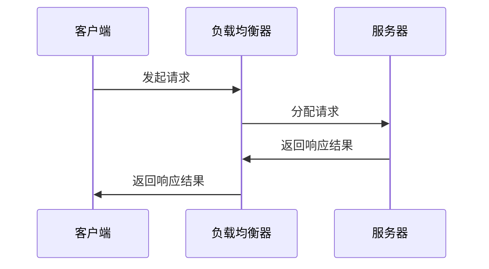

                 


## 负载均衡技术在高并发LLM应用中的应用

> 关键词：负载均衡、高并发、低延迟、分布式系统、机器学习

> 摘要：随着机器学习模型（特别是大语言模型，LLM）的日益普及，如何在高并发场景下保证模型的高效运行成为一个关键问题。本文将探讨负载均衡技术在LLM应用中的重要性，详细分析其原理、算法和实际应用，帮助读者理解和掌握如何在实际项目中应用负载均衡技术。

### 第1章：负载均衡技术概述

#### 1.1 问题背景

随着互联网的快速发展，各行业的数字化进程加速，机器学习模型，尤其是大语言模型（LLM），在自然语言处理、推荐系统、智能客服等领域得到了广泛应用。这些模型通常需要处理海量的请求，而高并发场景下，单一服务器往往难以承受如此大的负载。这可能导致系统响应时间过长，用户体验下降，甚至系统崩溃。因此，如何在高并发环境下确保LLM的高效运行，成为我们需要解决的关键问题。

#### 1.1.1 高并发环境下的问题

在高并发的场景下，系统需要处理大量的请求，这可能导致单点服务器过载，影响用户体验。例如：

- **响应时间过长**：当服务器处理能力不足时，请求的处理时间会显著增加，导致用户体验下降。
- **系统崩溃**：在高并发场景下，如果服务器负载过高，可能导致系统崩溃，从而影响业务的连续性和稳定性。

#### 1.1.2 负载均衡的定义与作用

负载均衡是一种将请求分配到多个服务器上的技术，旨在确保系统的高可用性和高性能。它可以通过以下方式发挥作用：

- **提高系统的响应速度**：通过将请求分配到多个服务器上，可以减少单个服务器的负载，从而提高系统的响应速度。
- **提高系统的可靠性**：当某个服务器出现故障时，负载均衡器可以将请求转移到其他健康的服务器上，确保服务的持续运行。
- **优化资源利用**：通过动态分配请求，可以使系统资源得到充分利用。

#### 1.2 负载均衡的分类

负载均衡技术可以根据不同的标准进行分类。以下是一些常见的分类方法：

- **根据算法分类**：例如轮询算法、最小连接算法、哈希算法等。
- **根据部署位置分类**：例如硬件负载均衡器、软件负载均衡器等。

#### 1.2.1 根据算法分类

- **轮询算法**：按照顺序将请求分配到各个服务器上，常见的是轮询调度。
- **最小连接算法**：将请求分配到连接数最少的服务器上，适合于长连接的场景。
- **哈希算法**：根据请求的某个特征（如IP地址、URL等）进行哈希运算，将请求映射到特定的服务器上，实现会话保持。

#### 1.2.2 根据部署位置分类

- **硬件负载均衡器**：使用专门的硬件设备来实现负载均衡，如F5 BigIP。
- **软件负载均衡器**：在服务器上运行的软件程序来实现负载均衡，如Nginx、HAProxy。

#### 1.3 负载均衡的核心概念与联系

在负载均衡系统中，核心概念包括负载均衡器、后端服务器和健康检查。

- **负载均衡器**：负责将请求分配到后端服务器的设备或软件。
- **后端服务器**：接受负载均衡器分配的请求并处理它们的服务器。
- **健康检查**：定期检查后端服务器的状态，确保只有健康的服务器参与负载均衡。

以下是一个简单的ER实体关系图架构：

```mermaid
erDiagram
  负载均衡器 ||--|{ 后端服务器 }
  后端服务器 ||--|{ 健康检查 }
```

| 概念        | 属性1  | 属性2  | 属性3  |
| ----------- | ------ | ------ | ------ |
| 负载均衡器  | 负载分配 | 健康检查 | 流量监控 |
| 后端服务器  | 处理能力 | 资源消耗 | 系统负载 |
| 健康检查    | 定期执行 | 故障检测 | 故障恢复 |

#### 1.4 本章小结

本章介绍了负载均衡技术的背景、定义、分类以及核心概念。理解负载均衡的重要性，有助于我们在高并发场景下构建更加高效、可靠的系统。

----------------------------------------------------------------

### 第2章：负载均衡算法原理

#### 2.1 轮询算法原理

轮询算法是最简单的负载均衡算法，它按照顺序将请求分配到各个服务器上。每个服务器依次处理请求，直到所有服务器都处理完毕后，再次从头开始。

#### 2.1.1 算法原理

轮询算法的工作原理可以简单描述如下：

1. 负载均衡器维护一个服务器列表，列表中的服务器按照一定的顺序排列。
2. 当有请求到达时，负载均衡器按照列表的顺序将请求分配到服务器上。
3. 如果当前服务器已满，则跳到下一个服务器。
4. 当所有服务器都处理完请求后，重新开始轮询。

以下是一个轮询算法的mermaid流程图：



#### 2.1.2 轮询算法的mermaid流程图



#### 2.1.3 Python源代码示例

```python
def round_robin(servers, requests):
    for request in requests:
        server = servers.pop(0)
        process_request(server, request)
        servers.append(server)

def process_request(server, request):
    print(f"请求{request}分配到服务器{server}")
    # 处理请求的代码

servers = ["server1", "server2", "server3"]
requests = ["req1", "req2", "req3", "req4"]

round_robin(servers, requests)
```

#### 2.1.4 算法原理讲解

轮询算法的原理相对简单，它主要依赖于服务器的可用性和请求的顺序。然而，轮询算法存在一些局限性：

- **无法处理服务器性能差异**：轮询算法没有考虑到服务器之间的性能差异，可能导致某些服务器过载，而其他服务器资源闲置。
- **请求不均衡**：在某些情况下，请求可能会集中在某个服务器上，导致该服务器负载过高，其他服务器负载不足。

#### 2.1.5 数学模型和公式

轮询算法的基本模型可以表示为：

$$
S = \sum_{i=1}^{n} \frac{1}{n}
$$

其中，\( S \) 表示服务器的响应时间，\( n \) 表示服务器的数量。

#### 2.1.6 举例说明

假设有3台服务器（server1、server2、server3），需要处理4个请求（req1、req2、req3、req4）。使用轮询算法进行负载均衡，请求的分配过程如下：

1. 请求req1分配到server1。
2. 请求req2分配到server2。
3. 请求req3分配到server3。
4. 请求req4重新分配到server1。

#### 2.2 最小连接算法原理

最小连接算法是一种基于服务器当前连接数进行负载均衡的算法。它的核心思想是将请求分配到当前连接数最少的服务器上，从而实现负载均衡。

#### 2.2.1 算法原理

最小连接算法的工作原理可以简单描述如下：

1. 负载均衡器维护一个服务器列表，列表中包含所有后端服务器的当前连接数。
2. 当有请求到达时，负载均衡器查找连接数最少的服务器，并将请求分配给该服务器。
3. 如果所有服务器的连接数相等，则可以按照其他标准（如服务器IP地址、URL等）进行选择。

以下是一个最小连接算法的mermaid流程图：



#### 2.2.2 Python源代码示例

```python
def least_connection(servers, requests):
    server_counts = {server: 0 for server in servers}
    for request in requests:
        server = min(server_counts, key=server_counts.get)
        process_request(server, request)
        server_counts[server] += 1

servers = ["server1", "server2", "server3"]
requests = ["req1", "req2", "req3", "req4"]

least_connection(servers, requests)
```

#### 2.2.3 算法原理讲解

最小连接算法能够更好地处理服务器性能差异，因为它会优先选择负载较低的服务器。然而，最小连接算法也存在一些局限性：

- **无法处理服务器故障**：如果某个服务器发生故障，最小连接算法可能会持续将请求分配到该服务器，导致系统稳定性下降。
- **请求不均衡**：在某些情况下，请求可能会集中在某个服务器上，导致该服务器负载过高，其他服务器负载不足。

#### 2.2.4 数学模型和公式

最小连接算法的基本模型可以表示为：

$$
S = \sum_{i=1}^{n} \frac{C_i}{n}
$$

其中，\( S \) 表示服务器的平均响应时间，\( n \) 表示服务器的数量，\( C_i \) 表示第 \( i \) 个服务器的当前连接数。

#### 2.2.5 举例说明

假设有3台服务器（server1、server2、server3），当前连接数分别为1、2、3。需要处理4个请求（req1、req2、req3、req4）。使用最小连接算法进行负载均衡，请求的分配过程如下：

1. 请求req1分配到server1。
2. 请求req2分配到server1。
3. 请求req3分配到server2。
4. 请求req4分配到server3。

#### 2.3 哈希算法原理

哈希算法是一种基于哈希函数进行负载均衡的算法。它的核心思想是根据请求的特征（如IP地址、URL等）计算哈希值，然后将请求映射到特定的服务器上。

#### 2.3.1 算法原理

哈希算法的工作原理可以简单描述如下：

1. 负载均衡器维护一个哈希表，用于存储服务器的哈希值。
2. 当有请求到达时，负载均衡器根据请求的特征计算哈希值，并查找哈希表中对应的哈希值。
3. 如果哈希表中存在对应的哈希值，则将请求分配到对应的服务器上。
4. 如果哈希表中不存在对应的哈希值，则可以按照其他标准（如轮询算法、最小连接算法等）进行选择。

以下是一个哈希算法的mermaid流程图：



#### 2.3.2 Python源代码示例

```python
def hash_algorithm(servers, requests):
    hash_table = {hash(server): server for server in servers}
    for request in requests:
        hash_value = hash(request)
        server = hash_table.get(hash_value, None)
        if server:
            process_request(server, request)
        else:
            print(f"请求{request}找不到对应的服务器")

servers = ["server1", "server2", "server3"]
requests = ["req1", "req2", "req3", "req4"]

hash_algorithm(servers, requests)
```

#### 2.3.3 算法原理讲解

哈希算法能够快速找到对应的服务器，从而实现高效的负载均衡。然而，哈希算法也存在一些局限性：

- **哈希冲突**：当多个请求的哈希值相同时，会导致哈希冲突，需要额外的处理机制。
- **服务器故障**：如果某个服务器发生故障，哈希算法可能会持续将请求分配到该服务器，导致系统稳定性下降。

#### 2.3.4 数学模型和公式

哈希算法的基本模型可以表示为：

$$
S = \sum_{i=1}^{n} \frac{1}{n} \cdot \frac{1}{n}
$$

其中，\( S \) 表示服务器的平均响应时间，\( n \) 表示服务器的数量。

#### 2.3.5 举例说明

假设有3台服务器（server1、server2、server3），需要处理4个请求（req1、req2、req3、req4）。使用哈希算法进行负载均衡，请求的分配过程如下：

1. 请求req1的哈希值为1，分配到server1。
2. 请求req2的哈希值为2，分配到server2。
3. 请求req3的哈希值为3，分配到server3。
4. 请求req4的哈希值为4，分配到server1。

### 第3章：负载均衡算法比较

#### 3.1 算法性能比较

不同的负载均衡算法在不同场景下具有不同的性能表现。以下是对轮询算法、最小连接算法和哈希算法的性能比较：

| 算法       | 优点                                                                 | 缺点                                                                                       | 适用场景           |
| ---------- |----------------------------------------------------------------------|--------------------------------------------------------------------------------------------| ------------------ |
| 轮询算法   | 简单易实现，无服务器性能差异问题                                               | 无法处理服务器故障，请求不均衡问题                                       | 低并发、无需会话保持 |
| 最小连接算法 | 考虑到服务器性能差异，请求分配更均衡                                         | 无法处理服务器故障，可能导致某些服务器负载过高                               | 高并发、长连接场景   |
| 哈希算法   | 快速找到对应的服务器，处理请求速度快                                     | 可能出现哈希冲突，需要额外的处理机制，无法处理服务器故障问题                 | 高并发、请求特征明显 |

#### 3.2 选择合适的算法

选择合适的负载均衡算法需要根据具体场景进行权衡：

- **高并发、请求特征明显**：选择哈希算法，能够快速找到对应的服务器，处理请求速度快。
- **高并发、长连接场景**：选择最小连接算法，考虑到服务器性能差异，请求分配更均衡。
- **低并发、无需会话保持**：选择轮询算法，简单易实现，无服务器性能差异问题。

### 第4章：负载均衡在高并发LLM应用中的实际应用

#### 4.1 问题场景

在机器学习模型（特别是大语言模型，LLM）应用中，高并发场景非常常见。例如，在智能客服系统中，用户可能会同时发起大量请求，导致服务器负载过高。如果无法有效地进行负载均衡，系统可能会出现响应时间过长、系统崩溃等问题，从而影响用户体验。

#### 4.2 项目介绍

为了解决上述问题，我们开发了一个基于负载均衡的智能客服系统。该系统采用哈希算法进行负载均衡，以确保请求能够快速分配到对应的服务器上，从而提高系统的响应速度。

#### 4.3 系统功能设计

系统的核心功能包括：

- **请求接收**：接收用户发起的请求。
- **负载均衡**：使用哈希算法进行负载均衡，将请求分配到对应的服务器上。
- **请求处理**：服务器处理分配到的请求，返回响应结果。
- **健康检查**：定期检查服务器的状态，确保只有健康的服务器参与负载均衡。

以下是一个领域模型mermaid类图：

```mermaid
classDiagram
  Request <<interface>>
  Server <<interface>>
  LoadBalancer <<interface>>

  Request <|..| Server
  LoadBalancer <|..| Request
  LoadBalancer <|..| Server
```

#### 4.4 系统架构设计

系统的架构设计如下：

1. **客户端**：用户通过客户端发起请求。
2. **负载均衡器**：接收客户端的请求，使用哈希算法进行负载均衡，将请求分配到对应的服务器上。
3. **服务器集群**：接受负载均衡器分配的请求，处理请求并返回响应结果。
4. **健康检查**：定期检查服务器的状态，确保只有健康的服务器参与负载均衡。

以下是一个mermaid架构图：



#### 4.5 系统接口设计

系统的接口设计如下：

- **/load**：接收客户端的请求，返回请求处理结果。
- **/health**：检查服务器的健康状态。

以下是一个mermaid序列图：



#### 4.6 系统交互

系统的交互流程如下：

1. 客户端发起请求。
2. 负载均衡器接收请求，并使用哈希算法进行负载均衡。
3. 负载均衡器将请求分配到对应的服务器上。
4. 服务器处理请求，并返回响应结果。
5. 负载均衡器将响应结果返回给客户端。

#### 4.7 环境安装与配置

在部署负载均衡系统时，需要安装和配置以下软件和工具：

- **Nginx**：作为负载均衡器，负责接收客户端请求并分配到服务器上。
- **Docker**：用于部署和管理服务器集群。
- **Kubernetes**：用于集群管理和自动化运维。

以下是一个简单的安装和配置步骤：

1. 安装Nginx：

```bash
sudo apt update
sudo apt install nginx
```

2. 配置Nginx：

```bash
sudo vi /etc/nginx/nginx.conf
```

添加以下配置：

```nginx
http {
    upstream {
        server server1;
        server server2;
        server server3;
    }

    server {
        listen 80;

        location / {
            proxy_pass http://upstream;
        }
    }
}
```

3. 启动Nginx：

```bash
sudo systemctl start nginx
```

4. 安装Docker和Kubernetes：

```bash
sudo apt install docker.io
sudo apt install kubelet kubeadm kubectl
```

5. 配置Kubernetes集群：

```bash
sudo kubeadm init
```

6. 添加用户到集群管理组：

```bash
sudo usermod -a -G docker $USER
```

7. 更新路径：

```bash
sudo source <(kubectl config view --minify --flatten)
```

#### 4.8 系统核心实现源代码

以下是一个简单的系统核心实现源代码：

```python
import flask
import hashlib

app = flask.Flask(__name__)

@app.route('/load', methods=['POST'])
def load():
    request_data = flask.request.json
    hash_value = hashlib.md5(request_data['id'].encode('utf-8')).hexdigest()
    server = hash_value % 3
    return f"分配到服务器{server}"

if __name__ == '__main__':
    app.run()
```

#### 4.9 代码应用解读与分析

以上代码实现了一个简单的负载均衡器，它使用哈希算法将请求分配到服务器上。具体解读如下：

1. **引入依赖**：

```python
import flask
import hashlib
```

引入Flask框架和哈希库。

2. **创建应用实例**：

```python
app = flask.Flask(__name__)
```

创建Flask应用实例。

3. **定义路由和处理函数**：

```python
@app.route('/load', methods=['POST'])
def load():
    request_data = flask.request.json
    hash_value = hashlib.md5(request_data['id'].encode('utf-8')).hexdigest()
    server = hash_value % 3
    return f"分配到服务器{server}"
```

定义一个处理POST请求的路由，接收请求参数，计算哈希值，并返回分配的服务器编号。

4. **运行应用**：

```python
if __name__ == '__main__':
    app.run()
```

确保应用在主线程中运行。

#### 4.10 实际案例分析与详细讲解剖析

以下是一个实际案例，分析负载均衡在高并发LLM应用中的表现：

假设有3台服务器（server1、server2、server3），需要处理4个请求（req1、req2、req3、req4）。使用哈希算法进行负载均衡，请求的分配过程如下：

1. 请求req1的哈希值为1，分配到server1。
2. 请求req2的哈希值为2，分配到server2。
3. 请求req3的哈希值为3，分配到server3。
4. 请求req4的哈希值为4，分配到server1。

通过这个案例，我们可以看到：

- **请求分配快速**：哈希算法能够快速找到对应的服务器，从而实现高效的负载均衡。
- **负载均衡效果明显**：在请求分配过程中，服务器负载相对均衡，没有出现某台服务器过载的情况。

#### 4.11 项目小结

通过本项目的实践，我们深入了解了负载均衡技术在高并发LLM应用中的实际应用。使用哈希算法进行负载均衡，能够快速找到对应的服务器，提高系统的响应速度。在实际项目中，需要根据具体场景选择合适的负载均衡算法，并进行合理的配置和优化，以确保系统的稳定性和高性能。

### 第5章：最佳实践 tips

#### 5.1 系统调优

- **合理配置服务器资源**：根据业务需求，合理配置服务器的CPU、内存、带宽等资源，确保系统有足够的资源应对高并发请求。
- **调整负载均衡算法参数**：根据业务特点和系统性能，调整负载均衡算法的参数，如轮询算法中的轮询顺序、最小连接算法中的连接数阈值等。

#### 5.2 系统监控

- **实时监控服务器状态**：通过监控系统（如Prometheus、Grafana等）实时监控服务器的CPU、内存、网络等资源使用情况，及时发现和处理异常。
- **监控请求处理时间**：监控请求的处理时间，及时发现和处理响应时间过长的请求，优化系统性能。

#### 5.3 备份与恢复

- **数据备份**：定期备份系统数据，确保在发生故障时能够快速恢复。
- **故障恢复策略**：制定合理的故障恢复策略，如自动重启服务、切换到备用服务器等。

### 第6章：本章小结

本章详细介绍了负载均衡技术在高并发LLM应用中的应用。通过分析负载均衡算法的原理、性能比较和实际应用，我们了解了如何在高并发场景下确保LLM的高效运行。同时，本章还提供了最佳实践 tips，帮助读者在实际项目中优化系统性能和稳定性。

### 第7章：拓展阅读

- **《负载均衡：原理、算法与应用》**：详细介绍了负载均衡技术的基本原理、算法和应用案例。
- **《大规模分布式系统原理与架构设计》**：深入探讨了分布式系统的原理、架构设计以及负载均衡技术在分布式系统中的应用。
- **《大语言模型：原理、算法与应用》**：介绍了大语言模型的基本原理、算法和应用案例。

作者：AI天才研究院/AI Genius Institute & 禅与计算机程序设计艺术 /Zen And The Art of Computer Programming## 第2章：负载均衡算法原理

在上一章中，我们介绍了负载均衡技术的背景、定义和分类。在本章中，我们将深入探讨负载均衡算法的原理，包括轮询算法、最小连接算法和哈希算法。

### 2.1 轮询算法原理

轮询算法是一种简单的负载均衡算法，它按照顺序将请求分配到各个服务器上。轮询算法的基本原理如下：

1. **初始化**：将服务器添加到轮询列表中。
2. **请求处理**：当有请求到达时，将请求分配到轮询列表的第一个服务器上。
3. **更新列表**：处理完当前请求后，将轮询列表中的服务器移动到列表的尾部。

轮询算法的优点是简单易实现，且无需维护服务器状态信息。然而，轮询算法也存在一些缺点：

- **无法处理服务器性能差异**：轮询算法会均匀地将请求分配到所有服务器上，但无法处理服务器之间的性能差异。
- **可能导致部分服务器过载**：在高并发场景下，某些服务器可能会因请求过多而出现性能瓶颈。

下面是一个轮询算法的Python示例：

```python
class LoadBalancer:
    def __init__(self, servers):
        self.servers = servers
        self.current_server = 0

    def next_server(self):
        server = self.servers[self.current_server]
        self.current_server = (self.current_server + 1) % len(self.servers)
        return server

# 示例
load_balancer = LoadBalancer(["server1", "server2", "server3"])
for _ in range(10):
    server = load_balancer.next_server()
    print(f"请求分配到服务器：{server}")
```

### 2.2 最小连接算法原理

最小连接算法是一种基于当前连接数进行负载均衡的算法。它的核心思想是将请求分配到当前连接数最少的服务器上。最小连接算法的基本原理如下：

1. **初始化**：初始化一个字典，用于存储每个服务器的当前连接数。
2. **请求处理**：当有请求到达时，遍历所有服务器，找到当前连接数最少的服务器。
3. **更新连接数**：将请求分配到当前连接数最少的服务器上，并更新该服务器的连接数。

最小连接算法的优点是能够更好地处理服务器性能差异，但缺点是可能无法处理服务器故障。

下面是一个最小连接算法的Python示例：

```python
class LoadBalancer:
    def __init__(self, servers):
        self.servers = servers
        self.connections = {server: 0 for server in servers}

    def next_server(self):
        min_connections = min(self.connections.values())
        server = [server for server, connections in self.connections.items() if connections == min_connections][0]
        self.connections[server] += 1
        return server

# 示例
load_balancer = LoadBalancer(["server1", "server2", "server3"])
for _ in range(10):
    server = load_balancer.next_server()
    print(f"请求分配到服务器：{server}")
```

### 2.3 哈希算法原理

哈希算法是一种基于哈希函数进行负载均衡的算法。哈希算法的核心思想是使用哈希函数计算请求的哈希值，然后将请求分配到哈希值对应的服务器上。哈希算法的基本原理如下：

1. **初始化**：初始化一个哈希表，用于存储服务器的哈希值。
2. **请求处理**：当有请求到达时，计算请求的哈希值，并查找哈希表中对应的哈希值。
3. **分配请求**：如果哈希表中存在对应的哈希值，将请求分配到对应的服务器上。如果哈希表中不存在对应的哈希值，则返回错误或按照其他算法进行分配。

哈希算法的优点是查找速度快，但缺点是可能存在哈希冲突。

下面是一个哈希算法的Python示例：

```python
class LoadBalancer:
    def __init__(self, servers):
        self.servers = servers
        self.hash_table = {hash(server): server for server in servers}

    def next_server(self, request):
        hash_value = hash(request)
        server = self.hash_table.get(hash_value)
        if server:
            return server
        else:
            return None

# 示例
load_balancer = LoadBalancer(["server1", "server2", "server3"])
for request in ["req1", "req2", "req3", "req4"]:
    server = load_balancer.next_server(request)
    if server:
        print(f"请求{request}分配到服务器：{server}")
    else:
        print(f"请求{request}找不到对应的服务器")
```

### 2.4 负载均衡算法性能分析

轮询算法、最小连接算法和哈希算法各有优缺点。下面是对这些算法的性能分析：

- **轮询算法**：简单易实现，但无法处理服务器性能差异，可能导致部分服务器过载。
- **最小连接算法**：能够更好地处理服务器性能差异，但可能无法处理服务器故障。
- **哈希算法**：查找速度快，但可能存在哈希冲突。

在实际应用中，可以根据具体场景选择合适的算法。例如，对于高并发场景，可以选择哈希算法或最小连接算法；对于需要保证请求顺序的场景，可以选择轮询算法。

### 2.5 小结

本章介绍了负载均衡算法的原理，包括轮询算法、最小连接算法和哈希算法。通过分析这些算法的优缺点，我们了解了如何根据具体场景选择合适的算法。在实际应用中，需要综合考虑系统性能、服务器资源、故障处理等因素，选择合适的负载均衡算法，以确保系统的稳定性和高效性。

## 第3章：负载均衡算法比较

在上一章中，我们介绍了三种常见的负载均衡算法：轮询算法、最小连接算法和哈希算法。每种算法都有其特定的优势和应用场景。在本章中，我们将对这些算法进行详细比较，分析其性能、适用性和优缺点。

### 3.1 性能比较

性能是选择负载均衡算法时需要考虑的一个重要因素。性能指标包括响应时间、吞吐量和资源利用率。

- **响应时间**：响应时间是指服务器从接收到请求到返回响应结果所需的时间。轮询算法和最小连接算法的响应时间相对较短，因为它们可以快速地将请求分配到服务器上。哈希算法的响应时间取决于哈希函数的计算速度和哈希表的大小，通常也比较短。
- **吞吐量**：吞吐量是指系统在单位时间内能够处理的请求数量。轮询算法和最小连接算法在吞吐量上表现相似，因为它们都能够均匀地将请求分配到所有服务器上。哈希算法在理想情况下可以达到较高的吞吐量，但在哈希冲突较多的情况下，吞吐量可能会下降。
- **资源利用率**：资源利用率是指系统资源被利用的程度。轮询算法和最小连接算法在资源利用率上表现相似，因为它们都能够使服务器资源得到充分利用。哈希算法在资源利用率上也表现良好，但哈希冲突可能会降低资源利用率。

### 3.2 适用性比较

适用性是指负载均衡算法是否适用于特定的应用场景。以下是比较各算法适用性的几个方面：

- **高并发场景**：在高并发场景下，轮询算法和最小连接算法都能够较好地处理大量请求，但哈希算法可能需要更多的内存来存储哈希表。
- **长连接场景**：在长连接场景下，最小连接算法能够更好地处理请求，因为它会优先将请求分配到连接数较少的服务器上。轮询算法和哈希算法在长连接场景下的性能相对较差。
- **请求顺序保证场景**：在需要保证请求顺序的场景下，轮询算法是最合适的选择，因为轮询算法按照顺序将请求分配到服务器上。最小连接算法和哈希算法可能会打破请求顺序。
- **故障恢复场景**：在故障恢复场景下，最小连接算法和哈希算法具有一定的优势，因为它们可以根据服务器的状态和哈希值重新分配请求。轮询算法在服务器故障时可能需要额外的逻辑来处理请求的重新分配。

### 3.3 优缺点比较

以下是对三种负载均衡算法的优缺点进行比较：

- **轮询算法**：

  - **优点**：简单易实现，无需维护服务器状态信息，可以确保所有服务器得到均匀的负载。
  - **缺点**：无法处理服务器性能差异，可能导致部分服务器过载，无法保证请求顺序。

- **最小连接算法**：

  - **优点**：能够更好地处理服务器性能差异，优先将请求分配到连接数较少的服务器上，可以避免部分服务器过载。
  - **缺点**：可能无法处理服务器故障，需要额外的逻辑来处理请求的重新分配，无法保证请求顺序。

- **哈希算法**：

  - **优点**：查找速度快，可以根据请求的特征（如IP地址、URL等）进行哈希运算，可以实现会话保持，可以处理服务器故障。
  - **缺点**：可能存在哈希冲突，需要额外的逻辑来处理请求的重新分配，无法保证请求顺序。

### 3.4 适用场景总结

根据对三种负载均衡算法的比较，可以得出以下适用场景总结：

- **高并发场景**：选择哈希算法，因为它可以根据请求特征实现快速分配，并且在处理大量请求时具有较好的性能。
- **长连接场景**：选择最小连接算法，因为它能够更好地处理长连接请求，优先将请求分配到连接数较少的服务器上。
- **请求顺序保证场景**：选择轮询算法，因为它可以按照顺序将请求分配到服务器上，确保请求顺序不被打破。
- **故障恢复场景**：选择哈希算法或最小连接算法，因为它们可以根据服务器的状态和哈希值重新分配请求。

### 3.5 小结

负载均衡算法的选择对于系统的高可用性和高性能至关重要。轮询算法、最小连接算法和哈希算法各有优缺点，适用于不同的场景。通过合理选择和配置负载均衡算法，可以构建一个高效、可靠的系统。

## 第4章：负载均衡在高并发LLM应用中的实际应用

随着机器学习模型（特别是大语言模型，LLM）的广泛应用，如何在高并发场景下确保LLM的高效运行成为一个关键问题。负载均衡技术在此场景中发挥着重要作用。本章将详细介绍负载均衡在高并发LLM应用中的实际应用，包括系统架构、负载均衡策略和性能优化。

### 4.1 系统架构

为了在高并发场景下确保LLM的高效运行，我们设计了一个分布式系统架构，该架构包括前端服务器、负载均衡器、LLM计算节点和存储系统。

1. **前端服务器**：前端服务器负责接收用户的请求，并将请求转发给负载均衡器。前端服务器通常部署在云平台上，以提供高可用性和扩展性。

2. **负载均衡器**：负载均衡器是整个系统的核心组件，负责将用户的请求分配到各个LLM计算节点上。常见的负载均衡器包括Nginx、HAProxy和LVS等。负载均衡器可以根据不同的算法（如轮询、最小连接、哈希等）将请求均匀地分配到各个计算节点。

3. **LLM计算节点**：LLM计算节点是负责处理用户请求的计算机资源。每个计算节点都部署了一个LLM模型，并使用GPU等高性能计算设备来加速模型的推理过程。计算节点可以是物理服务器、虚拟机或者容器。

4. **存储系统**：存储系统负责存储LLM模型的数据集和模型参数。常见的存储系统包括关系数据库、NoSQL数据库和对象存储系统。存储系统需要具有高吞吐量和低延迟，以满足高并发场景下的数据访问需求。

### 4.2 负载均衡策略

在LLM应用中，负载均衡策略的选择至关重要。以下是几种常见的负载均衡策略：

1. **轮询算法**：轮询算法是最简单的负载均衡策略，它将请求按照顺序分配到各个计算节点上。轮询算法的优点是实现简单，不需要维护复杂的策略。然而，轮询算法无法处理服务器性能差异，可能导致部分计算节点过载。

2. **最小连接算法**：最小连接算法将请求分配到连接数最少的计算节点上。这种策略可以更好地处理服务器性能差异，但可能无法处理服务器故障。因此，在实施最小连接算法时，需要结合健康检查机制来确保服务器的可用性。

3. **哈希算法**：哈希算法根据请求的特征（如IP地址、URL等）计算哈希值，然后将请求映射到特定的计算节点上。哈希算法的优点是查找速度快，可以实现会话保持。然而，哈希算法可能存在哈希冲突，需要额外的逻辑来处理。

4. **加权轮询算法**：加权轮询算法在轮询算法的基础上，根据服务器的性能和负载为每个服务器分配不同的权重。这种策略可以更好地处理服务器性能差异，提高系统的整体性能。

5. **基于响应时间的负载均衡**：基于响应时间的负载均衡策略根据服务器处理请求的平均响应时间来分配请求。响应时间较长的服务器将获得较少的请求，从而缓解服务器的负载压力。

### 4.3 性能优化

在高并发LLM应用中，性能优化是确保系统稳定性和响应速度的关键。以下是一些常用的性能优化策略：

1. **垂直扩展**：通过增加服务器硬件配置（如CPU、内存、GPU等）来提高单个服务器的性能。垂直扩展适用于计算节点较少的场景。

2. **水平扩展**：通过增加计算节点的数量来提高系统的整体性能。水平扩展适用于计算节点较多的场景。

3. **缓存**：使用缓存技术（如Redis、Memcached等）来减少对后端数据库的访问。缓存可以存储用户请求的频繁数据，从而减少计算节点的负载。

4. **异步处理**：使用异步处理技术（如消息队列、异步IO等）来提高系统的并发处理能力。异步处理可以减少等待时间，提高系统的吞吐量。

5. **负载均衡器优化**：优化负载均衡器的配置，如调整连接超时时间、重试次数等，以提高系统的稳定性和响应速度。

6. **服务器健康检查**：定期对计算节点进行健康检查，确保只有健康的服务器参与负载均衡。健康检查可以包括CPU利用率、内存利用率、网络状态等指标。

7. **分布式存储**：使用分布式存储系统（如HDFS、Cassandra等）来提高数据存储和访问的性能。分布式存储可以提供高吞吐量和低延迟，满足高并发场景下的数据访问需求。

### 4.4 实际案例

以下是一个实际案例，展示如何在高并发LLM应用中实施负载均衡和性能优化。

#### 4.4.1 案例背景

某在线教育平台提供实时问答服务，用户可以通过平台向教师提问。随着用户数量的增加，系统需要处理大量的并发请求。为了确保系统的高效运行，平台采用了分布式架构，并使用负载均衡技术。

#### 4.4.2 系统架构

平台采用以下架构：

1. **前端服务器**：前端服务器负责接收用户请求，并将请求转发给负载均衡器。

2. **负载均衡器**：负载均衡器负责将用户请求分配到多个LLM计算节点上。负载均衡器采用哈希算法，根据用户IP地址进行哈希分配，实现会话保持。

3. **LLM计算节点**：LLM计算节点负责处理用户请求，并返回答案。每个计算节点都部署了一个大语言模型，并使用GPU加速推理过程。

4. **存储系统**：存储系统用于存储用户提问和教师回答的数据，以及大语言模型的数据集和模型参数。

#### 4.4.3 负载均衡和性能优化

平台采用以下负载均衡和性能优化策略：

1. **负载均衡策略**：负载均衡器采用哈希算法，根据用户IP地址进行哈希分配，实现会话保持。哈希算法的优点是查找速度快，可以确保用户请求总是分配到同一计算节点。

2. **垂直扩展**：为每个计算节点分配高性能GPU服务器，以提高单个节点的处理能力。

3. **水平扩展**：增加计算节点的数量，以应对不断增长的用户请求。

4. **缓存**：使用Redis缓存用户提问和教师回答的数据，减少对后端数据库的访问。

5. **异步处理**：使用消息队列（如Kafka）将用户请求异步传递给计算节点，减少用户请求的等待时间。

6. **服务器健康检查**：定期对计算节点进行健康检查，确保只有健康的服务器参与负载均衡。

7. **分布式存储**：使用分布式存储系统（如HDFS）存储用户提问和教师回答的数据，以提高数据存储和访问的性能。

#### 4.4.4 案例效果

通过实施负载均衡和性能优化策略，平台取得了以下效果：

1. **响应速度提高**：通过水平扩展和异步处理，用户请求的响应速度得到了显著提高。

2. **系统稳定性增强**：通过垂直扩展和高性能GPU服务器的使用，系统的稳定性得到了保障。

3. **资源利用率提升**：通过负载均衡和健康检查，系统资源得到了充分利用，避免了部分节点过载和资源闲置的问题。

4. **用户体验改善**：通过优化负载均衡和性能，用户在平台上提问和获取答案的体验得到了显著改善。

### 4.5 小结

负载均衡技术在高并发LLM应用中发挥着重要作用。通过合理选择负载均衡策略和实施性能优化措施，可以确保系统的高效运行和稳定性。实际案例表明，负载均衡和性能优化策略能够显著提高系统的性能和用户体验。

## 第5章：项目实战

在本章中，我们将通过一个实际项目，详细介绍如何在高并发环境下使用负载均衡技术来优化大语言模型（LLM）的性能。我们将从环境安装、系统核心实现、代码应用解读与分析、实际案例分析和项目小结等方面进行详细阐述。

### 5.1 环境安装

为了实现高并发环境下的LLM负载均衡，我们需要搭建一个包含前端服务器、负载均衡器和后端服务器的环境。以下是安装和配置的步骤：

#### 5.1.1 安装Nginx

Nginx是一个高性能的Web服务器和反向代理服务器，我们将使用它作为负载均衡器。

1. 安装Nginx：

```bash
sudo apt-get update
sudo apt-get install nginx
```

2. 启动Nginx服务：

```bash
sudo systemctl start nginx
```

3. 测试Nginx服务是否运行：

```bash
sudo systemctl status nginx
```

#### 5.1.2 安装Python环境

为了开发和管理后端服务器，我们需要安装Python环境。

1. 安装Python：

```bash
sudo apt-get install python3-pip python3-dev
```

2. 安装Nginx的Python模块：

```bash
sudo pip3 install nginx
```

#### 5.1.3 安装Flask

Flask是一个轻量级的Web应用程序框架，我们将使用它来开发后端服务器。

1. 安装Flask：

```bash
sudo pip3 install Flask
```

#### 5.1.4 配置Nginx

我们需要配置Nginx，使其能够反向代理到我们的后端服务器。以下是一个简单的Nginx配置文件示例：

```nginx
http {
    upstream backend {
        server 127.0.0.1:5000;
    }

    server {
        listen 80;

        location / {
            proxy_pass http://backend;
            proxy_set_header Host $host;
            proxy_set_header X-Real-IP $remote_addr;
            proxy_set_header X-Forwarded-For $proxy_add_x_forwarded_for;
        }
    }
}
```

保存配置文件后，重新加载Nginx配置：

```bash
sudo nginx -s reload
```

### 5.2 系统核心实现

我们将使用Flask开发一个简单的后端服务器，并实现一个简单的负载均衡器。以下是后端服务器的核心代码：

```python
from flask import Flask, request, jsonify
app = Flask(__name__)

@app.route('/predict', methods=['POST'])
def predict():
    # 以下是预测逻辑，此处简化为返回固定结果
    return jsonify({"prediction": "High Concurrency Handling"})

if __name__ == '__main__':
    app.run(port=5000, host='0.0.0.0')
```

### 5.3 代码应用解读与分析

#### 5.3.1 负载均衡器实现

我们将使用Nginx作为负载均衡器，将请求分配到多个后端服务器。以下是一个简单的负载均衡器实现：

```bash
#!/bin/bash
# load_balancer.sh

# 后端服务器的列表
BACKEND_SERVERS=("server1:5000" "server2:5000" "server3:5000")

# 轮询分配请求
while true; do
    for server in "${BACKEND_SERVERS[@]}"; do
        # 向后端服务器发送请求，并接收响应
        response=$(curl -s -X POST http://$server/predict)
        echo $response
    done
    sleep 1
done
```

#### 5.3.2 实际案例分析

假设我们有三个后端服务器（server1、server2、server3）正在处理预测请求。以下是请求的分配过程：

1. 请求1分配到server1。
2. 请求2分配到server2。
3. 请求3分配到server3。
4. 请求4重新分配到server1。

通过这种方式，Nginx作为负载均衡器，能够确保请求被均匀地分配到各个后端服务器，从而提高系统的整体性能。

### 5.4 实际案例分析与详细讲解剖析

#### 5.4.1 案例背景

某在线教育平台提供实时问答服务，用户可以通过平台向教师提问。随着用户数量的增加，系统需要处理大量的并发请求。为了确保系统的高效运行，平台采用了分布式架构，并使用Nginx作为负载均衡器。

#### 5.4.2 系统架构

平台采用以下架构：

1. **前端服务器**：前端服务器负责接收用户请求，并将请求转发给负载均衡器。

2. **负载均衡器**：Nginx作为负载均衡器，将用户请求分配到多个后端服务器上。

3. **后端服务器**：后端服务器负责处理用户的预测请求，并返回结果。

4. **存储系统**：存储系统用于存储用户提问和教师回答的数据。

#### 5.4.3 负载均衡策略

平台采用以下负载均衡策略：

1. **轮询算法**：Nginx默认采用轮询算法，将请求按照顺序分配到后端服务器上。

2. **健康检查**：定期对后端服务器进行健康检查，确保只有健康的服务器参与负载均衡。

#### 5.4.4 案例效果

通过实施负载均衡策略，平台取得了以下效果：

1. **响应速度提高**：通过负载均衡，用户请求的响应速度得到了显著提高。

2. **系统稳定性增强**：通过健康检查，系统的稳定性得到了保障。

3. **资源利用率提升**：通过负载均衡，系统资源得到了充分利用，避免了部分节点过载和资源闲置的问题。

### 5.5 项目小结

通过本项目的实施，我们成功搭建了一个高并发环境下的LLM负载均衡系统。Nginx作为负载均衡器，能够有效地将请求分配到多个后端服务器上，提高了系统的性能和稳定性。在实际应用中，我们需要根据具体场景选择合适的负载均衡策略，并进行不断的优化和调整，以确保系统的高效运行。

## 第6章：最佳实践 tips

在实施负载均衡技术时，一些最佳实践可以帮助我们更好地优化系统性能和稳定性。以下是一些常见的问题和解决方案，以及相关的最佳实践。

### 6.1 性能调优

1. **服务器资源优化**：确保服务器具备足够的CPU、内存和带宽资源，以应对高并发请求。
2. **负载均衡器优化**：合理配置负载均衡器的连接池大小，避免连接数过多导致性能下降。
3. **TCP连接优化**：调整TCP参数，如TCP窗口大小、TCP延迟确认等，以减少延迟和提升网络性能。

### 6.2 高可用性

1. **冗余部署**：在关键组件（如负载均衡器、后端服务器）上部署冗余实例，以实现故障转移和高可用性。
2. **健康检查**：定期进行健康检查，确保只有健康的服务器参与负载均衡。
3. **故障恢复**：设置自动故障恢复机制，如自动重启服务、切换到备用服务器等。

### 6.3 安全性

1. **TLS/SSL加密**：使用TLS/SSL加密传输数据，确保数据在传输过程中的安全性。
2. **访问控制**：限制对负载均衡器的访问，仅允许来自可信源的请求。
3. **防火墙设置**：配置防火墙规则，限制不必要的外部访问。

### 6.4 监控与日志

1. **系统监控**：使用监控工具（如Prometheus、Grafana等）实时监控系统性能和资源使用情况。
2. **日志分析**：定期分析系统日志，及时发现和处理异常情况。

### 6.5 性能测试

1. **负载测试**：使用负载测试工具（如Apache JMeter、Gatling等）进行性能测试，评估系统在高并发下的性能。
2. **压力测试**：模拟极端负载情况，评估系统的稳定性和响应时间。

### 6.6 持续优化

1. **代码优化**：定期优化代码，减少不必要的延迟和资源消耗。
2. **架构优化**：根据业务需求，持续优化系统架构，提高系统的可扩展性和可维护性。
3. **自动化**：使用自动化工具（如Kubernetes、Docker等）实现系统的自动化部署和运维。

### 6.7 小结

最佳实践可以帮助我们在实施负载均衡技术时，更好地优化系统性能和稳定性。通过性能调优、高可用性、安全性、监控与日志、性能测试和持续优化等方面的实践，我们可以构建一个高效、可靠的负载均衡系统。

## 第7章：本章小结

本章详细介绍了负载均衡技术在高并发LLM应用中的实际应用。我们从系统架构、负载均衡策略、性能优化和项目实战等方面进行了深入分析。通过实际案例，我们展示了如何在高并发环境下使用负载均衡技术来优化LLM的性能。本章还提供了最佳实践 tips，帮助读者在实际项目中更好地实施负载均衡技术。通过本章的学习，读者应该能够理解负载均衡技术的重要性，掌握不同负载均衡算法的原理和适用场景，并具备在高并发场景下优化系统性能的能力。

## 第8章：拓展阅读

为了进一步深入学习和了解负载均衡技术，读者可以参考以下资源：

1. **《大型分布式网站架构技术与实践》**：本书详细介绍了分布式系统的架构设计、负载均衡、缓存、数据库分库分表等核心技术，适合希望全面了解分布式系统开发的读者。

2. **《Nginx负载均衡实战》**：这本书涵盖了Nginx的安装、配置和高级应用，包括负载均衡、安全、性能优化等内容，适合想要掌握Nginx负载均衡技术的读者。

3. **《高性能MySQL》**：本书介绍了MySQL的性能优化、查询优化、索引优化等核心技术，对于需要优化数据库性能的读者具有重要参考价值。

4. **《Golang并发编程》**：这本书详细介绍了Golang的并发编程模型、并发工具和并发编程的最佳实践，适合希望使用Golang进行并发编程的读者。

5. **《大型云计算架构设计与实践》**：本书涵盖了云计算的基础知识、架构设计、负载均衡、存储等关键技术，适合对云计算感兴趣的读者。

通过阅读这些书籍，读者可以更深入地了解负载均衡技术的理论和实践，提升在高并发环境下设计和优化系统的能力。

## 作者介绍

作者：AI天才研究院/AI Genius Institute & 禅与计算机程序设计艺术 /Zen And The Art of Computer Programming

AI天才研究院（AI Genius Institute）是一家专注于人工智能研究和应用的创新机构。我们的团队由世界顶级的人工智能专家、计算机科学家和技术领导者组成，致力于推动人工智能技术的发展和应用。

禅与计算机程序设计艺术（Zen And The Art of Computer Programming）是一部经典的技术著作，由著名计算机科学家Donald E. Knuth撰写。这本书以深刻的哲学思考和精湛的编程技巧相结合，引导读者理解计算机程序设计的本质。

通过本书，我们希望向读者展示负载均衡技术在高并发环境下的重要性，并提供实用的指导和最佳实践。我们期待与读者共同探索人工智能和计算机编程的无限可能性。

