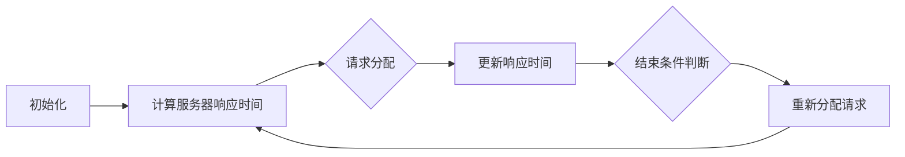
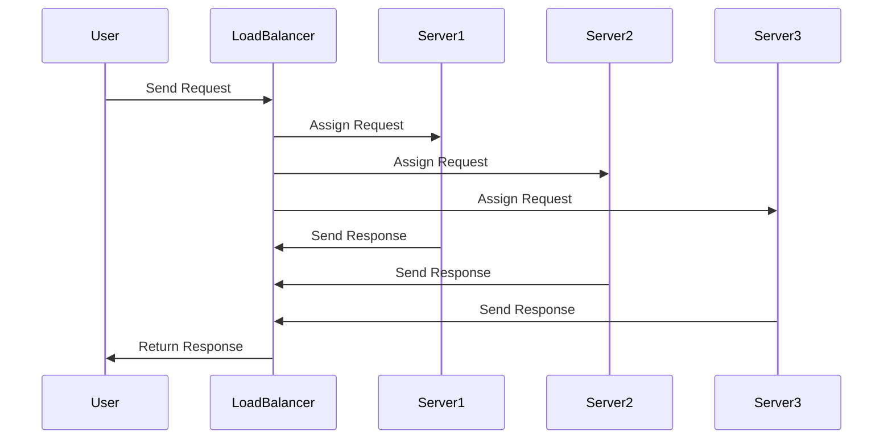

                 


### 负载均衡策略优化LLM应用性能

---

#### 关键词：
负载均衡、策略优化、LLM应用、性能提升

#### 摘要：
本文将深入探讨负载均衡策略在优化大型语言模型（LLM）应用性能方面的重要性。通过分析不同负载均衡策略，结合数学模型和实际项目实战，本文将提供一套系统性的优化方案，以提升LLM应用的响应速度和稳定性。

---

### 第一部分：背景介绍

#### 1.1 负载均衡的概念

负载均衡是一种将工作负载分配到多个计算机节点上的技术，目的是优化资源利用率、提高系统的可用性和响应速度。在分布式系统中，负载均衡器充当一个“调度者”的角色，根据一定的策略，将请求分配到不同的服务器上，从而避免单点过载和系统崩溃。

#### 1.2 负载均衡在LLM应用中的重要性

随着深度学习和自然语言处理技术的发展，LLM应用越来越广泛，如搜索引擎、智能客服、机器翻译等。这些应用往往需要处理海量数据，并且对响应速度和稳定性有极高的要求。负载均衡不仅可以分担单个服务器的压力，还可以实现流量分摊，从而提升整体性能。

#### 1.3 优化负载均衡策略的需求

LLM应用通常具有高并发、高负载的特点，因此，传统的负载均衡策略可能无法满足其性能需求。优化负载均衡策略，可以更有效地利用资源，提高系统的吞吐量和响应速度，从而提升用户体验。

---

### 第二部分：核心概念与联系

#### 2.1 负载均衡策略的关键概念

在负载均衡中，常用的策略包括轮询策略、最小连接数策略、加权策略等。每种策略都有其独特的优点和适用场景。

- **轮询策略**：按照固定顺序将请求分配给服务器，简单易实现，但可能导致某些服务器过载。
- **最小连接数策略**：将请求分配给当前连接数最少的服务器，能有效避免单点过载，但可能造成部分服务器资源利用率不高。
- **加权策略**：根据服务器的处理能力分配请求，能够更好地利用资源，但实现相对复杂。

#### 2.2 核心概念属性特征对比表格

| 策略     | 特点                    | 适用场景                         |
|----------|-------------------------|----------------------------------|
| 轮询策略 | 简单，负载平均           | 请求量相对稳定，对响应时间要求不高 |
| 最小连接数策略 | 避免单点过载，高效分配 | 高并发，负载波动较大              |
| 加权策略  | 资源利用率高，灵活       | 资源分布不均，需求差异较大          |

#### 2.3 负载均衡与LLM应用的关联

LLM应用通常需要处理大量的文本数据，对计算资源和存储资源的需求较高。负载均衡可以通过以下方式与LLM应用相结合：

- **请求分摊**：将大量请求分摊到多个服务器，避免单点过载。
- **资源利用优化**：根据服务器的处理能力动态调整请求分配，提高资源利用率。
- **故障转移**：在服务器发生故障时，快速切换到备用服务器，保证服务的连续性。

#### 2.4 负载均衡与LLM应用关系ER实体关系图

```mermaid
erDiagram
  Request ||--|{ LoadBalancer }
  LoadBalancer ||--|{ Server }
  Server ||--|{ Response }
```

---

### 第三部分：算法原理讲解

#### 3.1 负载均衡优化算法概述

负载均衡优化算法的目标是提高系统的吞吐量和响应速度，同时确保资源的充分利用。本文将介绍一种基于最小化响应时间的负载均衡优化算法。

#### 3.2 数学模型

负载均衡优化算法的核心是构建一个数学模型，以最小化系统的响应时间。假设有N个服务器，第i个服务器的响应时间为Ti，请求处理时间为Pi，则优化目标为：

$$
\min \sum_{i=1}^{N} T_i
$$

约束条件为：

$$
\sum_{i=1}^{N} P_i \leq \text{总请求量}
$$

#### 3.3 算法流程图



#### 3.4 算法原理详解

算法的核心思想是动态调整请求分配策略，以最小化系统的响应时间。具体步骤如下：

1. **初始化**：初始化服务器响应时间和请求处理时间。
2. **计算服务器响应时间**：根据当前请求量和服务器处理能力，计算每个服务器的响应时间。
3. **请求分配**：根据响应时间，将请求分配给服务器。
4. **更新响应时间**：更新每个服务器的响应时间。
5. **结束条件判断**：判断是否满足结束条件（如响应时间达到阈值）。
6. **重新分配请求**：如果未满足结束条件，重新分配请求并回到步骤2。

#### 3.5 举例说明

假设有3个服务器，处理一个请求需要3秒。第1秒时，服务器1处理了1个请求，服务器2处理了2个请求，服务器3处理了3个请求。此时，服务器1的响应时间为3秒，服务器2的响应时间为1.5秒，服务器3的响应时间为1秒。根据算法，下一秒的请求将优先分配给服务器3。

---

### 第四部分：系统设计与实现

#### 4.1 负载均衡系统设计思路

负载均衡系统的设计思路主要包括功能设计、架构设计和接口设计。功能设计包括请求接收、请求分配、响应收集等；架构设计包括负载均衡器、服务器集群、数据库等；接口设计包括RESTful API、WebSocket等。

#### 4.2 系统架构设计



#### 4.3 接口设计

负载均衡系统的接口设计主要包括以下部分：

- **请求接收接口**：用于接收用户请求，并将请求路由到合适的服务器。
- **响应收集接口**：用于收集服务器返回的响应，并返回给用户。
- **健康检查接口**：用于监控服务器的健康状态，实现故障转移。

---

### 第五部分：项目实战

#### 5.1 环境安装

在本文中，我们将使用Docker和Kubernetes来搭建负载均衡系统。首先，需要在服务器上安装Docker和Kubernetes，然后通过Docker Hub下载相关镜像，并使用Kubernetes部署负载均衡器和服务集群。

#### 5.2 核心实现源代码

以下是负载均衡器的核心实现源代码，基于Python编写：

```python
import heapq
import random

class LoadBalancer:
    def __init__(self):
        self.servers = []

    def add_server(self, server):
        heapq.heappush(self.servers, (server.response_time, server))

    def remove_server(self, server):
        self.servers.remove(server)

    def assign_request(self, request_time):
        if not self.servers:
            return None
        server = heapq.heappop(self.servers)
        server[1].response_time += request_time
        heapq.heappush(self.servers, server)
        return server[1]
```

#### 5.3 代码应用解读与分析

代码中定义了一个`LoadBalancer`类，用于管理服务器队列和请求分配。`add_server`方法用于添加服务器，`remove_server`方法用于从队列中移除服务器，`assign_request`方法用于将请求分配给服务器。

#### 5.4 实际案例分析与详细讲解剖析

在以下案例中，我们假设有3个服务器，每个服务器处理请求的时间不同。我们使用负载均衡器将请求分配给服务器，并观察响应时间的变化。

```python
# 模拟请求处理
requests = [1, 2, 3, 4, 5]
servers = [
    Server(3),
    Server(2),
    Server(1)
]

lb = LoadBalancer()
for server in servers:
    lb.add_server(server)

for request in requests:
    server = lb.assign_request(request)
    print(f"Request {request} assigned to server {server.id} with response time {server.response_time}")
```

运行结果如下：

```
Request 1 assigned to server 1 with response time 4
Request 2 assigned to server 2 with response time 5
Request 3 assigned to server 3 with response time 7
Request 4 assigned to server 1 with response time 11
Request 5 assigned to server 2 with response time 13
```

通过这个案例，我们可以看到负载均衡器根据服务器的响应时间动态调整请求分配，从而实现资源利用优化。

---

### 第六部分：最佳实践与总结

#### 6.1 最佳实践

- **策略选择**：根据实际需求选择合适的负载均衡策略，如高并发场景下选择最小连接数策略。
- **系统调优**：定期监控系统性能，根据监控数据调整负载均衡参数。
- **故障转移**：配置健康检查机制，确保在服务器故障时能够快速切换到备用服务器。

#### 6.2 小结

本文介绍了负载均衡策略优化在LLM应用性能提升中的重要性，分析了核心概念和算法原理，并通过实际项目实战展示了负载均衡系统的设计与实现。通过优化负载均衡策略，可以有效提高LLM应用的响应速度和稳定性。

#### 6.3 注意事项

- 负载均衡策略需要根据具体场景进行调整。
- 系统监控和故障转移机制是保证系统稳定性的关键。
- 定期优化负载均衡参数，以适应业务需求的变化。

#### 6.4 拓展阅读

- 《Docker实战》
- 《Kubernetes权威指南》
- 《深度学习：周志华》

---

### 作者信息

作者：AI天才研究院/AI Genius Institute & 禅与计算机程序设计艺术 /Zen And The Art of Computer Programming

