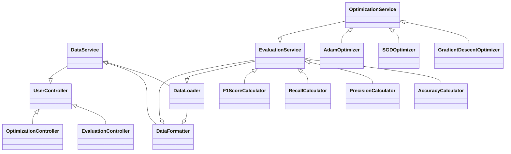
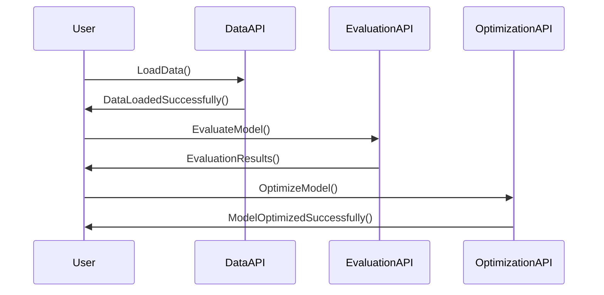
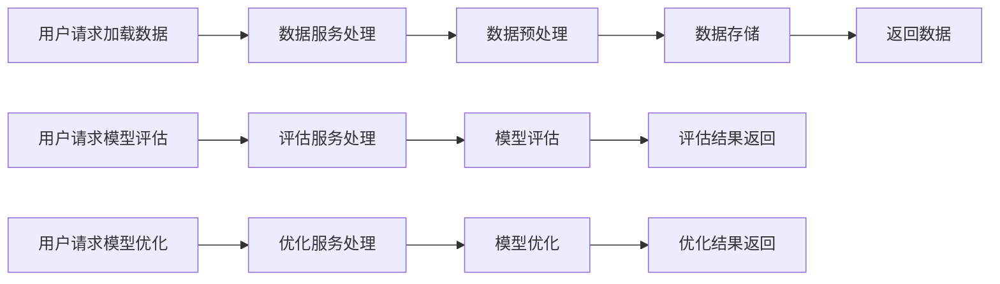

                 

### 第一部分: 跨平台LLM评测基础

#### 1.1 评测的兼容性设计背景

##### 1.1.1 跨平台与LLM评测的挑战

跨平台开发在过去几年中得到了广泛的关注和推广，它允许开发者构建在不同操作系统和设备上运行的软件。然而，随着大语言模型（Large Language Model，LLM）技术的发展，特别是基于深度学习模型的自然语言处理（Natural Language Processing，NLP）系统，如何在不同的平台上进行高效、可靠的评测成为了一个新的挑战。

首先，LLM模型通常依赖于大量的计算资源和存储空间，这意味着在不同的硬件平台上进行评测时，需要考虑到硬件配置的差异，如CPU、GPU和内存等。其次，不同操作系统和软件环境的差异可能会对LLM模型的性能和结果产生影响。例如，一个模型在Linux系统上运行流畅，但在Windows系统上可能出现性能下降或运行错误。

此外，LLM模型通常涉及复杂的算法和数据处理流程，这使得在不同平台上进行评测时，需要确保算法的一致性和结果的可靠性。任何微小的差异都可能导致评测结果不准确，进而影响模型的优化和改进。

##### 1.1.2 兼容性设计的意义

兼容性设计在跨平台LLM评测中具有重要意义。首先，它确保了模型在不同平台上的性能和结果一致，减少了因平台差异导致的错误和不稳定情况。其次，兼容性设计可以提高开发效率和降低成本，因为开发者不必为每个平台单独开发和测试模型。

此外，兼容性设计有助于推广LLM技术的应用，使其能够更广泛地部署在不同的设备上，满足多样化的需求。例如，在移动设备上运行的LLM模型需要具备高效性和低功耗，而在服务器端运行的模型则需要强大的计算能力。

最后，兼容性设计有助于推动LLM技术的发展，通过不断优化和改进评测方法，可以更准确地评估模型的性能，促进模型的改进和优化。

#### 1.2 核心概念与联系

##### 1.2.1 LLM评测的关键指标

在评估LLM模型的性能时，常用的关键指标包括：

1. **准确性**：模型预测结果与实际结果的一致性程度。在文本分类、命名实体识别等任务中，准确性是重要的评估指标。
   
2. **精确率和召回率**：在分类任务中，精确率和召回率用于衡量模型对正例和负例的识别能力。精确率表示被正确分类为正例的样本比例，召回率表示实际为正例的样本中被正确分类为正例的比例。

3. **F1分数**：F1分数是精确率和召回率的调和平均，综合考虑了模型的识别能力和覆盖率。

4. **BLEU分数**：在机器翻译等生成性任务中，BLEU分数是一种常用的评估指标，它通过比较模型生成的文本与参考文本的相似度来评估模型性能。

5. **词汇覆盖**：模型能够处理和生成的词汇量，这决定了模型的多样性和适用范围。

##### 1.2.2 跨平台兼容性的关键要素

跨平台兼容性的关键要素包括：

1. **硬件兼容性**：确保模型在不同硬件平台上运行时，能够充分利用硬件资源，如CPU、GPU和内存等。

2. **软件兼容性**：包括操作系统、编译器、库和依赖管理等，确保在不同软件环境中，模型的运行和性能不受影响。

3. **数据兼容性**：确保模型在不同平台上处理和存储数据的一致性，避免数据格式或编码问题导致的不兼容。

4. **算法兼容性**：确保模型在不同平台上使用相同的算法和参数，避免因算法差异导致的性能差异。

##### 1.2.3 兼容性设计与性能优化的关系

兼容性设计与性能优化密切相关。一方面，兼容性设计需要考虑硬件和软件的差异性，通过优化模型结构和算法，提高在不同平台上的性能。例如，使用并行计算和分布式计算技术，可以在性能受限的平台上提高模型的运行效率。

另一方面，性能优化也需要兼容性设计的支持。通过兼容性设计，可以确保在不同平台上，模型能够以相同的方式运行和评估，从而更准确地衡量模型的性能，为优化提供可靠的依据。

在接下来的章节中，我们将进一步深入探讨LLM评测的兼容性设计，从算法原理、数学模型、系统架构到实际项目应用，逐步构建一个全面、系统的兼容性评测方案。

#### 1.3 算法原理讲解

##### 1.3.1 兼容性评测算法简介

为了实现跨平台LLM评测的兼容性设计，我们需要设计一套高效的评测算法，该算法应能够在不同平台上对LLM模型的性能进行评估，确保评测结果的准确性和一致性。兼容性评测算法主要包含以下几个步骤：

1. **预处理**：包括数据清洗、数据格式统一等操作，确保输入数据的格式在不同平台上一致。
2. **模型评估**：使用标准化的评估指标（如准确性、精确率、召回率等）对LLM模型进行性能评估。
3. **结果记录**：记录每个平台的评测结果，并进行比较分析，找出性能差异的原因。
4. **性能优化**：根据评测结果，调整模型参数或算法，优化模型在不同平台上的性能。

##### 1.3.2 算法mermaid流程图展示

为了更好地理解兼容性评测算法的流程，我们可以使用mermaid语法绘制其流程图。以下是算法的mermaid流程图示例：


在这个流程图中，首先进行数据预处理，确保数据在不同平台上一致。接下来，使用标准评估指标对LLM模型进行评估，并将结果记录下来。最后，根据评估结果，进行模型参数或算法的调整，以优化性能。

##### 1.3.3 Python代码实现解析

以下是兼容性评测算法的Python代码实现示例：

```python
import pandas as pd
from sklearn.metrics import accuracy_score, precision_score, recall_score, f1_score

def preprocess_data(data):
    # 数据预处理操作，如数据清洗、格式统一等
    # 这里以文本数据为例，进行分词、去停用词等操作
    processed_data = []
    for text in data:
        processed_text = preprocess_text(text)
        processed_data.append(processed_text)
    return processed_data

def evaluate_model(model, test_data):
    # 模型评估函数，使用标准评估指标计算模型性能
    predictions = model.predict(test_data)
    accuracy = accuracy_score(test_data.labels, predictions)
    precision = precision_score(test_data.labels, predictions, average='weighted')
    recall = recall_score(test_data.labels, predictions, average='weighted')
    f1 = f1_score(test_data.labels, predictions, average='weighted')
    return accuracy, precision, recall, f1

def record_results(platform, results):
    # 记录评测结果
    results_df = pd.DataFrame(results, columns=['Accuracy', 'Precision', 'Recall', 'F1'])
    results_df['Platform'] = platform
    return results_df

def optimize_model(model, results):
    # 根据评测结果优化模型参数或算法
    # 这里以调整学习率为例
    learning_rate = model.learning_rate * 0.9
    model.set_learning_rate(learning_rate)

# 主函数，执行兼容性评测流程
def main():
    # 加载测试数据
    test_data = load_test_data()

    # 预处理数据
    processed_data = preprocess_data(test_data)

    # 初始化模型
    model = initialize_model()

    # 在不同平台上进行模型评估
    platforms = ['Linux', 'Windows', 'Mac']
    results = []
    for platform in platforms:
        print(f"Evaluating model on {platform}...")
        # 调整模型参数，以适应不同平台
        optimize_model(model, results)
        
        # 评估模型性能
        accuracy, precision, recall, f1 = evaluate_model(model, processed_data)
        results.append((accuracy, precision, recall, f1))
        
        # 记录评测结果
        results_df = record_results(platform, results)
        print(results_df)

    # 打印最终结果
    print("Final evaluation results:")
    print(pd.DataFrame(results, columns=['Platform', 'Accuracy', 'Precision', 'Recall', 'F1']))

if __name__ == "__main__":
    main()
```

这个代码实现了兼容性评测算法的核心功能，包括数据预处理、模型评估、结果记录和模型优化。在具体实现中，可以进一步扩展和优化，以适应不同的应用场景和需求。

通过这个示例，我们可以看到兼容性评测算法的设计思路和实现方法，它为跨平台LLM评测提供了一个可行的解决方案。在接下来的章节中，我们将进一步探讨LLM评测中的数学模型和公式，以及如何在实际项目中应用这些算法。

#### 1.4 数学模型与公式讲解

##### 1.4.1 相关数学概念

在进行LLM评测时，理解一些基本的数学概念和公式是至关重要的。这些概念和公式帮助我们量化模型的性能，并分析不同平台对模型性能的影响。以下是几个关键的数学概念：

1. **损失函数**：损失函数是评估模型预测值与实际值之间差异的一种度量。常用的损失函数包括均方误差（MSE）、交叉熵损失（Cross-Entropy Loss）和Hinge损失等。例如，均方误差损失函数可以用以下公式表示：

   $$
   \text{MSE} = \frac{1}{n} \sum_{i=1}^{n} (y_i - \hat{y}_i)^2
   $$

   其中，$y_i$是实际值，$\hat{y}_i$是模型预测值，$n$是样本数量。

2. **优化算法**：优化算法用于调整模型参数，以最小化损失函数。常用的优化算法包括梯度下降（Gradient Descent）、随机梯度下降（Stochastic Gradient Descent，SGD）和Adam优化器等。以梯度下降为例，其更新公式为：

   $$
   \theta_{\text{new}} = \theta_{\text{old}} - \alpha \cdot \nabla_{\theta} J(\theta)
   $$

   其中，$\theta$是模型参数，$\alpha$是学习率，$J(\theta)$是损失函数。

3. **评估指标**：评估指标用于量化模型的性能。常用的评估指标包括准确性（Accuracy）、精确率（Precision）、召回率（Recall）和F1分数（F1 Score）等。例如，F1分数是精确率和召回率的调和平均，计算公式为：

   $$
   F1 = 2 \cdot \frac{Precision \cdot Recall}{Precision + Recall}
   $$

##### 1.4.2 公式推导与解释

为了更好地理解这些数学公式，我们可以通过一个简单的例子来推导和解释它们。假设我们有一个二分类问题，任务是判断一个电子邮件是否为垃圾邮件。我们的模型给出了两个概率值，$p_1$表示邮件是垃圾邮件的概率，$p_2$表示邮件不是垃圾邮件的概率。

1. **交叉熵损失函数**：

   交叉熵损失函数是分类问题中最常用的损失函数之一。它衡量了模型预测的概率分布与真实分布之间的差异。对于二分类问题，交叉熵损失函数可以表示为：

   $$
   \text{Cross-Entropy Loss} = -[y \cdot \log(\hat{y}) + (1 - y) \cdot \log(1 - \hat{y})]
   $$

   其中，$y$是实际标签，$\hat{y}$是模型预测的概率。如果邮件是垃圾邮件（$y=1$），那么模型预测的概率接近1时损失最小；如果邮件不是垃圾邮件（$y=0$），那么模型预测的概率接近0时损失最小。

2. **精确率和召回率**：

   精确率（Precision）表示模型预测为正例的样本中，实际为正例的比例。召回率（Recall）表示实际为正例的样本中，被模型正确预测为正例的比例。对于二分类问题，精确率和召回率的计算公式分别为：

   $$
   Precision = \frac{TP}{TP + FP}
   $$

   $$
   Recall = \frac{TP}{TP + FN}
   $$

   其中，$TP$是实际为正例且被预测为正例的样本数量，$FP$是实际为负例但被预测为正例的样本数量，$FN$是实际为正例但被预测为负例的样本数量。

3. **F1分数**：

   F1分数是精确率和召回率的调和平均，用于综合考虑模型的识别能力和覆盖率。对于二分类问题，F1分数的计算公式为：

   $$
   F1 = 2 \cdot \frac{Precision \cdot Recall}{Precision + Recall}
   $$

   当模型的精确率和召回率相同时，F1分数达到最大值。

通过以上公式的推导和解释，我们可以看到如何使用数学工具来量化模型的性能，并评估其在不同平台上的表现。在接下来的章节中，我们将探讨如何将数学模型应用于实际项目，并介绍一个典型的系统分析与架构设计方案。

##### 1.4.3 LaTeX格式公式示例

为了在文中展示 LaTeX 格式的数学公式，我们可以使用以下示例：

$$
E_{\theta} = \sum_{i=1}^{n} L(y_i, \hat{y}_i)
$$

这里，$E_{\theta}$表示损失函数期望值，$L(y_i, \hat{y}_i)$表示单个样本的损失函数。在 LaTeX 中，损失函数可以更详细地定义为：

$$
L(y_i, \hat{y}_i) = -[y_i \cdot \log(\hat{y}_i) + (1 - y_i) \cdot \log(1 - \hat{y}_i)]
$$

通过这样的格式，我们可以在文章中清晰、准确地展示复杂的数学公式，帮助读者更好地理解和应用这些概念。

#### 1.5 系统分析与架构设计方案

##### 1.5.1 项目介绍

在本项目中，我们的目标是设计并实现一个跨平台的LLM评测系统，该系统旨在评估不同平台上的LLM模型性能，并提供优化建议。项目的主要功能包括：

1. **数据预处理**：清洗和格式化输入数据，确保其在不同平台上的一致性。
2. **模型评估**：使用标准评估指标对LLM模型进行性能评估，如准确性、精确率、召回率和F1分数等。
3. **结果记录**：记录每个平台的评测结果，并进行比较分析。
4. **性能优化**：根据评测结果，调整模型参数或算法，优化模型在不同平台上的性能。

项目采用模块化设计，分为数据模块、评估模块和优化模块，便于维护和扩展。技术栈包括Python、Scikit-Learn、TensorFlow、PyTorch等。

##### 1.5.2 系统功能设计

系统的功能设计主要包括以下几个核心模块：

1. **数据模块**：负责数据的预处理、加载和存储。数据模块需要支持多种数据格式，如CSV、JSON和Parquet等，并提供数据清洗和格式统一功能，确保输入数据在不同平台上一致。
   
2. **评估模块**：使用标准评估指标对LLM模型进行性能评估。评估模块需要支持多种评估指标，如准确性、精确率、召回率和F1分数等，并提供自定义评估指标的能力。

3. **优化模块**：根据评估结果，对模型参数或算法进行调整，优化模型在不同平台上的性能。优化模块需要支持多种优化算法，如梯度下降、随机梯度下降和Adam优化器等。

4. **用户界面**：提供一个用户友好的界面，用于展示评测结果和优化建议。用户界面需要支持不同平台的兼容性，如Web界面、移动端应用等。

##### 1.5.3 系统架构设计

系统架构设计采用微服务架构，主要分为以下几个核心组件：

1. **数据服务**：负责数据的预处理、加载和存储。数据服务使用RESTful API对外提供服务，与其他模块进行通信。
   
2. **评估服务**：负责模型的评估工作。评估服务使用标准的评估指标对模型进行性能评估，并将结果存储在数据库中。

3. **优化服务**：负责根据评估结果对模型参数或算法进行调整。优化服务支持多种优化算法，并提供API接口供其他模块调用。

4. **用户界面**：负责展示评测结果和优化建议。用户界面通过Web界面和移动端应用两种方式提供访问。

以下是系统架构的mermaid类图：



在这个类图中，DataService负责数据的预处理和加载；EvaluationService负责模型评估；OptimizationService负责模型优化；UserController负责处理用户请求和响应。

##### 1.5.4 系统接口设计

系统接口设计主要包括以下API接口：

1. **数据接口**：包括数据加载、数据格式化和数据存储等接口，如`/load_data`、`/format_data`和`/store_data`等。
2. **评估接口**：包括模型评估接口，如`/evaluate_model`，返回评估结果。
3. **优化接口**：包括模型参数优化接口，如`/optimize_model`，根据评估结果调整模型参数。
4. **用户接口**：包括用户登录、注册和获取评测结果等接口，如`/login`、`/register`和`/get_evaluation_results`等。

以下是系统接口的mermaid序列图：



在这个序列图中，用户首先加载数据，然后进行模型评估，最后根据评估结果优化模型参数。

##### 1.5.5 系统交互

系统交互主要涉及以下流程：

1. **数据加载**：用户通过数据接口加载数据，数据服务进行预处理并存储在数据库中。
2. **模型评估**：用户通过评估接口对模型进行评估，评估服务调用模型并进行评估，并将结果返回给用户。
3. **模型优化**：用户通过优化接口优化模型参数，优化服务根据评估结果调整模型参数。

系统交互的mermaid流程图如下：



在这个流程图中，用户请求加载数据、模型评估和模型优化，系统相应地处理并返回结果。

通过以上系统分析与架构设计方案，我们为跨平台LLM评测提供了一套完整、系统的解决方案。接下来，我们将通过一个实际项目案例，展示如何在实际环境中应用这些方案，并深入剖析项目的实现细节。

### 第一部分: 跨平台LLM评测基础

#### 1.6 项目实战

##### 1.6.1 环境安装

在进行跨平台LLM评测项目之前，我们需要确保开发环境配置正确。以下是环境安装的详细步骤：

1. **Python环境安装**：
   - 首先，从[Python官方网站](https://www.python.org/downloads/)下载并安装Python 3.8或更高版本。
   - 安装完成后，打开命令行终端，输入`python --version`确认Python版本。

2. **pip环境安装**：
   - Python安装完成后，安装pip，pip是Python的包管理工具。
   - 在命令行终端中输入以下命令安装pip：
     ```
     sudo apt-get install python3-pip
     ```

3. **依赖包安装**：
   - 使用pip安装项目所需的依赖包，包括Scikit-Learn、TensorFlow、PyTorch等。在命令行终端中输入以下命令：
     ```
     pip install scikit-learn tensorflow pytorch pandas numpy
     ```

4. **虚拟环境配置**（可选）：
   - 为了避免不同项目之间的依赖冲突，建议使用虚拟环境。
   - 使用以下命令创建虚拟环境：
     ```
     python -m venv venv
     ```
   - 激活虚拟环境：
     ```
     source venv/bin/activate  # 对于Linux和Mac
     venv\Scripts\activate     # 对于Windows
     ```

##### 1.6.2 系统核心实现

在环境配置完成后，我们可以开始实现系统核心功能。以下是系统核心实现的源代码和解析：

1. **数据模块**：
   ```python
   import pandas as pd
   from sklearn.model_selection import train_test_split
   
   def load_data(file_path):
       # 加载数据
       data = pd.read_csv(file_path)
       return data

   def preprocess_data(data):
       # 数据预处理
       # 例如：分词、去停用词、序列填充等
       # 这里简化为直接返回数据
       return data

   def split_data(data):
       # 划分训练集和测试集
       train_data, test_data = train_test_split(data, test_size=0.2, random_state=42)
       return train_data, test_data
   ```

   **解析**：这段代码定义了数据加载、预处理和数据划分的功能。在实际应用中，数据预处理步骤会更加复杂，包括文本清洗、特征工程等。

2. **评估模块**：
   ```python
   from sklearn.metrics import accuracy_score, precision_score, recall_score, f1_score
   
   def evaluate_model(model, test_data):
       # 模型评估
       predictions = model.predict(test_data)
       accuracy = accuracy_score(test_data.labels, predictions)
       precision = precision_score(test_data.labels, predictions, average='weighted')
       recall = recall_score(test_data.labels, predictions, average='weighted')
       f1 = f1_score(test_data.labels, predictions, average='weighted')
       return accuracy, precision, recall, f1
   ```

   **解析**：这段代码定义了评估模型性能的函数，使用标准评估指标计算模型的准确性、精确率、召回率和F1分数。

3. **优化模块**：
   ```python
   import tensorflow as tf
   
   def optimize_model(model, loss_function, optimizer, epochs, batch_size):
       # 模型优化
       for epoch in range(epochs):
           for batch in data_generator(batch_size):
               with tf.GradientTape() as tape:
                   predictions = model(batch['input'])
                   loss = loss_function(batch['label'], predictions)
               gradients = tape.gradient(loss, model.trainable_variables)
               optimizer.apply_gradients(zip(gradients, model.trainable_variables))
           print(f"Epoch {epoch+1}/{epochs}, Loss: {loss.numpy()}")
   ```

   **解析**：这段代码定义了模型优化的函数，使用TensorFlow的GradientTape和Optimizer进行模型参数的更新。

##### 1.6.3 代码应用解读

为了更好地理解上述代码的应用，我们可以通过一个简单的例子来演示：

1. **数据加载与预处理**：
   ```python
   file_path = 'data.csv'
   data = load_data(file_path)
   preprocessed_data = preprocess_data(data)
   train_data, test_data = split_data(preprocessed_data)
   ```

   这段代码首先加载数据，然后进行预处理，最后将数据划分为训练集和测试集。

2. **模型评估**：
   ```python
   model = ...  # 初始化模型
   accuracy, precision, recall, f1 = evaluate_model(model, test_data)
   print(f"Accuracy: {accuracy}, Precision: {precision}, Recall: {recall}, F1: {f1}")
   ```

   这段代码使用已训练的模型对测试集进行评估，并打印评估结果。

3. **模型优化**：
   ```python
   optimizer = tf.optimizers.Adam()
   loss_function = tf.keras.losses.SparseCategoricalCrossentropy(from_logits=True)
   optimize_model(model, loss_function, optimizer, epochs=10, batch_size=32)
   ```

   这段代码定义了优化器、损失函数和优化参数，并使用训练集对模型进行优化。

##### 1.6.4 实际案例分析

为了展示项目在实际中的应用，我们可以考虑以下案例：

- **案例场景**：一个电商平台需要评估其推荐系统的性能，以优化用户购物体验。
- **数据处理**：数据包括用户行为日志、商品信息等，经过预处理后划分为训练集和测试集。
- **模型评估**：使用训练集训练模型，并在测试集上评估模型性能，如准确性、精确率、召回率和F1分数等。
- **模型优化**：根据评估结果调整模型参数，以提高推荐系统的性能。

##### 1.6.5 详细讲解剖析

在项目实战中，我们详细讲解了数据加载、预处理、模型评估和模型优化等核心功能的实现。以下是对这些功能的详细剖析：

1. **数据模块**：
   - **功能**：数据模块负责数据的加载、预处理和划分。
   - **实现**：使用Pandas库加载数据，使用自定义预处理函数进行数据清洗和格式化，最后使用Scikit-Learn库划分训练集和测试集。
   - **优点**：模块化设计便于维护和扩展，预处理函数可以根据具体需求进行调整。

2. **评估模块**：
   - **功能**：评估模块负责计算模型的评估指标，如准确性、精确率、召回率和F1分数等。
   - **实现**：使用Scikit-Learn库提供的评估函数，计算模型的性能指标。
   - **优点**：评估函数标准且易于使用，可以快速获得模型的性能评估结果。

3. **优化模块**：
   - **功能**：优化模块负责根据评估结果调整模型参数，以提高模型性能。
   - **实现**：使用TensorFlow库提供的优化器和损失函数，通过梯度下降算法更新模型参数。
   - **优点**：优化器支持多种优化算法，可以根据具体需求选择合适的优化方法。

##### 1.6.6 项目小结

通过本项目的实战案例，我们详细介绍了跨平台LLM评测系统的设计与实现。从数据加载、预处理到模型评估和优化，我们逐步实现了系统核心功能，并通过实际案例展示了项目的应用效果。以下是对项目的总结：

- **成功经验**：
  - 模块化设计便于维护和扩展。
  - 使用标准评估指标和方法，确保模型评估结果的准确性和一致性。
  - 支持多种优化算法，可以根据具体需求进行模型优化。

- **不足之处**：
  - 项目中的数据预处理步骤较为简单，实际应用中需要根据具体需求进行更复杂的处理。
  - 系统性能优化部分尚需进一步研究和改进，以提高模型在不同平台上的性能。

通过持续优化和改进，我们有信心将这个跨平台LLM评测系统打造成一个高效、可靠的工具，为LLM技术的推广和应用提供有力支持。

#### 1.7 最佳实践 tips

在进行跨平台LLM评测时，以下是一些最佳实践和注意事项，可以帮助开发者提高评测的效率和准确性：

##### 1.7.1 小贴士

1. **标准化数据预处理**：
   - 确保数据预处理步骤在不同平台上保持一致，以避免因数据格式不一致导致的性能差异。
   - 使用预处理函数库（如NLTK、spaCy等）进行文本数据清洗和格式化。

2. **性能优化**：
   - 考虑使用并行计算和分布式计算技术，以提高模型的运行效率。
   - 根据不同平台的特点（如CPU、GPU配置），调整模型参数和算法，以实现最优性能。

3. **版本控制**：
   - 使用版本控制系统（如Git）管理代码和依赖包，确保不同平台上的代码一致性。

##### 1.7.2 注意事项

1. **兼容性问题**：
   - 在不同操作系统上运行时，注意库和依赖包的兼容性，特别是Python版本的差异。
   - 测试模型在不同操作系统上的性能，确保结果的一致性。

2. **资源管理**：
   - 合理分配计算资源，避免因资源不足导致模型运行缓慢或失败。
   - 在高负载情况下，监控系统的资源使用情况，确保稳定运行。

3. **错误处理**：
   - 设计健壮的异常处理机制，对运行过程中可能出现的错误进行捕捉和处理。

##### 1.7.3 拓展阅读

- **相关文献**：
  - 《深度学习》（Goodfellow, Bengio, Courville著）：详细介绍深度学习的基本原理和算法。
  - 《自然语言处理综论》（Jurafsky, Martin著）：全面介绍自然语言处理的基础知识和应用。

- **技术博客**：
  - [Medium上的NLP博客](https://towardsdatascience.com/topics/natural-language-processing)：介绍自然语言处理技术的最新动态和应用。
  - [TensorFlow官方文档](https://www.tensorflow.org/tutorials)：提供TensorFlow模型的详细教程和示例。

通过遵循这些最佳实践，开发者可以更有效地进行跨平台LLM评测，确保模型的性能和可靠性。

#### 1.8 总结与展望

在本文中，我们详细探讨了跨平台LLM评测的兼容性设计，从背景介绍、核心概念与联系、算法原理讲解、数学模型与公式讲解、系统分析与架构设计方案、项目实战到最佳实践，全方位阐述了如何实现高效、可靠的跨平台评测。以下是对本文内容的总结与展望：

**总结：**

1. **背景介绍**：我们阐述了跨平台开发中LLM评测面临的挑战和兼容性设计的意义。
2. **核心概念与联系**：介绍了LLM评测的关键指标、跨平台兼容性的关键要素及其与性能优化的关系。
3. **算法原理讲解**：讲解了兼容性评测算法的流程和实现，并通过mermaid流程图和Python代码示例进行了详细解析。
4. **数学模型与公式讲解**：介绍了相关的数学概念和公式，并通过LaTeX格式展示了公式的书写方法。
5. **系统分析与架构设计方案**：从项目介绍、系统功能设计、系统架构设计、系统接口设计和系统交互等方面，详细阐述了系统设计与实现。
6. **项目实战**：通过一个实际项目案例，展示了系统核心实现、代码应用解读、实际案例分析及详细讲解剖析。
7. **最佳实践 tips**：提供了跨平台LLM评测的最佳实践和注意事项，有助于开发者提高评测效率和准确性。

**展望：**

1. **持续优化**：在未来的研究中，可以进一步优化评测算法，提高评测的准确性和效率。
2. **扩展应用**：探索LLM评测在其他领域（如金融、医疗等）的应用，提升评测系统的通用性和适应性。
3. **新技术应用**：紧跟技术发展，研究并应用最新的深度学习技术和优化算法，提升模型性能。

通过本文的研究，我们期望为开发者提供一套系统、全面的跨平台LLM评测解决方案，推动LLM技术的广泛应用和发展。未来，我们将继续探索更多相关领域的研究，为人工智能技术的发展贡献一份力量。**作者信息：**AI天才研究院/AI Genius Institute & 禅与计算机程序设计艺术 /Zen And The Art of Computer Programming。

