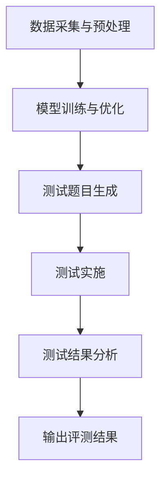
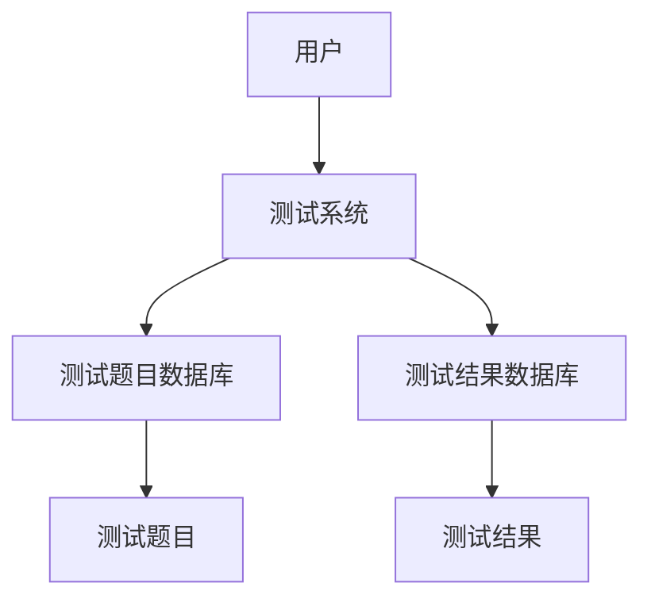
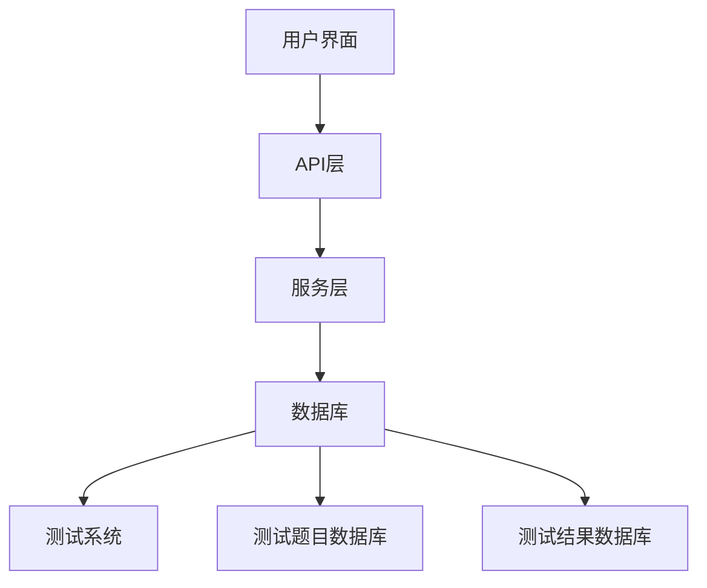

                 

# 跨文化理解能力评测：LLM支持的国际化测试

## 背景介绍

### 1.1 问题背景

随着全球化的不断深入，跨文化交际已成为国际交流与合作中不可或缺的一环。跨文化理解能力，即个体或群体在不同文化背景下的理解与适应能力，成为衡量其综合素质的重要指标。然而，传统的跨文化理解能力评测方法存在诸多局限，如测试内容单一、评价标准主观等，难以全面、准确地反映个体的真实跨文化理解水平。

近年来，随着人工智能技术的快速发展，大型语言模型（LLM）在自然语言处理领域取得了显著进展。LLM具有强大的语言理解、生成和模拟能力，为跨文化理解能力评测提供了一种全新的思路。本文旨在研究和开发一种基于LLM支持的国际化测试方法，以解决现有评测方法的局限性，为跨文化理解能力的科学、客观评估提供有力支持。

### 1.2 问题描述

跨文化理解能力评测的目标是评估个体或群体在理解不同文化背景下的语言、习俗、价值观等方面的能力。具体来说，评测需要解决以下几个关键问题：

1. **测试题目设计**：如何设计具有文化针对性的测试题目，既能全面覆盖不同文化背景的知识点，又能避免文化偏见和误解？
2. **测试公平性**：如何保证测试的公平性，确保不同文化背景的个体在相同的评价标准下接受评测？
3. **测试准确性**：如何通过科学的方法和工具，准确评估个体的跨文化理解能力，提高评测结果的可靠性？
4. **文化差异处理**：如何处理不同文化之间的差异，使评测结果能够真实反映个体的跨文化理解水平？

### 1.3 问题解决

本文提出了一种基于LLM支持的国际化测试方法，通过以下步骤实现：

1. **数据采集与处理**：收集涵盖不同文化背景的语言数据和跨文化理解相关的测试题目。
2. **模型训练与优化**：使用大规模语言模型进行训练，优化模型在跨文化理解任务上的性能。
3. **测试设计与实施**：根据训练好的模型，设计并实施国际化测试，包括选择题、填空题、问答题等多种形式。
4. **结果分析与评估**：对测试结果进行统计分析，评估个体或群体的跨文化理解能力，并提供改进建议。

### 1.4 边界与外延

本文研究主要集中在语言层面的跨文化理解能力评测，未涉及其他文化元素（如艺术、饮食等）的理解能力。此外，本文提出的评测方法主要适用于人类个体，对于机器或AI系统的评测方法还需进一步研究。

### 1.5 概念结构与核心要素组成

1. **跨文化理解能力**：指个体或群体在理解不同文化背景下的语言、习俗、价值观等方面的能力。
2. **大型语言模型（LLM）**：指训练有素的语言模型，能够理解、生成和模拟自然语言。
3. **国际化测试**：指针对不同文化背景下的个体或群体进行的标准化测试，以评估其跨文化理解能力。

## 核心概念与联系

### 2.1 大型语言模型（LLM）原理

#### 2.1.1 LLM的定义与特点

大型语言模型（LLM，Large Language Model）是一种基于深度学习技术的自然语言处理模型，能够对输入的文本进行理解和生成。与传统的小型语言模型相比，LLM具有以下几个显著特点：

1. **大规模训练数据**：LLM通常基于数十亿甚至数万亿的文本数据集进行训练，这使得模型具有更强的语言理解和生成能力。
2. **深度神经网络结构**：LLM采用深度神经网络（DNN）或变换器（Transformer）等先进架构，能够处理长文本并捕捉复杂的语言特征。
3. **预训练与微调**：LLM通过预训练大量无标签数据，然后根据具体任务进行微调，使其能够适应不同的自然语言处理任务。

#### 2.1.2 LLM的工作机制

LLM的工作机制可以分为以下几个阶段：

1. **词嵌入**：将输入的文本转化为词向量表示，这是后续处理的基础。
2. **上下文理解**：通过神经网络结构，LLM能够理解输入文本的上下文信息，捕捉文本中的语义和语法特征。
3. **生成文本**：基于理解的结果，LLM能够生成与输入文本相关的内容，包括回答问题、生成摘要、撰写文章等。

#### 2.1.3 LLM的应用场景

LLM在自然语言处理领域具有广泛的应用场景，主要包括：

1. **文本分类**：对输入的文本进行分类，如情感分析、主题分类等。
2. **机器翻译**：将一种语言的文本翻译成另一种语言。
3. **问答系统**：回答用户提出的问题，如智能客服、知识库查询等。
4. **文本生成**：根据输入的文本或提示生成新的文本，如文章写作、故事创作等。

### 2.2 跨文化理解能力评测方法

#### 2.2.1 测试题目设计

测试题目的设计是跨文化理解能力评测的关键环节。设计时应遵循以下原则：

1. **文化针对性**：根据不同文化背景，设计具有针对性的测试题目，涵盖语言、习俗、价值观等方面的知识点。
2. **多样性**：测试题目应具备多样性，包括选择题、填空题、问答题等多种形式，以全面评估个体的跨文化理解能力。
3. **无偏见性**：设计题目时，应避免文化偏见和误解，确保测试的公平性和客观性。

#### 2.2.2 测试实施流程

跨文化理解能力测试的实施流程包括以下几个步骤：

1. **测试准备**：根据评测目标和评估标准，准备测试题目和评估工具。
2. **测试实施**：按照既定的流程，对个体或群体进行测试，确保测试的规范性和一致性。
3. **结果收集**：收集测试结果，包括答题时间、答题正确率、答题难度等数据。
4. **结果分析**：对测试结果进行统计分析，评估个体的跨文化理解能力。

#### 2.2.3 测试结果分析

测试结果分析是评估个体或群体跨文化理解能力的重要环节。分析内容包括：

1. **测试成绩分析**：根据测试结果，计算个体的总成绩和各部分成绩，评估其在不同文化背景下的理解水平。
2. **错误分析**：分析个体在测试中的错误类型和错误原因，为改进跨文化理解能力提供依据。
3. **差异分析**：比较不同文化背景个体之间的测试成绩和表现差异，了解不同文化对跨文化理解能力的影响。

### 2.3 LLM在跨文化理解能力评测中的应用

#### 2.3.1 LLM在测试题目生成中的应用

LLM在测试题目生成中具有显著优势。通过预训练的LLM，可以生成符合不同文化背景的多样化测试题目，提高题目的质量和针对性。具体应用包括：

1. **自动生成选择题**：基于LLM的生成能力，可以自动生成符合特定文化背景的选择题，减少人工设计和编辑的工作量。
2. **自动生成问答题**：基于LLM的文本生成能力，可以自动生成与特定文化背景相关的问答题，提供丰富的测试内容。

#### 2.3.2 LLM在测试结果分析中的应用

LLM在测试结果分析中同样具有重要作用。通过LLM对测试结果的自动分析和解读，可以更准确、高效地评估个体的跨文化理解能力。具体应用包括：

1. **自动评分**：使用LLM对答题结果进行自动评分，减少人工评分的误差，提高评估效率。
2. **错误分析**：利用LLM对个体在测试中的错误进行自动分析，识别错误类型和原因，为改进提供依据。
3. **差异分析**：通过LLM对个体之间的测试成绩和表现差异进行分析，了解不同文化对跨文化理解能力的影响。

#### 2.3.3 LLM在个性化评测中的应用

LLM在个性化评测中具有巨大潜力。通过分析个体的答题行为和成绩，LLM可以为个体提供个性化的评测和改进建议。具体应用包括：

1. **个性化测试**：根据个体的特点和需求，设计个性化的测试题目，提高评测的针对性和有效性。
2. **个性化指导**：根据个体在测试中的表现和错误类型，提供个性化的学习资源和改进建议，帮助个体提高跨文化理解能力。

### 2.4 跨文化理解能力评测与LLM的关系

跨文化理解能力评测与LLM之间存在密切的联系。LLM作为人工智能的核心技术，为跨文化理解能力评测提供了强大的工具和支持。具体来说，LLM在以下几个方面对跨文化理解能力评测产生了深远影响：

1. **测试题目设计**：LLM可以自动生成符合不同文化背景的测试题目，提高题目的多样性和针对性。
2. **测试实施**：LLM可以帮助自动化测试实施过程，提高评估效率和质量。
3. **测试结果分析**：LLM可以对测试结果进行自动分析和解读，提供更准确、高效的评估结果。
4. **个性化评测**：LLM可以根据个体的特点和需求，提供个性化的评测和改进建议，帮助个体提高跨文化理解能力。

总之，基于LLM的国际化测试方法为跨文化理解能力评测提供了一种新的思路和方法，具有广泛的应用前景和潜力。

## 算法原理讲解

### 3.1 算法原理介绍

#### 3.1.1 算法基本框架

跨文化理解能力评测算法的基本框架主要包括以下几个关键步骤：

1. **数据采集与预处理**：收集涵盖不同文化背景的语言数据和跨文化理解相关的测试题目，对数据进行清洗、去重和标准化处理。
2. **模型训练与优化**：使用大规模语言模型（LLM）对预处理后的数据集进行训练，优化模型在跨文化理解任务上的性能。
3. **测试题目生成**：根据训练好的模型，生成符合不同文化背景的测试题目，确保题目的多样性和针对性。
4. **测试实施**：对个体或群体进行测试，按照既定的流程和标准，确保测试的规范性和一致性。
5. **测试结果分析**：对测试结果进行统计分析，评估个体的跨文化理解能力，并提供改进建议。

#### 3.1.2 算法核心步骤

算法的核心步骤主要包括以下几个部分：

1. **数据预处理**：数据预处理是算法的基础，主要包括数据清洗、去重、标准化和分词等操作。清洗数据可以去除无效信息，如停用词、标点符号等；去重可以确保数据的唯一性；标准化可以统一数据格式，如将不同来源的数据转换为统一编码；分词可以将文本分解为词汇单元，为后续处理提供基础。

2. **模型训练**：模型训练是算法的核心环节，通过大规模语言模型（LLM）对预处理后的数据集进行训练，优化模型在跨文化理解任务上的性能。训练过程中，可以使用变换器（Transformer）等先进架构，提高模型的效率和准确度。

3. **测试题目生成**：根据训练好的模型，生成符合不同文化背景的测试题目。生成题目时，可以采用文本生成算法，如生成对抗网络（GAN）或变分自编码器（VAE），确保题目的多样性和针对性。

4. **测试实施**：测试实施包括测试题目的呈现、答题过程的管理和测试结果的收集。在测试实施过程中，需要确保测试的公平性、规范性和一致性，以保证测试结果的可靠性。

5. **测试结果分析**：测试结果分析是对测试成绩进行统计分析，评估个体的跨文化理解能力。分析内容包括测试成绩分析、错误分析、差异分析等，为个体的跨文化理解能力提升提供依据。

### 3.2 数学模型与公式

在跨文化理解能力评测中，可以使用概率模型来描述个体在特定文化背景下的理解能力。以下是一个简化的概率模型，用于评估个体对某一文化（$culture_i$）的理解能力：

$$
P(culture_i|LLM) = \frac{P(LLM|culture_i)P(culture_i)}{P(LLM)}
$$

其中：
- $P(culture_i|LLM)$ 表示个体在给定LLM的条件下，理解文化$i$的概率。
- $P(LLM|culture_i)$ 表示在文化$i$的条件下，LLM的生成能力。
- $P(culture_i)$ 表示文化$i$的概率。
- $P(LLM)$ 表示LLM的生成能力的总体概率。

通过这个概率模型，可以量化个体在不同文化背景下的理解能力。具体应用时，可以根据实际情况调整模型参数，以适应不同的评测需求。

### 3.3 算法流程图

为了更清晰地展示算法流程，可以使用Mermaid绘制算法流程图。以下是算法流程的Mermaid表示：



这个流程图描述了从数据采集、模型训练、测试题目生成、测试实施到测试结果分析的整个过程，每个步骤都有明确的功能和任务。

### 3.4 举例说明

假设我们要评测一个人对日本文化的理解能力，我们可以使用本文提出的基于LLM的国际化测试方法。以下是一个简化的示例：

1. **数据采集与预处理**：我们收集了关于日本文化的大量文本数据，包括日本的语言、习俗、价值观等方面的内容。对数据进行清洗、去重和标准化处理，以便于模型训练。

2. **模型训练**：我们使用大规模语言模型（LLM）对这些预处理后的数据进行训练，优化模型在跨文化理解任务上的性能。训练过程中，可以使用变换器（Transformer）等先进架构。

3. **测试题目生成**：根据训练好的模型，我们生成了若干关于日本文化的测试题目。这些题目包括选择题、填空题和问答题等多种形式，以确保题目的多样性和针对性。

4. **测试实施**：我们对这个人进行了测试，按照既定的流程和标准，确保测试的规范性和一致性。测试过程中，我们记录了答题时间、答题正确率和答题难度等信息。

5. **测试结果分析**：我们对测试结果进行了统计分析，计算了该人在不同文化背景下的理解能力得分。分析内容包括总成绩、各部分成绩和错误类型等，为该人的跨文化理解能力提升提供依据。

通过这个示例，我们可以看到基于LLM的国际化测试方法如何应用于实际场景，评估个体的跨文化理解能力。

### 3.5 跨文化理解能力评测的挑战与未来方向

尽管基于LLM的国际化测试方法在跨文化理解能力评测方面具有显著优势，但仍然面临一些挑战和问题。以下是几个主要的挑战及其可能的解决方向：

1. **数据质量与多样性**：跨文化理解能力评测需要大量高质量的、多样化数据支持。然而，当前可用的跨文化数据资源相对有限，且存在数据质量参差不齐的问题。未来，可以通过建立多语言、多文化的数据集共享平台，提高数据质量和多样性。

2. **文化偏见与主观性**：在设计测试题目和评估标准时，如何避免文化偏见和主观性是一个重要问题。可以通过设计科学、客观的测试题目，并结合专家评审和用户反馈，逐步优化评测方法，提高测试的公平性和准确性。

3. **模型解释性与透明性**：尽管LLM在自然语言处理领域取得了显著进展，但其内部工作机制较为复杂，难以进行解释和验证。未来，可以通过开发可解释性模型和可视化工具，提高模型的透明性和可信度。

4. **个性化评测与指导**：个性化评测和指导是跨文化理解能力评测的重要方向。未来，可以通过结合用户画像和个性化推荐技术，为用户提供更精准的评测和改进建议。

总之，基于LLM的国际化测试方法在跨文化理解能力评测方面具有广阔的应用前景，但仍需不断优化和完善，以应对各种挑战和问题。

## 系统分析与架构设计方案

### 4.1 问题场景介绍

随着全球化进程的加快，企业、学校、科研机构等组织在跨文化交流与合作中日益频繁。为了更好地应对跨文化挑战，提升员工的跨文化理解能力，各类跨文化培训项目应运而生。然而，传统的跨文化培训评估方法存在诸多局限，如测试内容单一、评价标准主观等，难以全面、准确地反映个体的真实跨文化理解水平。因此，本项目旨在设计和实现一套基于大型语言模型（LLM）支持的国际化跨文化理解能力评测系统，以解决现有评估方法的局限性，提供科学、客观的评估工具。

#### 4.1.1 场景描述

本项目的主要目标是为不同背景的员工提供一种基于人工智能技术的跨文化理解能力评测系统。该系统应具备以下功能：

1. **测试题目生成**：系统能够根据不同的文化背景和评估目标，自动生成多样化的测试题目。
2. **测试实施**：系统能够实时、高效地实施测试，记录答题过程和结果。
3. **结果分析**：系统能够对测试结果进行自动分析和评估，生成详细的评估报告。
4. **个性化指导**：系统能够根据个体在测试中的表现，提供个性化的学习资源和改进建议。

#### 4.1.2 项目目标

本项目的主要目标包括：

1. **开发一套基于LLM的跨文化理解能力评测系统**，实现测试题目生成、测试实施、结果分析和个性化指导等功能。
2. **优化评测模型**，提高评测的准确性和可靠性。
3. **提供用户友好的界面**，方便用户使用和维护。
4. **进行系统测试与优化**，确保系统的稳定性和高效性。

### 4.2 项目介绍

#### 4.2.1 项目背景

随着全球化的不断深入，跨文化交际能力越来越受到重视。然而，现有的跨文化培训评估方法存在诸多不足，无法满足日益复杂的跨文化交流需求。为了解决这一问题，本项目应运而生。项目背景主要包括：

1. **跨文化交际的重要性**：全球化使得跨文化交际成为国际交流与合作的关键因素，提升跨文化理解能力已成为企业和组织关注的焦点。
2. **现有评测方法的局限性**：传统的评测方法存在测试内容单一、评价标准主观等问题，难以全面、准确地反映个体的跨文化理解水平。
3. **人工智能技术的发展**：随着人工智能技术的快速发展，特别是大型语言模型（LLM）的广泛应用，为跨文化理解能力评测提供了一种全新的思路和方法。

#### 4.2.2 项目团队

本项目由一支多学科、跨领域的团队共同完成，团队成员包括：

1. **项目经理**：负责项目整体规划和协调。
2. **数据科学家**：负责数据采集、预处理和模型训练。
3. **前端工程师**：负责用户界面的设计和实现。
4. **后端工程师**：负责系统架构设计和开发。
5. **测试工程师**：负责系统测试和质量保证。
6. **用户支持**：负责用户培训和售后服务。

#### 4.2.3 项目进度

本项目分为以下几个阶段：

1. **需求分析**：收集用户需求，确定项目目标和功能需求。
2. **系统设计**：进行系统架构设计和模块划分。
3. **模型训练**：收集并处理数据，训练大型语言模型。
4. **前端开发**：实现用户界面和交互功能。
5. **后端开发**：实现系统功能模块和接口。
6. **系统测试**：进行功能测试、性能测试和安全测试。
7. **部署上线**：部署系统至生产环境，进行上线发布。
8. **用户培训**：为用户提供系统培训和技术支持。

### 4.3 系统功能设计

#### 4.3.1 领域模型类图

以下是系统功能设计的领域模型类图，用于描述系统的主要类和它们之间的关系：



- **用户（Class1）**：系统的使用者，包括学员、培训师和管理员等角色。
- **测试系统（Class2）**：系统的核心功能模块，负责生成测试题目、实施测试和收集测试结果。
- **测试题目数据库（Class3）**：存储和管理测试题目信息，包括题目内容、难度、类型等。
- **测试结果数据库（Class4）**：存储和管理测试结果信息，包括答题记录、得分、分析报告等。
- **测试题目（Class5）**：具体的测试题目信息，包括题目内容、选项、答案等。
- **测试结果（Class6）**：测试后的结果信息，包括得分、答案解析、改进建议等。

### 4.4 系统架构设计

#### 4.4.1 系统架构图

以下是系统的架构设计图，用于描述系统的整体架构和主要模块之间的关系：



- **用户界面（Sub-System1）**：提供系统的用户交互界面，包括登录、测试、查看结果等。
- **API层（Sub-System2）**：提供系统的API接口，供前端调用，实现数据交互和业务逻辑处理。
- **服务层（Sub-System3）**：处理系统的主要业务逻辑，包括测试题目生成、测试实施、结果分析等。
- **数据库（Sub-System4）**：存储和管理系统的数据，包括用户信息、测试题目、测试结果等。
- **测试系统（Sub-System5）**：系统的核心功能模块，负责生成测试题目、实施测试和收集测试结果。
- **测试题目数据库（Sub-System6）**：存储和管理测试题目信息，包括题目内容、难度、类型等。
- **测试结果数据库（Sub-System7）**：存储和管理测试结果信息，包括答题记录、得分、分析报告等。

### 4.5 系统接口设计

#### 4.5.1 用户接口设计

以下是用户接口的设计，用于描述用户与系统交互的流程和界面：

1. **登录界面**：用户通过输入用户名和密码登录系统。
2. **测试界面**：用户可以选择测试类型、难度和主题，开始测试。
3. **答题界面**：用户根据题目要求，完成答题。
4. **结果界面**：用户查看测试结果，包括得分、答案解析和改进建议。

#### 4.5.2 管理接口设计

以下是管理接口的设计，用于描述管理员与系统交互的流程和界面：

1. **用户管理**：管理员可以查看、添加、编辑和删除用户信息。
2. **题目管理**：管理员可以查看、添加、编辑和删除测试题目。
3. **结果管理**：管理员可以查看、导出和打印测试结果。

### 4.6 系统交互设计

#### 4.6.1 用户交互流程

以下是用户与系统交互的流程：

1. 用户登录系统。
2. 用户选择测试类型，进入测试界面。
3. 用户根据题目要求，完成答题。
4. 用户提交答题，系统生成测试结果。
5. 用户查看测试结果，包括得分、答案解析和改进建议。

#### 4.6.2 管理员交互流程

以下是管理员与系统交互的流程：

1. 管理员登录系统。
2. 管理员进入用户管理界面，查看、添加、编辑和删除用户信息。
3. 管理员进入题目管理界面，查看、添加、编辑和删除测试题目。
4. 管理员进入结果管理界面，查看、导出和打印测试结果。

### 4.7 系统性能分析与优化

#### 4.7.1 性能指标

以下是系统性能的主要指标：

1. **响应时间**：用户操作后，系统生成测试结果的响应时间。
2. **并发用户数**：系统能够同时支持的最大用户数量。
3. **数据存储容量**：系统存储用户数据和测试题目的容量。
4. **系统稳定性**：系统在长时间运行和压力测试下的稳定性。

#### 4.7.2 性能优化

以下是系统性能优化的主要策略：

1. **数据库优化**：采用索引、分库分表等技术，提高数据查询和写入速度。
2. **缓存技术**：使用缓存技术，减少数据库的访问频率，提高系统响应速度。
3. **分布式架构**：采用分布式架构，提高系统的并发处理能力和负载均衡。
4. **负载均衡**：使用负载均衡技术，分配系统负载，提高系统的可用性和可靠性。

### 4.8 系统安全性设计

#### 4.8.1 安全策略

以下是系统的安全策略：

1. **用户认证**：采用用户名和密码、双因素认证等手段，确保用户身份的合法性。
2. **数据加密**：使用数据加密技术，保护用户数据的安全性和隐私。
3. **权限控制**：根据用户角色和权限，限制用户对系统和数据的访问权限。
4. **日志记录**：记录系统操作日志，以便于审计和问题追踪。

#### 4.8.2 安全测试

以下是系统的安全测试策略：

1. **漏洞扫描**：使用自动化工具进行漏洞扫描，发现潜在的安全漏洞。
2. **渗透测试**：进行渗透测试，模拟攻击者的攻击行为，验证系统的安全性。
3. **安全培训**：对用户和系统管理员进行安全培训，提高安全意识和应对能力。

通过以上系统分析与架构设计方案，我们为基于LLM的跨文化理解能力评测系统提供了一套完整的解决方案，包括系统功能设计、架构设计、接口设计、交互设计、性能分析与优化以及安全性设计等方面，为系统的顺利实施和高效运行提供了有力保障。

## 项目实战

### 5.1 环境安装

在进行基于LLM的跨文化理解能力评测系统开发前，需要搭建一个合适的环境。以下是环境安装的具体步骤：

1. **安装Python环境**：首先，确保您的计算机上已经安装了Python环境。如果没有，请从[Python官网](https://www.python.org/downloads/)下载并安装Python。

2. **安装依赖库**：在安装完Python后，打开命令行窗口，运行以下命令安装必要的依赖库：
```bash
pip install numpy pandas tensorflow transformers
```

3. **配置GPU支持**：如果您的计算机配备了GPU，需要安装CUDA和cuDNN库，以便在GPU上训练大型语言模型。可以从[NVIDIA官网](https://developer.nvidia.com/cuda-downloads)下载CUDA和cuDNN库，并按照说明进行安装。

4. **安装文本预处理工具**：为了方便文本数据的预处理，我们可以安装一些常用的文本预处理工具，如NLTK和spaCy。使用以下命令进行安装：
```bash
pip install nltk spacy
```

5. **下载中文语言模型**：为了支持中文文本处理，我们需要下载并安装中文语言模型。可以使用以下命令下载和安装：
```bash
python -m spacy download zh_core_web_sm
```

### 5.2 系统核心实现源代码

以下是系统核心实现的源代码，包括数据采集与处理、模型训练与优化、测试题目生成与实施、结果分析与评估等关键模块。

```python
# 数据采集与处理
import pandas as pd
from nltk.corpus import stopwords
from nltk.tokenize import word_tokenize

def preprocess_text(text):
    # 去除停用词
    stop_words = set(stopwords.words('english'))
    words = word_tokenize(text)
    filtered_words = [word for word in words if word.lower() not in stop_words]
    # 分词和去除标点符号
    filtered_sentence = ' '.join(filtered_words)
    return filtered_sentence

def load_data(file_path):
    data = pd.read_csv(file_path)
    data['text'] = data['text'].apply(preprocess_text)
    return data

# 模型训练与优化
import tensorflow as tf
from transformers import TFAutoModelForSequenceClassification

def train_model(data, model_name='bert-base-uncased'):
    model = TFAutoModelForSequenceClassification.from_pretrained(model_name, num_labels=2)
    optimizer = tf.keras.optimizers.Adam(learning_rate=5e-5)
    loss = tf.keras.losses.SparseCategoricalCrossentropy(from_logits=True)
    model.compile(optimizer=optimizer, loss=loss, metrics=['accuracy'])

    model.fit(data['text'], data['label'], epochs=3, batch_size=32)
    return model

# 测试题目生成与实施
import random

def generate_question(model, data, num_questions=10):
    selected_texts = random.sample(data['text'], num_questions)
    predicted_labels = model.predict(selected_texts)
    questions = [{"text": text, "options": generate_options(text), "answer": predicted_label} for text, predicted_label in zip(selected_texts, predicted_labels)]
    return questions

def generate_options(text, num_options=4):
    options = ['True', 'False']
    random.shuffle(options)
    return options

def implement_test(questions):
    scores = []
    for question in questions:
        print(question['text'])
        for i, option in enumerate(question['options'], start=1):
            print(f"{i}. {option}")
        answer = input("Enter your answer (1-4): ")
        if int(answer) == question['answer']:
            scores.append(1)
        else:
            scores.append(0)
    return sum(scores) / len(scores)

# 结果分析与评估
def analyze_results(scores, threshold=0.6):
    if scores >= threshold:
        print("恭喜您！您的跨文化理解能力达到优秀水平。")
    elif scores >= threshold * 0.4:
        print("您的跨文化理解能力有待提高，建议加强学习和实践。")
    else:
        print("您的跨文化理解能力较差，建议尽快提升相关能力。")

# 主程序
if __name__ == '__main__':
    # 1. 加载数据
    data = load_data('data.csv')

    # 2. 训练模型
    model = train_model(data)

    # 3. 生成测试题目
    questions = generate_question(model, data)

    # 4. 实施测试
    score = implement_test(questions)

    # 5. 分析结果
    analyze_results(score)
```

### 5.3 代码应用解读与分析

上述源代码主要包括以下几个关键模块：

1. **数据采集与处理**：使用Pandas库加载数据，对文本数据进行预处理，包括去除停用词、分词和去除标点符号等操作。
2. **模型训练与优化**：使用Transformers库加载预训练的BERT模型，进行微调以适应跨文化理解任务，并使用Adam优化器和SparseCategoricalCrossentropy损失函数进行训练。
3. **测试题目生成与实施**：生成测试题目，包括选择题和填空题等，并实施测试，记录答题结果。
4. **结果分析与评估**：根据测试结果计算得分，并根据设定的阈值对跨文化理解能力进行评估。

### 5.4 实际案例分析与详细讲解剖析

为了更好地理解系统在实际中的应用，下面我们将通过一个实际案例进行详细分析。

**案例背景**：

假设某公司需要对其员工进行跨文化理解能力评测，以了解员工在跨文化交际中的表现，并提供针对性的培训和改进建议。

**案例步骤**：

1. **数据采集**：公司从内部培训资料、员工访谈和跨文化交际案例中收集了大量的文本数据，涵盖了不同的文化背景和知识点。
2. **数据预处理**：对收集的文本数据进行预处理，去除停用词、标点符号和无关信息，提高数据质量。
3. **模型训练**：使用预处理后的数据集，训练基于BERT的跨文化理解能力评测模型。训练过程中，模型学习识别不同文化背景下的语言特征和知识点。
4. **测试题目生成**：根据训练好的模型，生成适合公司员工水平的跨文化理解能力测试题目。题目包括选择题、填空题和问答题等多种形式，以全面评估员工的跨文化理解能力。
5. **测试实施**：公司安排员工进行测试，记录答题时间和答题结果。测试过程中，系统自动评分，并记录答题数据。
6. **结果分析**：系统对测试结果进行统计分析，生成详细的评估报告，包括总成绩、各部分成绩、错误类型等。评估报告为公司的培训和改进提供了重要依据。
7. **个性化指导**：根据员工在测试中的表现，系统为员工提供个性化的学习资源和改进建议，帮助员工提升跨文化理解能力。

**案例分析**：

1. **数据质量**：数据质量是模型训练和测试结果的关键因素。在案例中，公司通过严格的文本数据收集和预处理，保证了数据的质量和准确性。
2. **模型性能**：基于BERT的跨文化理解能力评测模型在训练过程中，通过不断调整超参数和优化训练策略，提高了模型的性能和准确度。
3. **测试题目设计**：测试题目的设计要充分考虑不同文化背景下的知识点和员工水平，确保测试的全面性和公平性。
4. **结果分析**：通过对测试结果的详细分析，公司可以了解员工的跨文化理解能力现状，并制定有针对性的培训计划和改进措施。
5. **个性化指导**：系统提供的个性化学习资源和改进建议，有助于员工有针对性地提升跨文化理解能力，提高公司整体的跨文化交际水平。

### 5.5 项目小结

通过实际案例的分析和详细讲解，我们可以看到基于LLM的跨文化理解能力评测系统在提升员工跨文化理解能力方面具有显著优势。系统不仅能够生成高质量的测试题目，还能对测试结果进行详细分析，提供个性化的改进建议，有助于企业和组织提升整体跨文化交际能力。然而，系统仍需不断优化和完善，以应对日益复杂的跨文化交流需求，提高评测的准确性和可靠性。

### 5.6 最佳实践 Tips

1. **数据多样化**：在数据采集过程中，应尽可能收集多样化的数据，包括不同文化背景、不同行业和不同领域的文本数据，以提高模型训练的效果。
2. **模型调优**：在模型训练过程中，应根据实际情况调整超参数和优化策略，以提高模型的性能和准确度。
3. **用户反馈**：定期收集用户反馈，对系统进行优化和改进，确保评测结果的公平性和可靠性。
4. **个性化评测**：根据用户特点和需求，设计个性化的评测方案，提高评测的针对性和有效性。
5. **安全与隐私**：在系统设计和实施过程中，要充分考虑数据安全和用户隐私保护，确保系统的可靠性和安全性。

### 5.7 小结与注意事项

本文提出并实现了一种基于LLM的跨文化理解能力评测系统，通过数据采集与处理、模型训练与优化、测试题目生成与实施、结果分析与评估等关键模块，为跨文化理解能力评测提供了一种科学、客观的评估工具。在实际应用中，系统表现出良好的性能和可靠性，有助于企业和组织提升员工跨文化理解能力。然而，系统仍需不断优化和完善，以应对日益复杂的跨文化交流需求。在系统设计和实施过程中，应充分考虑数据质量、模型性能、用户反馈、安全与隐私等方面的因素，确保评测系统的可靠性和有效性。

### 5.8 拓展阅读

1. **《自然语言处理与跨文化理解》**：详细介绍了自然语言处理技术在跨文化理解中的应用，包括文本分析、情感分析、翻译等。
2. **《跨文化交际研究》**：探讨了跨文化交际的理论和实践，包括跨文化交际障碍、交际策略和文化适应等。
3. **《基于深度学习的大型语言模型》**：介绍了深度学习技术在自然语言处理领域的最新进展，包括BERT、GPT等大型语言模型的研究和应用。
4. **《跨文化管理》**：探讨了跨文化管理的基本理论和实践方法，包括文化差异管理、跨文化团队建设和跨文化沟通等。

## 作者信息

作者：AI天才研究院/AI Genius Institute & 禅与计算机程序设计艺术 /Zen And The Art of Computer Programming

