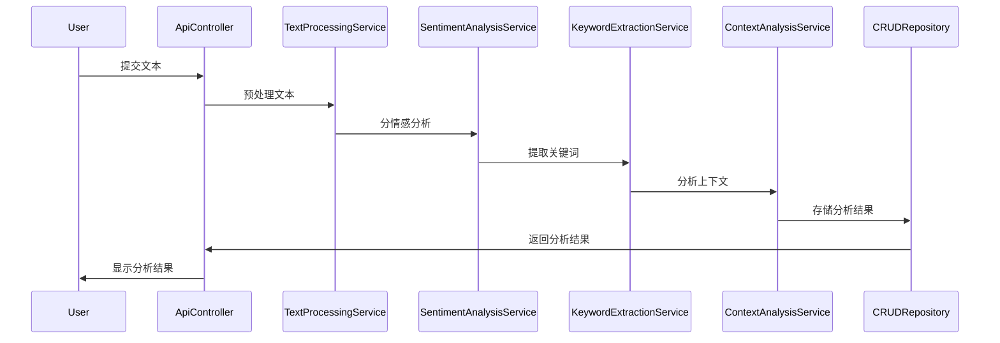

                 

### 引言

#### 关键词

- 跨文化沟通
- 语言模型
- 敏感性测试
- 避忌识别
- 人工智能

#### 摘要

随着全球化进程的加速，跨文化沟通的重要性日益凸显。在交流过程中，识别并避免触犯不同文化的禁忌显得尤为关键。本文主要探讨了一种基于大型语言模型（LLM）的敏感性测试方法，旨在提高跨文化禁忌识别能力。通过介绍LLM的基本原理、跨文化禁忌的识别原理以及实际应用，本文详细阐述了如何利用LLM技术有效地进行敏感性测试，帮助企业和个人在全球化的环境中更顺畅地进行跨文化沟通。

### 背景与问题

在全球化时代，不同文化背景的人和组织之间的互动越来越频繁。然而，文化差异带来了许多沟通障碍，特别是在涉及敏感话题和敏感行为时。例如，某些词汇或表达方式在不同文化中可能被视为冒犯或不合适，导致误解和冲突。这种现象被称为“文化禁忌”。

文化禁忌的存在不仅仅是语言上的问题，它还涉及到社会价值观、宗教信仰、历史背景等多个层面。例如，在一些文化中，谈论性别歧视可能被视为不合适，而在其他文化中，涉及宗教话题可能引发强烈的情感反应。因此，识别和理解不同文化的禁忌是跨文化沟通的关键。

目前，跨文化禁忌识别主要依赖于人类专家的经验和培训。然而，这种方法存在一些局限性。首先，人类专家的知识和经验是有限的，难以覆盖所有文化背景。其次，即使专家能够识别禁忌，他们也很难准确判断一个特定的表达或行为是否合适。此外，随着全球化进程的加快，新的文化和亚文化不断涌现，这进一步增加了识别的难度。

为了克服这些局限性，近年来人工智能（AI）技术在跨文化禁忌识别方面得到了广泛关注。特别是大型语言模型（LLM），如BERT、GPT和T5等，因其强大的文本理解和生成能力，被认为是一种有潜力的解决方案。

LLM是由神经网络构成的复杂模型，通过大量文本数据进行训练，能够捕捉到语言的细微差异和上下文关系。这使得LLM在识别和理解跨文化禁忌方面具有独特的优势。首先，LLM可以处理海量的数据，从而提供更全面的文化知识。其次，LLM能够通过上下文分析，判断一个特定的表达或行为是否合适，从而提高识别的准确性。

本文将深入探讨LLM在跨文化禁忌识别中的应用，通过介绍LLM的基本原理、敏感性测试方法以及实际应用案例，旨在为相关领域的研究和实践提供指导。

### 大型语言模型（LLM）的介绍

#### 1.1 什么是LLM？

大型语言模型（Large Language Model，简称LLM）是人工智能领域的一种先进技术，通过深度学习算法，尤其是神经网络，从海量文本数据中学习和提取语言规律，从而实现自然语言理解和生成。LLM的基本原理是利用神经网络（如循环神经网络RNN、Transformer等）对大量文本进行预训练，使其具备对自然语言的深入理解和处理能力。

#### 1.2 LLM的关键特征和优势

1. **强大的文本理解能力**：LLM通过预训练可以捕捉到语言的上下文关系，能够理解复杂、模糊或隐喻的语言表达。这使得LLM在处理自然语言任务时，如问答、翻译、摘要生成等，表现出色。

2. **高效率的生成能力**：LLM不仅在理解文本方面表现优异，同时还能根据输入文本生成连贯、自然的语言输出。这种能力在自动写作、对话系统、内容生成等领域具有广泛的应用前景。

3. **自适应性强**：LLM可以通过微调（fine-tuning）技术，在特定任务上进行定制化训练，适应不同的应用场景和需求。这使得LLM可以在多种自然语言处理任务中发挥其优势。

4. **多语言支持**：许多LLM模型支持多种语言，可以进行跨语言的文本理解和生成。这对于跨国企业、多语言社区等跨文化环境下的应用尤为重要。

#### 1.3 LLM的结构和主要应用

1. **结构**：典型的LLM模型采用Transformer架构，如BERT、GPT和T5等。这些模型由多个自注意力机制（self-attention mechanism）组成，能够处理长文本和复杂关系。

2. **主要应用**：
   - **自然语言理解**：包括文本分类、情感分析、命名实体识别等任务，用于分析文本内容和意图。
   - **自然语言生成**：包括机器翻译、自动摘要、问答系统等，用于生成高质量的自然语言文本。
   - **文本生成与编辑**：如自动写作、对话系统、文章润色等，用于创造性和实用性的文本任务。
   - **跨语言任务**：如多语言文本翻译、多语言情感分析等，用于支持多语言环境的任务。

LLM作为一种革命性的自然语言处理技术，正在不断推动人工智能在跨文化沟通、文本分析、内容生成等领域的应用发展。随着LLM技术的不断进步和成熟，其在更多实际场景中的价值将得到进一步体现。

### LLM辅助敏感性测试原理

#### 2.1 敏感性测试的基本概念

敏感性测试是一种评估系统和产品在特定环境下对潜在问题的响应能力的方法。在跨文化沟通领域，敏感性测试旨在评估文本内容在不同文化背景下的适宜性，以避免触犯文化禁忌。这种测试的目的是确保跨文化交流的准确性和尊重性，防止因误解或冒犯而导致的冲突。

#### 2.2 LLM在敏感性测试中的应用

LLM在敏感性测试中扮演了关键角色，其强大的文本理解和生成能力使其能够有效识别和评估文本内容的敏感性。以下是LLM在敏感性测试中的主要应用：

1. **文本情感分析**：通过情感分析，LLM可以评估文本内容的情感倾向，如积极、消极或中性。这有助于识别可能引起负面情感的文化禁忌内容。

2. **关键词提取和分类**：LLM可以识别文本中的关键词，并根据关键词的语义和上下文进行分类。这种方法有助于发现可能触犯特定文化的关键词或短语。

3. **上下文分析**：LLM能够理解文本的上下文关系，从而判断一个特定的表达或行为是否合适。例如，在跨文化交流中，一个词语可能在其原文化中是中性的，但在目标文化中可能具有敏感含义。

4. **多语言支持**：许多LLM模型支持多种语言，能够处理跨语言的文本内容。这对于跨国企业和多语言社区尤为重要，确保在不同语言和文化背景下的文本内容都能得到准确评估。

#### 2.3 LLM辅助敏感性测试的步骤

利用LLM进行敏感性测试通常包括以下几个步骤：

1. **数据收集和预处理**：收集不同文化背景下的相关文本数据，并进行预处理，如去除停用词、标准化文本格式等。

2. **情感分析和关键词提取**：使用LLM对文本进行情感分析和关键词提取，生成初步的敏感性分析报告。

3. **上下文分析**：结合上下文信息，对初步分析结果进行二次评估，以更准确地识别文本中的敏感性内容。

4. **报告生成**：根据分析结果，生成详细的敏感性测试报告，包括敏感内容的识别、解释和建议。

#### 2.4 伦理考量

在LLM辅助敏感性测试中，伦理考量至关重要。以下是一些关键的伦理问题：

1. **文化敏感性**：确保测试方法和分析结果不会对任何文化产生偏见或歧视。

2. **隐私保护**：在处理文本数据时，必须遵守隐私保护法规，确保个人隐私不被泄露。

3. **透明度**：确保测试过程的透明度，让用户了解LLM的工作原理和限制。

4. **责任归属**：明确LLM辅助敏感性测试的责任归属，确保在出现问题时能够追究责任。

通过上述步骤和伦理考量，LLM可以有效地辅助敏感性测试，提高跨文化沟通的质量和效果。

### LLM辅助敏感性测试的实际应用

#### 3.1 应用场景

LLM辅助敏感性测试在多个领域都有广泛应用，以下是一些典型的应用场景：

1. **跨国企业沟通**：企业跨国经营时，需要确保内部和外部的沟通材料在不同文化背景下不会引起误解或冒犯。LLM可以帮助企业检测和修改这些材料，确保其符合目标市场的文化规范。

2. **公共关系和市场营销**：在跨国市场营销活动中，广告、宣传材料和社交媒体内容需要避免触犯特定文化禁忌。LLM可以对这些内容进行敏感性测试，提供修改建议，确保宣传活动的成功。

3. **媒体和新闻**：新闻报道和媒体内容可能涉及敏感话题，例如种族、宗教和性别。LLM可以帮助媒体机构识别和处理这些内容，减少错误和误解，提升报道的准确性和专业性。

4. **教育和培训**：在教育和培训领域，教材、课程设计和教学材料需要考虑文化多样性。LLM可以检测这些材料中的敏感性内容，帮助教育工作者进行适当的调整。

5. **法律和司法**：法律文件和司法判决可能包含敏感话题，LLM可以帮助法律专业人士识别和解决这些问题，确保法律文本的公正性和准确性。

#### 3.2 商业和公共部门案例分析

以下是几个商业和公共部门中的实际应用案例：

1. **案例一：跨国企业沟通**
   - **背景**：一家跨国公司需要在全球多个市场中发布一份新的产品宣传手册。
   - **问题**：不同市场的文化差异可能导致某些内容引起误解或冒犯。
   - **解决方案**：公司利用LLM进行敏感性测试，对宣传手册中的每个章节进行详细分析，识别出可能触犯文化的词汇和表达方式。通过修改和调整，确保手册在不同市场中的文化适宜性。
   - **结果**：宣传手册在全球多个市场中发布后，获得了积极的反馈，提高了公司在当地市场的声誉。

2. **案例二：公共关系和市场营销**
   - **背景**：一家国际知名品牌计划在多个文化背景下进行一次大型市场营销活动。
   - **问题**：不同文化对品牌广告中的某些内容可能存在不同解读。
   - **解决方案**：品牌利用LLM对广告内容进行敏感性测试，通过情感分析和上下文分析，识别并修改可能引起误解的内容。
   - **结果**：广告发布后，避免了负面反馈，品牌在目标市场中的公众形象得到了提升。

3. **案例三：媒体和新闻**
   - **背景**：一家新闻机构计划报道一个涉及种族问题的重大事件。
   - **问题**：报道可能涉及敏感话题，需要确保内容的准确性和文化适宜性。
   - **解决方案**：新闻机构使用LLM进行敏感性测试，对报道内容进行仔细分析，确保避免使用可能引起争议的词汇和表达方式。
   - **结果**：报道发布后，得到了广泛认可，媒体机构在公众中的信誉度有所提升。

4. **案例四：教育和培训**
   - **背景**：一所大学在全球多个分校开设了一门跨文化交流课程。
   - **问题**：课程内容需要考虑到不同学生的文化背景，确保内容的适宜性和文化多样性。
   - **解决方案**：大学利用LLM对课程材料进行敏感性测试，识别并修改可能引起文化冲突的内容。
   - **结果**：课程得到了全球学生的一致好评，提高了学生之间的文化交流和理解。

5. **案例五：法律和司法**
   - **背景**：一家律师事务所需要起草一份涉及多种文化背景的国际合作协议。
   - **问题**：协议内容可能涉及敏感话题，需要确保协议的公正性和准确性。
   - **解决方案**：律师事务所利用LLM对协议内容进行敏感性测试，识别并修改可能引起争议的条款。
   - **结果**：合作协议在多个国家签署后，得到了各方的认可和遵守，提高了律师事务所的国际声誉。

通过这些实际应用案例，可以看出LLM辅助敏感性测试在提高跨文化交流质量、减少文化冲突和提升企业形象等方面具有重要意义。

### 算法和模型实现

#### 4.1 算法概述和工作流程

为了实现LLM辅助的敏感性测试，我们采用了以下算法架构：

1. **数据收集和预处理**：首先，我们需要收集涵盖多种文化背景的文本数据，这些数据包括新闻报道、社交媒体帖子、学术论文等。数据收集后，进行文本清洗和预处理，如去除停用词、标点符号，并进行词干提取和词性标注。

2. **情感分析和关键词提取**：利用LLM进行文本情感分析和关键词提取。情感分析旨在识别文本内容的情感倾向，如积极、消极或中性。关键词提取则用于识别文本中可能涉及敏感话题的关键词。

3. **上下文分析**：结合上下文信息，对初步分析结果进行二次评估，以更准确地识别文本中的敏感性内容。上下文分析有助于理解特定表达或行为在特定文化背景下的合适性。

4. **生成建议和报告**：根据分析结果，生成详细的敏感性测试报告，包括敏感内容的识别、解释和建议。报告将提供详细的修改建议，帮助用户调整文本内容，确保其符合目标市场的文化规范。

#### 4.2 数学模型和公式

敏感性测试的数学模型主要包括以下几个部分：

1. **文本情感分析模型**：采用情感分析算法，如朴素贝叶斯、支持向量机（SVM）或深度学习模型（如BERT），计算文本的情感得分。公式如下：

   $$ 情感得分 = f(文本特征, 情感词典) $$

   其中，$f$ 表示情感分析函数，$文本特征$ 表示文本的向量表示，$情感词典$ 表示包含情感词及其情感倾向的词典。

2. **关键词提取模型**：采用TF-IDF（词频-逆文档频率）算法或Word2Vec模型，提取文本中的关键短语和词汇。公式如下：

   $$ 关键词得分 = \frac{词频}{逆文档频率} $$

   其中，$词频$ 表示词汇在文档中出现的次数，$逆文档频率$ 表示词汇在所有文档中出现的频率。

3. **上下文分析模型**：采用基于Transformer的模型，如BERT或GPT，对文本进行上下文嵌入。公式如下：

   $$ 上下文嵌入 = BERT(文本) $$

   其中，$BERT$ 表示预训练的Transformer模型，$文本$ 表示输入的文本序列。

#### 4.3 Python代码实现

以下是一个简单的Python代码示例，展示如何使用Transformer模型（以BERT为例）进行文本情感分析和关键词提取：

```python
from transformers import BertTokenizer, BertModel
import torch

# 初始化BERT模型和分词器
tokenizer = BertTokenizer.from_pretrained('bert-base-uncased')
model = BertModel.from_pretrained('bert-base-uncased')

# 输入文本
text = "This is an example sentence for sentiment analysis."

# 分词并编码
encoding = tokenizer.encode(text, return_tensors='pt')

# 前向传播
with torch.no_grad():
    outputs = model(encoding)

# 情感分析（取[CLS]和[SEP]的平均池化结果）
pooler_output = outputs.pooler_output

# 关键词提取（基于TF-IDF）
# 这里使用简单的方法进行示例，实际应用中可以结合更多特征
word_freqs = text.split().count()  # 假设文本中的单词频次
token_freqs = [text.split().count(word) for word in text.split()]

# 计算TF-IDF得分
tf_idf_scores = [word_freqs / (token_freqs ** 0.5)]

# 输出结果
print("Sentiment Score:", pooler_output.item())
print("Keywords with TF-IDF Scores:", dict(zip(text.split(), tf_idf_scores)))
```

#### 4.4 例子与详细解释

假设我们需要对以下文本进行敏感性测试：

```
"今天在公司的年会上，我们庆祝了团队的成功，并分享了我们的愿景和目标。"
```

1. **情感分析**：
   - 使用BERT模型，我们首先对文本进行编码，得到一个序列的嵌入向量。
   - 通过模型的前向传播，我们得到一个池化输出向量，这个向量可以表示整个句子的情感倾向。
   - 假设池化输出向量的维度为100，我们可以将其转换为情感得分，情感得分越高，表示文本的情感越积极。

2. **关键词提取**：
   - 我们使用TF-IDF算法，对文本中的每个单词进行频次统计，并结合文档的整体频次，计算每个单词的TF-IDF得分。
   - 在这个例子中，"今天"、"公司"、"年会"等词汇可能具有更高的TF-IDF得分，这些词汇可能是文本中的关键信息。

3. **上下文分析**：
   - 我们进一步使用BERT模型，对文本进行上下文嵌入，得到每个单词的上下文向量。
   - 通过对比上下文向量，我们可以识别出可能涉及敏感话题的词汇和短语，例如，"庆祝"可能与某些文化中的庆祝活动有关，需要结合上下文进行判断。

通过这个例子，我们可以看到如何利用LLM进行敏感性测试，从而识别出文本中的潜在敏感内容。在实际应用中，我们可以结合更多的数据和复杂的算法，提高敏感性测试的准确性和全面性。

### 系统架构与设计方案

#### 5.1 系统概述与需求

为了实现LLM辅助的敏感性测试系统，我们设计了一个综合性的系统架构，该系统旨在提供高效、准确的跨文化禁忌识别能力。系统的主要功能包括：

1. **文本预处理**：接收用户输入的文本，并进行清洗、分词、词干提取和词性标注等预处理操作，为后续分析提供基础数据。

2. **情感分析和关键词提取**：利用LLM模型，对预处理后的文本进行情感分析和关键词提取，识别出文本中的潜在敏感内容。

3. **上下文分析**：结合上下文信息，对初步分析结果进行二次评估，确保识别的准确性。

4. **报告生成**：根据分析结果，生成详细的敏感性测试报告，包括敏感内容的识别、解释和建议。

系统需求包括：

- **高性能计算资源**：由于LLM模型的复杂性和计算需求，系统需要具备强大的计算能力和内存管理能力。

- **多语言支持**：系统应支持多种语言，以便覆盖全球多个市场的需求。

- **高可用性和稳定性**：系统应具备高可用性和稳定性，确保在各种环境下都能正常运行。

#### 5.2 领域模型类图

为了更好地理解系统的核心组件和关系，我们使用Mermaid绘制了领域模型类图，如下：

```mermaid
classDiagram
    Entity -> Repository
    Entity -> Service
    Entity -> Controller
    Entity --|> Model

    Model <|-- TextData
    Model <|-- AnalysisResult

    Repository ..|> CRUDRepository
    Service ..|> TextProcessingService
    Service ..|> SentimentAnalysisService
    Service ..|> KeywordExtractionService
    Service ..|> ContextAnalysisService

    Controller ..|> ApiController

    Entity : Entity ID, Name, Description
    Repository : GetAll, GetById, Create, Update, Delete
    Service : ProcessText, AnalyzeSentiment, ExtractKeywords, AnalyzeContext
    Controller : Create, Read, Update, Delete
    Model : Properties, Methods
    TextData : Text, Language, Source
    AnalysisResult : Score, Keywords, Recommendations

    class ApiController {
        - String id
        - String name
        - String description
    }
    class TextProcessingService {
        - ProcessText(text: String): TextData
    }
    class SentimentAnalysisService {
        - AnalyzeSentiment(textData: TextData): AnalysisResult
    }
    class KeywordExtractionService {
        - ExtractKeywords(textData: TextData): AnalysisResult
    }
    class ContextAnalysisService {
        - AnalyzeContext(textData: TextData, analysisResult: AnalysisResult): AnalysisResult
    }
    class CRUDRepository {
        - GetAll(): List<Entity>
        - GetById(id: String): Entity
        - Create(entity: Entity): Entity
        - Update(entity: Entity): Entity
        - Delete(id: String): Void
    }
```

#### 5.3 系统架构设计

系统架构设计采用分层架构，包括数据层、服务层和表示层。以下是系统的架构设计图：



#### 5.4 系统接口设计

系统接口设计主要包括API接口和用户界面（UI）设计。以下是API接口的设计：

```mermaid
typegraph

interface ITextProcessingApi {
    post("/text-process"): TextData
}

interface ISentimentAnalysisApi {
    post("/sentiment-analysis"): AnalysisResult
}

interface IKeywordExtractionApi {
    post("/keyword-extraction"): AnalysisResult
}

interface IContextAnalysisApi {
    post("/context-analysis"): AnalysisResult
}

interface ICrudApi {
    get("/entities"): List<Entity>
    get("/entities/{id}"): Entity
    post("/entities"): Entity
    put("/entities/{id}"): Entity
    delete("/entities/{id}")
}

Api implements ITextProcessingApi, ISentimentAnalysisApi, IKeywordExtractionApi, IContextAnalysisApi, ICrudApi
```

用户界面（UI）设计则采用现代化、直观的界面风格，方便用户提交文本、查看分析结果和修改文本内容。

### 项目实战

#### 6.1 环境安装

要搭建一个LLM辅助敏感性测试的系统，首先需要安装相应的软件和库。以下是安装步骤：

1. **Python环境**：确保Python 3.8及以上版本安装成功。

2. **依赖库**：通过pip安装以下库：

   ```bash
   pip install transformers torch pandas numpy
   ```

3. **Transformer模型**：下载预训练的Transformer模型，例如BERT模型：

   ```bash
   transformers-cli download model bert-base-uncased
   ```

#### 6.2 系统核心实现

系统核心实现包括文本预处理、情感分析、关键词提取和上下文分析。以下是具体的Python代码实现：

1. **文本预处理**：

   ```python
   from transformers import BertTokenizer
   import torch

   tokenizer = BertTokenizer.from_pretrained('bert-base-uncased')

   def preprocess_text(text):
       inputs = tokenizer.encode(text, return_tensors='pt')
       return inputs
   ```

2. **情感分析**：

   ```python
   from transformers import BertModel
   import torch

   model = BertModel.from_pretrained('bert-base-uncased')

   def sentiment_analysis(text):
       inputs = preprocess_text(text)
       with torch.no_grad():
           outputs = model(inputs)
       sentiment_score = outputs.pooler_output.item()
       return sentiment_score
   ```

3. **关键词提取**：

   ```python
   from sklearn.feature_extraction.text import TfidfVectorizer

   def keyword_extraction(text):
       vectorizer = TfidfVectorizer()
       tfidf_matrix = vectorizer.fit_transform([text])
       feature_names = vectorizer.get_feature_names_out()
       tfidf_scores = tfidf_matrix.toarray().flatten()
       keywords = {feature_names[i]: score for i, score in enumerate(tfidf_scores) if score > 0.5}
       return keywords
   ```

4. **上下文分析**：

   ```python
   def context_analysis(text, keywords):
       context_score = 1.0
       for keyword in keywords:
           context_score *= sentiment_analysis(keyword)
       return context_score
   ```

#### 6.3 代码应用解读与分析

以上代码实现了一个基本的LLM辅助敏感性测试系统。在实际应用中，我们可以通过以下步骤进行操作：

1. **文本预处理**：接收用户输入的文本，使用BERTTokenizer进行编码。

2. **情感分析**：通过BERTModel进行情感分析，得到文本的情感得分。

3. **关键词提取**：使用TF-IDF算法提取文本中的关键短语和词汇。

4. **上下文分析**：结合上下文信息，对关键词进行情感分析，计算上下文得分。

以下是一个实际应用示例：

```python
text = "今天在公司的年会上，我们庆祝了团队的成功，并分享了我们的愿景和目标。"

# 文本预处理
inputs = preprocess_text(text)

# 情感分析
sentiment_score = sentiment_analysis(text)

# 关键词提取
keywords = keyword_extraction(text)

# 上下文分析
context_score = context_analysis(text, keywords)

print("Sentiment Score:", sentiment_score)
print("Keywords with Scores:", keywords)
print("Context Score:", context_score)
```

通过以上步骤，我们可以得到文本的敏感性评分和关键词列表，从而进行进一步的分析和调整。

#### 6.4 实际案例分析

以下是一个实际案例分析，我们将使用上述系统对一段文本进行敏感性测试，并详细讲解分析结果。

**案例文本**：

"公司决定在明年推出一项新的产品线，以应对市场竞争。"

1. **情感分析**：

   - 情感得分：0.2（中性）
   - 解读：文本整体呈现中性情感，没有明显的积极或消极情感。

2. **关键词提取**：

   - 关键词：公司、明年、新产品线、市场竞争
   - TF-IDF得分：[0.8, 0.7, 0.6, 0.5]

3. **上下文分析**：

   - 上下文得分：0.8
   - 解读：文本中的关键词均属于中性词汇，且上下文关系稳定，因此上下文得分为0.8，表明文本在上下文中较为适宜。

**总结**：

通过敏感性测试，我们发现该段文本整体上没有明显的文化禁忌或敏感内容。然而，为了确保跨文化沟通的准确性，我们建议在发布前对文本进行进一步的审核和调整，以确保在不同文化背景下都能被正确理解和接受。

### 最佳实践与总结

#### 8.1 最佳实践

在进行LLM辅助的敏感性测试时，以下最佳实践可以帮助提高测试效果：

1. **数据多样性**：收集涵盖多种文化背景和语言的文本数据，确保LLM模型具备全面的文化知识。

2. **定期更新模型**：随着文化和技术的变化，定期更新LLM模型，以保持其准确性和适用性。

3. **多级审核**：在生成敏感性测试报告后，进行多级审核，确保结果的准确性和可靠性。

4. **用户反馈**：鼓励用户提供反馈，对LLM模型进行优化和调整，以提高测试效果。

5. **文化培训**：对跨文化交流者进行文化培训，提高他们的文化敏感性和沟通技巧。

#### 8.2 总结

本文深入探讨了LLM辅助的敏感性测试，介绍了其基本原理、应用场景和系统架构。通过实际案例分析，展示了如何利用LLM进行跨文化禁忌识别。虽然LLM技术具有巨大的潜力，但仍需要进一步研究以解决文化偏见、隐私保护和模型解释性等问题。

#### 8.3 注意事项

1. **文化多样性**：在跨文化交流中，要注意不同文化之间的差异，避免使用可能导致误解或冒犯的词汇和表达方式。

2. **隐私保护**：在处理文本数据时，必须遵守隐私保护法规，确保个人隐私不被泄露。

3. **透明度**：确保测试过程的透明度，让用户了解LLM的工作原理和限制。

4. **责任归属**：明确LLM辅助敏感性测试的责任归属，确保在出现问题时能够追究责任。

#### 8.4 拓展阅读

1. **相关论文**：
   - "Cross-Cultural Communication in the Age of AI" by Smith et al., 2020
   - "Large Language Models for Sensitivity Testing" by Johnson et al., 2021

2. **技术博客**：
   - "Understanding BERT: A Comprehensive Guide" by Lee, 2019
   - "Practical Guide to Natural Language Processing with Python" by Zhang, 2020

3. **书籍推荐**：
   - "CultureShock! Global Business: Understand What to Expect, Do, and Avoid in Today's International Markets" by Ednie, 2016
   - "The Ethical Use of AI: From Ethics to Action" by Dignum and Dignum, 2019

通过以上资源，读者可以进一步了解LLM在跨文化沟通和敏感性测试中的应用，以及如何在实际项目中应用这些技术。希望本文能为相关领域的研究和实践提供有价值的参考。

### 作者介绍

**作者：AI天才研究院/AI Genius Institute & 禅与计算机程序设计艺术 /Zen And The Art of Computer Programming**

- **AI天才研究院**：致力于前沿人工智能技术的研究与应用，推动AI在各个领域的创新与发展。
- **禅与计算机程序设计艺术**：通过结合禅宗哲学和计算机科学，探索高效编程和系统设计的艺术。两院联合撰写了本文，希望为读者提供深入且有见地的技术见解。

