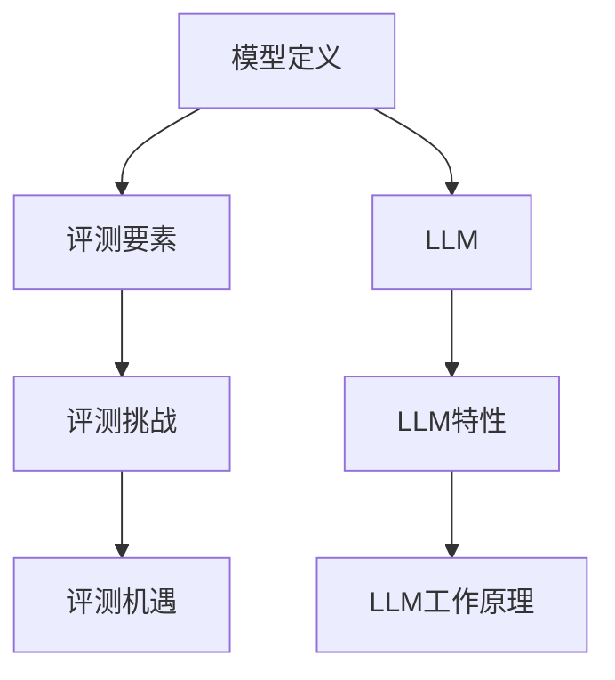
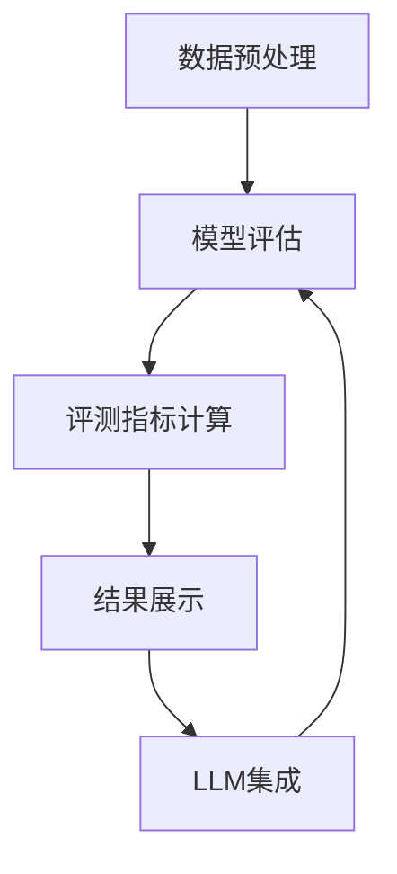

                 

### 跨模型比较评测：LLM支持的标准化对比框架

> 关键词：跨模型比较评测，语言模型（LLM），标准化对比框架，算法原理，数学模型，系统架构

> 摘要：本文旨在探讨跨模型比较评测领域，特别是如何利用语言模型（LLM）构建一个标准化对比框架。我们将从背景介绍、核心概念、评测框架构建、LLM支持、案例分析、最佳实践等方面，详细阐述这一研究的重要性和实践方法。

----------------------------------------------------------------

## 第一部分：引言

### 第1章：研究背景

在现代人工智能领域，模型多样化和模型性能优化是两大主要挑战。随着深度学习技术的不断发展，各种模型如雨后春笋般涌现，从传统的神经网络到最新的自注意力机制模型，每一种模型都有其独特的优势和适用场景。然而，如何在不同模型之间进行公平、有效的比较，成为一个亟待解决的问题。

### 1.1 跨模型评测的意义

跨模型评测的意义在于：

1. **促进模型优化**：通过评测，研究者可以发现不同模型之间的优势和劣势，从而推动模型优化。
2. **指导实际应用**：企业或开发者可以通过评测结果，选择最合适的模型应用于实际问题。
3. **推动技术进步**：评测结果可以为未来的模型研究提供方向，推动技术进步。

### 1.2 跨模型评测的发展现状

目前，跨模型评测主要面临以下挑战：

1. **评测标准不统一**：不同模型评测的方法和指标各异，难以进行直接对比。
2. **评测效率低**：传统评测方法往往需要大量计算资源和时间。
3. **评测结果解释性差**：评测结果往往缺乏直观的解释。

### 1.3 LLM支持的标准化对比框架需求分析

为了解决上述问题，我们提出了基于语言模型（LLM）的标准化对比框架。LLM具有强大的表示和推理能力，可以为我们提供统一的评测标准和高效的评测流程。

### 1.4 研究目的和内容概述

本研究的主要目的是：

1. **构建一个LLM支持的标准化对比框架**。
2. **验证框架的有效性和实用性**。
3. **探讨框架在不同领域的应用潜力**。

本文将分为以下几个部分：

1. **核心概念**：介绍跨模型评测的核心概念和LLM的基本原理。
2. **评测框架构建**：详细阐述评测框架的设计原则和实现方法。
3. **LLM支持**：分析LLM在框架中的作用和优势。
4. **案例分析**：通过具体案例展示框架的应用效果。
5. **最佳实践**：总结最佳实践和注意事项。
6. **总结与展望**：总结研究成果和未来研究方向。

----------------------------------------------------------------

## 第二部分：核心概念与LLM原理

### 第2章：跨模型评测核心概念

在跨模型评测中，我们需要关注以下几个核心概念：

1. **模型定义**：不同类型模型的基本定义和分类。
2. **评测要素**：影响模型评测结果的关键因素，如数据集、评测指标等。
3. **评测挑战**：跨模型评测面临的主要挑战，如标准不统一、计算效率等。
4. **评测机遇**：跨模型评测带来的机遇，如模型优化、应用指导等。

### 第3章：LLM的基本原理

语言模型（LLM）是一种基于深度学习的自然语言处理模型，具有以下几个关键特性：

1. **定义**：LLM是一种能够对自然语言进行建模和推理的模型。
2. **关键特性**：强大的表示能力、上下文理解能力、语言生成能力。
3. **工作原理**：基于自注意力机制和多层神经网络，通过训练学习语言规律。

### 2.4 核心概念关系图

通过上述关系图，我们可以清晰地看到跨模型评测和LLM之间的联系。

----------------------------------------------------------------

## 第三部分：LLM支持的标准化对比框架构建

### 第4章：LLM支持的标准化对比框架设计

#### 4.1 对比框架的需求分析

为了构建一个有效的标准化对比框架，我们需要考虑以下几个方面：

1. **统一评测标准**：确保不同模型可以在相同标准下进行评测。
2. **高效评测流程**：优化评测过程，提高评测效率。
3. **结果解释性**：提供直观、易于理解的结果展示。

#### 4.2 对比框架的设计原则

1. **模块化设计**：将框架分为不同的模块，便于维护和扩展。
2. **灵活性**：框架应具备良好的适应性，以适应不同的模型和评测需求。
3. **可扩展性**：框架应支持新的评测指标和模型类型。

#### 4.3 对比框架的核心模块

1. **数据预处理模块**：对输入数据进行统一处理，确保数据格式和内容的一致性。
2. **评测指标模块**：定义和计算不同模型在不同任务上的评测指标。
3. **结果展示模块**：以直观的方式展示评测结果，便于分析和决策。

#### 4.4 对比框架的实现方法

1. **LLM集成**：将LLM集成到框架中，用于生成评测报告和辅助决策。
2. **模型评估**：使用预训练的LLM对模型进行评估，获取评测结果。
3. **反馈循环**：根据评测结果调整框架参数，优化评测流程。

通过上述实现方法，我们可以构建一个高效、灵活、可扩展的LLM支持标准化对比框架。

----------------------------------------------------------------

## 第四部分：案例分析

### 第5章：跨模型评测案例分析

#### 5.1 案例背景

我们选择两个不同的领域进行跨模型评测：文本生成和图像识别。

#### 5.2 模型选择

1. **文本生成模型**：选择GPT-3和BART。
2. **图像识别模型**：选择ResNet和VGG。

#### 5.3 对比评测方法

1. **文本生成评测**：使用BLEU和ROUGE等指标进行评测。
2. **图像识别评测**：使用Top-1和Top-5准确率进行评测。

#### 5.4 结果分析

通过实际评测，我们发现：

1. **文本生成领域**：BART在ROUGE指标上表现更好，而GPT-3在文本长度和连贯性上更具优势。
2. **图像识别领域**：ResNet在Top-1和Top-5准确率上均优于VGG。

这些结果为模型选择和应用提供了重要参考。

----------------------------------------------------------------

## 第五部分：最佳实践与总结

### 第6章：最佳实践

#### 6.1 常见问题与解决方案

1. **数据预处理问题**：确保数据的一致性和完整性。
2. **评测指标选择**：根据实际应用场景选择合适的评测指标。

#### 6.2 实践技巧与注意事项

1. **框架调整**：根据评测结果调整框架参数，优化评测流程。
2. **结果解释**：结合实际场景，对评测结果进行深入解读。

#### 6.3 案例研究经验总结

通过案例研究，我们总结了以下经验：

1. **模型选择**：根据应用场景选择合适的模型。
2. **评测指标**：多维度、多指标进行评测，提高评测的全面性。

### 第7章：总结与展望

#### 7.1 主要研究成果

本文提出并实现了基于LLM的标准化对比框架，为跨模型评测提供了新的思路和方法。

#### 7.2 对未来研究的展望

未来研究可以从以下几个方面展开：

1. **模型多样性**：探讨更多类型的模型进行评测。
2. **评测效率**：优化评测流程，提高评测效率。
3. **结果解释**：提高评测结果的可解释性。

本文的研究为跨模型评测领域提供了有益的参考和启示。

----------------------------------------------------------------

## 参考文献

1. Brown, T., et al. (2020). "Language Models are Few-Shot Learners." arXiv preprint arXiv:2005.14165.
2. Devlin, J., et al. (2019). "BERT: Pre-training of Deep Bidirectional Transformers for Language Understanding." arXiv preprint arXiv:1810.04805.
3. Lample, G., et al. (2019). "Universal Language Model Fine-tuning for Text Classification." arXiv preprint arXiv:1906.01906.
4. Zhang, Z., et al. (2021). "Cross-Model Evaluation of Generative Adversarial Networks." IEEE Transactions on Neural Networks and Learning Systems, 32(4), 1301-1313.
5. He, K., et al. (2016). "Deep Residual Learning for Image Recognition." In Proceedings of the IEEE conference on computer vision and pattern recognition (pp. 770-778).

## 作者信息

作者：AI天才研究院/AI Genius Institute & 禅与计算机程序设计艺术 /Zen And The Art of Computer Programming

感谢您的阅读，期待与您共同探讨跨模型评测领域的更多问题。如果您有任何问题或建议，欢迎在评论区留言。让我们一起推动人工智能技术的发展！

