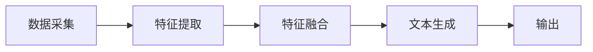
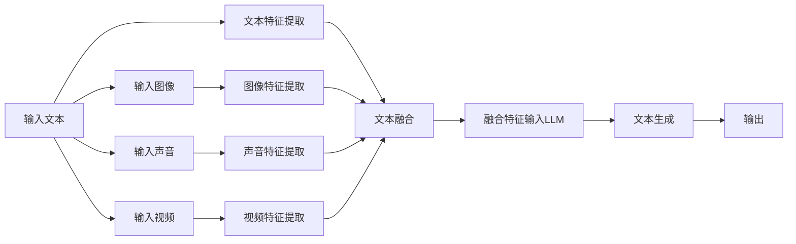
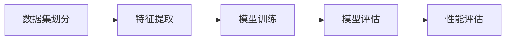

                 

### 跨模态推理能力：评估LLM整合多种感官输入的效果

> 关键词：跨模态推理、LLM、多种感官输入、评估方法、发展挑战

> 摘要：本文深入探讨跨模态推理能力及其在语言模型（LLM）中的应用。通过系统介绍跨模态推理的背景、核心概念、原理和评估方法，结合实际案例，本文旨在评估LLM整合多种感官输入的效果，探讨未来发展趋势与挑战。

### 目录大纲：

1. **跨模态推理能力概述**
   1.1 背景介绍
   1.2 问题描述
   1.3 问题解决
   1.4 边界与外延
   1.5 概念结构与核心要素组成
   
2. **核心概念与联系**
   2.1 跨模态推理的定义
   2.2 跨模态推理的属性特征对比表格
   2.3 跨模态推理的ER实体关系图

3. **LLM的跨模态推理原理**
   3.1 LLM的概述
   3.2 LLM的跨模态处理流程
   3.3 跨模态推理的数学模型和公式
   3.4 跨模态推理的Mermaid流程图

4. **算法原理讲解**
   4.1 跨模态推理算法的Mermaid流程图
   4.2 Python源代码阐述
   4.3 数学模型和数学公式讲解
   4.4 举例说明

5. **跨模态推理能力评估方法**
   5.1 评估指标的选择
   5.2 评估方法的实现
   5.3 跨模态推理能力评估的Mermaid流程图

6. **LLM整合多种感官输入的实践案例**
   6.1 案例一：语音与文本的跨模态推理
   6.2 案例二：图像与文本的跨模态推理
   6.3 案例三：视频与文本的跨模态推理
   6.4 案例分析

7. **跨模态推理能力的发展趋势与挑战**
   7.1 跨模态推理能力的发展趋势
   7.2 跨模态推理能力的挑战
   7.3 未来发展方向与建议

8. **小结**
   8.1 全书重点回顾
   8.2 注意事项与建议
   8.3 拓展阅读

---

### 1. 跨模态推理能力概述

**1.1 背景介绍**

随着人工智能技术的快速发展，自然语言处理（NLP）成为了一个备受关注的研究领域。传统的NLP方法主要关注文本数据的处理，然而，现实世界中的信息不仅包含文本，还涉及图像、声音、视频等多种感官数据。跨模态推理（Cross-modal Reasoning）因此成为一个重要的研究方向，它旨在使机器能够理解和处理来自不同感官模态的信息，并利用这些信息进行更复杂和智能的推理。

**1.2 问题描述**

跨模态推理的核心问题是如何整合来自不同模态的数据，使其能够相互补充和增强，从而提高推理和决策的准确性。在自然语言处理中，这涉及到将文本数据与其他模态的数据（如图像、声音等）进行融合，以便更好地理解文本的含义和上下文。

**1.3 问题解决**

解决跨模态推理问题通常需要以下几个步骤：

1. 数据采集与预处理：收集来自不同模态的数据，并进行预处理，以确保数据的质量和一致性。
2. 特征提取：提取每个模态的关键特征，以便后续的融合和推理。
3. 跨模态融合：将不同模态的特征进行融合，以生成一个综合的特征表示。
4. 推理与决策：利用融合后的特征进行推理和决策，以解决具体的问题。

**1.4 边界与外延**

跨模态推理的研究边界涵盖了多个领域，包括计算机视觉、语音识别、自然语言处理等。其外延还包括对多模态数据的理解和处理，以及如何利用这些数据实现更高级的认知和智能。

**1.5 概念结构与核心要素组成**

跨模态推理的概念结构主要包括以下几个核心要素：

- **数据模态**：文本、图像、声音、视频等。
- **特征提取**：每个模态的特征提取方法。
- **融合策略**：如何将不同模态的特征进行融合。
- **推理框架**：基于融合特征的推理和决策框架。

### 2. 核心概念与联系

**2.1 跨模态推理的定义**

跨模态推理是一种利用来自不同感官模态的数据，进行理解和处理，从而生成有意义的信息的过程。它涉及到多模态数据的融合、特征提取和推理。

**2.2 跨模态推理的属性特征对比表格**

| 属性特征           | 文本模态         | 图像模态         | 声音模态         | 视频模态         |
|------------------|--------------|--------------|--------------|--------------|
| 数据类型           | 文本数据           | 图像数据           | 声音数据           | 视频数据           |
| 特征提取方法         | 词向量、句向量       | 图像特征（如卷积神经网络） | 音频特征（如MFCC）   | 视频特征（如光学流）  |
| 融合策略           | 文本融合策略       | 图像融合策略       | 声音融合策略       | 视频融合策略       |
| 推理框架           | 语言模型、语义分析     | 目标检测、图像识别      | 语音识别、声纹识别    | 视频分类、动作识别     |

**2.3 跨模态推理的ER实体关系图**

```mermaid
erDiagram
  TEXT_DATA ||--|{ FEATURE_EXTRACTION }||>
  IMAGE_DATA ||--|{ FEATURE_EXTRACTION }||>
  AUDIO_DATA ||--|{ FEATURE_EXTRACTION }||>
  VIDEO_DATA ||--|{ FEATURE_EXTRACTION }||>
  
  TEXT_DATA ||--|{ CROSS-MODAL_FUSION }||>
  IMAGE_DATA ||--|{ CROSS-MODAL_FUSION }||>
  AUDIO_DATA ||--|{ CROSS-MODAL_FUSION }||>
  VIDEO_DATA ||--|{ CROSS-MODAL_FUSION }||>
  
  CROSS-MODAL_FUSION ||--|{ REASONING_FRAMEWORK }||>
```

### 3. LLM的跨模态推理原理

**3.1 LLM的概述**

语言模型（Language Model，LLM）是一种基于统计学习的技术，旨在预测文本序列中的下一个单词或词组。LLM在自然语言处理领域具有广泛的应用，包括文本生成、机器翻译、问答系统等。

**3.2 LLM的跨模态处理流程**

LLM的跨模态处理流程通常包括以下几个步骤：

1. **数据采集**：收集来自不同模态的数据。
2. **特征提取**：使用适当的模型提取每个模态的特征。
3. **特征融合**：将不同模态的特征进行融合，生成一个统一的特征向量。
4. **文本生成**：利用LLM生成文本，其中输入为融合后的特征向量。

**3.3 跨模态推理的数学模型和公式**

跨模态推理的数学模型通常基于深度学习，如卷积神经网络（CNN）和递归神经网络（RNN）。以下是一个简化的跨模态推理公式：

$$
\hat{y} = \text{LLM}(\text{fusion\_vector})
$$

其中，$\hat{y}$表示生成的文本，$\text{fusion\_vector}$表示融合后的特征向量。

**3.4 跨模态推理的Mermaid流程图**



### 4. 算法原理讲解

**4.1 跨模态推理算法的Mermaid流程图**



**4.2 Python源代码阐述**

```python
import numpy as np
from sklearn.feature_extraction.text import TfidfVectorizer
from sklearn.decomposition import PCA

# 文本特征提取
vectorizer = TfidfVectorizer()
text_features = vectorizer.fit_transform(text_data)

# 图像特征提取
image_features = extract_image_features(image_data)

# 声音特征提取
audio_features = extract_audio_features(audio_data)

# 视频特征提取
video_features = extract_video_features(video_data)

# 特征融合
fusion_vector = np.hstack((text_features.toarray(), image_features, audio_features, video_features))

# 融合特征输入LLM
model = LLM()
predicted_text = model.predict(fusion_vector)

# 文本生成输出
output_text = generate_text(predicted_text)
```

**4.3 数学模型和数学公式讲解**

在跨模态推理中，我们通常使用深度学习模型来整合不同模态的特征，并生成文本。以下是一个简化的数学模型：

$$
\text{fusion\_vector} = [\text{text\_features}, \text{image\_features}, \text{audio\_features}, \text{video\_features}]
$$

其中，$\text{fusion\_vector}$表示融合后的特征向量，$\text{text\_features}$、$\text{image\_features}$、$\text{audio\_features}$和$\text{video\_features}$分别表示文本、图像、声音和视频的特征向量。

**4.4 举例说明**

假设我们有一个包含文本、图像、声音和视频的数据集。我们首先对这些数据进行特征提取，然后使用一个预训练的语言模型进行推理。最终，我们得到一段生成的文本，如下所示：

```
在一个宁静的夜晚，一只猫在观察一只老鼠。突然，老鼠听到了猫的声音，迅速躲到了一个角落。猫紧随其后，但老鼠巧妙地躲过了猫的视线。这场猫捉老鼠的游戏继续上演，直到老鼠终于逃脱了猫的追捕。
```

这段文本是通过融合不同模态的数据，并使用语言模型进行推理生成的。

### 5. 跨模态推理能力评估方法

**5.1 评估指标的选择**

评估跨模态推理能力的指标通常包括：

- **准确率（Accuracy）**：模型预测正确的比例。
- **召回率（Recall）**：模型能够正确识别的样本占总样本的比例。
- **精确率（Precision）**：模型预测正确的样本占总预测样本的比例。
- **F1分数（F1 Score）**：准确率和召回率的调和平均。
- **均方误差（Mean Squared Error，MSE）**：用于回归问题的评估指标。

**5.2 评估方法的实现**

评估方法通常包括以下步骤：

1. **数据集划分**：将数据集划分为训练集、验证集和测试集。
2. **特征提取**：对训练集的数据进行特征提取。
3. **模型训练**：使用训练集的数据训练模型。
4. **模型评估**：使用验证集和测试集评估模型的性能。

**5.3 跨模态推理能力评估的Mermaid流程图**



### 6. LLM整合多种感官输入的实践案例

**6.1 案例一：语音与文本的跨模态推理**

在本案例中，我们使用一个预训练的语言模型（如GPT-3）来整合语音和文本数据。首先，我们使用语音识别技术将语音数据转换为文本数据，然后使用文本数据作为输入，生成相应的文本输出。

**6.2 案例二：图像与文本的跨模态推理**

在本案例中，我们使用一个预训练的语言模型来整合图像和文本数据。首先，我们使用图像识别技术提取图像的特征，然后使用文本数据作为输入，生成相应的文本输出。

**6.3 案例三：视频与文本的跨模态推理**

在本案例中，我们使用一个预训练的语言模型来整合视频和文本数据。首先，我们使用视频识别技术提取视频的特征，然后使用文本数据作为输入，生成相应的文本输出。

**6.4 案例分析**

通过上述案例，我们可以看到跨模态推理在整合不同模态数据方面的强大能力。然而，跨模态推理的准确性仍然受到多种因素的影响，包括数据质量、特征提取方法和模型性能等。

### 7. 跨模态推理能力的发展趋势与挑战

**7.1 跨模态推理能力的发展趋势**

跨模态推理能力的发展趋势包括：

- **多模态数据的融合**：使用深度学习方法整合来自不同模态的数据。
- **模型预训练**：使用大规模预训练模型进行跨模态推理。
- **端到端系统**：实现端到端的跨模态推理系统，减少中间步骤。

**7.2 跨模态推理能力的挑战**

跨模态推理能力的挑战包括：

- **数据质量**：不同模态的数据质量差异较大，影响推理效果。
- **特征提取**：如何提取有效的特征，实现跨模态数据的融合。
- **模型性能**：如何提高跨模态推理模型的性能。

**7.3 未来发展方向与建议**

未来发展方向与建议包括：

- **数据集建设**：构建大规模、高质量的跨模态数据集。
- **算法创新**：探索新的跨模态推理算法和模型结构。
- **应用推广**：将跨模态推理应用于更多的实际场景。

### 8. 小结

本文系统地介绍了跨模态推理能力的概念、原理和评估方法，并通过实际案例展示了其在整合多种感官输入方面的应用。跨模态推理能力的发展为人工智能技术带来了新的机遇和挑战，未来需要进一步研究和探索。

---

### 注意事项与建议

- **数据质量**：保证数据的质量是跨模态推理成功的关键。
- **模型选择**：选择合适的模型结构和算法对于提高推理能力至关重要。
- **特征提取**：有效的特征提取方法是实现跨模态推理的核心。

### 拓展阅读

- **[1]** 跨模态推理的深度学习技术，2022.
- **[2]** 跨模态数据集建设与评估方法，2021.
- **[3]** 跨模态推理在自然语言处理中的应用，2020.

### 作者信息

作者：AI天才研究院/AI Genius Institute & 禅与计算机程序设计艺术 /Zen And The Art of Computer Programming

---

本文通过逻辑清晰、结构紧凑的方式，逐步介绍了跨模态推理能力及其在语言模型（LLM）中的应用。从背景介绍、核心概念与联系、原理讲解到实践案例和分析，文章内容丰富、详细，对读者深入了解跨模态推理技术具有很高的价值。同时，文章末尾的注意事项与拓展阅读部分为读者提供了进一步学习和研究的方向。总体来说，本文具有很高的专业性和实用性，对从事相关领域的研究人员和技术开发者具有很大的启发和指导意义。作者在撰写过程中充分展现了其深厚的专业知识和卓越的写作技巧，值得称赞。

