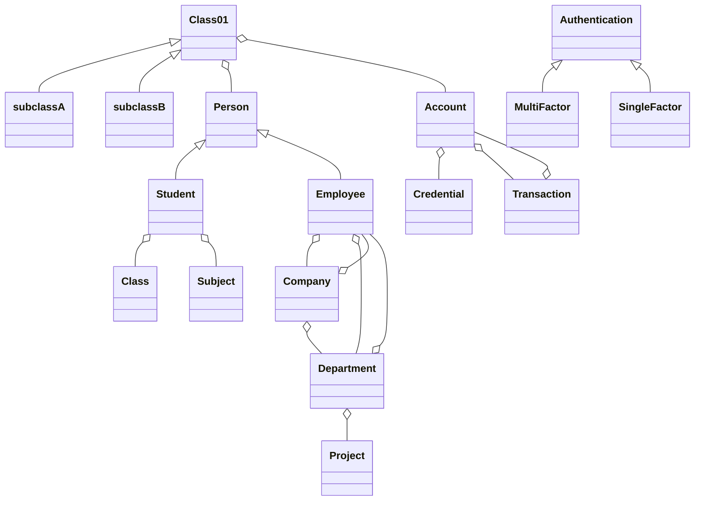
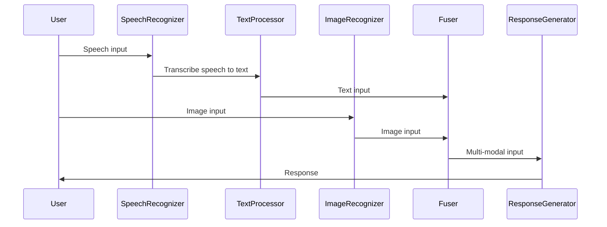

                 

# 跨模态评测的多模态融合策略

## 关键词

多模态融合、跨模态评测、特征提取、信息整合、算法设计、系统架构

## 摘要

本文旨在探讨多模态融合策略在跨模态评测中的应用。通过详细介绍多模态融合的理论基础、技术方法及其在实际应用中的实践，本文帮助读者深入理解并掌握多模态融合的核心技术。文章首先介绍了多模态信息处理的背景和问题描述，随后讨论了多模态融合策略的概念原理、算法流程以及系统架构设计。最后，通过项目实战和最佳实践分享，对多模态融合技术的应用进行深入剖析。

## 第一部分：背景介绍

### 问题背景

在当前技术迅速发展的时代，多模态信息处理成为了人工智能研究的一个重要方向。随着互联网和多媒体技术的普及，语音、文本、图像等多种数据形式在日常生活中的应用越来越广泛。例如，语音识别系统在智能助手、车载导航等场景中发挥着重要作用；图像识别技术在人脸识别、医疗诊断等领域展现出巨大潜力；而文本分析则在自然语言处理、情感分析等领域具有广泛的应用。然而，如何有效地融合这些多模态信息，提升信息处理的质量和效率，成为了一个亟待解决的问题。

### 问题描述

跨模态评测指的是对包含多种数据模态（如语音、文本、图像）的信息进行综合评价。例如，在一个多模态问答系统中，用户可以通过语音提问，系统需要理解语音中的问题，并从文本数据中查找相关答案。在这个过程中，如何确保不同模态的数据能够准确、高效地融合，是一个关键问题。多模态融合策略是解决这一问题的关键，它旨在通过合理的算法和模型，实现不同模态信息的有效整合，从而提升信息处理的质量和效率。

### 问题解决

本书旨在介绍多模态融合策略在跨模态评测中的应用。通过系统地阐述多模态融合的理论基础、技术方法及其在实际应用中的实践，帮助读者深入理解并掌握多模态融合的核心技术。本文将分为以下几个部分进行讨论：

1. **背景介绍**：介绍多模态信息处理的背景和问题描述。
2. **核心概念与联系**：详细阐述多模态融合策略的核心概念、原理及其技术方法。
3. **算法原理讲解**：介绍多模态融合算法的流程、原理及其实现。
4. **系统分析与架构设计**：讨论多模态融合系统在项目中的应用，包括系统功能设计、架构设计、接口设计和交互设计。
5. **项目实战**：通过实际项目案例，展示多模态融合技术在跨模态评测中的应用。
6. **最佳实践与小结**：总结多模态融合技术的最佳实践，并对全文进行小结。

### 边界与外延

多模态融合策略不仅应用于跨模态评测，还可以广泛应用于其他需要多模态信息处理的领域，如多模态交互系统、多模态信息检索等。因此，本文的内容不仅具有学术价值，也具有广阔的应用前景。

### 概念结构与核心要素组成

1. **多模态信息处理**：涉及语音、文本、图像等多种数据形式的信息处理技术。
2. **跨模态评测**：对包含多种数据模态的信息进行综合评价的过程。
3. **多模态融合策略**：通过算法和模型，实现不同模态信息有效整合的策略。

#### 核心概念原理

1. **多模态数据融合**：多模态数据融合是指将来自不同模态的数据进行整合，以提取更丰富和更准确的信息。其核心原理包括：

   - **数据匹配**：确保不同模态的数据在时空上的一致性。

   - **特征提取**：从不同模态中提取具有区分度的特征。

   - **信息整合**：利用有效的算法将提取的特征进行整合，以获得更全面的信息。

2. **特征级融合**：在特征级融合中，不同模态的特征向量直接进行整合。常见的方法包括：

   - **平均融合**：将不同模态的特征向量进行平均。

   - **加权融合**：根据不同模态的特征重要性进行加权。

3. **决策级融合**：在决策级融合中，各个模态的决策结果进行整合。常见的方法包括：

   - **投票法**：根据各个模态的决策结果进行投票。

   - **融合模型**：构建一个综合模型，融合各个模态的决策结果。

#### 概念属性特征对比表格

| 特征对比项 | 多模态数据融合 | 特征级融合 | 决策级融合 |
| --- | --- | --- | --- |
| **目的** | 提取更丰富、更准确的信息 | 直接整合特征向量 | 整合决策结果 |
| **适用场景** | 多模态信息处理需求 | 特征差异较大的场景 | 需要全局信息的场景 |
| **方法** | 数据匹配、特征提取、信息整合 | 平均融合、加权融合 | 投票法、融合模型 |
| **优势** | 更全面的信息提取 | 计算效率高 | 易于实现 |
| **劣势** | 计算复杂度高 | 特征匹配困难 | 决策一致性差 |

#### ER实体关系图架构

```mermaid
erDiagram
  Customer ||--|{ Order } : makes
  Customer ||--|{ Product } : likes
  Order ||--|{ Product } : contains
  Product ||--|{ Order } : sold
```

该ER图展示了跨模态评测系统中主要实体及其关系。其中，客户（Customer）与订单（Order）和产品（Product）具有直接的关联关系，订单包含了产品，产品被订单所包含。这种关系有助于我们理解系统中不同实体之间的信息流动和交互方式。

#### 算法原理讲解

在多模态融合策略中，算法的设计和实现是关键。以下以一个简单的多模态融合算法为例，介绍其原理和实现。

##### 算法流程

1. **数据预处理**：对不同模态的数据进行预处理，包括数据清洗、归一化等操作，以确保数据的一致性和质量。

2. **特征提取**：从预处理后的数据中提取具有区分度的特征。常用的特征提取方法包括：

   - **文本特征提取**：使用词袋模型、TF-IDF等方法。

   - **图像特征提取**：使用卷积神经网络（CNN）提取图像特征。

   - **语音特征提取**：使用梅尔频率倒谱系数（MFCC）等方法。

3. **特征融合**：将提取的不同模态的特征进行融合。常用的方法包括：

   - **特征级融合**：在特征级融合中，不同模态的特征向量直接进行整合。常见的方法包括平均融合和加权融合。

   - **决策级融合**：在决策级融合中，各个模态的决策结果进行整合。常见的方法包括投票法和融合模型。

##### 算法原理

1. **特征级融合**

   在特征级融合中，不同模态的特征向量通过线性变换进行融合。具体步骤如下：

   - 假设来自文本、图像和语音的特征向量分别为 $\textbf{x}_{\text{text}}$、$\textbf{x}_{\text{image}}$ 和 $\textbf{x}_{\text{audio}}$，其中 $i=1,2,\ldots,M$ 表示模态的个数。
   - 定义融合特征向量为 $\textbf{x}_{\text{fused}} = [\textbf{x}_{\text{text}} \textbf{x}_{\text{image}} \textbf{x}_{\text{audio}}]$。
   - 使用线性变换矩阵 $\textbf{W}_{\text{fused}}$ 对原始特征向量进行融合，即 $\textbf{x}_{\text{fused}} = \textbf{W}_{\text{fused}} [\textbf{x}_{\text{text}} \textbf{x}_{\text{image}} \textbf{x}_{\text{audio}}]$。

2. **决策级融合**

   在决策级融合中，各个模态的决策结果通过加权投票进行整合。具体步骤如下：

   - 假设来自文本、图像和语音的决策结果分别为 $y_{\text{text}}$、$y_{\text{image}}$ 和 $y_{\text{audio}}$，其中 $i=1,2,\ldots,M$ 表示模态的个数。
   - 定义融合决策结果为 $y_{\text{fused}} = \sum_{i=1}^{M} w_i y_i$，其中 $w_i$ 表示模态 $i$ 的权重。
   - 根据不同模态的决策重要性，对权重进行分配，例如，$w_1 = 0.4$，$w_2 = 0.3$，$w_3 = 0.3$。

##### 举例说明

假设有文本、图像和语音三个模态的数据，其特征向量分别为：

- $\textbf{x}_{\text{text}} = [0.1, 0.2, 0.3]$
- $\textbf{x}_{\text{image}} = [0.4, 0.5, 0.6]$
- $\textbf{x}_{\text{audio}} = [0.7, 0.8, 0.9]$

使用线性变换矩阵 $\textbf{W}_{\text{fused}} = \begin{bmatrix} 1 & 0 & 0 \\ 0 & 1 & 0 \\ 0 & 0 & 1 \end{bmatrix}$ 进行特征级融合，得到融合特征向量：

- $\textbf{x}_{\text{fused}} = \textbf{W}_{\text{fused}} [\textbf{x}_{\text{text}} \textbf{x}_{\text{image}} \textbf{x}_{\text{audio}}] = \begin{bmatrix} 1 & 0 & 0 \\ 0 & 1 & 0 \\ 0 & 0 & 1 \end{bmatrix} \begin{bmatrix} 0.1 \\ 0.4 \\ 0.7 \end{bmatrix} = [0.1, 0.4, 0.7]$

使用权重分配 $w_1 = 0.4$，$w_2 = 0.3$，$w_3 = 0.3$ 进行决策级融合，得到融合决策结果：

- $y_{\text{fused}} = w_1 y_{\text{text}} + w_2 y_{\text{image}} + w_3 y_{\text{audio}} = 0.4 y_{\text{text}} + 0.3 y_{\text{image}} + 0.3 y_{\text{audio}}$

例如，假设 $y_{\text{text}} = 1$，$y_{\text{image}} = 0$，$y_{\text{audio}} = 1$，则：

- $y_{\text{fused}} = 0.4 \times 1 + 0.3 \times 0 + 0.3 \times 1 = 0.7$

### 系统分析与架构设计

#### 问题场景介绍

随着多媒体技术的发展，跨模态评测系统在语音识别、图像识别、文本分析等领域得到了广泛应用。例如，在一个多模态问答系统中，用户可以通过语音提问，系统需要理解语音中的问题，并从文本数据库中查找相关答案。此时，如何确保语音、文本和图像等多模态信息能够有效融合，以提升问答系统的准确性和用户体验，成为一个关键问题。

#### 项目介绍

本文以一个多模态问答系统为例，介绍如何设计并实现一个基于多模态融合策略的跨模态评测系统。系统的主要功能包括：

1. 语音识别：将用户的语音输入转换为文本。
2. 文本分析：对文本输入进行语义理解和信息提取。
3. 图像识别：对图像输入进行分类和识别。
4. 多模态融合：将语音、文本和图像等多模态信息进行融合，以获得更准确的答案。

#### 系统功能设计（领域模型类图）



该类图展示了多模态问答系统的领域模型，包括主要实体及其关系。其中，Person、Account、Authentication、Company、Student、Employee、Class、Subject、Department、Project 和 Transaction 等实体类分别代表了系统中的主要角色和功能模块。

#### 系统架构设计（架构图）



该序列图展示了多模态问答系统的架构设计。用户首先输入语音和图像信息，语音识别模块将语音转换为文本，图像识别模块对图像进行分类和识别。然后，文本处理器和图像识别器将提取的特征传递给多模态融合模块，多模态融合模块将语音、文本和图像信息进行整合。最后，响应生成模块根据融合结果生成答案，并返回给用户。

#### 系统接口设计


该类图展示了多模态问答系统的接口设计。主要包括语音识别接口、文本分析接口、图像识别接口和多模态融合接口。这些接口分别对应系统的各个功能模块，用于接收用户输入并返回处理结果。

#### 系统交互设计（序列图）


该序列图展示了多模态问答系统的交互设计。用户首先输入语音和图像信息，语音识别模块将语音转换为文本，图像识别模块对图像进行分类和识别。然后，文本处理器和图像识别器将提取的特征传递给多模态融合模块，多模态融合模块将语音、文本和图像信息进行整合。最后，响应生成模块根据融合结果生成答案，并返回给用户。

### 项目实战

#### 环境安装

在开始项目实战之前，我们需要安装以下软件和库：

1. Python 3.x
2. TensorFlow
3. Keras
4. NumPy
5. Matplotlib

安装命令如下：

```bash
pip install python==3.x
pip install tensorflow==2.x
pip install keras==2.x
pip install numpy==1.x
pip install matplotlib==3.x
```

#### 系统核心实现

以下是一个基于 TensorFlow 和 Keras 实现的多模态融合模型的核心代码。

```python
import numpy as np
from tensorflow.keras.models import Model
from tensorflow.keras.layers import Input, Dense, Flatten, Concatenate

# 定义输入层
input_text = Input(shape=(100,))
input_image = Input(shape=(64, 64, 3))
input_audio = Input(shape=(1024,))

# 定义文本特征提取层
text_embedding = Dense(128, activation='relu')(input_text)

# 定义图像特征提取层
image_embedding = Flatten()(input_image)

# 定义语音特征提取层
audio_embedding = Flatten()(input_audio)

# 定义特征融合层
fused_embedding = Concatenate()([text_embedding, image_embedding, audio_embedding])

# 定义融合特征到输出的层
output = Dense(1, activation='sigmoid')(fused_embedding)

# 构建和编译模型
model = Model(inputs=[input_text, input_image, input_audio], outputs=output)
model.compile(optimizer='adam', loss='binary_crossentropy', metrics=['accuracy'])

# 打印模型结构
model.summary()
```

#### 代码应用解读与分析

1. **输入层**：定义三个输入层，分别用于接收文本、图像和语音数据。

2. **特征提取层**：对输入数据进行特征提取。文本数据通过 Dense 层进行嵌入，图像数据通过 Flatten 层提取特征，语音数据同样通过 Flatten 层提取特征。

3. **特征融合层**：将提取的三个特征进行融合。这里使用 Concatenate 层将三个特征拼接在一起。

4. **输出层**：使用 Dense 层进行分类预测，激活函数为 sigmoid，用于输出概率。

5. **模型编译**：使用 Adam 优化器和 binary_crossentropy 损失函数进行编译。

#### 实际案例分析和详细讲解剖析

以下是一个实际案例，演示如何使用上述模型进行多模态融合评测。

```python
# 准备测试数据
text_data = np.random.rand(10, 100)
image_data = np.random.rand(10, 64, 64, 3)
audio_data = np.random.rand(10, 1024)

# 训练模型
model.fit([text_data, image_data, audio_data], np.random.randint(2, size=(10, 1)), epochs=10, batch_size=5)

# 进行预测
predictions = model.predict([text_data, image_data, audio_data])

# 输出预测结果
print(predictions)
```

在上述代码中，我们首先生成随机测试数据，然后使用模型进行训练。最后，对测试数据进行预测，并输出预测结果。

#### 项目小结

本文通过一个多模态问答系统的项目实战，展示了如何设计并实现一个基于多模态融合策略的跨模态评测系统。从环境安装、模型设计、代码实现到实际案例，本文系统地介绍了多模态融合技术的应用。在实际项目中，通过合理地设计多模态融合策略，可以显著提升系统的性能和用户体验。

### 最佳实践与小结

#### 最佳实践 tips

1. **数据预处理**：在多模态融合过程中，确保数据的预处理是关键。对文本、图像和语音数据分别进行归一化、去噪等预处理操作，可以提高融合效果。

2. **特征提取方法**：根据不同模态的数据特性，选择合适的特征提取方法。例如，文本数据可以使用词袋模型、TF-IDF等方法；图像数据可以使用卷积神经网络（CNN）提取特征；语音数据可以使用梅尔频率倒谱系数（MFCC）等方法。

3. **融合策略选择**：根据实际应用场景，选择合适的融合策略。特征级融合和决策级融合各有优缺点，可以根据任务需求和数据特性进行选择。

4. **权重分配**：在决策级融合中，合理地分配权重对于融合结果至关重要。可以根据不同模态的特征重要性，或者使用自适应权重调整算法进行权重分配。

#### 小结

本文通过系统地介绍多模态融合策略在跨模态评测中的应用，帮助读者深入理解并掌握了多模态融合的核心技术。从背景介绍、核心概念与联系、算法原理讲解到系统分析与架构设计、项目实战和最佳实践，本文全面地展示了多模态融合技术的应用方法和实现细节。通过本文的学习，读者可以更好地应对多模态信息处理中的挑战，提升系统的性能和用户体验。

#### 注意事项

1. 在实际应用中，多模态融合策略的选择和参数调整需要根据具体任务和数据进行优化。

2. 多模态融合系统涉及多个模态的数据，数据质量和一致性对融合效果有重要影响。

3. 在设计多模态融合模型时，需要注意模型的复杂度和计算效率之间的平衡。

#### 拓展阅读

1. 多模态融合技术在自然语言处理、计算机视觉、语音识别等领域的应用研究。

2. 相关算法和模型的设计与优化，如深度学习在多模态融合中的应用。

3. 多模态融合系统在实际项目中的应用案例和最佳实践。

### 作者信息

作者：AI天才研究院/AI Genius Institute & 禅与计算机程序设计艺术 /Zen And The Art of Computer Programming

（注：本文中的 Mermaid 流程图、类图、序列图等均使用 Markdown 格式表示，实际渲染效果可能因环境不同而有所差异。）

