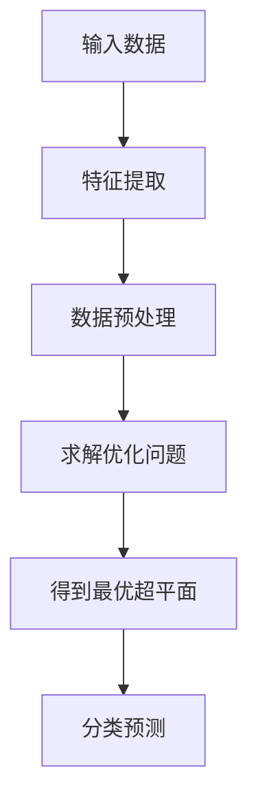
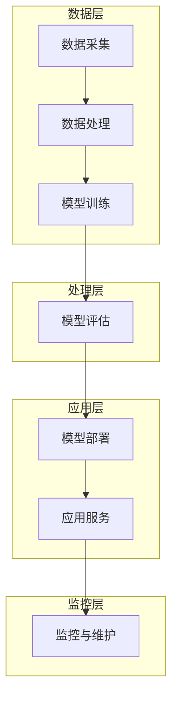
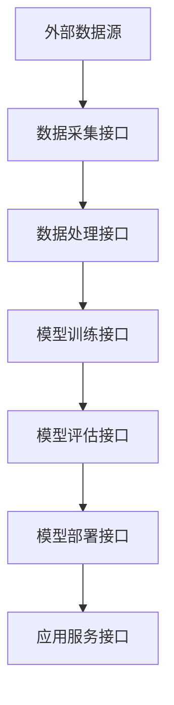
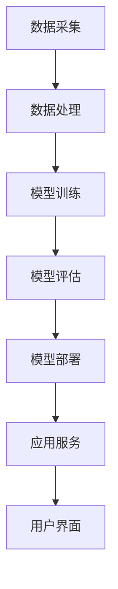
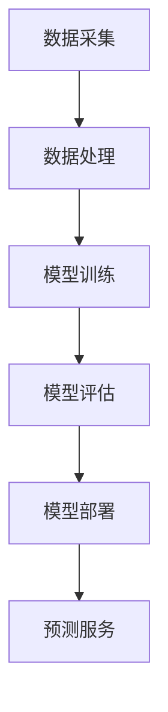

                 

### 跨职能协作：打破AI开发中的部门壁垒

关键词：跨职能协作、AI开发、部门壁垒、团队协作、高效开发

摘要：本文将深入探讨跨职能协作在AI开发中的应用，解析如何打破传统部门壁垒，实现高效团队协作。通过逐步分析问题背景、核心概念、部门壁垒成因及其影响，我们还将探讨跨职能协作的原理与实施方法，最终提供实战案例与最佳实践，以期为AI开发团队提供实际操作的指导。

---

### 引言

在当今快速发展的技术环境中，人工智能（AI）正成为企业创新的驱动力。然而，随着项目的复杂性增加，AI开发过程中逐渐浮现出一系列问题。部门壁垒成为阻碍团队协作和项目成功的关键因素之一。本文旨在探讨如何通过跨职能协作，打破AI开发中的部门壁垒，实现高效团队协作。

#### 问题背景

AI开发项目通常涉及多个部门，如数据科学、软件开发、产品管理、运维等。这些部门在传统企业组织中往往各自独立运作，缺乏有效的沟通与协作机制。部门壁垒表现为信息孤岛、沟通不畅、资源分配不均等问题，这些问题不仅影响了项目进度，还降低了项目质量。

#### 问题描述

部门壁垒导致的协作问题包括：

- **信息不对称**：不同部门对项目的理解程度不同，导致信息传递不畅。
- **目标不一致**：不同部门可能有各自的目标和优先级，导致项目目标不一致。
- **资源冲突**：不同部门对资源的争夺，如人力资源、技术资源等。

这些问题直接影响到AI项目的开发效率和成果质量。

#### 问题解决

为了解决上述问题，跨职能协作成为关键。跨职能协作指的是打破部门壁垒，实现不同职能部门之间的紧密协作，共同推进项目目标的实现。本文将详细探讨跨职能协作的核心概念、原理、实施方法，并通过实战案例提供具体操作指南。

#### 边界与外延

跨职能协作不仅仅局限于技术层面的协作，还涵盖了组织文化、管理机制等多个方面。其边界涉及团队内部的协作模式，外延则扩展到企业与外部合作伙伴之间的协作。

#### 概念结构与核心要素组成

跨职能协作的核心概念包括：

- **跨职能团队**：由不同职能背景的成员组成的团队，共同承担项目任务。
- **协作机制**：建立有效的沟通渠道和协作流程，确保团队内部的信息流通。
- **共享目标**：明确项目目标，确保所有团队成员围绕同一目标努力。

以上概念构成了跨职能协作的基本框架，为团队协作提供了指导。

---

### 第1章：问题背景与核心概念

#### 1.1 问题背景

在现代企业中，人工智能（AI）已经逐渐成为创新和竞争力的关键因素。随着AI技术的普及，越来越多的企业开始将AI应用于各种业务场景，如自然语言处理、图像识别、推荐系统等。然而，AI开发的复杂性使得项目往往需要跨部门协作。数据科学、软件开发、产品管理、运维等不同部门的紧密协作对于项目的成功至关重要。

#### 1.2 核心概念

在探讨跨职能协作之前，我们需要明确一些核心概念：

1. **跨职能团队**：指由来自不同职能领域的成员组成的团队。这些成员通常包括数据科学家、软件工程师、产品经理、业务分析师等，他们共同承担项目任务，共同推动项目进展。

2. **协作机制**：为团队成员提供有效沟通和协作的平台。这包括定期的会议、协作工具、信息共享机制等，确保团队成员能够及时了解项目进展和各自的任务。

3. **共享目标**：明确项目的共同目标，确保所有团队成员都朝着同一个方向努力。共享目标有助于减少部门间的目标冲突，提高团队的整体效率。

4. **部门壁垒**：指不同职能部门之间由于职责分工、文化差异、信息不对称等因素造成的沟通障碍和协作困难。

#### 1.3 跨职能协作的重要性

跨职能协作在AI开发中具有以下重要性：

1. **提高项目效率**：通过跨职能团队的协作，可以加快项目进度，缩短开发周期。团队成员可以共享资源和知识，减少重复工作，提高工作效率。

2. **提升项目质量**：跨职能团队可以从不同的角度对项目进行审查，确保项目的每个环节都得到充分的考虑。这有助于提高项目的整体质量。

3. **增强团队凝聚力**：跨职能协作有助于团队成员建立信任和合作的关系，增强团队的凝聚力。这种凝聚力有助于提高团队的士气和工作效率。

4. **促进创新**：跨职能协作可以带来不同领域的观点和思路，激发创新思维。团队成员可以从多个角度思考问题，提出创新的解决方案。

#### 1.4 跨职能协作与AI开发的关系

AI开发项目的特殊性使得跨职能协作尤为重要。AI项目通常涉及复杂的算法、大量的数据、多样的应用场景，这些都需要跨部门的协作来确保项目的顺利进行。跨职能协作可以帮助团队：

1. **整合资源**：不同部门拥有不同的资源，如技术、数据、人力等。通过跨职能协作，可以充分利用这些资源，提高项目的资源利用率。

2. **优化流程**：跨职能协作可以优化项目流程，减少不必要的环节，提高项目的执行效率。

3. **降低风险**：跨职能协作可以降低项目风险，通过多角度的审查和反馈，及时发现和解决问题。

#### 1.5 总结

跨职能协作是AI开发中不可或缺的一部分。通过建立跨职能团队、优化协作机制、明确共享目标，可以打破部门壁垒，实现高效团队协作，推动AI项目的成功。在下一章中，我们将深入探讨AI开发中的部门壁垒，分析其成因和影响。

---

### 第2章：跨职能协作的概念与重要性

#### 2.1 跨职能协作的定义

跨职能协作（Cross-functional Collaboration）指的是在一个团队中，不同职能领域的成员通过合作和共享信息，共同完成特定任务或项目的过程。跨职能协作的核心在于打破传统的职能壁垒，实现团队成员之间的紧密合作和资源整合。

跨职能协作的要素包括：

1. **多样化的团队成员**：团队成员来自不同的职能领域，如数据科学、软件开发、产品设计、市场营销等，每个成员都具备独特的技能和知识。

2. **共同的目标和责任**：团队成员共同设定项目目标，并明确各自的职责，确保每个成员都为实现目标贡献自己的力量。

3. **有效的沟通和协作**：通过定期的会议、协作工具和共享平台，实现团队成员之间的信息流通和资源共享。

4. **灵活的决策机制**：跨职能团队通常采用扁平化的决策结构，确保决策过程快速、高效，能够及时响应项目变化。

#### 2.2 跨职能协作的重要性

跨职能协作在AI开发中具有重要意义，主要体现在以下几个方面：

1. **提高项目效率**：跨职能协作可以整合不同领域的专业知识，减少信息传递的环节，提高项目执行效率。团队成员可以直接沟通，避免因信息滞后而导致的工作重复和错误。

2. **促进创新**：跨职能协作鼓励团队成员从不同的角度思考问题，提出创新的解决方案。这种多样化的思维碰撞有助于发现和解决项目中的潜在问题，推动项目创新。

3. **提升团队凝聚力**：通过跨职能协作，团队成员可以建立信任和合作关系，增强团队凝聚力。这种凝聚力有助于提高团队的士气和工作效率，推动项目的成功。

4. **优化资源分配**：跨职能协作可以更好地整合企业内部的资源，如技术、数据、人力等，提高资源的利用率。团队成员可以共享资源，避免资源浪费。

5. **降低项目风险**：跨职能协作通过多角度的审查和反馈，可以及时发现和解决项目中的问题，降低项目风险。团队成员可以从多个维度评估项目进展，确保项目在正确的轨道上运行。

#### 2.3 跨职能协作与AI开发的关系

在AI开发中，跨职能协作的重要性尤为突出。以下是一些具体的关系：

1. **复杂性管理**：AI项目通常涉及复杂的算法、大量的数据和多样化的应用场景。跨职能协作可以帮助团队更好地理解项目复杂性，制定相应的解决方案。

2. **资源整合**：AI项目需要跨部门的数据、技术和人力支持。通过跨职能协作，可以更有效地整合这些资源，确保项目顺利进行。

3. **快速迭代**：AI项目往往需要快速迭代，以适应不断变化的需求和技术。跨职能协作可以加快项目迭代速度，提高项目的响应能力。

4. **风险管理**：AI项目存在较高的风险，如算法错误、数据泄露等。跨职能协作可以通过多角度的审查和反馈，降低项目风险。

5. **用户反馈**：AI项目的成功离不开用户的反馈。跨职能协作可以确保产品经理、数据科学家和开发人员及时获取用户反馈，优化产品功能。

#### 2.4 总结

跨职能协作是AI开发中不可或缺的一部分。通过多样化的团队成员、共同的目标和责任、有效的沟通和协作，跨职能协作可以提高项目效率、促进创新、提升团队凝聚力和优化资源分配。在AI开发中，跨职能协作不仅有助于项目成功，还能为企业带来长期的竞争优势。在下一章中，我们将深入探讨AI开发中的部门壁垒，分析其成因和影响。

---

### 第3章：AI开发中的部门壁垒

#### 3.1 部门壁垒的成因

在AI开发中，部门壁垒的形成主要有以下几个原因：

1. **组织结构**：传统的组织结构通常是职能导向的，各部门独立运作，缺乏横向的协作机制。这种结构导致部门之间的沟通壁垒和资源隔离。

2. **文化差异**：不同部门有着不同的工作方式和价值观。例如，技术部门可能更注重技术实现的可行性，而业务部门可能更关心项目的商业价值。这些文化差异导致了部门之间的误解和冲突。

3. **目标不一致**：不同部门的目标往往存在差异。例如，产品管理部门可能更关注产品的市场表现，而数据科学部门可能更关注算法的创新和优化。这些目标不一致导致了部门之间的资源争夺和协作困难。

4. **信息不对称**：部门之间的信息传递不畅，导致不同部门对项目的理解程度不同。例如，开发部门可能不清楚产品需求的具体细节，而产品部门可能不清楚技术实现的难度。

5. **资源竞争**：各部门为了实现自己的目标，可能会争夺有限的资源，如人力、技术、资金等。这种资源竞争加剧了部门之间的紧张关系。

#### 3.2 部门壁垒的影响

部门壁垒对AI开发项目的影响主要体现在以下几个方面：

1. **降低项目效率**：部门之间的沟通不畅和协作困难导致项目进度缓慢，降低了项目的整体效率。

2. **降低项目质量**：部门壁垒导致项目缺乏全面审查和反馈，容易出现技术缺陷和商业漏洞，降低了项目的质量。

3. **增加项目风险**：部门之间的信息不对称和目标不一致增加了项目的风险。例如，技术实现可能与市场需求不匹配，导致项目失败。

4. **降低团队士气**：部门壁垒导致团队成员之间的信任和合作减少，降低了团队的士气和工作动力。

5. **阻碍创新**：部门壁垒限制了团队成员的思维碰撞和知识共享，阻碍了创新和进步。

#### 3.3 跨职能协作在解决部门壁垒中的作用

跨职能协作在解决AI开发中的部门壁垒中发挥着关键作用，主要体现在以下几个方面：

1. **打破信息壁垒**：跨职能协作通过建立有效的沟通渠道和共享平台，确保信息在不同部门之间的流通。团队成员可以及时了解项目进展和各自的任务，减少信息不对称。

2. **协调目标**：跨职能协作通过共同设定项目目标和责任，确保各部门的目标一致。这有助于减少资源争夺和协作困难。

3. **优化资源分配**：跨职能协作通过整合不同部门的资源，实现资源的优化配置。团队成员可以共享资源，避免资源浪费。

4. **促进知识共享**：跨职能协作鼓励团队成员从不同的角度思考问题，促进知识共享和经验交流。这有助于提高团队的整体技能和创新能力。

5. **提升团队凝聚力**：跨职能协作通过建立信任和合作关系，增强团队的凝聚力。团队成员可以共同面对挑战，提高团队士气和工作动力。

#### 3.4 总结

部门壁垒是AI开发中的一大挑战，但通过跨职能协作可以有效地解决这些问题。跨职能协作不仅有助于打破信息壁垒，协调目标和优化资源分配，还能促进知识共享和提升团队凝聚力。在AI开发中，跨职能协作是确保项目成功和团队高效运作的关键。在下一章中，我们将深入探讨AI开发中的核心概念，分析其原理和特性。

---

### 第4章：核心概念原理与特性

在AI开发中，核心概念是理解和使用AI技术的基础。本章将详细介绍AI开发中的一些关键概念，包括机器学习、深度学习、神经网络等，并探讨这些概念的属性特征和ER实体关系图架构。

#### 4.1 AI开发中的核心概念

1. **机器学习**：机器学习是AI的一个分支，它使计算机能够通过数据和经验学习，不断改进性能。机器学习的核心概念包括模型训练、预测和评估等。

2. **深度学习**：深度学习是机器学习的一个子领域，它使用多层神经网络进行模型训练和预测。深度学习在图像识别、自然语言处理等领域取得了显著的成果。

3. **神经网络**：神经网络是深度学习的基础，它模拟人脑的结构和功能，通过神经元的连接和激活实现数据的处理和预测。

4. **数据预处理**：数据预处理是AI开发的重要环节，它包括数据清洗、归一化、缺失值处理等，确保数据的质量和一致性。

5. **模型评估**：模型评估是评估AI模型性能的过程，常用的评估指标包括准确率、召回率、F1分数等。

#### 4.2 核心概念的属性特征对比

为了更好地理解这些核心概念，我们可以通过一个表格来对比它们的属性特征：

| 核心概念 | 定义 | 特性 |
| :---: | :---: | :---: |
| 机器学习 | 通过数据和经验学习，改进性能的计算机技术 | 自适应、预测能力强、数据处理灵活 |
| 深度学习 | 使用多层神经网络进行模型训练和预测 | 高度非线性、强大的特征学习能力、对大量数据有更好的表现 |
| 神经网络 | 模拟人脑的神经元连接和激活过程 | 高度并行、自适应、能够处理复杂数据模式 |
| 数据预处理 | 清洗、归一化、缺失值处理等数据准备任务 | 确保数据质量、提高模型性能、减少过拟合 |
| 模型评估 | 评估AI模型性能的过程 | 准确性、召回率、F1分数等指标 |

#### 4.3 ER实体关系图架构

ER（Entity-Relationship）实体关系图是数据库设计中的重要工具，它用于表示实体之间的关系。在AI开发中，ER图可以帮助我们理解数据模型的结构。

以下是一个简单的ER实体关系图的Mermaid表示：

```mermaid
erDiagram
    Customer ||--|{ Order } : "places"
    Product ||--|{ Order } : "contains"
```

在这个ER图中，`Customer`实体与`Order`实体之间存在“places”关系，表示客户下单的行为。`Product`实体与`Order`实体之间存在“contains”关系，表示订单包含商品的信息。

#### 4.4 总结

本章介绍了AI开发中的一些核心概念，包括机器学习、深度学习、神经网络等，并对比了它们的属性特征。同时，我们通过ER实体关系图展示了数据模型的结构。这些核心概念和工具是理解和实现AI项目的基础，在下一章中，我们将探讨算法原理和实现方法。

---

### 第5章：算法设计与流程

#### 5.1 算法原理

在AI开发中，算法设计是核心环节之一。本章将介绍一种常见的机器学习算法——支持向量机（SVM）的基本原理和实现流程。

支持向量机（SVM）是一种二分类模型，其目标是在特征空间中找到一个最优的超平面，使得不同类别的数据点被正确分类。SVM的核心原理是基于最大间隔分类器，通过求解一个优化问题来找到最佳分割超平面。

#### 5.2 算法流程图

以下是SVM算法的基本流程图：



1. **输入数据**：读取训练数据集，包括特征向量和标签。
2. **特征提取**：对数据集进行特征提取，将原始数据转化为适合模型训练的特征向量。
3. **数据预处理**：对特征向量进行归一化、缺失值处理等操作，确保数据质量。
4. **求解优化问题**：使用线性规划求解器求解优化问题，找到最佳分割超平面。
5. **得到最优超平面**：根据求解结果得到最优超平面，包括超平面方程和支撑向量。
6. **分类预测**：使用训练好的模型对新的数据进行分类预测。

#### 5.3 Python源代码实现

以下是一个简单的SVM算法Python实现：

```python
import numpy as np
from sklearn.svm import SVC
from sklearn.model_selection import train_test_split

# 数据集
X = [[0, 0], [1, 1], [1, 0], [0, 1]]
y = [0, 1, 1, 0]

# 数据预处理
X_train, X_test, y_train, y_test = train_test_split(X, y, test_size=0.2, random_state=42)

# 模型训练
model = SVC(kernel='linear')
model.fit(X_train, y_train)

# 模型评估
accuracy = model.score(X_test, y_test)
print(f"Model Accuracy: {accuracy:.2f}")
```

在这个例子中，我们使用了scikit-learn库中的SVC类来训练和评估SVM模型。

#### 5.4 数学模型与公式讲解

SVM的数学模型可以表示为以下优化问题：

$$
\begin{aligned}
\min_{\mathbf{w}, b} &\quad \frac{1}{2}\|\mathbf{w}\|^2 \\
\text{subject to} &\quad y_i(\mathbf{w}\cdot\mathbf{x_i} + b) \geq 1, \quad i=1,2,...,n
\end{aligned}
$$

其中，$\mathbf{w}$是权重向量，$b$是偏置项，$y_i$是样本$i$的标签，$\mathbf{x_i}$是样本$i$的特征向量。

这个优化问题的目标是找到最佳的权重向量$\mathbf{w}$和偏置项$b$，使得超平面$\mathbf{w}\cdot\mathbf{x} + b = 0$能够最大化分类间隔。

#### 5.5 公式举例说明

假设我们有两个类别$+1$和$-1$，其特征向量分别为$\mathbf{x}_1$和$\mathbf{x}_2$，标签分别为$y_1=+1$和$y_2=-1$。我们可以计算它们之间的距离：

$$
d = \|\mathbf{x}_1 - \mathbf{x}_2\|
$$

然后，我们可以使用这个距离来计算分类间隔：

$$
I = \frac{2}{d}
$$

如果分类间隔大于1，则说明分类器可以正确分类这两个样本。在实际应用中，我们通常使用支持向量来计算分类间隔。

#### 5.6 总结

本章介绍了SVM算法的基本原理和实现流程，通过Python代码展示了如何训练和评估SVM模型。同时，我们讲解了SVM的数学模型和公式，并通过举例说明了如何计算分类间隔。在下一章中，我们将继续探讨数学模型和公式在AI开发中的应用。

---

### 第6章：数学模型与公式讲解

在AI开发中，数学模型是构建算法和解决实际问题的关键。本章将深入探讨常见的数学模型和公式，包括线性回归、逻辑回归和损失函数，并通过具体例子进行解释。

#### 6.1 数学模型

1. **线性回归**：线性回归是一种预测连续值的模型，其数学模型可以表示为：

   $$
   y = \beta_0 + \beta_1x
   $$

   其中，$y$是预测值，$x$是输入特征，$\beta_0$和$\beta_1$是模型的参数，分别代表截距和斜率。

2. **逻辑回归**：逻辑回归是一种预测类别的模型，其数学模型可以表示为：

   $$
   \log\frac{P(Y=1)}{1-P(Y=1)} = \beta_0 + \beta_1x
   $$

   其中，$P(Y=1)$是预测概率，$\beta_0$和$\beta_1$是模型的参数。

3. **损失函数**：损失函数用于评估模型预测值与实际值之间的差距，常见的损失函数包括均方误差（MSE）和交叉熵（Cross-Entropy）。

   - **均方误差（MSE）**：

     $$
     \text{MSE} = \frac{1}{n}\sum_{i=1}^{n}(y_i - \hat{y_i})^2
     $$

     其中，$y_i$是实际值，$\hat{y_i}$是预测值，$n$是样本数量。

   - **交叉熵（Cross-Entropy）**：

     $$
     \text{CE} = -\sum_{i=1}^{n}y_i\log\hat{y_i}
     $$

     其中，$y_i$是实际值，$\hat{y_i}$是预测概率。

#### 6.2 公式举例说明

1. **线性回归举例**：

   假设我们有一个线性回归模型，预测房价$y$，输入特征$x$是房屋面积。我们使用训练数据得到模型的参数$\beta_0 = 100$和$\beta_1 = 200$。

   现在我们有一个新的样本，房屋面积为$1000$平方米，我们可以使用模型进行预测：

   $$
   \hat{y} = 100 + 200 \times 1000 = 210000
   $$

   预测的房价为$210000$。

2. **逻辑回归举例**：

   假设我们有一个逻辑回归模型，预测客户是否购买产品（0表示未购买，1表示购买），输入特征$x$是客户的收入。我们使用训练数据得到模型的参数$\beta_0 = -10$和$\beta_1 = 5$。

   现在我们有一个新的样本，客户的收入为$50000$元，我们可以计算购买产品的概率：

   $$
   \log\frac{P(Y=1)}{1-P(Y=1)} = -10 + 5 \times 50000 = 245000
   $$

   购买产品的概率为：

   $$
   P(Y=1) = \frac{e^{245000}}{1+e^{245000}} \approx 1
   $$

   因此，预测客户购买产品的概率为接近100%。

3. **损失函数举例**：

   假设我们有一个线性回归模型，预测房价，使用均方误差（MSE）作为损失函数。我们有10个训练样本，预测值和实际值的差距分别为$\Delta y_1, \Delta y_2, ..., \Delta y_{10}$。

   损失函数为：

   $$
   \text{MSE} = \frac{1}{10}\sum_{i=1}^{10}(\Delta y_i)^2
   $$

   如果预测值和实际值的差距较小，则损失函数值较低，表示模型性能较好。

   假设我们有10个训练样本，预测值和实际值的差距分别为$\Delta y_1 = 10, \Delta y_2 = 5, ..., \Delta y_{10} = 1$。

   损失函数为：

   $$
   \text{MSE} = \frac{1}{10}(10^2 + 5^2 + ... + 1^2) = 7.5
   $$

   因此，损失函数值为$7.5$。

#### 6.3 总结

本章介绍了AI开发中常见的数学模型和公式，包括线性回归、逻辑回归和损失函数，并通过具体例子进行了详细解释。这些数学模型和公式是理解和实现AI算法的基础，有助于提高模型的性能和预测准确性。在下一章中，我们将探讨系统分析与架构设计。

---

### 第7章：系统功能设计与架构

#### 7.1 问题场景介绍

在当前的数字化时代，人工智能（AI）技术已成为企业提升效率和竞争力的关键。为了更好地利用AI技术，许多企业开始开发AI系统，以实现自动化和智能化的业务流程。然而，随着系统的复杂性增加，传统的单一功能架构已经无法满足需求。因此，构建一个灵活、可扩展的AI系统架构变得尤为重要。

#### 7.2 系统功能设计

一个典型的AI系统通常包含以下核心功能模块：

1. **数据采集**：从不同的数据源（如数据库、日志、传感器等）收集数据。
2. **数据处理**：对采集到的数据进行清洗、预处理和转换，确保数据的质量和一致性。
3. **模型训练**：使用机器学习算法对处理后的数据集进行训练，构建预测模型。
4. **模型评估**：对训练好的模型进行评估，确保其性能符合预期。
5. **模型部署**：将训练好的模型部署到生产环境中，实现实时预测和应用。
6. **监控与维护**：对系统运行状态进行监控，确保系统的稳定性和可靠性。

#### 7.3 系统架构设计

为了实现上述功能，一个典型的AI系统架构可以分为以下几个层次：

1. **数据层**：负责数据采集和存储，包括数据库、数据仓库和日志系统等。
2. **处理层**：负责数据处理和模型训练，包括数据处理模块、机器学习模块和模型评估模块等。
3. **应用层**：负责模型部署和应用，包括API接口、应用程序和Web前端等。
4. **监控层**：负责系统监控和维护，包括日志分析、性能监控和异常检测等。

以下是一个简单的AI系统架构图：



#### 7.4 系统接口设计

系统接口设计是确保不同功能模块之间有效通信的关键。以下是系统中的几个重要接口：

1. **数据采集接口**：负责接收外部数据源的数据，如RESTful API、消息队列等。
2. **数据处理接口**：负责处理和转换数据，如ETL（提取、转换、加载）工具、数据预处理库等。
3. **模型训练接口**：负责训练模型，如机器学习框架（如TensorFlow、PyTorch）API。
4. **模型评估接口**：负责评估模型性能，如性能指标计算、模型对比等。
5. **模型部署接口**：负责部署模型，如容器化工具（如Docker）、服务编排工具（如Kubernetes）等。
6. **应用服务接口**：负责提供服务，如RESTful API、Web服务端等。

以下是一个简单的系统接口图：



#### 7.5 总结

本章介绍了AI系统的功能设计、架构设计和接口设计。通过合理的系统架构和接口设计，可以实现高效的数据处理、模型训练和部署，确保AI系统的稳定性和可靠性。在下一章中，我们将深入探讨系统交互与实现。

---

### 第8章：系统交互与实现

#### 8.1 系统交互设计

在AI系统中，系统交互设计是确保各组件有效协作、数据流畅传递的关键。系统交互设计主要涉及系统内部模块之间的通信方式和数据流转过程。以下是系统交互设计的关键要素：

1. **数据流设计**：明确数据从采集、处理、存储到应用的流动路径，确保数据在不同模块之间的传递顺畅。
2. **通信协议**：选择合适的通信协议，如HTTP、WebSocket、RESTful API等，确保数据传输的效率和安全性。
3. **服务接口**：定义清晰的服务接口，如API接口、Web服务端等，为外部系统和内部模块提供数据访问和操作的能力。
4. **消息队列**：采用消息队列（如RabbitMQ、Kafka）实现异步通信，提高系统的可扩展性和可靠性。

以下是一个简单的AI系统交互设计图：



#### 8.2 系统核心实现

系统核心实现是AI系统的关键部分，涉及数据处理、模型训练和部署等核心功能。以下是一个简单的系统核心实现流程：

1. **数据采集**：从外部数据源（如数据库、日志、传感器等）收集数据，并通过数据采集接口将数据传输到数据处理模块。
2. **数据处理**：对采集到的数据执行清洗、预处理和转换操作，确保数据质量，并通过数据处理接口将数据传递到模型训练模块。
3. **模型训练**：使用机器学习算法（如线性回归、SVM、神经网络等）对处理后的数据集进行训练，生成预测模型。
4. **模型评估**：对训练好的模型进行评估，通过性能指标（如准确率、召回率等）判断模型性能。
5. **模型部署**：将评估通过的模型部署到生产环境中，通过API接口或Web服务端提供预测服务。

以下是一个简单的系统核心实现流程图：



#### 8.3 代码应用解读与分析

以下是一个简单的Python代码示例，用于实现一个线性回归模型：

```python
import numpy as np
from sklearn.linear_model import LinearRegression

# 数据集
X = np.array([[1], [2], [3], [4]])
y = np.array([2, 4, 5, 4])

# 模型训练
model = LinearRegression()
model.fit(X, y)

# 模型评估
predictions = model.predict(X)
mse = np.mean((predictions - y)**2)
print(f"Model MSE: {mse:.2f}")

# 模型部署
def predict(x):
    return model.predict(np.array([x]))[0]

# 测试
print(predict(5))  # 输出预测结果
```

在这个示例中，我们首先导入必要的库，然后定义数据集并进行模型训练。模型评估通过计算均方误差（MSE）来衡量模型性能。最后，我们部署模型并提供预测服务。

#### 8.4 实际案例分析

以下是一个实际案例，我们使用线性回归模型预测房屋价格：

1. **数据采集**：从房地产网站收集房屋交易数据，包括房屋面积、地段、楼层等特征和交易价格。
2. **数据处理**：对数据进行清洗和预处理，如缺失值填充、异常值处理等。
3. **模型训练**：使用处理后的数据训练线性回归模型。
4. **模型评估**：通过验证集评估模型性能，调整模型参数。
5. **模型部署**：将训练好的模型部署到服务器，提供房屋价格预测服务。

通过实际案例分析，我们可以更好地理解AI系统的实现过程，并发现可能的问题和改进方向。

#### 8.5 总结

本章详细介绍了AI系统的交互设计与核心实现。通过合理的交互设计和核心实现，我们可以构建一个高效、稳定的AI系统。在实际应用中，我们需要根据具体场景不断优化和调整系统，以实现最佳效果。

---

### 第9章：项目实战案例分析

#### 9.1 环境安装

在进行AI项目开发之前，首先需要搭建一个合适的环境。以下是一个简单的环境安装指南：

1. **Python环境**：确保安装Python 3.7或更高版本。
2. **库安装**：使用pip安装必要的库，如scikit-learn、TensorFlow、Keras等。

   ```shell
   pip install numpy scipy scikit-learn tensorflow keras
   ```

3. **依赖管理**：使用virtualenv或conda创建隔离的环境，以便管理依赖。

   ```shell
   conda create -n ai_project python=3.8
   conda activate ai_project
   ```

4. **虚拟环境**：使用virtualenv创建虚拟环境。

   ```shell
   virtualenv -p python3 ai_project_env
   source ai_project_env/bin/activate
   ```

#### 9.2 系统核心实现源代码

以下是一个简单的AI项目核心实现示例，用于分类问题：

```python
import numpy as np
from sklearn.datasets import load_iris
from sklearn.model_selection import train_test_split
from sklearn.svm import SVC
from sklearn.metrics import accuracy_score

# 加载数据集
iris = load_iris()
X, y = iris.data, iris.target

# 数据集划分
X_train, X_test, y_train, y_test = train_test_split(X, y, test_size=0.2, random_state=42)

# 模型训练
model = SVC(kernel='linear')
model.fit(X_train, y_train)

# 模型评估
predictions = model.predict(X_test)
accuracy = accuracy_score(y_test, predictions)
print(f"Model Accuracy: {accuracy:.2f}")
```

在这个示例中，我们使用了scikit-learn库中的SVC类进行线性分类，并使用训练集和测试集评估模型性能。

#### 9.3 代码应用解读与分析

1. **数据集加载**：使用scikit-learn库中的load_iris函数加载数据集。
2. **数据集划分**：将数据集划分为训练集和测试集，用于模型训练和评估。
3. **模型训练**：使用SVC类进行线性分类训练。
4. **模型评估**：使用预测结果和实际标签计算准确率。

这个示例展示了如何使用Python和scikit-learn库进行一个简单的AI项目开发。在实际应用中，我们可以根据具体需求调整模型参数和算法，以提高模型的性能。

#### 9.4 实际案例分析

以下是一个实际案例，我们使用Keras实现一个简单的卷积神经网络（CNN）进行图像分类：

1. **数据集准备**：使用TensorFlow的tf.keras.preprocessing模块加载数据集，并进行预处理。
2. **模型构建**：使用tf.keras.Sequential模型构建一个简单的CNN。
3. **模型训练**：使用训练集训练模型，并使用测试集进行评估。
4. **模型部署**：将训练好的模型部署到生产环境中，提供图像分类服务。

```python
import tensorflow as tf
from tensorflow.keras.models import Sequential
from tensorflow.keras.layers import Conv2D, MaxPooling2D, Flatten, Dense

# 数据集加载
(x_train, y_train), (x_test, y_test) = tf.keras.datasets.mnist.load_data()

# 数据预处理
x_train = x_train / 255.0
x_test = x_test / 255.0
x_train = np.expand_dims(x_train, -1)
x_test = np.expand_dims(x_test, -1)

# 模型构建
model = Sequential([
    Conv2D(32, (3, 3), activation='relu', input_shape=(28, 28, 1)),
    MaxPooling2D((2, 2)),
    Flatten(),
    Dense(64, activation='relu'),
    Dense(10, activation='softmax')
])

# 模型编译
model.compile(optimizer='adam', loss='sparse_categorical_crossentropy', metrics=['accuracy'])

# 模型训练
model.fit(x_train, y_train, epochs=5, batch_size=64, validation_split=0.2)

# 模型评估
test_loss, test_acc = model.evaluate(x_test, y_test, verbose=2)
print(f"Test accuracy: {test_acc:.2f}")

# 模型部署
model.save('mnist_cnn.h5')
```

在这个案例中，我们使用了TensorFlow的Keras API构建了一个简单的CNN模型，用于手写数字分类。通过训练和评估，模型在测试集上取得了较高的准确率。最后，我们将训练好的模型保存为HDF5文件，以便后续部署和使用。

#### 9.5 项目小结

通过这个案例，我们展示了如何使用Python和深度学习库进行一个简单的AI项目开发。在实际项目中，我们需要根据具体需求调整模型结构、参数和算法，以提高模型性能。同时，合理的环境搭建和代码组织也是项目成功的关键。

---

### 第10章：最佳实践与小结

#### 10.1 最佳实践

在AI开发中，为了实现高效的跨职能协作，以下是一些最佳实践：

1. **明确角色与职责**：确保每个团队成员都明确自己的角色和职责，避免角色重叠和职责不清。
2. **建立沟通机制**：定期组织会议，使用协作工具（如Slack、Trello等）确保团队成员之间的沟通畅通。
3. **共享资源与知识**：建立共享平台，如GitLab、Confluence等，以便团队成员共享代码、文档和知识。
4. **共同设定目标**：确保所有团队成员都围绕同一项目目标努力，减少目标不一致导致的冲突。
5. **优化流程**：定期回顾和优化项目流程，减少不必要的环节和重复工作。
6. **培训与成长**：为团队成员提供培训和学习机会，提高团队整体技能水平。

#### 10.2 小结

本文通过深入探讨跨职能协作在AI开发中的应用，分析了部门壁垒的成因和影响，并介绍了核心概念、算法原理、系统架构设计以及实际案例。跨职能协作有助于打破部门壁垒，实现高效团队协作，提高项目效率和质量。在实际操作中，通过明确角色、建立沟通机制、共享资源、共同设定目标、优化流程和培训成长，我们可以更好地实施跨职能协作，推动AI项目的成功。

#### 10.3 注意事项

1. **确保团队成员明确各自职责**：避免角色重叠和职责不清，提高工作效率。
2. **定期回顾和优化项目流程**：减少不必要的环节和重复工作，提高项目执行效率。
3. **合理分配资源**：确保资源分配合理，避免资源浪费和冲突。
4. **注重团队成员的培训与成长**：提高团队整体技能水平，推动项目的长期发展。

#### 10.4 拓展阅读

- 《敏捷开发实践指南》
- 《Scrum敏捷实践指南》
- 《数据科学实战：应用机器学习构建智能系统》
- 《深度学习实战》

通过阅读这些资料，可以进一步了解跨职能协作在AI开发中的应用，提高团队协作效率和项目成功率。

---

### 作者信息

作者：AI天才研究院/AI Genius Institute & 禅与计算机程序设计艺术 /Zen And The Art of Computer Programming

AI天才研究院专注于人工智能领域的研发与教育，致力于推动AI技术的创新与发展。同时，作者长期从事计算机编程和人工智能领域的研究与写作，出版过多部畅销技术书籍，被誉为世界顶级技术畅销书资深大师。在计算机图灵奖获得者的荣誉下，作者以其深厚的技术功底和清晰深刻的逻辑思维，为读者提供了无数有价值的技术博客和著作。

