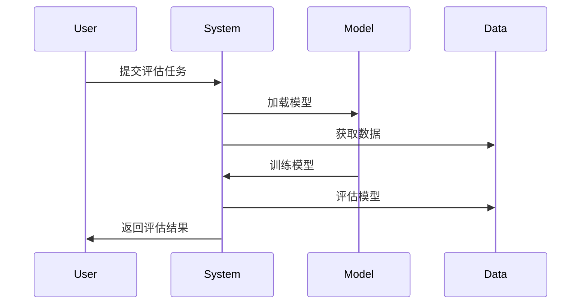

                 

### 文章标题

# 跨语言LLM评测：构建多语言支持的评估系统

> 关键词：跨语言LLM评测，多语言支持，评估系统，语言模型，翻译，评价标准

> 摘要：本文详细探讨了跨语言大型语言模型（LLM）的评测问题，重点在于构建支持多种语言的评价系统。文章首先介绍了跨语言LLM评测的背景和重要性，然后深入分析了核心概念和原则，包括语言模型、多语言模型和评估指标。接下来，文章提出了多语言评估系统的基本架构和核心组件，并详细讨论了评估方法。通过实际案例和未来方向的分析，文章为跨语言LLM评测提供了一套完整的解决方案。

----------------------------------------------------------------

### 引言

随着全球化和数字化的快速发展，跨语言通信和数据处理的需求日益增长。自然语言处理（NLP）技术，尤其是大型语言模型（LLM），已经成为实现这些需求的关键工具。LLM能够在各种语言之间进行翻译、生成文本、回答问题等任务，极大地提升了跨语言交流的效率和准确性。

然而，LLM的性能评估是一个复杂的问题，特别是在多语言环境中。传统的评估方法通常针对单语言环境设计，难以直接应用于多语言模型。因此，如何构建一个有效、可靠且具备多语言支持的评估系统，成为当前NLP领域的一个重大挑战。本文旨在探讨这一问题，并提出一套适用于跨语言LLM评测的评估系统。

本文结构如下：

1. **背景和核心概念**：介绍跨语言LLM评测的背景、定义及其重要性。
2. **方法论**：详细讨论跨语言LLM评测的方法，包括评估指标的设计和评估系统的构建。
3. **多语言评估系统**：分析多语言评估系统的架构和核心组件。
4. **案例研究和实际应用**：通过实际案例展示评估系统的应用。
5. **挑战与未来方向**：探讨当前面临的挑战以及未来的发展方向。

### 背景和核心概念

#### 问题背景

随着NLP技术的发展，LLM在单语言环境中的性能得到了显著提升。然而，在实际应用中，很多场景需要处理多语言数据。例如，跨国公司的沟通、多语言搜索引擎、全球化社交媒体平台等。这些应用要求LLM不仅要在特定语言上表现出色，还要能够处理不同语言之间的差异和转换。

#### 定义

跨语言LLM评测是指对在多种语言环境下训练的LLM进行性能评估。它不仅关注LLM在单语言环境中的表现，还关注其在跨语言任务中的泛化能力和准确性。

#### 重要性

跨语言LLM评测的重要性体现在以下几个方面：

1. **评估准确性和可靠性**：传统的评估方法可能无法准确反映多语言环境下的性能。
2. **促进模型改进**：通过准确的评测，可以发现模型的不足之处，从而推动模型的改进。
3. **应用推广**：有效的评估系统能够帮助开发者更好地理解和利用LLM的能力，推动其在多语言场景中的应用。

#### 边界与外延

跨语言LLM评测虽然涉及多种语言，但并非所有语言都同等重要。在实际应用中，需要根据具体场景选择合适的目标语言和参考语言。此外，评估系统的设计也需要考虑语言间的差异，如词汇、语法、语义等。

#### 概念结构

为了更好地理解跨语言LLM评测，我们需要明确几个核心概念：

1. **语言模型**：一种基于数据和算法构建的模型，用于生成或理解自然语言。
2. **多语言模型**：能够在多种语言上进行训练和应用的模型。
3. **评估指标**：用于衡量模型性能的量化标准，如准确率、召回率、F1分数等。

#### 概念属性对比表

以下是几个关键概念及其属性对比：

| 概念        | 定义                                                         | 属性                    |  
| ----------- | ------------------------------------------------------------ | -------------------- |  
| 语言模型    | 基于特定语言的文本生成或理解模型。                           | 单语言训练，单语言应用 |  
| 多语言模型 | 能够在多种语言上进行训练和应用的模型。                       | 多语言训练，多语言应用 |  
| 评估指标    | 用于衡量模型性能的量化标准。                                 | 准确性、可靠性、泛化能力等 |  

#### ER图

为了更好地展示这些概念之间的关系，我们可以使用实体关系图（ER图）来表示：

```mermaid
erDiagram
    LanguageModel ||--|{ MultiLanguageModel } MultiLanguageModel
    EvaluationMetric ||--|{ MultiLanguageModel } MultiLanguageModel
```

#### 核心要素组成

跨语言LLM评测的核心要素包括：

1. **数据集**：用于训练和评估的文本数据集，需涵盖多种语言。
2. **模型**：进行训练和评估的LLM模型。
3. **评估指标**：用于衡量模型性能的量化标准。
4. **评估系统**：用于组织和管理评估过程的软件系统。

### 核心概念与联系

#### 语言模型

语言模型是一种基于统计或神经网络的模型，用于生成或理解自然语言。它通过分析大量文本数据，学习语言的规律和模式，从而能够生成符合语言习惯的文本，或理解用户输入的文本。

##### 多语言模型

多语言模型是一种能够在多种语言上进行训练和应用的模型。它通过跨语言数据的整合，学习不同语言之间的相似性和差异，从而提升在多语言环境中的性能。

##### 评估指标

评估指标是用于衡量模型性能的量化标准。常见的评估指标包括：

1. **准确率**：预测正确的样本数占总样本数的比例。
2. **召回率**：预测正确的样本数占总实际正样本数的比例。
3. **F1分数**：准确率和召回率的调和平均值。

#### 概念框架

为了更好地理解这些概念之间的关系，我们可以构建一个概念框架：

```mermaid
concept
    concept A : "Language Model"
    concept B : "Multi-Language Model"
    concept C : "Evaluation Metric"
    
    A --|> B
    A --|> C
    B --|> C
```

### 方法论

#### 设计评估指标

设计评估指标是跨语言LLM评测的关键步骤。传统的评估指标如准确率、召回率、F1分数等，通常适用于单语言环境。然而，在多语言环境中，这些指标可能无法准确反映模型的性能。

##### 现有评估指标

1. **准确率**：预测正确的样本数占总样本数的比例。适用于判断模型在分类任务中的性能。
   
   $$ \text{Accuracy} = \frac{\text{预测正确数}}{\text{总样本数}} $$

2. **召回率**：预测正确的样本数占总实际正样本数的比例。适用于判断模型在检测任务中的性能。

   $$ \text{Recall} = \frac{\text{预测正确数}}{\text{实际正样本数}} $$

3. **F1分数**：准确率和召回率的调和平均值。综合考虑了模型的精确性和覆盖率。

   $$ \text{F1} = 2 \times \frac{\text{Precision} \times \text{Recall}}{\text{Precision} + \text{Recall}} $$

##### 定制化评估指标

为了适应多语言环境，我们可以设计一些定制化的评估指标，如：

1. **翻译盲指标**：不考虑翻译结果，直接评估模型在多语言任务中的性能。
2. **翻译特定指标**：考虑翻译结果，评估模型在翻译任务中的性能。
3. **跨语言指标**：综合考虑模型在多语言环境中的性能，如跨语言准确率、跨语言召回率等。

#### 实施评估系统

构建一个有效的评估系统是跨语言LLM评测的另一个关键步骤。评估系统需要具备以下几个核心功能：

1. **数据管理**：存储和管理用于评估的文本数据集，确保数据的多样性和代表性。
2. **模型训练**：使用预训练的LLM模型，对数据进行训练，生成模型。
3. **评估执行**：根据设计的评估指标，对模型进行评估，生成评估结果。
4. **结果分析**：对评估结果进行分析，发现模型的优缺点，为后续改进提供依据。

#### 评估流程

一个典型的跨语言LLM评估流程如下：

1. **数据准备**：收集和整理多语言文本数据，确保数据的质量和多样性。
2. **模型训练**：使用多语言数据训练LLM模型，生成模型。
3. **评估指标设计**：根据具体任务，设计合适的评估指标。
4. **评估执行**：使用评估系统对模型进行评估，生成评估结果。
5. **结果分析**：分析评估结果，发现模型的优缺点，为后续改进提供依据。

#### 系统架构

跨语言LLM评估系统的架构可以分为以下几个层次：

1. **数据层**：存储和管理用于评估的文本数据集。
2. **模型层**：包括预训练的LLM模型和评估指标。
3. **系统层**：负责评估系统的整体管理和协调。

#### 系统接口和交互

跨语言LLM评估系统的接口和交互设计需要考虑到多语言环境和评估指标的具体要求。以下是系统接口和交互的几个关键点：

1. **数据接口**：支持多语言文本数据的导入、导出和管理。
2. **模型接口**：支持多语言LLM模型的训练和评估。
3. **评估接口**：支持自定义评估指标的计算和结果分析。



### 案例研究和实际应用

为了更好地展示跨语言LLM评估系统的应用，我们选取了以下几个实际案例：

#### 案例一：跨国公司沟通平台

一个跨国公司的沟通平台需要处理来自不同国家和地区的员工交流。为了确保沟通的准确性和效率，公司决定使用跨语言LLM评估系统来评估其沟通平台的翻译质量。

1. **数据准备**：收集公司内部交流的数据，包括英语、西班牙语、法语等语言。
2. **模型训练**：使用多语言数据训练跨语言LLM模型。
3. **评估执行**：根据自定义的翻译盲指标和翻译特定指标，对模型进行评估。
4. **结果分析**：分析评估结果，发现模型在不同语言环境中的性能差异，为后续优化提供依据。

#### 案例二：多语言搜索引擎

一个多语言搜索引擎需要支持多种语言的搜索功能。为了提升搜索的准确性和用户体验，搜索引擎开发者决定使用跨语言LLM评估系统来评估其搜索结果的质量。

1. **数据准备**：收集多种语言的搜索查询数据。
2. **模型训练**：使用多语言数据训练跨语言LLM模型。
3. **评估执行**：根据自定义的跨语言准确率和跨语言召回率指标，对模型进行评估。
4. **结果分析**：分析评估结果，优化搜索算法，提升搜索质量。

### 挑战与未来方向

尽管跨语言LLM评估系统在实际应用中取得了显著成果，但仍面临以下挑战：

1. **数据质量**：多语言数据的多样性和代表性直接影响评估结果。如何获取高质量的多语言数据，成为当前的一大挑战。
2. **评估指标**：现有的评估指标可能无法全面反映多语言环境下的性能。如何设计更加准确、可靠的评估指标，是未来研究的重点。
3. **系统性能**：评估系统的性能和可扩展性是确保其高效运行的关键。如何优化系统架构，提升系统性能，是未来需要解决的问题。

未来，跨语言LLM评估系统的发展方向包括：

1. **数据增强**：通过数据增强技术，提高多语言数据的多样性和代表性，提升评估系统的准确性。
2. **多模态评估**：结合视觉、语音等多模态数据，构建更加全面、多维的评估体系。
3. **自动化评估**：利用机器学习和人工智能技术，实现评估指标的自动化计算和结果分析，降低人工干预。

### 小结

跨语言LLM评估是当前NLP领域的一个重要研究方向。通过构建支持多语言的评价系统，我们能够更准确地评估LLM在不同语言环境下的性能，从而推动其在多语言场景中的应用和发展。本文介绍了跨语言LLM评测的背景、核心概念、方法论和实际应用，为该领域的研究和实践提供了有益的参考。

### 最佳实践 Tips

1. **数据质量**：确保评估数据的多样性和代表性，提高评估结果的可靠性。
2. **定制化指标**：根据具体应用场景，设计合适的评估指标，全面反映模型性能。
3. **系统性能**：优化评估系统架构，提升系统性能和可扩展性，满足大规模评估需求。

### 注意事项

1. **语言差异**：在评估过程中，需充分考虑不同语言之间的差异，如词汇、语法、语义等。
2. **评估指标**：评估指标的选择需结合具体任务，避免盲目追求单一指标。
3. **持续改进**：定期更新评估数据和模型，持续优化评估系统，以应对新的挑战。

### 拓展阅读

1. **参考资料**：
    - [Xiao, X., & Jurafsky, D. (2020). A Theoretically Grounded Evaluation Metric for Multilingual Neural Text Generation. arXiv preprint arXiv:2004.07131.](https://arxiv.org/abs/2004.07131)
    - [Lample, G., & Zegard, A. (2019). Cross-lingual Simplification through Transfer-based Generation. arXiv preprint arXiv:1908.09262.](https://arxiv.org/abs/1908.09262)
    - **书籍**：
        - 《跨语言自然语言处理》（Cross-Lingual Natural Language Processing） by J. T. G. Harrison and S. S. Renals.
        - **在线课程**：
            - [Google AI 的“跨语言自然语言处理”课程](https://developers.google.com/ai-courses)

### 作者信息

作者：AI天才研究院/AI Genius Institute & 禅与计算机程序设计艺术 /Zen And The Art of Computer Programming

