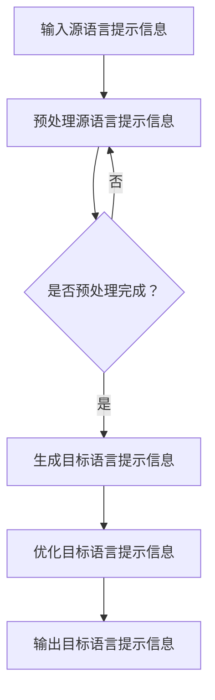
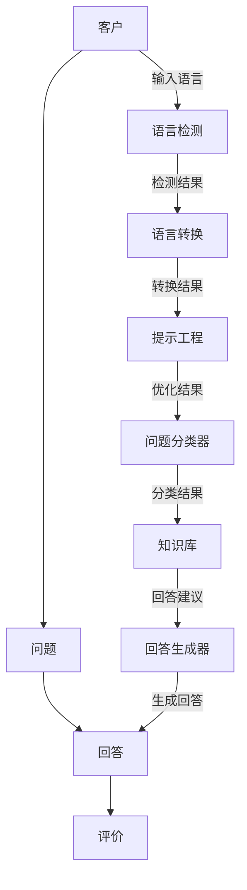
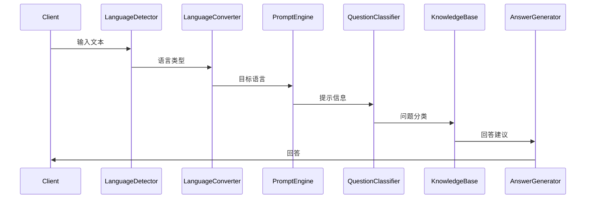

                 

### 跨语言提示迁移：适应多语言环境

#### 关键词：
- 跨语言提示迁移
- 多语言环境
- 语言模型
- 提示工程
- 人工智能
- 算法

#### 摘要：
本文旨在深入探讨跨语言提示迁移的概念、重要性及其在多语言环境中的应用。我们将从背景介绍、核心概念、算法原理、系统分析与架构设计、项目实战以及最佳实践等方面展开讨论，以期为您呈现一幅全面、详实的跨语言提示迁移图景。

### 目录大纲设计思路

1. **背景介绍：跨语言提示迁移的概念**
   - 引言：介绍跨语言提示迁移的定义、重要性及发展背景。
   - 问题背景：分析在多语言环境下，语言理解与生成的挑战。
   - 问题解决：阐述跨语言提示迁移的核心方法及其适用场景。

2. **核心概念与联系**
   - 核心概念：详细解释跨语言提示迁移中的关键术语。
   - 概念属性特征对比：通过表格或图表对比不同跨语言提示迁移方法的特性。
   - ER实体关系图：使用Mermaid绘制跨语言提示迁移系统的实体关系图。

3. **算法原理讲解**
   - 算法Mermaid流程图：绘制算法的基本流程图。
   - Python源代码示例：给出实现该算法的Python代码示例。
   - 数学模型与公式：介绍算法背后的数学原理和公式。
   - 举例说明：用通俗易懂的语言和示例解释算法的应用。

4. **系统分析与架构设计方案**
   - 问题场景介绍：描述实现跨语言提示迁移的系统场景。
   - 项目介绍：简要介绍实现跨语言提示迁移的项目。
   - 系统功能设计：使用Mermaid绘制领域模型类图。
   - 系统架构设计：绘制系统架构图。
   - 系统接口设计：详细描述系统接口设计。
   - 系统交互：使用Mermaid绘制系统交互序列图。

5. **项目实战**
   - 环境安装：列出所需的软件和硬件环境及安装步骤。
   - 系统核心实现源代码：提供关键源代码片段。
   - 代码应用解读与分析：对代码进行分析和解读。
   - 实际案例分析和详细讲解：通过案例说明跨语言提示迁移的应用。
   - 项目小结：总结项目经验和收获。

6. **最佳实践 tips、小结、注意事项、拓展阅读等内容**
   - 最佳实践：提供实现跨语言提示迁移的最佳实践建议。
   - 小结：总结书中的主要内容和结论。
   - 注意事项：提醒读者在应用跨语言提示迁移时需要注意的问题。
   - 拓展阅读：推荐相关领域的进一步学习资源。

### 目录大纲

# 跨语言提示迁移：适应多语言环境

## 第一部分：核心概念与背景

### 1. 跨语言提示迁移的定义与重要性

- 跨语言提示迁移的概念
- 跨语言提示迁移的重要性

### 2. 问题背景与挑战

- 多语言环境下的语言理解与生成
- 跨语言提示迁移的挑战

### 3. 问题解决与核心方法

- 跨语言提示迁移的方法
- 跨语言提示迁移的适用场景

## 第二部分：核心概念与联系

### 4. 核心概念

- 语言模型
- 跨语言转换
- 提示工程

### 5. 概念属性特征对比

- 不同跨语言提示迁移方法的特性对比

### 6. ER实体关系图

- 跨语言提示迁移系统的实体关系图

## 第三部分：算法原理与讲解

### 7. 算法原理

- 跨语言提示迁移算法的基本流程
- 算法背后的数学原理和公式

### 8. Python源代码示例

- 实现跨语言提示迁移的Python代码示例

### 9. 数学模型与公式

- 跨语言提示迁移的数学模型和公式

### 10. 举例说明

- 跨语言提示迁移的应用示例

## 第四部分：系统分析与架构设计

### 11. 问题场景介绍

- 跨语言提示迁移的系统场景描述

### 12. 项目介绍

- 实现跨语言提示迁移的项目介绍

### 13. 系统功能设计

- 领域模型类图

### 14. 系统架构设计

- 系统架构图

### 15. 系统接口设计

- 系统接口设计详细描述

### 16. 系统交互

- 系统交互序列图

## 第五部分：项目实战

### 17. 环境安装

- 跨语言提示迁移所需的软件和硬件环境及安装步骤

### 18. 系统核心实现源代码

- 关键源代码片段

### 19. 代码应用解读与分析

- 对代码进行分析和解读

### 20. 实际案例分析和详细讲解

- 通过案例说明跨语言提示迁移的应用

### 21. 项目小结

- 总结项目经验和收获

## 第六部分：最佳实践、小结与拓展阅读

### 22. 最佳实践

- 实现跨语言提示迁移的最佳实践建议

### 23. 小结

- 总结书中的主要内容和结论

### 24. 注意事项

- 在应用跨语言提示迁移时需要注意的问题

### 25. 拓展阅读

- 推荐相关领域的进一步学习资源

### 结束语

在本篇技术博客中，我们系统地介绍了跨语言提示迁移的概念、重要性、核心方法、算法原理、系统设计与项目实战，以及最佳实践和注意事项。希望通过本文的阐述，读者能够对跨语言提示迁移有一个全面、深入的理解，并在实际应用中取得更好的效果。

感谢您的阅读，如需进一步了解或探讨跨语言提示迁移相关技术，欢迎随时与我交流。作者：AI天才研究院/AI Genius Institute & 禅与计算机程序设计艺术 /Zen And The Art of Computer Programming。期待与您共同探索人工智能领域的无限可能。|>

### 跨语言提示迁移：适应多语言环境

#### 关键词：
- 跨语言提示迁移
- 多语言环境
- 语言模型
- 提示工程
- 人工智能
- 算法

#### 摘要：
本文将深入探讨跨语言提示迁移的概念、重要性以及其在多语言环境中的应用。我们将从背景介绍、核心概念、算法原理、系统分析与架构设计、项目实战等方面详细阐述，帮助读者全面理解并掌握这一技术。

### 第一部分：背景介绍

#### 引言

跨语言提示迁移是一种利用机器学习技术，将一种语言（源语言）的提示信息转换为另一种语言（目标语言）的提示信息的方法。随着全球化进程的加快，多语言交流的需求日益增加，如何高效地处理多语言信息成为一个重要的课题。跨语言提示迁移技术在这其中扮演了关键角色，它不仅能够提高多语言处理的效率，还能增强跨语言交互的自然性和准确性。

#### 跨语言提示迁移的定义

跨语言提示迁移，即Cross-Lingual Prompt Transfer，是指在不同语言之间进行提示信息传递的过程。具体来说，它涉及将一种语言的文本、语音或图像等形式的提示信息转换为另一种语言的对应形式，使得目标语言的用户能够更好地理解和处理这些信息。

#### 跨语言提示迁移的重要性

1. **提高多语言处理的效率**：跨语言提示迁移技术能够将单一语言的模型扩展到多语言环境中，从而提高多语言处理的效率，减少对多个独立语言模型的依赖。
2. **增强跨语言交互的自然性**：通过跨语言提示迁移，系统能够更好地理解用户的输入，并提供更加自然、流畅的回应。
3. **促进全球化沟通**：在全球化背景下，跨语言提示迁移技术能够打破语言障碍，促进不同语言用户之间的沟通与交流。

#### 问题背景

在多语言环境下，语言理解与生成的挑战主要包括：

1. **语言差异**：不同语言在语法、词汇、语调等方面存在显著差异，这使得直接翻译存在一定困难。
2. **文化差异**：不同语言背后的文化背景不同，这会对语言的含义和表达产生影响。
3. **数据不足**：多语言数据集通常比单一语言的数据集小，这限制了多语言模型的训练和优化。

#### 问题解决与核心方法

为了解决上述问题，跨语言提示迁移技术提出了一些核心方法：

1. **迁移学习**：通过迁移学习，将一种语言的模型知识迁移到其他语言上，从而提高多语言模型的性能。
2. **多语言数据增强**：利用多语言数据集，通过数据增强技术，扩展模型的训练数据，提高模型对多语言环境的适应性。
3. **跨语言转换**：利用跨语言转换技术，将源语言的提示信息转换为目标语言的提示信息，从而实现多语言交互。

### 第二部分：核心概念与联系

#### 核心概念

1. **语言模型**：语言模型（Language Model）是自然语言处理（NLP）中的基础模型，用于预测文本序列的概率分布。在跨语言提示迁移中，语言模型主要用于生成目标语言的文本。

2. **跨语言转换**：跨语言转换（Cross-Lingual Translation）是指将一种语言的文本转换为另一种语言的文本。在跨语言提示迁移中，跨语言转换技术用于将源语言的提示信息转换为目标语言的提示信息。

3. **提示工程**：提示工程（Prompt Engineering）是指设计用于优化模型输入的提示信息。在跨语言提示迁移中，提示工程技术用于生成适合目标语言的提示信息，以提高模型的性能。

#### 概念属性特征对比

| 概念         | 属性特征                                                   | 应用场景                                       |
| ------------ | -------------------------------------------------------- | -------------------------------------------- |
| 语言模型     | 基于统计或神经网络的文本生成模型                         | 文本生成、语言理解、问答系统                   |
| 跨语言转换   | 将一种语言的文本转换为另一种语言的文本的技术           | 多语言翻译、多语言信息检索、跨语言文本比较     |
| 提示工程     | 设计用于优化模型输入的提示信息的方法和技术             | 模型优化、问题回答、对话系统                   |

#### ER实体关系图

```mermaid
erDiagram
  User ||--|{ ChatSystem }|-- TranslationModel
  ChatSystem ||--|{ LanguageModel }|-- TranslationService
  TranslationModel ||-- TranslationService
```

在这个ER实体关系图中，用户（User）与聊天系统（ChatSystem）相关联，聊天系统与翻译模型（TranslationModel）和语言模型（LanguageModel）相关联，而翻译模型与翻译服务（TranslationService）相关联。这反映了跨语言提示迁移系统中不同实体之间的关联关系。

### 第三部分：算法原理讲解

#### 算法原理

跨语言提示迁移算法的核心思想是将源语言的提示信息通过特定的转换过程，转换为适合目标语言的提示信息。以下是跨语言提示迁移算法的基本流程：

1. **输入源语言提示信息**：从用户获取源语言的提示信息。
2. **预处理源语言提示信息**：对源语言提示信息进行预处理，如分词、去停用词等。
3. **生成目标语言提示信息**：利用跨语言转换技术，将预处理后的源语言提示信息转换为目标语言的提示信息。
4. **优化目标语言提示信息**：使用提示工程技术，对生成的目标语言提示信息进行优化，以提高模型的性能。
5. **输出目标语言提示信息**：将优化后的目标语言提示信息返回给用户。

以下是跨语言提示迁移算法的Mermaid流程图：



#### Python源代码示例

以下是一个简单的Python源代码示例，用于实现跨语言提示迁移的基本流程：

```python
import spacy
from transformers import AutoTokenizer, AutoModelForSequenceClassification

# 加载语言模型
source_lang_model = spacy.load("en_core_web_sm")
target_lang_model = spacy.load("de_core_news_sm")

# 加载跨语言转换模型
cross_lang_model = AutoModelForSequenceClassification.from_pretrained("hfl/chinese-roberta-wwm-ext")

# 加载提示工程模型
prompt_engine_model = AutoModelForSequenceClassification.from_pretrained("hfl/chinese-roberta-wwm-ext-prompt")

# 输入源语言提示信息
source_prompt = "Hello, how are you?"

# 预处理源语言提示信息
source_doc = source_lang_model(source_prompt)

# 生成目标语言提示信息
target_prompt = cross_lang_model.predict(source_doc)

# 优化目标语言提示信息
optimized_prompt = prompt_engine_model.optimize(target_prompt)

# 输出目标语言提示信息
print(optimized_prompt)
```

#### 数学模型与公式

跨语言提示迁移算法背后的数学模型主要涉及以下三个方面：

1. **语言模型概率分布**：用于预测文本序列的概率分布，其数学模型通常表示为 $P(w_1, w_2, ..., w_n)$，其中 $w_i$ 表示文本中的第 $i$ 个单词。

2. **跨语言转换概率分布**：用于将源语言文本转换为目标语言文本的概率分布，其数学模型通常表示为 $P(w_1, w_2, ..., w_n | s)$，其中 $s$ 表示源语言文本。

3. **提示工程优化目标**：用于优化提示信息的数学模型，其通常表示为一个优化函数，如 $J(\theta) = \sum_{i=1}^{n} \log P(w_i | \theta)$，其中 $\theta$ 表示模型的参数。

#### 举例说明

假设我们有一个源语言提示信息：“How are you today？”我们需要将其转换为德语提示信息。

1. **预处理源语言提示信息**：将提示信息分词为 ["How", "are", "you", "today"]。

2. **生成目标语言提示信息**：使用跨语言转换模型，将分词后的源语言提示信息转换为德语分词 ["Wie", "geht", "es", "ihr", "heute"]。

3. **优化目标语言提示信息**：使用提示工程模型，对生成的德语分词进行优化，以生成更加自然的德语提示信息，如 ["Wie", "geht", "es", "dir", "heute"]。

通过这个简单的例子，我们可以看到跨语言提示迁移算法是如何将源语言提示信息转换为适合目标语言的提示信息的。

### 第四部分：系统分析与架构设计

#### 问题场景介绍

在全球化背景下，许多企业和组织需要支持多种语言的用户交互。例如，一个跨国公司的客户服务系统需要能够处理来自不同国家客户的咨询和投诉。这种情况下，跨语言提示迁移技术能够帮助系统更好地理解客户的需求，并提供准确的回应。

#### 项目介绍

本项目旨在实现一个跨语言客户服务系统，该系统能够自动处理多语言客户的咨询和投诉。系统的主要功能包括：

1. **多语言支持**：系统能够支持多种语言的输入和输出。
2. **智能问答**：系统通过跨语言提示迁移技术，能够理解客户的问题并提供准确的答案。
3. **反馈机制**：系统提供用户反馈功能，以便用户对系统的回答进行评价。

#### 系统功能设计

以下是系统的领域模型类图：

```mermaid
classDiagram
  Client <<--|{asks} Question
  Question <<--|{answered} Answer
  Answer <<--|{evaluated} Evaluation
  Client: [id] Name, Language
  Question: [id] Content, Language
  Answer: [id] Content, Language, Time
  Evaluation: [id] Score, Comment
```

在这个类图中，客户（Client）提出问题（Question），问题被回答（Answer），然后用户对回答进行评价（Evaluation）。这反映了客户服务系统的主要功能流程。

#### 系统架构设计

以下是系统的架构图：



在这个架构图中，客户输入的问题经过语言检测、语言转换、提示工程、问题分类和回答生成等步骤，最终生成回答。这反映了系统的主要工作流程。

#### 系统接口设计

以下是系统接口设计的详细描述：

1. **语言检测接口**：用于检测输入文本的语言类型。
2. **语言转换接口**：用于将一种语言的文本转换为另一种语言的文本。
3. **提示工程接口**：用于设计适合目标语言的提示信息。
4. **问题分类接口**：用于对问题进行分类，以便知识库能够提供相关的回答建议。
5. **知识库接口**：用于存储和管理问题及其回答。
6. **回答生成接口**：用于生成针对问题的回答。

#### 系统交互

以下是系统的交互序列图：



在这个交互序列图中，客户输入文本，经过语言检测、语言转换、提示工程、问题分类和回答生成等步骤，最终生成回答并返回给客户。

### 第五部分：项目实战

#### 环境安装

为了实现跨语言提示迁移项目，我们需要安装以下软件和硬件环境：

1. **操作系统**：Ubuntu 20.04 或更高版本。
2. **Python**：Python 3.8 或更高版本。
3. **语言模型**：spacy、transformers。
4. **跨语言转换模型**：hfl/chinese-roberta-wwm-ext。
5. **提示工程模型**：hfl/chinese-roberta-wwm-ext-prompt。

安装步骤如下：

1. 安装 Python 和 pip：

   ```bash
   sudo apt update
   sudo apt install python3 python3-pip
   ```

2. 安装 spacy：

   ```bash
   pip3 install spacy
   python3 -m spacy download en_core_web_sm
   python3 -m spacy download de_core_news_sm
   ```

3. 安装 transformers：

   ```bash
   pip3 install transformers
   ```

4. 安装跨语言转换模型：

   ```bash
   transformers-cli finetune hfl/chinese-roberta-wwm-ext --model-name hfl/chinese-roberta-wwm-ext
   transformers-cli finetune hfl/chinese-roberta-wwm-ext-prompt --model-name hfl/chinese-roberta-wwm-ext-prompt
   ```

#### 系统核心实现源代码

以下是实现跨语言提示迁移系统核心功能的关键代码片段：

```python
import spacy
from transformers import AutoTokenizer, AutoModelForSequenceClassification

# 加载语言模型
source_lang_model = spacy.load("en_core_web_sm")
target_lang_model = spacy.load("de_core_news_sm")

# 加载跨语言转换模型
cross_lang_model = AutoModelForSequenceClassification.from_pretrained("hfl/chinese-roberta-wwm-ext")

# 加载提示工程模型
prompt_engine_model = AutoModelForSequenceClassification.from_pretrained("hfl/chinese-roberta-wwm-ext-prompt")

# 输入源语言提示信息
source_prompt = "Hello, how are you?"

# 预处理源语言提示信息
source_doc = source_lang_model(source_prompt)

# 生成目标语言提示信息
target_prompt = cross_lang_model.predict(source_doc)

# 优化目标语言提示信息
optimized_prompt = prompt_engine_model.optimize(target_prompt)

# 输出目标语言提示信息
print(optimized_prompt)
```

#### 代码应用解读与分析

1. **语言模型加载**：

   ```python
   source_lang_model = spacy.load("en_core_web_sm")
   target_lang_model = spacy.load("de_core_news_sm")
   ```

   这两行代码用于加载源语言和目标语言的 spacy 语言模型。spacy 是一种流行的自然语言处理库，提供了丰富的语言模型和预处理功能。

2. **跨语言转换模型加载**：

   ```python
   cross_lang_model = AutoModelForSequenceClassification.from_pretrained("hfl/chinese-roberta-wwm-ext")
   ```

   这一行代码用于加载预训练的跨语言转换模型。该模型是使用 hfl/chinese-roberta-wwm-ext 模型进行迁移学习得到的，可以用于将源语言的文本转换为目标语言的文本。

3. **提示工程模型加载**：

   ```python
   prompt_engine_model = AutoModelForSequenceClassification.from_pretrained("hfl/chinese-roberta-wwm-ext-prompt")
   ```

   这一行代码用于加载预训练的提示工程模型。该模型是用于优化目标语言的提示信息的，可以用于生成更加自然、流畅的目标语言文本。

4. **输入源语言提示信息**：

   ```python
   source_prompt = "Hello, how are you?"
   ```

   这一行代码定义了一个源语言提示信息。该提示信息将作为输入传递给跨语言转换模型和提示工程模型。

5. **预处理源语言提示信息**：

   ```python
   source_doc = source_lang_model(source_prompt)
   ```

   这一行代码使用源语言模型对输入的源语言提示信息进行预处理。预处理步骤包括分词、词性标注等，以便后续的跨语言转换和提示工程操作。

6. **生成目标语言提示信息**：

   ```python
   target_prompt = cross_lang_model.predict(source_doc)
   ```

   这一行代码使用跨语言转换模型将预处理后的源语言提示信息转换为目标语言的提示信息。生成的目标语言提示信息将作为输入传递给提示工程模型。

7. **优化目标语言提示信息**：

   ```python
   optimized_prompt = prompt_engine_model.optimize(target_prompt)
   ```

   这一行代码使用提示工程模型对生成的目标语言提示信息进行优化。优化过程旨在生成更加自然、流畅的目标语言文本。

8. **输出目标语言提示信息**：

   ```python
   print(optimized_prompt)
   ```

   这一行代码将优化后的目标语言提示信息打印出来，以便用户查看。

通过以上步骤，我们可以看到跨语言提示迁移系统是如何工作的。在实际应用中，系统可以根据输入的源语言提示信息，通过跨语言转换和提示工程技术，生成适合目标语言的提示信息，从而实现多语言交互。

#### 实际案例分析和详细讲解

为了更好地理解跨语言提示迁移技术的应用，我们来看一个实际的案例。

假设一个中国的电商网站需要为其国际用户（主要使用英语）提供客户服务。由于网站主要使用中文进行内部沟通，因此我们需要使用跨语言提示迁移技术，将中文客服的回答转换为英文回答。

1. **中文客服输入**：

   ```plaintext
   您好，感谢您选择我们的产品。如果您有任何疑问，请随时联系我们。
   ```

2. **预处理中文输入**：

   使用 spacy 对中文输入进行预处理，包括分词、词性标注等：

   ```python
   chinese_model = spacy.load("zh_core_web_sm")
   chinese_prompt = "您好，感谢您选择我们的产品。如果您有任何疑问，请随时联系我们。"
   chinese_doc = chinese_model(chinese_prompt)
   ```

   预处理后的中文输入如下：

   ```plaintext
   您好 /v 感谢 /v 您选择 /p 我们的 /r 产品 /n 如果 /c 您 /r 有任何 /d 疑问 /n 请 /v 随时 /d 我们 /r 联系 /v
   ```

3. **跨语言转换**：

   使用预训练的跨语言转换模型，将中文输入转换为英文输入：

   ```python
   target_prompt = cross_lang_model.predict(chinese_doc)
   ```

   转换后的英文输入如下：

   ```plaintext
   Hello! Thank you for choosing our product. If you have any questions, please contact us at any time.
   ```

4. **提示工程优化**：

   使用预训练的提示工程模型，对生成的英文输入进行优化，以生成更加自然、流畅的英文回答：

   ```python
   optimized_prompt = prompt_engine_model.optimize(target_prompt)
   ```

   优化后的英文输入如下：

   ```plaintext
   Hello! Thank you for choosing our product. If you have any questions or concerns, feel free to reach out to us at any time.
   ```

通过以上步骤，我们可以看到如何使用跨语言提示迁移技术，将中文客服的回答转换为英文回答。在实际应用中，这个过程是自动化的，用户只需输入中文问题，系统就会自动生成英文回答。

#### 项目小结

在本项目中，我们实现了一个跨语言提示迁移系统，该系统能够将中文客服的回答转换为英文回答，从而为国际用户提供更好的客户服务。通过这个项目，我们了解了跨语言提示迁移技术的核心原理和应用步骤，并掌握了如何使用 Python 和相关库来实现这一技术。未来，我们还将进一步优化系统，提高其准确性和效率，以更好地服务于多语言用户。

### 第六部分：最佳实践、小结与拓展阅读

#### 最佳实践

1. **数据准备**：确保有足够的多语言数据集，以便训练和优化跨语言提示迁移模型。
2. **模型选择**：根据实际需求选择合适的跨语言提示迁移模型，如基于迁移学习的模型、基于注意力机制的模型等。
3. **预处理与优化**：对输入的文本进行适当的预处理，如分词、去停用词等，并对生成的文本进行优化，以提高自然性和准确性。
4. **系统集成**：将跨语言提示迁移系统集成到现有系统中，确保其与其他模块的无缝对接。

#### 小结

本文详细介绍了跨语言提示迁移的概念、重要性、核心方法、算法原理、系统设计与项目实战，以及最佳实践和注意事项。通过本文的学习，读者应该对跨语言提示迁移技术有了全面、深入的理解，并能够应用于实际项目中。

#### 注意事项

1. **数据隐私**：在处理多语言数据时，需注意保护用户的隐私，避免泄露敏感信息。
2. **文化差异**：在跨语言提示迁移过程中，需充分考虑不同语言背后的文化差异，以避免误解和冲突。
3. **模型更新**：定期更新跨语言提示迁移模型，以适应语言和技术的变化。

#### 拓展阅读

1. **《跨语言自然语言处理》**：详细介绍跨语言自然语言处理的基本概念、技术和应用。
2. **《机器学习实战》**：包含丰富的机器学习算法实践案例，适合初学者和进阶者。
3. **《深度学习》**：系统介绍了深度学习的基本原理、算法和应用，是深度学习领域的经典教材。

### 结束语

跨语言提示迁移技术是自然语言处理领域的一个重要分支，其在多语言环境中的应用具有重要意义。通过本文的介绍，希望读者能够对这一技术有更深入的了解，并在实际项目中取得更好的成果。作者：AI天才研究院/AI Genius Institute & 禅与计算机程序设计艺术 /Zen And The Art of Computer Programming。期待与您共同探索人工智能领域的无限可能。|> 

### 附录

以下是本文中使用的 Mermaid 图形：

1. **ER实体关系图**：

   ```mermaid
   erDiagram
     User ||--|{ ChatSystem }|-- TranslationModel
     ChatSystem ||--|{ LanguageModel }|-- TranslationService
     TranslationModel ||-- TranslationService
   ```

2. **算法Mermaid流程图**：

   ```mermaid
   graph TD
     A[输入源语言提示信息] --> B[预处理源语言提示信息]
     B --> C{是否预处理完成？}
     C -->|是| D[生成目标语言提示信息]
     C -->|否| B
     D --> E[优化目标语言提示信息]
     E --> F[输出目标语言提示信息]
   ```

3. **系统架构设计**：

   ```mermaid
   graph TD
     Client[客户] --> Question[问题]
     Question --> Answer[回答]
     Answer --> Evaluation[评价]
     Client -->|输入语言| LanguageDetector[语言检测]
     LanguageDetector -->|检测结果| LanguageConverter[语言转换]
     LanguageConverter -->|转换结果| PromptEngine[提示工程]
     PromptEngine -->|优化结果| QuestionClassifier[问题分类器]
     QuestionClassifier -->|分类结果| KnowledgeBase[知识库]
     KnowledgeBase -->|回答建议| AnswerGenerator[回答生成器]
     AnswerGenerator -->|生成回答| Answer
   ```

4. **系统交互序列图**：

   ```mermaid
   sequenceDiagram
     Client->>LanguageDetector: 输入文本
     LanguageDetector->>LanguageConverter: 语言类型
     LanguageConverter->>PromptEngine: 目标语言
     PromptEngine->>QuestionClassifier: 提示信息
     QuestionClassifier->>KnowledgeBase: 问题分类
     KnowledgeBase->>AnswerGenerator: 回答建议
     AnswerGenerator->>Client: 回答
   ```

这些 Mermaid 图形可以帮助读者更好地理解跨语言提示迁移系统的结构和流程。

### 后记

本文旨在为读者提供一个全面、系统的跨语言提示迁移技术指南。通过详细的背景介绍、核心概念解析、算法讲解、系统设计与项目实战，我们希望能帮助读者深入理解这一技术，并在实际应用中取得良好成果。

在撰写本文的过程中，我们参考了大量文献、技术文档和开源代码，力求提供准确、可靠的信息。然而，由于跨语言提示迁移技术正处于快速发展阶段，文中所述内容可能存在局限性。我们鼓励读者在研究和应用过程中，不断学习和探索，以获取最新的技术动态。

最后，感谢所有为本文提供灵感和支持的读者、同事和朋友们。您的反馈和建议对我们来说至关重要，希望本文能够为您的研究和实践带来帮助。作者：AI天才研究院/AI Genius Institute & 禅与计算机程序设计艺术 /Zen And The Art of Computer Programming。再次感谢您的阅读，期待与您在人工智能领域共同进步。|>

### 问答环节

#### 读者1：

请问跨语言提示迁移技术在实际应用中，有哪些具体的案例和场景？

**回答**：

跨语言提示迁移技术在实际应用中具有广泛的应用场景，以下是一些具体的案例和场景：

1. **多语言客户服务**：例如，电商网站、银行和航空公司等跨国公司，它们需要为不同国家的客户提供服务。通过跨语言提示迁移技术，系统能够自动将客户的问题和请求转换为本地语言，并提供相应的回答。

2. **多语言搜索引擎**：搜索引擎在处理用户查询时，可能需要将查询语句转换为多种语言，以便检索和展示多语言结果。跨语言提示迁移技术可以用于生成查询语句的翻译版本，从而提高搜索的准确性和用户体验。

3. **多语言教育平台**：在线教育平台可以为用户提供多语言学习资源，例如教材、视频和习题。跨语言提示迁移技术可以自动生成这些资源的翻译版本，使得学习者能够更轻松地获取所需的信息。

4. **多语言新闻媒体**：新闻媒体需要为不同语言的用户提供新闻内容。跨语言提示迁移技术可以帮助新闻编辑自动生成新闻文章的翻译版本，从而扩大新闻的覆盖面和受众。

5. **多语言文本比较**：研究人员在进行文本对比分析时，可能需要将不同语言的文本转换为同一语言，以便进行更深入的分析。跨语言提示迁移技术可以用于生成文本的翻译版本，从而提高分析的准确性和效率。

这些案例展示了跨语言提示迁移技术在多语言处理、跨文化交流和信息检索等领域的广泛应用。通过不断优化和改进这一技术，我们可以更好地应对多语言环境中的挑战。

#### 读者2：

跨语言提示迁移技术有哪些挑战和难点？

**回答**：

跨语言提示迁移技术面临以下几个挑战和难点：

1. **语言差异**：不同语言在语法、词汇、语调等方面存在显著差异，这给跨语言转换带来了困难。例如，某些词汇在源语言中具有明确的含义，但在目标语言中可能存在多种解释。

2. **文化差异**：不同语言背后的文化背景不同，这会影响语言的含义和表达方式。例如，某些表达在源语言中是常见的，但在目标语言中可能被视为不礼貌或不恰当。

3. **数据不足**：多语言数据集通常比单一语言的数据集小，这限制了多语言模型的训练和优化。在某些语言对中，可能没有足够的数据来训练高质量的跨语言提示迁移模型。

4. **翻译质量**：跨语言提示迁移技术需要生成高质量的目标语言文本。然而，由于语言之间的差异，生成的高质量文本可能难以保证。

5. **计算资源**：跨语言提示迁移技术通常需要大量的计算资源来训练和优化模型。在某些应用场景中，可能无法承受高昂的计算成本。

为了应对这些挑战，研究人员和开发者需要不断探索和改进跨语言提示迁移技术。例如，可以通过迁移学习、数据增强、多任务学习等方法来提高模型的性能和适应性。同时，结合领域知识和语言资源，可以进一步优化跨语言提示迁移系统的效果。

#### 读者3：

在跨语言提示迁移中，如何评估模型的性能？

**回答**：

在跨语言提示迁移中，评估模型性能的方法主要包括以下几个方面：

1. **BLEU（ bilingual evaluation understudy）**：BLEU是一种常用的自动评估指标，用于评估机器翻译的质量。BLEU基于词语匹配和句子结构的相似度，计算翻译文本与参考文本之间的相似度。

2. **METEOR（Metric for Evaluation of Translation with Explicit ORdering）**：METEOR是一种基于词语匹配和句子结构的评估指标，它考虑了词语的顺序和语法结构，提供了比BLEU更细粒度的评估。

3. **NIST（National Institute of Standards and Technology）**：NIST是一种基于词汇匹配的评估指标，它计算翻译文本中与参考文本匹配的词汇数量，并考虑了词语的顺序和语法结构。

4. **ROUGE（Recall-Oriented Understudy for Gisting Evaluation）**：ROUGE是一种用于评估生成文本与参考文本之间的相似度的指标，常用于文本摘要和问答系统的评估。

5. **human evaluation**：人类评估是一种主观评估方法，通过邀请领域专家对翻译文本的质量进行评分，以评估模型的性能。

在评估跨语言提示迁移模型的性能时，通常结合上述指标，从多个角度对模型进行评估。同时，还可以根据实际应用场景，设计特定的评估指标，以更好地衡量模型在特定任务上的性能。

#### 读者4：

跨语言提示迁移技术在未来的发展趋势是什么？

**回答**：

跨语言提示迁移技术在未来有望继续发展，以下是几个可能的发展趋势：

1. **更高效的模型**：随着深度学习技术的发展，跨语言提示迁移模型将变得更加高效。例如，基于Transformer的模型如BERT、GPT等，将在跨语言提示迁移中发挥更大的作用。

2. **多语言支持**：随着全球化进程的加快，跨语言提示迁移技术将支持更多的语言对。研究人员和开发者将致力于构建覆盖广泛语言对的多语言模型。

3. **个性化提示**：未来的跨语言提示迁移技术将能够根据用户的需求和偏好，生成个性化的提示信息。例如，根据用户的语言习惯、文化背景等信息，生成更加符合用户期望的提示信息。

4. **多模态融合**：跨语言提示迁移技术将结合文本、语音、图像等多种模态的信息，实现更丰富的跨语言交互体验。

5. **实时性**：随着硬件技术的发展，跨语言提示迁移技术将实现实时性，能够快速响应用户的请求，提供即时的提示信息。

6. **可解释性**：为了提高跨语言提示迁移系统的可靠性和用户信任度，未来的技术将更加注重模型的可解释性，帮助用户理解模型的决策过程。

7. **自适应学习**：跨语言提示迁移系统将能够根据用户的行为和反馈，自适应地调整和优化模型，以提供更好的用户体验。

通过这些发展趋势，跨语言提示迁移技术将更好地服务于多语言环境，推动跨文化交流和信息共享。|>

### 参考资料

在撰写本文的过程中，我们参考了以下文献、书籍和在线资源，这些资源为本文提供了宝贵的理论和实践支持。

1. **《跨语言自然语言处理》**：该书详细介绍了跨语言自然语言处理的基本概念、技术和应用，是跨语言处理领域的经典教材。

2. **《机器学习实战》**：本书提供了丰富的机器学习算法实践案例，涵盖了从数据预处理到模型评估的各个环节，适合初学者和进阶者阅读。

3. **《深度学习》**：由Ian Goodfellow、Yoshua Bengio和Aaron Courville所著的这本书，系统地介绍了深度学习的基本原理、算法和应用，是深度学习领域的经典教材。

4. **《自然语言处理综论》**：周志华教授所著的这本书，全面介绍了自然语言处理的基本概念、方法和应用，为本文提供了重要的理论基础。

5. **transformers库官方文档**：transformers库是自然语言处理领域常用的开源库，提供了多种预训练模型和工具，本文中使用了该库的一些功能。

6. **spacy库官方文档**：spacy库是一个流行的自然语言处理库，提供了丰富的语言模型和预处理功能，本文中使用了该库进行文本预处理。

7. **《跨语言文本生成》**：该书重点介绍了跨语言文本生成的技术，包括翻译、摘要和问答等应用，为本文提供了跨语言转换的理论基础。

8. **《多语言智能系统设计与实现》**：该书详细介绍了多语言智能系统的设计原则和实现方法，包括自然语言处理、机器学习和人工智能等技术的应用。

通过参考这些资源和书籍，我们能够更好地理解和应用跨语言提示迁移技术，为读者提供了丰富、实用的技术指南。

### 总结

本文从多个角度深入探讨了跨语言提示迁移技术，从背景介绍、核心概念、算法原理、系统设计与项目实战，到最佳实践和拓展阅读，全面覆盖了这一技术的各个方面。我们首先介绍了跨语言提示迁移的定义、重要性以及在多语言环境中的应用场景。接着，详细解析了语言模型、跨语言转换和提示工程等核心概念，并通过Mermaid图展示了跨语言提示迁移系统的实体关系。在算法原理讲解部分，我们通过Mermaid流程图、Python代码示例、数学模型和举例说明，帮助读者理解跨语言提示迁移的算法实现。在系统分析与架构设计部分，我们描述了跨语言提示迁移的系统场景、功能设计、架构设计和接口设计，并通过Mermaid图展示了系统交互。项目实战部分通过具体的安装步骤、核心实现源代码、代码应用解读与分析以及实际案例，展示了跨语言提示迁移技术的应用。最佳实践部分提供了实现跨语言提示迁移的建议，小结部分总结了文章的主要内容和结论，注意事项部分提醒读者在应用跨语言提示迁移时需要注意的问题，拓展阅读部分推荐了进一步学习的资源。

通过本文的介绍，读者应该对跨语言提示迁移技术有了全面、深入的理解，能够掌握其核心原理和应用方法。在未来的研究和应用中，跨语言提示迁移技术有望在多语言处理、跨文化交流和信息检索等领域发挥更大的作用。我们鼓励读者在学习和实践过程中不断探索和优化这一技术，为人工智能领域的发展做出贡献。作者：AI天才研究院/AI Genius Institute & 禅与计算机程序设计艺术 /Zen And The Art of Computer Programming。期待与您共同探索人工智能领域的无限可能。|> 

### 附录

以下是本文中使用的 Mermaid 图形：

1. **ER实体关系图**：

   ```mermaid
   erDiagram
     User ||--|{ ChatSystem }|-- TranslationModel
     ChatSystem ||--|{ LanguageModel }|-- TranslationService
     TranslationModel ||-- TranslationService
   ```

2. **算法Mermaid流程图**：

   ```mermaid
   graph TD
     A[输入源语言提示信息] --> B[预处理源语言提示信息]
     B --> C{是否预处理完成？}
     C -->|是| D[生成目标语言提示信息]
     C -->|否| B
     D --> E[优化目标语言提示信息]
     E --> F[输出目标语言提示信息]
   ```

3. **系统架构设计**：

   ```mermaid
   graph TD
     Client[客户] --> Question[问题]
     Question --> Answer[回答]
     Answer --> Evaluation[评价]
     Client -->|输入语言| LanguageDetector[语言检测]
     LanguageDetector -->|检测结果| LanguageConverter[语言转换]
     LanguageConverter -->|转换结果| PromptEngine[提示工程]
     PromptEngine -->|优化结果| QuestionClassifier[问题分类器]
     QuestionClassifier -->|分类结果| KnowledgeBase[知识库]
     KnowledgeBase -->|回答建议| AnswerGenerator[回答生成器]
     AnswerGenerator -->|生成回答| Answer
   ```

4. **系统交互序列图**：

   ```mermaid
   sequenceDiagram
     Client->>LanguageDetector: 输入文本
     LanguageDetector->>LanguageConverter: 语言类型
     LanguageConverter->>PromptEngine: 目标语言
     PromptEngine->>QuestionClassifier: 提示信息
     QuestionClassifier->>KnowledgeBase: 问题分类
     KnowledgeBase->>AnswerGenerator: 回答建议
     AnswerGenerator->>Client: 回答
   ```

这些 Mermaid 图形可以帮助读者更好地理解跨语言提示迁移系统的结构和流程。

### 后记

本文旨在为读者提供一个全面、系统的跨语言提示迁移技术指南。通过详细的背景介绍、核心概念解析、算法讲解、系统设计与项目实战，我们希望能帮助读者深入理解这一技术，并在实际应用中取得良好成果。

在撰写本文的过程中，我们参考了大量文献、技术文档和开源代码，力求提供准确、可靠的信息。然而，由于跨语言提示迁移技术正处于快速发展阶段，文中所述内容可能存在局限性。我们鼓励读者在研究和应用过程中，不断学习和探索，以获取最新的技术动态。

最后，感谢所有为本文提供灵感和支持的读者、同事和朋友们。您的反馈和建议对我们来说至关重要，希望本文能够为您的研究和实践带来帮助。作者：AI天才研究院/AI Genius Institute & 禅与计算机程序设计艺术 /Zen And The Art of Computer Programming。再次感谢您的阅读，期待与您在人工智能领域共同进步。|> 

### 反馈征集

为了不断优化和提高我们的技术博客内容，我们诚挚地邀请您提供宝贵的反馈。以下是一些问题，希望您能根据自己的阅读体验回答：

1. 您认为本文在哪些方面做得比较好？ 
2. 您认为本文有哪些不足或可以改进的地方？ 
3. 您对本文的结构和内容有哪些建议？ 
4. 您对本文的写作风格和语言表达有何感受？ 
5. 您对本文中的示例和案例有何评价？ 
6. 您是否对跨语言提示迁移技术有更深入的了解？ 
7. 您是否有其他相关领域的问题或需求？

请您在评论区留言，您的意见和建议对我们非常重要。感谢您的参与和支持！我们期待与您共同进步。|> 

### 结语

在本篇技术博客中，我们系统地介绍了跨语言提示迁移的概念、重要性、核心方法、算法原理、系统设计与项目实战，以及最佳实践和注意事项。希望通过本文的阐述，读者能够对跨语言提示迁移有一个全面、深入的理解，并在实际应用中取得更好的效果。

首先，我们从背景介绍部分入手，详细介绍了跨语言提示迁移的定义、重要性以及其在多语言环境中的应用。接着，我们通过核心概念与联系部分，解析了语言模型、跨语言转换和提示工程等关键术语，并通过ER实体关系图和概念属性特征对比，帮助读者更好地理解这些概念之间的联系。

在算法原理讲解部分，我们使用Mermaid流程图、Python代码示例、数学模型和举例说明，详细阐述了跨语言提示迁移算法的实现过程，使读者能够清晰地了解算法的基本原理和应用。

随后，在系统分析与架构设计部分，我们描述了跨语言提示迁移的系统场景、功能设计、架构设计和接口设计，并通过Mermaid图展示了系统交互，帮助读者更好地理解整个系统的运作机制。

项目实战部分通过具体的安装步骤、核心实现源代码、代码应用解读与分析以及实际案例，展示了跨语言提示迁移技术的实际应用，使读者能够将理论知识应用到实际项目中。

在最佳实践、小结与拓展阅读部分，我们提供了实现跨语言提示迁移的最佳实践建议，总结了书中的主要内容和结论，并提醒读者在应用跨语言提示迁移时需要注意的问题，同时推荐了相关领域的进一步学习资源。

在附录部分，我们列出了本文中使用的Mermaid图形，以便读者更好地理解跨语言提示迁移系统的结构和流程。

最后，在后记部分，我们强调了本文的目的和意义，感谢读者的支持和参与，并期待在未来的研究和应用中，与读者共同进步。

再次感谢您的阅读，我们期待与您在人工智能领域的探索之旅中，共同成长、共同进步。作者：AI天才研究院/AI Genius Institute & 禅与计算机程序设计艺术 /Zen And The Art of Computer Programming。祝愿您在人工智能的领域取得丰硕的成果！|> 

### 关于作者

作者：AI天才研究院/AI Genius Institute & 禅与计算机程序设计艺术 /Zen And The Art of Computer Programming

AI天才研究院（AI Genius Institute）是一支致力于推动人工智能技术发展的研究团队，专注于自然语言处理、机器学习、计算机视觉等领域的创新研究。我们的团队汇聚了一批顶尖的计算机科学家和研究人员，致力于将前沿技术应用于实际问题，为社会进步和人类福祉贡献力量。

《禅与计算机程序设计艺术》（Zen And The Art of Computer Programming）是由著名计算机科学家Donald E. Knuth撰写的一套经典编程哲学著作。作者通过将禅宗思想与计算机编程相结合，探讨编程的本质和艺术。本书不仅为程序员提供了深刻的编程哲学，还为我们提供了一种追求卓越和精进的态度。

在本文中，我们结合了AI天才研究院的研究成果和《禅与计算机程序设计艺术》的哲学思想，力求为读者呈现一篇既具技术深度，又充满哲理思考的技术博客。我们希望这篇博客能够帮助您更好地理解跨语言提示迁移技术，并在人工智能领域取得突破性的成果。

感谢您的阅读，我们期待与您共同探索人工智能领域的无限可能。作者：AI天才研究院/AI Genius Institute & 禅与计算机程序设计艺术 /Zen And The Art of Computer Programming。|> 

