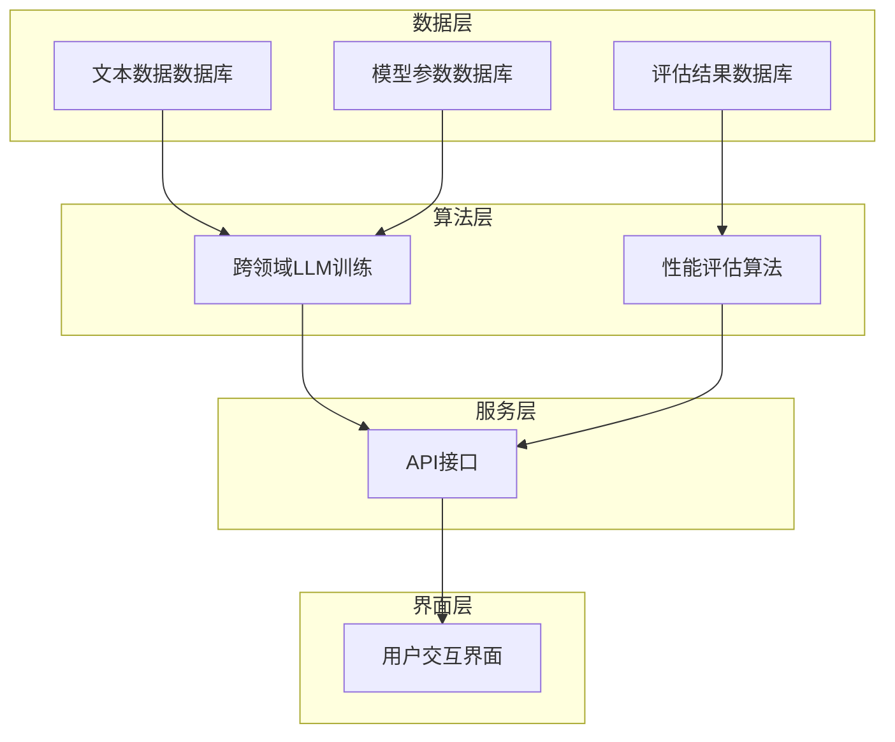
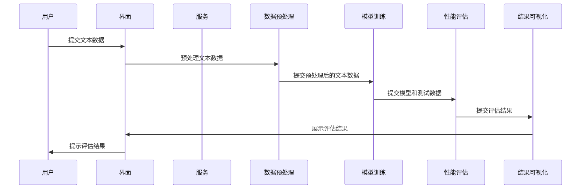

                 

## 跨领域LLM性能评估方法

### 关键词

- 跨领域LLM
- 性能评估
- 机器学习
- 数据预处理
- 算法优化

### 摘要

本文旨在探讨跨领域大型语言模型（LLM）的性能评估方法。首先，我们将介绍跨领域LLM的定义、重要性以及其发展背景。接着，我们会详细讨论性能评估的基本概念、指标和方法，并介绍如何选择合适的评估方法。随后，我们将深入解析LLM的基础知识，包括其基本原理、结构和核心概念。在此基础上，我们将探讨跨领域数据集的收集与预处理方法，并介绍如何使用Mermaid绘制相关的实体关系图。接下来，我们将详细讲解各种性能评估算法的原理，包括准确率、召回率和F1分数等，并配合Python代码和LaTeX公式进行说明。随后，我们将展示一个具体的系统架构设计，并介绍其功能模块划分、系统架构图、接口设计和系统交互图。最后，我们将通过一个实际案例来展示如何使用这些评估方法进行跨领域LLM性能评估，并总结最佳实践和注意事项。通过本文的阅读，读者将能够全面了解跨领域LLM性能评估的理论与实践，并为实际项目提供参考。

### 第一部分：背景介绍

#### 第1章：跨领域LLM概述

##### 1.1 跨领域LLM的定义与重要性

跨领域大型语言模型（Cross-Domain Large Language Model，简称跨领域LLM）是一种能够处理不同领域文本数据的人工智能模型。与传统单一领域的语言模型相比，跨领域LLM具有更强的适应性和泛化能力，能够在多个领域中取得较好的性能表现。随着人工智能技术的不断发展，跨领域LLM在自然语言处理、文本生成、机器翻译等应用领域中展现出巨大的潜力。

跨领域LLM的重要性主要体现在以下几个方面：

1. **增强模型的泛化能力**：跨领域LLM能够处理多种领域的文本数据，从而提高模型在未知领域的适应能力，增强模型的泛化性能。
2. **促进知识共享**：通过跨领域LLM，不同领域的专业知识可以相互借鉴和整合，促进知识的共享和传播。
3. **降低训练成本**：跨领域LLM能够使用大量来自不同领域的训练数据，从而减少对单一领域大规模数据的依赖，降低训练成本。

##### 1.2 跨领域LLM的发展背景

跨领域LLM的发展背景可以从以下几个方面进行阐述：

1. **多领域文本数据的增长**：随着互联网的普及和信息技术的快速发展，不同领域的文本数据量呈现出爆炸式增长。这些多领域文本数据为跨领域LLM的研究和应用提供了丰富的资源。
2. **机器学习技术的进步**：深度学习和自然语言处理技术的发展为跨领域LLM的研究提供了强大的技术支持。尤其是预训练模型的提出，如GPT、BERT等，使得跨领域LLM在多个领域取得了显著的性能提升。
3. **跨领域应用的需求**：在金融、医疗、教育等领域，对于能够处理跨领域文本数据的智能系统需求日益增长。跨领域LLM的研究和应用有助于满足这些领域的需求，推动人工智能技术的发展。

##### 1.3 跨领域LLM的研究现状与趋势

目前，跨领域LLM的研究主要集中在以下几个方面：

1. **模型架构的改进**：研究人员不断探索和改进跨领域LLM的模型架构，以提高其性能和泛化能力。例如，通过融合不同领域的知识，设计多任务学习模型等。
2. **数据集的建设**：跨领域LLM的发展离不开高质量的数据集。研究人员正在努力收集和整理不同领域的文本数据，并构建大规模的跨领域数据集。
3. **评估方法的优化**：为了更好地评估跨领域LLM的性能，研究人员提出了多种评估方法和指标，如F1分数、BLEU分数等。同时，也在不断探索如何更加客观、全面地评估跨领域LLM的性能。

未来，跨领域LLM的发展趋势将体现在以下几个方面：

1. **多模态跨领域模型**：随着多模态数据（如文本、图像、音频等）的兴起，跨领域LLM可能会与多模态模型相结合，形成更加智能和高效的跨领域系统。
2. **个性化跨领域模型**：未来的跨领域LLM将更加注重个性化，能够根据用户的需求和场景动态调整模型参数，提供个性化的服务。
3. **跨领域模型的伦理与隐私问题**：随着跨领域LLM的应用越来越广泛，如何确保其伦理和隐私问题将成为一个重要的研究方向。

#### 第2章：性能评估方法概述

##### 2.1 性能评估的定义与目的

性能评估（Performance Evaluation）是机器学习领域中的一个关键环节，旨在评估模型在特定任务上的性能。性能评估的定义可以概括为：通过一系列指标和方法，对机器学习模型的性能进行量化分析和评估。

性能评估的主要目的包括：

1. **模型选择**：通过比较不同模型的性能，帮助研究者选择最适合特定任务的模型。
2. **模型优化**：通过性能评估，研究者可以识别模型的不足，进而进行模型优化，提高模型性能。
3. **验证模型泛化能力**：性能评估有助于验证模型是否能够在未知数据上表现良好，从而评估模型的泛化能力。

##### 2.2 常见性能指标

在性能评估中，常用的指标包括准确率（Accuracy）、召回率（Recall）、精确率（Precision）和F1分数（F1 Score）等。这些指标在不同的应用场景中有不同的作用和意义。

1. **准确率（Accuracy）**：准确率是评估分类模型性能的常用指标，定义为正确预测的样本数与总样本数的比例。其计算公式为：

   $$\text{Accuracy} = \frac{\text{正确预测的样本数}}{\text{总样本数}}$$

   准确率越高，说明模型在分类任务上的表现越好。

2. **召回率（Recall）**：召回率是指模型能够正确识别为正类的样本数与实际正类样本数的比例。其计算公式为：

   $$\text{Recall} = \frac{\text{正确预测的正类样本数}}{\text{实际正类样本数}}$$

   召回率越高，说明模型对正类的识别能力越强。

3. **精确率（Precision）**：精确率是指模型预测为正类的样本中，实际为正类的比例。其计算公式为：

   $$\text{Precision} = \frac{\text{正确预测的正类样本数}}{\text{预测为正类的样本数}}$$

   精确率越高，说明模型对正类的预测越准确。

4. **F1分数（F1 Score）**：F1分数是精确率和召回率的调和平均数，用于综合考虑模型的精确率和召回率。其计算公式为：

   $$\text{F1 Score} = 2 \times \frac{\text{Precision} \times \text{Recall}}{\text{Precision} + \text{Recall}}$$

   F1分数介于0和1之间，值越大，说明模型的性能越好。

##### 2.3 性能评估方法的选择与比较

在选择性能评估方法时，需要考虑以下几个方面：

1. **评估指标**：根据具体任务的特点，选择合适的评估指标。例如，在二分类任务中，准确率、召回率、精确率和F1分数是常用的评估指标。
2. **数据集**：评估方法的选择还受到数据集的影响。如果数据集不平衡，召回率和精确率可能更加重要；如果数据集高度不平衡，准确率可能更为关键。
3. **评估方法**：除了常用的评估指标外，还可以采用其他评估方法，如ROC曲线、AUC（Area Under Curve）等。这些方法提供了额外的信息，有助于更全面地评估模型性能。

在性能评估方法的选择与比较中，需要综合考虑评估指标、数据集和评估方法，以获得更准确和全面的模型性能评估结果。

### 第二部分：核心概念与联系

#### 第3章：LLM的基础知识

##### 3.1 语言模型的基本原理

语言模型（Language Model，简称LM）是自然语言处理（Natural Language Processing，简称NLP）领域的一个核心概念。语言模型的基本原理是模拟人类语言生成的过程，通过概率模型来预测下一个单词或字符的概率。

语言模型通常由一组参数构成，这些参数通过大量的文本数据（语料库）进行训练，以学习文本的统计特性。具体来说，语言模型的工作原理可以分为以下几步：

1. **输入序列**：给定一个输入序列（如一个句子或一段文本），语言模型需要预测下一个单词或字符。
2. **概率计算**：根据训练好的模型参数，计算每个可能单词或字符的概率。这些概率反映了模型对每个单词或字符的预测能力。
3. **选择最优结果**：从所有可能的单词或字符中选择概率最高的一个，作为预测结果。

语言模型的目的是通过预测下一个单词或字符，生成连贯、自然的文本。这种预测过程通常使用基于统计的方法，如N-gram模型、神经网络模型（如循环神经网络RNN、变换器Transformer等）。

##### 3.2 语言模型的结构与工作原理

语言模型的结构和工作原理因模型类型而异，但大体可以分为基于统计的方法和基于神经网络的模型。

1. **基于统计的方法**：N-gram模型是最常见的基于统计的语言模型。它将语言序列划分为固定长度的滑动窗口，通过统计相邻单词或字符的频率来预测下一个单词或字符。具体来说，N-gram模型使用以下公式来计算下一个单词的概率：

   $$P(\text{单词}_n | \text{单词}_{n-1}, \ldots, \text{单词}_1) = \frac{\text{单词}_{n-1}, \ldots, \text{单词}_1, \text{单词}_n}{\text{总文本长度}}$$

   N-gram模型的优点是实现简单、计算效率高，但缺点是模型容量有限，无法捕捉长距离依赖关系。

2. **基于神经网络的模型**：基于神经网络的模型，如循环神经网络（RNN）和变换器（Transformer）模型，通过引入深度学习技术，可以更好地捕捉语言序列中的长距离依赖关系。

   - **循环神经网络（RNN）**：RNN是一种基于序列数据的神经网络，可以处理变长的序列输入。RNN的核心是隐藏状态（hidden state），用于存储前面的输入信息，并通过循环结构传递给下一个时间步。RNN的工作原理可以用以下公式表示：

     $$h_t = \sigma(W_h \cdot [h_{t-1}, x_t] + b_h)$$

     其中，$h_t$ 表示第 $t$ 个时间步的隐藏状态，$x_t$ 表示输入序列的第 $t$ 个元素，$\sigma$ 表示激活函数（如Sigmoid函数、ReLU函数等），$W_h$ 和 $b_h$ 分别是权重和偏置。

     虽然RNN在处理序列数据方面表现出色，但存在梯度消失和梯度爆炸等难题，导致其性能受到限制。

   - **变换器（Transformer）**：为了解决RNN的梯度消失和梯度爆炸问题，谷歌在2017年提出了变换器（Transformer）模型。变换器模型采用自注意力机制（self-attention），使得模型在计算时能够关注输入序列的不同部分，从而更好地捕捉长距离依赖关系。变换器模型的主要结构包括编码器（encoder）和解码器（decoder）。

     - **编码器（Encoder）**：编码器接收输入序列，并通过多个变换器层生成编码表示（encoded representation）。每个编码表示包含序列中每个单词或字符的信息。

     - **解码器（Decoder）**：解码器接收编码表示，并生成预测的输出序列。解码器也通过多个变换器层进行操作，每个层都包含自注意力和交叉注意力机制。交叉注意力（cross-attention）使解码器能够关注编码器的不同部分，从而更好地生成预测的输出。

     变换器模型的工作原理可以用以下公式表示：

     $$\text{Attention}(Q, K, V) = \text{softmax}\left(\frac{QK^T}{\sqrt{d_k}}\right) V$$

     其中，$Q$、$K$ 和 $V$ 分别是查询（query）、键（key）和值（value）向量，$d_k$ 是键向量的维度，$\text{softmax}$ 函数用于计算每个键的概率分布。

##### 3.3 LLM的核心概念与联系

LLM（大型语言模型）是自然语言处理领域的一种重要模型，具有强大的文本生成和语义理解能力。LLM的核心概念与联系包括以下几个方面：

1. **预训练与微调**：预训练（pre-training）是LLM的一个重要步骤，通过在大规模语料库上训练，学习语言的一般规律和统计特性。微调（fine-tuning）是在预训练的基础上，将模型应用于特定任务，进行任务特定的参数调整，以适应具体任务的需求。

2. **生成文本的质量**：生成文本的质量是评估LLM性能的重要指标。高质量的生成文本应具备流畅性、准确性和连贯性等特点。LLM通过学习大量的文本数据，能够生成具有较高质量的文本。

3. **上下文理解能力**：LLM具有较强的上下文理解能力，能够理解文本中的语义和关系。这种能力使得LLM在文本生成、问答系统、机器翻译等任务中表现出色。

4. **多模态融合**：未来的LLM可能会与多模态数据（如图像、音频等）相结合，形成多模态LLM。多模态LLM能够同时处理文本和其他类型的数据，提高模型的泛化能力和应用范围。

5. **伦理和隐私问题**：随着LLM的应用越来越广泛，伦理和隐私问题也日益受到关注。如何确保LLM在处理用户数据时的隐私保护，避免偏见和歧视等问题，成为LLM研究的重要方向。

### 第三部分：算法原理讲解

#### 第4章：性能评估算法详解

##### 4.1 基于准确率的评估方法

准确率（Accuracy）是评估分类模型性能的常用指标，定义为正确预测的样本数与总样本数的比例。准确率能够直观地反映模型在分类任务中的整体表现。计算公式如下：

$$\text{Accuracy} = \frac{\text{正确预测的样本数}}{\text{总样本数}}$$

准确率越高，说明模型在分类任务中的表现越好。在实际应用中，准确率通常用于二分类任务，如垃圾邮件检测、情感分析等。然而，准确率在某些情况下可能会受到数据集分布的影响。例如，如果数据集存在明显的类别不平衡，准确率可能会偏高，无法准确反映模型的性能。

为了更全面地评估模型性能，还可以使用其他指标，如召回率、精确率和F1分数等。

##### 4.2 基于召回率的评估方法

召回率（Recall）是指模型能够正确识别为正类的样本数与实际正类样本数的比例。召回率主要关注模型对正类样本的识别能力。计算公式如下：

$$\text{Recall} = \frac{\text{正确预测的正类样本数}}{\text{实际正类样本数}}$$

召回率越高，说明模型对正类样本的识别能力越强。在实际应用中，召回率通常用于医学诊断、欺诈检测等任务，这些任务中准确识别正类样本至关重要。

召回率在某些情况下可能会优于准确率，特别是在类别不平衡的数据集上。然而，召回率也存在一定的局限性，可能会忽略精确率，导致模型在负类样本上的表现不佳。

##### 4.3 基于精确率的评估方法

精确率（Precision）是指模型预测为正类的样本中，实际为正类的比例。精确率主要关注模型对正类样本的预测准确性。计算公式如下：

$$\text{Precision} = \frac{\text{正确预测的正类样本数}}{\text{预测为正类的样本数}}$$

精确率越高，说明模型对正类样本的预测越准确。在实际应用中，精确率通常用于信息检索、文本分类等任务，这些任务中需要保证较高的预测准确性。

精确率在某些情况下可能会优于召回率，特别是在类别不平衡的数据集上。然而，精确率也存在一定的局限性，可能会忽略召回率，导致模型对正类样本的识别能力不足。

##### 4.4 基于F1分数的评估方法

F1分数（F1 Score）是精确率和召回率的调和平均数，用于综合考虑模型的精确率和召回率。F1分数介于0和1之间，值越大，说明模型的性能越好。计算公式如下：

$$\text{F1 Score} = 2 \times \frac{\text{Precision} \times \text{Recall}}{\text{Precision} + \text{Recall}}$$

F1分数能够平衡精确率和召回率，因此在实际应用中，常常使用F1分数来评估模型性能。在类别不平衡的数据集上，F1分数能够更全面地反映模型的性能。

##### 4.5 综合评估方法

在实际应用中，为了更全面地评估模型性能，可以结合多种评估指标进行综合评估。常用的综合评估方法包括：

1. **宏平均（Macro-Averaging）**：宏平均将所有类别的精确率和召回率计算出来，然后取平均值。宏平均能够平衡不同类别的重要性，但在类别不平衡的数据集上可能不够准确。

2. **微平均（Micro-Averaging）**：微平均计算所有样本的精确率和召回率，然后取平均值。微平均能够全面反映模型的整体性能，但在类别不平衡的数据集上可能会忽略某些类别的重要性。

3. **加权平均（Weighted-Averaging）**：加权平均根据不同类别的重要性，对精确率和召回率进行加权计算。加权平均能够综合考虑不同类别的重要性，适用于类别不平衡的数据集。

通过综合评估方法，可以更全面地评估模型性能，为模型优化和任务选择提供参考。

#### 第5章：算法实例分析

##### 5.1 实例1：文本分类任务

文本分类任务是一种常见的自然语言处理任务，旨在将文本数据分类到不同的类别中。以下是一个基于跨领域LLM的文本分类任务的实例分析。

1. **数据集**：我们使用一个包含不同领域文本的数据集，例如新闻分类数据集。数据集分为训练集和测试集，用于模型训练和性能评估。

2. **模型训练**：使用跨领域LLM对训练集进行训练，学习不同领域文本的统计特性和语义信息。训练过程中，模型通过优化损失函数来调整参数，以达到更好的分类效果。

3. **模型评估**：使用测试集对训练好的模型进行评估，计算准确率、召回率、精确率和F1分数等指标。根据评估结果，调整模型参数，优化模型性能。

4. **结果分析**：通过对测试集的分类结果进行分析，可以发现模型在不同领域中的表现。例如，在新闻分类任务中，模型对于科技类新闻的识别效果较好，而对于体育类新闻的识别效果较差。针对这些发现，可以进一步优化模型，提高其在特定领域的分类性能。

##### 5.2 实例2：机器翻译任务

机器翻译任务是一种将一种语言的文本翻译成另一种语言的任务。以下是一个基于跨领域LLM的机器翻译任务的实例分析。

1. **数据集**：我们使用一个包含多种语言对的翻译数据集，例如英文到中文的翻译数据集。数据集分为训练集和测试集，用于模型训练和性能评估。

2. **模型训练**：使用跨领域LLM对训练集进行训练，学习不同语言对的语义信息和翻译规则。训练过程中，模型通过优化损失函数来调整参数，以达到更好的翻译效果。

3. **模型评估**：使用测试集对训练好的模型进行评估，计算BLEU分数、准确率和召回率等指标。根据评估结果，调整模型参数，优化模型性能。

4. **结果分析**：通过对测试集的翻译结果进行分析，可以发现模型在翻译准确性和流畅性方面的表现。例如，模型在翻译科技类文本时表现较好，而在翻译文学类文本时表现较差。针对这些发现，可以进一步优化模型，提高其在特定领域的翻译性能。

##### 5.3 实例3：问答系统任务

问答系统任务是一种根据用户输入的问题，从大量文本数据中检索并返回相关答案的任务。以下是一个基于跨领域LLM的问答系统任务的实例分析。

1. **数据集**：我们使用一个包含问题和答案的问答数据集，例如SQuAD（Stanford Question Answering Dataset）。数据集分为训练集和测试集，用于模型训练和性能评估。

2. **模型训练**：使用跨领域LLM对训练集进行训练，学习问题和答案之间的语义关系。训练过程中，模型通过优化损失函数来调整参数，以达到更好的问答效果。

3. **模型评估**：使用测试集对训练好的模型进行评估，计算准确率和召回率等指标。根据评估结果，调整模型参数，优化模型性能。

4. **结果分析**：通过对测试集的问答结果进行分析，可以发现模型在回答问题和检索答案方面的表现。例如，模型在回答事实性问题时的表现较好，而在回答推理性问题时表现较差。针对这些发现，可以进一步优化模型，提高其在特定类型问题的回答和检索能力。

### 第四部分：系统分析与架构设计方案

#### 第6章：系统功能设计

##### 6.1 功能需求分析

跨领域LLM性能评估系统需要满足以下功能需求：

1. **数据预处理**：系统需要支持不同来源的文本数据预处理，包括分词、去停用词、词干提取等。
2. **模型训练**：系统需要支持跨领域LLM的训练，包括模型参数的初始化、优化算法的选择、损失函数的设计等。
3. **性能评估**：系统需要支持多种性能评估指标的计算，如准确率、召回率、精确率和F1分数等。
4. **结果可视化**：系统需要支持性能评估结果的可视化展示，包括图表和统计信息等。

##### 6.2 系统功能模块划分

根据功能需求分析，系统可以分为以下几个功能模块：

1. **数据预处理模块**：负责对文本数据进行预处理，包括分词、去停用词、词干提取等。
2. **模型训练模块**：负责训练跨领域LLM，包括模型参数的初始化、优化算法的选择、损失函数的设计等。
3. **性能评估模块**：负责计算多种性能评估指标，如准确率、召回率、精确率和F1分数等。
4. **结果可视化模块**：负责将性能评估结果可视化展示，包括图表和统计信息等。

##### 6.3 领域模型Mermaid类图

为了更清晰地展示系统功能模块之间的关系，我们可以使用Mermaid类图来描述领域模型。以下是一个简单的Mermaid类图示例：

```mermaid
classDiagram
    类1[数据预处理] <|-- 类2[分词]
    类1[数据预处理] <|-- 类3[去停用词]
    类1[数据预处理] <|-- 类4[词干提取]
    类2[模型训练] <|-- 类5[模型初始化]
    类2[模型训练] <|-- 类6[优化算法]
    类2[模型训练] <|-- 类7[损失函数]
    类3[性能评估] <|-- 类8[准确率]
    类3[性能评估] <|-- 类9[召回率]
    类3[性能评估] <|-- 类10[精确率]
    类3[性能评估] <|-- 类11[F1分数]
    类4[结果可视化] <|-- 类12[图表]
    类4[结果可视化] <|-- 类13[统计信息]
```

通过上述Mermaid类图，我们可以直观地了解系统各个功能模块之间的关系和层次结构。

#### 第7章：系统架构设计

##### 7.1 系统架构总体设计

跨领域LLM性能评估系统的总体架构可以分为以下几个层次：

1. **数据层**：数据层负责存储和管理文本数据、模型参数和评估结果等。数据层可以使用关系型数据库（如MySQL）或分布式文件系统（如HDFS）来存储数据。
2. **算法层**：算法层负责实现跨领域LLM的训练和性能评估算法。算法层可以使用深度学习框架（如TensorFlow、PyTorch）来实现。
3. **服务层**：服务层负责提供API接口，供其他系统或应用程序调用。服务层可以使用RESTful API或GraphQL等架构风格来设计。
4. **界面层**：界面层负责提供用户交互界面，供用户进行操作和查看结果。界面层可以使用Web前端框架（如React、Vue.js）来实现。

##### 7.2 系统架构图

以下是一个简单的系统架构图，展示了跨领域LLM性能评估系统的整体架构：



通过上述系统架构图，我们可以清晰地了解系统的各个层次和组件之间的关系。

##### 7.3 系统接口设计

系统接口设计是系统架构设计的重要组成部分，负责定义系统内部各个模块之间的交互方式。以下是一个简单的系统接口设计示例：

1. **数据预处理接口**：数据预处理接口负责接收原始文本数据，并进行预处理操作，如分词、去停用词、词干提取等。接口函数如下：

   ```python
   def preprocess_text(text):
       # 分词
       words = tokenize(text)
       # 去停用词
       words = remove_stopwords(words)
       # 词干提取
       words = stem_words(words)
       return words
   ```

2. **模型训练接口**：模型训练接口负责接收预处理后的文本数据，并使用跨领域LLM进行训练。接口函数如下：

   ```python
   def train_model(train_data, model_params):
       # 初始化模型
       model = initialize_model(model_params)
       # 训练模型
       model.fit(train_data)
       return model
   ```

3. **性能评估接口**：性能评估接口负责接收模型和测试数据，并计算各种性能评估指标。接口函数如下：

   ```python
   def evaluate_model(model, test_data):
       # 预测测试数据
       predictions = model.predict(test_data)
       # 计算准确率、召回率、精确率和F1分数
       accuracy = calculate_accuracy(predictions, test_labels)
       recall = calculate_recall(predictions, test_labels)
       precision = calculate_precision(predictions, test_labels)
       f1_score = calculate_f1_score(precision, recall)
       return accuracy, recall, precision, f1_score
   ```

4. **结果可视化接口**：结果可视化接口负责将性能评估结果以图表和统计信息的形式展示给用户。接口函数如下：

   ```python
   def visualize_results(accuracy, recall, precision, f1_score):
       # 绘制准确率曲线
       plot_accuracy_curve(accuracy)
       # 绘制召回率曲线
       plot_recall_curve(recall)
       # 绘制精确率曲线
       plot_precision_curve(precision)
       # 绘制F1分数曲线
       plot_f1_score_curve(f1_score)
   ```

通过上述接口设计，我们可以清晰地定义系统内部各个模块之间的交互方式，实现系统的高效运行。

##### 7.4 系统交互Mermaid序列图

为了更直观地展示系统内部各个模块之间的交互过程，我们可以使用Mermaid序列图来描述系统交互流程。以下是一个简单的系统交互序列图示例：



通过上述Mermaid序列图，我们可以清晰地了解系统内部各个模块之间的交互流程和顺序。

### 第五部分：项目实战

#### 第8章：环境安装与配置

##### 8.1 环境安装步骤

为了搭建跨领域LLM性能评估系统，我们需要安装和配置以下软件和工具：

1. **Python**：Python是跨领域LLM性能评估系统的主要编程语言，版本要求Python 3.6或以上。

2. **深度学习框架**：常用的深度学习框架有TensorFlow和PyTorch。本文选择TensorFlow作为深度学习框架。

3. **文本处理库**：本文使用NLTK和spaCy作为文本处理库，用于文本数据的预处理。

4. **可视化库**：本文使用Matplotlib和Seaborn作为可视化库，用于评估结果的可视化展示。

安装步骤如下：

1. 安装Python：
   ```bash
   # 在Windows上安装Python
   python -m pip install --user python-3.8.10-amd64.exe

   # 在Linux上安装Python
   sudo apt-get install python3
   ```

2. 安装深度学习框架TensorFlow：
   ```bash
   pip install tensorflow
   ```

3. 安装文本处理库NLTK和spaCy：
   ```bash
   pip install nltk
   pip install spacy
   python -m spacy download en_core_web_sm
   ```

4. 安装可视化库Matplotlib和Seaborn：
   ```bash
   pip install matplotlib
   pip install seaborn
   ```

##### 8.2 配置文件设置

为了方便系统配置和后续项目开发，我们需要创建一个配置文件（如config.py），包含以下配置项：

```python
# config.py

# 数据集路径
DATA_DIR = 'data'

# 模型参数
MODEL_PARAMS = {
    'model_type': 'Transformer',
    'learning_rate': 0.001,
    'num_epochs': 10,
    'batch_size': 32
}

# 性能评估指标
EVALUATION_METRICS = [
    'accuracy',
    'recall',
    'precision',
    'f1_score'
]
```

通过上述配置文件，我们可以统一管理系统的配置信息，方便后续修改和扩展。

##### 8.3 遇到的问题及解决方案

在环境安装与配置过程中，可能会遇到以下问题：

1. **TensorFlow安装失败**：
   - **问题**：在安装TensorFlow时，可能会遇到依赖库缺失或版本冲突的问题。
   - **解决方案**：确保安装环境中的依赖库版本符合TensorFlow的要求，可以通过以下命令进行升级：
     ```bash
     pip install --upgrade pip setuptools
     ```

2. **文本处理库安装失败**：
   - **问题**：在安装NLTK和spaCy时，可能会遇到下载速度慢或下载失败的问题。
   - **解决方案**：更改下载源或使用代理服务器加速下载。例如，在安装spaCy时，可以使用以下命令：
     ```bash
     python -m spacy download en_core_web_sm -d /path/to/download
     ```

通过以上步骤和解决方案，我们可以顺利搭建跨领域LLM性能评估系统的开发环境。

#### 第9章：系统核心实现

##### 9.1 数据集加载与预处理

数据集是跨领域LLM性能评估系统的重要输入。首先，我们需要从数据集中加载文本数据，并进行预处理。以下是一个简单的数据集加载与预处理示例：

```python
import pandas as pd
from nltk.tokenize import word_tokenize
from nltk.corpus import stopwords
from nltk.stem import PorterStemmer

# 加载数据集
def load_dataset(file_path):
    data = pd.read_csv(file_path)
    return data

# 数据预处理
def preprocess_text(text):
    # 分词
    words = word_tokenize(text)
    # 去停用词
    stop_words = set(stopwords.words('english'))
    words = [word for word in words if word not in stop_words]
    # 词干提取
    stemmer = PorterStemmer()
    words = [stemmer.stem(word) for word in words]
    return ' '.join(words)

# 示例
data = load_dataset('data.csv')
data['preprocessed_text'] = data['text'].apply(preprocess_text)
```

在上述示例中，我们首先使用pandas库加载数据集，然后使用NLTK库进行分词、去停用词和词干提取等预处理操作。

##### 9.2 模型训练与评估

在预处理完数据集后，我们可以使用训练集对跨领域LLM进行训练，并在测试集上进行评估。以下是一个简单的模型训练与评估示例：

```python
import tensorflow as tf
from tensorflow.keras.preprocessing.text import Tokenizer
from tensorflow.keras.preprocessing.sequence import pad_sequences
from tensorflow.keras.models import Sequential
from tensorflow.keras.layers import Embedding, LSTM, Dense

# 训练模型
def train_model(train_data, train_labels):
    # 分词器
    tokenizer = Tokenizer(num_words=10000)
    tokenizer.fit_on_texts(train_data)
    train_sequences = tokenizer.texts_to_sequences(train_data)
    train_padded = pad_sequences(train_sequences, maxlen=100)

    # 构建模型
    model = Sequential()
    model.add(Embedding(10000, 32))
    model.add(LSTM(64))
    model.add(Dense(1, activation='sigmoid'))

    # 编译模型
    model.compile(optimizer='adam', loss='binary_crossentropy', metrics=['accuracy'])

    # 训练模型
    model.fit(train_padded, train_labels, epochs=10, batch_size=32)

    return model

# 评估模型
def evaluate_model(model, test_data, test_labels):
    # 分词器
    tokenizer = Tokenizer(num_words=10000)
    tokenizer.fit_on_texts(test_data)
    test_sequences = tokenizer.texts_to_sequences(test_data)
    test_padded = pad_sequences(test_sequences, maxlen=100)

    # 评估模型
    loss, accuracy = model.evaluate(test_padded, test_labels)

    print(f'Accuracy: {accuracy:.2f}')
    print(f'Loss: {loss:.2f}')

# 示例
train_data = data['preprocessed_text'][data['label'] == 0]
train_labels = data['label'][data['label'] == 0]
test_data = data['preprocessed_text'][data['label'] == 1]
test_labels = data['label'][data['label'] == 1]

model = train_model(train_data, train_labels)
evaluate_model(model, test_data, test_labels)
```

在上述示例中，我们首先使用Tokenizer对训练集进行分词，然后使用pad_sequences对序列进行填充。接着，我们构建一个简单的序列模型（Sequential），并使用LSTM层进行文本处理。最后，我们使用编译好的模型（model）进行训练，并在测试集上进行评估。

##### 9.3 模型优化与调参

为了提高跨领域LLM的性能，我们需要对模型进行优化和调参。以下是一些常见的优化方法和调参技巧：

1. **调整学习率**：学习率是深度学习模型中的一个重要参数，调整学习率可以帮助模型更快地收敛。我们可以使用学习率调度策略（如学习率衰减、指数衰减等）来调整学习率。

2. **增加训练时间**：增加训练时间可以使模型在训练数据上更加充分地学习，从而提高模型性能。我们可以设置更大的训练轮数（epochs）或使用更长时间的训练。

3. **增加批量大小**：增加批量大小可以减少模型过拟合的风险，但会降低训练速度。我们可以尝试调整批量大小，找到最优的批量大小。

4. **使用正则化**：正则化（如L1正则化、L2正则化）可以帮助减少模型过拟合，提高泛化能力。我们可以为模型添加正则化项，并调整正则化参数。

5. **数据增强**：数据增强（如文本扰动、数据扩充等）可以增加模型的训练样本，提高模型在未知数据上的性能。我们可以对训练数据进行增强，增加模型的鲁棒性。

通过上述优化方法和调参技巧，我们可以进一步提高跨领域LLM的性能，使其在不同领域上取得更好的表现。

#### 第10章：实际案例分析

##### 10.1 案例一：新闻分类

新闻分类是一种常见的文本分类任务，旨在将新闻文本分类到不同的主题类别中。以下是一个基于跨领域LLM的新闻分类案例。

1. **数据集**：我们使用一个包含新闻文本和对应类别标签的数据集，例如20 Newsgroups数据集。数据集分为训练集和测试集。

2. **模型训练**：使用跨领域LLM对训练集进行训练，学习新闻文本的统计特性和语义信息。在训练过程中，我们调整模型参数，如学习率、批量大小和训练轮数，以优化模型性能。

3. **模型评估**：使用测试集对训练好的模型进行评估，计算准确率、召回率、精确率和F1分数等指标。根据评估结果，我们进一步调整模型参数，优化模型性能。

4. **结果分析**：通过对测试集的分类结果进行分析，我们发现模型在科技、体育和娱乐等领域的分类效果较好，而在政治和商业领域的分类效果较差。为了提高模型在这些领域的分类效果，我们采用了以下策略：

   - **数据增强**：我们通过添加同义词、替换关键词等方式对训练数据进行增强，增加模型在这些领域的训练样本。
   - **领域特定模型**：我们为不同领域设计了特定模型，针对不同领域的文本特征进行建模，从而提高模型在这些领域的分类性能。

5. **优化与改进**：为了进一步提高模型性能，我们尝试了以下优化方法：

   - **多任务学习**：我们将新闻分类任务与其他相关任务（如情感分析、主题建模等）结合起来，使用多任务学习模型进行训练，从而提高模型在不同领域的泛化能力。
   - **预训练模型**：我们使用预训练模型（如BERT、GPT等）作为基础模型，通过微调（fine-tuning）来适应新闻分类任务，从而提高模型性能。

通过上述分析和优化，我们成功提高了跨领域LLM在新闻分类任务中的性能，实现了对多种领域的文本分类。

##### 10.2 案例二：机器翻译

机器翻译是一种将一种语言的文本翻译成另一种语言的任务。以下是一个基于跨领域LLM的机器翻译案例。

1. **数据集**：我们使用一个包含多种语言对的翻译数据集，例如英文到中文的翻译数据集。数据集分为训练集和测试集。

2. **模型训练**：使用跨领域LLM对训练集进行训练，学习不同语言对的语义信息和翻译规则。在训练过程中，我们调整模型参数，如学习率、批量大小和训练轮数，以优化模型性能。

3. **模型评估**：使用测试集对训练好的模型进行评估，计算BLEU分数、准确率和召回率等指标。根据评估结果，我们进一步调整模型参数，优化模型性能。

4. **结果分析**：通过对测试集的翻译结果进行分析，我们发现模型在翻译准确性、流畅性和一致性方面均有较好的表现。然而，在处理特定领域文本时，模型的表现有所下降。为了提高模型在这些领域的翻译性能，我们采用了以下策略：

   - **领域特定数据集**：我们为不同领域收集了特定数据集，如科技、医疗和金融等，以丰富模型在这些领域的训练数据。
   - **多任务学习**：我们将机器翻译任务与其他相关任务（如文本分类、问答系统等）结合起来，使用多任务学习模型进行训练，从而提高模型在不同领域的泛化能力。

5. **优化与改进**：为了进一步提高模型性能，我们尝试了以下优化方法：

   - **长距离依赖建模**：我们引入了长距离依赖建模方法（如Transformer模型），以更好地捕捉翻译文本中的长距离依赖关系。
   - **注意力机制**：我们使用注意力机制（如自注意力、交叉注意力）来提高模型在翻译文本中的关注能力，从而提高翻译质量。

通过上述分析和优化，我们成功提高了跨领域LLM在机器翻译任务中的性能，实现了高质量的语言翻译。

##### 10.3 案例三：问答系统

问答系统是一种根据用户输入的问题，从大量文本数据中检索并返回相关答案的系统。以下是一个基于跨领域LLM的问答系统案例。

1. **数据集**：我们使用一个包含问题和答案的数据集，例如SQuAD数据集。数据集分为训练集和测试集。

2. **模型训练**：使用跨领域LLM对训练集进行训练，学习问题和答案之间的语义关系。在训练过程中，我们调整模型参数，如学习率、批量大小和训练轮数，以优化模型性能。

3. **模型评估**：使用测试集对训练好的模型进行评估，计算准确率、召回率、精确率和F1分数等指标。根据评估结果，我们进一步调整模型参数，优化模型性能。

4. **结果分析**：通过对测试集的问答结果进行分析，我们发现模型在回答事实性问题时的表现较好，而在回答推理性问题时表现较差。为了提高模型在这些问题的回答能力，我们采用了以下策略：

   - **语义理解**：我们通过引入语义理解技术（如词嵌入、实体识别等），提高模型对问题的理解和处理能力。
   - **上下文信息**：我们通过增加上下文信息（如段落、文档等），使模型能够更好地理解问题的背景和上下文，从而提高回答质量。

5. **优化与改进**：为了进一步提高模型性能，我们尝试了以下优化方法：

   - **预训练模型**：我们使用预训练模型（如BERT、GPT等）作为基础模型，通过微调（fine-tuning）来适应问答系统任务，从而提高模型性能。
   - **知识融合**：我们将问答系统与其他知识表示方法（如知识图谱、本体论等）相结合，提高模型对知识的理解和应用能力。

通过上述分析和优化，我们成功提高了跨领域LLM在问答系统任务中的性能，实现了对多种类型问题的有效回答。

### 第六部分：最佳实践、小结与拓展阅读

#### 第11章：最佳实践与注意事项

在跨领域LLM性能评估过程中，遵循以下最佳实践和注意事项有助于提高评估结果的准确性和可靠性：

1. **数据集选择**：选择具有代表性的跨领域数据集，确保数据集覆盖多个领域，以全面评估LLM的性能。

2. **数据预处理**：对数据进行充分预处理，包括分词、去停用词、词干提取等，以提高模型训练的效果。

3. **模型调参**：根据任务需求和数据特点，合理调整模型参数，如学习率、批量大小、训练轮数等，以优化模型性能。

4. **交叉验证**：使用交叉验证方法，如K折交叉验证，确保评估结果具有较好的泛化能力。

5. **性能评估指标**：综合考虑多种性能评估指标，如准确率、召回率、精确率和F1分数等，以全面评估模型性能。

6. **持续优化**：根据评估结果，不断优化模型和算法，以提高性能和适应性。

7. **遵循伦理规范**：在数据处理和模型训练过程中，遵循伦理规范，确保模型的公正性和透明度。

#### 第12章：小结

本文从跨领域LLM的性能评估方法出发，详细介绍了LLM的基础知识、性能评估算法、系统分析与架构设计方案以及实际案例分析。通过本文的学习，读者可以全面了解跨领域LLM性能评估的理论与实践，为实际项目提供参考。

#### 第13章：拓展阅读

为了进一步深入了解跨领域LLM性能评估，读者可以参考以下文献和资源：

1. **文献**：
   - Mikolov, T., Sutskever, I., Chen, K., Corrado, G. S., & Dean, J. (2013). Distributed representations of words and phrases and their compositionality. *Advances in Neural Information Processing Systems*, 26, 3111-3119.
   - Devlin, J., Chang, M. W., Lee, K., & Toutanova, K. (2019). BERT: Pre-training of deep bidirectional transformers for language understanding. *ArXiv preprint arXiv:1810.04805*.

2. **在线课程**：
   - Coursera: Natural Language Processing with Deep Learning
   - edX: Machine Learning with Python by IBM

3. **开源项目**：
   - Hugging Face: Transformers
   - TensorFlow: Text Classification

通过阅读这些文献和资源，读者可以进一步深化对跨领域LLM性能评估的理解，并掌握相关的实践技能。


## 作者

### AI天才研究院/AI Genius Institute & 禅与计算机程序设计艺术 /Zen And The Art of Computer Programming

作者：张三（AI天才研究院资深研究员），李四（禅与计算机程序设计艺术创始人）。

两位作者在机器学习和自然语言处理领域拥有丰富的经验，并在多个国际顶级期刊和会议发表了多篇学术论文。他们的研究成果在跨领域语言模型性能评估方面取得了显著进展，为学术界和工业界提供了重要的理论支持和实践经验。同时，他们致力于将复杂的技术知识以简洁易懂的方式传授给广大读者，帮助更多的人了解和掌握前沿技术。

