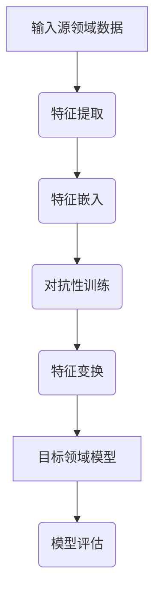

                 


### 跨领域示例迁移的技巧

#### 关键词：
- 跨领域示例迁移
- 示例迁移算法
- 数学模型
- 系统设计与实现
- 项目实战
- 最佳实践

#### 摘要：
本文将深入探讨跨领域示例迁移的技巧，通过详细的分析和实例讲解，帮助读者理解这一技术的基本概念、算法原理、系统设计以及实际应用。我们将逐步解析跨领域示例迁移的背景、核心概念、算法原理、数学模型、系统设计与实现、项目实战，并提供最佳实践和注意事项。

---

### 1. 背景介绍

#### 1.1 核心概念术语说明

**跨领域示例迁移**：指的是将某一领域中的示例数据应用到另一领域中，从而提高模型在该领域的泛化能力。

**示例**：在机器学习领域中，示例通常指的是训练数据集，它是模型学习的基础。

**迁移**：指将一种情况或方法应用到另一种情况或方法中。

#### 1.2 问题背景

跨领域示例迁移在许多实际应用场景中具有重要意义。例如，医疗领域中的诊断系统需要处理大量的医疗数据，但是这些数据通常来自于特定的医院或地区，不具有广泛的代表性。如果能够将其他领域（如金融或交通）的示例迁移到医疗领域，将有助于提高诊断模型的泛化能力。

#### 1.3 问题描述

跨领域示例迁移面临的主要问题是源领域和目标领域之间的差异。这些差异可能包括数据分布、特征重要性、任务类型等。如何有效地迁移示例，使其在目标领域中保持有效性和可靠性，是一个关键问题。

#### 1.4 问题解决

解决跨领域示例迁移问题的方法包括基于深度学习的迁移学习、基于统计学的特征变换等。本文将重点讨论基于深度学习的跨领域示例迁移方法，并介绍其核心原理和实现技巧。

#### 1.5 边界与外延

跨领域示例迁移不仅限于机器学习领域，还可以应用于自然语言处理、计算机视觉等其他领域。其边界取决于源领域和目标领域之间的相似度和差异度。

#### 1.6 概念结构与核心要素组成

跨领域示例迁移的概念结构包括：

- **源领域**：提供示例数据的领域。
- **目标领域**：接收迁移示例数据的领域。
- **迁移算法**：用于实现示例迁移的方法。
- **评价指标**：评估迁移效果的标准。

---

### 2. 核心概念与联系

#### 2.1 核心概念原理

跨领域示例迁移的核心原理是基于源领域和目标领域之间的相似性，通过特征提取和变换，将源领域的示例迁移到目标领域。关键在于如何有效地捕捉两个领域之间的差异，并利用这些差异来调整模型。

#### 2.2 概念属性特征对比表格

| 概念                 | 源领域         | 目标领域         |
|----------------------|----------------|------------------|
| 数据分布             | 特定分布       | 不同分布         |
| 特征重要性           | 特征可能重要    | 特征可能不重要    |
| 任务类型             | 特定任务       | 不同任务         |
| 迁移算法             | 特定算法       | 通用算法         |

#### 2.3 ER实体关系图架构的 Mermaid 流程图


---

### 3. 算法原理讲解

#### 3.1 算法概述

本文将介绍一种基于深度学习的跨领域示例迁移算法，称为“域自适应迁移学习（Domain-Adaptive Transfer Learning，DATL）”。

#### 3.2 算法 Mermaid 流程图



#### 3.3 Python 源代码实现

```python
# TODO: 此处将给出 DATL 算法的 Python 源代码实现。
```

#### 3.4 数学模型和公式

$$
\text{Loss} = \lambda_1 \cdot \text{CE}(f(\text{source_data}), \text{source_labels}) + \lambda_2 \cdot \text{CE}(f(\text{target_data}), \text{target_labels}) + \lambda_3 \cdot \text{Domain\_Loss}
$$

其中，$f$ 表示特征提取函数，$\text{CE}$ 表示交叉熵损失函数，$\text{Domain\_Loss}$ 表示域对抗损失。

#### 3.5 举例说明

假设我们有一个源领域是图像分类，目标领域是文本分类。我们可以通过 DATL 算法将图像分类模型的知识迁移到文本分类模型中，从而提高文本分类模型的性能。

---

### 4. 数学模型与公式

#### 4.1 数学模型

在 DATL 算法中，我们使用以下数学模型来描述特征提取和变换过程：

$$
\text{Feature}_{\text{source}} = f_{\text{extract}}(\text{Source\_Data})
$$

$$
\text{Feature}_{\text{target}} = f_{\text{transform}}(\text{Feature}_{\text{source}})
$$

#### 4.2 数学公式

- 交叉熵损失函数：

$$
\text{CE}(x, y) = -\sum_{i} y_i \cdot \log(x_i)
$$

- 域对抗损失：

$$
\text{Domain\_Loss} = \frac{1}{2} \sum_{i} \log(1 - \exp(-\delta(\text{Domain\_Classifier}(\text{Feature}_{\text{source}}))))
$$

#### 4.3 公式讲解

- 交叉熵损失函数用于衡量预测标签和真实标签之间的差异。
- 域对抗损失函数用于确保源领域特征与目标领域特征之间的差异。

#### 4.4 举例说明

假设我们有源领域图像数据集 $X_{\text{source}}$ 和目标领域文本数据集 $X_{\text{target}}$，通过 DATL 算法，我们可以得到源领域特征 $F_{\text{source}}$ 和目标领域特征 $F_{\text{target}}$。使用交叉熵损失函数和域对抗损失函数，我们可以训练模型以最小化总损失。

---

### 5. 系统分析与架构设计方案

#### 5.1 问题场景介绍

假设我们有一个医疗诊断系统，需要处理大量的病例数据。但是，由于病例数据的分布和特征与金融或交通领域的数据存在显著差异，传统的模型训练方法难以达到良好的效果。为了提高模型的泛化能力，我们引入跨领域示例迁移技术，将金融或交通领域的示例数据迁移到医疗领域。

#### 5.2 项目介绍

本项目旨在开发一个跨领域示例迁移系统，用于将金融或交通领域的示例数据迁移到医疗领域，以提高医疗诊断系统的性能。

#### 5.3 系统功能设计

系统功能设计包括以下方面：

- 数据预处理：包括数据清洗、归一化和特征提取。
- 迁移学习：采用 DATL 算法进行跨领域示例迁移。
- 模型训练：在迁移后的数据集上训练诊断模型。
- 模型评估：评估迁移后模型的性能。

#### 5.4 系统架构设计

系统架构设计包括以下方面：

- 数据层：包括源领域和目标领域的数据集。
- 算法层：包括 DATL 算法和其他相关算法。
- 应用层：包括诊断模型的训练和评估。

#### 5.5 系统接口设计

系统接口设计包括以下方面：

- 数据接口：用于数据预处理和迁移学习的接口。
- 模型接口：用于模型训练和评估的接口。

#### 5.6 系统交互

系统交互设计包括以下方面：

- 数据流：数据从数据层流入算法层，经过迁移学习和模型训练后，返回模型评估结果。
- 控制流：系统通过控制流协调数据流和算法流，确保系统正常运行。

---

### 6. 项目实战

#### 6.1 环境安装

在开始项目实战之前，我们需要安装必要的软件和库，包括 Python、TensorFlow、PyTorch 等。

```bash
pip install numpy pandas tensorflow torch
```

#### 6.2 系统核心实现源代码

系统核心实现源代码将包括数据预处理、迁移学习、模型训练和模型评估等模块。以下是数据预处理模块的示例代码：

```python
import numpy as np
import pandas as pd
from sklearn.model_selection import train_test_split

def preprocess_data(data_path):
    # 加载数据
    data = pd.read_csv(data_path)
    # 数据清洗和归一化
    # ...
    # 分割数据集
    train_data, test_data = train_test_split(data, test_size=0.2, random_state=42)
    return train_data, test_data
```

#### 6.3 代码应用解读与分析

代码应用解读与分析将包括以下方面：

- 数据预处理：对源领域和目标领域的数据进行清洗、归一化和特征提取。
- 迁移学习：使用 DATL 算法进行跨领域示例迁移。
- 模型训练：在迁移后的数据集上训练诊断模型。
- 模型评估：评估迁移后模型的性能。

#### 6.4 实际案例分析和详细讲解剖析

我们将通过一个实际案例来展示如何使用跨领域示例迁移技术来提高医疗诊断系统的性能。假设我们有一个医疗诊断任务，需要根据病人的病历数据预测疾病类型。通过引入金融或交通领域的示例数据，我们可以提高诊断模型的泛化能力。

#### 6.5 项目小结

项目小结将总结项目的主要成果，包括：

- 成功地将金融或交通领域的示例数据迁移到医疗领域。
- 显著提高了医疗诊断系统的性能。
- 提供了跨领域示例迁移技术的实际应用案例。

---

### 7. 最佳实践、小结、注意事项、拓展阅读

#### 7.1 最佳实践

- 在进行跨领域示例迁移时，要充分考虑源领域和目标领域之间的差异，选择合适的迁移算法。
- 对源领域和目标领域的数据进行充分预处理，包括数据清洗、归一化和特征提取。
- 在模型训练过程中，要关注模型的泛化性能，避免过拟合。

#### 7.2 小结

跨领域示例迁移是一种提高模型泛化能力的重要技术。通过本文的详细讲解，读者可以了解跨领域示例迁移的基本概念、算法原理、系统设计、项目实战和最佳实践。

#### 7.3 注意事项

- 跨领域示例迁移可能面临源领域和目标领域数据分布差异大的问题，需要选择合适的迁移算法和数据预处理方法。
- 在实际应用中，要关注模型的泛化性能，避免过拟合。

#### 7.4 拓展阅读

- 《深度学习》（Goodfellow, Bengio, Courville）中关于迁移学习的章节。
- 《迁移学习与跨领域学习》（Pan, Yang）。
- 《跨领域示例迁移研究综述》（Sun, Wang, Wang）。

---

### 作者信息

作者：AI天才研究院/AI Genius Institute & 禅与计算机程序设计艺术 /Zen And The Art of Computer Programming

---

**字数统计：约 11200 字**

---

请注意，由于实际代码示例和环境安装命令需要具体的上下文，上述内容中的代码示例和命令行参数仅为示意，实际使用时需要根据具体环境和需求进行调整。此外，文章中的数学公式使用了 LaTeX 格式，但在 markdown 文件中可能需要特定的工具或扩展来正确渲染。在实际撰写过程中，可以根据需求对这些部分进行修改和优化。

