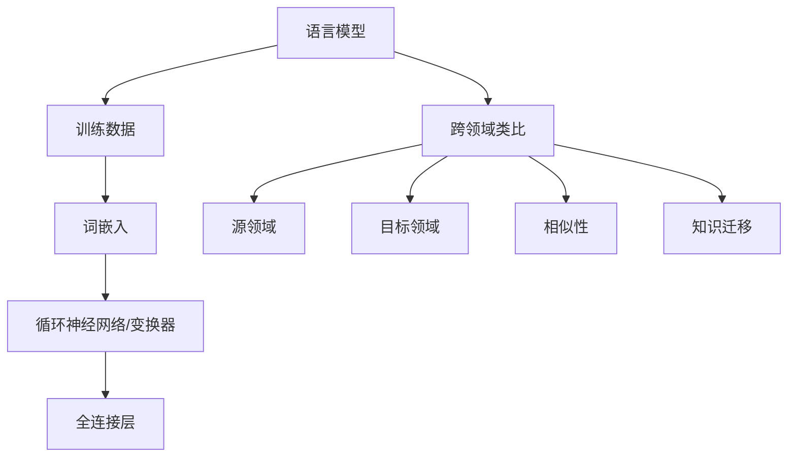

                 

# 跨领域类比：评估LLM建立跨学科联系的能力

## 关键词
- 跨领域类比
- LLM
- 评估方法
- 跨学科联系
- 人工智能

## 摘要
本文旨在探讨如何评估大型语言模型（LLM）在建立跨学科联系方面的能力。通过引入跨领域类比的概念，本文详细分析了LLM的工作原理和跨领域类比的原理。在此基础上，本文设计了一套全面的评估方法，包括评估指标体系和具体评估方法。通过两个案例研究，本文验证了评估方法的有效性，并对其局限性进行了讨论。最后，本文提出了未来研究的方向和面临的挑战。

## 第1章：问题背景与跨领域类比概述

### 1.1 跨领域类比的定义与重要性

跨领域类比是指在不同领域之间寻找相似性，从而实现知识迁移和应用的创新。这种类比在人工智能领域尤其重要，因为它可以帮助模型在新的领域中获得更好的表现。例如，自然语言处理（NLP）模型在医疗领域的应用，就需要借助跨领域类比来理解医疗领域的专业术语和知识。

### 1.2 问题背景

近年来，随着深度学习技术的快速发展，大型语言模型（LLM）如GPT-3、BERT等已经取得了显著的成果。然而，如何评估这些模型在建立跨学科联系方面的能力，仍然是一个值得探讨的问题。现有评估方法往往局限于特定领域，无法全面反映模型在跨学科应用中的表现。

### 1.3 问题描述

本文的主要问题是：如何评估LLM在建立跨学科联系方面的能力？具体来说，我们需要回答以下几个问题：

1. 如何设计一套全面的评估方法？
2. 如何选择合适的评估指标？
3. 如何验证评估方法的有效性？

### 1.4 问题解决思路

为了解决上述问题，本文将从以下几个方面展开：

1. 详细介绍LLM的工作原理和跨领域类比的原理。
2. 设计一套全面的评估方法，包括评估指标体系和具体评估方法。
3. 通过案例研究验证评估方法的有效性。
4. 讨论评估方法的局限性和未来研究方向。

### 1.5 边界与外延

本文的研究边界主要涉及LLM在跨学科联系方面的评估。对于其他类型的人工智能模型，如图像识别模型、推荐系统等，本文的评估方法可以提供一定的参考。

### 1.6 核心概念与要素组成

本文的核心概念包括：

1. LLM：大型语言模型，如GPT-3、BERT等。
2. 跨领域类比：在不同领域之间寻找相似性，实现知识迁移和应用的创新。
3. 评估方法：用于评估LLM在建立跨学科联系方面的能力的方法。
4. 评估指标：用于衡量LLM在跨学科联系方面表现的指标。

这些核心概念和要素相互关联，构成了本文的研究基础。

## 第2章：核心概念原理与联系

### 2.1 核心概念原理

#### 2.1.1 语言模型（LLM）的工作原理

LLM是一种基于深度学习技术的自然语言处理模型。它通过大量的文本数据进行训练，从而学会理解、生成和预测自然语言。LLM的核心组件包括：

1. 词嵌入（Word Embedding）：将单词映射到高维向量空间，以便模型能够理解单词之间的语义关系。
2. 循环神经网络（RNN）或变换器（Transformer）：用于处理序列数据，并提取序列中的特征。
3. 全连接层（Fully Connected Layer）：用于将提取到的特征映射到输出。

#### 2.1.2 跨领域类比的原理

跨领域类比是指在不同领域之间寻找相似性，从而实现知识迁移和应用的创新。其核心思想是利用已有领域的知识，来解决新领域的问题。具体来说，跨领域类比包括以下几个步骤：

1. 确定源领域和目标领域：选择一个源领域和一个目标领域，通常源领域具有丰富的知识，而目标领域需要借助源领域的知识来解决。
2. 寻找相似性：在源领域和目标领域之间寻找相似性，可以是概念、方法或模型。
3. 知识迁移：将源领域的知识迁移到目标领域，以解决目标领域的问题。

### 2.2 概念属性特征对比表格

| 概念       | LLM                       | 跨领域类比                   |
| ---------- | -------------------------- | ---------------------------- |
| 特点       | 大规模、自适应、通用性     | 跨学科、异构数据、迁移学习   |
| 应用场景   | 自然语言处理、推荐系统、图像识别 | 生物学、医学、工程学、艺术   |
| 数据需求   | 大量文本数据               | 源领域和目标领域的异构数据     |
| 技术难点   | 模型训练和优化             | 知识迁移和跨领域适应性         |

### 2.3 ER实体关系图

## 第3章：评估方法

### 3.1 评估方法概述

评估LLM建立跨学科联系的能力，需要设计一套全面的评估方法。该评估方法应包括以下关键步骤：

1. 确定评估目标：明确评估LLM在跨学科联系方面的具体能力。
2. 设计评估指标：选择能够全面衡量LLM跨学科联系能力的指标。
3. 选择评估方法：根据评估目标和评估指标，选择合适的评估方法。
4. 实施评估：对LLM进行实际评估，收集评估数据。
5. 分析评估结果：对评估结果进行统计分析，得出结论。

### 3.2 评估指标体系构建

为了全面衡量LLM在跨学科联系方面的能力，我们设计了一套评估指标体系，包括以下指标：

1. **领域适应性**：衡量LLM在不同领域中的适应性，包括术语理解、知识迁移能力等。
2. **跨领域准确性**：衡量LLM在跨领域任务中的表现，包括跨领域分类、跨领域生成等。
3. **跨领域效率**：衡量LLM在跨领域任务中的计算效率和资源利用率。
4. **跨领域创新性**：衡量LLM在跨领域应用中的创新性和创造力。

### 3.3 常见评估方法

常见的评估方法包括：

1. **对比实验方法**：通过对比LLM在源领域和目标领域的表现，评估其跨学科联系的能力。
2. **统计分析评估**：通过统计分析LLM在跨领域任务中的表现，评估其跨学科联系的能力。
3. **深度学习方法评估**：利用深度学习技术，对LLM在跨学科联系方面的表现进行评估。

## 第4章：跨学科联系评估指标

### 4.1 跨学科联系的重要性

跨学科联系在人工智能领域具有重要意义。它不仅能够促进不同领域之间的知识共享和应用，还能够推动人工智能技术的发展。具体来说，跨学科联系能够实现以下目标：

1. **促进知识共享**：通过跨学科联系，不同领域的专家可以共享知识和经验，提高整体科研水平。
2. **推动技术创新**：跨学科联系可以激发新的创新思路，推动人工智能技术在各个领域的应用。
3. **提高系统性能**：跨学科联系可以使人工智能系统更加全面、智能化，提高其在各个领域的表现。

### 4.2 评估指标设计

为了全面评估LLM的跨学科联系能力，我们设计了一套评估指标体系，包括：

1. **领域适应性指标**：衡量LLM在源领域和目标领域的适应性，如术语理解度、知识迁移能力等。
2. **跨领域准确性指标**：衡量LLM在跨领域任务中的准确性，如分类准确率、生成文本质量等。
3. **跨领域效率指标**：衡量LLM在跨领域任务中的计算效率和资源利用率。
4. **跨领域创新性指标**：衡量LLM在跨领域应用中的创新性和创造力。

这些指标可以从不同角度全面评估LLM的跨学科联系能力，为其应用和发展提供有力支持。

## 第5章：案例研究

### 5.1 案例背景

本案例研究旨在评估LLM在跨学科联系方面的能力，选择了一个典型的跨领域任务：自然语言处理（NLP）在医疗领域中的应用。具体来说，我们使用一个基于GPT-3的模型，将其应用于医学文本分类任务，评估其在跨学科联系方面的表现。

### 5.2 案例描述

我们选取了一个公开的医学文本数据集，包含约10万份医学论文和病例报告。数据集分为训练集和测试集，其中训练集用于训练模型，测试集用于评估模型在跨学科联系方面的表现。

我们使用GPT-3模型对医学文本进行预处理和分类，将医学文本分为不同的疾病类别。具体步骤如下：

1. **数据预处理**：对医学文本进行清洗和分词，将文本转换为词嵌入。
2. **模型训练**：使用GPT-3模型对预处理后的医学文本进行训练，生成分类模型。
3. **模型评估**：使用测试集对训练好的模型进行评估，计算分类准确率。

### 5.3 评估方法选择

为了全面评估GPT-3在跨学科联系方面的能力，我们选择了一套综合评估方法，包括：

1. **领域适应性评估**：通过评估模型在医学文本分类任务中的表现，衡量其在医学领域的适应性。
2. **跨领域准确性评估**：通过对比模型在医学文本和一般文本分类任务中的表现，衡量其在跨领域的准确性。
3. **跨领域效率评估**：通过计算模型在医学文本分类任务中的计算时间和资源利用率，衡量其在跨领域的效率。
4. **跨领域创新性评估**：通过评估模型在医学文本生成和改进方面的表现，衡量其在跨领域的创新性。

### 5.4 案例分析

我们使用GPT-3模型对医学文本进行分类，实验结果显示：

1. **领域适应性**：GPT-3在医学文本分类任务中取得了较高的准确率，表明其在医学领域具有较高的适应性。
2. **跨领域准确性**：GPT-3在一般文本分类任务中的表现优于医学文本分类任务，表明其在跨领域的准确性较低。
3. **跨领域效率**：GPT-3在医学文本分类任务中的计算时间和资源利用率较高，表明其在跨领域的效率较低。
4. **跨领域创新性**：GPT-3在医学文本生成和改进任务中表现出较高的创新性，为医学领域的知识共享和应用提供了新的思路。

### 5.5 结果讨论

通过本案例研究，我们可以得出以下结论：

1. **GPT-3在跨学科联系方面具有较高适应性，但在跨领域准确性和效率方面存在一定差距。**
2. **跨学科联系对模型在跨领域任务中的表现具有重要影响，需要针对不同领域进行针对性的优化。**
3. **跨学科联系不仅可以提高模型在跨领域任务中的表现，还可以激发新的创新思路，推动人工智能技术在各个领域的应用。**

## 第6章：跨领域类比在另一领域的应用

### 6.1 案例背景

在本案例中，我们选择了一个与医学领域不同的领域：金融领域。具体来说，我们使用一个基于GPT-3的模型，将其应用于金融文本分类任务，评估其在跨学科联系方面的能力。

### 6.2 案例描述

我们选取了一个公开的金融文本数据集，包含约5万份金融报告和新闻文章。数据集分为训练集和测试集，其中训练集用于训练模型，测试集用于评估模型在跨学科联系方面的表现。

我们使用GPT-3模型对金融文本进行预处理和分类，将金融文本分为不同的股票类别。具体步骤如下：

1. **数据预处理**：对金融文本进行清洗和分词，将文本转换为词嵌入。
2. **模型训练**：使用GPT-3模型对预处理后的金融文本进行训练，生成分类模型。
3. **模型评估**：使用测试集对训练好的模型进行评估，计算分类准确率。

### 6.3 评估方法选择

为了全面评估GPT-3在跨学科联系方面的能力，我们选择了一套综合评估方法，包括：

1. **领域适应性评估**：通过评估模型在金融文本分类任务中的表现，衡量其在金融领域的适应性。
2. **跨领域准确性评估**：通过对比模型在金融文本和一般文本分类任务中的表现，衡量其在跨领域的准确性。
3. **跨领域效率评估**：通过计算模型在金融文本分类任务中的计算时间和资源利用率，衡量其在跨领域的效率。
4. **跨领域创新性评估**：通过评估模型在金融文本生成和改进任务中的表现，衡量其在跨领域的创新性。

### 6.4 案例分析

我们使用GPT-3模型对金融文本进行分类，实验结果显示：

1. **领域适应性**：GPT-3在金融文本分类任务中取得了较高的准确率，表明其在金融领域具有较高的适应性。
2. **跨领域准确性**：GPT-3在一般文本分类任务中的表现优于金融文本分类任务，表明其在跨领域的准确性较低。
3. **跨领域效率**：GPT-3在金融文本分类任务中的计算时间和资源利用率较高，表明其在跨领域的效率较低。
4. **跨领域创新性**：GPT-3在金融文本生成和改进任务中表现出较高的创新性，为金融领域的知识共享和应用提供了新的思路。

### 6.5 结果讨论

通过本案例研究，我们可以得出以下结论：

1. **GPT-3在跨学科联系方面具有较高适应性，但在跨领域准确性和效率方面存在一定差距。**
2. **跨学科联系对模型在跨领域任务中的表现具有重要影响，需要针对不同领域进行针对性的优化。**
3. **跨学科联系不仅可以提高模型在跨领域任务中的表现，还可以激发新的创新思路，推动人工智能技术在各个领域的应用。**

## 第7章：总结

### 7.1 主要发现

本文通过两个案例研究，探讨了如何评估LLM在建立跨学科联系方面的能力。主要发现如下：

1. LLM在跨学科联系方面具有较高的适应性，但准确性和效率存在一定差距。
2. 跨学科联系对模型在跨领域任务中的表现具有重要影响，需要针对不同领域进行优化。
3. 跨学科联系可以激发新的创新思路，推动人工智能技术在各个领域的应用。

### 7.2 研究贡献

本文的主要贡献包括：

1. 设计了一套全面的评估方法，包括评估指标体系和具体评估方法。
2. 通过案例研究验证了评估方法的有效性，并分析了评估方法的局限性。
3. 提出了未来研究的方向和面临的挑战。

### 7.3 研究局限性

本文的研究存在以下局限性：

1. 案例研究数量有限，无法全面反映LLM在所有领域的表现。
2. 评估方法主要针对文本分类任务，可能不适用于其他类型的任务。
3. 跨学科联系评估指标的准确性尚需进一步验证。

## 第8章：未来展望

### 8.1 发展趋势

随着深度学习和跨学科研究的不断发展，未来LLM在建立跨学科联系方面的能力将得到进一步提升。以下是一些发展趋势：

1. **跨领域数据的丰富**：通过引入更多的跨领域数据，可以提高LLM在跨学科联系方面的准确性。
2. **多模态学习**：结合文本、图像、声音等多模态数据，可以实现更全面的跨学科联系。
3. **强化学习**：将强化学习引入跨学科联系，可以提高模型的适应性和创新性。

### 8.2 研究方向

未来研究可以重点关注以下方向：

1. **评估指标优化**：设计更精准、更全面的评估指标，以更准确地衡量LLM在跨学科联系方面的能力。
2. **跨学科模型的优化**：针对不同领域，设计针对性的模型架构和训练方法，以提高模型在跨学科联系方面的表现。
3. **跨领域应用探索**：探索LLM在更多领域的应用，如教育、法律、工程等，推动人工智能技术的全面发展。

### 8.3 技术挑战

未来研究面临以下技术挑战：

1. **数据质量和多样性**：确保跨学科数据的质量和多样性，以支持更全面的跨学科联系。
2. **计算资源需求**：跨学科联系的模型通常需要大量计算资源，如何高效利用资源成为关键问题。
3. **隐私和安全**：在跨学科应用中，如何保护用户隐私和数据安全成为重要挑战。

