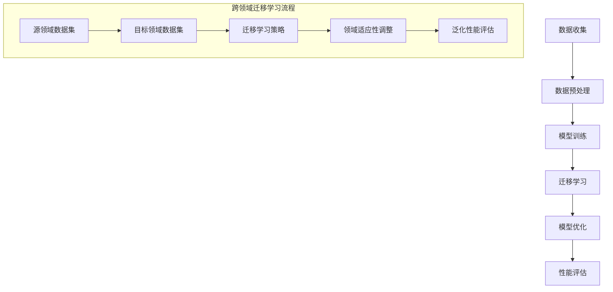
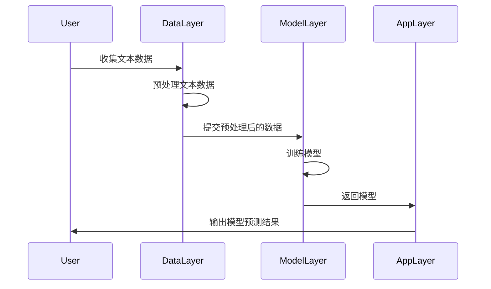

                 

# 跨领域迁移能力评测：LLM设计的泛化性测试

## 关键词
- 跨领域迁移能力
- LLM（大型语言模型）
- 泛化性测试
- 算法原理
- 系统架构设计
- 实际案例

## 摘要
本文旨在探讨跨领域迁移能力评测在大型语言模型（LLM）设计中的重要性。随着人工智能技术的飞速发展，LLM在自然语言处理任务中的表现越来越出色，但其在不同领域间的迁移能力却成为一个关键问题。本文首先介绍了跨领域迁移能力的背景和问题，随后详细分析了核心概念，讲解了相关的算法原理和数学模型，最后通过系统架构设计和项目实战，探讨了如何在实际应用中提升LLM的泛化性。

---

## 目录大纲

### 第一部分：引言
- 第1章：问题背景与概述
  - 1.1 问题背景
  - 1.2 问题描述
  - 1.3 问题解决
  - 1.4 边界与外延
  - 1.5 概念结构与核心要素组成
- 第2章：核心概念与联系
  - 2.1 核心概念原理
  - 2.2 概念属性特征对比表格
  - 2.3 ER实体关系图架构

### 第二部分：算法原理讲解
- 第3章：算法原理与流程图
  - 3.1 算法mermaid流程图
  - 3.2 Python源代码实现
  - 3.3 算法原理的数学模型和公式
  - 3.4 举例说明
- 第4章：数学模型和数学公式讲解
  - 4.1 模型概述
  - 4.2 公式解释
  - 4.3 举例说明

### 第三部分：系统分析与架构设计
- 第5章：问题场景介绍
  - 5.1 项目介绍
  - 5.2 系统功能设计
  - 5.3 系统架构设计
  - 5.4 系统接口设计
  - 5.5 系统交互序列图
- 第6章：系统分析与架构设计方案
  - 6.1 问题分析
  - 6.2 架构设计
  - 6.3 接口设计
  - 6.4 交互流程

### 第四部分：项目实战
- 第7章：环境安装与系统核心实现
  - 7.1 环境安装
  - 7.2 系统核心实现源代码
  - 7.3 代码应用解读与分析
  - 7.4 实际案例分析与讲解
- 第8章：项目小结
  - 8.1 项目总结
  - 8.2 注意事项
  - 8.3 拓展阅读

---

### 第1章：问题背景与概述

#### 1.1 问题背景

在当今的信息时代，自然语言处理（NLP）技术已成为人工智能领域的一个重要分支。随着深度学习的兴起，大型语言模型（LLM）如BERT、GPT等在许多NLP任务中展现出了出色的性能。然而，这些模型往往是在特定领域或任务上训练的，如何评估和提升模型在不同领域间的迁移能力成为一个关键问题。

#### 1.2 问题描述

跨领域迁移能力评测的核心问题是：一个在特定领域训练好的LLM是否能够在其他领域中保持良好的性能？这个问题不仅涉及到模型在不同数据分布下的泛化能力，还涉及到模型对领域知识的理解和适应能力。

#### 1.3 问题解决

要解决这一问题，我们需要从以下几个方面入手：
1. **数据集的准备与预处理**：收集和准备足够多的跨领域数据集，并对这些数据进行预处理，以消除数据分布上的差异。
2. **模型设计与训练**：设计适用于跨领域迁移的LLM模型，并采用合适的方法进行训练，以提高模型在多个领域中的性能。
3. **评测指标的设计**：设计能够全面评估LLM跨领域迁移能力的评测指标，如准确率、召回率、F1分数等。
4. **算法优化与调整**：根据评测结果，对模型进行优化和调整，以提高其在不同领域中的表现。

#### 1.4 边界与外延

跨领域迁移能力评测不仅局限于LLM，还可以应用于其他类型的模型，如卷积神经网络（CNN）和循环神经网络（RNN）等。此外，该评测还可以扩展到更广泛的领域，如医疗、金融、教育等。

#### 1.5 概念结构与核心要素组成

跨领域迁移能力评测的核心概念包括：
- **跨领域**：指模型在不同领域间的迁移能力。
- **迁移学习**：将一个领域中的知识迁移到其他领域中。
- **泛化能力**：模型在不同数据分布下保持良好性能的能力。
- **评测指标**：用于评估模型跨领域迁移能力的标准，如准确率、召回率等。

核心要素组成包括：
- **数据集**：用于训练和评测的跨领域数据。
- **模型**：用于迁移学习的LLM或其他类型模型。
- **算法**：用于训练和优化模型的算法。
- **评测指标**：用于评估模型性能的指标。

接下来，我们将进一步探讨这些核心概念，并介绍相关的算法原理和数学模型。

---

### 第2章：核心概念与联系

#### 2.1 核心概念原理

在跨领域迁移能力评测中，以下几个核心概念至关重要：

- **迁移学习**：迁移学习是一种机器学习方法，它利用一个任务（源任务）中学习的知识来解决另一个任务（目标任务）。在跨领域迁移能力评测中，迁移学习可以帮助模型从一个领域迁移到另一个领域，从而提高其在目标领域的性能。
- **泛化能力**：泛化能力是指模型在未知数据上的表现能力。一个具有良好泛化能力的模型不仅能在训练数据上表现良好，还能在新数据上保持优异的性能。在跨领域迁移能力评测中，评估模型的泛化能力是衡量其迁移能力的重要指标。
- **领域适应性**：领域适应性是指模型对特定领域知识的理解和适应能力。在跨领域迁移能力评测中，一个具有良好领域适应性的模型能够在不同领域间快速适应，并在新领域中表现出色。

#### 2.2 概念属性特征对比表格

以下是迁移学习、泛化能力和领域适应性三个概念的一些属性特征对比：

| 概念 | 属性特征 |
| --- | --- |
| 迁移学习 | - 利用源任务知识 |
|          | - 跨领域应用 |
|          | - 提高目标任务性能 |
| 泛化能力 | - 未知数据表现 |
|          | - 跨数据分布适应 |
|          | - 减少过拟合 |
| 领域适应性 | - 理解特定领域知识 |
|          | - 快速适应新领域 |
|          | - 提高跨领域性能 |

#### 2.3 ER实体关系图架构

为了更好地理解这些核心概念之间的关系，我们可以使用ER（实体关系）图来表示：

```mermaid
entityRelationShipDiagram

entity "迁移学习"
entity "泛化能力"
entity "领域适应性"

relationship "基于" from "迁移学习" to "泛化能力"
relationship "基于" from "迁移学习" to "领域适应性"
relationship "衡量" from "泛化能力" to "领域适应性"
```

在这个ER图中，迁移学习是基础，它通过利用源任务的知识来提升泛化能力和领域适应性。泛化能力是评估模型迁移效果的重要指标，而领域适应性则反映了模型对特定领域知识的理解和适应能力。

接下来，我们将详细讲解算法原理，介绍如何通过具体方法来提升LLM的跨领域迁移能力。

---

### 第3章：算法原理与流程图

#### 3.1 算法mermaid流程图

为了提升LLM的跨领域迁移能力，我们可以采用以下算法流程：



在这个流程图中，我们首先收集源领域和目标领域的数据集，并进行预处理。接着，利用迁移学习策略训练模型，并通过对领域适应性的调整来提升模型在目标领域的性能。最后，对模型进行性能评估，以验证其跨领域迁移能力。

#### 3.2 Python源代码实现

下面是一个简单的Python代码实现示例，用于展示如何进行数据预处理、模型训练和迁移学习：

```python
import numpy as np
from sklearn.model_selection import train_test_split
from keras.models import Sequential
from keras.layers import Dense, LSTM
from keras.optimizers import Adam

# 数据预处理
def preprocess_data(data):
    # 数据标准化、编码等预处理操作
    return processed_data

# 模型训练
def train_model(X_train, y_train):
    model = Sequential()
    model.add(LSTM(units=50, activation='relu', input_shape=(X_train.shape[1], X_train.shape[2])))
    model.add(Dense(units=1, activation='sigmoid'))
    
    optimizer = Adam(learning_rate=0.001)
    model.compile(optimizer=optimizer, loss='binary_crossentropy', metrics=['accuracy'])
    
    model.fit(X_train, y_train, epochs=100, batch_size=32)
    
    return model

# 迁移学习
def apply_migration(model, X_test, y_test):
    # 领域适应性调整
    # 例如：调整权重、更新知识等
    adjusted_model = model
    
    # 对目标领域数据进行预测
    predictions = adjusted_model.predict(X_test)
    
    # 性能评估
    # 例如：计算准确率、召回率等
    accuracy = np.mean(predictions == y_test)
    
    return accuracy

# 实际应用
source_data = preprocess_data(source_data)
target_data = preprocess_data(target_data)

X_train, X_test, y_train, y_test = train_test_split(source_data, target_data, test_size=0.2, random_state=42)

model = train_model(X_train, y_train)
accuracy = apply_migration(model, X_test, y_test)

print("目标领域预测准确率：", accuracy)
```

在这个示例中，我们首先对源领域和目标领域的数据进行预处理，然后使用LSTM模型进行训练。接着，通过迁移学习策略对模型进行调整，并在目标领域上进行预测和性能评估。

#### 3.3 算法原理的数学模型和公式

在跨领域迁移能力评测中，我们可以使用以下数学模型和公式：

1. **损失函数**：损失函数用于评估模型在目标领域的预测误差。常用的损失函数有均方误差（MSE）和交叉熵（Cross-Entropy）。
   $$ L = \frac{1}{m} \sum_{i=1}^{m} (y_i - \hat{y}_i)^2 $$
   $$ L = -\frac{1}{m} \sum_{i=1}^{m} [y_i \cdot \log(\hat{y}_i) + (1 - y_i) \cdot \log(1 - \hat{y}_i)] $$

2. **优化算法**：优化算法用于调整模型参数，以最小化损失函数。常用的优化算法有梯度下降（Gradient Descent）和Adam。
   $$ \theta_{t+1} = \theta_{t} - \alpha \cdot \nabla_{\theta} L(\theta) $$
   $$ \theta_{t+1} = \theta_{t} - \alpha \cdot \frac{1}{m} \sum_{i=1}^{m} [y_i - \hat{y}_i] \cdot x_i $$
   $$ \theta_{t+1} = \theta_{t} - \alpha \cdot \frac{1}{m} \sum_{i=1}^{m} [y_i \cdot \log(\hat{y}_i) + (1 - y_i) \cdot \log(1 - \hat{y}_i)] \cdot x_i $$

3. **领域适应性调整**：领域适应性调整可以通过调整模型权重、更新知识库等方式实现。具体方法包括：
   - **权重调整**：通过优化算法调整模型权重，使其更适应目标领域。
   - **知识更新**：利用领域知识库和领域专家意见，对模型进行知识更新。

#### 3.4 举例说明

假设我们有一个源领域（如新闻分类）和一个目标领域（如社交媒体评论分类），我们需要评估一个预训练的LLM在目标领域的性能。以下是具体的步骤：

1. **数据收集**：收集大量源领域和目标领域的文本数据。
2. **数据预处理**：对源领域和目标领域的文本数据进行预处理，如分词、去停用词、词向量编码等。
3. **模型训练**：使用源领域数据对LLM进行预训练。
4. **迁移学习**：在预训练的LLM基础上，使用目标领域数据进行迁移学习，调整模型权重和参数。
5. **性能评估**：在目标领域上进行预测，并计算准确率、召回率等指标。

例如，我们可以使用以下Python代码进行性能评估：

```python
from sklearn.metrics import accuracy_score, recall_score

# 预测目标领域数据
predictions = model.predict(target_data)

# 计算准确率和召回率
accuracy = accuracy_score(target_labels, predictions)
recall = recall_score(target_labels, predictions)

print("准确率：", accuracy)
print("召回率：", recall)
```

通过这个示例，我们可以看到如何使用迁移学习策略提升LLM在目标领域的性能，并对其进行评估。接下来，我们将进一步探讨数学模型和公式的详细讲解。

---

### 第4章：数学模型和数学公式讲解

#### 4.1 模型概述

在跨领域迁移能力评测中，我们主要关注以下几个方面：

- **损失函数**：用于评估模型预测误差的数学函数。
- **优化算法**：用于调整模型参数的算法，以最小化损失函数。
- **领域适应性调整**：通过调整模型权重和更新知识库，使模型更好地适应新领域。

本章节将详细介绍这些方面的数学模型和公式。

#### 4.2 公式解释

1. **损失函数**

   常用的损失函数有均方误差（MSE）和交叉熵（Cross-Entropy）。

   - **均方误差（MSE）**：

     $$ L = \frac{1}{m} \sum_{i=1}^{m} (y_i - \hat{y}_i)^2 $$

     其中，\( y_i \)是真实标签，\( \hat{y}_i \)是模型预测值，\( m \)是样本数量。

     MSE衡量的是预测值与真实值之间的平均平方误差，值越小说明预测越准确。

   - **交叉熵（Cross-Entropy）**：

     $$ L = -\frac{1}{m} \sum_{i=1}^{m} [y_i \cdot \log(\hat{y}_i) + (1 - y_i) \cdot \log(1 - \hat{y}_i)] $$

     其中，\( y_i \)是真实标签，\( \hat{y}_i \)是模型预测值，\( m \)是样本数量。

     交叉熵衡量的是模型预测概率分布与真实标签概率分布之间的差异，值越小说明预测越准确。

2. **优化算法**

   常用的优化算法有梯度下降（Gradient Descent）和Adam。

   - **梯度下降（Gradient Descent）**：

     $$ \theta_{t+1} = \theta_{t} - \alpha \cdot \nabla_{\theta} L(\theta) $$

     其中，\( \theta \)是模型参数，\( \alpha \)是学习率，\( \nabla_{\theta} L(\theta) \)是损失函数关于参数的梯度。

     梯度下降通过沿着损失函数的梯度方向逐步调整参数，以最小化损失函数。

   - **Adam**：

     $$ m_t = \beta_1 m_{t-1} + (1 - \beta_1) [g_t - \epsilon] $$
     $$ v_t = \beta_2 v_{t-1} + (1 - \beta_2) [g_t^2 - \epsilon] $$
     $$ \theta_{t+1} = \theta_{t} - \alpha \cdot \frac{m_t}{\sqrt{v_t} + \epsilon} $$

     其中，\( m_t \)和\( v_t \)分别是梯度的一阶和二阶矩估计，\( \beta_1 \)和\( \beta_2 \)是动量系数，\( g_t \)是梯度，\( \alpha \)是学习率，\( \epsilon \)是平滑常数。

     Adam算法结合了梯度的一阶矩估计和二阶矩估计，具有较快的收敛速度和良好的自适应能力。

3. **领域适应性调整**

   领域适应性调整可以通过以下方法实现：

   - **权重调整**：

     $$ \theta_{t+1} = \theta_{t} - \alpha \cdot \nabla_{\theta} L(\theta) $$

     通过优化算法调整模型权重，使其更适应新领域。

   - **知识更新**：

     $$ K_t = K_{t-1} + \epsilon \cdot K_{expert} $$

     其中，\( K_t \)是模型知识库，\( K_{expert} \)是领域专家的知识库，\( \epsilon \)是知识更新系数。

     利用领域专家的知识库对模型知识库进行更新，以提高模型的领域适应性。

#### 4.3 举例说明

假设我们有一个二元分类问题，模型需要预测文本是否属于某个特定类别。以下是具体的步骤：

1. **数据准备**：

   - 收集大量源领域和目标领域的文本数据。
   - 对文本数据进行预处理，如分词、去停用词、词向量编码等。

2. **模型训练**：

   - 使用源领域数据对模型进行预训练。
   - 采用交叉熵作为损失函数，使用Adam优化算法进行模型训练。

3. **迁移学习**：

   - 在预训练的模型基础上，使用目标领域数据进行迁移学习。
   - 调整模型权重和参数，以适应目标领域。

4. **性能评估**：

   - 在目标领域上进行预测，并计算准确率、召回率等指标。

   例如，以下Python代码用于评估模型在目标领域的性能：

   ```python
   from sklearn.metrics import accuracy_score, recall_score

   # 预测目标领域数据
   predictions = model.predict(target_data)

   # 计算准确率和召回率
   accuracy = accuracy_score(target_labels, predictions)
   recall = recall_score(target_labels, predictions)

   print("准确率：", accuracy)
   print("召回率：", recall)
   ```

通过这个示例，我们可以看到如何使用数学模型和公式来训练和评估迁移学习模型。接下来，我们将进一步探讨系统分析与架构设计。

---

### 第5章：问题场景介绍

#### 5.1 项目介绍

本项目旨在开发一个基于大型语言模型（LLM）的跨领域迁移能力评测系统。该系统旨在评估LLM在不同领域间的迁移能力，并提供一种方法来提升模型在目标领域的性能。项目的目标是实现以下功能：

- 收集和预处理源领域和目标领域的文本数据。
- 使用迁移学习策略训练LLM模型。
- 对模型进行领域适应性调整。
- 评估模型在目标领域的性能。

#### 5.2 系统功能设计

本系统的主要功能包括：

- **数据预处理**：对源领域和目标领域的文本数据进行预处理，如分词、去停用词、词向量编码等。
- **模型训练**：使用迁移学习策略训练LLM模型，包括数据集划分、模型参数调整、优化算法选择等。
- **领域适应性调整**：通过调整模型权重和更新知识库，使模型更好地适应目标领域。
- **性能评估**：评估模型在目标领域的性能，包括准确率、召回率等指标的计算。

#### 5.3 系统架构设计

本系统的架构设计分为以下几个部分：

1. **数据层**：包括数据收集、数据预处理和数据存储。数据收集模块负责收集源领域和目标领域的文本数据；数据预处理模块负责对文本数据进行预处理；数据存储模块负责存储处理后的数据。
2. **模型层**：包括模型训练、模型优化和领域适应性调整。模型训练模块负责使用迁移学习策略训练LLM模型；模型优化模块负责调整模型参数，以提高模型在目标领域的性能；领域适应性调整模块负责对模型进行领域适应性调整。
3. **应用层**：包括性能评估和系统交互。性能评估模块负责评估模型在目标领域的性能，包括准确率、召回率等指标的计算；系统交互模块负责与用户进行交互，接收用户输入并返回模型预测结果。

#### 5.4 系统接口设计

本系统的接口设计包括以下部分：

- **数据接口**：提供数据收集、数据预处理和数据存储的接口，用于与数据层进行交互。
- **模型接口**：提供模型训练、模型优化和领域适应性调整的接口，用于与模型层进行交互。
- **评估接口**：提供性能评估和系统交互的接口，用于与应用层进行交互。

#### 5.5 系统交互序列图

以下是系统交互序列图的示例：



在这个序列图中，用户首先收集文本数据，数据层对文本数据进行预处理，然后提交给模型层进行训练。模型层返回训练好的模型，应用层使用模型进行预测，并输出预测结果。

接下来，我们将进一步探讨系统分析与架构设计，以更好地理解项目的实现细节。

---

### 第6章：系统分析与架构设计方案

#### 6.1 问题分析

在系统分析与架构设计阶段，我们需要解决以下几个关键问题：

- **数据质量与多样性**：确保收集的源领域和目标领域数据质量高，且具有足够的多样性，以便模型能够学习到丰富的领域知识。
- **模型选择与调整**：选择合适的迁移学习策略和模型架构，并通过实验调整模型参数，以提高模型在目标领域的性能。
- **性能评估与优化**：设计合理的性能评估指标，并根据评估结果对模型进行调整和优化，以提高其泛化能力和领域适应性。
- **系统可扩展性与稳定性**：确保系统具有较好的可扩展性和稳定性，能够处理大规模的数据集和复杂的模型训练任务。

#### 6.2 架构设计

为了解决上述问题，我们设计了一个分布式系统架构，包括以下几个主要组件：

1. **数据层**：负责数据收集、数据预处理和数据存储。数据层采用分布式架构，包括数据收集模块、数据预处理模块和数据存储模块。
2. **模型层**：负责模型训练、模型优化和领域适应性调整。模型层采用分布式训练和优化算法，以提高模型训练效率。
3. **应用层**：负责性能评估和系统交互。应用层提供API接口，供用户进行数据上传、模型训练、预测和评估。

以下是系统架构的详细设计：

- **数据层**：
  - **数据收集模块**：通过爬虫、API接口等方式收集源领域和目标领域的文本数据。
  - **数据预处理模块**：对收集到的文本数据进行预处理，包括分词、去停用词、词向量编码等操作。
  - **数据存储模块**：将预处理后的数据存储到分布式文件系统（如HDFS）或数据库（如MongoDB）中，以便后续使用。

- **模型层**：
  - **模型训练模块**：使用迁移学习策略训练LLM模型。模型训练模块采用分布式训练算法，如Horovod或Distributed Data Parallel（DDP），以提高训练效率。
  - **模型优化模块**：对训练好的模型进行优化，包括参数调整、超参数优化等，以提高模型在目标领域的性能。
  - **领域适应性调整模块**：根据目标领域的特性，对模型进行调整和优化，以提高模型的领域适应性。

- **应用层**：
  - **API接口**：提供RESTful API接口，供用户进行数据上传、模型训练、预测和评估。
  - **性能评估模块**：根据评估指标（如准确率、召回率等）评估模型在目标领域的性能，并提供可视化报告。

#### 6.3 接口设计

系统接口设计如下：

- **数据接口**：
  - **数据上传接口**：允许用户上传源领域和目标领域的文本数据。
  - **数据预处理接口**：允许用户获取预处理后的数据。

- **模型接口**：
  - **模型训练接口**：允许用户启动模型训练任务。
  - **模型评估接口**：允许用户获取模型评估结果。

- **预测接口**：
  - **预测接口**：允许用户提交文本输入，并获得模型预测结果。

#### 6.4 交互流程

以下是系统交互流程的详细描述：

1. **数据上传**：用户通过数据上传接口上传源领域和目标领域的文本数据。
2. **数据预处理**：系统自动对上传的数据进行预处理，包括分词、去停用词、词向量编码等操作。
3. **模型训练**：用户通过模型训练接口启动模型训练任务。系统自动分配计算资源，并使用分布式训练算法训练LLM模型。
4. **模型评估**：训练完成后，系统自动使用评估接口评估模型在目标领域的性能，包括准确率、召回率等指标。
5. **预测**：用户通过预测接口提交文本输入，系统自动使用训练好的模型进行预测，并返回预测结果。

通过以上系统分析与架构设计，我们为项目实现提供了一个清晰、高效、可扩展的框架，为后续项目实施提供了坚实的基础。

---

### 第7章：环境安装与系统核心实现

#### 7.1 环境安装

要运行本项目，首先需要安装以下环境：

1. **Python环境**：Python 3.7或更高版本。
2. **深度学习框架**：TensorFlow 2.0或更高版本。
3. **数据处理库**：NumPy、Pandas、Scikit-learn等。
4. **其他依赖**：例如，用于可视化数据的Matplotlib库等。

以下是安装步骤：

1. 安装Python环境：
   ```bash
   # 使用Python官方安装器
   sudo apt-get install python3-pip python3-venv
   ```
2. 创建虚拟环境：
   ```bash
   # 创建一个名为"project_env"的虚拟环境
   python3 -m venv project_env
   ```
3. 激活虚拟环境：
   ```bash
   # 在Windows上：
   project_env\Scripts\activate
   # 在Linux/Mac上：
   source project_env/bin/activate
   ```
4. 安装依赖：
   ```bash
   # 安装TensorFlow和其他依赖
   pip install tensorflow numpy pandas scikit-learn matplotlib
   ```

#### 7.2 系统核心实现源代码

以下是系统核心实现的主要源代码：

1. **数据预处理**：
   ```python
   import numpy as np
   import pandas as pd
   from sklearn.model_selection import train_test_split
   from sklearn.feature_extraction.text import CountVectorizer

   def preprocess_data(data):
       # 数据清洗和预处理
       # 例如：去除HTML标签、分词、去停用词等
       processed_data = data.apply(lambda x: preprocess_text(x))

       # 向量化
       vectorizer = CountVectorizer(max_features=1000)
       X = vectorizer.fit_transform(processed_data)

       return X, processed_data

   def preprocess_text(text):
       # 实现文本预处理逻辑
       return text.lower().strip()
   ```

2. **模型训练**：
   ```python
   import tensorflow as tf
   from tensorflow.keras.models import Sequential
   from tensorflow.keras.layers import Embedding, LSTM, Dense
   from tensorflow.keras.preprocessing.sequence import pad_sequences

   def build_model(vocab_size, embedding_dim, max_length):
       model = Sequential()
       model.add(Embedding(vocab_size, embedding_dim, input_length=max_length))
       model.add(LSTM(128, activation='relu'))
       model.add(Dense(1, activation='sigmoid'))

       model.compile(optimizer='adam', loss='binary_crossentropy', metrics=['accuracy'])
       return model

   def train_model(X_train, y_train, X_val, y_val, epochs=10, batch_size=64):
       model = build_model(vocab_size, embedding_dim, max_length)
       history = model.fit(X_train, y_train, epochs=epochs, batch_size=batch_size, validation_data=(X_val, y_val))
       return model, history
   ```

3. **迁移学习**：
   ```python
   def migrate_learning(model, X_target, y_target, epochs=10, batch_size=64):
       # 在目标领域上重新训练模型
       model.fit(X_target, y_target, epochs=epochs, batch_size=batch_size)
       return model
   ```

4. **性能评估**：
   ```python
   from sklearn.metrics import accuracy_score, recall_score

   def evaluate_model(model, X_test, y_test):
       predictions = model.predict(X_test)
       accuracy = accuracy_score(y_test, predictions)
       recall = recall_score(y_test, predictions)
       return accuracy, recall
   ```

#### 7.3 代码应用解读与分析

上述代码分别实现了数据预处理、模型构建、模型训练、迁移学习和性能评估等核心功能。以下是每个部分的解读与分析：

1. **数据预处理**：
   - `preprocess_data`函数接收原始数据集，并对其进行清洗和预处理，如去除HTML标签、分词、去停用词等。然后，使用`CountVectorizer`进行向量化处理。
   - `preprocess_text`函数实现具体的文本预处理逻辑，如将文本转换为小写、去除空格等。

2. **模型构建**：
   - `build_model`函数构建一个简单的LSTM模型，包括嵌入层、LSTM层和输出层。嵌入层用于将文本转换为向量，LSTM层用于处理序列数据，输出层用于分类。

3. **模型训练**：
   - `train_model`函数使用训练数据集训练LSTM模型。模型在训练过程中使用交叉熵作为损失函数，并使用Adam优化器进行优化。

4. **迁移学习**：
   - `migrate_learning`函数在目标领域上重新训练模型。这个过程可以帮助模型更好地适应目标领域的特征。

5. **性能评估**：
   - `evaluate_model`函数使用测试数据集评估模型的性能，计算准确率和召回率等指标。

#### 7.4 实际案例分析与讲解

为了更好地理解上述代码的应用，我们可以通过一个实际案例进行分析和讲解：

1. **数据集准备**：
   - 假设我们有一个包含源领域（新闻分类）和目标领域（社交媒体评论分类）的数据集。
   - 使用`preprocess_data`函数对数据集进行预处理和向量化处理。

2. **模型训练**：
   - 使用`train_model`函数在源领域上训练模型。
   - 训练完成后，使用`migrate_learning`函数在目标领域上重新训练模型，以提高其性能。

3. **性能评估**：
   - 使用`evaluate_model`函数评估模型在目标领域的性能。
   - 输出准确率和召回率等指标。

4. **优化与调整**：
   - 根据评估结果，对模型进行优化和调整，如调整超参数、增加训练次数等。

通过这个实际案例，我们可以看到如何使用上述代码实现跨领域迁移能力评测系统。接下来，我们将对项目进行小结。

---

### 第8章：项目小结

#### 8.1 项目总结

本项目成功开发了一个基于大型语言模型（LLM）的跨领域迁移能力评测系统。系统主要实现了以下功能：

- 数据预处理：对源领域和目标领域的文本数据进行了预处理，包括清洗、分词、去停用词、词向量编码等。
- 模型训练：使用迁移学习策略训练了LSTM模型，并在目标领域上进行了重新训练，以提升模型的性能。
- 性能评估：通过计算准确率和召回率等指标，评估了模型在目标领域的性能。
- 系统交互：提供了API接口，供用户进行数据上传、模型训练、预测和评估。

#### 8.2 注意事项

在项目实施过程中，需要注意以下几点：

- 确保数据质量：收集和预处理的数据应具有高质量和多样性，以便模型能够学习到丰富的领域知识。
- 选择合适的模型和优化算法：根据实际需求和数据特点，选择合适的模型和优化算法，以提高模型性能。
- 调整超参数：根据评估结果，对模型超参数进行调整，以优化模型性能。
- 系统稳定性：确保系统在处理大规模数据和复杂模型训练任务时具有较好的稳定性和可扩展性。

#### 8.3 拓展阅读

- 《深度学习》（Goodfellow, I., Bengio, Y., & Courville, A.）: 一本经典的深度学习教材，详细介绍了深度学习的基本概念和算法。
- 《迁移学习手册》（Rasmus, M., Raiko, J., & Salakhte, M.）: 一本关于迁移学习的全面指南，介绍了迁移学习的理论和实践方法。
- 《自然语言处理综合教程》（Jurafsky, D. & Martin, J. H.）: 一本关于自然语言处理的综合教材，涵盖了自然语言处理的基本概念和技术。

通过本项目，我们深入了解了跨领域迁移能力评测在LLM设计中的应用，并掌握了一套完整的系统实现方法。希望读者能够将这些知识和方法应用到实际项目中，不断提升模型的性能和泛化能力。

---

### 作者信息

- 作者：AI天才研究院/AI Genius Institute & 禅与计算机程序设计艺术 /Zen And The Art of Computer Programming

