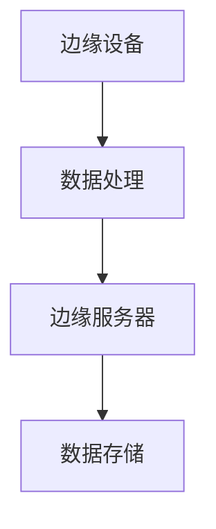
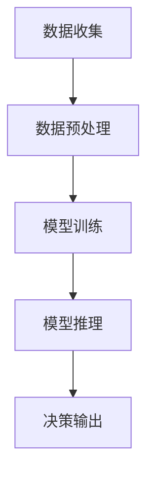
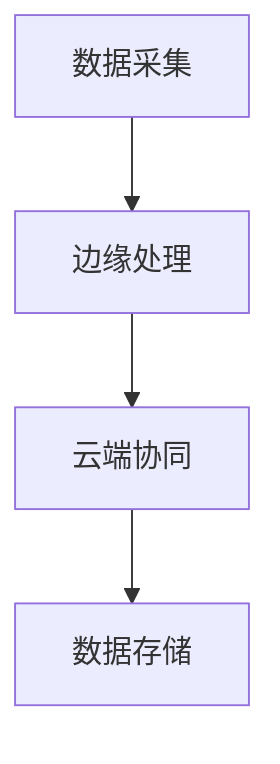
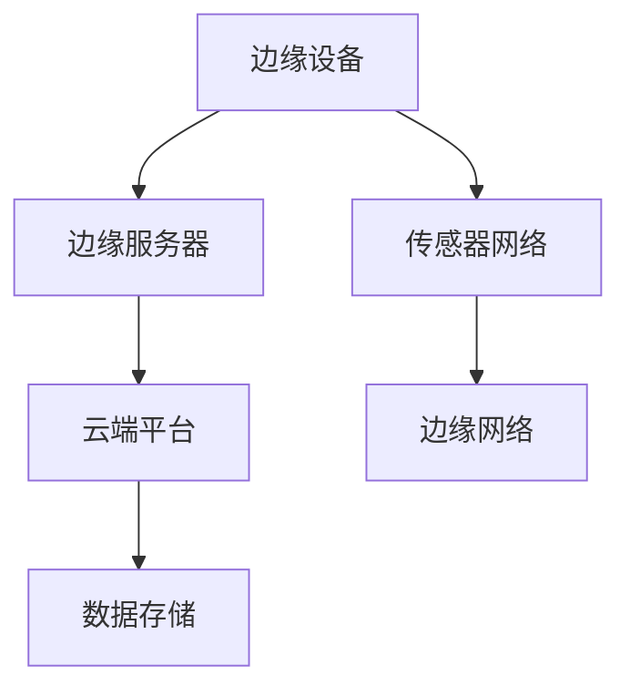

                 

## 边缘AI：将智能推向设备端的技术革新

关键词：边缘AI、智能边缘、设备端智能、技术革新、智能计算

摘要：本文将深入探讨边缘AI的概念、原理、优势、挑战以及未来发展，通过详细的案例分析和技术架构解析，为读者展示边缘AI在推动智能计算从云端到设备端迁移中的关键作用。我们将一步步分析边缘AI的各个层面，从基本概念出发，到技术原理，再到实际应用，帮助读者全面理解这一技术革新。

### 1.1 背景介绍

随着物联网（IoT）和5G技术的发展，设备端的数据生成速度和规模大幅提升。然而，将大量数据传输到云端进行计算不仅增加了网络延迟，还可能导致数据隐私和安全问题。边缘AI应运而生，它将智能计算能力推向了设备端，实现了本地数据处理和分析。边缘AI的核心在于将传统的云计算模式转变为分布式计算，使得计算更加高效、安全，同时也降低了网络负载。

### 1.2 核心概念与联系

#### 1.2.1 边缘计算

边缘计算指的是在靠近数据源或者靠近最终用户的地方进行数据处理和计算，以减少数据传输的延迟和带宽消耗。边缘计算可以理解为云计算的延伸，它将部分计算任务从云端转移到边缘设备上。

| 对比项 | 边缘计算 | 云计算 |
| --- | --- | --- |
| 数据处理位置 | 离数据源近 | 远离数据源，在云端处理 |
| 延迟 | 较低 | 较高 |
| 带宽消耗 | 较低 | 较高 |
| 安全性 | 更高（本地处理） | 较高（但可能面临数据泄露风险） |

#### 1.2.2 传统AI与边缘AI

传统AI主要依赖于云计算，将大量数据上传至云端，通过服务器进行复杂计算。而边缘AI则不同，它可以在设备端直接处理数据，进行实时分析和决策。

| 对比项 | 传统AI | 边缘AI |
| --- | --- | --- |
| 数据处理能力 | 强大但延迟高 | 较弱但延迟低，实时性强 |
| 硬件需求 | 不依赖硬件 | 需要特定硬件支持，如边缘服务器、智能设备等 |
| 网络依赖 | 高依赖 | 低依赖 |

### 1.3 核心原理

#### 1.3.1 边缘计算原理

边缘计算通过在边缘节点部署计算资源，实现数据预处理、分析和存储。这些边缘节点可以是各种设备，如智能路由器、智能传感器、边缘服务器等。

#### 1.3.2 AI算法原理

边缘AI利用机器学习、深度学习等AI算法，在设备端对数据进行分析和处理。这些算法可以通过模型训练、模型推理等步骤实现。

#### 1.3.3 边缘AI的融合原理

边缘AI通过将边缘计算和AI算法相结合，实现本地数据处理和智能分析。这一过程包括数据采集、边缘处理、云端协同等环节。

### 1.4 边缘AI的技术架构

边缘AI的技术架构包括硬件、软件和网络三个层面。硬件层面涉及边缘设备的选型和配置；软件层面涉及AI算法的部署和优化；网络层面涉及边缘设备和云端之间的通信。

### 1.5 边缘AI的发展趋势

边缘AI正朝着更高效、更智能、更安全的方向发展。未来，随着5G、物联网和边缘计算技术的进一步成熟，边缘AI将在智能城市、智能制造、智能交通等领域发挥更大作用。

### 1.6 本章小结

边缘AI作为一种新兴技术，正在改变传统的计算模式，将智能计算推向设备端。通过本章的介绍，读者应该对边缘AI有了基本的了解。在接下来的章节中，我们将进一步探讨边缘AI的优势、挑战以及实际应用场景。希望读者能够持续关注这一领域的发展，共同探索边缘AI的未来。

---

以上是文章的开篇部分，接下来将逐步深入探讨边缘AI的各个层面，包括技术架构、应用领域、实现步骤等。在每个小节中，将结合具体的案例和代码示例，帮助读者更好地理解边缘AI的原理和应用。在文章的结尾，我们将总结全文，并提供一些最佳实践和建议。敬请期待后续内容。

