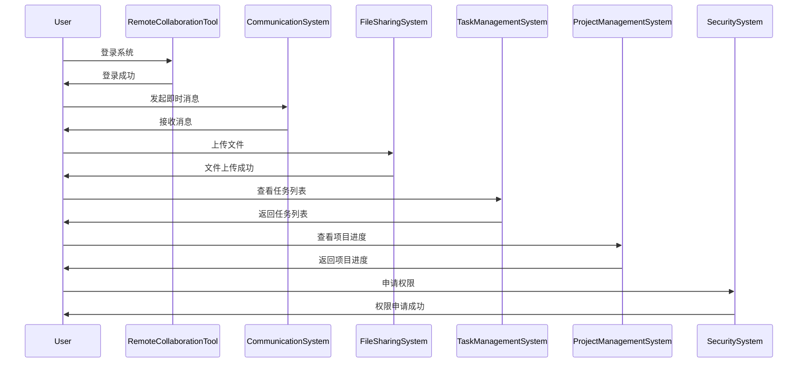
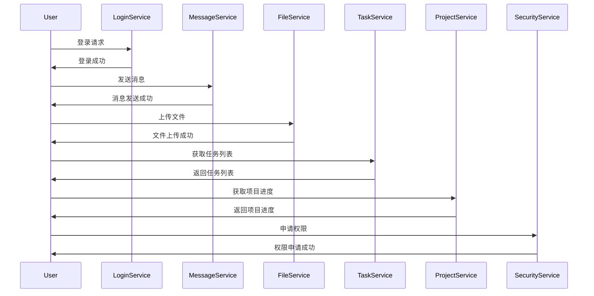

                 

# 远程协作工具：支持分布式AI团队高效工作

## 关键词
- 远程协作工具
- 分布式AI团队
- 高效工作
- AI大模型
- 实时沟通
- 文件共享
- 任务分配
- 项目管理
- 权限与安全

## 摘要
本文旨在探讨如何使用远程协作工具来支持分布式AI团队的高效工作。首先，我们将介绍远程协作的背景和远程协作工具需解决的问题，然后详细讲解AI大模型的定义和特点，接着分析远程协作工具的特点及其与AI大模型的关系。随后，我们将深入讲解AI大模型的工作原理，并探讨如何使用远程协作工具进行项目管理。最后，我们将通过实际案例来展示如何使用远程协作工具实现高效的工作。

## 第一部分：背景介绍

### 问题背景

随着信息技术的飞速发展，远程协作已经成为现代企业运营的重要组成部分。尤其是在全球化的背景下，越来越多的企业面临着跨地域、跨时区的团队协作需求。这种协作模式不仅带来了工作方式的变革，也对协作工具提出了更高的要求。

远程协作的优势在于：

1. **灵活性**：团队成员可以不受地理位置限制，随时随地进行协作。
2. **成本节约**：减少了通勤时间和费用，降低了企业运营成本。
3. **资源共享**：分布式团队可以更有效地共享资源和知识。

然而，远程协作也带来了一些挑战：

1. **沟通障碍**：由于地理位置和时差，团队之间的沟通变得更加复杂。
2. **协作效率**：如何在分散的团队之间实现高效协作，确保项目进度和质量。
3. **数据安全**：如何确保协作过程中数据的安全性和隐私性。

### 问题描述

远程协作工具需解决的核心问题是：如何在分散的团队之间实现高效、顺畅的沟通和协作，以提高工作效率、保证项目进度，同时降低沟通成本和协作风险。

### 问题解决

为了解决上述问题，我们需要从以下几个方面入手：

1. **实时沟通**：提供即时通讯工具，如即时消息、视频会议等，以便团队成员可以快速交流。
2. **文件共享与同步**：实现文件在团队成员之间的快速共享和同步，确保信息的一致性和实时性。
3. **任务分配与追踪**：通过协作平台，明确任务分配，实时追踪任务进度，确保每个团队成员都能清楚自己的工作内容和目标。
4. **项目管理**：提供项目管理功能，如任务列表、时间表、里程碑等，帮助团队管理者监控项目进度。
5. **权限与安全**：确保协作工具的安全性和权限管理，保护企业数据和信息安全。

### 边界与外延

1. **边界**：远程协作工具主要面向企业内部或团队之间的协作需求，不涉及公众或个人隐私信息的交换。
2. **外延**：随着技术的进步，远程协作工具的功能也在不断扩展，例如集成AI技术进行智能任务分配、会议纪要生成等。

### 概念结构与核心要素组成

1. **核心概念**：远程协作工具、分布式团队、实时沟通、文件共享、任务分配、项目管理、权限与安全。
2. **要素组成**：
   - 实时沟通系统：包括即时消息、视频会议、屏幕共享等。
   - 文件共享与同步系统：支持多平台文件同步、版本控制等。
   - 任务分配与追踪系统：包括任务列表、任务进度、通知提醒等。
   - 项目管理系统：包括任务规划、时间表、里程碑、项目报告等。
   - 权限与安全系统：包括用户权限管理、数据加密、访问控制等。

## 第二部分：核心概念与联系

### AI大模型的定义与特点

#### AI大模型的定义

AI大模型（如GPT-3、BERT等）是一种能够处理大规模数据并进行复杂任务的人工智能模型。这些模型通常具有数十亿甚至千亿级别的参数量，能够理解和生成人类语言，执行图像识别、自然语言处理等多种任务。

#### AI大模型的核心特点

- **规模巨大**：拥有庞大的参数量和庞大的训练数据集。
- **自主学习能力**：能够从海量数据中自动学习并提取特征。
- **通用性**：能够在多个任务和场景中表现出色。

#### AI大模型与传统AI的区别

- **传统AI**：主要指基于特定任务的人工智能系统，如专家系统、机器学习模型等。它们通常只能处理单一任务，并且需要为每个任务单独训练模型。
- **AI大模型**：具备更强大的通用性和适应性，能够处理多种类型的任务，并且可以持续学习，提高性能。

### 远程协作工具的特点

#### 实时沟通

- **即时消息**：提供即时通讯功能，支持文字、图片、文件等多种形式的信息交换。
- **视频会议**：支持多人大规模视频会议，提供屏幕共享、白板等功能。

#### 文件共享与同步

- **文件同步**：支持多平台文件同步，确保团队成员之间的文件实时更新。
- **版本控制**：支持文件版本控制，方便团队成员协作和追踪修改历史。

#### 任务分配与追踪

- **任务列表**：提供任务列表功能，明确任务分配和责任。
- **进度追踪**：实时追踪任务进度，提供通知提醒，确保任务按时完成。

#### 项目管理

- **任务规划**：提供任务规划功能，帮助团队管理者合理安排工作。
- **时间表**：提供项目时间表，明确项目里程碑和关键日期。
- **项目报告**：生成项目报告，提供项目进度和成果的详细记录。

#### 权限与安全

- **用户权限管理**：根据角色和职责，为用户提供不同的权限。
- **数据加密**：对传输和存储的数据进行加密，确保数据安全。
- **访问控制**：通过访问控制，限制对敏感信息的访问。

### 关系与联系

AI大模型与远程协作工具之间存在紧密的联系。AI大模型可以为远程协作工具提供智能化的功能，如智能任务分配、智能会议纪要生成等。同时，远程协作工具也为AI大模型提供了丰富的应用场景，如多人协作、项目管理和文件共享等。

### AI大模型与传统AI的联系与区别

#### 联系

- **共同目标**：都是为了解决复杂问题，提高工作效率。
- **技术基础**：都依赖于机器学习和深度学习技术。

#### 区别

- **应用范围**：传统AI主要应用于单一任务，AI大模型具备通用性，能够处理多种任务。
- **学习能力**：传统AI需要为每个任务单独训练模型，AI大模型可以通过持续学习提高性能。

### 核心概念与联系

#### ER实体关系图架构

```mermaid
erDiagram
    User ||--|{ Task }|>
    User ||--|{ Project }|>  
    Task ||--|{ Status }|>  
    Project ||--|{ Member }|>  
    Member ||--|{ Role }|>
```

#### 概念属性特征对比表格

| 特征       | AI大模型       | 传统AI           |
|------------|----------------|------------------|
| 参数规模   | 数十亿到千亿级 | 数万到数十万级   |
| 学习能力   | 自主学习       | 依赖于手动训练   |
| 应用范围   | 多任务、通用   | 单任务、专用     |
| 性能提升   | 持续学习       | 需要重新训练     |

## 第三部分：算法原理讲解

### AI大模型算法原理

#### GPT模型

GPT（Generative Pre-trained Transformer）模型是基于Transformer架构的预训练语言模型。其基本原理是通过自回归语言模型（ARLM）的方法，从大规模文本数据中学习语言规律，从而能够生成文本或完成语言任务。

#### GPT模型的工作流程

1. **数据预处理**：将文本数据转换为词向量表示。
2. **预训练**：通过自回归方式训练模型，使其能够预测下一个词。
3. **微调**：在特定任务上对模型进行微调，以适应具体任务需求。

#### GPT模型的数学模型

GPT模型的数学模型基于自回归语言模型（ARLM）。对于给定的序列\(x_1, x_2, ..., x_T\)，模型的目标是预测下一个词\(x_{T+1}\)。

$$
P(x_{T+1} | x_1, x_2, ..., x_T) = \frac{1}{Z} \sum_{w} e^{<w, h_{T}>}
$$

其中，\(h_{T}\)是模型的隐藏状态，\(<w, h_{T}>\)是词向量\(w\)和隐藏状态\(h_{T}\)的点积，\(Z\)是归一化常数。

#### GPT模型的代码实现

```python
import torch
import torch.nn as nn
import torch.optim as optim

# 定义GPT模型
class GPT(nn.Module):
    def __init__(self, vocab_size, d_model, n_head, d_inner, n_layer, dropout):
        super(GPT, self).__init__()
        self嵌入层 = nn.Embedding(vocab_size, d_model)
        self.transformer = nn.Transformer(d_model, n_head, d_inner, n_layer, dropout)
        self.fc = nn.Linear(d_model, vocab_size)

    def forward(self, x):
        x = self嵌入层(x)
        x = self.transformer(x)
        x = self.fc(x)
        return x
```

#### GPT模型的例子

```python
# 初始化模型
model = GPT(vocab_size=10000, d_model=512, n_head=8, d_inner=2048, n_layer=3, dropout=0.1)

# 设置损失函数和优化器
criterion = nn.CrossEntropyLoss()
optimizer = optim.Adam(model.parameters(), lr=0.001)

# 训练模型
for epoch in range(10):
    for x, y in data_loader:
        optimizer.zero_grad()
        output = model(x)
        loss = criterion(output, y)
        loss.backward()
        optimizer.step()
```

### 远程协作工具的算法原理

#### 实时沟通算法

实时沟通是远程协作工具的核心功能之一。其主要算法包括：

- **即时消息传输**：基于WebSocket协议实现实时消息传输。
- **视频会议编码与解码**：使用H.264或H.265编码标准进行视频数据的压缩和传输。
- **屏幕共享**：基于图形加速技术实现屏幕共享。

#### 文件共享与同步算法

文件共享与同步是确保团队成员之间信息一致性的关键。其主要算法包括：

- **分布式哈希表（DHT）**：用于快速定位和同步文件。
- **版本控制**：基于Git算法实现文件的版本控制和历史追踪。

#### 任务分配与追踪算法

任务分配与追踪算法包括：

- **任务分配**：基于优先级和资源可用性进行任务分配。
- **任务追踪**：使用状态机模型记录任务的状态变化。

#### 项目管理算法

项目管理算法包括：

- **任务规划**：基于关键路径法（CPM）和项目管理软件（如Gantt图）进行任务规划。
- **时间表生成**：基于时间序列预测模型（如ARIMA模型）生成项目时间表。

#### 权限与安全算法

权限与安全算法包括：

- **用户权限管理**：基于角色和权限矩阵进行用户权限管理。
- **数据加密**：使用AES加密算法对传输和存储的数据进行加密。

### 关系与联系

AI大模型与远程协作工具的算法原理之间存在紧密的联系。AI大模型可以用于智能任务分配、智能会议纪要生成等，而远程协作工具的算法则可以用于实时沟通、文件共享、任务分配和项目管理等。两者结合，可以进一步提升分布式AI团队的工作效率和协作效果。

### 远程协作工具与AI大模型的关系

#### AI大模型在远程协作工具中的应用

- **智能任务分配**：AI大模型可以分析团队成员的技能和项目需求，自动分配合适的任务。
- **智能会议纪要生成**：AI大模型可以自动记录会议内容，生成会议纪要。
- **智能预测与决策**：AI大模型可以基于历史数据和实时数据，预测项目进度，提供决策支持。

#### 远程协作工具对AI大模型的贡献

- **数据来源**：远程协作工具提供了丰富的实时数据，为AI大模型提供了数据基础。
- **应用场景**：远程协作工具为AI大模型提供了丰富的应用场景，如任务分配、项目管理等。
- **优化与迭代**：远程协作工具的使用情况可以为AI大模型提供反馈，帮助其不断优化和迭代。

### 远程协作工具与AI大模型的关系ER实体关系图

```mermaid
erDiagram
    RemoteTool ||--|{AITool} AITool
    RemoteTool ||--|{TeamMember} TeamMember
    AITool ||--|{TaskAssignment} TaskAssignment
    AITool ||--|{MeetingSummary} MeetingSummary
    TeamMember ||--|{ProjectManagement} ProjectManagement
```

## 第四部分：系统分析与架构设计

### 问题场景介绍

在分布式AI团队中，由于团队成员分散在不同地理位置，如何高效地进行沟通和协作成为了关键挑战。为了解决这个问题，需要设计一套远程协作工具，支持实时沟通、文件共享、任务分配、项目管理和权限与安全等功能。

### 项目介绍

本项目旨在开发一款支持分布式AI团队的远程协作工具。该工具需要满足以下需求：

1. **实时沟通**：提供即时消息、视频会议和屏幕共享功能。
2. **文件共享与同步**：支持多平台文件同步和版本控制。
3. **任务分配与追踪**：明确任务分配，实时追踪任务进度。
4. **项目管理**：提供任务规划、时间表和项目报告等功能。
5. **权限与安全**：确保协作工具的安全性和权限管理。

### 系统功能设计

#### 实时沟通系统

- **即时消息**：支持文本、图片、文件等多种形式的信息交换。
- **视频会议**：支持多人大规模视频会议，提供屏幕共享、白板等功能。
- **屏幕共享**：支持远程屏幕共享，方便团队成员协作。

#### 文件共享与同步系统

- **文件同步**：支持多平台文件同步，确保团队成员之间的文件实时更新。
- **版本控制**：支持文件版本控制，方便团队成员协作和追踪修改历史。

#### 任务分配与追踪系统

- **任务列表**：提供任务列表功能，明确任务分配和责任。
- **进度追踪**：实时追踪任务进度，提供通知提醒，确保任务按时完成。

#### 项目管理系统

- **任务规划**：提供任务规划功能，帮助团队管理者合理安排工作。
- **时间表**：提供项目时间表，明确项目里程碑和关键日期。
- **项目报告**：生成项目报告，提供项目进度和成果的详细记录。

#### 权限与安全系统

- **用户权限管理**：根据角色和职责，为用户提供不同的权限。
- **数据加密**：对传输和存储的数据进行加密，确保数据安全。
- **访问控制**：通过访问控制，限制对敏感信息的访问。

### 系统架构设计

#### 系统架构图



### 系统接口设计

#### 接口设计

- **登录接口**：用于用户登录系统。
- **消息接口**：用于发送和接收即时消息。
- **文件上传接口**：用于上传文件。
- **任务列表接口**：用于获取任务列表。
- **项目进度接口**：用于获取项目进度。
- **权限申请接口**：用于用户申请权限。

### 系统交互

#### 序列图



## 第五部分：项目实战

### 环境安装

在开始项目实战之前，我们需要安装一些必要的软件和库。

#### 1. 安装Python

确保你的计算机上已经安装了Python。你可以从[Python官网](https://www.python.org/)下载并安装Python。

#### 2. 安装Docker

安装Docker可以简化应用部署和容器化。你可以在[Docker官网](https://www.docker.com/)下载并安装Docker。

#### 3. 安装Node.js

Node.js是一个基于Chrome V8引擎的JavaScript运行环境。你可以在[Node.js官网](https://nodejs.org/)下载并安装Node.js。

#### 4. 安装相关库

使用pip命令安装以下库：

```bash
pip install flask
pip install docker
pip install markdown
```

### 系统核心实现

#### 1. 远程协作工具Web后端

使用Flask框架实现远程协作工具的Web后端。以下是一个简单的示例：

```python
from flask import Flask, jsonify, request

app = Flask(__name__)

@app.route('/login', methods=['POST'])
def login():
    username = request.form['username']
    password = request.form['password']
    # 验证用户名和密码
    # ...
    return jsonify({'status': 'success'})

@app.route('/message', methods=['POST'])
def send_message():
    message = request.form['message']
    # 发送消息
    # ...
    return jsonify({'status': 'success'})

if __name__ == '__main__':
    app.run(debug=True)
```

#### 2. 实时沟通系统

使用WebSocket协议实现实时沟通系统。以下是一个简单的示例：

```python
import websocket
import json

def on_open(ws):
    ws.send(json.dumps({'action': 'login', 'username': 'user1'}))

def on_message(ws, message):
    print(f"Received message: {message}")

def on_error(ws, error):
    print(f"Error: {error}")

def on_close(ws):
    print("Connection closed")

if __name__ == '__main__':
    ws = websocket.WebSocketApp("wss://example.com/socket",
                                 on_open=on_open,
                                 on_message=on_message,
                                 on_error=on_error,
                                 on_close=on_close)

    ws.run_forever()
```

#### 3. 文件共享与同步系统

使用Docker实现文件共享与同步系统。以下是一个简单的Dockerfile示例：

```Dockerfile
FROM python:3.9

WORKDIR /app

COPY requirements.txt ./
RUN pip install -r requirements.txt

COPY . .

CMD ["python", "app.py"]
```

### 代码应用解读与分析

#### 1. 远程协作工具Web后端

上述示例展示了如何使用Flask框架实现远程协作工具的Web后端。主要包含两个API接口：登录接口和消息接口。登录接口用于用户登录系统，消息接口用于发送和接收即时消息。

#### 2. 实时沟通系统

实时沟通系统使用WebSocket协议实现。通过WebSocket连接，用户可以实时接收和发送消息。

```python
def on_open(ws):
    ws.send(json.dumps({'action': 'login', 'username': 'user1'}))

def on_message(ws, message):
    print(f"Received message: {message}")

def on_error(ws, error):
    print(f"Error: {error}")

def on_close(ws):
    print("Connection closed")

if __name__ == '__main__':
    ws = websocket.WebSocketApp("wss://example.com/socket",
                                 on_open=on_open,
                                 on_message=on_message,
                                 on_error=on_error,
                                 on_close=on_close)

    ws.run_forever()
```

#### 3. 文件共享与同步系统

文件共享与同步系统使用Docker实现。通过Dockerfile，我们可以将应用程序容器化，并使用volume实现文件共享与同步。

```Dockerfile
FROM python:3.9

WORKDIR /app

COPY requirements.txt ./
RUN pip install -r requirements.txt

COPY . .

CMD ["python", "app.py"]
```

### 实际案例分析和详细讲解剖析

#### 案例一：分布式AI团队使用远程协作工具进行项目开发

假设我们有一个分布式AI团队，团队成员分布在不同的地理位置。他们使用远程协作工具进行项目开发，具体流程如下：

1. **项目规划**：团队负责人使用远程协作工具的项目管理系统制定项目计划，包括任务分配、时间表和里程碑。
2. **任务分配**：AI大模型根据团队成员的技能和项目需求，自动分配任务。
3. **实时沟通**：团队成员通过远程协作工具的实时沟通系统进行协作，讨论项目进展和问题。
4. **文件共享与同步**：团队成员共享项目文件，并使用版本控制确保文件一致性。
5. **进度追踪**：团队负责人实时追踪任务进度，确保项目按时完成。
6. **项目报告**：项目完成后，生成项目报告，记录项目进度和成果。

#### 案例二：AI大模型与远程协作工具的结合

假设我们有一个AI大模型，用于生成文本。团队使用远程协作工具与AI大模型结合，实现以下功能：

1. **智能任务分配**：AI大模型分析团队成员的技能和项目需求，自动分配任务。
2. **智能会议纪要生成**：AI大模型记录会议内容，生成会议纪要。
3. **智能预测与决策**：AI大模型基于历史数据和实时数据，预测项目进度，提供决策支持。

### 项目小结

通过以上实际案例，我们可以看到远程协作工具在分布式AI团队中的重要作用。远程协作工具不仅提高了团队的工作效率，还降低了沟通成本和协作风险。同时，AI大模型与远程协作工具的结合，进一步提升了团队的工作智能化水平。未来，随着技术的不断进步，远程协作工具和AI大模型的应用将更加广泛，为团队协作带来更多创新和变革。

## 第六部分：最佳实践与拓展阅读

### 最佳实践

1. **实时沟通**：确保所有团队成员都熟悉和使用实时沟通工具，减少沟通障碍。
2. **文件共享与同步**：建立清晰的文件命名规范和版本控制策略，确保文件的一致性和可追溯性。
3. **任务分配与追踪**：明确任务分配，实时追踪任务进度，确保每个成员都能清楚自己的工作内容和目标。
4. **项目管理**：使用项目管理工具，如Gantt图，合理安排任务和时间，确保项目按时完成。
5. **权限与安全**：确保协作工具的安全性和权限管理，保护企业数据和信息安全。

### 拓展阅读

1. **《远程协作的最佳实践》**：了解如何有效地在远程环境中进行团队协作。
2. **《AI大模型与深度学习》**：深入了解AI大模型的工作原理和应用场景。
3. **《Docker实战》**：学习如何使用Docker进行应用部署和容器化。
4. **《Python网络编程》**：掌握Python网络编程技术，实现高效的远程协作工具。
5. **《人工智能项目实战》**：学习如何将AI大模型应用于实际项目，提高工作效率。

## 第七部分：作者信息

作者：AI天才研究院/AI Genius Institute & 禅与计算机程序设计艺术 /Zen And The Art of Computer Programming

## 结语

远程协作工具在分布式AI团队中的应用具有重要意义。通过实时沟通、文件共享、任务分配、项目管理和权限与安全等功能，远程协作工具能够显著提高团队的工作效率和协作效果。同时，AI大模型与远程协作工具的结合，为团队协作带来了更多的智能化和自动化。在未来，随着技术的不断进步，远程协作工具和AI大模型的应用将更加广泛，为团队协作带来更多的创新和变革。

