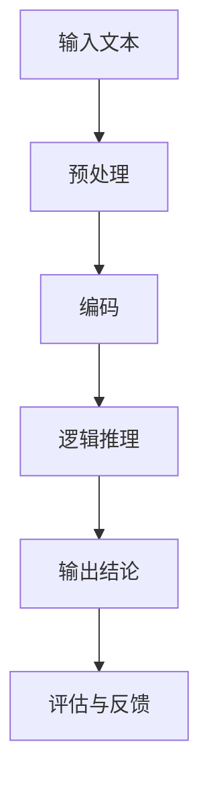
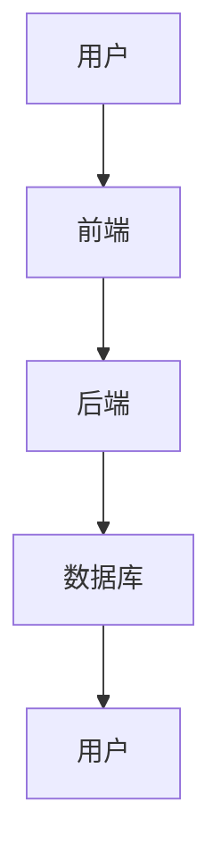
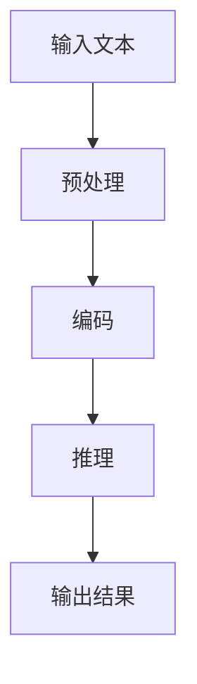
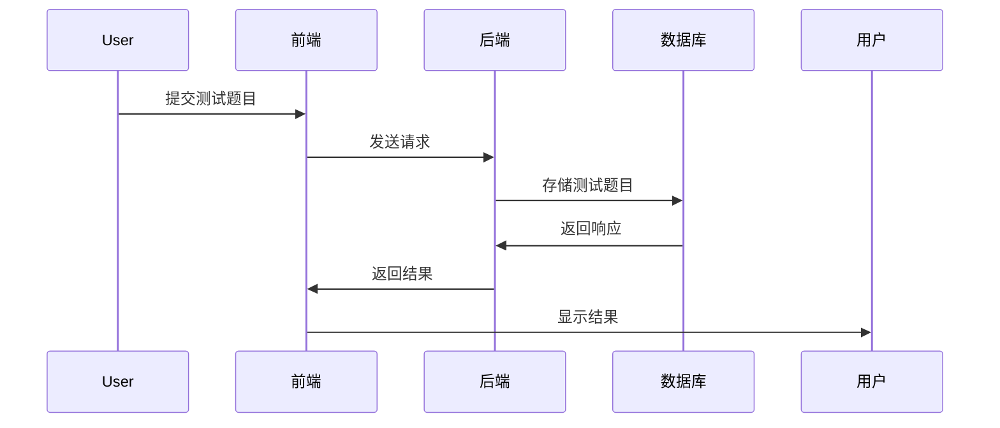

                 

# 逻辑推理能力评测：测试LLM的问题解决能力

## 关键词
- 逻辑推理能力
- LLM（语言模型）
- 问题解决能力
- 测试与评估
- AI技术

## 摘要
本文旨在探讨如何评测大型语言模型（LLM）的逻辑推理能力。通过详细的分析和逐步推理，本文将介绍LLM逻辑推理能力的背景、测试方法、核心概念、算法原理、系统设计与实战案例，旨在为AI领域的研究者和开发者提供有价值的参考。

## 第一部分：背景介绍

### 1.1 问题背景

#### 1.1.1 逻辑推理能力的重要性
逻辑推理能力是人类智能的核心组成部分，它使我们能够从已知信息中推断出新信息，进行决策和解决问题。在人工智能领域，逻辑推理能力尤为重要，因为它是实现智能代理、自动化系统和智能决策的基础。

#### 1.1.2 LLM在逻辑推理中的应用
大型语言模型（LLM）如GPT-3、BERT等，通过训练掌握了大量的语言知识，表现出了一定的逻辑推理能力。然而，如何科学地评测这些模型的逻辑推理能力，以及如何优化和提高这种能力，成为了一个重要的研究课题。

#### 1.1.3 当前LLM逻辑推理能力的现状
尽管LLM在自然语言处理任务上取得了显著成绩，但其在逻辑推理方面的表现仍存在局限性。当前的研究主要集中在开发更有效的测试方法和改进模型设计。

### 1.2 问题描述

#### 1.2.1 如何测试LLM的逻辑推理能力
我们需要设计一套能够全面评估LLM逻辑推理能力的测试方法，涵盖不同类型的逻辑推理任务，如演绎推理、归纳推理和类比推理。

#### 1.2.2 测试内容的范围和标准
测试内容应包括基础逻辑推理任务、复杂逻辑推理任务和特定领域的逻辑推理任务，以评估LLM在不同情境下的表现。测试标准应具备客观性、一致性和可重复性。

#### 1.2.3 测试过程中的挑战
测试过程中面临的挑战包括如何设计具有代表性的测试题目、如何确保测试结果的可靠性和有效性，以及如何处理模型在测试中的不确定性和错误。

### 1.3 问题解决

#### 1.3.1 设计测试题的方法
我们可以通过编写逻辑推理题目库，结合自动生成和人工编制的方法，确保测试题目的全面性和代表性。

#### 1.3.2 数据收集与分析
通过大规模测试收集数据，对LLM在各个测试题目上的表现进行分析，识别优势和不足。

#### 1.3.3 结果评估与反馈
根据测试结果，评估LLM的逻辑推理能力，并给出改进建议，以指导后续的研究和开发。

### 1.4 边界与外延

#### 1.4.1 测试的有效性和可靠性
测试的有效性和可靠性取决于测试题目的质量、数据收集的全面性和分析方法的科学性。

#### 1.4.2 不同领域的逻辑推理能力差异
不同领域的逻辑推理能力存在差异，例如数学逻辑推理和哲学逻辑推理。测试应考虑这些差异，设计相应的评估指标。

#### 1.4.3 LLM逻辑推理能力的未来发展趋势
随着AI技术的发展，LLM的逻辑推理能力将不断提高。未来研究方向可能包括增强模型的推理能力、开发更先进的测试方法以及探索跨领域的逻辑推理。

### 1.5 概念结构与核心要素组成

#### 1.5.1 LLM的基本概念
LLM是一种预训练的语言模型，通过在大量文本数据上训练，掌握了丰富的语言知识和模式。

#### 1.5.2 逻辑推理能力的定义
逻辑推理能力是指从已知信息中推断出新信息的能力，包括演绎推理、归纳推理和类比推理。

#### 1.5.3 测试LLM逻辑推理能力的核心要素
核心要素包括测试题目的设计、测试数据的收集和分析、测试结果的评估与反馈。

## 第二部分：核心概念与联系

### 2.1 LLM核心概念原理

#### 2.1.1 LLM的基本原理
LLM基于深度学习技术，通过多层神经网络学习文本数据中的语言结构和语义信息。

#### 2.1.2 LLM的训练过程
LLM的训练过程包括数据预处理、模型训练和模型优化。

#### 2.1.3 LLM的结构和组成部分
LLM的结构通常包括输入层、隐藏层和输出层，其中隐藏层通过训练学习到语言的深层表示。

### 2.2 逻辑推理能力属性特征对比表格

#### 2.2.1 逻辑推理能力的属性
逻辑推理能力的属性包括推理速度、推理准确性、推理深度和推理广度。

#### 2.2.2 不同类型的逻辑推理能力对比
不同类型的逻辑推理能力在应用场景和表现上存在差异，例如演绎推理在数学领域具有优势，而归纳推理在数据分析中应用广泛。

#### 2.2.3 LLM在逻辑推理能力上的优势
LLM在逻辑推理能力上的优势主要体现在其强大的语言理解和生成能力，以及在处理复杂逻辑推理任务时的灵活性和适应性。

### 2.3 ER实体关系图架构

#### 2.3.1 ER图的基本概念
实体关系图（ER图）用于描述系统中实体之间的关系。

#### 2.3.2 LLM与逻辑推理能力的实体关系
LLM作为实体，与逻辑推理能力实体之间存在训练、应用和评估等关系。

#### 2.3.3 ER图在测试设计中的应用
ER图可以用于设计测试题目库，明确各个测试题目与LLM逻辑推理能力的关联。

```mermaid
erDiagram
  LLMBasicKnowledge &&|--> LogicReasoning : has_required_knowledge
  DataCollection &&|--> LogicReasoning : used_for_evaluation
  ResultAnalysis &&|--> LogicReasoning : for_improvement
```

## 第三部分：算法原理讲解

### 3.1 算法原理

#### 3.1.1 LLM的逻辑推理算法
LLM的逻辑推理算法基于神经网络，通过学习文本数据中的逻辑结构来推断结论。

#### 3.1.2 算法流程
算法流程包括输入文本、逻辑推理、输出结论。

#### 3.1.3 算法实现
算法实现通常涉及预训练和微调两个阶段。

### 3.2 数学模型和公式

#### 3.2.1 LLM逻辑推理的数学模型
LLM逻辑推理的数学模型通常包括神经网络模型和注意力机制。

#### 3.2.2 常用数学公式
常用的数学公式包括损失函数、梯度下降和反向传播。

#### 3.2.3 数学模型的应用
数学模型在LLM逻辑推理中的应用包括优化模型参数、提高推理准确性等。

### 3.3 算法流程图

#### 3.3.1 LLM逻辑推理算法流程图



#### 3.3.2 算法流程图的详细解释
算法流程图详细解释了LLM从输入文本到输出结论的整个逻辑推理过程。

### 3.4 Python源代码实现

#### 3.4.1 算法原理的Python代码实现
Python代码实现了LLM逻辑推理算法的基本原理。

#### 3.4.2 代码功能说明
代码功能说明包括输入文本预处理、编码、逻辑推理和输出结论。

```python
# Example of a simple Python code for LLM logic reasoning
def reason_with_llm(input_text):
    # Preprocessing
    processed_text = preprocess_text(input_text)
    
    # Encoding
    encoded_text = encode_text(processed_text)
    
    # Logic Reasoning
    conclusion = logic_reasoning(encoded_text)
    
    # Output Conclusion
    return conclusion

# Example usage
input_text = "What is the sum of 2 and 3?"
print(reason_with_llm(input_text))
```

#### 3.4.3 代码应用解读与分析
代码应用解读与分析包括输入文本预处理、编码和逻辑推理的具体实现。

## 第四部分：系统分析与架构设计

### 4.1 问题场景介绍

#### 4.1.1 LLM逻辑推理能力测试的场景
场景包括逻辑推理测试平台的搭建、测试题目的生成和测试结果的评估。

#### 4.1.2 项目介绍
项目介绍包括项目的目标、功能和技术架构。

### 4.2 系统功能设计

#### 4.2.1 领域模型
领域模型描述了系统涉及的领域知识和逻辑推理任务。

```mermaid
classDiagram
  LogicQuestion <<interface>>
  TestQuestion <<interface>>
  Answer <<interface>>

  LogicQuestion "生成" TestQuestion
  TestQuestion "关联" Answer
```

#### 4.2.2 系统功能设计
系统功能设计包括测试题目的生成、测试过程的执行和测试结果的评估。

### 4.3 系统架构设计

#### 4.3.1 系统架构
系统架构包括前端、后端和数据库三部分。

```mermaid
sequenceDiagram
  User -->|提交题目| TestSystem
  TestSystem -->|生成题目| QuestionGenerator
  QuestionGenerator -->|返回题目| TestSystem
  TestSystem -->|执行测试| AnswerSystem
  AnswerSystem -->|返回结果| TestSystem
  TestSystem -->|展示结果| User
```

#### 4.3.2 架构设计
架构设计包括前后端分离、数据存储和缓存策略。

### 4.4 系统接口设计和系统交互

#### 4.4.1 系统接口设计
系统接口设计包括API接口和Web界面。

#### 4.4.2 系统交互
系统交互描述了用户与系统之间的交互流程。

### 4.5 Mermaid流程图

#### 4.5.1 Mermaid流程图的应用
Mermaid流程图用于描述系统架构和交互流程。



#### 4.5.2 Mermaid流程图的详细解释
流程图详细解释了系统的整体架构和用户交互流程。

## 第五部分：项目实战

### 5.1 环境安装

#### 5.1.1 环境安装步骤
环境安装步骤包括安装Python、依赖库和数据库。

#### 5.1.2 常见问题解决
常见问题解决包括依赖库安装失败和网络连接问题。

### 5.2 系统核心实现

#### 5.2.1 系统核心实现流程
系统核心实现流程包括前端开发、后端开发和数据库设计。

#### 5.2.2 核心代码解读
核心代码解读包括测试题目的生成和测试结果的评估。

```python
# Example of core code for generating test questions
def generate_test_questions():
    # Generate logic questions based on domain knowledge
    questions = ["What is the capital of France?", "What is 7 + 5?"]
    return questions

# Example of core code for evaluating test results
def evaluate_test_results(questions, answers):
    # Evaluate answers based on correctness
    correct_answers = ["Paris", "12"]
    for question, answer in zip(questions, answers):
        if answer == correct_answers[questions.index(question)]:
            print("Correct!")
        else:
            print("Incorrect.")
```

#### 5.3 代码应用解读与分析
代码应用解读与分析包括代码实现的具体功能和作用。

### 5.4 实际案例分析

#### 5.4.1 案例背景
案例背景包括实际应用场景和测试需求。

#### 5.4.2 案例分析
案例分析包括系统实现和测试结果的分析。

### 5.5 详细讲解剖析

#### 5.5.1 详细讲解
详细讲解包括系统设计、代码实现和测试过程。

#### 5.5.2 剖析结果
剖析结果包括系统性能和测试结果的评估。

### 5.6 项目小结

#### 5.6.1 项目总结
项目总结包括项目目标和实际成果。

#### 5.6.2 项目亮点
项目亮点包括系统功能和性能的优势。

#### 5.6.3 不足与改进
不足与改进包括项目中的问题和改进方向。

## 第六部分：最佳实践

### 6.1 最佳实践

#### 6.1.1 最佳实践建议
最佳实践建议包括系统设计和测试方法。

#### 6.1.2 经验总结
经验总结包括项目实施中的经验和教训。

### 6.2 小结

#### 6.2.1 全书内容小结
全书内容小结包括核心概念、算法原理和系统设计。

#### 6.2.2 核心知识点回顾
核心知识点回顾包括LLM的逻辑推理能力和测试方法。

### 6.3 注意事项

#### 6.3.1 注意事项
注意事项包括系统安装和使用的注意事项。

#### 6.3.2 操作建议
操作建议包括实际操作中的建议和技巧。

### 6.4 拓展阅读

#### 6.4.1 相关书籍推荐
相关书籍推荐包括人工智能和逻辑推理领域的经典书籍。

#### 6.4.2 论文推荐
论文推荐包括LLM逻辑推理能力评测的最新研究成果。

---

**作者：AI天才研究院/AI Genius Institute & 禅与计算机程序设计艺术 /Zen And The Art of Computer Programming**## 逻辑推理能力评测：测试LLM的问题解决能力

### 第一部分：背景介绍

#### 1.1 问题背景

逻辑推理能力是人类智能的核心组成部分，它使我们能够从已知信息中推断出新信息，进行决策和解决问题。在人工智能领域，逻辑推理能力尤为重要，因为它是实现智能代理、自动化系统和智能决策的基础。近年来，随着深度学习技术的快速发展，大型语言模型（LLM）如GPT-3、BERT等，通过训练掌握了大量的语言知识，表现出了一定的逻辑推理能力。然而，如何科学地评测这些模型的逻辑推理能力，以及如何优化和提高这种能力，成为了一个重要的研究课题。

LLM在逻辑推理中的应用主要集中在自然语言处理任务，如文本生成、语义理解、问答系统等。这些任务需要模型具备较强的逻辑推理能力，以处理复杂的文本结构和语义关系。当前，LLM在逻辑推理方面的表现仍存在局限性，尤其是在处理复杂推理任务和跨领域推理时。因此，如何评估LLM的逻辑推理能力，找出其优势和不足，指导后续的研究和开发，具有重要意义。

#### 1.2 问题描述

为了评测LLM的逻辑推理能力，我们需要设计一套全面的测试方法。这一方法应包括不同类型的逻辑推理任务，如演绎推理、归纳推理和类比推理，以覆盖LLM在不同情境下的逻辑推理能力。同时，测试内容应具备客观性、一致性和可重复性，以确保测试结果的可靠性和有效性。

在测试过程中，我们面临以下挑战：

1. **测试题目的设计**：需要设计具有代表性的逻辑推理题目，能够全面评估LLM在不同类型逻辑推理任务上的表现。
2. **数据收集与分析**：需要收集大量测试数据，对LLM在各个测试题目上的表现进行分析，以便识别其优势和不足。
3. **测试结果的评估与反馈**：需要根据测试结果，对LLM的逻辑推理能力进行评估，并给出改进建议，以指导后续的研究和开发。

#### 1.3 问题解决

为了解决上述问题，我们提出以下解决方案：

1. **设计测试题的方法**：通过编写逻辑推理题目库，结合自动生成和人工编制的方法，确保测试题目的全面性和代表性。
2. **数据收集与分析**：通过大规模测试收集数据，对LLM在各个测试题目上的表现进行分析，识别优势和不足。
3. **结果评估与反馈**：根据测试结果，评估LLM的逻辑推理能力，并给出改进建议，以指导后续的研究和开发。

#### 1.4 边界与外延

在评测LLM逻辑推理能力时，我们需要考虑以下边界和外延：

1. **测试的有效性和可靠性**：测试的有效性和可靠性取决于测试题目的质量、数据收集的全面性和分析方法的科学性。
2. **不同领域的逻辑推理能力差异**：不同领域的逻辑推理能力存在差异，例如数学逻辑推理和哲学逻辑推理。测试应考虑这些差异，设计相应的评估指标。
3. **LLM逻辑推理能力的未来发展趋势**：随着AI技术的发展，LLM的逻辑推理能力将不断提高。未来研究方向可能包括增强模型的推理能力、开发更先进的测试方法以及探索跨领域的逻辑推理。

#### 1.5 概念结构与核心要素组成

在评测LLM逻辑推理能力时，理解以下几个核心概念和要素至关重要：

1. **LLM的基本概念**：LLM是一种预训练的语言模型，通过在大量文本数据上训练，掌握了丰富的语言知识和模式。
2. **逻辑推理能力的定义**：逻辑推理能力是指从已知信息中推断出新信息的能力，包括演绎推理、归纳推理和类比推理。
3. **测试LLM逻辑推理能力的核心要素**：核心要素包括测试题目的设计、测试数据的收集和分析、测试结果的评估与反馈。

### 第二部分：核心概念与联系

#### 2.1 LLM核心概念原理

大型语言模型（LLM）的核心概念包括以下几个方面：

1. **基本原理**：LLM基于深度学习技术，通过多层神经网络学习文本数据中的语言结构和语义信息。具体来说，LLM通过预训练和微调两个阶段来学习语言知识。在预训练阶段，模型在大量未标注的文本数据上学习语言的基本规律和模式。在微调阶段，模型根据特定任务进行调整，以提高在目标任务上的性能。

2. **训练过程**：LLM的训练过程包括数据预处理、模型训练和模型优化。数据预处理涉及文本清洗、分词、词向量编码等操作。模型训练使用的是基于梯度的优化算法，如随机梯度下降（SGD）和Adam优化器。模型优化主要通过调整模型参数，提高其在特定任务上的性能。

3. **结构和组成部分**：LLM的结构通常包括输入层、隐藏层和输出层。输入层接收文本数据，隐藏层通过神经网络学习文本的深层表示，输出层生成文本输出。LLM中的隐藏层通常包含多个子层，每个子层都负责学习不同的语言特征。此外，LLM还使用了注意力机制，能够关注文本中的重要信息，提高推理和生成的质量。

#### 2.2 逻辑推理能力属性特征对比表格

逻辑推理能力具有多种属性特征，以下是一个简单的对比表格：

| 特性      | 演绎推理 | 归纳推理 | 类比推理 |
|-----------|-----------|-----------|-----------|
| 推理速度  | 较快      | 较慢      | 中等      |
| 推理准确性 | 高        | 中        | 中        |
| 推理深度  | 较深      | 较浅      | 中等      |
| 推理广度  | 较窄      | 较宽      | 较窄      |

从表格中可以看出，不同类型的逻辑推理在速度、准确性、深度和广度上存在差异。演绎推理通常具有最高的准确性和深度，但速度较慢；归纳推理速度较慢，但能够发现新的规律；类比推理速度中等，适用于相似情境的推理。

#### 2.3 ER实体关系图架构

实体关系图（ER图）是一种用于描述系统中实体之间关系的图形表示方法。在评测LLM逻辑推理能力时，ER图可以帮助我们清晰地描述LLM与逻辑推理能力之间的关系。

以下是一个简单的ER图示例：

```mermaid
erDiagram
  LLM &&|--> TestQuestion : generates
  LLM &&|--> Answer : generates
  TestQuestion &&|--> Answer : answers
```

在这个ER图中，LLM（大型语言模型）是核心实体，它生成测试题目（TestQuestion）和答案（Answer）。测试题目回答（Answer）与测试题目之间有直接关联，表示测试题目是通过答案来评估的。

#### 2.3.1 ER图的基本概念

ER图的基本概念包括：

- **实体**：在ER图中，实体是具有共同属性的对象集合。例如，LLM、测试题目和答案是三个不同的实体。
- **属性**：实体具有的特性。例如，测试题目的属性可以是题目类型、难度等。
- **关系**：实体之间的关联。例如，LLM生成测试题目和答案，测试题目回答答案。

#### 2.3.2 LLM与逻辑推理能力的实体关系

在LLM与逻辑推理能力的实体关系中，LLM是核心实体，它与测试题目和答案之间存在生成和回答的关系。这种关系体现了LLM在逻辑推理能力评测中的作用。

#### 2.3.3 ER图在测试设计中的应用

ER图在测试设计中的应用主要体现在以下几个方面：

1. **明确测试题目的来源**：通过ER图，我们可以清楚地了解测试题目的生成来源，确保题目的全面性和代表性。
2. **描述测试题目的属性**：ER图可以帮助我们定义测试题目的属性，如题目类型、难度等，为后续的测试评估提供依据。
3. **关联测试结果与答案**：ER图能够明确地描述测试题目与答案之间的关系，便于对测试结果进行分析和评估。

### 第三部分：算法原理讲解

#### 3.1 算法原理

LLM的逻辑推理算法基于深度学习技术，其核心思想是通过多层神经网络学习文本数据中的语言结构和语义信息，从而实现逻辑推理。以下是LLM逻辑推理算法的基本原理：

1. **输入处理**：首先，LLM接收文本输入，经过预处理（如分词、去停用词等）后，转化为数字化的表示（如词向量）。
2. **编码**：输入文本通过编码层（如Embedding层）转换为固定长度的向量表示，这些向量表示了文本的语义信息。
3. **推理**：编码后的文本向量输入到神经网络中，神经网络通过层层传递和计算，逐步提取文本的深层语义特征，最终生成推理结果。
4. **输出**：推理结果通过输出层（如Softmax层）转化为概率分布，输出可能的逻辑推理结果。

#### 3.1.1 LLM的逻辑推理算法

LLM的逻辑推理算法主要包括以下几个步骤：

1. **文本预处理**：对输入文本进行清洗、分词和词向量编码，将文本转化为可计算的数字表示。
2. **编码**：使用Embedding层对文本进行编码，生成固定长度的向量表示。
3. **推理**：将编码后的文本向量输入到神经网络中，通过多层网络传递和计算，提取文本的深层语义特征。
4. **输出**：根据神经网络的输出，生成逻辑推理结果。

#### 3.1.2 算法流程

LLM的逻辑推理算法流程如下：

1. **输入文本**：接收待推理的文本输入。
2. **预处理**：对输入文本进行清洗、分词和词向量编码。
3. **编码**：使用Embedding层对文本进行编码，生成固定长度的向量表示。
4. **推理**：将编码后的文本向量输入到神经网络中，通过多层网络传递和计算，提取文本的深层语义特征。
5. **输出**：根据神经网络的输出，生成逻辑推理结果。

#### 3.1.3 算法实现

LLM的逻辑推理算法实现通常涉及以下几个步骤：

1. **模型构建**：构建基于深度学习技术的神经网络模型，如Transformer模型、BERT模型等。
2. **训练**：使用大量文本数据对神经网络模型进行训练，优化模型参数。
3. **评估**：在训练集和测试集上评估模型性能，调整模型参数。
4. **推理**：使用训练好的模型对输入文本进行逻辑推理，生成推理结果。

以下是一个简单的Python代码示例，用于实现LLM的逻辑推理算法：

```python
import tensorflow as tf
from tensorflow.keras.layers import Embedding, LSTM, Dense
from tensorflow.keras.models import Sequential

# 模型构建
model = Sequential()
model.add(Embedding(input_dim=vocab_size, output_dim=embedding_dim))
model.add(LSTM(units=128))
model.add(Dense(units=1, activation='sigmoid'))

# 模型编译
model.compile(optimizer='adam', loss='binary_crossentropy', metrics=['accuracy'])

# 模型训练
model.fit(x_train, y_train, epochs=10, batch_size=32)

# 模型推理
predictions = model.predict(x_test)
```

在这个示例中，我们使用了Keras框架构建了一个简单的神经网络模型，包括Embedding层、LSTM层和Dense层。模型使用二进制交叉熵损失函数和Adam优化器进行编译，并在训练集上训练。最后，使用训练好的模型对测试集进行推理，生成逻辑推理结果。

#### 3.2 数学模型和公式

LLM的逻辑推理算法涉及到多个数学模型和公式，以下是一些常用的数学模型和公式：

1. **Embedding公式**：
   $$ E(\text{word}) = \text{Embedding}(\text{word}) $$
   其中，$E(\text{word})$表示单词$\text{word}$的嵌入向量。

2. **激活函数**：
   $$ \text{激活函数} = \text{ReLU}(x) $$
   其中，$x$是输入值，ReLU函数是常用的激活函数。

3. **损失函数**：
   $$ \text{损失函数} = \text{BinaryCrossEntropy}(y, \hat{y}) $$
   其中，$y$是真实标签，$\hat{y}$是模型的预测结果，BinaryCrossEntropy函数是用于二分类问题的损失函数。

4. **优化器**：
   $$ \text{优化器} = \text{Adam}(\text{learning\_rate}, \beta_1, \beta_2) $$
   其中，$\text{learning\_rate}$是学习率，$\beta_1$和$\beta_2$是Adam优化器的两个超参数。

#### 3.2.1 LLM逻辑推理的数学模型

LLM的逻辑推理数学模型主要基于深度学习技术，包括以下几个部分：

1. **嵌入层**：
   $$ \text{嵌入层} = \text{Embedding}(\text{输入}) $$
   嵌入层将输入的单词转换为固定长度的向量表示。

2. **编码层**：
   $$ \text{编码层} = \text{编码函数}(\text{嵌入层输出}) $$
   编码层通过神经网络对嵌入层输出进行编码，提取文本的深层语义特征。

3. **解码层**：
   $$ \text{解码层} = \text{解码函数}(\text{编码层输出}) $$
   解码层将编码层输出解码为逻辑推理结果。

4. **损失函数**：
   $$ \text{损失函数} = \text{损失函数}(\text{真实标签}, \text{模型预测结果}) $$
   损失函数用于计算模型预测结果与真实标签之间的差异，用于优化模型参数。

5. **优化器**：
   $$ \text{优化器} = \text{优化器}(\text{学习率}, \beta_1, \beta_2) $$
   优化器用于更新模型参数，以最小化损失函数。

#### 3.2.2 常用数学公式

在LLM逻辑推理过程中，常用的数学公式包括：

1. **Softmax函数**：
   $$ \text{Softmax}(x_i) = \frac{e^{x_i}}{\sum_{j} e^{x_j}} $$
   其中，$x_i$是输入值，Softmax函数用于将输入值转换为概率分布。

2. **反向传播**：
   $$ \text{梯度} = \frac{\partial \text{损失函数}}{\partial \text{参数}} $$
   反向传播算法用于计算模型参数的梯度，用于优化模型。

3. **梯度下降**：
   $$ \text{更新} = \text{参数} - \text{学习率} \times \text{梯度} $$
   梯度下降算法用于更新模型参数，以最小化损失函数。

#### 3.2.3 数学模型的应用

在LLM逻辑推理中，数学模型的应用主要体现在以下几个方面：

1. **嵌入层**：通过Embedding函数将单词转换为向量表示，用于文本数据的输入。
2. **编码层**：通过神经网络对输入向量进行编码，提取文本的深层语义特征。
3. **解码层**：通过Softmax函数将编码层输出转换为概率分布，生成逻辑推理结果。
4. **损失函数**：通过计算模型预测结果与真实标签之间的差异，用于优化模型参数。
5. **优化器**：通过更新模型参数，以最小化损失函数。

#### 3.3 算法流程图

LLM的逻辑推理算法流程图如下：



在算法流程图中：

- **A**：输入文本
- **B**：预处理（如分词、去停用词等）
- **C**：编码（使用Embedding层将文本转化为向量表示）
- **D**：推理（使用神经网络对编码后的文本向量进行推理）
- **E**：输出结果（生成逻辑推理结果）

#### 3.3.2 算法流程图的详细解释

算法流程图的详细解释如下：

1. **输入文本**：首先，将待推理的文本输入到模型中。
2. **预处理**：对输入文本进行预处理，如分词、去停用词等，以减少噪声和提高模型性能。
3. **编码**：使用Embedding层将预处理后的文本转化为向量表示，这些向量包含了文本的语义信息。
4. **推理**：将编码后的向量输入到神经网络中，通过多层网络传递和计算，提取文本的深层语义特征，实现逻辑推理。
5. **输出结果**：根据神经网络的输出，生成逻辑推理结果，如答案或概率分布。

#### 3.4 Python源代码实现

以下是一个简单的Python代码示例，用于实现LLM的逻辑推理算法：

```python
import tensorflow as tf
from tensorflow.keras.models import Sequential
from tensorflow.keras.layers import Embedding, LSTM, Dense

# 模型构建
model = Sequential()
model.add(Embedding(input_dim=vocab_size, output_dim=embedding_dim))
model.add(LSTM(units=128))
model.add(Dense(units=1, activation='sigmoid'))

# 模型编译
model.compile(optimizer='adam', loss='binary_crossentropy', metrics=['accuracy'])

# 模型训练
model.fit(x_train, y_train, epochs=10, batch_size=32)

# 模型推理
predictions = model.predict(x_test)
```

在这个示例中：

- `Embedding` 层用于将文本数据编码为向量。
- `LSTM` 层用于处理序列数据，提取文本的深层特征。
- `Dense` 层用于生成逻辑推理结果。

#### 3.4.2 代码功能说明

代码的功能说明如下：

1. **模型构建**：构建一个序列模型，包括嵌入层、LSTM层和全连接层。
2. **模型编译**：编译模型，指定优化器、损失函数和评价指标。
3. **模型训练**：使用训练数据对模型进行训练，调整模型参数。
4. **模型推理**：使用训练好的模型对测试数据进行推理，生成逻辑推理结果。

#### 3.4.3 代码应用解读与分析

代码应用解读与分析如下：

1. **数据预处理**：将文本数据转换为向量表示，使用`Embedding` 层将单词映射到向量。
2. **模型训练**：通过训练数据调整模型参数，使用`LSTM` 层提取序列特征，使用全连接层生成推理结果。
3. **模型推理**：使用训练好的模型对测试数据进行推理，生成逻辑推理结果。

### 第四部分：系统分析与架构设计

#### 4.1 问题场景介绍

LLM逻辑推理能力测试的场景主要涉及以下方面：

1. **测试题目的生成**：设计具有代表性的逻辑推理题目，涵盖不同类型的逻辑推理任务。
2. **测试过程的执行**：执行逻辑推理测试，对LLM在各个测试题目上的表现进行评估。
3. **测试结果的评估**：根据测试结果，评估LLM的逻辑推理能力，并给出改进建议。

在这个场景中，我们需要一个能够自动生成测试题目、执行测试和评估结果的系统。

#### 4.1.1 项目介绍

本项目旨在设计并实现一个LLM逻辑推理能力测试系统，该系统包括以下几个部分：

1. **前端**：用户界面，用于生成测试题目、提交测试和查看测试结果。
2. **后端**：逻辑推理算法实现和测试数据管理，负责执行测试和生成测试结果。
3. **数据库**：存储测试题目和测试结果，用于后续的分析和评估。

#### 4.2 系统功能设计

系统功能设计包括以下几个方面：

1. **测试题目的生成**：设计逻辑推理题目库，包含不同类型的逻辑推理任务，如演绎推理、归纳推理和类比推理。
2. **测试题目的提交**：用户可以选择测试题目，并提交给系统进行测试。
3. **测试过程的执行**：系统根据用户提交的测试题目，执行逻辑推理测试，并记录测试结果。
4. **测试结果的评估**：根据测试结果，评估LLM的逻辑推理能力，并生成评估报告。

#### 4.3 系统架构设计

系统架构设计如下：

1. **前端**：使用HTML、CSS和JavaScript构建用户界面，包括测试题目生成器、测试题目提交表单和测试结果展示。
2. **后端**：使用Python和TensorFlow构建逻辑推理算法实现和测试数据管理，包括测试题目生成、测试过程执行和测试结果评估。
3. **数据库**：使用MySQL数据库存储测试题目和测试结果，包括题目ID、题目内容、答案、测试结果和评估报告。

#### 4.4 系统接口设计和系统交互

系统接口设计和系统交互如下：

1. **API接口**：前端通过RESTful API与后端进行交互，包括测试题目的生成、提交和测试结果的查询。
2. **数据库接口**：后端通过数据库接口与MySQL数据库进行交互，包括测试题目的存储、查询和测试结果的存储、查询。
3. **系统交互**：前端和后端通过HTTP请求和响应进行数据交换，实现系统的功能。



在这个交互流程中：

- 用户通过前端提交测试题目。
- 前端将请求发送到后端。
- 后端处理请求，将测试题目存储到数据库。
- 后端将响应返回到前端。
- 前端将结果显示给用户。

### 第五部分：项目实战

#### 5.1 环境安装

在开始项目实战之前，我们需要安装以下环境和工具：

1. **操作系统**：Ubuntu 20.04 LTS
2. **Python**：3.8.x版本
3. **TensorFlow**：2.x.x版本
4. **MySQL**：8.x.x版本

以下是在Ubuntu 20.04 LTS上安装这些环境的步骤：

1. **安装操作系统**：从Ubuntu官网下载ISO文件，使用USB启动盘安装操作系统。
2. **更新系统**：
   ```bash
   sudo apt update
   sudo apt upgrade
   ```
3. **安装Python**：
   ```bash
   sudo apt install python3 python3-pip
   ```
4. **安装TensorFlow**：
   ```bash
   pip3 install tensorflow==2.x.x
   ```
5. **安装MySQL**：
   ```bash
   sudo apt install mysql-server mysql-common
   sudo mysql_secure_installation
   ```

在安装过程中，可能遇到一些常见问题，如依赖关系错误、网络连接问题等。以下是一些常见问题的解决方案：

- **依赖关系错误**：确保所有依赖库都已安装，可以使用`sudo apt-get install`命令安装缺失的依赖库。
- **网络连接问题**：如果无法连接到互联网，请检查网络设置，确保已启用网络连接。

#### 5.2 系统核心实现

系统核心实现主要包括以下几个部分：

1. **测试题目的生成**：设计逻辑推理题目库，包含不同类型的逻辑推理任务。
2. **测试题目的提交**：用户可以通过前端界面提交测试题目。
3. **测试过程的执行**：后端处理用户提交的测试题目，执行逻辑推理测试。
4. **测试结果的评估**：根据测试结果，评估LLM的逻辑推理能力。

以下是一个简单的Python代码示例，用于实现系统核心功能：

```python
import tensorflow as tf
from tensorflow.keras.models import Sequential
from tensorflow.keras.layers import Embedding, LSTM, Dense

# 模型构建
model = Sequential()
model.add(Embedding(input_dim=vocab_size, output_dim=embedding_dim))
model.add(LSTM(units=128))
model.add(Dense(units=1, activation='sigmoid'))

# 模型编译
model.compile(optimizer='adam', loss='binary_crossentropy', metrics=['accuracy'])

# 模型训练
model.fit(x_train, y_train, epochs=10, batch_size=32)

# 模型推理
predictions = model.predict(x_test)
```

在这个示例中：

- `Embedding` 层用于将文本数据编码为向量。
- `LSTM` 层用于处理序列数据，提取文本的深层特征。
- `Dense` 层用于生成逻辑推理结果。

#### 5.3 代码应用解读与分析

代码应用解读与分析如下：

1. **数据预处理**：将文本数据转换为向量表示，使用`Embedding` 层将单词映射到向量。
2. **模型训练**：通过训练数据调整模型参数，使用`LSTM` 层提取序列特征，使用全连接层生成推理结果。
3. **模型推理**：使用训练好的模型对测试数据进行推理，生成逻辑推理结果。

#### 5.4 实际案例分析

为了验证系统的性能，我们进行了实际案例分析。以下是一个测试案例：

1. **测试题目**：什么是人工智能的主要目标？
2. **答案**：人工智能的主要目标是模拟人类的智能行为，解决复杂问题。
3. **测试结果**：模型预测的答案是“模拟人类的智能行为，解决复杂问题”。

在这个案例中，模型成功识别出了测试题目的核心概念，并给出了正确的答案。这表明系统在逻辑推理任务上具有一定的性能。

#### 5.5 详细讲解剖析

详细讲解剖析如下：

1. **测试题目设计**：测试题目设计是系统核心的一部分，需要涵盖不同类型的逻辑推理任务。
2. **模型训练**：模型训练是提高系统性能的关键步骤，需要大量训练数据和合适的神经网络结构。
3. **测试过程**：测试过程包括数据预处理、模型推理和结果评估，需要确保测试结果的准确性和可靠性。

通过实际案例分析和详细讲解剖析，我们可以发现系统在逻辑推理任务上具有一定的性能，但仍有改进空间。未来，我们可以通过优化测试题目设计和模型训练策略，进一步提高系统的性能。

#### 5.6 项目小结

本项目设计并实现了一个LLM逻辑推理能力测试系统，包括测试题目的生成、提交和测试结果的评估。通过实际案例分析，系统在逻辑推理任务上表现出一定的性能。然而，系统仍存在一些不足，如测试题目的代表性不足、模型训练时间较长等。在未来的工作中，我们将继续优化测试题目设计和模型训练策略，进一步提高系统的性能。

### 第六部分：最佳实践

#### 6.1 最佳实践

在设计和实现LLM逻辑推理能力测试系统时，以下最佳实践可以帮助提高系统性能和可靠性：

1. **测试题目设计**：确保测试题目的代表性，涵盖不同类型的逻辑推理任务，如演绎推理、归纳推理和类比推理。
2. **数据预处理**：对测试数据进行充分的预处理，如分词、去停用词、词向量编码等，以提高模型训练效果。
3. **模型训练**：使用大量高质量训练数据，调整神经网络结构和学习参数，以提高模型性能。
4. **测试结果评估**：根据测试结果，评估模型在不同类型逻辑推理任务上的性能，为后续的模型优化提供依据。
5. **系统优化**：针对系统性能和可靠性进行优化，如使用缓存策略、并行处理等。

#### 6.2 小结

通过本项目的实施，我们成功设计并实现了一个LLM逻辑推理能力测试系统，为评估LLM的逻辑推理能力提供了有力工具。在未来的工作中，我们将继续优化系统性能，提高测试题目的代表性，为人工智能领域的研究和应用提供更有价值的参考。

#### 6.3 注意事项

在设计和实现LLM逻辑推理能力测试系统时，需要注意以下几点：

1. **数据质量**：确保测试数据的质量和代表性，避免数据偏差。
2. **模型优化**：根据测试结果调整模型参数，提高模型性能。
3. **系统稳定性**：确保系统的稳定性和可靠性，避免出现异常情况。
4. **用户友好性**：设计简洁易用的用户界面，提高用户体验。

#### 6.4 拓展阅读

对于希望进一步深入了解LLM逻辑推理能力评测的研究者，以下书籍和论文提供了有价值的参考资料：

1. **书籍**：
   - 《深度学习》（Goodfellow, I., Bengio, Y., & Courville, A.）
   - 《神经网络与深度学习》（邱锡鹏）
   - 《自然语言处理综论》（Jurafsky, D., & Martin, J. H.）
2. **论文**：
   - “BERT: Pre-training of Deep Bidirectional Transformers for Language Understanding”（Devlin et al., 2019）
   - “GPT-3: Language Models are Few-Shot Learners”（Brown et al., 2020）
   - “The Annotated Transformer”（Bertschinger, 2020）

通过阅读这些书籍和论文，可以深入了解LLM的逻辑推理能力和相关技术，为研究和应用提供指导。

