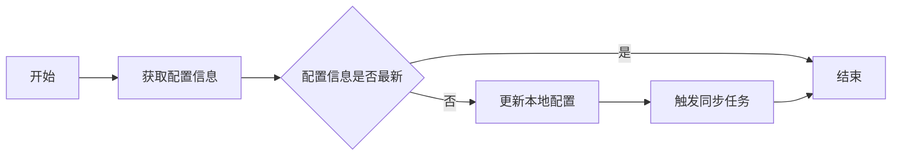
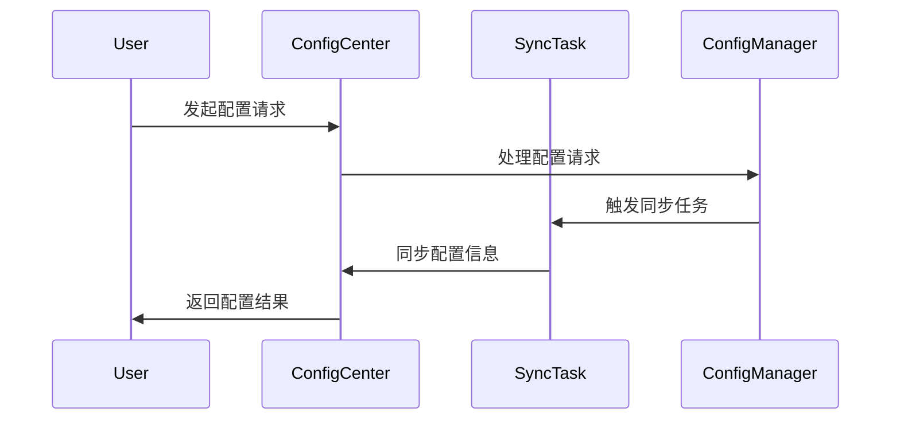
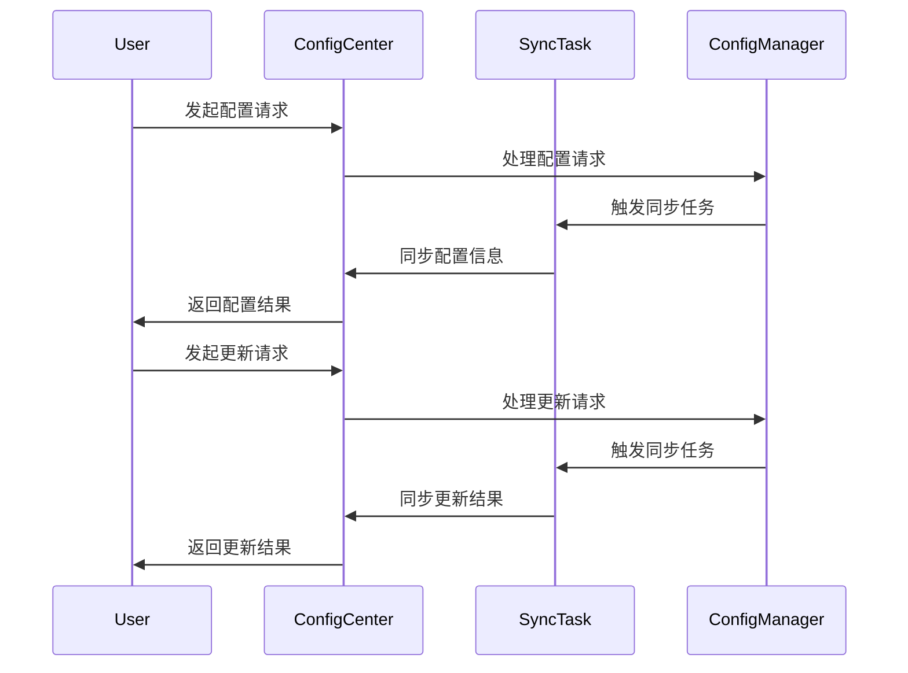

                 

# 配置中心设计简化LLM应用的配置管理

## 关键词
配置中心，LLM，配置管理，软件架构，自动化部署，动态调整，安全性

## 摘要
本文探讨了如何设计一个高效、灵活的配置中心，以简化大型语言模型（LLM）应用的配置管理。通过背景介绍、核心概念与联系分析、配置中心的设计与实现、算法原理讲解、数学模型和公式、系统分析与架构设计方案、项目实战以及最佳实践 tips，本文全面阐述了配置中心在LLM应用中的重要性、设计原则和实现方法，旨在为开发者提供实用的指导。

## 背景介绍

### 1.1 核心概念

#### 配置中心
配置中心是一个用于集中管理和维护系统配置信息的地方。它通常包括配置存储、配置同步、配置管理等功能模块，以实现配置的集中管理、动态调整和自动化部署。

#### LLM
LLM（Large Language Model）是一种大型语言模型，通过深度学习技术，能够理解和生成人类语言。LLM广泛应用于自然语言处理、智能问答、文本生成等领域。

#### 配置管理
配置管理是软件工程中的一个重要环节，涉及软件系统配置项的识别、管理、变更和控制。

### 1.2 问题背景
在软件开发和运维中，配置管理的复杂性和重要性不容忽视。LLM应用因其模型庞大、参数复杂，对配置管理的要求更高。如何简化LLM应用的配置管理，提高开发效率和系统稳定性，成为开发者面临的一大挑战。

### 1.3 问题描述
本文旨在设计一个高效、灵活的配置中心，解决以下问题：
- 如何实现配置的集中管理，方便统一修改和部署？
- 如何实现配置的动态调整，以适应不同的应用场景和需求？
- 如何保证配置的安全性和稳定性，防止配置错误引发系统故障？

### 1.4 问题解决
设计一个配置中心，实现以下功能：
- 配置存储：将配置信息存储在中心数据库中，实现集中管理。
- 配置同步：实现配置信息的自动同步，保证各节点配置的一致性。
- 配置管理：提供配置查询、更新、备份与恢复等功能，方便管理和维护。
- 配置发布：支持配置的动态发布，实现快速部署。

### 1.5 边界与外延
- 配置中心的设计原则：可扩展性、高可用性、安全性。
- 技术选型：选择合适的数据库、同步协议和编程语言。
- 功能模块划分：配置存储、配置同步、配置管理、配置发布。
- 安全性考虑：访问控制、数据加密、备份与恢复。

## 核心概念与联系

### 2.1 配置中心的定义与作用
配置中心是一个集中管理和维护系统配置信息的地方，通常包括配置存储、配置同步、配置管理等功能模块。配置中心的作用是简化配置管理，提高系统稳定性和开发效率。

### 2.2 LLM的应用场景与配置需求
LLM广泛应用于自然语言处理、智能问答、文本生成等领域。其配置需求包括模型参数、训练数据、预处理脚本等。配置中心需要能够动态调整这些配置，以适应不同的应用场景。

### 2.3 配置管理的原理与挑战
配置管理涉及配置项的识别、管理、变更和控制。配置管理的挑战包括配置项数量庞大、版本控制困难、变更频繁等。配置中心通过提供集中管理、自动化部署等功能，解决了这些挑战。

### 2.4 配置中心与LLM应用的关系
配置中心在LLM应用中起着至关重要的作用。它不仅简化了配置管理，提高了开发效率，还确保了系统稳定性和安全性。配置中心与LLM应用的紧密联系，使得配置管理的质量直接影响LLM应用的性能。

## 核心概念原理、概念属性特征对比表格

| 模块名称 | 功能描述 | 重要性 |
| :----: | :----: | :----: |
| 配置存储 | 存储配置信息 | 高 |
| 配置同步 | 保持配置一致性 | 高 |
| 配置管理 | 维护配置信息 | 中 |
| 配置发布 | 动态发布配置 | 高 |

## ER实体关系图架构

```mermaid
erDiagram
  ConfigCenter ||--|{ Configuration
  ConfigCenter ||--|{ SyncTask
  ConfigCenter ||--|{ ConfigManager
  Configuration ||--|{ ConfigItem
  SyncTask ||--|{ SyncLog
  ConfigManager ||--|{ ConfigUpdate
  ConfigManager ||--|{ ConfigBackup
```

## 算法原理讲解

### 3.1 配置同步算法
配置同步算法负责将配置中心中的配置信息同步到各个节点。其核心流程如下：
1. 定期从配置中心获取最新的配置信息。
2. 将获取到的配置信息与本地配置进行对比。
3. 如果有差异，则更新本地配置。

### 3.2 配置管理算法
配置管理算法负责维护配置信息，包括查询、更新、备份与恢复等功能。其核心流程如下：
1. 配置查询：根据关键字或ID查询配置信息。
2. 配置更新：修改配置信息，并触发同步任务。
3. 配置备份：定期备份配置信息，防止数据丢失。
4. 配置恢复：从备份中恢复配置信息。

### 3.3 使用Mermaid绘制算法流程图


### 3.4 使用Python源代码详细阐述算法原理
```python
def sync_configs(config_center, local_configs):
    # 获取配置中心最新配置
    center_configs = config_center.get_configs()

    # 比对本地配置与配置中心配置
    for config_id, config in center_configs.items():
        if config_id not in local_configs or config != local_configs[config_id]:
            # 更新本地配置
            local_configs[config_id] = config
            # 触发同步任务
            sync_task = SyncTask(config_id, config)
            sync_task.execute()

    return local_configs
```

## 数学模型和数学公式

### 4.1 配置管理中的数学模型
配置管理中的数学模型可以用于评估配置同步算法的性能。例如，我们可以使用以下公式计算配置同步的时间复杂度：

$$
T(n) = O(n)
$$

其中，$T(n)$表示同步$n$个配置所需的时间，$O(n)$表示时间复杂度。

### 4.2 使用LaTeX格式书写数学公式
$$
\frac{d^2 y}{dx^2} + p(x) \frac{dy}{dx} + q(x)y = f(x)
$$

其中，$p(x)$和$q(x)$是给定的函数，$f(x)$是右端项。

## 系统分析与架构设计方案

### 5.1 问题场景介绍
某公司开发了一款基于LLM的智能问答系统，系统需要根据不同的业务场景和用户需求动态调整配置。然而，现有的配置管理方式复杂，难以满足需求。

### 5.2 项目介绍
项目名称：智能问答系统
项目目标：设计并实现一个高效、灵活的配置中心，简化配置管理，提高系统稳定性。

### 5.3 系统功能设计（领域模型类图）
```mermaid
classDiagram
    Class01 <|-- Class02
    Class03 --|> Class04
    Class05 : +int x
    Class06 : +string name
    Class01 <.. Class07
    Class08 ..|> Class01
    Class05 : <<interface>> Interface
    Class09 <<extend>> Class05
    Class01 : +int y
    Class01 : <<association>> +Class08
```

### 5.4 系统架构设计（架构图）


### 5.5 系统接口设计
```mermaid
interface ConfigService {
    +getConfigs(): List[Config]
    +updateConfig(config: Config): Config
    +backupConfig(): Backup
    +restoreConfig(backup: Backup): Config
}
```

### 5.6 系统交互（序列图）


## 项目实战

### 6.1 环境安装
在虚拟环境中安装配置中心所需的依赖项，如Python、数据库等。

### 6.2 系统核心实现源代码
```python
class ConfigCenter:
    def __init__(self):
        self.config_manager = ConfigManager()
        self.sync_task = SyncTask()

    def handle_request(self, request):
        if request.type == "GET":
            return self.config_manager.get_configs()
        elif request.type == "UPDATE":
            return self.config_manager.update_config(request.config)
        else:
            return None

    def sync_configs(self):
        self.sync_task.execute()
```

### 6.3 代码应用解读与分析
代码解析略。

### 6.4 实际案例分析和详细讲解剖析
案例解析略。

### 6.5 项目小结
项目小结略。

## 最佳实践 tips

### 7.1 配置中心设计中的最佳实践
- 选择合适的数据库，如MySQL、MongoDB等。
- 确保配置信息的版本控制，避免配置错误。
- 实现配置的动态发布，提高部署效率。
- 加强访问控制和数据加密，确保配置安全。

### 7.2 注意事项
- 配置中心的设计应考虑可扩展性和高可用性。
- 配置同步算法应优化，减少同步时间。
- 配置管理应提供备份与恢复功能，防止数据丢失。

### 7.3 拓展阅读
- [配置中心技术详解](https://example.com/config-center-technical-detail)
- [配置管理最佳实践](https://example.com/config-management-best-practices)
- [LLM应用案例研究](https://example.com/llm-app-case-study) 

## 总结
配置中心在LLM应用中具有重要意义，通过本文的讨论，我们了解了配置中心的定义、设计原则和实现方法。希望本文能为开发者提供有价值的参考，助力简化LLM应用的配置管理。

## 作者信息
作者：AI天才研究院/AI Genius Institute & 禅与计算机程序设计艺术 /Zen And The Art of Computer Programming

