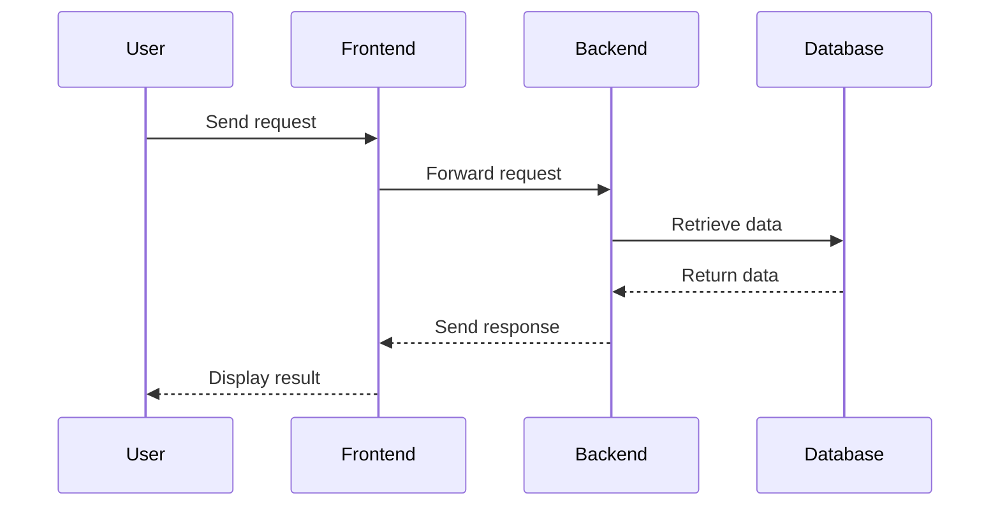
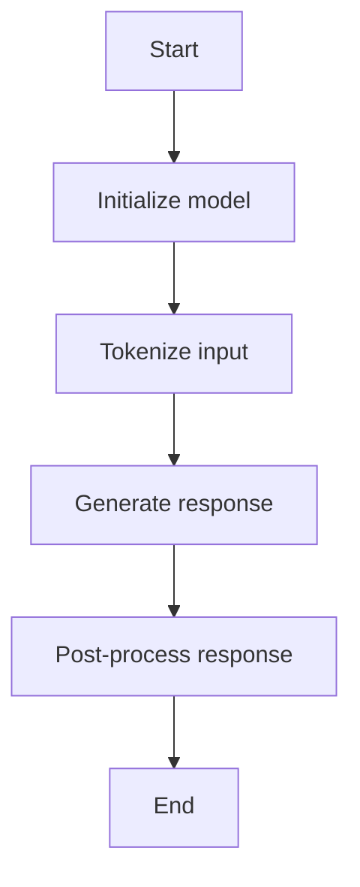

                 

# 重塑LLM应用开发的需求管理流程

## 关键词

- 语言模型（Language Model，LLM）
- 需求管理（Demand Management）
- 应用开发（Application Development）
- 人工智能（Artificial Intelligence，AI）
- 软件工程（Software Engineering）
- 用户体验（User Experience，UX）
- 数据分析（Data Analysis）
- 机器学习（Machine Learning，ML）

## 摘要

随着人工智能技术的快速发展，语言模型（LLM）在各个领域的应用越来越广泛。然而，在LLM应用开发过程中，需求管理成为了一个关键问题。本文旨在探讨如何通过重塑需求管理流程，提高LLM应用的开发效率和用户体验。文章将介绍LLM的基本概念，需求管理的核心原则，以及如何通过一系列步骤进行需求分析、设计、开发，并最终实现高质量的LLM应用。

## 引言

### 1.1 引言

随着人工智能技术的不断进步，语言模型（LLM）在自然语言处理、智能问答、文本生成、机器翻译等领域展现出了巨大的潜力。LLM是一种基于深度学习的自然语言处理技术，通过训练大量文本数据，能够生成与输入文本相关的语义上连贯、逻辑上合理的响应。然而，在实际应用开发过程中，如何有效地管理需求成为了影响项目成功的关键因素。

### 1.2 背景

传统的软件开发需求管理流程通常依赖于文档化的需求规格说明书，这种做法在一定程度上限制了开发团队与用户的沟通效率，容易导致需求理解偏差和项目延期。在LLM应用开发中，需求管理的复杂性更加突出，因为LLM不仅需要处理文本数据，还需要理解和生成复杂的语言结构。此外，用户对于LLM应用的需求也在不断变化，这使得需求管理的挑战变得更加严峻。

### 1.3 目标

本文的目标是探讨如何通过重塑需求管理流程，提高LLM应用开发过程中的需求理解、分析、设计和实现效率。具体目标包括：

1. 提高需求获取的准确性，确保开发团队能够全面理解用户需求。
2. 优化需求分析过程，确保需求的一致性和可实现性。
3. 通过改进设计和开发流程，提高LLM应用的质量和用户体验。
4. 提出一系列最佳实践和工具，以支持需求管理的各个环节。

### 1.4 结构

本文将分为以下几个部分：

1. 引言：介绍LLM应用开发的需求管理背景和目标。
2. 基本概念：解释LLM和需求管理的核心概念。
3. 需求分析：介绍需求获取和分析的方法和技巧。
4. 设计与实现：探讨LLM应用的设计和开发流程。
5. 最佳实践：总结最佳实践和工具的使用。
6. 结论：总结文章的主要观点和未来研究方向。

## 基本概念

### 2.1 LLM的概念

语言模型（LLM）是一种能够理解和生成自然语言文本的算法。它通常基于神经网络架构，通过对大量文本数据进行训练，学习语言的统计规律和语义结构。LLM的核心目标是生成与输入文本语义上连贯、逻辑上合理的响应。LLM的应用范围广泛，包括但不限于：

1. 智能问答系统：通过理解用户的问题，提供准确的答案。
2. 文本生成：生成新闻报道、文章摘要、创意内容等。
3. 机器翻译：将一种语言的文本翻译成另一种语言。
4. 情感分析：分析文本中的情感倾向和情感强度。

### 2.2 需求管理的概念

需求管理是指在整个软件开发生命周期中，对用户需求进行获取、分析、确认和管理的活动。需求管理的核心目的是确保开发团队能够准确地理解和实现用户的需求。需求管理的主要活动包括：

1. 需求获取：通过与用户和其他利益相关者进行沟通，了解他们的需求。
2. 需求分析：对获取的需求进行分析，确定需求是否可行、一致和完整。
3. 需求确认：与用户验证和确认需求，确保需求的准确性和完整性。
4. 需求变更管理：在项目开发过程中，管理需求的变化，确保变更的影响得到评估和控制。

### 2.3 LLM与需求管理的联系

LLM应用开发的需求管理具有以下特点：

1. **复杂性**：由于LLM涉及到自然语言处理和深度学习，需求管理变得更加复杂。需要深入理解自然语言的结构和语义，以确保需求能够被LLM正确理解和实现。
2. **动态性**：用户对LLM应用的需求可能会随着时间不断变化。需求管理的挑战在于如何快速响应这些变化，同时保持项目进度和质量的稳定。
3. **跨学科合作**：需求管理涉及到软件开发、人工智能、自然语言处理等多个领域。需要各个领域的专家紧密合作，共同解决需求管理中的问题。
4. **用户参与**：由于LLM应用的特殊性，用户在需求管理过程中的参与度要求更高。需要建立有效的沟通机制，确保用户的需求能够得到及时反馈和调整。

## 需求分析

### 3.1 需求获取

需求获取是需求管理的第一步，目标是了解用户的需求。对于LLM应用开发，需求获取的关键在于：

1. **理解用户场景**：深入了解用户使用LLM应用的具体场景，包括用户的任务、期望的交互方式、数据来源等。
2. **识别用户需求**：通过与用户进行面对面的访谈、问卷调查、用户故事编写等方式，收集用户的具体需求。
3. **需求文档化**：将获取的需求进行文档化，确保所有需求都被记录下来，并能够被开发团队理解。

### 3.2 需求分析

需求分析是对获取的需求进行深入理解和分析的过程。对于LLM应用开发，需求分析的关键包括：

1. **需求验证**：确保需求是合理的、可实现的，并且与项目目标一致。
2. **需求分类**：将需求按照功能、性能、可用性等分类，以便于管理和优先级排序。
3. **需求建模**：使用模型（如用例模型、功能分解图等）对需求进行可视化表示，帮助开发团队更好地理解需求。

### 3.3 需求确认

需求确认是确保需求得到用户认可和批准的过程。对于LLM应用开发，需求确认的关键包括：

1. **用户参与**：确保用户能够参与需求确认过程，提供反馈和意见。
2. **需求文档审核**：对需求文档进行详细审核，确保需求描述准确、清晰、无歧义。
3. **变更管理**：在需求确认过程中，可能需要根据用户的反馈调整需求。需要建立有效的变更管理流程，确保变更的影响得到评估和控制。

### 3.4 需求变更管理

在LLM应用开发过程中，需求变更是不可避免的。有效的需求变更管理可以确保项目能够灵活应对变化，同时保持项目进度和质量。需求变更管理的关键步骤包括：

1. **变更请求的收集和评估**：对变更请求进行收集和评估，确定变更的优先级和影响。
2. **变更控制**：根据变更的优先级和影响，决定是否接受变更，并更新相关文档。
3. **变更实施**：在开发过程中实施变更，确保变更能够顺利集成到项目中。

## 设计与实现

### 4.1 设计原则

在LLM应用开发中，设计原则对于确保需求的有效实现至关重要。以下是一些关键的设计原则：

1. **模块化设计**：将系统划分为模块，确保每个模块具有独立的功能和责任。
2. **可扩展性**：设计系统时考虑未来可能的需求变化，确保系统能够轻松扩展。
3. **用户友好性**：设计界面和交互方式时，优先考虑用户的体验和便利性。
4. **可维护性**：设计系统时考虑代码的可读性和可维护性，确保未来能够轻松维护和升级。

### 4.2 应用架构设计

LLM应用的架构设计需要考虑以下几个方面：

1. **前端架构**：设计易于使用的前端界面，提供用户友好的交互方式。
2. **后端架构**：设计高效的LLM后端服务，确保能够快速处理用户请求并生成高质量的响应。
3. **数据架构**：设计合理的数据存储和访问机制，确保数据的准确性和一致性。

### 4.3 开发流程

LLM应用开发的过程可以分为以下几个阶段：

1. **需求分析**：深入理解用户需求，确保需求文档的完整性和准确性。
2. **系统设计**：根据需求分析结果，设计系统的模块、接口和架构。
3. **编码实现**：根据设计文档，编写代码实现系统的功能。
4. **测试与调试**：对系统进行功能测试、性能测试和用户体验测试，确保系统的质量和稳定性。
5. **部署与维护**：将系统部署到生产环境，并进行持续的维护和更新。

## 最佳实践

### 5.1 需求管理的最佳实践

以下是一些需求管理的最佳实践：

1. **建立有效的沟通机制**：确保开发团队和用户之间的沟通渠道畅通，使用合适的工具（如项目管理软件、即时通讯工具等）。
2. **定期回顾与反馈**：定期回顾需求管理流程，收集用户和开发团队的反馈，不断优化流程。
3. **文档化管理**：使用版本控制系统管理需求文档，确保文档的版本一致性和可追溯性。
4. **需求变更管理**：建立完善的变更管理流程，确保变更的影响得到充分评估和控制。

### 5.2 LLM应用开发的最佳实践

以下是一些LLM应用开发的最佳实践：

1. **数据质量**：确保训练数据的质量和多样性，以提高LLM的泛化能力。
2. **模型选择**：根据应用场景选择合适的LLM模型，并对其进行优化和调整。
3. **模型评估**：使用多种评估指标（如BLEU、ROUGE等）对LLM的性能进行评估，确保模型达到预期的效果。
4. **用户参与**：在开发过程中，定期收集用户反馈，根据用户需求调整模型和界面。

## 结论

本文探讨了如何通过重塑需求管理流程，提高LLM应用开发的质量和效率。通过理解LLM的基本概念和需求管理的核心原则，我们提出了一系列需求获取、分析、确认和变更管理的步骤，以及设计、开发、测试和部署的流程。同时，我们总结了需求管理和LLM应用开发的最佳实践。希望本文能够为LLM应用开发者提供有价值的参考和指导。

## 作者信息

作者：AI天才研究院/AI Genius Institute & 禅与计算机程序设计艺术 /Zen And The Art of Computer Programming

## 附录

### A. 需求管理流程图

使用Mermaid工具绘制需求管理流程图，展示从需求获取到需求确认，再到需求变更管理的整个过程。

```mermaid
gantt
    title 需求管理流程
    dateFormat  YYYY-MM-DD
    section 需求获取
    获取需求 :done, a1, 2023-01-01, duration: 3d
    评审需求 :ongoing, a2, after a1, duration: 5d
    section 需求分析
    分析需求 :ongoing, a3, after a2, duration: 7d
    需求文档化 :ongoing, a4, after a3, duration: 3d
    section 需求确认
    确认需求 :ongoing, a5, after a4, duration: 5d
    section 需求变更管理
    变更请求收集 :ongoing, a6, after a5, duration: 4d
    变更控制与实施 :ongoing, a7, after a6, duration: 5d
```

### B. LLM架构设计图

使用Mermaid工具绘制LLM应用架构设计图，展示前端、后端和数据架构的各个部分及其交互关系。



### C. 算法流程图

使用Mermaid工具绘制一个简单的文本生成算法流程图，展示算法的主要步骤和逻辑。



