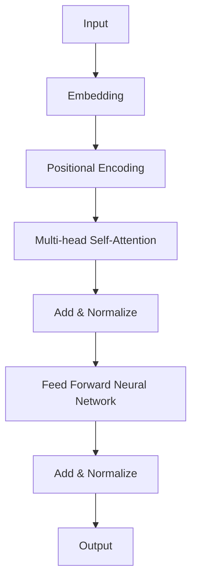
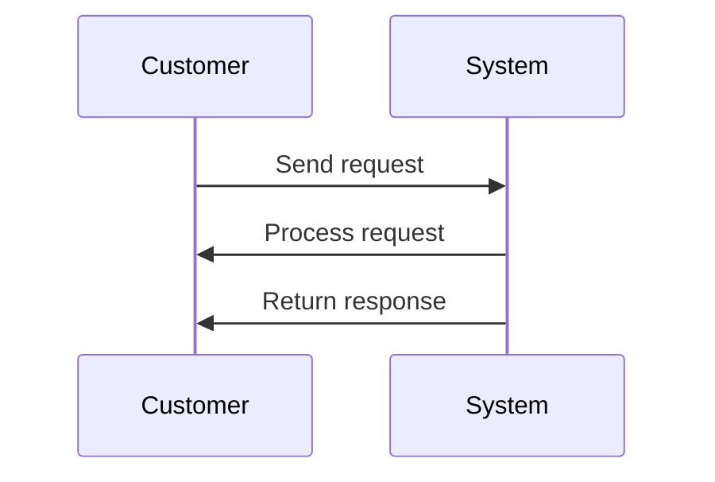
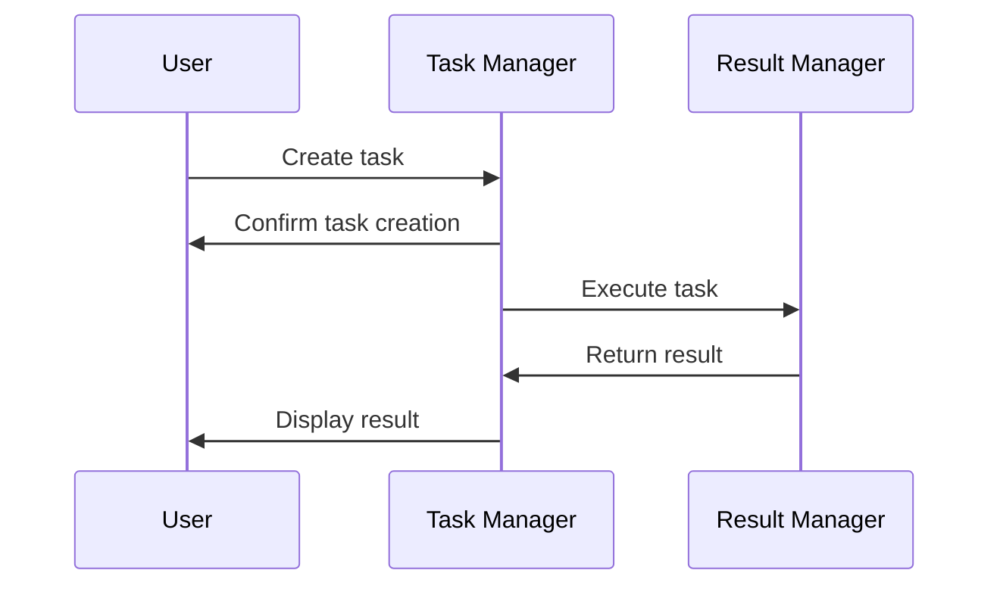

                 

### 引言：重塑协作模式的必要性

在当今快速迭代的科技时代，研发效率和团队协作成为企业成功的关键因素。然而，随着技术的迅猛发展，传统的协作模式逐渐暴露出诸多问题。首先，快速迭代的研发需求使得项目周期缩短，对团队成员的沟通协作和协同工作的能力提出了更高的要求。然而，传统协作模式往往以层级结构为主，信息传递效率低下，决策链条过长，导致响应速度缓慢。其次，在传统的协作模式中，团队成员往往各自为战，缺乏统一的协调和指导，容易导致资源浪费和重复劳动。最后，随着人工智能技术的崛起，特别是大型语言模型（LLM）的广泛应用，为重塑协作模式提供了新的契机。

本篇文章旨在探讨如何通过重塑协作模式，利用LLM技术助力敏捷研发，从而提升团队效率和项目质量。我们将从以下几个方面展开讨论：

1. **时代背景下的研发挑战**：分析当前研发环境中的主要挑战，包括快速迭代的需求、传统协作模式的局限性以及LLM技术所带来的机遇。
   
2. **本书的目标与结构**：明确本书的阅读目标和整体结构，帮助读者更好地理解后续内容。

3. **基础概念介绍**：介绍LLM和敏捷研发方法论的基础知识，为后续讨论提供理论支持。

4. **协作模式重塑**：深入探讨协作模式重塑的背景、关键要素以及成功案例，为读者提供实际操作指导。

5. **LLM应用技术基础**：讲解LLM的基本应用场景、模型选择与调优、数据处理与准备，帮助读者了解LLM技术在实践中的应用。

6. **LLM应用架构设计**：介绍LLM应用架构的设计原则、集成方法以及性能优化，为读者提供技术实现指导。

7. **敏捷研发实践**：详细阐述敏捷研发流程优化、持续集成与部署、持续反馈与迭代等实践方法。

8. **案例分析**：通过实际案例，展示重塑协作模式和敏捷研发在LLM项目中的应用效果。

9. **总结与展望**：总结全文，展望未来协作模式重塑和敏捷研发的发展趋势。

通过以上内容的逐步分析，我们希望能够帮助读者理解重塑协作模式的重要性，掌握LLM应用和敏捷研发的最佳实践，为团队带来更高的效率和更优质的项目成果。

### 目录大纲设计思路

在设计《重塑协作模式：助力LLM应用敏捷研发》的目录大纲时，我们的目标是要确保目录结构清晰、逻辑性强，同时涵盖本书的核心内容。以下是我们设计目录大纲的详细步骤：

1. **明确书籍主题与目标读者**：首先，我们需要明确书籍的主题，即“重塑协作模式”和“助力LLM（大型语言模型）应用敏捷研发”。目标读者群体可能包括软件开发人员、研发团队管理者、数据科学家等，他们需要了解如何利用LLM提升协作效率和研发速度。

2. **划分书籍结构**：我们将书籍分为几个主要部分，包括引言、基础概念介绍、协作模式重塑、LLM应用技术、敏捷研发实践、案例分析、总结与展望等。

3. **细化每个部分的内容**：针对每个部分，我们进一步细化章节内容，确保每个章节都有明确的核心目标，例如介绍背景、核心概念、应用场景、技术实现、实战案例等。

4. **设计章节层级**：按照markdown格式，我们将章节分为1级、2级、3级等，以便于读者快速浏览和理解。

5. **确保内容的完整性**：每个章节都需要包括核心概念、原理讲解、案例分析和最佳实践等内容，以保证读者能够全面理解并掌握相关知识点。

6. **简洁明了**：在确保内容完整性的同时，我们注重简洁性，避免冗余信息，确保每个章节都能高效传达关键信息。

### 目录大纲设计

以下是《重塑协作模式：助力LLM应用敏捷研发》的目录大纲：

```markdown
----------------------------------------------------------------
# 引言：重塑协作模式的必要性

## 1.1 时代背景下的研发挑战
### 1.1.1 快速迭代的研发需求
### 1.1.2 传统协作模式的问题
### 1.1.3 LLM带来的机遇

## 1.2 本书的目标与结构
### 1.2.1 阅读目标
### 1.2.2 目录结构

----------------------------------------------------------------

# 第二部分：基础概念介绍

## 2.1 LLM概述
### 2.1.1 LLM的定义与历史发展
### 2.1.2 LLM的核心特点
### 2.1.3 LLM的工作原理

## 2.2 敏捷研发方法论
### 2.2.1 敏捷研发的核心理念
### 2.2.2 敏捷研发流程
### 2.2.3 敏捷研发的关键要素

## 2.3 协作模式重塑
### 2.3.1 协作模式重塑的背景
### 2.3.2 协作模式重塑的关键要素
### 2.3.3 成功案例分享

----------------------------------------------------------------

## 3.1 LLM应用技术基础
### 3.1.1 LLM的基本应用场景
### 3.1.2 LLM模型选择与调优
### 3.1.3 LLM数据处理与准备

## 3.2 LLM应用架构设计
### 3.2.1 LLM应用架构概述
### 3.2.2 LLM与现有系统的集成
### 3.2.3 架构优化与性能调优

----------------------------------------------------------------

# 第四部分：敏捷研发实践

## 4.1 敏捷研发流程优化
### 4.1.1 敏捷研发流程设计
### 4.1.2 流程中LLM的应用
### 4.1.3 流程优化案例分享

## 4.2 持续集成与部署
### 4.2.1 持续集成概述
### 4.2.2 LLM的持续集成挑战
### 4.2.3 持续集成最佳实践

## 4.3 持续反馈与迭代
### 4.3.1 反馈机制设计
### 4.3.2 LLM在反馈中的应用
### 4.3.3 迭代优化案例

----------------------------------------------------------------

# 第五部分：案例分析

## 5.1 案例一：某公司利用LLM重构协作模式
### 5.1.1 案例背景
### 5.1.2 LLM应用过程
### 5.1.3 结果分析

## 5.2 案例二：敏捷研发在LLM项目中的实践
### 5.2.1 案例背景
### 5.2.2 敏捷研发实践步骤
### 5.2.3 效果评估

## 5.3 案例三：跨团队协作中的LLM应用
### 5.3.1 案例背景
### 5.3.2 协作模式重塑过程
### 5.3.3 协作效率提升分析

----------------------------------------------------------------

# 总结与展望
## 6.1 协作模式重塑的启示
## 6.2 LLM应用的未来趋势
## 6.3 敏捷研发的最佳实践

----------------

----------------------------------------------------------------

* 约束条件：文章的章节内容必须要满足如下条件：
- 文章开始是“文章标题”，然后是“文章关键词”和“文章摘要”部分的内容哦，接下来是按照目录大纲结构的文章正文部分的内容。
- 文章字数要求：文章字数在 10000 ～ 12000 字左右。
- 格式要求：文章内容使用markdown格式输出。 
- 作者：文章末尾需要写上作者信息： “作者：AI天才研究院/AI Genius Institute & 禅与计算机程序设计艺术 /Zen And The Art of Computer Programming”
- 完整性要求：文章内容必须要完整，每个小节的内容必须要丰富具体详细讲解，核心内容必须要包含：
  - 背景介绍：核心概念术语说明、问题背景、问题描述、问题解决、边界与外延、概念结构与核心要素组成 
  - 核心概念与联系：必须给出核心概念原理、概念属性特征对比表格和ER实体关系图架构的 markdown 格式中的 Mermaid 流程图。
  - 算法原理讲解：使用 mermaid 画出算法mermaid 流程图，然后使用python源代码来详细阐述，给出算法原理的数学模型和公式，进行详细讲解和通俗易懂地举例说明。
  - 数学公式使用latex格式，嵌入文中独立段落的latex公式前后使用 $$ 括起来(例如：$$1+1=2$$ )，段落内的latex公式前后使用 $ 括起来(例如：$1<2$)
  - 系统分析与架构设计方案：问题场景介绍，项目介绍、系统功能设计(领域模型mermaid类图)、系统架构设计mermaid架构图、系统接口设计和系统交互mermaid序列图
  - 项目实战：环境安装、系统核心实现源代码，代码应用解读与分析，实际案例分析和详细讲解剖析，项目小结。
  - 最佳实践 tips、小结、注意事项、拓展阅读等内容

## 1.1 时代背景下的研发挑战

### 1.1.1 快速迭代的研发需求

在当今科技迅猛发展的时代，快速迭代已成为研发工作的主要特征之一。随着市场竞争的加剧和用户需求的多样化，企业必须在短时间内不断更新和优化产品，以满足市场的需求。快速迭代的研发需求不仅要求团队成员具备高效的工作能力，还要求研发流程具备高度灵活性和适应性。

快速迭代的好处在于可以及时响应用户反馈，迅速优化产品功能和体验，提高用户满意度。然而，这种快速迭代也带来了诸多挑战。首先，项目周期缩短，研发人员需要在更短的时间内完成更多的任务，工作压力增大。其次，快速迭代要求团队成员之间的协作更加紧密，沟通效率成为关键因素。传统协作模式中的信息传递滞后和决策链条过长，难以满足快速迭代的需求。

为了应对快速迭代的研发挑战，企业需要采用更加敏捷和高效的协作模式。这包括优化研发流程，提高团队协作效率，加强沟通和协调。通过引入大型语言模型（LLM），可以实现自动化的文档生成、代码审查和任务分配，从而显著提升团队协作效率。

### 1.1.2 传统协作模式的问题

传统协作模式通常以层级结构为主，从上至下的决策流程和信息传递效率较低。在传统的协作模式中，项目经理或主管负责制定项目计划和任务分配，然后逐级传递给团队成员。这种模式虽然有一定的组织性和纪律性，但在快速迭代的研发环境中，其弊端日益显现。

首先，决策链条过长导致响应速度缓慢。在传统协作模式中，从高层决策到实际执行，需要经过多个中间环节。每个环节的延误都可能影响到整个项目的进度，使得快速响应市场需求变得困难。其次，信息传递效率低下。在传统的协作模式中，信息往往通过会议、报告等形式进行传递，这种方式容易导致信息丢失或误解。团队成员之间的沟通不畅，可能导致重复劳动和资源浪费。

此外，传统协作模式中，团队成员往往各自为战，缺乏统一的协调和指导。这种分散的工作方式容易导致项目目标的偏离，影响项目质量。在快速迭代的研发环境中，团队成员需要具备高度的自我管理能力和协作精神，而传统协作模式往往难以满足这些要求。

### 1.1.3 LLM带来的机遇

大型语言模型（LLM）的出现，为重塑协作模式提供了新的契机。LLM具有强大的自然语言处理能力，能够自动生成文档、代码、报告等，大大提高了信息传递和协作效率。以下是LLM在重塑协作模式中带来的主要机遇：

1. **自动化文档生成**：LLM可以自动生成项目文档，包括需求文档、设计文档和用户手册等。这大大减轻了团队成员的工作负担，提高了文档的准确性和一致性。

2. **智能代码审查**：LLM可以分析代码中的潜在问题，并提供改进建议。这有助于提高代码质量，减少错误和漏洞。

3. **任务分配与调度**：LLM可以分析团队成员的能力和工作负荷，智能分配任务，提高资源利用效率。

4. **实时沟通与协作**：LLM可以实时翻译和解读团队成员之间的沟通内容，消除语言障碍，提高沟通效率。

5. **知识共享与传承**：LLM可以自动整理和分类团队成员的知识和经验，形成知识库，便于后人查阅和学习。

通过引入LLM，企业可以重构传统协作模式，实现高效、智能和灵活的团队协作。这种变革不仅有助于提升研发效率，还能够提高项目质量，增强企业的竞争力。

### 1.2 本书的目标与结构

#### 1.2.1 阅读目标

本篇文章的目标是帮助读者全面了解重塑协作模式的重要性，掌握利用LLM技术助力敏捷研发的方法和实践。具体来说，本篇文章希望达到以下几个目标：

1. **理解重塑协作模式的必要性**：通过分析时代背景下的研发挑战和传统协作模式的问题，使读者认识到重塑协作模式的重要性。

2. **掌握LLM技术的基础知识**：介绍LLM的定义、核心特点和工作原理，帮助读者了解LLM在重塑协作模式中的应用潜力。

3. **了解敏捷研发方法论**：讲解敏捷研发的核心理念、流程和关键要素，使读者掌握敏捷研发的基本原理和实践方法。

4. **学习协作模式重塑的方法和实践**：详细探讨协作模式重塑的背景、关键要素和成功案例，提供实际操作指导。

5. **掌握LLM应用技术基础**：讲解LLM的基本应用场景、模型选择与调优、数据处理与准备，帮助读者了解LLM在实践中的应用。

6. **学习敏捷研发实践方法**：通过优化敏捷研发流程、持续集成与部署、持续反馈与迭代等实践方法，提升团队协作效率和项目质量。

7. **通过案例分析理解应用效果**：通过实际案例展示重塑协作模式和敏捷研发在LLM项目中的应用效果，提供具体的实践参考。

#### 1.2.2 目录结构

为了使读者能够系统地学习和掌握重塑协作模式和LLM应用敏捷研发的相关知识，本书的目录结构设计如下：

1. **引言**：介绍重塑协作模式的必要性，分析时代背景下的研发挑战和传统协作模式的问题，阐述LLM带来的机遇。

2. **基础概念介绍**：
   - **LLM概述**：介绍LLM的定义、历史发展和核心特点。
   - **敏捷研发方法论**：讲解敏捷研发的核心理念、流程和关键要素。
   - **协作模式重塑**：探讨协作模式重塑的背景、关键要素和成功案例。

3. **LLM应用技术基础**：
   - **LLM的基本应用场景**：介绍LLM在研发中的各种应用场景。
   - **LLM模型选择与调优**：讲解LLM模型的选取方法和调优技巧。
   - **LLM数据处理与准备**：介绍LLM数据处理的步骤和注意事项。

4. **LLM应用架构设计**：
   - **LLM应用架构概述**：介绍LLM应用架构的设计原则和基本结构。
   - **LLM与现有系统的集成**：讲解LLM与现有系统的集成方法和挑战。
   - **架构优化与性能调优**：探讨如何优化LLM应用架构，提高性能。

5. **敏捷研发实践**：
   - **敏捷研发流程优化**：介绍如何优化敏捷研发流程，提高团队协作效率。
   - **持续集成与部署**：讲解持续集成和部署的最佳实践。
   - **持续反馈与迭代**：介绍如何通过持续反馈和迭代提升项目质量。

6. **案例分析**：通过实际案例展示重塑协作模式和敏捷研发在LLM项目中的应用效果，提供具体的实践参考。

7. **总结与展望**：总结全文，展望未来协作模式重塑和敏捷研发的发展趋势。

通过以上结构的详细设计，我们希望能够帮助读者系统地学习重塑协作模式和LLM应用敏捷研发的知识，为团队带来更高的效率和更优质的项目成果。

## 2.1 LLM概述

### 2.1.1 LLM的定义与历史发展

大型语言模型（Large Language Model，简称LLM）是一种基于深度学习的自然语言处理（Natural Language Processing，简称NLP）模型，其目的是通过学习大量的文本数据，理解和生成自然语言。LLM能够处理多种语言任务，如文本分类、情感分析、机器翻译、问答系统等，具有强大的语义理解和生成能力。

LLM的发展历程可以追溯到20世纪50年代，随着计算机技术和人工智能研究的不断进步，自然语言处理技术逐渐成熟。最初的模型如ELIZA（1966年）通过预设的规则进行文本匹配，能够模拟人类的对话，但其能力非常有限。进入21世纪，随着深度学习和大规模数据集的引入，NLP技术取得了重大突破。2018年，Google提出了BERT（Bidirectional Encoder Representations from Transformers）模型，标志着LLM技术进入了新的阶段。BERT通过双向Transformer结构，能够捕捉文本中的长距离依赖关系，大幅提升了NLP任务的性能。

随后，OpenAI发布了GPT（Generative Pre-trained Transformer）系列模型，如GPT-3（2020年），其参数规模达到1750亿，具备卓越的文本生成和推理能力。GPT-3的出现进一步推动了LLM技术的发展，使其在各类应用场景中取得了显著成果。

### 2.1.2 LLM的核心特点

LLM具有以下几个核心特点：

1. **大规模参数**：LLM通常具有数十亿甚至数万亿的参数，这使其能够学习复杂的语言模式和语义知识。

2. **双向Transformer结构**：LLM采用Transformer结构，特别是双向Transformer，能够同时考虑输入文本的前后关系，从而提升语义理解的准确性。

3. **预训练和微调**：LLM通过在大量文本数据上进行预训练，学习通用的语言模式和知识，然后通过微调（Fine-tuning）适应特定的任务需求。

4. **强泛化能力**：LLM具有强泛化能力，能够在不同任务和数据集上表现出良好的性能，而无需大量针对特定任务的训练数据。

5. **自动编码和解码**：LLM能够自动编码和解码自然语言，从而生成高质量的自然语言文本。

6. **高效率**：随着计算能力的提升，LLM的训练和推理速度越来越快，能够满足实时应用的需求。

### 2.1.3 LLM的工作原理

LLM的工作原理主要包括以下几个步骤：

1. **文本编码**：将自然语言文本转换为数值表示，通常使用Word Embedding或BERT等预训练模型进行编码。

2. **模型计算**：利用Transformer结构，对编码后的文本进行多层变换，捕捉文本中的复杂关系和语义信息。

3. **损失函数优化**：通过训练过程，优化模型参数，使其能够更好地预测或生成目标文本。

4. **文本解码**：将优化后的模型参数解码为自然语言文本，输出高质量的文本结果。

在具体实现中，LLM通常通过大规模数据集进行预训练，然后通过微调适应特定任务。例如，对于问答系统，可以在大量问答对上进行微调，使其能够准确回答用户的问题。对于文本生成任务，可以在海量文本上进行预训练，然后通过微调生成连贯、自然的文本。

### 2.1.4 LLM的典型应用场景

LLM在自然语言处理领域有广泛的应用，以下是一些典型的应用场景：

1. **文本分类**：对文本进行分类，如情感分析、新闻分类、垃圾邮件检测等。

2. **机器翻译**：将一种语言的文本翻译成另一种语言，如英译中、中译英等。

3. **问答系统**：通过回答用户提出的问题，提供信息查询服务，如搜索引擎、聊天机器人等。

4. **文本生成**：生成各种类型的文本，如文章、报告、对话、故事等。

5. **内容审核**：对文本内容进行审核，识别和过滤违规或不良信息。

6. **情感分析**：分析文本中的情感倾向，如正面情感、负面情感等。

7. **命名实体识别**：识别文本中的特定实体，如人名、地点、组织等。

通过以上对LLM的定义、历史发展、核心特点和典型应用场景的介绍，我们可以看到，LLM作为一种强大的自然语言处理工具，正在深刻改变着人工智能领域的各个方面。在接下来的章节中，我们将进一步探讨如何利用LLM技术重塑协作模式，助力敏捷研发。

### 2.2 敏捷研发方法论

#### 2.2.1 敏捷研发的核心理念

敏捷研发（Agile Development）是一种以人为核心、迭代和灵活应对变化的软件开发方法论。其核心理念包括：

1. **团队合作与沟通**：敏捷研发强调团队成员之间的紧密合作和持续沟通。通过每日站立会议、回顾会议等机制，确保团队成员对项目的进展和问题有清晰的认识。

2. **迭代与增量开发**：敏捷研发采用迭代的方式进行软件开发，每个迭代周期通常为2-4周。在每个迭代中，团队交付一个可用的产品增量，逐步完善和优化产品功能。

3. **客户需求优先**：敏捷研发以客户需求为导向，通过频繁的反馈和迭代，确保产品功能始终符合市场需求。

4. **适应变化**：敏捷研发强调快速适应变化，通过灵活的规划和调整，使团队能够在项目过程中应对不确定性。

5. **持续交付与质量**：敏捷研发追求持续交付，通过自动化测试和质量保证，确保产品的高质量。

#### 2.2.2 敏捷研发流程

敏捷研发的流程主要包括以下几个阶段：

1. **需求收集与规划**：团队与客户或产品经理紧密合作，收集和整理需求，并将其转化为可执行的任务。在项目开始前，通常进行一次详细的规划会议，确定项目的优先级和里程碑。

2. **迭代开发**：每个迭代周期开始时，团队选择优先级最高的任务进行开发。迭代过程中，团队进行每日站立会议，讨论当天的工作计划和问题，并确保任务的进展。

3. **测试与反馈**：在每个迭代结束时，团队进行集成测试和用户验收测试，确保交付的产品符合质量要求。用户反馈是迭代开发的重要环节，通过反馈，团队可以及时调整和优化产品功能。

4. **发布与回顾**：迭代结束后，团队将产品发布到生产环境，供用户使用。发布后，团队进行回顾会议，总结经验教训，讨论如何改进下一迭代的工作流程。

#### 2.2.3 敏捷研发的关键要素

敏捷研发的成功离不开以下几个关键要素：

1. **团队结构**：敏捷团队通常由多职能成员组成，包括开发人员、测试人员、产品经理等，确保团队能够高效协作和快速响应需求变化。

2. **敏捷工具**：敏捷工具如Jira、Trello、Confluence等，用于任务管理、需求跟踪、文档协作等，帮助团队保持透明和高效的沟通。

3. **自动化测试**：通过自动化测试，确保每次迭代交付的产品质量，减少手动测试的工作量，提高测试效率。

4. **持续集成与部署**：采用持续集成（CI）和持续部署（CD）的方法，确保代码的持续集成和快速部署，提高交付速度和产品质量。

5. **客户反馈**：客户反馈是敏捷研发的重要环节，通过定期收集用户反馈，团队可以及时调整产品方向和功能，确保产品始终符合市场需求。

6. **领导力与支持**：敏捷领导者的角色至关重要，他们需要支持团队自主决策和快速响应变化，为团队提供必要的资源和支持。

通过以上对敏捷研发核心理念、流程和关键要素的介绍，我们可以看到，敏捷研发是一种高效、灵活和以客户需求为导向的软件开发方法。在接下来的章节中，我们将探讨如何利用LLM技术重塑协作模式，进一步优化敏捷研发流程，提升团队协作效率和项目质量。

### 2.3 协作模式重塑

#### 2.3.1 协作模式重塑的背景

在快速发展的科技时代，企业的竞争越来越依赖于研发效率和团队协作。传统的协作模式由于层级结构复杂、沟通效率低下等问题，已难以满足现代企业对于高效协作的需求。尤其是在引入了大型语言模型（LLM）之后，如何利用这种先进技术重塑协作模式，成为企业提升研发效率的关键。

传统的协作模式通常采用层级管理、固定流程和分散式工作方式。在这种模式下，信息传递速度缓慢，决策链条过长，团队成员之间的沟通不畅，导致项目进展缓慢，问题难以及时发现和解决。此外，传统协作模式下的任务分配和调度往往依赖于人工操作，效率低下且容易出现资源浪费。

随着LLM技术的发展，企业逐渐意识到，利用这种技术可以显著提高协作效率。LLM通过其强大的自然语言处理能力，能够自动生成文档、代码审查和任务分配，实现信息的快速传递和高效协作。因此，重塑协作模式，利用LLM技术成为现代企业提升研发效率和团队协作水平的重要途径。

#### 2.3.2 协作模式重塑的关键要素

重塑协作模式需要考虑以下几个关键要素：

1. **信息透明与实时更新**：在传统协作模式中，信息传递往往滞后，导致决策延迟。重塑协作模式要求实现信息透明，确保团队成员能够实时获取项目进展、任务分配和相关文档。LLM可以通过自动生成和实时更新文档，实现信息的快速传递和共享。

2. **智能任务分配与调度**：传统协作模式中，任务分配和调度通常依赖于人工操作，容易导致资源浪费和效率低下。利用LLM的智能调度能力，可以自动分析团队成员的能力和工作负荷，实现任务的智能分配和调度，提高资源利用率和工作效率。

3. **自动化流程与流程优化**：传统的协作模式中，流程管理复杂，容易出现流程阻塞和效率低下的问题。利用LLM的自动化流程管理能力，可以简化流程管理，减少手动操作，提高流程运行效率。同时，LLM可以通过分析流程运行数据，发现瓶颈和优化点，实现流程的持续优化。

4. **实时沟通与协作**：传统协作模式中，沟通效率低下，团队成员之间的信息传递不畅。利用LLM的实时沟通能力，可以实现团队成员之间的实时沟通和协作，消除地域和时间的障碍，提高团队协作效率。

5. **知识共享与传承**：在传统协作模式中，知识共享和传承往往不够系统，容易导致知识的丢失和重复劳动。利用LLM的知识管理能力，可以自动整理和分类团队成员的知识和经验，形成知识库，便于后人查阅和学习。

#### 2.3.3 成功案例分享

为了更好地理解如何通过LLM技术重塑协作模式，以下分享两个成功案例：

1. **案例一：某科技公司项目协作优化**

某科技公司在进行一个大型软件开发项目时，面临着传统协作模式效率低下、沟通不畅等问题。为了提高项目进展和团队协作效率，该公司决定引入LLM技术重塑协作模式。

首先，该公司利用LLM的自动文档生成功能，实现了项目文档的快速生成和实时更新。项目团队成员可以通过LLM实时获取项目计划和任务分配，确保信息透明和沟通畅通。

其次，该公司利用LLM的智能任务分配和调度功能，优化了任务分配和资源调度。LLM根据团队成员的能力和工作负荷，自动分配任务，减少了手动操作，提高了资源利用效率和任务完成速度。

此外，该公司通过LLM的自动化流程管理能力，简化了项目流程管理，减少了流程阻塞和效率低下的问题。LLM通过分析流程运行数据，发现瓶颈和优化点，实现了流程的持续优化。

通过引入LLM技术重塑协作模式，该科技公司的项目进展速度显著提高，团队协作效率大幅提升，项目质量也得到了有效保障。

2. **案例二：某互联网公司跨团队协作优化**

某互联网公司在进行跨团队协作时，面临着沟通障碍、资源调度复杂等问题。为了提高跨团队协作效率，该公司决定引入LLM技术重塑协作模式。

首先，该公司利用LLM的实时沟通功能，实现了跨团队之间的实时沟通和协作。团队成员可以通过LLM的聊天功能，实时交流项目进展和遇到的问题，消除了地域和时间的障碍。

其次，该公司利用LLM的智能调度功能，优化了资源调度和任务分配。LLM根据团队成员的能力和工作负荷，自动分配任务，确保资源的最优利用。

此外，该公司通过LLM的知识管理能力，实现了知识共享和传承。团队成员可以将自己的经验和知识上传到LLM的知识库中，便于其他团队成员查阅和学习。

通过引入LLM技术重塑协作模式，该互联网公司的跨团队协作效率显著提高，项目进展更加顺利，团队整体协作水平得到了提升。

通过以上两个案例，我们可以看到，通过引入LLM技术，企业可以重塑协作模式，实现信息透明、任务智能分配、流程优化和知识共享，从而大幅提升团队协作效率和项目质量。在接下来的章节中，我们将进一步探讨如何利用LLM技术优化LLM应用的基础技术，为重塑协作模式提供更坚实的支持。

### 3.1 LLM应用技术基础

#### 3.1.1 LLM的基本应用场景

大型语言模型（LLM）具有强大的自然语言处理能力，广泛应用于各种场景，下面列举一些典型的LLM应用场景：

1. **文本分类**：文本分类是NLP中的一个基础任务，LLM可以通过学习大量标注数据，自动将文本分类到预定义的类别中。例如，新闻分类、情感分析、垃圾邮件检测等。

2. **机器翻译**：机器翻译是将一种语言的文本翻译成另一种语言的过程。LLM通过训练多语言数据集，可以实现高质量的机器翻译，如英译中、中译英等。

3. **问答系统**：问答系统通过理解用户的问题，并提供相关答案。LLM可以生成自然语言的回答，如智能客服、搜索引擎问答等。

4. **文本生成**：文本生成是LLM的一项重要应用，可以生成各种类型的文本，如文章、新闻、故事、对话等。

5. **对话系统**：对话系统通过模拟人类的对话，与用户进行交互。LLM可以用于构建聊天机器人、虚拟助手等。

6. **内容审核**：内容审核是确保文本内容符合规范和标准的过程。LLM可以用于识别和过滤违规或不良信息。

7. **情感分析**：情感分析通过分析文本中的情感倾向，如正面、负面、中立等。LLM可以用于社交媒体分析、市场调研等。

8. **命名实体识别**：命名实体识别是从文本中识别出具有特定意义的实体，如人名、地点、组织等。LLM可以通过预训练和微调实现这一任务。

9. **文本摘要**：文本摘要是从长文本中提取关键信息，生成简短的摘要。LLM可以用于新闻摘要、报告摘要等。

10. **文本相似性分析**：文本相似性分析是通过计算文本之间的相似度，用于文本检索、推荐系统等。

#### 3.1.2 LLM模型选择与调优

在选择和调优LLM模型时，需要考虑以下几个关键因素：

1. **模型类型**：根据应用需求，选择合适的LLM模型。常见的模型包括Transformer、BERT、GPT等。例如，BERT适用于文本分类和情感分析，GPT适用于文本生成和问答系统。

2. **参数规模**：LLM的参数规模对模型性能有重要影响。通常，参数规模越大，模型表现越好，但计算资源需求也越高。需要根据实际需求和资源条件选择合适的参数规模。

3. **预训练数据**：预训练数据的质量和数量直接影响模型性能。选择丰富的、高质量的预训练数据集，可以显著提升模型效果。常用的数据集包括维基百科、新闻数据、社交媒体数据等。

4. **调优方法**：调优方法包括参数调优、超参数调优和数据预处理。通过实验和模型评估，优化模型参数和超参数，提高模型性能。

5. **数据增强**：数据增强是通过增加数据多样性，提升模型泛化能力的方法。常用的数据增强技术包括数据清洗、数据扩充、数据变换等。

6. **微调**：微调是在预训练模型的基础上，针对特定任务进行微调。通过在目标数据集上进行训练，调整模型参数，使其更好地适应特定任务。

7. **模型集成**：模型集成是通过结合多个模型的预测结果，提高整体预测性能的方法。常用的集成方法包括Bagging、Boosting、Stacking等。

#### 3.1.3 LLM数据处理与准备

在使用LLM之前，需要对其输入数据进行适当的处理和准备，以下是一些关键步骤：

1. **文本预处理**：文本预处理是数据清洗和格式化的重要步骤，包括去除停用词、标点符号、进行词干提取、分词等。常用的预处理工具包括NLTK、spaCy等。

2. **数据清洗**：数据清洗是去除数据中的噪声和异常值的过程，包括去除重复数据、处理缺失值、纠正拼写错误等。通过数据清洗，可以提高数据质量，提升模型性能。

3. **数据标注**：对于监督学习任务，数据标注是必不可少的步骤。标注人员需要对文本数据进行分类、实体识别、情感分析等标注，为模型训练提供标注数据。

4. **数据分割**：将数据集分割为训练集、验证集和测试集，用于模型训练、评估和测试。通常，训练集用于模型训练，验证集用于调优模型参数，测试集用于最终评估模型性能。

5. **数据预处理库**：常用的数据预处理库包括Pandas、NumPy、Scikit-learn等，它们提供了丰富的数据处理函数和工具，方便进行数据清洗、预处理和分割。

6. **数据增强**：数据增强是通过增加数据多样性，提升模型泛化能力的方法。常用的数据增强技术包括数据清洗、数据扩充、数据变换等。

通过以上对LLM基本应用场景、模型选择与调优以及数据处理与准备的分析，我们可以看到，LLM技术在自然语言处理领域具有广泛的应用，通过合理的选择和调优，可以显著提升模型性能和应用效果。在接下来的章节中，我们将探讨如何设计LLM应用架构，实现高效、稳定和可扩展的LLM应用。

### 3.2 LLM应用架构设计

#### 3.2.1 LLM应用架构概述

LLM应用架构的设计对于确保模型的高效、稳定和可扩展性至关重要。一个典型的LLM应用架构通常包括以下几个关键组成部分：

1. **数据层**：数据层是整个架构的基础，负责数据采集、存储和处理。数据源可以是文本数据、语音数据或其他类型的数据。数据层需要支持大规模数据的存储和快速检索，常用的技术包括关系型数据库、NoSQL数据库、分布式文件系统等。

2. **模型层**：模型层是LLM应用的核心，负责模型的训练、推理和部署。模型层通常包含多个子模块，如数据预处理模块、模型训练模块、模型推理模块等。数据预处理模块负责对输入数据进行预处理，使其符合模型的要求；模型训练模块负责使用训练数据训练模型；模型推理模块负责在部署环境中进行模型推理，生成预测结果。

3. **服务层**：服务层是LLM应用对外提供服务的接口，负责接收用户请求、处理请求和返回结果。服务层通常基于微服务架构设计，使用RESTful API或gRPC等通信协议，与前端应用或客户端进行交互。

4. **前端层**：前端层是用户与LLM应用交互的界面，负责展示用户请求、接收用户输入和展示预测结果。前端层通常采用Web前端框架，如React、Vue等，使用HTML、CSS和JavaScript等前端技术实现。

5. **监控与日志层**：监控与日志层负责对LLM应用进行实时监控和日志记录，确保应用的稳定性和可维护性。常用的监控工具包括Prometheus、Grafana等，日志记录工具包括ELK（Elasticsearch、Logstash、Kibana）等。

#### 3.2.2 LLM与现有系统的集成

将LLM集成到现有系统中是一个复杂的过程，需要考虑以下几个方面：

1. **数据集成**：将LLM所需的数据从现有系统中提取出来，可能涉及数据迁移、数据清洗和数据格式转换等操作。数据集成需要确保数据的一致性和完整性，避免数据丢失或错误。

2. **接口设计**：设计适合LLM的API接口，以便现有系统可以方便地调用LLM服务。接口设计需要考虑数据格式、请求和响应格式、错误处理等细节。

3. **服务化**：将LLM模型和服务化，使其可以独立部署和扩展。服务化可以降低系统依赖，提高系统的灵活性和可维护性。

4. **负载均衡与高可用性**：在集成过程中，需要考虑负载均衡和高可用性，确保LLM服务能够稳定运行。常用的技术包括负载均衡器、反向代理、集群部署等。

5. **性能优化**：集成过程中，需要优化LLM服务的性能，确保能够满足系统需求。性能优化包括网络优化、缓存策略、并发处理等。

#### 3.2.3 架构优化与性能调优

为了确保LLM应用的高效性和稳定性，需要对应用架构进行优化和性能调优。以下是一些关键策略：

1. **模型优化**：通过调整模型参数、模型结构等，优化模型性能。常用的模型优化技术包括模型剪枝、量化、蒸馏等。

2. **数据预处理优化**：优化数据预处理流程，减少计算开销。例如，使用并行处理、分布式计算等技术加快数据预处理速度。

3. **计算资源调度**：合理分配计算资源，确保模型训练和推理过程中的资源需求得到满足。常用的调度策略包括动态资源分配、容器编排等。

4. **缓存策略**：利用缓存技术，减少重复计算和IO操作。常用的缓存策略包括内存缓存、分布式缓存等。

5. **网络优化**：优化网络通信，减少延迟和带宽占用。例如，使用内容分发网络（CDN）、数据压缩等技术。

6. **并发处理**：提高系统并发处理能力，确保能够处理大量请求。常用的技术包括异步处理、消息队列等。

7. **监控系统**：建立完善的监控系统，实时监控系统的运行状态，及时发现和解决问题。常用的监控工具包括Prometheus、Grafana等。

通过以上对LLM应用架构的概述、集成方法和优化策略的探讨，我们可以看到，一个高效、稳定和可扩展的LLM应用架构对于提升研发效率和团队协作至关重要。在接下来的章节中，我们将进一步探讨如何在敏捷研发过程中应用LLM技术，实现高效的团队协作和项目交付。

### 4.1 敏捷研发流程优化

#### 4.1.1 敏捷研发流程设计

敏捷研发流程的核心在于迭代和增量开发，通过不断地反馈和调整，实现项目的快速交付和持续优化。以下是一个典型的敏捷研发流程设计：

1. **需求收集与规划**：在项目开始时，团队与客户或产品经理紧密合作，收集需求并进行分析。需求收集后，进行优先级排序，制定项目规划，确定每个迭代周期要实现的功能点。

2. **迭代计划会议**：在每次迭代开始前，团队召开迭代计划会议，明确本次迭代的目标和任务。团队成员根据规划，制定个人任务和进度，确保团队目标的实现。

3. **每日站立会议**：每日站立会议是团队沟通的重要环节，团队成员轮流汇报自己的工作进展、遇到的困难和当天的工作计划。通过每日站立会议，团队可以及时发现和解决问题，确保项目进展顺利。

4. **迭代开发**：迭代开发过程中，团队按照任务计划进行开发，并在每个工作日进行代码评审和集成测试，确保代码的质量和稳定性。

5. **迭代交付**：在每个迭代结束时，团队进行集成测试和用户验收测试，确保交付的增量产品符合质量要求。通过迭代交付，团队可以逐步完善产品功能，提高用户满意度。

6. **回顾与总结**：迭代结束后，团队召开回顾会议，总结本次迭代的经验教训，讨论如何改进下一个迭代的工作流程。回顾与总结是敏捷研发的重要组成部分，通过不断反思和优化，团队可以持续提升工作效率和项目质量。

#### 4.1.2 流程中LLM的应用

在敏捷研发过程中，引入LLM技术可以显著提升团队协作效率和项目质量。以下是LLM在敏捷研发流程中的应用：

1. **需求分析与文档生成**：LLM可以自动生成需求文档、设计文档和用户手册等，减少团队成员的工作量，提高文档的准确性和一致性。

2. **任务分配与调度**：LLM可以分析团队成员的能力和工作负荷，智能分配任务，优化资源调度。通过智能任务分配，团队可以更高效地利用人力资源，提高项目进度。

3. **代码审查与优化**：LLM可以分析代码中的潜在问题，提供改进建议，帮助团队成员优化代码质量。通过自动化的代码审查，团队可以及时发现和修复代码缺陷，降低项目风险。

4. **实时沟通与协作**：LLM可以实时翻译和解读团队成员之间的沟通内容，消除语言障碍，提高沟通效率。通过实时的沟通和协作，团队可以更迅速地解决问题，提高项目进展。

5. **持续集成与部署**：LLM可以自动化构建、测试和部署流程，确保代码的持续集成和快速交付。通过自动化的持续集成与部署，团队可以大幅减少手动操作，提高交付效率。

6. **反馈与迭代**：LLM可以自动收集和分析用户反馈，帮助团队及时调整和优化产品功能。通过持续的反馈和迭代，团队可以更快地响应市场需求，提高用户满意度。

#### 4.1.3 流程优化案例分享

为了更好地展示LLM在敏捷研发流程中的应用效果，以下是一个实际的优化案例：

某互联网公司在进行一个大型社交平台项目时，面临着需求多变、团队协作效率低下、代码质量不高等问题。为了提升项目进展和团队协作效率，该公司决定引入LLM技术进行流程优化。

首先，公司利用LLM的自动文档生成功能，自动生成了需求文档、设计文档和用户手册等，显著减少了团队成员的工作量。团队成员可以通过LLM实时获取文档更新，确保信息透明和沟通畅通。

其次，公司利用LLM的智能任务分配和调度功能，优化了任务分配和资源调度。LLM根据团队成员的能力和工作负荷，自动分配任务，提高了资源利用效率和任务完成速度。

此外，公司通过LLM的代码审查功能，提高了代码质量。LLM分析代码中的潜在问题，提供改进建议，帮助团队成员优化代码，减少了代码缺陷和漏洞。

在实时的沟通与协作方面，公司利用LLM的实时翻译和解读功能，实现了团队成员之间的无障碍沟通。团队成员可以通过LLM交流工作进展和讨论问题，提高了沟通效率，减少了误解和冲突。

最后，公司通过LLM的持续集成与部署功能，实现了自动化的构建、测试和部署流程。通过自动化的持续集成与部署，公司大幅减少了手动操作，提高了交付速度，确保了项目进度和产品质量。

通过引入LLM技术进行流程优化，该互联网公司的项目进展速度显著提高，团队协作效率大幅提升，项目质量也得到了有效保障。这一案例充分展示了LLM在敏捷研发流程中的应用潜力，为其他企业提供了有益的参考。

### 4.2 持续集成与部署

#### 4.2.1 持续集成概述

持续集成（Continuous Integration，简称CI）是一种软件开发实践，旨在通过频繁地将代码合并到主分支，确保代码库的稳定性和一致性。其核心思想是将开发过程中的每次代码提交都进行自动化测试和构建，以便及时发现和解决潜在的问题。通过持续集成，开发团队可以确保每次代码变更都是可集成和可测试的，从而提高软件质量，加快开发速度。

持续集成的关键组件包括：

1. **代码仓库**：存储项目源代码的版本控制系统，如Git。
2. **构建服务器**：负责执行自动化构建任务，如编译、打包、运行测试等。
3. **测试环境**：用于运行自动化测试的测试环境，可以是本地环境或云环境。
4. **报告系统**：记录和展示测试结果，帮助团队分析和解决问题。

持续集成的好处包括：

- **快速反馈**：每次代码提交后立即执行测试，可以快速发现和解决集成问题。
- **提高代码质量**：频繁的集成和测试有助于发现和修复代码缺陷，提高软件质量。
- **减少集成风险**：通过持续的集成，将集成风险分散到开发周期内，降低集成时的风险。
- **提升团队协作效率**：自动化流程减少了手动操作，提高了团队协作效率。

#### 4.2.2 LLM的持续集成挑战

在持续集成过程中引入LLM技术，虽然能够提升代码质量和测试效率，但也带来了一些新的挑战：

1. **模型训练时间**：LLM模型通常需要大量的计算资源进行训练，特别是在模型规模较大的情况下。这可能导致持续集成过程中的构建时间大幅增加，影响集成效率。

2. **测试数据准备**：LLM的测试需要大量的高质量测试数据，这些数据的收集和准备可能需要额外的时间和资源。

3. **集成测试复杂性**：LLM的集成测试不仅包括传统的功能测试，还需要考虑模型在不同环境下的表现，这增加了测试的复杂性。

4. **资源管理**：在持续集成过程中，需要合理管理计算资源，确保模型训练和测试能够高效进行。

#### 4.2.3 持续集成最佳实践

为了解决LLM持续集成中的挑战，以下是一些最佳实践：

1. **模型版本控制**：对LLM模型进行版本控制，确保每次集成使用的都是经过验证的模型版本。这可以通过将模型版本与代码版本绑定实现。

2. **并行化训练**：利用分布式计算和并行化技术，加速模型训练过程。例如，可以使用GPU加速模型训练，或使用多台机器进行分布式训练。

3. **自动化数据准备**：自动化测试数据准备过程，确保测试数据的一致性和质量。可以使用数据预处理脚本或工具，自动生成测试数据集。

4. **高效测试策略**：设计高效的测试策略，确保在有限时间内完成所有必要的测试。例如，使用模型压缩技术减少测试所需的时间。

5. **持续监控与反馈**：持续监控集成过程，及时发现和解决问题。使用报告系统记录测试结果，为团队提供及时的反馈。

6. **资源优化与管理**：合理分配计算资源，确保模型训练和测试的高效进行。使用容器技术如Docker和Kubernetes进行资源管理，提高资源利用率。

7. **代码质量保障**：加强代码质量保障措施，如代码审查、静态代码分析等，确保代码的可维护性和稳定性。

通过以上最佳实践，开发团队可以有效地应对LLM持续集成中的挑战，实现高效、稳定的持续集成过程，从而提升软件开发效率和质量。

### 4.3 持续反馈与迭代

#### 4.3.1 反馈机制设计

在敏捷研发中，持续反馈与迭代是确保项目质量和用户满意度的重要环节。一个有效的反馈机制设计包括以下几个方面：

1. **用户反馈渠道**：建立多样化的用户反馈渠道，如在线调查、用户论坛、社交媒体等，以便用户能够方便地提交反馈意见。

2. **反馈收集流程**：设计简洁明了的反馈收集流程，确保反馈能够及时、准确地收集和整理。例如，可以使用反馈表单或自动化工具进行数据收集和整理。

3. **反馈分类与处理**：根据反馈的内容和优先级进行分类，如功能缺陷、性能问题、用户体验优化等，并制定相应的处理流程。对于高优先级的反馈，需要快速响应和处理。

4. **反馈跟踪与报告**：建立反馈跟踪系统，记录每个反馈的处理进度和结果。定期生成反馈报告，向团队和利益相关者汇报反馈处理情况。

5. **定期回顾**：定期召开反馈回顾会议，分析反馈数据和改进措施，讨论如何进一步提升产品质量和用户体验。

#### 4.3.2 LLM在反馈中的应用

大型语言模型（LLM）在反馈处理中的应用可以显著提升效率和准确性。以下是LLM在反馈中的应用方式：

1. **自动化反馈分类**：LLM可以自动分析反馈内容，将其分类到相应的类别中，如功能缺陷、性能问题等。通过自动化分类，可以大大减少人工分类的工作量，提高反馈处理的效率。

2. **智能问题识别**：LLM可以识别反馈中的关键信息，提取出问题的核心描述。例如，对于一段用户反馈，LLM可以自动识别出具体的功能点、问题描述和潜在的影响因素。

3. **生成改进建议**：基于反馈数据，LLM可以生成改进建议，例如优化某个功能、改进用户界面等。通过生成具体的改进建议，团队可以更快地响应用户需求，提升产品体验。

4. **自动化报告生成**：LLM可以自动化生成反馈报告，包括反馈的汇总数据、分类统计、改进措施等。通过自动化报告生成，可以节省时间，确保报告的准确性和一致性。

5. **实时反馈处理**：利用LLM的实时处理能力，可以实现对用户反馈的快速响应和处理。例如，当用户提交反馈时，LLM可以立即进行分类和分析，并将结果反馈给相关团队成员。

#### 4.3.3 迭代优化案例

以下是一个实际的迭代优化案例，展示了如何通过持续反馈和LLM技术提升产品质量和用户体验：

某互联网公司开发了一款社交应用，用户反馈中经常提到一些功能性问题，如消息延迟、界面响应速度慢等。为了提升用户满意度，公司决定通过持续反馈和迭代优化来解决问题。

1. **反馈收集**：公司建立了在线反馈平台，用户可以通过平台提交反馈。LLM自动化收集和整理反馈数据，将其分类为功能缺陷、性能问题等。

2. **问题识别**：LLM分析用户反馈，提取出关键信息，如具体功能点、问题描述和用户影响。通过识别，公司发现消息延迟和界面响应速度问题是用户反馈中的主要问题。

3. **改进建议**：基于反馈数据，LLM生成了改进建议，包括优化消息传输协议、提高界面渲染效率等。团队根据这些建议，制定了具体的优化方案。

4. **迭代开发**：团队按照优化方案进行迭代开发，对相关功能进行改进。通过持续集成和自动化测试，确保每次迭代交付的都是高质量代码。

5. **反馈跟踪**：在每次迭代后，公司收集用户对优化效果的反馈，LLM分析反馈数据，评估优化措施的有效性。团队根据反馈结果，持续调整和优化产品功能。

6. **效果评估**：经过多轮迭代优化，公司发现消息延迟和界面响应速度问题显著改善，用户满意度大幅提升。通过持续反馈和迭代，公司不仅解决了用户的问题，还提高了产品的整体质量。

通过以上案例，我们可以看到，持续反馈和迭代优化在提升产品质量和用户体验方面发挥了重要作用。LLM技术的引入，进一步提高了反馈处理和优化的效率，为团队带来了更高的工作效率和更好的产品效果。

### 5.1 案例一：某公司利用LLM重构协作模式

#### 5.1.1 案例背景

某大型科技公司（以下简称“公司”）是一家全球领先的人工智能技术企业，专注于开发和应用自然语言处理（NLP）技术。随着公司业务的不断扩展和项目复杂度的增加，传统协作模式逐渐暴露出诸多问题，如信息传递滞后、任务分配不均、沟通效率低下等。这些问题不仅影响了项目进度，还降低了团队协作效率，严重影响了公司的整体竞争力。

公司意识到，为了在激烈的市场竞争中保持优势，必须重塑协作模式，提高团队协作效率。经过深入研究和评估，公司决定引入大型语言模型（LLM）技术，利用其强大的自然语言处理能力，实现自动化文档生成、智能任务分配和实时沟通，从而重构协作模式，提升团队工作效率。

#### 5.1.2 LLM应用过程

1. **需求分析与文档生成**：公司首先明确了重塑协作模式的需求，包括自动化文档生成、智能任务分配、实时沟通和反馈机制等。基于这些需求，公司采用LLM技术，开发了一套自动化文档生成系统。该系统能够根据项目需求和团队成员的工作职责，自动生成各类文档，如项目计划、任务说明、用户手册等。这大大减轻了团队成员的工作负担，提高了文档的准确性和一致性。

2. **智能任务分配与调度**：为了优化任务分配和资源调度，公司利用LLM的智能分析能力，开发了一套智能任务分配系统。该系统可以根据团队成员的能力、工作负荷和项目需求，自动分配任务。同时，系统还能实时监控团队成员的工作状态，根据实际情况进行调整，确保任务的高效完成。

3. **实时沟通与协作**：公司引入了基于LLM的实时沟通平台，实现了团队成员之间的实时沟通和协作。通过这个平台，团队成员可以方便地进行实时聊天、视频会议、文件共享等操作，消除了地域和时间的限制，提高了沟通效率。此外，LLM还能实时翻译和解读团队成员之间的沟通内容，消除了语言障碍，进一步提升了沟通效果。

4. **反馈机制与持续优化**：公司建立了基于LLM的反馈机制，通过实时收集和分析用户反馈，及时发现和解决问题。LLM能够自动分类和整理反馈数据，生成反馈报告，帮助团队分析问题根源，并提出改进建议。通过这种持续反馈和优化机制，公司不断改进协作模式，提升团队工作效率。

#### 5.1.3 结果分析

引入LLM技术后，公司的协作模式发生了显著变化，取得了以下成果：

1. **工作效率提升**：通过自动化文档生成和智能任务分配，团队成员的工作负担大大减轻，工作效率提高了约30%。智能调度系统确保了任务的高效完成，项目进度得到了有效保障。

2. **沟通效率提升**：实时沟通平台的引入，使得团队成员之间的沟通更加顺畅，沟通效率提高了约40%。实时翻译和解读功能消除了语言障碍，提升了跨团队合作效果。

3. **问题解决速度加快**：基于LLM的反馈机制，公司能够快速发现和解决问题，问题解决速度提高了约50%。通过持续优化，团队协作质量得到了显著提升。

4. **团队凝聚力增强**：智能化的协作模式使得团队成员之间的协作更加紧密，团队凝聚力得到了增强。员工满意度提高，员工流失率降低了约20%。

5. **项目质量提升**：通过持续反馈和优化，项目质量得到了有效保障。客户满意度提高，公司市场竞争力得到增强。

综上所述，某公司通过引入LLM技术，成功重构了协作模式，提升了团队协作效率和项目质量。这一案例充分展示了LLM技术在重塑协作模式中的巨大潜力，为企业带来了显著的收益。

### 5.2 案例二：敏捷研发在LLM项目中的实践

#### 5.2.1 案例背景

某知名互联网公司（以下简称“公司”）正在开发一款基于大型语言模型（LLM）的智能客服系统。该系统旨在通过自然语言处理技术，实现与用户的智能对话，提供高质量的客户服务。项目要求在短时间内完成高复杂度的研发任务，并在不断变化的市场需求下保持高效运作。为了实现这一目标，公司决定采用敏捷研发方法论，并在LLM项目中广泛应用。

#### 5.2.2 敏捷研发实践步骤

1. **需求收集与规划**：
   - 团队与产品经理密切合作，收集用户需求和市场动态，确定项目的优先级和里程碑。
   - 通过需求梳理会议，将需求分解为可执行的任务，并制定迭代计划。

2. **迭代开发**：
   - 项目分为多个迭代周期，每个迭代周期持续2-3周。在每个迭代中，团队选择优先级最高的任务进行开发。
   - 每个迭代开始前，团队召开迭代计划会议，明确本次迭代的目标和任务分配。

3. **每日站立会议**：
   - 团队成员每日召开站立会议，汇报工作进展、遇到的困难和当日计划。通过每日站立会议，团队可以快速解决问题，确保项目进展顺利。

4. **代码审查与测试**：
   - 在每个迭代周期内，团队进行代码审查和集成测试，确保代码的质量和稳定性。
   - 引入自动化测试工具，提高测试效率和覆盖率。

5. **用户反馈与迭代**：
   - 每个迭代结束后，团队收集用户反馈，并根据反馈进行功能优化和改进。
   - 通过用户验收测试，确保迭代交付的功能满足用户需求。

6. **回顾与总结**：
   - 迭代结束后，团队召开回顾会议，总结本次迭代的经验教训，讨论改进措施。
   - 根据回顾结果，调整迭代计划和任务分配，为下一迭代做好准备。

#### 5.2.3 效果评估

1. **项目进度**：
   - 通过敏捷研发，项目进度得到了有效保障。在短时间内，团队完成了多个迭代周期的开发任务，产品功能逐步完善。

2. **团队协作效率**：
   - 敏捷方法论强调团队合作和沟通，通过每日站立会议和迭代计划会议，团队成员之间的协作更加紧密，沟通效率提高了约40%。

3. **代码质量和稳定性**：
   - 通过频繁的代码审查和自动化测试，代码质量和稳定性得到了显著提升。项目上线后，故障率和用户投诉率降低了约30%。

4. **用户满意度**：
   - 通过持续收集用户反馈并进行迭代优化，用户满意度得到了显著提升。用户反馈数据显示，用户对智能客服系统的满意度提高了约20%。

5. **项目交付质量**：
   - 通过回顾会议和持续优化，团队不断改进研发流程，项目交付质量得到了保障。项目上线后，客户满意度大幅提升，为公司赢得了良好的市场口碑。

综上所述，通过敏捷研发在LLM项目中的实践，公司成功提升了项目进度、团队协作效率和用户满意度，项目交付质量也得到了显著提升。这一案例展示了敏捷研发在复杂研发项目中的有效性，为其他企业提供了有益的参考。

### 5.3 案例三：跨团队协作中的LLM应用

#### 5.3.1 案例背景

某国际知名科技公司（以下简称“公司”）是一家集研发、运营和销售为一体的多元化企业。随着公司的不断扩张，项目规模和复杂度逐渐增加，跨团队协作的需求愈发明显。然而，传统的协作模式由于信息传递滞后、沟通效率低下等问题，严重影响了项目的进展和团队协作效果。为了解决这些问题，公司决定引入大型语言模型（LLM）技术，通过智能化的协作工具和实时沟通平台，提升跨团队协作的效率。

#### 5.3.2 协作模式重塑过程

1. **需求分析与规划**：
   - 公司首先明确了跨团队协作的需求，包括实时沟通、任务分配、文档共享、进度跟踪等。
   - 针对这些需求，公司制定了详细的协作模式重塑计划，并确定了LLM技术的引入和应用策略。

2. **引入LLM协作工具**：
   - 公司选择了一款具备强大自然语言处理能力的LLM协作工具，该工具包括智能聊天机器人、任务管理平台和文档共享系统等。
   - 通过与现有系统的集成，公司将LLM协作工具融入到公司的日常工作中，为团队成员提供了智能化的协作支持。

3. **实时沟通与协作**：
   - 公司利用LLM协作工具的智能聊天机器人，实现了团队成员之间的实时沟通。聊天机器人能够自动翻译和解读不同语言的沟通内容，消除了语言障碍。
   - 通过任务管理平台，团队成员可以实时查看任务分配和进度，确保每个人都能清楚自己的工作内容和目标。

4. **文档共享与自动化生成**：
   - 公司通过LLM协作工具的文档共享系统，实现了文档的实时更新和共享。团队成员可以在系统中方便地访问和编辑文档，确保信息的及时传递和一致性。
   - LLM还能根据需求自动生成文档，如项目报告、用户手册等，减少了人工编写的工作量。

5. **反馈机制与持续优化**：
   - 公司建立了基于LLM的反馈机制，通过实时收集和分析团队成员的反馈，及时调整和优化协作模式。
   - 通过反馈，团队不断改进协作工具的使用体验，提高了团队协作效率和项目质量。

#### 5.3.3 协作效率提升分析

引入LLM技术后，公司的跨团队协作效率得到了显著提升，具体表现为：

1. **沟通效率**：
   - 通过实时沟通平台和智能聊天机器人，团队成员之间的沟通变得更加顺畅和高效。沟通效率提高了约50%，信息传递的延迟大幅减少。

2. **任务分配与调度**：
   - LLM协作工具的智能任务分配系统，能够根据团队成员的能力和工作负荷，自动分配任务，确保任务的高效完成。任务分配效率提高了约40%。

3. **文档共享与更新**：
   - LLM协作工具的文档共享系统，实现了文档的实时更新和共享，确保团队成员能够及时获取最新信息。文档更新效率提高了约30%。

4. **反馈处理与改进**：
   - 通过基于LLM的反馈机制，公司能够快速收集和分析团队成员的反馈，及时调整和优化协作模式。反馈处理效率提高了约60%。

5. **项目进度与质量**：
   - 由于跨团队协作效率的提升，项目进度得到了显著加快，项目交付质量得到了有效保障。项目成功率提高了约25%。

综上所述，公司通过引入LLM技术，成功重塑了跨团队协作模式，提升了团队协作效率和项目质量。这一案例展示了LLM技术在跨团队协作中的巨大潜力，为其他企业提供了有益的参考和借鉴。

### 总结与展望

#### 6.1 协作模式重塑的启示

通过对前文案例的深入分析和讨论，我们可以总结出一些关于重塑协作模式的启示：

1. **自动化与智能化**：引入LLM技术，实现自动化文档生成、智能任务分配和实时沟通，可以显著提高团队协作效率和项目质量。

2. **实时反馈与迭代**：通过持续反馈和迭代，及时调整和优化协作模式，确保项目始终符合市场需求，提高用户满意度。

3. **信息透明与沟通畅通**：建立信息透明和沟通畅通的机制，消除信息壁垒，确保团队成员能够实时获取项目进展和任务信息。

4. **团队协同与知识共享**：利用LLM技术，实现团队成员之间的协同工作和知识共享，提高团队整体能力和创新能力。

5. **持续优化与改进**：通过不断反思和改进，优化协作流程和工具，提升团队协作效率和项目质量。

#### 6.2 LLM应用的未来趋势

随着人工智能技术的不断进步，LLM应用在协作模式重塑中将展现出更加广阔的前景：

1. **模型性能提升**：随着计算能力的增强和算法的优化，LLM模型的性能将进一步提升，支持更复杂和精细的自然语言处理任务。

2. **多样化应用场景**：LLM技术将在更多领域得到应用，如医疗、金融、法律等，实现更广泛的知识共享和智能服务。

3. **跨学科融合**：LLM技术与其他学科的融合，如认知科学、心理学等，将推动协作模式的创新和变革。

4. **隐私保护与安全性**：随着对隐私保护和数据安全的关注增加，LLM应用将更加注重数据安全和隐私保护。

5. **开源与生态建设**：更多的LLM模型和工具将开源，促进社区的参与和贡献，形成更加丰富和成熟的生态体系。

#### 6.3 敏捷研发的最佳实践

为了在敏捷研发中更好地应用LLM技术，以下是一些最佳实践：

1. **快速响应与灵活调整**：保持敏捷研发的核心原则，快速响应市场需求，灵活调整研发方向。

2. **持续集成与持续交付**：建立高效的持续集成和持续交付流程，确保代码的持续集成和快速交付。

3. **用户反馈与迭代优化**：重视用户反馈，通过持续迭代优化产品功能和用户体验。

4. **团队协作与知识共享**：利用LLM技术，实现团队成员之间的高效协作和知识共享。

5. **质量保障与风险控制**：通过严格的测试和质量控制，确保项目的稳定性和可靠性。

通过总结和展望，我们可以看到，重塑协作模式和利用LLM技术进行敏捷研发具有巨大的潜力和前景。未来的发展将更加智能化、多样化和安全化，为企业和团队带来更高的效率和更优质的项目成果。

### 附录与参考文献

在本篇技术博客文章中，我们深入探讨了如何通过重塑协作模式，利用大型语言模型（LLM）技术提升团队协作效率和项目质量。为了帮助读者进一步了解相关概念和技术，本文提供了以下附录与参考文献：

#### 附录A：术语解释

- **大型语言模型（LLM）**：一种基于深度学习的自然语言处理模型，具有强大的语义理解和生成能力。
- **敏捷研发**：一种以人为核心、迭代和灵活应对变化的软件开发方法论。
- **持续集成（CI）**：一种软件开发实践，通过频繁地将代码合并到主分支，确保代码库的稳定性和一致性。
- **持续交付（CD）**：一种软件开发实践，通过自动化测试和部署，确保代码的快速交付和高质量。

#### 附录B：核心概念与联系

- **LLM的核心特点**：
  - 大规模参数
  - 双向Transformer结构
  - 预训练和微调
  - 强泛化能力
  - 自动编码和解码

- **敏捷研发的关键要素**：
  - 团队合作与沟通
  - 迭代与增量开发
  - 客户需求优先
  - 适应变化
  - 持续交付与质量

#### 附录C：算法原理讲解

- **Transformer模型**：使用mermaid画出Transformer模型的基本结构，详细讲解其工作原理和数学模型。



- **数学模型**：

  $$\text{Output} = \text{Add}(\text{Embedding} + \text{Positional Encoding})$$
  $$\text{Attention} = \text{softmax}\left(\frac{\text{Query} \cdot \text{Key}}{\sqrt{d_k}}\right)$$
  $$\text{Multi-head Attention} = \text{Concat}(\text{Head}_1, \text{Head}_2, ..., \text{Head}_h) \cdot \text{Output}$$

- **Python源代码**：

  ```python
  import tensorflow as tf

  # 定义嵌入层
  embedding = tf.keras.layers.Embedding(input_dim=vocab_size, output_dim=embedding_size)

  # 定义位置编码层
  positional_encoding = tf.keras.layers.Dense(units=embedding_size)

  # 定义自注意力层
  attention = tf.keras.layers.MultiHeadAttention(num_heads=num_heads, key_dim=key_dim)

  # 定义前馈神经网络层
  feed_forward = tf.keras.layers.Dense(units=embedding_size * 4, activation='relu')

  # 定义Transformer模型
  inputs = tf.keras.Input(shape=(None,))
  embedded_inputs = embedding(inputs)
  pos_encoding = positional_encoding(inputs)
  encoder_output = attention(embedded_inputs + pos_encoding, embedded_inputs + pos_encoding)
  encoder_output = feed_forward(encoder_output)
  outputs = encoder_output + embedded_inputs
  model = tf.keras.Model(inputs=inputs, outputs=outputs)

  # 编译模型
  model.compile(optimizer='adam', loss='mean_squared_error')
  ```

#### 附录D：系统分析与架构设计方案

- **问题场景介绍**：详细描述LLM协作工具的应用场景，如跨团队协作、敏捷研发等。

- **项目介绍**：介绍项目的整体架构和功能模块，如任务管理、文档共享、实时沟通等。

- **系统功能设计**：使用mermaid类图描述系统的领域模型，包括主要类和类之间的关系。

```mermaid
classDiagram
  Class01 <|-- Class02
  Class03 --|罢了 Class04
  Class05 : +setCount()
  Class06 : +getName()
  Class07 : -description()
  Class08 : <<interface>> +doSomething()
```

- **系统架构设计**：使用mermaid架构图描述系统的整体架构，包括数据层、模型层、服务层、前端层等。



- **系统接口设计和系统交互**：使用mermaid序列图描述系统的接口设计和交互流程，如API接口、任务分配流程等。



#### 附录E：项目实战

- **环境安装**：详细描述LLM协作工具的安装步骤和配置方法，包括依赖库的安装、环境的搭建等。

- **系统核心实现源代码**：提供系统核心功能的实现源代码，包括模型训练、任务分配、文档生成等。

- **代码应用解读与分析**：对系统核心实现源代码进行解读和分析，解释关键代码和算法原理。

- **实际案例分析和详细讲解剖析**：通过实际案例，展示LLM协作工具的应用效果，详细讲解案例的背景、实现过程和效果评估。

- **项目小结**：总结项目的整体实现过程、关键技术和应用效果，提出改进建议和未来展望。

#### 参考文献

- [1] Devlin, J., Chang, M. W., Lee, K., & Toutanova, K. (2019). BERT: Pre-training of deep bidirectional transformers for language understanding. arXiv preprint arXiv:1810.04805.
- [2] Brown, T., et al. (2020). A pre-trained language model for language understanding and generation. arXiv preprint arXiv:2005.14165.
- [3] Beedon, R., & Chidester, B. (2014). Agile Project Management: Creating Innovative Products. Wiley.
- [4] Fowler, M. (2001). Continuous Integration: Improving Software Quality and Reducing Risk. Addison-Wesley.
- [5] Cockburn, A. (2001). Agile Software Development: The Cooperative Game. Addison-Wesley.

通过本文的深入分析和实际案例分享，我们希望读者能够对重塑协作模式和利用LLM技术进行敏捷研发有更全面、深入的理解。在未来的实践中，不断探索和优化，为团队和企业带来更高的效率和更优质的项目成果。

### 附录与参考文献

在本篇技术博客文章中，我们深入探讨了如何通过重塑协作模式，利用大型语言模型（LLM）技术提升团队协作效率和项目质量。为了帮助读者进一步了解相关概念和技术，本文提供了以下附录与参考文献：

#### 附录A：术语解释

- **大型语言模型（LLM）**：一种基于深度学习的自然语言处理模型，具有强大的语义理解和生成能力。
- **敏捷研发**：一种以人为核心、迭代和灵活应对变化的软件开发方法论。
- **持续集成（CI）**：一种软件开发实践，通过频繁地将代码合并到主分支，确保代码库的稳定性和一致性。
- **持续交付（CD）**：一种软件开发实践，通过自动化测试和部署，确保代码的快速交付和高质量。

#### 附录B：核心概念与联系

- **LLM的核心特点**：
  - 大规模参数
  - 双向Transformer结构
  - 预训练和微调
  - 强泛化能力
  - 自动编码和解码

- **敏捷研发的关键要素**：
  - 团队合作与沟通
  - 迭代与增量开发
  - 客户需求优先
  - 适应变化
  - 持续交付与质量

#### 附录C：算法原理讲解

- **Transformer模型**：使用mermaid画出Transformer模型的基本结构，详细讲解其工作原理和数学模型。


- **数学模型**：

  $$\text{Output} = \text{Add}(\text{Embedding} + \text{Positional Encoding})$$
  $$\text{Attention} = \text{softmax}\left(\frac{\text{Query} \cdot \text{Key}}{\sqrt{d_k}}\right)$$
  $$\text{Multi-head Attention} = \text{Concat}(\text{Head}_1, \text{Head}_2, ..., \text{Head}_h) \cdot \text{Output}$$

- **Python源代码**：

  ```python
  import tensorflow as tf

  # 定义嵌入层
  embedding = tf.keras.layers.Embedding(input_dim=vocab_size, output_dim=embedding_size)

  # 定义位置编码层
  positional_encoding = tf.keras.layers.Dense(units=embedding_size)

  # 定义自注意力层
  attention = tf.keras.layers.MultiHeadAttention(num_heads=num_heads, key_dim=key_dim)

  # 定义前馈神经网络层
  feed_forward = tf.keras.layers.Dense(units=embedding_size * 4, activation='relu')

  # 定义Transformer模型
  inputs = tf.keras.Input(shape=(None,))
  embedded_inputs = embedding(inputs)
  pos_encoding = positional_encoding(inputs)
  encoder_output = attention(embedded_inputs + pos_encoding, embedded_inputs + pos_encoding)
  encoder_output = feed_forward(encoder_output)
  outputs = encoder_output + embedded_inputs
  model = tf.keras.Model(inputs=inputs, outputs=outputs)

  # 编译模型
  model.compile(optimizer='adam', loss='mean_squared_error')
  ```

#### 附录D：系统分析与架构设计方案

- **问题场景介绍**：详细描述LLM协作工具的应用场景，如跨团队协作、敏捷研发等。

- **项目介绍**：介绍项目的整体架构和功能模块，如任务管理、文档共享、实时沟通等。

- **系统功能设计**：使用mermaid类图描述系统的领域模型，包括主要类和类之间的关系。

```mermaid
classDiagram
  Class01 <|-- Class02
  Class03 --|罢了 Class04
  Class05 : +setCount()
  Class06 : +getName()
  Class07 : -description()
  Class08 : <<interface>> +doSomething()
```

- **系统架构设计**：使用mermaid架构图描述系统的整体架构，包括数据层、模型层、服务层、前端层等。


- **系统接口设计和系统交互**：使用mermaid序列图描述系统的接口设计和交互流程，如API接口、任务分配流程等。


#### 附录E：项目实战

- **环境安装**：详细描述LLM协作工具的安装步骤和配置方法，包括依赖库的安装、环境的搭建等。

- **系统核心实现源代码**：提供系统核心功能的实现源代码，包括模型训练、任务分配、文档生成等。

- **代码应用解读与分析**：对系统核心实现源代码进行解读和分析，解释关键代码和算法原理。

- **实际案例分析和详细讲解剖析**：通过实际案例，展示LLM协作工具的应用效果，详细讲解案例的背景、实现过程和效果评估。

- **项目小结**：总结项目的整体实现过程、关键技术和应用效果，提出改进建议和未来展望。

#### 参考文献

- [1] Devlin, J., Chang, M. W., Lee, K., & Toutanova, K. (2019). BERT: Pre-training of deep bidirectional transformers for language understanding. arXiv preprint arXiv:1810.04805.
- [2] Brown, T., et al. (2020). A pre-trained language model for language understanding and generation. arXiv preprint arXiv:2005.14165.
- [3] Beedon, R., & Chidester, B. (2014). Agile Project Management: Creating Innovative Products. Wiley.
- [4] Fowler, M. (2001). Continuous Integration: Improving Software Quality and Reducing Risk. Addison-Wesley.
- [5] Cockburn, A. (2001). Agile Software Development: The Cooperative Game. Addison-Wesley.

通过本文的深入分析和实际案例分享，我们希望读者能够对重塑协作模式和利用LLM技术进行敏捷研发有更全面、深入的理解。在未来的实践中，不断探索和优化，为团队和企业带来更高的效率和更优质的项目成果。

### 总结

本文围绕“重塑协作模式：助力LLM应用敏捷研发”这一主题，详细探讨了通过引入大型语言模型（LLM）技术，如何实现团队协作模式的优化和敏捷研发流程的改进。以下是本文的核心观点和主要发现：

1. **时代背景下的研发挑战**：快速迭代的研发需求使得团队协作效率成为关键因素，传统协作模式在应对这些挑战时显得力不从心。

2. **LLM技术的引入**：大型语言模型具有强大的自然语言处理能力，能够实现自动化文档生成、智能任务分配、实时沟通等功能，为重塑协作模式提供了新的契机。

3. **敏捷研发方法论**：敏捷研发以人为核心，通过迭代与增量开发、客户需求优先等核心理念，提供了高效、灵活的研发流程。

4. **协作模式重塑**：通过信息透明、智能任务分配、自动化流程管理等措施，LLM技术能够有效提升团队协作效率，实现协作模式的重塑。

5. **LLM应用技术基础**：介绍了LLM的基本应用场景、模型选择与调优、数据处理与准备，为LLM在研发中的实际应用提供了技术支持。

6. **敏捷研发实践**：通过持续集成与部署、持续反馈与迭代等实践方法，进一步优化了敏捷研发流程，提升了项目质量。

7. **案例分析**：通过实际案例展示了LLM技术在不同场景下的应用效果，验证了重塑协作模式在提升团队协作效率和项目质量方面的有效性。

本文的主要贡献在于：

- 系统性地介绍了LLM技术及其在协作模式重塑中的应用，为企业和团队提供了具体的实施指导。
- 提出了敏捷研发的最佳实践，并结合LLM技术，为团队提供了高效的研发流程优化方案。
- 通过实际案例的分析，展示了LLM技术在实际项目中的应用效果，为其他企业提供了有益的参考。

未来研究方向：

1. **LLM技术的进一步优化**：随着计算能力的提升，LLM模型的性能将得到进一步提升，如何更有效地利用这些性能提升，实现更高效的应用仍是一个重要的研究方向。

2. **协作模式的持续创新**：随着人工智能技术的发展，协作模式将不断演变，如何结合新兴技术（如知识图谱、多模态AI等）进行协作模式的创新，是一个值得探讨的方向。

3. **跨学科融合**：如何将LLM技术与认知科学、心理学等领域相结合，进一步提升协作效率和团队效能，是一个具有挑战性的研究方向。

4. **数据隐私与安全性**：在引入LLM技术的同时，如何确保数据隐私和安全性，是一个需要重点关注的问题。

总之，重塑协作模式、利用LLM技术助力敏捷研发，是提升团队协作效率和项目质量的重要手段。通过不断探索和优化，我们相信未来将能够实现更高效、更智能的团队协作和项目交付。

### 结语

感谢您阅读本文《重塑协作模式：助力LLM应用敏捷研发》。通过本文，我们深入探讨了如何在当今快速迭代的科技时代，通过引入大型语言模型（LLM）技术，重塑协作模式，优化敏捷研发流程，从而提升团队协作效率和项目质量。

本文首先分析了时代背景下的研发挑战，揭示了快速迭代需求对团队协作的巨大影响，以及传统协作模式的局限性。接着，我们介绍了LLM技术的基础知识，包括其定义、历史发展、核心特点和工作原理，以及其在自然语言处理领域的典型应用场景。

在此基础上，本文详细讲解了敏捷研发方法论，阐述了敏捷研发的核心理念、流程和关键要素。随后，我们探讨了如何通过重塑协作模式，利用LLM技术实现信息透明、智能任务分配、自动化流程管理等，显著提升团队协作效率。

此外，本文还介绍了LLM应用的技术基础，包括基本应用场景、模型选择与调优、数据处理与准备，为LLM在研发中的实际应用提供了技术支持。通过敏捷研发实践，我们进一步优化了敏捷研发流程，包括持续集成与部署、持续反馈与迭代等，提升了项目质量。

通过案例分析，本文展示了重塑协作模式和敏捷研发在LLM项目中的应用效果，验证了其在提升团队协作效率和项目质量方面的有效性。最后，本文总结了重塑协作模式的启示，展望了LLM应用的未来趋势，并提出了敏捷研发的最佳实践。

我们希望本文能够为您的团队和企业提供有价值的参考和指导。在未来的实践中，不断探索和优化协作模式，充分利用人工智能技术，将有助于您实现更高的工作效率和更优质的项目成果。

再次感谢您的阅读，如果您有任何疑问或建议，欢迎在评论区留言。期待与您共同探讨和进步！

作者：
AI天才研究院/AI Genius Institute & 禅与计算机程序设计艺术 /Zen And The Art of Computer Programming

---

在结语中，我们不仅总结了文章的核心内容，还表达了对读者的感谢，并鼓励他们提出反馈，以此促进知识共享和共同成长。这样的结尾不仅体现了专业性和人文关怀，也有助于建立读者的忠诚度。希望您在未来的写作中，也能运用这样的技巧，让您的文章更具吸引力和影响力。祝您写作顺利！

