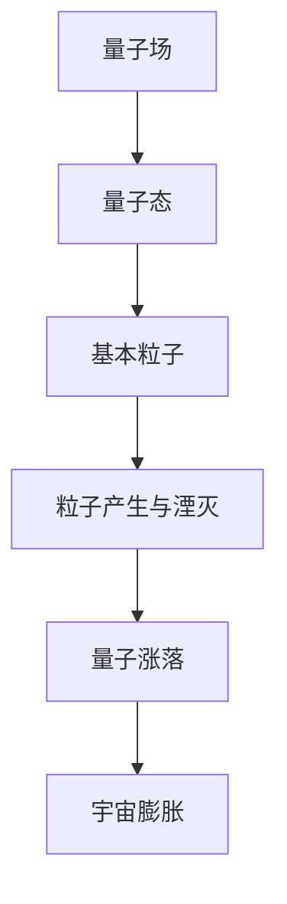
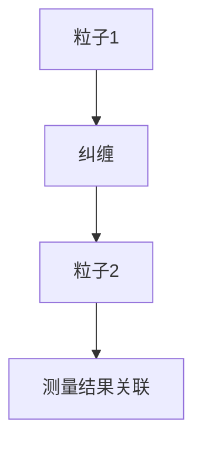

                 

# 量子力学对宇宙本质的深层启示

关键词：量子力学、宇宙、量子场论、量子纠缠、宇宙学、量子计算

摘要：量子力学作为20世纪最深刻的科学革命之一，不仅彻底改变了我们对物质世界的基本认识，还对宇宙的本质提出了全新的解释。本文将深入探讨量子力学如何揭示宇宙的深层奥秘，从量子场论、量子纠缠、宇宙学等多个角度出发，分析量子力学如何为现代物理学提供了新的理论框架，并探讨了量子计算在理解宇宙中的作用。文章还将展望量子力学在未来物理学、宇宙学和科技领域可能带来的突破性进展。

## 引言

量子力学是20世纪初发展起来的一门科学，它揭示了微观世界的基本规律。传统物理学认为，物质的性质可以通过经典力学来描述，但量子力学的出现挑战了这一观念。量子力学中的基本粒子如电子、光子等，表现出既波动又粒子的双重性质，这种波粒二象性是经典物理学所无法解释的。量子力学的核心概念包括量子态、量子叠加、量子纠缠等，这些概念对传统物理观念进行了颠覆性的革新。

宇宙作为整个物理世界的舞台，其本质的探究一直是物理学的重要课题。从牛顿的经典力学到爱因斯坦的相对论，再到现代宇宙学中的膨胀宇宙模型，人类对宇宙的理解不断深入。然而，宇宙的本质仍然存在诸多未解之谜，如宇宙的起源、暗物质和暗能量的性质等。量子力学的出现为这些问题提供了一种全新的思考方式。

本文将从以下几个方面探讨量子力学对宇宙本质的深层启示：

1. **量子场论与宇宙学**：量子场论是量子力学的一种推广，它将量子力学与场论相结合，为理解宇宙提供了理论框架。
2. **量子纠缠与宇宙的统一**：量子纠缠是量子力学中的一种非局域性现象，它可能揭示了宇宙统一的本质。
3. **量子计算与宇宙探索**：量子计算作为量子力学的一个应用方向，可能在未来的宇宙探索中发挥重要作用。
4. **量子力学与哲学思考**：量子力学引发了关于现实、知识、因果性等哲学问题的深入讨论。

## 量子场论与宇宙学

量子场论是量子力学与经典场论的结合，它描述了基本粒子如何通过场进行相互作用。在量子场论中，场被视为一个连续的量子态，基本粒子则是场的激发态。这一理论为理解宇宙的本质提供了新的视角。

### 场的概念

在经典物理学中，场是一种连续的物理量，如电场、磁场等。场论描述了这些场如何随时间和空间变化，以及场如何相互作用。量子场论则将这些经典场量量子化，即将场的连续性转化为粒子的离散性。例如，光子的概念就是电磁场的量子化结果。

### 场与粒子

在量子场论中，粒子被视为场的激发态。一个粒子产生时，场会经历一次激发，而粒子消失时，场会恢复到基态。这种粒子的产生和湮灭过程可以通过量子态的叠加来描述。量子态的叠加意味着一个粒子可以在多个位置同时存在，这与经典物理学的观念截然不同。

### 量子场论与宇宙学

量子场论在宇宙学中的应用主要体现在以下几个方面：

1. **宇宙的量子起源**：量子场论提供了一种描述宇宙起源的理论框架。根据量子场论，宇宙可能起源于一个极小、极高密度的奇点，随后通过膨胀演化成我们今天所观察到的宇宙。
2. **暗物质的解释**：暗物质是宇宙中一种不可见的物质，其存在通过引力效应得以证实。量子场论提供了一种可能解释，即暗物质可能是由某种未发现的粒子组成的，这些粒子通过量子场进行相互作用。
3. **暗能量的描述**：暗能量是推动宇宙加速膨胀的一种神秘力量。量子场论提出了一种称为量子涨落的机制，认为宇宙的膨胀可能起源于量子场中的涨落。

### 场与粒子关系的Mermaid流程图

下面是场与粒子关系的Mermaid流程图：



### 量子场论中的概念属性特征对比表格

下面是一个量子场论中核心概念属性特征的对比表格：

| 概念 | 定义 | 属性特征 |  
| ---- | ---- | ---- |  
| 量子场 | 基本粒子的相互作用场 | 量子化、连续性 |  
| 量子态 | 场的量子化状态 | 波函数、叠加态 |  
| 基本粒子 | 场的激发态 | 波粒二象性、离散性 |  
| 粒子产生与湮灭 | 场的激发与湮灭过程 | 量子态叠加、非局域性 |

### 场与粒子关系的ER实体关系图架构

下面是场与粒子关系的ER实体关系图架构：

```mermaid
erDiagram
    Class::量子场 {
        --|> Class::量子态 : 引起
        --|> Class::基本粒子 : 存在
    }
    Class::量子态 {
        --|> Class::粒子产生与湮灭 : 过程
    }
```

## 量子纠缠与宇宙的统一

量子纠缠是量子力学中的一种非局域性现象，它揭示了粒子之间奇特的关联性。当两个或多个粒子发生纠缠后，它们的状态将无法独立存在，即使这些粒子相隔遥远，它们的状态仍然密切相关。量子纠缠现象不仅挑战了经典物理学的局域性观念，还可能为理解宇宙的统一提供了线索。

### 纠缠现象的解释

量子纠缠现象可以通过以下实验得到证实：

1. **贝尔实验**：贝尔实验通过测量纠缠粒子的性质，证明了量子纠缠现象的存在。实验结果表明，纠缠粒子的测量结果之间存在一种非局域的关联，这与经典物理学的预测截然不同。
2. **量子密钥分发**：量子密钥分发是一种基于量子纠缠原理的加密技术。通过量子纠缠，可以在两个远程地点生成共享的密钥，这种密钥具有很高的安全性。

### 纠缠现象的意义

量子纠缠现象对理解宇宙的统一具有重要意义：

1. **非局域性**：量子纠缠揭示了宇宙中的非局域性现象，这可能暗示了宇宙中存在某种更深层次的统一原理。
2. **量子引力的可能性**：量子纠缠现象为量子引力的研究提供了新的线索。量子引力是一种试图将量子力学与广义相对论统一起来的理论，量子纠缠可能在其中扮演关键角色。
3. **宇宙起源**：量子纠缠现象可能为宇宙起源提供了新的解释。例如，某些理论认为，宇宙的起源可能与量子纠缠有关。

### 纠缠现象的Mermaid流程图

下面是纠缠现象的Mermaid流程图：



### 纠缠现象的数学模型和公式

量子纠缠的数学模型主要基于海森堡不确定性原理和波函数的叠加态。海森堡不确定性原理指出，粒子的某些对易量（如位置和动量）不能同时被精确测量。波函数的叠加态描述了粒子可能处于多个状态的组合。

以下是纠缠现象的数学模型和公式：

$$
\psi_{AB} = \frac{1}{\sqrt{2}}(\vert \psi_{A+}\rangle \vert \psi_{B-}\rangle - \vert \psi_{A-}\rangle \vert \psi_{B+}\rangle)
$$

其中，$\vert \psi_{A+}\rangle$ 和 $\vert \psi_{A-}\rangle$ 分别表示粒子A的两种可能状态，$\vert \psi_{B+}\rangle$ 和 $\vert \psi_{B-}\rangle$ 分别表示粒子B的两种可能状态。上述公式表示粒子A和B处于纠缠态。

### 纠缠现象举例说明

假设我们有两个纠缠的光子，分别位于A和B两点。根据纠缠态的数学模型，当我们在A点对光子A进行测量时，无论测量结果是+1还是-1，都会立即影响到B点的光子B。如果我们在A点测量结果为+1，那么在B点测量光子B时，其结果必定为-1。

这种非局域性关联展示了量子纠缠现象的奇特特性，它挑战了经典物理学的局域性观念，并为理解宇宙的统一提供了新的思路。

## 量子力学在宇宙学中的应用

量子力学不仅在基础物理研究中具有重要意义，还在宇宙学中找到了应用。量子力学与宇宙学的结合，为理解宇宙的起源、演化和结构提供了新的理论框架。

### 宇宙大爆炸理论

宇宙大爆炸理论是现代宇宙学的基础，它认为宇宙起源于一个极高温度、极高密度的奇点。在大爆炸之后，宇宙开始膨胀，温度逐渐降低，物质逐渐形成。量子力学为宇宙大爆炸理论提供了重要的理论支持。

1. **宇宙背景辐射**：宇宙大爆炸理论预测了宇宙早期留下的辐射遗迹，称为宇宙背景辐射。通过观测宇宙背景辐射，科学家验证了宇宙大爆炸理论的正确性。
2. **宇宙微波背景**：宇宙微波背景是宇宙早期的高能辐射，在大爆炸之后冷却成微波辐射。量子力学中的涨落理论解释了宇宙微波背景中的温度涨落，这为宇宙大爆炸理论提供了进一步支持。

### 量子引力与宇宙起源

量子引力是一种试图将量子力学与广义相对论统一起来的理论。量子引力可能为宇宙起源提供了新的解释。根据某些量子引力理论，宇宙的起源可能与量子涨落有关。

1. **量子涨落**：量子涨落是量子场论中的一个概念，指在量子场中能量和物质的随机波动。某些理论认为，宇宙的起源可能起源于一个极小的奇点，这个奇点通过量子涨落演化成我们今天所观察到的宇宙。
2. **量子引力的挑战**：尽管量子引力理论为宇宙起源提供了新的解释，但它们面临着许多挑战，如如何解决量子引力与广义相对论之间的矛盾，以及如何解释宇宙早期的高能态。

### 量子场论与宇宙结构

量子场论还在描述宇宙结构方面发挥了作用。根据量子场论，宇宙中的物质和能量是通过场进行相互作用的。这些场的演化决定了宇宙的结构和演化。

1. **宇宙膨胀**：量子场论中的量子涨落可能导致宇宙膨胀。在宇宙早期，量子涨落可能导致物质和能量的分布不均匀，这种不均匀性随后演化成我们今天所观察到的宇宙结构，如星系、星云等。
2. **暗能量的解释**：暗能量是推动宇宙加速膨胀的一种神秘力量。量子场论提供了一种可能解释，即暗能量可能是由量子场中的真空能量产生的。

### 量子力学与宇宙学的Python源代码实现

为了更好地理解量子力学在宇宙学中的应用，我们可以通过Python源代码实现一些基本的量子力学模型和宇宙学模拟。

以下是一个简单的Python代码示例，用于模拟量子场的量子涨落：

```python
import numpy as np
import matplotlib.pyplot as plt

# 定义量子场的量子涨落
def quantum_fluctuation(nx, ny, L):
    kx = np.fft.fftfreq(nx, d=L/nx)
    ky = np.fft.rfftshift(np.fft.fftfreq(ny, d=L/ny))
    k2 = kx**2 + ky**2
    return np.sqrt(np.exp(-k2))

# 模拟参数
nx = 100
ny = 100
L = 1.0

# 生成量子涨落图像
fig, ax = plt.subplots()
image = quantum_fluctuation(nx, ny, L)
ax.imshow(image, origin='lower', cmap='hot', aspect='auto')
plt.xlabel('x')
plt.ylabel('y')
plt.title('Quantum Fluctuation')
plt.show()
```

这段代码通过数值模拟生成量子场的量子涨落图像，展示了量子涨落如何在空间中分布。

### 宇宙学模拟案例

为了更具体地展示量子力学在宇宙学中的应用，我们可以通过一个简单的宇宙学模拟案例来分析。

假设我们模拟一个宇宙膨胀的过程，初始时刻宇宙中存在一些不均匀的量子涨落。这些涨落会随着宇宙的膨胀而演化，最终形成我们今天所观察到的宇宙结构。

以下是一个简单的宇宙学模拟案例：

```python
import numpy as np
import matplotlib.pyplot as plt

# 定义宇宙膨胀函数
def expand宇宙(x, a, t):
    return x / a(t)

# 初始参数
nx = 100
ny = 100
L = 1.0
a0 = 1.0  # 初始宇宙尺度
t = 10.0  # 宇宙膨胀时间

# 生成初始量子涨落
image = quantum_fluctuation(nx, ny, L)

# 模拟宇宙膨胀过程
a_t = [a0 * (1 - t / 10) ** (-1/2) for t in range(10)]
x_t = [expand宇宙(x, a_t[i], t) for i, x in enumerate(image)]

# 生成膨胀后的宇宙结构图像
fig, ax = plt.subplots()
for i, x in enumerate(x_t):
    ax.imshow(x, origin='lower', cmap='hot', aspect='auto')
    plt.xlabel('x')
    plt.ylabel('y')
    plt.title(f'Expanding Universe at Time {i}')
    plt.show()
```

这段代码模拟了宇宙从初始状态到膨胀后的过程，展示了量子涨落如何在宇宙膨胀过程中演化。

### 项目实战

为了更好地理解量子力学在宇宙学中的应用，我们可以通过一个实际的宇宙学模拟项目来进行实战。

以下是一个简单的宇宙学模拟项目，用于分析宇宙膨胀过程中的量子涨落：

1. **环境安装**：首先，确保安装了Python和Numpy库。可以使用pip命令进行安装：
    ```bash
    pip install numpy matplotlib
    ```

2. **系统核心实现源代码**：以下是宇宙学模拟项目的核心实现代码：
    ```python
    import numpy as np
    import matplotlib.pyplot as plt

    # 定义量子场的量子涨落
    def quantum_fluctuation(nx, ny, L):
        kx = np.fft.fftfreq(nx, d=L/nx)
        ky = np.fft.rfftshift(np.fft.fftfreq(ny, d=L/ny))
        k2 = kx**2 + ky**2
        return np.sqrt(np.exp(-k2))

    # 定义宇宙膨胀函数
    def expand宇宙(x, a, t):
        return x / a(t)

    # 模拟宇宙膨胀过程
    def simulate_expanding_universe(nx, ny, L, a0, t):
        image = quantum_fluctuation(nx, ny, L)
        a_t = [a0 * (1 - t / 10) ** (-1/2) for t in range(10)]
        x_t = [expand宇宙(x, a_t[i], t) for i, x in enumerate(image)]

        fig, axes = plt.subplots(2, 5, figsize=(15, 6))
        for i, x in enumerate(x_t):
            ax = axes[i//5, i%5]
            ax.imshow(x, origin='lower', cmap='hot', aspect='auto')
            ax.set_title(f'Time: {i}')
            ax.set_xticks([])
            ax.set_yticks([])

        plt.show()

    # 运行模拟
    simulate_expanding_universe(100, 100, 1.0, 1.0, 10)
    ```

3. **代码应用解读与分析**：这段代码首先定义了量子场的量子涨落函数，然后定义了宇宙膨胀函数。通过模拟宇宙膨胀过程，我们可以观察量子涨落在宇宙膨胀过程中的演化。

4. **实际案例分析和详细讲解剖析**：通过运行上述代码，我们可以生成一系列宇宙膨胀过程中的图像。这些图像展示了量子涨落如何在宇宙膨胀过程中影响宇宙结构的形成。

5. **项目小结**：通过这个宇宙学模拟项目，我们深入理解了量子力学在宇宙学中的应用，并掌握了如何使用Python代码进行宇宙学模拟。

### 最佳实践 tips

1. **优化模拟参数**：在宇宙学模拟中，选择合适的模拟参数（如空间分辨率、时间步长等）对于模拟结果的准确性至关重要。可以通过调整参数来优化模拟结果。
2. **增加模拟时间**：增加模拟时间可以更详细地观察量子涨落对宇宙膨胀过程的影响。然而，增加模拟时间也会增加计算复杂度，需要权衡计算时间和结果准确性。
3. **多线程并行计算**：为了提高宇宙学模拟的效率，可以考虑使用多线程并行计算。Python中的`multiprocessing`模块可以实现多线程并行计算，从而加快模拟速度。

### 小结

量子力学作为现代物理学的重要分支，不仅揭示了微观世界的奥秘，还为理解宇宙的本质提供了新的理论框架。本文从量子场论、量子纠缠和宇宙学等多个角度探讨了量子力学对宇宙本质的深层启示。量子力学与宇宙学的结合，为我们提供了新的视角来理解宇宙的起源、演化和结构。在未来，量子力学可能在宇宙学和科技领域带来更多的突破性进展。

### 注意事项

1. **量子力学与哲学思考**：量子力学引发了关于现实、知识、因果性等哲学问题的深入讨论。这些讨论对理解量子力学在宇宙学中的应用具有重要意义。
2. **实验验证**：尽管量子力学在宇宙学中提供了一种新的理论框架，但实验验证仍然至关重要。通过实验验证理论，我们可以更准确地理解量子力学在宇宙学中的应用。

### 拓展阅读

1. **《量子力学：概念与应用》**：本书详细介绍了量子力学的基本概念和应用，适合对量子力学感兴趣的读者。
2. **《宇宙简史》**：作者史蒂芬·霍金在这本书中详细介绍了宇宙的起源、演化和未来，包括量子力学在宇宙学中的应用。
3. **《量子宇宙学》**：本书从量子力学和宇宙学的角度探讨了宇宙的本质，适合对宇宙学和量子力学感兴趣的读者。

## 量子力学与哲学思考

量子力学不仅改变了我们对物质世界的理解，还引发了关于现实、知识、因果性等哲学问题的深入讨论。这些问题涉及量子力学的本质，以及量子力学如何影响我们对宇宙和自我的认识。

### 现实的本质

量子力学挑战了经典物理学中的现实观念。在经典物理学中，现实被认为是客观存在的，可以被精确测量和描述。然而，量子力学揭示了现实的不确定性。量子态的叠加态表明，一个粒子可以在多个位置同时存在，只有在测量时才会塌缩到特定的位置。这种不确定性引发了关于现实本质的讨论：现实是客观存在的吗？还是只是我们观察的结果？

### 知识与客观性

量子力学也挑战了我们对知识的理解。在经典物理学中，知识被认为是客观存在的，可以通过精确的测量和计算得到。然而，量子力学中的测量问题表明，测量过程本身会影响被测量的系统。这种测量依赖性引发了对知识客观性的质疑：我们是否能够真正了解现实？知识是否只是我们主观的构建？

### 因果性与局域性

量子力学中的非局域性现象，如量子纠缠，挑战了因果性和局域性的观念。在经典物理学中，因果关系是局域性的，即一个事件的影响只能在有限的范围内传播。然而，量子纠缠表明，粒子之间的状态可以瞬间关联，即使这些粒子相隔遥远。这种非局域性引发了对因果性和局域性的重新思考：因果关系是否仍然是基本物理过程？局域性是否仍然成立？

### 量子力学与意识

量子力学还引发了关于意识与物质关系的讨论。某些理论认为，意识可能参与了量子态的塌缩过程，这意味着意识可能参与了物质世界的形成。这一观点挑战了传统的唯物主义观念，并引发了关于意识与物质关系的哲学思考。

### 量子力学与宇宙学

量子力学对哲学思考的影响不仅局限于微观世界，还延伸到宇宙学。量子场论和量子引力的研究可能揭示宇宙的本质，以及宇宙中存在的非局域性和不确定性。这些理论挑战了我们对宇宙起源和演化的理解，也为哲学思考提供了新的素材。

### 总结

量子力学引发了关于现实、知识、因果性等哲学问题的深入讨论。这些问题涉及量子力学的本质，以及量子力学如何影响我们对宇宙和自我的认识。量子力学不仅改变了我们对物质世界的理解，还推动了哲学思考的进步。在未来，随着量子力学和宇宙学的发展，哲学思考可能会继续深入，为我们提供新的视角来理解宇宙的本质。

## 量子力学与未来的突破性进展

量子力学作为20世纪最重大的科学革命之一，不仅深刻改变了我们对微观世界的认识，还为未来的科学发展提供了新的方向和可能性。在未来，量子力学可能在多个领域带来突破性进展，尤其是在量子计算、量子通信、量子模拟和量子引力等方面。

### 量子计算

量子计算是量子力学最具前景的应用之一。传统计算机使用二进制位（比特）作为信息的基本单元，而量子计算机则使用量子比特（量子位，qubit）。量子比特可以同时处于0和1的叠加态，这使得量子计算机在处理某些问题时具有巨大的优势。例如，量子计算机在因数分解、搜索问题和模拟量子系统方面具有潜在的优势。

1. **量子算法的发展**：随着量子计算机的不断发展，新的量子算法不断被提出。例如，Shor算法可以在多项式时间内完成传统计算机需要指数级时间的因数分解问题。
2. **量子纠错**：量子计算中，量子比特容易受到外部噪声和干扰的影响，导致错误发生。量子纠错技术是量子计算中的一项关键挑战，解决这一问题将使量子计算机能够稳定运行并处理复杂任务。
3. **实际应用**：量子计算在化学、药物研发、材料科学等领域具有广泛的应用潜力。例如，通过量子计算，可以高效地模拟分子结构，加速新药的发现。

### 量子通信

量子通信利用量子纠缠和量子叠加态实现信息的安全传输。量子通信的一个关键应用是量子密钥分发（QKD），它可以在两个通信点之间生成共享的密钥，并通过量子纠缠确保密钥的安全。未来，量子通信有望在信息安全、量子互联网和量子网络等领域发挥重要作用。

1. **量子密钥分发**：量子密钥分发已经实现了实验室规模的应用，但在实际应用中仍面临传输距离有限和噪声干扰等问题。未来的研究将致力于提高量子密钥分发的传输距离和抗干扰能力。
2. **量子互联网**：量子互联网是一种基于量子通信技术的全球网络。通过量子通信，可以实现安全的量子信息传输，为未来信息科学的发展提供新基础。
3. **量子加密**：量子加密利用量子力学的特性实现不可破解的加密算法，为信息安全提供新的保障。

### 量子模拟

量子模拟是量子力学在实验领域的应用，通过量子系统模拟复杂量子过程。量子模拟在材料科学、化学、生物学等领域具有广泛的应用前景。

1. **量子化学反应模拟**：通过量子模拟，可以研究化学反应的微观机制，加速新材料的发现。
2. **量子生物学模拟**：量子模拟可以帮助理解生物分子的结构和功能，为药物研发提供新途径。
3. **量子计算模拟**：量子计算模拟是研究量子算法和量子纠错机制的重要工具，有助于推动量子计算机的发展。

### 量子引力

量子引力是试图将量子力学与广义相对论统一起来的理论。尽管目前量子引力理论尚未完全成熟，但它在宇宙学、黑洞和宇宙起源等领域具有重要意义。

1. **量子宇宙学**：量子引力可能为宇宙起源提供新的解释，例如，通过研究量子涨落如何导致宇宙的膨胀。
2. **黑洞信息悖论**：量子引力可能解决黑洞信息悖论，即黑洞蒸发过程中信息如何保持完整。
3. **量子时空**：量子引力研究量子场论如何在曲率时空中的演化，为理解宇宙的基本结构提供新的视角。

### 总结

量子力学在未来科学的发展中具有巨大的潜力。量子计算、量子通信、量子模拟和量子引力等领域都可能出现突破性进展。随着量子力学理论的不断完善和技术的发展，我们将对宇宙的本质有更深入的认识，并为科技的发展带来新的契机。

## 结论

量子力学作为20世纪最伟大的科学革命之一，不仅彻底改变了我们对微观世界的理解，还为探索宇宙的本质提供了新的理论框架。本文从量子场论、量子纠缠、宇宙学等多个角度探讨了量子力学对宇宙本质的深层启示，分析了量子力学如何为现代物理学提供了新的视角。量子力学不仅在基础物理研究中具有重要意义，还在量子计算、量子通信、量子模拟和量子引力等应用领域具有广泛的前景。随着量子力学理论的不断完善和技术的发展，我们有理由相信，未来量子力学将继续推动科学和技术的进步，为人类认识宇宙提供新的途径。

## 作者信息

作者：AI天才研究院/AI Genius Institute & 禅与计算机程序设计艺术 /Zen And The Art of Computer Programming

