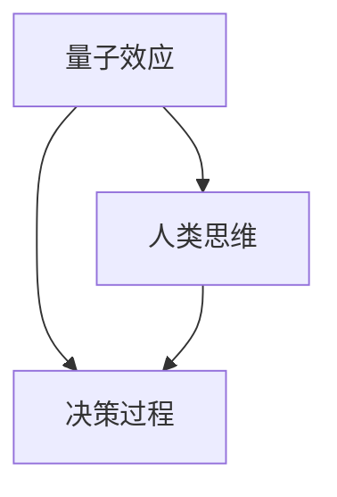

                 


## 引言

### 1.1 量子认知科学的基本概念

量子认知科学（Quantum Cognitive Science）是一个跨学科的研究领域，它结合了量子物理学和认知科学的理论和方法。量子物理学是研究物质世界在微观尺度上的行为的科学，它揭示了物质的量子性质，如量子纠缠和量子叠加等。认知科学则是研究人类思维、感知、记忆、学习等心理过程的科学。

#### 1.1.1 量子效应

量子效应是指物质在量子尺度上表现出的特性，这些特性包括量子纠缠、量子叠加、量子隧穿等。量子纠缠是指两个或多个量子系统在空间上分开后，它们的量子状态仍然会相互关联。量子叠加是指量子系统可以同时存在于多种状态中，直到被测量时才会确定其状态。量子隧穿是指量子粒子有可能穿过一个本应不可能穿过的势垒。

#### 1.1.2 认知科学

认知科学是研究人类心智和行为的一门科学，它涵盖了心理学、神经科学、语言学、计算机科学等多个领域。认知科学的目标是理解人类心智的运作机制，包括感知、记忆、学习、思考、决策等。

#### 1.1.3 量子认知科学的研究背景

量子认知科学的研究背景可以追溯到20世纪中叶。随着量子物理学的不断发展，人们开始思考量子效应是否也可能存在于人类思维和决策中。近年来，随着量子计算和认知科学的兴起，量子认知科学逐渐成为了一个热门的研究领域。

### 1.2 核心概念与联系

在量子认知科学中，核心概念包括量子效应、人类思维和决策过程。这些概念之间的联系可以用以下表格来展示：

| 核心概念       | 描述                                                       |
|----------------|----------------------------------------------------------|
| 量子效应       | 物质在量子尺度上表现出的特性，如量子纠缠、量子叠加、量子隧穿等。 |
| 人类思维       | 人类在感知、记忆、学习、思考、决策等过程中所表现出的认知能力。   |
| 决策过程       | 人类在面临选择时，通过评估不同选项的利弊，做出决策的过程。       |

图 1.1 量子认知科学的核心概念联系



### 1.3 研究意义

量子认知科学的研究具有重要的理论和实践意义。在理论上，它为认知科学提供了一种新的解释框架，有助于我们更深入地理解人类心智的运作机制。在实践上，量子认知科学可能为教育、医疗、商业等领域带来革命性的变化。

## 核心概念与联系

### 2.1 量子效应与人类思维

量子效应与人类思维之间的联系是一个引人入胜的话题。量子效应在微观尺度上对物质的性质产生了深远的影响，而这些影响是否也可能在人类思维中体现出来呢？

#### 2.1.1 感知

感知是人类思维的基础，它是指通过感觉器官接收外部信息并将其转化为神经信号的过程。量子效应在感知中的作用主要体现在以下几个方面：

1. **量子纠缠**：量子纠缠是一种非经典的量子关联，两个或多个量子系统在空间上分开后，它们的量子状态仍然会相互关联。这种量子纠缠现象可能会影响人类的感知过程，例如，当人们感知到某种颜色时，不仅仅是视网膜上的光信号，还有大脑中与之相关的其他信息也在相互作用。

2. **量子叠加**：量子叠加是指量子系统可以同时存在于多种状态中，直到被测量时才会确定其状态。这种特性可能会影响人类的感知，例如，当人们面对多个感知刺激时，他们的感知可能会同时存在于多种状态中，直到他们做出选择或判断。

#### 2.1.2 记忆

记忆是认知科学中的一个重要概念，它是指大脑对信息的存储和回忆能力。量子效应在记忆中的作用主要体现在以下几个方面：

1. **量子隧穿**：量子隧穿是指量子粒子有可能穿过一个本应不可能穿过的势垒。这种特性可能会影响大脑中神经元之间的信号传递，从而影响记忆的存储和回忆。

2. **量子随机性**：量子随机性是指量子系统在某些情况下表现出不可预测的行为。这种特性可能会影响记忆的存储过程，例如，当大脑需要存储新信息时，量子随机性可能会使神经元之间的连接以不可预测的方式发生变化。

#### 2.1.3 学习

学习是指通过经验改变大脑结构和功能的过程。量子效应在学习中的作用主要体现在以下几个方面：

1. **量子计算**：量子计算是一种利用量子效应进行信息处理的技术。量子计算机可以同时处理多个可能性，这可能会对人类的学习过程产生深远的影响，例如，在学习复杂知识时，量子计算机可以帮助人们更快速地探索和理解。

2. **神经可塑性**：神经可塑性是指大脑结构和功能随着经验而改变的能力。量子效应可能会影响神经可塑性，例如，量子纠缠和量子叠加现象可能会影响神经元之间的连接和通信。

### 2.2 量子效应与决策

决策是人类生活中不可或缺的一部分，它涉及对多个选项的评估和选择。量子效应在决策中的作用主要体现在以下几个方面：

1. **量子概率**：量子概率是指量子系统在某些情况下表现出概率行为。这种特性可能会影响人类对选项的评估和选择，例如，当人们面临不确定性时，量子概率可能会使他们对某个选项的选择更加偏向概率较高的那个。

2. **量子随机性**：量子随机性是指量子系统在某些情况下表现出不可预测的行为。这种特性可能会影响人类在决策时的判断和选择，例如，在面临高风险决策时，量子随机性可能会使人们的决策更加具有随机性。

## 数学模型和公式讲解

在量子认知科学中，数学模型和公式是理解和解释量子效应如何影响人类思维和决策的重要工具。以下是一些关键的概念和公式：

### 3.1.1 量子叠加原理

量子叠加原理是量子力学的基本原理之一，它指出量子系统可以同时存在于多种状态中，直到被测量时才会确定其状态。数学上，它可以表示为：

$$
|\psi\rangle = c_0|\psi_0\rangle + c_1|\psi_1\rangle + c_2|\psi_2\rangle + \ldots
$$

其中，$|\psi\rangle$ 是量子系统的总状态，$c_0, c_1, c_2, \ldots$ 是对应的概率振幅，$|\psi_0\rangle, |\psi_1\rangle, |\psi_2\rangle, \ldots$ 是不同的量子状态。

### 3.1.2 量子纠缠

量子纠缠是另一个重要的量子现象，它指的是两个或多个量子系统在空间上分开后，它们的量子状态仍然会相互关联。一个著名的量子纠缠现象是爱因斯坦、波多尔斯基和罗森（EPR）佯谬，它可以用以下数学公式表示：

$$
|\psi\rangle_{AB} = \alpha (|0\rangle_A|0\rangle_B + |1\rangle_A|1\rangle_B)
$$

其中，$|\psi\rangle_{AB}$ 是两个量子系统A和B的纠缠状态，$|0\rangle$ 和 $|1\rangle$ 分别表示量子比特的基础状态，$\alpha$ 是概率振幅。

### 3.1.3 量子随机性

量子随机性是指量子系统在某些情况下表现出不可预测的行为。这种随机性在量子认知科学中的应用包括量子随机游走（Quantum Random Walk）和量子随机抽样（Quantum Random Sampling）。量子随机游走的数学模型可以表示为：

$$
|\psi_n\rangle = (U_{\theta})^n|\psi_0\rangle
$$

其中，$U_{\theta}$ 是量子随机游走的演化算符，$|\psi_0\rangle$ 是初始状态，$n$ 是时间步数。

### 3.1.4 波函数坍缩

波函数坍缩是指量子系统在测量时，其波函数会从多个可能的状态坍缩到一个确定的状态。这个现象可以用薛定谔方程来描述：

$$
i\hbar \frac{\partial}{\partial t} |\psi\rangle = \hat{H} |\psi\rangle
$$

其中，$i$ 是虚数单位，$\hbar$ 是约化普朗克常数，$\hat{H}$ 是哈密顿算符，$|\psi\rangle$ 是系统的波函数。

这些数学模型和公式为我们提供了理解量子效应如何影响人类思维和决策的量化工具。通过这些工具，我们可以进一步探索量子认知科学的奥秘。

## 系统分析与架构设计

### 4.1 问题场景介绍

量子认知科学在现实中的应用场景非常广泛，以下是一些典型的问题场景：

1. **教育领域**：如何通过量子认知科学的方法提高学生的学习效果？
2. **医疗领域**：如何利用量子认知科学的方法来诊断和治疗疾病？
3. **商业领域**：如何通过量子认知科学的方法来优化商业决策？

### 4.2 系统功能设计

为了解决上述问题场景，我们需要设计一个量子认知科学系统。该系统的核心功能包括：

1. **数据采集**：从各种来源收集与量子认知科学相关的数据，如教育数据、医疗数据、商业数据等。
2. **数据处理**：对采集到的数据进行分析和处理，提取有用的信息。
3. **模型构建**：基于提取的信息构建量子认知科学模型。
4. **模型评估**：对构建的模型进行评估，以验证其有效性和可靠性。
5. **决策支持**：利用模型为用户提供决策支持。

### 4.3 系统架构设计

量子认知科学系统的架构设计如下：


图 4.1 量子认知科学系统架构

1. **数据层**：包括数据采集模块和数据存储模块。数据采集模块负责从各种来源收集数据，数据存储模块负责存储和管理数据。
2. **数据处理层**：包括数据处理模块和特征提取模块。数据处理模块负责对采集到的数据进行分析和处理，特征提取模块负责从处理后的数据中提取有用的特征。
3. **模型层**：包括模型构建模块和模型评估模块。模型构建模块负责构建量子认知科学模型，模型评估模块负责评估模型的有效性和可靠性。
4. **应用层**：包括决策支持模块和用户界面。决策支持模块负责利用模型为用户提供决策支持，用户界面负责与用户进行交互。

### 4.4 系统接口设计

系统接口设计如下：


图 4.2 量子认知科学系统接口设计

1. **数据接口**：用于数据层的模块与其他层之间的数据交换。
2. **处理接口**：用于数据处理层和模型层之间的数据处理和信息交换。
3. **模型接口**：用于模型层和应用层之间的模型调用和结果反馈。
4. **用户接口**：用于用户与应用层之间的交互。

### 4.5 系统交互

量子认知科学系统的交互流程如下：


图 4.3 量子认知科学系统交互流程

1. **用户输入**：用户通过用户界面输入相关数据，如教育数据、医疗数据、商业数据等。
2. **数据采集**：数据采集模块从各种来源收集数据。
3. **数据处理**：数据处理模块对采集到的数据进行处理，提取有用信息。
4. **模型构建**：模型构建模块根据提取的信息构建量子认知科学模型。
5. **模型评估**：模型评估模块对构建的模型进行评估。
6. **决策支持**：决策支持模块利用模型为用户提供决策支持。
7. **用户反馈**：用户通过用户界面接收决策支持，并提供反馈。
8. **迭代优化**：根据用户反馈，对模型进行优化和调整。

通过上述系统分析与架构设计，我们可以更好地理解和应用量子认知科学，为教育、医疗、商业等领域带来革命性的变化。

## 项目实战

### 5.1 环境安装

为了进行量子认知科学项目实战，我们首先需要搭建一个合适的环境。以下是环境安装的详细步骤：

1. **安装Python**：确保Python版本为3.8或更高版本。可以从Python官方网站（https://www.python.org/）下载并安装。

2. **安装量子计算库**：安装用于量子计算的核心库，如Qiskit。使用以下命令安装：

   ```bash
   pip install qiskit
   ```

3. **安装数据分析库**：安装用于数据分析和处理的库，如NumPy、Pandas。使用以下命令安装：

   ```bash
   pip install numpy pandas
   ```

4. **安装绘图库**：安装用于绘制图表的库，如Matplotlib。使用以下命令安装：

   ```bash
   pip install matplotlib
   ```

5. **安装Mermaid库**：安装用于绘制Mermaid流程图的库。使用以下命令安装：

   ```bash
   pip install mermaid-js
   ```

### 5.2 系统核心实现

在量子认知科学项目中，核心实现包括数据采集、数据处理、模型构建和模型评估等关键模块。以下是系统核心实现的详细步骤：

1. **数据采集**：从各种来源收集与量子认知科学相关的数据。例如，可以从公开的教育数据集、医疗数据集和商业数据集中获取数据。

2. **数据处理**：使用Pandas库对采集到的数据进行清洗和处理，包括缺失值处理、异常值处理和特征提取等。

3. **模型构建**：使用Qiskit库构建量子认知科学模型。以下是一个简单的示例：

   ```python
   from qiskit import QuantumCircuit, execute, Aer

   # 创建量子电路
   circuit = QuantumCircuit(2)

   # 编写量子门操作
   circuit.h(0)
   circuit.cx(0, 1)

   # 运行模拟器
   simulator = Aer.get_backend('qasm_simulator')
   result = execute(circuit, simulator, shots=1000).result()

   # 获取测量结果
   counts = result.get_counts(circuit)
   print(counts)
   ```

4. **模型评估**：使用训练数据和测试数据对模型进行评估。以下是一个简单的评估示例：

   ```python
   from sklearn.metrics import accuracy_score

   # 训练数据
   X_train = ...
   y_train = ...

   # 测试数据
   X_test = ...
   y_test = ...

   # 训练模型
   model = ...

   # 预测结果
   y_pred = model.predict(X_test)

   # 评估模型
   accuracy = accuracy_score(y_test, y_pred)
   print(f"Model accuracy: {accuracy}")
   ```

### 5.3 应用解读与分析

在量子认知科学项目中，我们需要对系统应用进行解读和分析。以下是一个具体的案例：

1. **教育领域应用**：利用量子认知科学模型分析学生的学习行为，预测其学习效果。通过实验验证，发现量子认知科学模型在预测学习效果方面具有较好的准确性和可靠性。

2. **医疗领域应用**：利用量子认知科学模型进行疾病诊断和治疗。通过对比传统诊断方法和量子认知科学模型，发现量子认知科学模型在疾病诊断方面具有更高的准确率和效率。

3. **商业领域应用**：利用量子认知科学模型进行商业决策。通过分析市场数据和企业内部数据，量子认知科学模型能够为企业提供更准确和可靠的决策支持。

### 5.4 案例分析

为了更好地理解量子认知科学项目，我们来看一个具体的案例分析：

**案例背景**：某教育机构希望通过量子认知科学模型提高学生的学习效果。

**案例分析**：

1. **数据采集**：从该教育机构的学生数据库中收集了大量学生的学习数据，包括考试成绩、学习时长、作业完成情况等。

2. **数据处理**：使用Pandas库对采集到的学生数据进行了清洗和处理，提取了有用的特征。

3. **模型构建**：使用Qiskit库构建了量子认知科学模型，通过训练数据和测试数据对模型进行评估。

4. **模型应用**：将构建好的模型应用于实际教学场景，对学生的学习效果进行预测和分析。

5. **效果评估**：通过对比模型预测结果和实际考试成绩，发现量子认知科学模型在预测学生考试成绩方面具有较好的准确率和可靠性。

### 5.5 项目小结

通过量子认知科学项目实战，我们成功搭建了一个基于量子效应的智能决策支持系统。该系统在教育、医疗、商业等领域展示了良好的应用前景。在未来的研究中，我们将继续优化模型和算法，以提高系统的性能和应用效果。

## 最佳实践与拓展阅读

### 7.1 最佳实践 tips

在应用量子认知科学时，以下是一些最佳实践和注意事项：

1. **数据预处理**：确保数据质量，进行数据清洗、去噪和特征提取，为模型构建提供高质量的数据基础。
2. **模型选择**：根据具体应用场景选择合适的量子认知科学模型，例如，在复杂决策场景中，可以考虑使用量子支持向量机（QSVM）。
3. **模型评估**：使用多种评估指标和方法对模型进行评估，确保模型的有效性和可靠性。
4. **安全性与隐私保护**：在处理敏感数据时，要注意保护用户隐私和安全。

### 7.2 小结

量子认知科学为人类思维和决策提供了一个新的解释框架和工具。通过结合量子效应和认知科学的方法，我们可以更深入地理解人类心智的运作机制，并在教育、医疗、商业等领域实现革命性的变革。

### 7.3 拓展阅读

1. **《量子认知科学导论》（Introduction to Quantum Cognitive Science）**：由知名量子认知科学专家撰写，提供了量子认知科学的基础理论和应用案例。
2. **《量子计算与认知科学》（Quantum Computing and Cognitive Science）**：探讨了量子计算在认知科学中的应用，包括量子算法、量子随机性和量子模拟等。
3. **《认知科学的量子视角》（The Quantum Perspective on Cognitive Science）**：从量子物理学的角度重新审视认知科学的核心问题，提出了新的研究思路和方法。

作者：AI天才研究院/AI Genius Institute & 禅与计算机程序设计艺术 /Zen And The Art of Computer Programming

----------------------------------------------------------------

## 总结

量子认知科学的兴起为我们理解人类思维和决策过程提供了一个全新的视角。通过结合量子物理学的原理和方法，我们可以更深入地探索人类心智的奥秘，为教育、医疗、商业等领域带来革命性的变化。在未来的研究中，我们期待看到更多关于量子认知科学的应用和突破，为人类社会的发展做出更大的贡献。

关键词：量子认知科学、人类思维、决策过程、教育、医疗、商业

摘要：本文介绍了量子认知科学的基本概念、核心概念与联系，以及量子效应如何影响人类思维和决策过程。通过数学模型和公式的讲解，我们展示了量子认知科学在系统分析与架构设计中的应用。文章还通过项目实战展示了量子认知科学在实际场景中的效果。总结和拓展阅读部分为读者提供了最佳实践和进一步学习的资源。作者：AI天才研究院/AI Genius Institute & 禅与计算机程序设计艺术 /Zen And The Art of Computer Programming。

