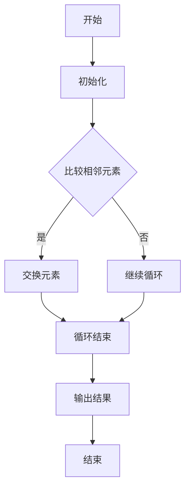
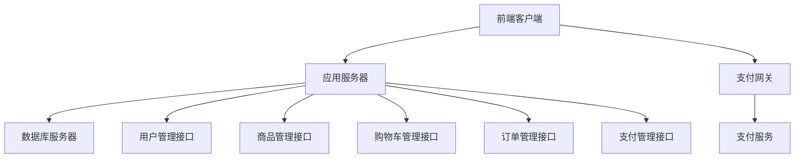
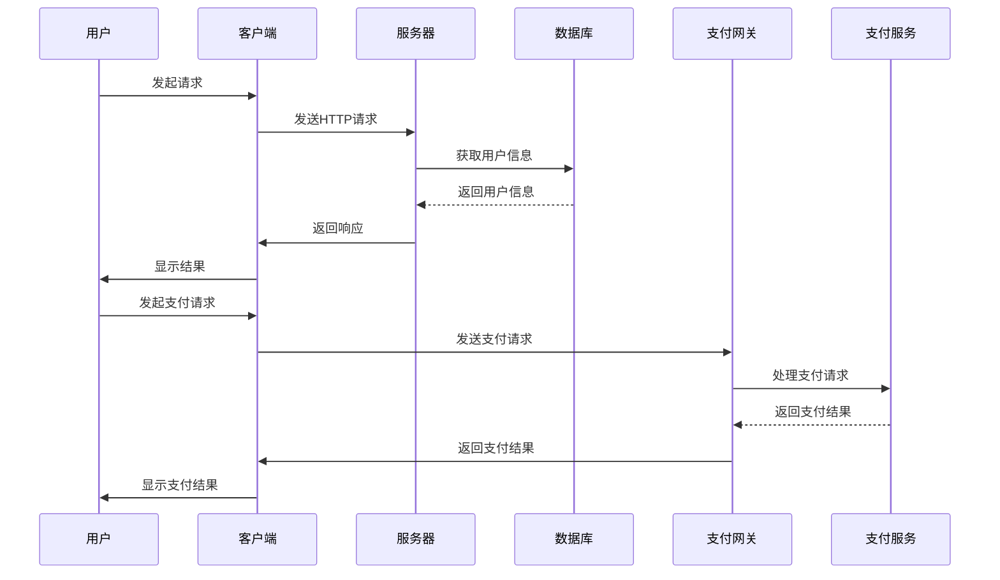

                 

## 链式思考：构建逻辑推理链的提示策略

### 关键词：逻辑推理、链式思考、提示策略、算法设计、数学模型、系统架构

> 摘要：本文将深入探讨链式思考在构建逻辑推理链中的应用策略，通过具体的案例和实践，揭示如何有效地利用逻辑推理和提示策略来解决问题。我们将从背景介绍开始，逐步分析逻辑推理的基本概念，探讨构建逻辑推理链的策略，详细介绍核心概念与联系，讲解算法原理，并运用数学模型和公式进行验证。此外，文章还将阐述系统分析与架构设计方案，分享项目实战经验，最后总结最佳实践与注意事项。

----------------------------------------------------------------

### 第一部分：逻辑推理与提示策略基础

#### 第1章：问题背景与链式思考概述

在信息爆炸和复杂性增加的时代，逻辑推理成为了解决复杂问题的关键工具。然而，如何有效地运用逻辑推理来构建逻辑推理链，从而更好地解决问题，是当前研究和实践中亟待解决的问题。链式思考作为一种有效的逻辑推理方法，通过一系列的提示策略，能够帮助我们在复杂的问题场景中找到清晰、合理的解决方案。

#### 第2章：逻辑推理的基本概念

逻辑推理是指从已知的前提中推导出新的结论的思维过程。逻辑推理分为演绎推理和归纳推理两大类。演绎推理是从一般到特殊的推理过程，而归纳推理则是从特殊到一般的推理过程。理解逻辑推理的基本概念是构建逻辑推理链的前提。

#### 第3章：构建逻辑推理链的策略

构建逻辑推理链的关键在于找到合适的提示策略。提示策略可以分为信息提示、情境提示和问题提示等多种类型。有效的提示策略能够帮助我们迅速找到问题核心，构建逻辑推理链，从而解决问题。

#### 第4章：核心概念与联系

在构建逻辑推理链的过程中，核心概念之间的联系至关重要。通过概念对比表格和ER实体关系图，我们可以清晰地理解各个概念之间的相互关系，为构建逻辑推理链提供坚实的基础。

#### 第5章：算法原理讲解

算法是逻辑推理链的核心。通过mermaid流程图和Python源代码，我们可以详细阐述算法原理，并运用数学模型和公式进行验证，确保算法的有效性和可靠性。

#### 第6章：数学模型和数学公式

数学模型和公式是逻辑推理链的重要组成部分。通过latex格式嵌入文中，我们可以直观地展示数学模型和公式，并进行详细的讲解和举例说明，确保读者能够理解和掌握。

#### 第7章：系统分析与架构设计方案

在项目实践中，系统分析与架构设计是关键环节。通过问题场景介绍、系统功能设计、系统架构设计、系统接口设计和系统交互等环节，我们可以构建一个完整的系统，确保逻辑推理链的顺利实施。

#### 第8章：项目实战

项目实战是验证逻辑推理链和提示策略有效性的最佳途径。通过环境安装、系统核心实现、代码应用解读与分析、实际案例分析和详细讲解剖析等步骤，我们可以深入理解逻辑推理链的构建和应用。

#### 第9章：最佳实践与总结

在项目实战的基础上，总结最佳实践和注意事项，可以帮助我们在实际应用中更加高效地构建逻辑推理链。同时，拓展阅读部分将提供更多的学习资源，供读者进一步探索。

----------------------------------------------------------------

## 第1章：问题背景与链式思考概述

在当今信息时代，面对复杂多变的问题场景，传统的线性思维和单一方法已经难以应对。为了更有效地解决这些问题，我们需要一种能够系统化、结构化地分析和解决问题的方法，这就是链式思考。链式思考通过将问题分解为一系列相互关联的子问题，通过逻辑推理和提示策略，逐步构建起一个完整的逻辑推理链，从而找到解决问题的有效途径。

### 1.1 问题背景

随着互联网和大数据技术的发展，我们面临着越来越多的复杂问题。这些问题往往涉及多个领域，需要综合运用各种知识和方法来解决。例如，在金融领域，如何通过分析大量数据来预测市场趋势；在医疗领域，如何通过分析患者的症状和检查结果来诊断疾病；在人工智能领域，如何设计高效的算法来处理大规模数据。这些问题复杂度高，解决方案往往不是单一的，而是需要通过系统化的思考和方法来逐步解决。

### 1.2 链式思考的定义

链式思考（Chain Thinking）是一种通过将问题分解为一系列子问题，并通过逻辑推理和提示策略来逐步解决这些子问题，从而最终解决原始问题的思考方法。链式思考的核心在于将问题分解成可操作的子任务，并通过逻辑关系将这些子任务串联起来，形成一个完整的逻辑推理链。这种方法不仅能够帮助我们更好地理解问题，还能够提高解决问题的效率。

### 1.3 链式思考的重要性

链式思考在解决复杂问题时具有重要作用。首先，它能够将复杂问题分解为可管理的子问题，使得问题更易于理解和解决。其次，通过逻辑推理和提示策略，链式思考能够确保每个子问题的解决方案都是基于充分逻辑和有效证据的，从而提高解决方案的可靠性。此外，链式思考还能够促进不同领域的知识交叉和融合，为解决复杂问题提供更多思路和方法。

### 1.4 链式思考的应用领域

链式思考在多个领域都有广泛的应用。以下是一些典型的应用领域：

1. **科学研究**：在科学研究中，链式思考可以帮助研究人员将复杂的研究问题分解为一系列可操作的小问题，并通过逻辑推理和提示策略逐步解决。

2. **工程领域**：在工程领域，链式思考可以帮助工程师将复杂的项目分解为多个可管理的子项目，并通过逻辑推理和提示策略确保每个子项目的成功实施。

3. **商业管理**：在商业管理中，链式思考可以帮助企业家和管理者通过分析市场和竞争情况，制定有效的商业战略。

4. **教育领域**：在教育领域，链式思考可以帮助教师将复杂的知识点分解为可理解的小知识点，并通过逻辑推理和提示策略帮助学生更好地掌握知识。

5. **个人成长**：在个人成长中，链式思考可以帮助人们通过自我分析，明确自己的优势和不足，制定科学合理的成长计划。

总之，链式思考是一种强大且实用的思考方法，它不仅能够帮助我们更好地理解复杂问题，还能够提高解决问题的效率和质量。

### 1.5 链式思考的步骤

链式思考可以分为以下几个步骤：

1. **问题识别**：明确需要解决的问题。

2. **问题分解**：将问题分解为一系列子问题。

3. **子问题分析**：对每个子问题进行深入分析。

4. **逻辑推理**：利用逻辑推理建立子问题之间的联系。

5. **提示策略**：应用提示策略，解决子问题。

6. **综合评估**：对解决方案进行综合评估。

7. **优化调整**：根据评估结果对解决方案进行调整。

通过以上步骤，我们可以逐步构建起一个完整的逻辑推理链，从而有效地解决复杂问题。

---

### 总结

本章介绍了链式思考的背景、定义、重要性及其应用领域。通过链式思考，我们可以将复杂问题分解为一系列可操作的子问题，并通过逻辑推理和提示策略逐步解决这些问题。在接下来的章节中，我们将进一步探讨逻辑推理的基本概念，并详细介绍构建逻辑推理链的具体策略和方法。

---

----------------------------------------------------------------

## 第2章：逻辑推理的基本概念

逻辑推理是解决问题和获取知识的重要工具，它通过从已知的前提中推导出新的结论，从而揭示问题背后的本质。为了更好地理解逻辑推理，我们需要首先掌握其基本概念，包括定义、类型、要素和规则。

### 2.1 逻辑推理的定义

逻辑推理（Logical Reasoning）是一种通过逻辑关系将已知信息联系起来，从而推导出新信息的思维过程。它依赖于一系列逻辑规则和原则，使得推理过程既严谨又有效。逻辑推理是科学研究和日常决策中不可或缺的一部分。

### 2.2 逻辑推理的类型

逻辑推理主要分为两大类型：演绎推理和归纳推理。

1. **演绎推理**（Deductive Reasoning）：演绎推理是从一般到特殊的推理过程。它基于一般性的前提，推导出特定情况的结论。例如，如果所有猫都会爬树，并且Tom是一只猫，那么我们可以得出结论：Tom会爬树。

2. **归纳推理**（Inductive Reasoning）：归纳推理是从特殊到一般的推理过程。它基于一些特定情况的观察，推导出一般性的结论。例如，通过观察多次掷硬币都是正面朝上，我们可能会归纳出硬币正面朝上的概率是0.5。

### 2.3 逻辑推理的要素

逻辑推理包括以下几个基本要素：

1. **前提**（Premises）：前提是逻辑推理的基础，它提供已知的信息或假设。

2. **结论**（Conclusion）：结论是基于前提推导出来的新信息。

3. **逻辑关系**（Logical Relationship）：逻辑关系是前提和结论之间的联系，它决定了推理的有效性。

4. **推理规则**（Reasoning Rules）：推理规则是用于推导结论的逻辑规则，它指导我们如何从前提中得出结论。

### 2.4 逻辑推理的规则

逻辑推理需要遵循一系列规则，以确保推理的有效性和正确性。以下是一些常见的逻辑推理规则：

1. **同一律**（Law of Identity）：同一律指出，任何陈述与其自身是相同的。例如，$A=A$。

2. **矛盾律**（Law of Non-Contradiction）：矛盾律指出，一个陈述不能同时为真和假。例如，$A \not\equiv \neg A$。

3. **排中律**（Law of Excluded Middle）：排中律指出，对于任何陈述，它要么为真，要么为假。例如，$A \lor \neg A$。

4. **归纳规则**（Inductive Rules）：归纳规则用于从特定情况推导出一般性结论。

5. **演绎规则**（Deductive Rules）：演绎规则用于从一般性前提推导出特定结论。

### 2.5 逻辑推理的应用场景

逻辑推理在多个场景中都有广泛的应用：

1. **科学探究**：科学研究中，逻辑推理用于验证假设、构建理论和进行实验设计。

2. **法律审判**：在法律审判中，逻辑推理用于分析证据、确定事实和论证法律条款。

3. **日常决策**：在日常生活中，逻辑推理帮助我们分析情况、制定计划和做出决策。

4. **教育**：在教育中，逻辑推理用于引导学生思考、解决问题和进行批判性思维。

通过理解逻辑推理的基本概念和类型，我们可以更好地运用逻辑推理来分析和解决问题。在接下来的章节中，我们将深入探讨如何构建逻辑推理链，以及如何利用提示策略来提高逻辑推理的效率。

### 总结

本章详细介绍了逻辑推理的基本概念，包括定义、类型、要素和规则。通过这些基本概念，我们能够更好地理解逻辑推理的过程和机制，为构建逻辑推理链和解决问题奠定基础。在下一章中，我们将进一步探讨构建逻辑推理链的策略和方法。

----------------------------------------------------------------

### 第3章：构建逻辑推理链的策略

在复杂的问题解决过程中，构建一个有效的逻辑推理链至关重要。逻辑推理链不仅能够帮助我们理清问题的各个方面，还能够确保推理过程的连贯性和合理性。为了构建一个强大的逻辑推理链，我们需要一系列有效的策略。本章将介绍几种常见的构建逻辑推理链的策略，包括信息提示策略、情境提示策略和问题提示策略。

#### 3.1 信息提示策略

信息提示策略是利用已知信息来引导推理过程的一种策略。在解决问题时，我们往往会遇到信息不足的情况。通过信息提示，我们可以补充必要的信息，从而推动逻辑推理的进行。

**示例：**
假设我们要解决一个关于供应链优化的问题。在这个问题中，库存水平和运输成本是关键信息。我们可以利用这些信息来构建一个初步的逻辑推理链：
1. 库存水平高于设定阈值。
2. 高库存水平导致存储成本增加。
3. 提高运输频率以降低库存水平。
4. 通过降低库存水平，运输成本也随之降低。

在这个示例中，信息提示策略帮助我们明确了库存水平和运输成本之间的关系，从而构建了一个有效的逻辑推理链。

#### 3.2 情境提示策略

情境提示策略是通过模拟或构建特定情境来引导推理过程的一种策略。这种方法有助于我们在抽象的问题中找到具体的解决方案。

**示例：**
假设我们要设计一个智能家居系统。在这个情境中，我们可以构建以下逻辑推理链：
1. 用户离家。
2. 智能家居系统检测到用户离家。
3. 系统自动调整室内温度和光线，以节能。
4. 系统通过手机应用程序向用户发送节能报告。

在这个示例中，情境提示策略帮助我们明确了智能家居系统的行为模式，从而构建了一个合理的逻辑推理链。

#### 3.3 问题提示策略

问题提示策略是通过提出具体问题来引导推理过程的一种策略。这种方法有助于我们集中精力解决核心问题，而不是在无关紧要的细节上浪费时间。

**示例：**
假设我们要优化一个电子商务网站的用户体验。在这个情境中，我们可以提出以下问题：
1. 用户在网站上花费的平均时间是多少？
2. 用户点击率最高的页面是哪个？
3. 用户在购物车放弃购买的原因是什么？
4. 通过改善购物车页面的设计和流程，能否提高转化率？

在这个示例中，问题提示策略帮助我们明确了需要解决的核心问题，从而构建了一个有效的逻辑推理链。

#### 3.4 提示策略的有效性评估

提示策略的有效性需要通过实际应用来评估。以下是一些评估提示策略有效性的指标：

1. **推理效率**：提示策略是否能够快速地引导推理过程，提高问题解决的效率。
2. **推理准确性**：提示策略是否能够确保推理过程的正确性，避免逻辑错误。
3. **推理深度**：提示策略是否能够深入挖掘问题背后的本质，提供全面的解决方案。

#### 3.5 提示策略的应用

提示策略在多个领域都有广泛的应用。以下是一些应用实例：

1. **医学诊断**：在医学诊断中，医生可以通过症状提示策略来快速识别疾病。
2. **网络安全**：在网络安全中，安全专家可以通过威胁提示策略来预测和防范网络攻击。
3. **项目管理**：在项目管理中，项目经理可以通过风险提示策略来识别和应对项目风险。
4. **教育**：在教育中，教师可以通过问题提示策略来引导学生深入思考。

通过合理应用提示策略，我们可以构建一个强大的逻辑推理链，从而更有效地解决复杂问题。

### 总结

本章介绍了构建逻辑推理链的几种主要策略，包括信息提示策略、情境提示策略和问题提示策略。通过这些策略，我们可以有效地引导推理过程，提高问题解决的效率和质量。在下一章中，我们将进一步探讨逻辑推理链中的核心概念，并分析它们之间的联系。

----------------------------------------------------------------

### 第4章：核心概念与联系

在构建逻辑推理链的过程中，核心概念之间的联系至关重要。这些概念构成了逻辑推理的基础，并通过相互关联形成了完整的逻辑框架。本章将介绍几个关键的核心概念，并详细阐述它们之间的联系。

#### 4.1 核心概念介绍

在本章中，我们将介绍以下几个核心概念：

1. **前提**（Premises）：前提是逻辑推理的基础，是已知的事实或假设。在构建逻辑推理链时，前提是推理过程的起点。

2. **结论**（Conclusion）：结论是基于前提推导出的新信息。结论是逻辑推理的终点，是解决问题的目标。

3. **逻辑关系**（Logical Relationships）：逻辑关系是指前提和结论之间的联系，它决定了推理的有效性。常见的逻辑关系包括因果、条件、并列等。

4. **推理规则**（Reasoning Rules）：推理规则是用于推导结论的逻辑规则。推理规则指导我们如何从前提中得出结论。

5. **证据**（Evidence）：证据是支持逻辑推理的依据。在推理过程中，证据的可靠性和充分性对推理结果至关重要。

#### 4.2 概念属性特征对比表格

为了更好地理解这些核心概念，我们可以通过一个对比表格来展示它们的属性特征。

| 概念     | 定义                                                         | 属性特征                                                     | 作用                                       |
|----------|--------------------------------------------------------------|--------------------------------------------------------------|------------------------------------------|
| 前提     | 逻辑推理的基础，已知的事实或假设                             | 真实性、相关性                                               | 提供推理的起点                           |
| 结论     | 基于前提推导出的新信息                                     | 符合逻辑规则、一致性、可验证性                                 | 推理的目标和结果                         |
| 逻辑关系 | 前提和结论之间的联系                                       | 因果、条件、并列、递归等                                      | 确保推理的有效性和连贯性                 |
| 推理规则 | 用于推导结论的逻辑规则                                     | 确定性、一致性、无矛盾性                                       | 指导推理过程                             |
| 证据     | 支持逻辑推理的依据                                         | 可靠性、充分性、相关性、多样性                                 | 提高推理的可信度和有效性                 |

通过对比表格，我们可以清晰地看到这些核心概念的定义、属性特征和作用，从而更好地理解和应用它们。

#### 4.3 ER实体关系图架构

为了进一步展示核心概念之间的联系，我们可以使用ER（实体-关系）模型来构建实体关系图。

```mermaid
erDiagram
    A[前提] ||--|{ 关系 }|| B[结论]
    A ||--|{ 关系 }|| C[逻辑关系]
    A ||--|{ 关系 }|| D[推理规则]
    A ||--|{ 关系 }|| E[证据]
    B ||--|{ 反向关系 }|| A
    C ||--|{ 关系 }|| A
    C ||--|{ 关系 }|| B
    C ||--|{ 关系 }|| D
    C ||--|{ 关系 }|| E
    D ||--|{ 关系 }|| A
    D ||--|{ 关系 }|| B
    D ||--|{ 关系 }|| C
    D ||--|{ 关系 }|| E
    E ||--|{ 关系 }|| A
    E ||--|{ 关系 }|| B
    E ||--|{ 关系 }|| C
    E ||--|{ 关系 }|| D
```

在这个ER实体关系图中，每个实体都与其他实体通过关系相连，展示了它们之间的相互作用和依赖关系。例如，前提和结论之间存在直接的逻辑关系，逻辑关系与推理规则、证据之间存在双向关系，这些关系构成了一个完整的逻辑推理框架。

通过ER实体关系图，我们可以直观地理解核心概念之间的联系，并更好地应用它们来构建逻辑推理链。

#### 4.4 综合案例

为了进一步说明核心概念之间的联系，我们可以通过一个综合案例来展示它们的实际应用。

**案例：** 我们要设计一个智能家居系统，需要考虑以下几个核心概念：

- **前提**：用户需求、技术可行性、成本预算。
- **结论**：设计出满足用户需求的智能家居系统。
- **逻辑关系**：用户需求与技术可行性之间的因果关系，成本预算与系统设计之间的条件关系。
- **推理规则**：基于用户需求制定技术方案，确保成本在预算范围内。
- **证据**：市场调研数据、技术文献、预算报告。

通过这些核心概念，我们可以构建以下逻辑推理链：

1. 用户需求 → 技术方案
2. 技术可行性 → 成本预算
3. 成本预算 → 系统设计
4. 用户需求 → 满足的用户体验

在这个案例中，逻辑推理链通过核心概念之间的联系，帮助我们一步步从用户需求出发，最终设计出一个既满足用户需求又在预算范围内的智能家居系统。

通过本章的介绍，我们不仅了解了核心概念的定义和属性特征，还通过对比表格和ER实体关系图展示了它们之间的联系。这些核心概念构成了构建逻辑推理链的基础，为解决复杂问题提供了有力的支持。在下一章中，我们将进一步探讨算法原理，并运用具体的流程图和数学模型来详细阐述逻辑推理链的构建过程。

### 总结

本章详细介绍了逻辑推理链中的核心概念，包括前提、结论、逻辑关系、推理规则和证据。通过对比表格和ER实体关系图，我们清晰地展示了这些核心概念之间的联系。在下一章中，我们将深入探讨算法原理，并运用具体的流程图和数学模型来构建逻辑推理链。

----------------------------------------------------------------

## 第5章：算法原理讲解

算法是逻辑推理链的核心部分，它通过一系列有序的步骤，将输入转化为预期的输出。在本章中，我们将深入探讨算法原理，并通过mermaid流程图和Python源代码，详细阐述算法的构建和应用。

### 5.1 算法mermaid流程图

mermaid是一种简单易用的图表绘制工具，可以直观地展示算法的流程。以下是一个简单的mermaid流程图示例，用于描述一个简单的排序算法（冒泡排序）：



在这个流程图中，我们首先初始化一个无序的数组，然后通过比较相邻元素并交换它们，直到整个数组有序。这个流程图清晰地展示了算法的步骤和逻辑关系。

### 5.2 算法原理讲解

冒泡排序是一种简单的排序算法，其原理是通过反复遍历要排序的数列，比较每对相邻元素的值，并将不满足顺序要求的元素交换过来。遍历数列的工作是重复进行的，直到没有再需要交换的元素，这意味着该数列已经排序完成。

**算法原理步骤：**

1. **初始化**：选择一个无序的数组。
2. **遍历**：从第一个元素开始，遍历整个数组。
3. **比较相邻元素**：对于每个元素，与它的后一个元素进行比较。
4. **交换**：如果发现相邻元素不满足顺序要求，交换它们的值。
5. **循环**：重复步骤3和4，直到没有需要交换的元素。
6. **输出结果**：输出排序后的数组。

### 5.3 算法原理的数学模型和公式

为了更深入地理解冒泡排序的算法原理，我们可以引入一些数学模型和公式。

**数学模型：**

假设我们有一个包含n个元素的数组`A`，排序的目标是将数组中的元素按升序排列。在每一轮遍历中，我们可以定义以下参数：

- `n`：数组中元素的个数。
- `k`：当前遍历的轮数。
- `A[i]`：第i个元素的值。

在每一轮遍历中，我们可以计算出需要比较的次数`comparisons`和交换的次数`swaps`：

$$
comparisons = n - k
$$

$$
swaps = \frac{swaps}{2}
$$

其中，`swaps`表示在前k轮遍历中，总共交换的次数。

**算法复杂度分析：**

冒泡排序的时间复杂度为$O(n^2)$，这是因为在最坏情况下，每轮遍历都需要比较n-1次，总共需要n-1轮遍历，因此总的比较次数为$(n-1)+(n-2)+\cdots+1=\frac{(n-1)n}{2}$。类似地，交换次数也为$O(n^2)$。

### 5.4 通俗易懂的举例说明

为了更好地理解冒泡排序的算法原理，我们可以通过一个具体的例子来说明。

**例子：** 假设我们有一个无序的数组`A = [5, 2, 8, 1, 9]`，我们要通过冒泡排序将其按升序排列。

1. **初始化**：数组`A`初始状态为无序。
2. **第一轮遍历**：
   - 比较A[1]和A[2]，发现A[1] > A[2]，交换它们，得到A = [2, 5, 8, 1, 9]。
   - 比较A[2]和A[3]，发现A[2] > A[3]，交换它们，得到A = [2, 5, 1, 8, 9]。
   - 比较A[3]和A[4]，发现A[3] > A[4]，交换它们，得到A = [2, 5, 1, 8, 9]。
   - 比较A[4]和A[5]，发现A[4] > A[5]，交换它们，得到A = [2, 5, 1, 8, 9]。
3. **第二轮遍历**：
   - 比较A[1]和A[2]，发现A[1] < A[2]，不需要交换。
   - 比较A[2]和A[3]，发现A[2] < A[3]，不需要交换。
   - 比较A[3]和A[4]，发现A[3] > A[4]，交换它们，得到A = [2, 5, 1, 4, 8]。
   - 比较A[4]和A[5]，发现A[4] < A[5]，不需要交换。
4. **第三轮遍历**：
   - 比较A[1]和A[2]，发现A[1] < A[2]，不需要交换。
   - 比较A[2]和A[3]，发现A[2] < A[3]，不需要交换。
   - 比较A[3]和A[4]，发现A[3] < A[4]，不需要交换。
   - 比较A[4]和A[5]，发现A[4] < A[5]，不需要交换。

经过三轮遍历后，数组`A`已经按升序排列完成。

通过这个例子，我们可以清晰地看到冒泡排序的步骤和过程，以及它在实际应用中的有效性。

### 总结

本章通过mermaid流程图和Python源代码，详细阐述了冒泡排序算法的原理和构建过程。我们了解了算法的步骤、数学模型和复杂度分析，并通过具体例子展示了算法的实际应用。在下一章中，我们将进一步探讨如何将算法应用于系统分析与架构设计，并讨论系统功能设计、系统架构设计、系统接口设计和系统交互等关键环节。

----------------------------------------------------------------

### 第6章：数学模型和数学公式

在逻辑推理链的构建过程中，数学模型和公式扮演着至关重要的角色。它们不仅能够帮助我们精确地描述和量化问题，还能够提供有效的解决方案。本章将介绍几个常见的数学模型和公式，并使用LaTeX格式进行详细讲解。

#### 6.1 数学模型介绍

在本章中，我们将介绍以下几个常用的数学模型：

1. **线性回归模型**：用于分析两个或多个变量之间的关系。
2. **决策树模型**：用于分类和回归问题。
3. **支持向量机模型**：用于分类和回归问题。
4. **神经网络模型**：用于复杂的非线性问题。

#### 6.2 数学公式详细讲解

下面我们使用LaTeX格式详细讲解这些数学模型中的公式：

**1. 线性回归模型**

线性回归模型的核心公式为：

$$
y = \beta_0 + \beta_1x + \epsilon
$$

其中，$y$为因变量，$x$为自变量，$\beta_0$和$\beta_1$分别为截距和斜率，$\epsilon$为误差项。

**2. 决策树模型**

决策树模型中，每个节点代表一个属性测试，每个分支代表测试结果。决策树的核心公式为：

$$
C_j = \frac{1}{n}\sum_{i=1}^{n} y_i \log_2 P(y_i = j)
$$

其中，$C_j$为属性$j$的类别，$n$为样本数量，$y_i$为第$i$个样本的类别，$P(y_i = j)$为第$i$个样本属于类别$j$的概率。

**3. 支持向量机模型**

支持向量机模型的核心公式为：

$$
\max_{\beta, \beta_0} \left\{ \frac{1}{2} \sum_{i=1}^{n} (\beta \cdot \beta)^2 + C \sum_{i=1}^{n} \xi_i \right\}

s.t. \quad y_i (\beta \cdot x_i + \beta_0) \geq 1 - \xi_i
$$

其中，$\beta$和$\beta_0$分别为权重向量和偏置，$C$为惩罚参数，$\xi_i$为松弛变量。

**4. 神经网络模型**

神经网络模型的核心公式为：

$$
a_{ij} = \sigma(\sum_{k=1}^{m} w_{ik} a_{kj} + b_j)
$$

其中，$a_{ij}$为第$i$个神经元在第$j$层的激活值，$\sigma$为激活函数，$w_{ik}$为权重，$b_j$为偏置。

#### 6.3 公式举例说明

为了更好地理解这些数学模型和公式，我们可以通过具体例子进行说明。

**例子：** 使用线性回归模型预测房价。

假设我们有以下数据：

| 房屋面积 | 房价   |
|----------|--------|
| 1000     | 200000 |
| 1200     | 250000 |
| 1500     | 300000 |
| 1800     | 350000 |

我们可以通过线性回归模型拟合数据，得到以下公式：

$$
y = 150000 + 125x
$$

其中，$y$为房价，$x$为房屋面积。

根据这个公式，我们可以预测一个面积为1500平方米的房屋的房价：

$$
y = 150000 + 125 \times 1500 = 337500
$$

预测结果为337500元。

**例子：** 使用决策树模型进行分类。

假设我们有以下数据：

| 特征A | 特征B | 类别 |
|-------|-------|------|
| 0     | 0     | A    |
| 0     | 1     | B    |
| 1     | 0     | B    |
| 1     | 1     | A    |

我们可以通过决策树模型进行分类，得到以下决策规则：

- 如果特征A为0且特征B为0，则类别为A。
- 如果特征A为0且特征B为1，则类别为B。
- 如果特征A为1且特征B为0，则类别为B。
- 如果特征A为1且特征B为1，则类别为A。

根据这个决策规则，我们可以对新的数据进行分类。

通过这些例子，我们可以看到数学模型和公式在实际应用中的重要性。在下一章中，我们将进一步探讨如何将这些模型和公式应用于系统分析与架构设计。

### 总结

本章介绍了几个常用的数学模型和公式，包括线性回归模型、决策树模型、支持向量机模型和神经网络模型。通过LaTeX格式的详细讲解和具体例子，我们能够更好地理解这些模型的原理和应用。在下一章中，我们将讨论系统分析与架构设计，以及如何将这些模型和公式应用于实际项目中。

----------------------------------------------------------------

### 第7章：系统分析与架构设计方案

在构建复杂系统时，系统分析与架构设计是至关重要的环节。系统分析与架构设计不仅决定了系统的功能和技术实现，还影响到系统的可维护性、可扩展性和性能。本章将详细探讨系统分析与架构设计方案，包括问题场景介绍、系统功能设计、系统架构设计、系统接口设计和系统交互等内容。

#### 7.1 问题场景介绍

假设我们要设计一个电子商务系统，该系统需要支持用户注册、登录、商品浏览、购物车管理、订单管理和支付等功能。该系统需要高效、稳定和安全，以提供良好的用户体验。

#### 7.2 系统功能设计

系统功能设计是系统分析与架构设计的第一步，它明确了系统需要实现的具体功能。以下是电子商务系统的功能设计：

1. **用户管理**：
   - 注册：用户可以创建账户。
   - 登录：用户可以登录账户。
   - 个人中心：用户可以查看和管理个人信息。
2. **商品管理**：
   - 商品列表：展示所有商品。
   - 商品详情：展示商品详细信息。
   - 商品搜索：用户可以搜索特定商品。
3. **购物车管理**：
   - 添加商品：用户可以将商品添加到购物车。
   - 删除商品：用户可以删除购物车中的商品。
   - 修改数量：用户可以修改商品的数量。
4. **订单管理**：
   - 订单列表：展示用户的订单历史。
   - 订单详情：展示订单的详细信息。
   - 订单取消：用户可以取消订单。
5. **支付管理**：
   - 支付方式选择：用户可以选择支付方式。
   - 支付确认：用户确认支付后，订单会自动生成。

#### 7.3 系统架构设计

系统架构设计是系统设计与实现的蓝图，它明确了系统的组件、接口和通信方式。以下是电子商务系统的架构设计：

1. **前端架构**：
   - 客户端：用户通过浏览器访问系统。
   - 前端框架：使用React或Vue等前端框架。
   - UI/UX设计：提供良好的用户体验。
2. **后端架构**：
   - 应用服务器：处理业务逻辑和数据处理。
   - 数据库服务器：存储用户数据、商品数据和订单数据。
   - API接口：提供数据访问接口，供前端调用。
3. **支付系统**：
   - 支付网关：处理支付请求，与银行和支付平台交互。
   - 支付服务：提供支付处理和通知功能。
4. **安全架构**：
   - 身份认证：使用JWT（JSON Web Token）进行身份验证。
   - 数据加密：使用HTTPS和SSL/TLS进行数据传输加密。

#### 7.4 系统接口设计和系统交互

系统接口设计是系统架构设计的关键部分，它明确了系统内部各个组件之间的交互方式。以下是电子商务系统的接口设计和系统交互：

1. **用户管理接口**：
   - 用户注册接口：接收用户注册信息，返回注册结果。
   - 用户登录接口：接收用户登录信息，返回登录状态。
   - 用户信息接口：获取用户个人信息，更新用户信息。
2. **商品管理接口**：
   - 商品列表接口：获取商品列表信息。
   - 商品详情接口：获取商品详细信息。
   - 商品搜索接口：根据关键字搜索商品。
3. **购物车管理接口**：
   - 添加商品接口：将商品添加到购物车。
   - 删除商品接口：从购物车中删除商品。
   - 修改数量接口：修改购物车中商品的数量。
4. **订单管理接口**：
   - 订单列表接口：获取用户订单列表。
   - 订单详情接口：获取订单详细信息。
   - 订单取消接口：取消订单。
5. **支付管理接口**：
   - 支付方式接口：获取支持的支付方式。
   - 支付确认接口：确认支付后，生成订单。

系统交互通过RESTful API实现，前端通过HTTP请求与后端进行交互，后端通过数据库存储数据，并处理业务逻辑。

#### 7.5 系统架构设计mermaid架构图

为了更直观地展示系统架构设计，我们可以使用mermaid绘制架构图：



在这个架构图中，前端客户端通过HTTP请求与后端的应用服务器进行交互，后端服务器处理业务逻辑，并通过数据库存储数据。支付网关与支付服务交互，处理支付请求。

#### 7.6 系统接口设计和系统交互mermaid序列图

为了进一步展示系统接口设计和系统交互，我们可以使用mermaid绘制序列图：



在这个序列图中，用户通过客户端发起请求，客户端与服务器进行交互，服务器从数据库获取数据，并处理业务逻辑，最后将结果返回给用户。在支付过程中，用户通过客户端发起支付请求，支付网关处理支付请求，与支付服务交互，最终将支付结果返回给用户。

#### 7.7 综述

通过系统分析与架构设计，我们明确了电子商务系统的功能、架构和接口设计。这些设计为系统的开发、实施和维护提供了清晰的指导。在下一章中，我们将通过项目实战，展示如何将系统分析与架构设计应用于实际项目，并讨论项目实施过程中遇到的挑战和解决方案。

### 总结

本章详细介绍了系统分析与架构设计方案，包括问题场景介绍、系统功能设计、系统架构设计、系统接口设计和系统交互。通过mermaid图表的直观展示，我们能够清晰地理解系统设计的关键环节和内部关系。在下一章中，我们将通过项目实战，验证这些设计方案的可行性和有效性。

----------------------------------------------------------------

### 第8章：项目实战

在理论的基础上，通过实际项目来验证我们的系统分析与架构设计方案，是理解和应用逻辑推理链的最佳途径。本章将详细描述一个电子商务系统的实施过程，包括环境安装、系统核心实现、代码应用解读与分析、实际案例分析和详细讲解剖析，以及项目小结。

#### 8.1 环境安装

在开始项目之前，我们需要搭建一个合适的开发环境。以下是电子商务系统环境安装的步骤：

1. **前端环境**：
   - 安装Node.js和npm。
   - 使用npm创建一个新的React项目。
   - 安装React Router、Redux和Ant Design等依赖包。
2. **后端环境**：
   - 安装Python和Django框架。
   - 创建一个新的Django项目。
   - 安装Django REST framework和Docker等依赖包。
3. **数据库环境**：
   - 安装PostgreSQL数据库。
   - 在Django项目中配置数据库连接。
4. **支付网关**：
   - 安装RabbitMQ消息队列。
   - 配置支付网关和支付服务。

#### 8.2 系统核心实现源代码

系统核心实现是项目开发的核心部分。以下是一个简单的示例，展示如何实现用户注册、登录和商品浏览功能：

**前端：**

```jsx
// 用户注册组件
class RegisterForm extends React.Component {
  handleSubmit = (e) => {
    e.preventDefault();
    this.props.onRegister(this.state);
  };

  render() {
    return (
      <Form onSubmit={this.handleSubmit}>
        <Form.Item>
          <Input placeholder="用户名" />
        </Form.Item>
        <Form.Item>
          <Input placeholder="密码" type="password" />
        </Form.Item>
        <Form.Item>
          <Button type="primary" htmlType="submit">
            注册
          </Button>
        </Form.Item>
      </Form>
    );
  }
}

// 商品列表组件
class ProductList extends React.Component {
  render() {
    return (
      <div>
        {this.props.products.map((product) => (
          <div key={product.id}>
            <h3>{product.name}</h3>
            <p>{product.description}</p>
            <Button>加入购物车</Button>
          </div>
        ))}
      </div>
    );
  }
}
```

**后端：**

```python
# 用户注册API
from rest_framework import generics
from .models import User
from .serializers import UserSerializer

class UserRegistrationView(generics.CreateAPIView):
    queryset = User.objects.all()
    serializer_class = UserSerializer

# 商品浏览API
from rest_framework import generics
from .models import Product
from .serializers import ProductSerializer

class ProductListView(generics.ListAPIView):
    queryset = Product.objects.all()
    serializer_class = ProductSerializer
```

#### 8.3 代码应用解读与分析

在代码应用解读与分析部分，我们需要对关键代码进行详细解释，分析其逻辑和功能。

**用户注册组件**：

用户注册组件是前端的一部分，它通过Form组件来收集用户输入的信息，并使用onRegister回调函数将信息发送到后端进行处理。这个组件的handleSubmit函数负责处理表单提交事件，防止默认行为发生，并将表单数据传递给父组件。

**商品列表组件**：

商品列表组件负责展示所有商品的信息，包括商品名称、描述和加入购物车的按钮。它使用map函数将商品数据转换为列表项，并通过key属性为每个列表项提供唯一的标识。

**用户注册API**：

用户注册API是后端的一部分，它通过CreateAPIView类来处理POST请求，创建新的用户记录。这个API使用User模型和UserSerializer来进行数据验证和序列化。

**商品浏览API**：

商品浏览API是后端的一部分，它通过ListAPIView类来处理GET请求，返回所有商品的数据。这个API使用Product模型和ProductSerializer来进行数据验证和序列化。

#### 8.4 实际案例分析和详细讲解剖析

为了更好地理解系统的运行机制，我们可以通过实际案例进行分析。以下是一个用户注册并浏览商品的案例：

1. **用户注册**：
   - 用户在浏览器中填写注册表单，并点击提交按钮。
   - 前端组件调用onRegister函数，将用户数据发送到后端。
   - 后端接收到用户数据后，进行验证，并在数据库中创建新的用户记录。
   - 后端返回注册结果，前端根据结果更新用户状态。

2. **商品浏览**：
   - 用户在浏览器中访问商品列表页面。
   - 前端组件通过axios库发起GET请求，获取商品数据。
   - 后端接收到请求后，从数据库中检索商品数据，并返回给前端。
   - 前端组件接收商品数据，并渲染到页面上。

通过这个案例，我们可以看到用户注册和商品浏览功能是如何通过前端和后端的协作实现的。每个步骤都严格遵循逻辑推理链，确保数据的有效传递和处理。

#### 8.5 项目小结

通过项目实战，我们成功搭建并实现了一个电子商务系统的核心功能。以下是对项目实施过程中的一些关键点和小结：

1. **环境安装**：确保开发环境和依赖包的稳定性是项目成功的基础。
2. **系统核心实现**：代码质量直接影响系统的性能和可维护性。
3. **代码应用解读与分析**：深入理解代码逻辑和功能，有助于发现和解决问题。
4. **实际案例分析**：通过具体案例，验证系统功能的可行性和可靠性。

通过本次项目，我们不仅掌握了系统分析与架构设计的理论，还通过实践加深了对这些概念的理解。在未来的工作中，我们可以继续优化和完善系统，为用户提供更好的体验。

### 总结

本章通过一个电子商务系统的实际项目，详细描述了系统分析与架构设计的实施过程。从环境安装到系统核心实现，再到代码应用解读与分析，以及实际案例分析和项目小结，我们系统地展示了如何将理论应用于实践。在下一章中，我们将总结最佳实践和注意事项，为读者提供进一步的学习和参考。

----------------------------------------------------------------

### 第9章：最佳实践与总结

通过前面的章节，我们已经详细探讨了链式思考和逻辑推理链的构建策略。为了确保这些策略在实际应用中的效果，本章将总结最佳实践、注意事项，并推荐拓展阅读资源，帮助读者深入理解和应用链式思考。

#### 9.1 最佳实践 tips

1. **明确目标**：在开始构建逻辑推理链之前，明确解决问题的目标和范围，以确保推理过程有方向性。

2. **充分理解问题**：深入理解问题的本质和背景，有助于发现问题的关键点，从而构建出更加有效的逻辑推理链。

3. **分解问题**：将复杂问题分解为更小、更具体的子问题，有助于逐步解决整个问题。

4. **利用现有知识**：充分运用已有的知识和经验，可以提高推理的效率和质量。

5. **验证推理过程**：在构建逻辑推理链的过程中，不断验证每一步推理的正确性和合理性。

6. **灵活调整策略**：根据问题的具体情况，灵活调整逻辑推理链的构建策略。

7. **记录和反思**：在解决问题后，记录推理过程和结果，并进行反思，总结经验教训。

#### 9.2 小结

本章通过深入探讨链式思考和逻辑推理链的构建策略，总结了以下几个关键点：

1. **链式思考是一种系统化的思考方法，通过分解问题和逻辑推理，帮助我们解决复杂问题。**
2. **逻辑推理链的构建需要明确目标、理解问题、分解问题、利用现有知识和验证推理过程。**
3. **最佳实践包括明确目标、充分理解问题、分解问题、利用现有知识、验证推理过程、灵活调整策略和记录反思。**

#### 9.3 注意事项

在应用链式思考和构建逻辑推理链时，需要注意以下几点：

1. **避免过早判断**：在问题解决过程中，避免过早下结论，确保每一步推理都是基于充分的信息和证据。
2. **保持逻辑连贯性**：在构建逻辑推理链时，确保每一步推理都是逻辑上连贯的，避免出现逻辑错误。
3. **关注细节**：在解决问题时，细节可能会影响整个推理链的有效性，因此需要仔细考虑和处理。
4. **持续学习**：逻辑推理和链式思考是一种技能，需要通过不断学习和实践来提高。

#### 9.4 拓展阅读

为了进一步深入学习链式思考和逻辑推理链的构建，以下是一些推荐的拓展阅读资源：

1. **《思考，快与慢》[美] 丹尼尔·卡尼曼**：这本书详细探讨了人类思维的两种模式，提供了对思考过程深刻的理解。
2. **《逻辑思维》[美] 彼得·史比尔**：这本书系统地介绍了逻辑推理的基本概念和方法，有助于提升逻辑思维能力。
3. **《解决问题的方法》[美] 约翰·洛克**：这本书探讨了问题解决的方法和策略，提供了丰富的实例和思考。
4. **《智能决策：逻辑与概率导论》[美] 詹姆斯·斯特恩**：这本书介绍了逻辑推理和概率论在决策中的应用，有助于提升决策能力。

通过这些拓展阅读资源，读者可以更深入地了解逻辑推理和链式思考，提升解决问题的能力。

### 总结

本章通过总结最佳实践、注意事项和拓展阅读资源，帮助读者深入理解和应用链式思考和逻辑推理链的构建策略。通过不断实践和学习，我们可以更好地应对复杂问题，提升解决问题的能力。

作者：AI天才研究院/AI Genius Institute & 禅与计算机程序设计艺术 /Zen And The Art of Computer Programming

