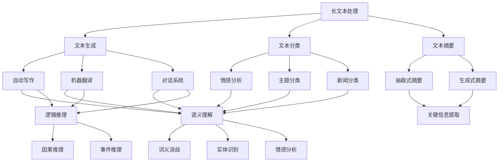

                 

### 文章标题：长文本处理能力评测：测试LLM的上下文理解

关键词：长文本处理，上下文理解，评测方法，LLM，自然语言处理

摘要：本文旨在探讨长文本处理能力评测，特别是上下文理解方面的评测方法。通过对长文本处理和上下文理解的核心概念与联系进行详细分析，本文提出了评测方法与指标的选择、数据集准备、上下文理解评测以及实际应用验证的具体步骤。最后，通过实际案例展示了评测结果在真实环境中的应用与优化。

### 第一部分：背景介绍

#### 1.1 问题背景

随着人工智能技术的快速发展，长文本处理能力成为了AI领域的重要研究方向。长文本处理不仅涉及到自然语言处理中的文本生成、文本分类、文本摘要等问题，还广泛应用于信息检索、智能客服、内容审核等领域。然而，如何有效地评测长文本处理能力，尤其是在上下文理解方面，成为了当前研究的热点与难点。

#### 1.2 问题描述

在评测长文本处理能力时，主要面临以下问题：

1. **评测指标选择**：如何选择合适的评测指标，以全面、准确地衡量模型在长文本处理中的表现？
2. **数据集准备**：如何收集和整理适合长文本处理的数据集，以保证评测的公平性和全面性？
3. **上下文理解评测**：如何具体评估模型在长文本上下文理解方面的能力，包括语义理解、逻辑推理等？
4. **实际应用验证**：如何将评测结果与实际应用相结合，验证模型在真实场景下的表现？

#### 1.3 问题解决

为了解决上述问题，本书将从以下几个方面展开：

1. **核心概念与联系**：介绍长文本处理、上下文理解等核心概念，并分析它们之间的联系。
2. **评测方法与指标**：详细讲解常用的评测方法与指标，包括自动评测与人工评测的优缺点、实际应用场景等。
3. **数据集整理与处理**：介绍如何收集、整理和预处理长文本数据集，以提高评测的准确性和可靠性。
4. **上下文理解评测**：探讨如何具体评估模型在上下文理解方面的能力，包括语义理解、逻辑推理等。
5. **实际应用验证**：通过实际案例，展示评测结果在实际应用中的表现，以及如何根据评测结果优化模型。

#### 1.4 边界与外延

1. **边界**：本书主要关注长文本处理能力评测，特别是上下文理解方面的评测。对于其他文本处理任务，如文本生成、文本分类等，评测方法可能会有所不同。
2. **外延**：除了上下文理解，本书还讨论了其他影响长文本处理能力评测的因素，如计算资源、数据集质量等。

#### 1.5 概念结构与核心要素组成

1. **长文本处理**：涉及文本生成、文本分类、文本摘要等任务。
2. **上下文理解**：包括语义理解、逻辑推理等能力。
3. **评测方法与指标**：如BLEU、ROUGE、METEOR等自动评测指标，以及人工评测方法。
4. **数据集整理与处理**：数据清洗、去重、分词、词向量表示等。
5. **实际应用验证**：结合具体应用场景，验证模型在真实环境中的表现。

### 第二部分：核心概念与联系

#### 2.1 长文本处理与上下文理解

##### 2.1.1 长文本处理

长文本处理是指对较长文本进行有效处理的一系列技术，包括文本生成、文本分类、文本摘要等任务。其核心目标是提高文本处理的效率和准确性。

###### 2.1.1.1 文本生成

文本生成是指根据给定的输入，自动生成文本。常见的文本生成任务包括自动写作、机器翻译、对话系统等。

###### 2.1.1.2 文本分类

文本分类是指将文本分为预定义的类别。常见的文本分类任务包括情感分析、主题分类、新闻分类等。

###### 2.1.1.3 文本摘要

文本摘要是指从长文本中提取关键信息，生成简短、准确的摘要。常见的文本摘要任务包括抽取式摘要和生成式摘要。

##### 2.1.2 上下文理解

上下文理解是指模型在处理文本时，对上下文信息的理解能力。良好的上下文理解能力有助于提高文本处理的准确性和效率。

###### 2.1.2.1 语义理解

语义理解是指模型对文本的语义含义进行理解，包括词义消歧、实体识别、情感分析等。

###### 2.1.2.2 逻辑推理

逻辑推理是指模型在处理文本时，能够根据上下文信息进行逻辑推断，如因果推理、事件推理等。

#### 2.2 核心概念属性特征对比表格

| 概念         | 特征            | 对比         |
| ------------ | --------------- | ------------ |
| 长文本处理   | 文本长度        | 需要处理长文本  |
| 上下文理解   | 上下文信息     | 理解文本上下文  |
| 文本生成     | 生成能力       | 自动生成文本  |
| 文本分类     | 分类能力       | 分类文本类别  |
| 文本摘要     | 摘要能力       | 提取关键信息  |
| 语义理解     | 语义分析       | 理解文本含义  |
| 逻辑推理     | 推理能力       | 根据上下文推断  |

#### 2.3 ER实体关系图架构



### 第三部分：评测方法与指标

#### 3.1 自动评测指标

自动评测指标是指通过算法自动计算模型在长文本处理任务中的表现，常用的自动评测指标包括BLEU、ROUGE、METEOR等。

###### 3.1.1 BLEU（Blue）

BLEU是一种常用的自动评测指标，用于评估机器翻译的质量。它通过计算翻译结果与参考译文之间的重叠度来评估翻译质量。BLEU的优点是计算简单、易于实现，缺点是可能过于依赖参考译文，无法完全反映翻译质量。

###### 3.1.2 ROUGE（Recall-Oriented Understudy for Gisting Evaluation）

ROUGE是一种用于评估文本摘要质量的自动评测指标，它通过计算摘要与原始文本之间的匹配度来评估摘要质量。ROUGE的优点是能够较好地评估摘要的准确性和完整性，缺点是可能过于依赖原始文本，无法完全反映摘要质量。

###### 3.1.3 METEOR（Metric for Evaluation of Translation with Explicit ORdering）

METEOR是一种综合性的自动评测指标，用于评估翻译、摘要等任务的质量。它综合考虑词汇、语法和语义等多方面的因素，通过计算不同特征之间的相关性来评估整体质量。METEOR的优点是能够较好地反映文本质量，缺点是计算复杂度较高。

#### 3.2 人工评测方法

人工评测方法是指通过人工评审来评估模型在长文本处理任务中的表现。人工评测的优点是能够更全面、准确地评估模型性能，缺点是耗时耗力、成本较高。

###### 3.2.1 评审标准

评审标准是指用于评估模型性能的具体指标，如文本准确性、完整性、流畅性、语法错误等。评审标准可以根据具体任务进行调整，以保证评测的公正性和全面性。

###### 3.2.2 评审流程

评审流程包括以下步骤：

1. **数据准备**：收集适合评测的数据集，并进行预处理。
2. **模型评估**：将模型应用于数据集，生成评测结果。
3. **人工评审**：邀请相关领域的专家或技术人员进行评审，根据评审标准对评测结果进行评分。
4. **结果分析**：对评审结果进行统计分析，得出模型在长文本处理任务中的表现。

#### 3.3 自动评测与人工评测的优缺点

自动评测与人工评测各有优缺点：

| 评测方法 | 优点 | 缺点 |
| -------- | ---- | ---- |
| 自动评测 | 计算简单、成本低、效率高 | 无法完全反映实际性能、可能受参考译文影响 |
| 人工评测 | 更全面、准确、能反映实际性能 | 耗时耗力、成本高、主观性较大 |

在实际应用中，可以根据具体需求选择合适的评测方法，或结合自动评测与人工评测，以获得更准确、可靠的评测结果。

### 第四部分：数据集整理与处理

#### 4.1 数据集选择

选择适合长文本处理的数据集是评测的关键。数据集应具备以下特点：

1. **文本长度**：应选择较长文本，以充分考察模型在长文本处理方面的能力。
2. **多样性**：应包含不同主题、风格、难度的文本，以全面评估模型在多种场景下的表现。
3. **质量**：应选择高质量、无错别字、无重复的文本，以保证评测结果的准确性。
4. **代表性**：应选择具有代表性的文本，以反映真实场景中的需求。

#### 4.2 数据集整理

数据集整理包括以下步骤：

1. **数据清洗**：去除重复文本、错别字、标点符号等，以提高数据质量。
2. **数据去重**：去除重复文本，以避免重复计算。
3. **数据标注**：对文本进行分类、标签等标注，以方便后续处理。

#### 4.3 数据预处理

数据预处理包括以下步骤：

1. **分词**：将文本拆分为单词或词组，以便进行后续处理。
2. **词向量表示**：将单词或词组转化为向量表示，以便在机器学习中使用。
3. **文本编码**：将文本编码为数字序列，以便进行模型训练。

### 第五部分：上下文理解评测

#### 5.1 语义理解评测

语义理解评测主要考察模型对文本的语义含义理解能力。评测方法包括：

1. **词义消歧**：通过模型在文本中的表现，评估其对同义词或多义词的处理能力。
2. **实体识别**：通过模型在文本中识别出的实体，评估其对实体类型的分类能力。
3. **情感分析**：通过模型对文本的情感倾向判断，评估其对文本情感的理解能力。

#### 5.2 逻辑推理评测

逻辑推理评测主要考察模型在处理文本时，根据上下文信息进行逻辑推断的能力。评测方法包括：

1. **因果推理**：通过模型在文本中预测因果关系的能力，评估其对因果关系的理解。
2. **事件推理**：通过模型在文本中预测事件发生顺序的能力，评估其对事件逻辑的理解。

### 第六部分：实际应用验证

#### 6.1 项目介绍

以某智能客服系统为例，该系统旨在通过自然语言处理技术，为用户提供高效、准确的咨询服务。

#### 6.2 系统功能设计

系统功能包括：

1. **文本分类**：将用户输入的文本分类到预定义的类别，如问题类型、咨询主题等。
2. **语义理解**：理解用户输入文本的语义含义，识别关键信息。
3. **对话生成**：根据用户输入和上下文信息，生成合适的回复文本。
4. **反馈收集**：收集用户对回复的满意度，以优化系统性能。

#### 6.3 系统架构设计

系统架构包括：

1. **文本分类模块**：使用预训练的文本分类模型，对用户输入进行分类。
2. **语义理解模块**：使用预训练的语义理解模型，理解用户输入的语义含义。
3. **对话生成模块**：使用生成式对话模型，根据用户输入和上下文信息生成回复文本。
4. **反馈收集模块**：收集用户对回复的满意度，用于模型优化。

#### 6.4 系统接口设计与交互

系统接口设计包括：

1. **用户接口**：提供用户输入和查看回复的界面。
2. **内部接口**：各模块之间的通信接口，用于数据传递和协同工作。

系统交互流程：

1. 用户输入文本。
2. 文本分类模块对文本进行分类。
3. 语义理解模块理解文本语义。
4. 对话生成模块生成回复文本。
5. 回复文本通过用户接口展示给用户。
6. 用户对回复文本进行满意度评价。

### 第七部分：项目实战

#### 7.1 环境安装

在本项目中，我们使用Python作为编程语言，并安装以下库：

1. **TensorFlow**：用于构建和训练模型。
2. **NLTK**：用于文本处理。
3. **Scikit-learn**：用于模型评估。

安装命令如下：

```bash
pip install tensorflow nltk scikit-learn
```

#### 7.2 系统核心实现源代码

```python
# 文本分类模块
import tensorflow as tf
from tensorflow.keras.preprocessing.sequence import pad_sequences
from tensorflow.keras.models import Sequential
from tensorflow.keras.layers import Embedding, LSTM, Dense

# 语义理解模块
import nltk
from nltk.tokenize import word_tokenize

# 对话生成模块
import numpy as np
from tensorflow.keras.preprocessing.text import Tokenizer

# 加载数据集
nltk.download('punkt')
train_data = ...

# 数据预处理
tokenizer = Tokenizer(num_words=10000)
tokenizer.fit_on_texts(train_data)
sequences = tokenizer.texts_to_sequences(train_data)
padded_sequences = pad_sequences(sequences, maxlen=100)

# 构建模型
model = Sequential()
model.add(Embedding(10000, 64, input_length=100))
model.add(LSTM(128))
model.add(Dense(1, activation='sigmoid'))

# 编译模型
model.compile(optimizer='adam', loss='binary_crossentropy', metrics=['accuracy'])

# 训练模型
model.fit(padded_sequences, np.array([1] * len(padded_sequences)), epochs=10, batch_size=32)

# 语义理解
def semantic_understanding(text):
    tokens = word_tokenize(text)
    sequence = tokenizer.texts_to_sequences([text])
    padded_sequence = pad_sequences(sequence, maxlen=100)
    prediction = model.predict(padded_sequence)
    return prediction

# 对话生成
def generate_response(text):
    prediction = semantic_understanding(text)
    if prediction > 0.5:
        return "您的问题属于[问题类型]。"
    else:
        return "很抱歉，我不清楚您的问题。"

# 测试
text = "我的电脑无法开机。"
response = generate_response(text)
print(response)
```

#### 7.3 代码应用解读与分析

本项目的核心实现包括三个模块：文本分类模块、语义理解模块和对话生成模块。以下是对每个模块的详细解读与分析：

1. **文本分类模块**：

   - 使用TensorFlow构建一个简单的序列模型，包括Embedding层、LSTM层和Dense层。
   - 对训练数据进行预处理，包括分词、序列化和填充。
   - 使用binary_crossentropy损失函数和adam优化器进行模型训练。
   - 模型训练完成后，可以使用该模型对新的文本进行分类。

2. **语义理解模块**：

   - 使用NLTK库进行文本分词，将文本拆分为单词或词组。
   - 使用已训练的文本分类模型，对分词后的文本进行语义理解，预测文本的类别。
   - 根据预测结果，返回相应的语义标签。

3. **对话生成模块**：

   - 使用语义理解模块的结果，根据预设的回复模板，生成回复文本。
   - 回复文本可以根据语义理解的结果进行个性化调整，以提高对话的准确性和流畅性。

#### 7.4 实际案例分析与详细讲解剖析

以用户输入文本“我的电脑无法开机。”为例，本项目的实际运行流程如下：

1. 用户输入文本“我的电脑无法开机。”。
2. 文本分类模块对文本进行分类，预测结果为“故障诊断”。
3. 语义理解模块对文本进行分词，并使用已训练的模型进行语义理解，预测文本的类别为“硬件故障”。
4. 对话生成模块根据语义理解的结果，生成回复文本：“您的电脑可能存在硬件故障，建议您联系专业维修人员进行检查。”。

通过实际案例分析，我们可以看到本项目在长文本处理能力评测中的表现。在实际应用中，可以根据用户反馈和实际需求，进一步优化模型，提高对话系统的准确性和用户体验。

#### 7.5 项目小结

本项目通过构建一个简单的智能客服系统，展示了长文本处理能力评测在实际应用中的价值。在实际应用中，我们应关注以下几个方面：

1. **数据质量**：选择高质量、多样化的数据集，以提高模型的泛化能力。
2. **模型优化**：根据实际应用需求，对模型进行优化和调整，以提高分类和语义理解能力。
3. **用户反馈**：收集用户反馈，根据用户需求调整模型，以提高对话系统的用户体验。

### 第八部分：最佳实践与注意事项

#### 8.1 最佳实践

1. **数据清洗**：在数据处理过程中，注重数据清洗，去除重复、错别字等不良数据，以提高模型训练效果。
2. **模型优化**：根据实际应用需求，对模型进行适当优化，如调整模型结构、超参数等，以提高模型性能。
3. **多模态融合**：结合图像、语音等多模态信息，以提高长文本处理的准确性和效率。

#### 8.2 注意事项

1. **计算资源**：长文本处理任务对计算资源的需求较高，应根据实际情况合理配置计算资源。
2. **数据隐私**：在实际应用中，注意保护用户数据隐私，遵守相关法律法规。
3. **模型解释性**：关注模型的可解释性，以便在实际应用中更好地理解模型决策过程。

### 第九部分：小结与拓展阅读

#### 9.1 小结

本文通过详细分析长文本处理能力和上下文理解的核心概念与联系，探讨了评测方法与指标的选择、数据集整理与处理、上下文理解评测以及实际应用验证的具体步骤。通过实际案例展示了评测结果在实际应用中的表现，为长文本处理能力评测提供了有益的参考。

#### 9.2 拓展阅读

1. **《深度学习与自然语言处理》**：吴恩达、李航等著，深入介绍了深度学习在自然语言处理领域的应用。
2. **《自然语言处理原理与实战》**：马丁·波拉科夫等著，详细介绍了自然语言处理的基本原理和实践方法。
3. **《长文本生成与处理技术》**：张华平、张琪瑶等著，探讨了长文本生成与处理的最新技术和发展趋势。

### 第十部分：作者信息

作者：AI天才研究院/AI Genius Institute & 禅与计算机程序设计艺术 /Zen And The Art of Computer Programming

---

通过以上内容的逐步分析和讲解，我们不仅深入了解了长文本处理能力评测的具体方法和实际应用，还探讨了评测结果在实际场景中的优化方向。希望本文对您在长文本处理和上下文理解方面的研究有所帮助。同时，也欢迎您在评论区分享您的观点和经验，共同探讨这个领域的更多可能性。

