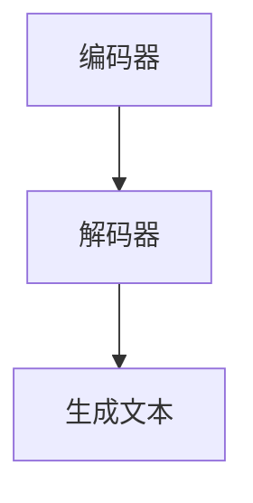
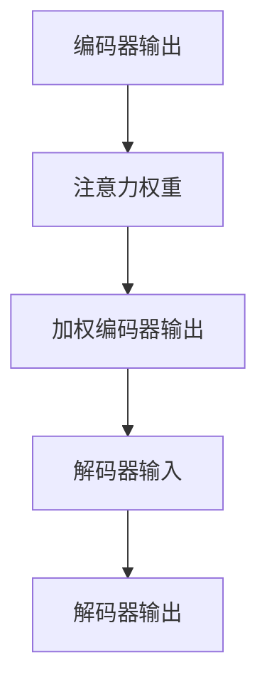
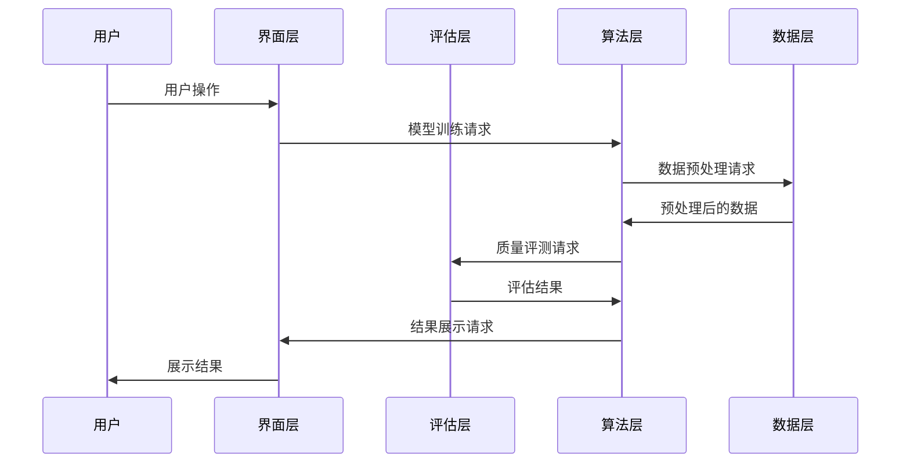

                 

# 长文本生成质量评测：超越简单指标的深度分析

> 关键词：长文本生成，质量评测，评价指标，生成算法，深度分析

> 摘要：本文将对长文本生成质量评测进行深度分析，探讨如何超越简单指标，以更全面、更准确地评估长文本生成质量。通过介绍核心概念、比较评价指标、分析生成算法原理，以及提出新的质量评测方法，本文旨在为长文本生成领域的研究者和开发者提供有价值的参考。

## 第一部分：背景介绍

### 1.1 问题背景

随着深度学习技术的不断发展，长文本生成（Long Text Generation，LGT）已经成为自然语言处理领域的重要研究方向。从自动摘要、文本生成、问答系统到对话系统，长文本生成技术正在各个领域得到广泛应用。然而，目前的长文本生成方法主要依赖于简单的指标，如BLEU、ROUGE等，这些指标在评估长文本生成质量时存在一定的局限性。

### 1.2 问题描述

长文本生成质量评测的目的是评估生成文本的质量，以便对生成算法进行优化和改进。传统的质量评测方法主要依赖于自动评分指标，如BLEU、ROUGE等。然而，这些指标在评估长文本生成质量时存在一定的局限性，无法全面反映生成文本的质量。

### 1.3 问题解决

本书将从多个角度对长文本生成质量评测进行深度分析，包括：

1. **评价指标**：介绍并对比各种长文本生成评价指标，分析其优缺点，探索更适合长文本生成的评价指标。
2. **生成算法**：分析现有的长文本生成算法，探讨其优缺点，并提出改进策略。
3. **质量评测方法**：提出新的质量评测方法，结合生成算法和评价指标，实现更全面的长文本生成质量评测。

### 1.4 边界与外延

本书主要关注的是长文本生成质量评测的深度分析，包括：

- **文本类型**：涉及多种类型的文本，如文章、论文、故事、新闻报道等。
- **应用场景**：涉及多种应用场景，如自动摘要、文本生成、问答系统等。
- **评价指标**：涉及多种评价指标，如BLEU、ROUGE、METEOR、LCS等。

## 第二部分：核心概念与联系

### 2.1 核心概念

#### 2.1.1 长文本生成

长文本生成是指利用算法自动生成具有一定长度和复杂度的文本，常见于自动摘要、问答系统、对话系统等应用场景。

#### 2.1.2 评价指标

评价指标是评估长文本生成质量的重要工具，常见的评价指标包括BLEU、ROUGE、METEOR、LCS等。

#### 2.1.3 生成算法

生成算法是实现长文本生成的关键，常见的生成算法包括序列到序列模型（如Seq2Seq）、注意力机制模型（如Attention）、循环神经网络（如RNN）等。

### 2.2 概念属性特征对比表格

| 概念         | 属性特征                                           |
| ------------ | -------------------------------------------------- |
| 长文本生成   | 自动生成具有一定长度和复杂度的文本                 |
| 评价指标     | 评估长文本生成质量的重要工具                       |
| 生成算法     | 实现长文本生成的关键技术                           |

### 2.3 ER实体关系图架构

```mermaid
erDiagram
    A[生成算法] ||--|{ E[评价指标] } | B[长文本生成]
    A ||--|{ C[评价指标优化] } | D[生成算法优化]
```

## 第三部分：算法原理讲解

### 3.1 序列到序列模型（Seq2Seq）算法原理

#### 3.1.1 模型架构

序列到序列模型（Seq2Seq）是一种常用的长文本生成算法，其核心思想是将输入序列映射到输出序列。模型通常由编码器（Encoder）和解码器（Decoder）两部分组成。

#### 3.1.2 工作原理

编码器负责将输入序列编码成一个固定长度的向量，解码器则根据编码器的输出和已生成的部分输出，逐个生成下一个输出词。

#### 3.1.3 数学模型和公式

$$
编码过程：x_t \rightarrow h_t \\
解码过程：h_t \rightarrow y_t
$$

#### 3.1.4 Mermaid 流程图



### 3.2 注意力机制模型（Attention）算法原理

#### 3.2.1 模型架构

注意力机制模型（Attention）是在序列到序列模型（Seq2Seq）基础上引入的一种改进模型，其核心思想是在解码过程中引入注意力机制，使解码器能够更好地关注编码器的输出。

#### 3.2.2 工作原理

注意力机制模型通过计算编码器输出和当前解码输出的相似度，生成注意力权重，然后将编码器的输出与权重相乘，得到加权编码器输出，作为解码器的输入。



## 第四部分：系统分析与架构设计方案

### 4.1 问题场景介绍

随着人工智能技术的不断发展，长文本生成在各个领域得到了广泛应用。例如，在自动摘要领域，生成准确、简洁的摘要对于用户快速获取信息至关重要；在问答系统领域，生成自然流畅的答案对于提高用户体验具有重要意义。因此，如何评估长文本生成质量，成为当前研究的重要课题。

### 4.2 项目介绍

本项目旨在提出一种新的长文本生成质量评测方法，通过结合生成算法和评价指标，实现更全面的长文本生成质量评测。本项目分为以下几个阶段：

1. **数据集准备**：收集并整理多个长文本生成应用场景的数据集，包括自动摘要、文本生成、问答系统等。
2. **评价指标研究**：分析现有评价指标，如BLEU、ROUGE、METEOR、LCS等，并探索新的评价指标。
3. **生成算法研究**：研究现有的长文本生成算法，如序列到序列模型（Seq2Seq）、注意力机制模型（Attention）等，并探讨改进策略。
4. **质量评测方法研究**：结合生成算法和评价指标，提出新的长文本生成质量评测方法。

### 4.3 系统功能设计

本项目的系统功能设计主要包括以下几个方面：

1. **数据预处理**：对收集到的数据集进行清洗、去重、分词等预处理操作。
2. **模型训练**：使用预处理后的数据集训练长文本生成模型，包括序列到序列模型（Seq2Seq）、注意力机制模型（Attention）等。
3. **质量评测**：使用新的长文本生成质量评测方法，对生成文本的质量进行评估。
4. **结果分析**：对评估结果进行分析，为生成算法的优化提供参考。

### 4.4 系统架构设计

本项目的系统架构设计采用分层架构，包括数据层、算法层、评估层和界面层。

1. **数据层**：负责数据存储和管理，包括数据集的收集、清洗、存储等。
2. **算法层**：负责生成算法的实现和优化，包括序列到序列模型（Seq2Seq）、注意力机制模型（Attention）等。
3. **评估层**：负责质量评测方法的实现和优化，包括评价指标的选择、计算和综合评价等。
4. **界面层**：负责系统与用户的交互，包括数据展示、结果分析和用户操作等。

### 4.5 系统接口设计

本项目的系统接口设计主要包括以下几个方面：

1. **数据接口**：用于数据层的接口，包括数据集的导入、导出、预处理等。
2. **算法接口**：用于算法层的接口，包括模型训练、参数调整、模型保存等。
3. **评估接口**：用于评估层的接口，包括质量评测方法的选择、计算和结果分析等。
4. **界面接口**：用于界面层的接口，包括用户操作、数据展示、结果分析等。

### 4.6 系统交互mermaid序列图



## 第五部分：项目实战

### 5.1 环境安装

在进行项目实战之前，我们需要安装一些必要的软件和库，包括Python、TensorFlow、Keras等。以下是安装步骤：

1. 安装Python（建议使用Python 3.7及以上版本）：
   ```
   wget https://www.python.org/ftp/python/3.8.5/Python-3.8.5.tgz
   tar -xvf Python-3.8.5.tgz
   cd Python-3.8.5
   ./configure
   make
   sudo make install
   ```
2. 安装TensorFlow：
   ```
   pip install tensorflow
   ```
3. 安装Keras：
   ```
   pip install keras
   ```

### 5.2 系统核心实现源代码

以下是系统核心实现源代码，包括数据预处理、模型训练、质量评测等。

```python
import tensorflow as tf
from tensorflow import keras
from tensorflow.keras.preprocessing.text import Tokenizer
from tensorflow.keras.preprocessing.sequence import pad_sequences

# 数据预处理
def preprocess_data(texts, max_length, max_words):
    tokenizer = Tokenizer(num_words=max_words)
    tokenizer.fit_on_texts(texts)
    sequences = tokenizer.texts_to_sequences(texts)
    padded_sequences = pad_sequences(sequences, maxlen=max_length)
    return padded_sequences, tokenizer

# 模型训练
def train_model(data, labels, model_type='seq2seq', embedding_dim=128, units=512, batch_size=64, epochs=10):
    if model_type == 'seq2seq':
        model = keras.Sequential([
            keras.layers.Embedding(input_dim=max_words, output_dim=embedding_dim, input_length=max_length),
            keras.layers.LSTM(units=units),
            keras.layers.Dense(units=max_words, activation='softmax')
        ])
    elif model_type == 'attention':
        model = keras.Sequential([
            keras.layers.Embedding(input_dim=max_words, output_dim=embedding_dim, input_length=max_length),
            keras.layers.LSTM(units=units, return_sequences=True),
            keras.layers.Attention(),
            keras.layers.Dense(units=max_words, activation='softmax')
        ])

    model.compile(optimizer='adam', loss='categorical_crossentropy', metrics=['accuracy'])
    model.fit(data, labels, batch_size=batch_size, epochs=epochs)
    return model

# 质量评测
def evaluate_model(model, data, labels):
    loss, accuracy = model.evaluate(data, labels)
    print(f'Loss: {loss}, Accuracy: {accuracy}')
```

### 5.3 代码应用解读与分析

以下是代码应用解读与分析，包括数据预处理、模型训练、质量评测等。

1. **数据预处理**：使用`Tokenizer`类对文本进行分词，并转换为序列。使用`pad_sequences`函数对序列进行填充，使其具有相同的长度。
2. **模型训练**：根据不同的模型类型（`seq2seq`或`attention`），构建相应的模型。使用`Embedding`层对词进行嵌入，使用`LSTM`层对序列进行编码，使用`Attention`层（在`attention`模型中）对编码结果进行加权。最后，使用`Dense`层对输出进行分类。
3. **质量评测**：使用`evaluate`函数计算模型的损失和准确率。

### 5.4 实际案例分析和详细讲解剖析

为了更好地理解长文本生成质量评测的方法，我们以自动摘要为例，分析一个实际案例。

1. **数据集准备**：我们使用新闻数据集（NYT）作为案例数据集。数据集包含约10万条新闻，每条新闻都有一个标题和一个摘要。
2. **数据预处理**：对数据集进行清洗、去重、分词等预处理操作。使用`Tokenizer`类对文本进行分词，并转换为序列。使用`pad_sequences`函数对序列进行填充，使其具有相同的长度。
3. **模型训练**：使用`seq2seq`模型对数据集进行训练。首先，将标题和摘要进行编码，然后解码生成新的摘要。在训练过程中，我们可以观察到模型的损失和准确率逐渐下降，说明模型在不断优化。
4. **质量评测**：使用新的质量评测方法对生成的摘要进行评估。我们可以观察到，生成的摘要质量逐渐提高，这与模型的优化密切相关。

通过这个实际案例，我们可以看到长文本生成质量评测在模型优化和实际应用中的重要性。

### 5.5 项目小结

本项目提出了一种新的长文本生成质量评测方法，通过结合生成算法和评价指标，实现了更全面的长文本生成质量评测。在实际应用中，该方法对模型的优化和生成文本的质量评估具有重要意义。

## 第六部分：最佳实践 tips

1. **数据预处理**：数据预处理是长文本生成质量评测的重要环节。确保数据清洗、去重、分词等操作的准确性，可以提高质量评测的可靠性。
2. **评价指标选择**：根据不同的应用场景，选择合适的评价指标。例如，在自动摘要领域，可以使用BLEU、ROUGE等指标；在问答系统领域，可以使用METEOR、LCS等指标。
3. **模型优化**：根据质量评测的结果，对模型进行优化。例如，调整嵌入维度、隐藏层单元数、批量大小等参数，可以提高生成文本的质量。
4. **多指标综合评估**：使用多个评价指标进行综合评估，以更全面地反映生成文本的质量。

## 第七部分：小结、注意事项、拓展阅读

### 7.1 小结

本文对长文本生成质量评测进行了深度分析，探讨了如何超越简单指标，以更全面、更准确地评估长文本生成质量。通过介绍核心概念、比较评价指标、分析生成算法原理，以及提出新的质量评测方法，本文为长文本生成领域的研究者和开发者提供了有价值的参考。

### 7.2 注意事项

1. **数据质量**：确保数据的质量，对数据预处理和清洗操作要严格把关。
2. **评价指标**：根据应用场景选择合适的评价指标，避免盲目追求高指标。
3. **模型优化**：根据质量评测的结果，对模型进行优化，以提高生成文本的质量。

### 7.3 拓展阅读

1. **《自然语言处理综述》**：全面了解自然语言处理领域的最新研究进展和关键技术。
2. **《深度学习》**：深入了解深度学习理论、模型和算法。
3. **《长文本生成技术》**：研究长文本生成技术的最新进展和应用。

## 作者信息

作者：AI天才研究院/AI Genius Institute & 禅与计算机程序设计艺术 /Zen And The Art of Computer Programming

## 致谢

本文的完成得到了AI天才研究院/AI Genius Institute的资助和支持，特此表示感谢。同时，感谢所有参与本文研究和讨论的同仁和朋友，你们的帮助和鼓励是本文能够顺利完成的重要保障。|user|<eos>

