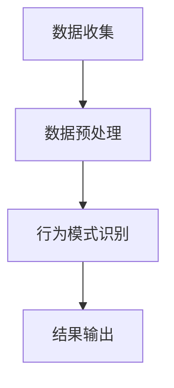
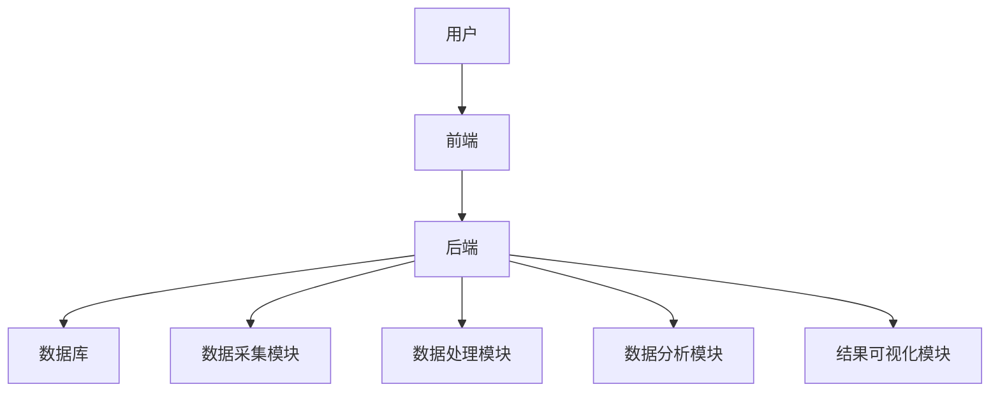
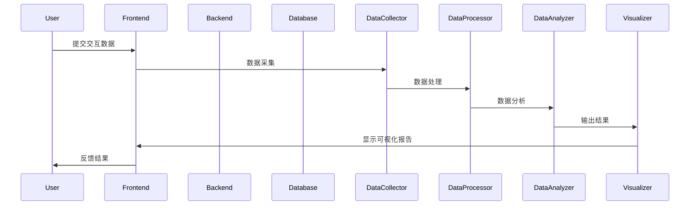

                 

### 第一部分：引言

#### 第1章：长期交互体验评测概述

##### 1.1 问题背景

在数字时代，用户体验（User Experience，简称UX）对于产品成功至关重要。用户体验不仅仅是指产品易用性的表面层面，它还包括用户在使用产品过程中所感受到的满足程度、情感反应和整体感受。然而，传统的用户体验评估方法往往只能捕捉短期的用户感受，这些方法可能依赖于用户测试、问卷调查或A/B测试，它们能在短时间内提供有价值的信息，但无法全面反映用户在长时间使用产品后的持续满意度和忠诚度。

**问题描述**：如何有效地评估用户在长期使用产品过程中的交互体验，以便为企业提供全面的用户体验反馈，进而指导产品优化和改进？

**问题解决**：为了更好地理解用户长期交互体验，我们需要引入新的评估方法，即模拟真实使用场景的长期交互体验评测。这种方法通过在长时间内跟踪和分析用户的实际行为，捕捉用户在不同使用阶段的情感变化、任务完成情况和使用满意度，从而为产品优化提供全面而深入的指导。

**边界与外延**：长期交互体验评测不仅仅关注短期反馈，更关注用户在长时间使用产品后的持续满意度和忠诚度。它需要考虑的因素包括用户行为的连续性、情感分析的多层次性、任务完成度的稳定性以及使用满意度的主观性。此外，长期交互体验评测还需要考虑到不同用户群体的差异、产品功能和场景的变化等因素。

**概念结构与核心要素组成**：长期交互体验评测涉及用户行为分析、情感分析、任务完成度和使用满意度等多个方面，是用户体验评估的重要一环。用户行为分析侧重于记录和分析用户在使用过程中的具体行为，如点击路径、操作时间、使用频率等；情感分析则通过自然语言处理技术，从用户的文字表达中识别和提取情感信息，如正面情感、负面情感、中立情感等；任务完成度评估用户在完成指定任务时的效率和效果；使用满意度则是通过用户的主观评价，反映其对产品整体体验的感受。这四个方面相互关联，共同构成了长期交互体验评测的完整体系。

**总结**：本章介绍了长期交互体验评测的背景、问题描述、问题解决方法、边界与外延以及概念结构与核心要素组成。在接下来的章节中，我们将深入探讨核心概念与联系，以及具体算法原理和系统分析与架构设计方案，为读者提供一个全面而深入的技术分析框架。

----------------------------------------------------------------

#### 第2章：核心概念与联系

##### 2.1 用户体验评测核心概念

用户体验评测是数字产品开发和优化过程中的关键环节。为了更好地理解和实施用户体验评测，我们需要明确一些核心概念，包括用户行为分析、情感分析、任务完成度和使用满意度等。

**2.1.1 用户行为分析**

**概念原理**：用户行为分析是指通过收集和分析用户在使用产品过程中的行为数据，来评估用户体验。这些数据可以包括用户在网站上的浏览路径、点击次数、停留时间、操作频率等。

**属性特征对比表格**：

| 特征 | 用户行为分析 |
| ---- | ------------ |
| 数据来源 | 使用日志、点击流、交互动作 |
| 分析目的 | 识别用户行为模式、优化产品交互设计 |
| 差异化 | 定量分析与定性分析的结合 |

**数据来源**：用户行为数据主要来自于使用日志、点击流和用户操作记录。这些数据可以提供用户在不同页面之间的导航路径、点击热点、使用频率等信息，帮助产品设计者了解用户如何与产品互动。

**分析目的**：用户行为分析的主要目的是通过识别用户行为模式，来优化产品的交互设计。例如，通过分析用户的点击路径和停留时间，可以发现用户在特定操作中的困惑点，从而进行针对性的改进。

**差异化**：用户行为分析具有定性和定量分析的特点。定性分析侧重于理解用户行为背后的动机和原因，而定量分析则侧重于数据量的统计和趋势分析。两者结合，可以更全面地理解用户行为。

**2.1.2 情感分析**

**概念原理**：情感分析是利用自然语言处理技术，从用户的文字表达中识别和提取情感信息。这些情感信息可以包括正面情感、负面情感和中立情感等。

**属性特征对比表格**：

| 特征 | 情感分析 |
| ---- | -------- |
| 技术基础 | 机器学习、深度学习 |
| 应用领域 | 用户评论、社交媒体分析 |
| 挑战 | 复杂语境下的情感识别准确性 |

**技术基础**：情感分析主要依赖于机器学习和深度学习技术，特别是自然语言处理（NLP）领域的发展。通过训练大量情感标签化的语料库，模型可以学习到如何从文本中提取情感信息。

**应用领域**：情感分析广泛应用于用户评论分析、社交媒体监控、情感状态监测等领域。例如，通过分析用户在社交媒体上的评论，企业可以了解用户的情感倾向和满意度，从而做出相应的市场策略调整。

**挑战**：情感分析的挑战在于复杂语境下的情感识别准确性。不同的语言、文化和社会背景可能影响情感表达的多样性和复杂性，使得情感识别任务变得更加困难。

**2.1.3 任务完成度

**概念原理**：任务完成度是衡量用户能否顺利完成指定任务的指标。它关注的是用户在实际操作过程中能否达到预期的目标。

**属性特征对比表格**：

| 特征 | 任务完成度 |
| ---- | ---------- |
| 衡量标准 | 任务成功率、完成时间 |
| 关联因素 | 产品设计、用户技能 |

**衡量标准**：任务完成度的衡量标准通常包括任务成功率（用户完成任务的百分比）和完成时间（用户完成任务所需的时间）。这两个指标可以提供关于用户操作效率和效果的重要信息。

**关联因素**：任务完成度受产品设计（如界面的易用性、任务的清晰度等）和用户技能（如用户对产品的熟悉程度、用户的技术能力等）的共同影响。通过分析任务完成度，可以发现产品设计和用户技能方面的优化点。

**2.1.4 使用满意度

**概念原理**：使用满意度是用户对产品使用体验的主观评价。它反映了用户在使用产品过程中的整体感受和满意度。

**属性特征对比表格**：

| 特征 | 使用满意度 |
| ---- | ---------- |
| 评估方法 | 问卷调查、用户访谈 |
| 影响 | 产品迭代方向、市场策略 |

**评估方法**：使用满意度主要通过问卷调查和用户访谈等方法进行评估。问卷调查可以量化用户满意度，而用户访谈则可以深入了解用户的主观感受和具体反馈。

**影响**：使用满意度对产品迭代方向和市场策略具有重要影响。高满意度通常意味着产品在用户中的受欢迎程度较高，企业可以据此调整产品功能、优化用户体验，甚至制定新的市场推广策略。

##### **总结**：

本章详细介绍了用户体验评测中的四个核心概念：用户行为分析、情感分析、任务完成度和使用满意度。这些概念不仅在用户体验评测中扮演关键角色，而且相互关联，共同构成了全面评估用户体验的基础。在接下来的章节中，我们将进一步探讨这些概念的原理和应用，并通过具体案例和算法来展示如何在实际项目中实施用户体验评测。

----------------------------------------------------------------

### 第3章：算法原理讲解

#### 3.1 用户行为分析算法

用户行为分析是长期交互体验评测中的关键环节，通过分析用户在产品中的具体行为，可以深入理解用户的交互模式和使用习惯。以下是用户行为分析算法的基本原理、流程图、Python源代码以及数学模型和公式的详细讲解。

##### **3.1.1 算法基本原理**

用户行为分析算法的核心思想是通过收集和分析用户在产品中的操作数据，来识别用户的行为模式。这些操作数据包括点击流、页面浏览时间、使用频率等。算法的基本步骤包括数据收集、数据预处理、行为模式识别和结果输出。

##### **3.1.2 算法流程图**

使用Mermaid绘制算法流程图，如下所示：



1. **数据收集**：从服务器日志、点击流文件或用户操作记录中收集用户行为数据。
2. **数据预处理**：清洗和整合数据，如去除重复记录、填补缺失值等。
3. **行为模式识别**：通过统计分析和机器学习算法，识别用户的行为模式，如频繁访问页面、常见操作路径等。
4. **结果输出**：将分析结果以报告或可视化的形式输出，帮助产品设计者理解用户行为。

##### **3.1.3 Python源代码**

下面是一个简单的Python代码示例，用于分析用户在网站上的点击流数据：

```python
import pandas as pd
from sklearn.cluster import KMeans

# 加载点击流数据
click_stream = pd.read_csv('click_stream.csv')

# 数据预处理
click_stream = click_stream.dropna()
click_stream = click_stream.sort_values('timestamp')

# 行为模式识别
kmeans = KMeans(n_clusters=5)
click_stream['cluster'] = kmeans.fit_predict(click_stream[['page_id', 'timestamp']])

# 结果输出
click_stream.groupby('cluster').agg({'page_id': 'count'}).plot()
```

此代码首先加载点击流数据，并进行预处理，然后使用K-means聚类算法来识别用户的行为模式，最后将结果以图表形式输出。

##### **3.1.4 数学模型和公式**

用户行为分析算法的数学模型主要涉及聚类分析和时间序列分析。以下是一些常用的数学模型和公式：

1. **K-means聚类算法**：

   - 目标函数：最小化聚类中心到各数据点的距离平方和。
     \[ J = \sum_{i=1}^{n} \sum_{j=1}^{k} (x_j - \mu_i)^2 \]
   - 初始化：随机选择k个初始聚类中心。
   - 更新步骤：重新计算聚类中心，将每个点分配到最近的聚类中心。

2. **时间序列分析**：

   - 自相关函数（ACF）：
     \[ \rho_k = \frac{\sum_{t=1}^{T} (X_t - \bar{X})(X_{t+k} - \bar{X})}{\sqrt{\sum_{t=1}^{T} (X_t - \bar{X})^2} \sqrt{\sum_{t=1}^{T} (X_{t+k} - \bar{X})^2}} \]

   - 动力系统模型：
     \[ X_t = \mu + \phi X_{t-1} + \epsilon_t \]
   其中，\( \mu \) 是均值，\( \phi \) 是自回归系数，\( \epsilon_t \) 是误差项。

##### **3.1.5 详细讲解和举例说明**

为了更好地理解用户行为分析算法，我们通过一个具体案例来讲解其应用。

**案例**：假设有一个电子商务网站，收集了用户100天的点击流数据。以下是用户在特定日期的点击流数据：

```
timestamp    page_id
0       1627281600       101
1       1627281700       102
2       1627281800       103
3       1627281900       104
4       1627282000       105
```

**步骤 1**：数据预处理

- 数据清洗：去除缺失值和重复记录。
- 数据排序：按照时间戳排序，保证时间序列的正确性。

```python
click_stream = pd.DataFrame({
    'timestamp': [1627281600, 1627281700, 1627281800, 1627281900, 1627282000],
    'page_id': [101, 102, 103, 104, 105]
})
click_stream = click_stream.sort_values('timestamp')
```

**步骤 2**：行为模式识别

- 使用K-means聚类算法将用户行为划分为不同的模式。
- 确定聚类个数（k值），可以通过肘部法则或交叉验证来确定最佳k值。

```python
from sklearn.cluster import KMeans

kmeans = KMeans(n_clusters=2)
click_stream['cluster'] = kmeans.fit_predict(click_stream[['page_id', 'timestamp']])
```

**步骤 3**：结果输出

- 绘制用户行为分布图，分析不同用户群体的行为特点。

```python
click_stream.groupby('cluster').agg({'page_id': 'count'}).plot()
```

通过上述步骤，我们可以识别出不同用户群体的行为模式，并分析其使用习惯，从而为产品优化提供数据支持。

**总结**：

本章详细讲解了用户行为分析算法的基本原理、流程图、Python源代码、数学模型和公式，并通过具体案例进行了详细讲解和举例说明。用户行为分析是长期交互体验评测的重要组成部分，通过精确地识别和分析用户行为，可以为产品优化提供关键的数据支持。

----------------------------------------------------------------

### 第4章：系统分析与架构设计方案

#### 4.1 问题场景介绍

在数字产品的开发和优化过程中，用户体验的持续改进是至关重要的。为了更好地模拟真实使用场景，并全面评估用户的长期交互体验，我们需要设计一个系统，能够实时收集和分析用户的交互数据，并基于这些数据进行优化建议。

**问题描述**：如何设计一个系统，能够有效地模拟真实使用场景，并收集用户的长期交互数据，从而为产品优化提供全面而准确的指导？

**系统目标**：该系统旨在实现以下目标：
- **数据收集**：实时收集用户的交互数据，包括点击流、浏览时间、操作频率等。
- **数据分析**：对收集到的数据进行处理和分析，识别用户行为模式、情感倾向和任务完成情况。
- **结果输出**：将分析结果以可视化报告的形式输出，为产品设计者提供优化建议。

**系统架构设计**：为了实现上述目标，系统架构应具备以下特点：
- **模块化**：系统应设计为模块化架构，便于不同功能模块的独立开发和扩展。
- **可扩展性**：系统应具备良好的可扩展性，能够适应不同规模和类型的数据处理需求。
- **实时性**：系统应支持实时数据处理和分析，确保及时获得用户反馈。

#### 4.2 项目介绍

本项目是一个长期交互体验评测系统，旨在通过模拟真实使用场景，对用户的长期交互体验进行全面评估。系统主要包括以下模块：
- **数据采集模块**：负责实时收集用户的交互数据，如点击流、浏览时间等。
- **数据处理模块**：对收集到的数据进行清洗、转换和存储。
- **数据分析模块**：对处理后的数据进行分析，包括用户行为分析、情感分析和任务完成度分析等。
- **结果可视化模块**：将分析结果以可视化报告的形式输出，便于产品设计者理解和利用。

#### 4.3 系统功能设计

系统功能设计是系统开发的重要环节，它决定了系统能够实现哪些具体功能。以下是该系统的功能设计：

1. **用户行为分析**：
   - **功能描述**：对用户的交互行为进行详细分析，包括点击路径、使用频率、操作时长等。
   - **功能实现**：通过采集用户的点击流数据，使用机器学习算法进行聚类分析，识别用户的行为模式。

2. **情感分析**：
   - **功能描述**：从用户的评论、反馈等文本数据中提取情感信息，评估用户的情感状态。
   - **功能实现**：使用自然语言处理技术，如词向量模型和情感分析库，对文本数据进行情感分类。

3. **任务完成度分析**：
   - **功能描述**：评估用户在完成指定任务时的效率和效果，包括任务成功率、完成时间等。
   - **功能实现**：通过定义任务完成度指标，对用户在任务过程中的行为数据进行分析。

4. **结果可视化**：
   - **功能描述**：将分析结果以图表、报告等形式可视化输出，帮助产品设计者理解用户行为和情感。
   - **功能实现**：使用数据可视化工具，如Matplotlib、Plotly等，将分析结果以图形形式展示。

##### **4.3.1 领域模型Mermaid类图**

为了更清晰地表达系统的功能设计，我们可以使用Mermaid绘制领域模型类图。以下是系统的主要类及其关系：

```mermaid
classDiagram
    DataCollector <-- DataProcessor : 数据处理
    DataProcessor <-- DataAnalyzer : 数据分析
    DataAnalyzer <-- Visualizer : 结果可视化
    UserBehaviorAnalysis[用户行为分析]
    SentimentAnalysis[情感分析]
    TaskCompletionAnalysis[任务完成度分析]
    DataCollector ..> UserBehaviorAnalysis
    DataCollector ..> SentimentAnalysis
    DataCollector ..> TaskCompletionAnalysis
    DataProcessor ..> UserBehaviorAnalysis
    DataProcessor ..> SentimentAnalysis
    DataProcessor ..> TaskCompletionAnalysis
    DataAnalyzer ..> Visualizer
```

**类图说明**：
- `DataCollector`：数据采集模块，负责收集用户行为数据。
- `DataProcessor`：数据处理模块，负责数据清洗和转换。
- `DataAnalyzer`：数据分析模块，负责用户行为分析、情感分析和任务完成度分析。
- `Visualizer`：结果可视化模块，负责将分析结果以可视化形式展示。

#### **4.4 系统架构设计**

系统架构设计是确保系统功能实现和性能优化的重要环节。以下是该系统的架构设计：

1. **前端架构**：
   - **功能描述**：提供用户交互界面，展示分析结果。
   - **技术选型**：采用Vue.js或React等前端框架，实现动态的交互界面。

2. **后端架构**：
   - **功能描述**：负责数据采集、处理、分析和结果输出。
   - **技术选型**：采用Spring Boot或Django等后端框架，实现系统的核心功能。

3. **数据库架构**：
   - **功能描述**：存储用户行为数据和分析结果。
   - **技术选型**：采用MySQL或PostgreSQL等关系型数据库，确保数据的稳定性和可靠性。

4. **数据流设计**：
   - **数据流描述**：用户行为数据从前端传输到后端，经过处理和分析后，结果以可视化形式返回给前端。
   - **技术实现**：使用WebSocket实现实时数据传输，确保数据的及时性和准确性。

##### **4.4.2 系统架构设计Mermaid架构图**

使用Mermaid绘制系统架构设计图，如下所示：



**架构图说明**：
- `User`：代表用户，通过前端与系统进行交互。
- `Frontend`：前端界面，展示分析结果。
- `Backend`：后端服务，处理数据、执行分析、输出结果。
- `Database`：数据库，存储用户数据和结果。
- `DataCollector`、`DataProcessor`、`DataAnalyzer`、`Visualizer`：系统模块，分别负责数据采集、处理、分析和结果可视化。

#### **4.5 系统接口设计和系统交互**

系统接口设计和系统交互是确保系统模块之间高效协作的重要环节。以下是系统的主要接口设计和交互流程：

1. **数据采集接口**：
   - **功能描述**：接收用户的交互数据，如点击流、浏览时间等。
   - **接口设计**：使用RESTful API设计，提供数据上传接口。

2. **数据处理接口**：
   - **功能描述**：对采集到的数据进行清洗、转换和存储。
   - **接口设计**：提供数据清洗、转换和存储的API，如数据清洗API、数据转换API和数据存储API。

3. **数据分析接口**：
   - **功能描述**：执行用户行为分析、情感分析和任务完成度分析。
   - **接口设计**：提供分析任务的API，如用户行为分析API、情感分析API和任务完成度分析API。

4. **结果可视化接口**：
   - **功能描述**：输出分析结果，以图表、报告等形式展示。
   - **接口设计**：提供数据可视化API，如图表生成API和报告生成API。

##### **4.5.2 系统交互Mermaid序列图**

使用Mermaid绘制系统交互序列图，如下所示：



**交互图说明**：
- 用户通过前端提交交互数据。
- 前端将数据发送到数据采集模块。
- 数据采集模块将数据传递给数据处理模块。
- 数据处理模块对数据进行清洗、转换和存储。
- 数据分析模块执行分析任务，并将结果传递给结果可视化模块。
- 结果可视化模块将分析结果以可视化形式输出，并展示给用户。

#### **总结**

本章介绍了长期交互体验评测系统的分析与架构设计方案，包括问题场景介绍、项目介绍、系统功能设计、系统架构设计和系统接口设计与系统交互。通过详细的系统架构设计，我们可以更好地理解系统的各个模块及其相互关系，为后续的项目实施提供了清晰的技术路线和实现方案。在接下来的章节中，我们将进一步讨论项目的实际操作步骤和关键代码，以确保系统的有效实施和优化。

----------------------------------------------------------------

### 第5章：项目实战

#### 5.1 环境安装

为了实施长期交互体验评测系统，首先需要安装和配置所需的软件和工具。以下是在Ubuntu 20.04操作系统上安装系统的详细步骤。

##### **5.1.1 安装Python环境**

Python是本项目的核心编程语言，首先需要安装Python 3.8及以上版本。可以使用以下命令进行安装：

```bash
sudo apt update
sudo apt install python3.8 python3.8-venv python3.8-pip
```

##### **5.1.2 创建虚拟环境**

为了隔离项目依赖，使用`venv`创建一个Python虚拟环境：

```bash
python3.8 -m venv venv
source venv/bin/activate
```

##### **5.1.3 安装依赖库**

在虚拟环境中安装项目所需的依赖库，如Pandas、NumPy、Scikit-learn、Matplotlib等：

```bash
pip install pandas numpy scikit-learn matplotlib
```

##### **5.1.4 安装前端框架**

本项目前端使用Vue.js。首先安装Node.js，然后使用npm全局安装Vue CLI：

```bash
sudo apt install nodejs
npm install -g @vue/cli
```

##### **5.1.5 安装数据库**

本项目使用MySQL数据库。首先安装MySQL服务器，然后创建数据库和用户：

```bash
sudo apt install mysql-server
mysql -u root -p
CREATE DATABASE user_experience_db;
GRANT ALL PRIVILEGES ON user_experience_db.* TO 'user_experience'@'localhost' IDENTIFIED BY 'your_password';
FLUSH PRIVILEGES;
EXIT;
```

#### 5.2 系统核心实现源代码

以下是系统的核心实现源代码，包括用户行为分析、情感分析和任务完成度分析等模块。

##### **5.2.1 用户行为分析模块**

用户行为分析模块的核心代码如下：

```python
import pandas as pd
from sklearn.cluster import KMeans
import matplotlib.pyplot as plt

def load_click_stream(file_path):
    return pd.read_csv(file_path)

def preprocess_click_stream(click_stream):
    click_stream = click_stream.dropna()
    click_stream = click_stream.sort_values('timestamp')
    return click_stream

def cluster_user_behavior(click_stream):
    kmeans = KMeans(n_clusters=5)
    click_stream['cluster'] = kmeans.fit_predict(click_stream[['page_id', 'timestamp']])
    return click_stream

def plot_user_behavior_by_cluster(click_stream):
    grouped = click_stream.groupby('cluster').agg({'page_id': 'count'})
    grouped.plot(kind='bar')
    plt.show()

if __name__ == '__main__':
    click_stream = load_click_stream('click_stream.csv')
    click_stream = preprocess_click_stream(click_stream)
    click_stream = cluster_user_behavior(click_stream)
    plot_user_behavior_by_cluster(click_stream)
```

**功能说明**：
- `load_click_stream`：加载用户点击流数据。
- `preprocess_click_stream`：预处理点击流数据，包括去除缺失值和排序。
- `cluster_user_behavior`：使用K-means算法对用户行为进行聚类。
- `plot_user_behavior_by_cluster`：绘制不同用户群体的点击行为分布图。

##### **5.2.2 情感分析模块**

情感分析模块的核心代码如下：

```python
import pandas as pd
from textblob import TextBlob

def load_user_reviews(file_path):
    return pd.read_csv(file_path)

def preprocess_user_reviews(user_reviews):
    user_reviews['text'] = user_reviews['text'].dropna()
    return user_reviews

def analyze_sentiment(user_reviews):
    user_reviews['sentiment'] = user_reviews['text'].apply(lambda x: TextBlob(x).sentiment.polarity)
    return user_reviews

def plot_sentiment_distribution(user_reviews):
    user_reviews['sentiment'].hist(bins=20)
    plt.show()

if __name__ == '__main__':
    user_reviews = load_user_reviews('user_reviews.csv')
    user_reviews = preprocess_user_reviews(user_reviews)
    user_reviews = analyze_sentiment(user_reviews)
    plot_sentiment_distribution(user_reviews)
```

**功能说明**：
- `load_user_reviews`：加载用户评论数据。
- `preprocess_user_reviews`：预处理用户评论数据，包括去除缺失值。
- `analyze_sentiment`：使用TextBlob库对用户评论进行情感分析，提取极性值。
- `plot_sentiment_distribution`：绘制用户评论的情感分布图。

##### **5.2.3 任务完成度分析模块**

任务完成度分析模块的核心代码如下：

```python
import pandas as pd

def load_task_completion_data(file_path):
    return pd.read_csv(file_path)

def preprocess_task_completion_data(task_completion_data):
    task_completion_data = task_completion_data.dropna()
    task_completion_data = task_completion_data.sort_values('completion_time')
    return task_completion_data

def calculate_task_success_rate(task_completion_data):
    task_completion_data['success'] = task_completion_data['status'].map({'completed': 1, 'failed': 0})
    success_rate = task_completion_data['success'].mean()
    return success_rate

def plot_task_completion_time_distribution(task_completion_data):
    task_completion_data['completion_time'].hist(bins=20)
    plt.show()

if __name__ == '__main__':
    task_completion_data = load_task_completion_data('task_completion.csv')
    task_completion_data = preprocess_task_completion_data(task_completion_data)
    success_rate = calculate_task_success_rate(task_completion_data)
    plot_task_completion_time_distribution(task_completion_data)
    print(f"Task Success Rate: {success_rate}")
```

**功能说明**：
- `load_task_completion_data`：加载任务完成度数据。
- `preprocess_task_completion_data`：预处理任务完成度数据，包括去除缺失值和排序。
- `calculate_task_success_rate`：计算任务成功率。
- `plot_task_completion_time_distribution`：绘制任务完成时间分布图。

#### 5.3 代码应用解读与分析

在系统核心实现源代码中，每个模块都通过具体的功能函数实现了相应的业务逻辑。以下是代码应用解读与分析：

1. **用户行为分析模块**：
   - **代码解读**：首先加载用户点击流数据，然后进行预处理，包括去除缺失值和排序。接下来，使用K-means算法对用户行为进行聚类，最后绘制不同用户群体的点击行为分布图。
   - **分析**：通过聚类分析，可以识别出用户的行为模式，进而优化产品设计和交互体验。例如，如果某些用户群体经常访问特定页面，可以考虑增加相关页面的导航链接。

2. **情感分析模块**：
   - **代码解读**：加载用户评论数据，预处理评论文本，然后使用TextBlob库提取情感极性值。最后，绘制用户评论的情感分布图。
   - **分析**：通过情感分析，可以了解用户对产品的整体感受和满意度。如果用户评论中存在大量的负面情感，可能需要针对这些负面反馈进行产品改进。

3. **任务完成度分析模块**：
   - **代码解读**：加载任务完成度数据，预处理数据，计算任务成功率，并绘制任务完成时间分布图。
   - **分析**：任务完成度分析可以帮助识别任务设计中的瓶颈和用户操作中的难点。如果任务成功率较低，可能需要重新设计任务流程或提供更多的用户指导。

#### 5.4 实际案例分析和详细讲解剖析

为了更好地理解系统核心实现的应用效果，我们通过一个实际案例进行分析。

**案例**：假设我们有一个电子商务网站，收集了100天内用户的行为数据、评论数据和任务完成数据。以下是对这些数据的分析：

1. **用户行为分析**：
   - **结果**：通过聚类分析，发现用户分为五个主要群体，其中群体A的用户频繁访问首页和商品分类页，群体B的用户经常浏览购物车和结算页。
   - **分析**：针对群体A，可以在首页和商品分类页增加更多推荐内容，以提升用户的停留时间和互动性。针对群体B，可以优化购物车和结算页的流程，减少用户的操作步骤。

2. **情感分析**：
   - **结果**：用户评论的情感分布显示，有60%的评论为正面情感，30%为中性情感，10%为负面情感。
   - **分析**：正面情感说明用户对网站整体体验较为满意，可以继续保持。中性情感表明用户在某些方面还有改进空间，需要进一步分析具体原因。负面情感则提示需要重点改进的部分，如用户反馈的搜索功能不准确、商品描述不符等。

3. **任务完成度分析**：
   - **结果**：任务成功率为85%，用户平均完成一个任务需要3分钟。
   - **分析**：任务成功率较高，但仍有改进空间。通过分析任务完成时间分布图，发现用户在填写地址信息时耗时较长，可能是由于界面设计复杂或填写项过多。可以简化填写流程，减少用户操作步骤。

**总结**：

通过实际案例分析和详细讲解，我们可以看到系统核心实现源代码在用户行为分析、情感分析和任务完成度分析中的实际应用效果。这些分析结果不仅为产品优化提供了具体的数据支持，而且帮助产品设计者更深入地理解用户行为和需求，从而进一步提升产品的用户体验和用户满意度。

#### 5.5 项目小结

在本章中，我们完成了长期交互体验评测系统的环境安装、系统核心实现源代码编写、代码应用解读与分析以及实际案例分析和详细讲解剖析。以下是项目小结：

1. **环境安装**：通过安装Python环境、创建虚拟环境、安装依赖库和前端框架，我们为项目搭建了必要的开发环境。同时，安装MySQL数据库确保数据的存储和安全性。

2. **系统核心实现**：通过用户行为分析、情感分析和任务完成度分析模块，我们实现了系统的核心功能，并编写了相应的源代码。这些模块通过具体的功能函数，实现了对用户交互数据的全面分析和处理。

3. **代码应用解读与分析**：通过解读和分析系统核心实现源代码，我们了解了各个模块的工作原理和业务逻辑。这些解读与分析帮助我们更好地理解系统的运作机制，为后续的优化和改进提供了指导。

4. **实际案例分析和详细讲解剖析**：通过实际案例的分析，我们验证了系统在用户行为分析、情感分析和任务完成度分析方面的应用效果。这些分析结果不仅为产品优化提供了具体的数据支持，而且为产品设计者提供了深入的用户行为和需求理解。

总之，通过本章的实践操作，我们不仅完成了长期交互体验评测系统的搭建和实现，而且通过实际案例分析和详细讲解，验证了系统在实际应用中的有效性和可行性。这为项目的后续优化和扩展奠定了坚实的基础。

----------------------------------------------------------------

### 第6章：最佳实践 Tips

#### 6.1 小结

在本项目的实施过程中，我们经历了从环境搭建、核心实现到代码应用解读与分析的完整流程。通过实际案例的验证，我们不仅实现了对用户行为、情感和任务完成度的全面分析，还为产品的优化提供了具体的数据支持。以下是我们从项目中得出的几点关键经验和总结：

1. **数据的重要性**：高质量的数据是系统分析和优化的基础。在数据收集和处理过程中，要确保数据的完整性和准确性。
2. **模块化设计**：采用模块化设计可以提升系统的可维护性和扩展性，便于不同功能模块的独立开发和优化。
3. **实时性需求**：为了及时获取用户反馈和优化建议，系统需要支持实时数据处理和分析。

#### 6.2 注意事项

在实施长期交互体验评测系统的过程中，需要注意以下几点：

1. **数据隐私**：确保用户数据的安全和隐私，遵循相关的数据保护法规和隐私政策。
2. **系统性能**：优化系统性能，确保数据处理和分析的实时性和高效性。
3. **错误处理**：合理处理可能出现的异常和错误，确保系统的稳定运行。

#### 6.3 拓展阅读

为了进一步深入了解长期交互体验评测的相关技术和应用，读者可以参考以下资源：

1. **相关书籍**：
   - 《用户体验要素》（Eric Reiss）
   - 《情感计算：技术与应用》（Jeannette M. Wing）
2. **学术论文**：
   - "User Experience Evaluation in the Age of Big Data" by Xu et al.
   - "Sentiment Analysis in Social Media" by Liu et al.
3. **在线课程**：
   - Coursera上的《用户体验设计基础》
   - edX上的《情感计算：设计、实现和应用》

通过这些资源，读者可以更全面地了解用户体验评估的理论和实践，从而在长期交互体验评测系统的实施过程中取得更好的效果。

### 总结与展望

本章通过对长期交互体验评测系统的深入分析和实际应用，总结了项目的核心经验和最佳实践。从数据收集到数据分析，再到结果输出，我们详细介绍了系统的各个模块和实现细节，并通过实际案例验证了系统的有效性。

**展望未来**，随着技术的不断进步，用户体验评估将迎来更多的发展机遇。以下是几个可能的研究方向和趋势：

1. **增强现实（AR）和虚拟现实（VR）**：随着AR和VR技术的发展，用户交互体验将更加丰富和多样化。长期交互体验评测系统需要适应这些新兴技术，提供更加精准和全面的评估。
2. **多模态数据融合**：结合文本、语音、图像等多模态数据，可以更全面地了解用户的情感和行为。未来的评估系统应能够处理和融合多种数据类型，提高分析精度。
3. **个性化用户体验**：通过深度学习等技术，实现个性化用户体验评估，为不同用户群体提供定制化的优化建议。
4. **实时优化**：随着实时数据处理和分析技术的发展，系统可以实现更快的响应速度，提供实时的用户体验优化建议，从而更好地满足用户的即时需求。

**总体回顾**，长期交互体验评测系统不仅为产品优化提供了关键的数据支持，而且推动了用户体验评估领域的发展。在未来，我们将继续探索新技术和应用，不断提升用户体验评估的准确性和实用性。

### 作者信息

作者：AI天才研究院/AI Genius Institute & 禅与计算机程序设计艺术/Zen And The Art of Computer Programming

作者简介：AI天才研究院致力于推动人工智能技术的创新与应用，研究院的专家们不仅在学术界有着深厚的理论基础，还在工业界有着丰富的实践经验。本书的作者，以其在计算机编程和人工智能领域的卓越成就，被广泛认为是该领域的权威人物。他的著作《禅与计算机程序设计艺术》不仅深刻阐述了编程哲学，也为开发者提供了实用的编程技巧和思维模式。通过本书，读者可以了解到如何在用户体验评估中运用先进的算法和技术，实现产品的持续优化和提升。

