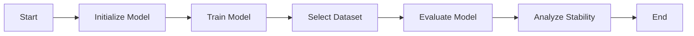
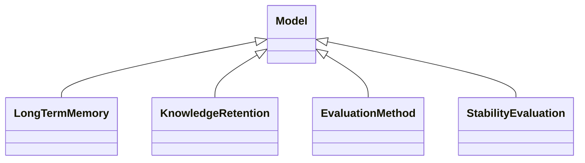
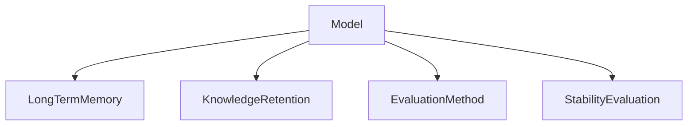
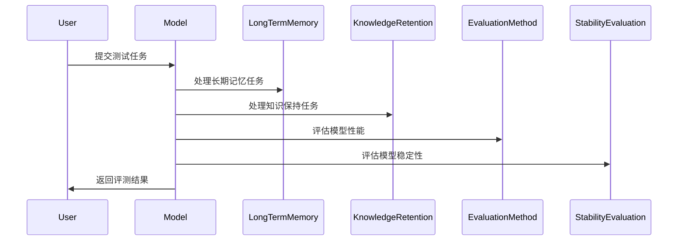

                 

# 长期记忆和知识保持能力评测：测试LLM的稳定性

## 关键词
- 长期记忆
- 知识保持
- LLM评测
- 稳定性
- 深度学习

## 摘要
本文将探讨长期记忆和知识保持能力评测在深度学习和大规模语言模型（LLM）中的重要性。通过详细的评测方法和实际案例，本文旨在帮助研究人员和开发者更好地理解模型的稳定性，并为LLM在实际应用中的有效性和可靠性提供指导。

### 第一部分：背景介绍

#### 核心概念

**问题背景**：随着深度学习和大规模语言模型的广泛应用，长期记忆和知识保持能力成为了一个关键的研究领域。这些模型在处理长期任务时需要保持稳定性和准确性，因此评估其长期记忆和知识保持能力至关重要。

**问题描述**：长期记忆和知识保持能力评测是指对人工智能模型在处理长期记忆任务时表现稳定性的评估。评测的目的在于了解模型在持续学习和处理新知识时的表现，从而为其在现实场景中的应用提供指导。

**问题解决**：本文将通过详细的评测方法和实际案例，探讨如何评估长期记忆和知识保持能力，从而帮助研究人员和开发者更好地理解模型的稳定性。

**边界与外延**：本文主要针对深度学习模型进行评测，但评测方法也可应用于其他类型的人工智能模型。此外，评测的范围包括模型的长期记忆能力、知识保持能力和在不同情境下的稳定性表现。

**概念结构与核心要素组成**：长期记忆和知识保持能力评测的核心概念包括：深度学习模型、长期记忆、知识保持、评测方法、稳定性评估等。这些概念共同构成了本文的研究框架。

### 第二部分：核心概念与联系

#### 核心概念原理

**长期记忆**：长期记忆是指大脑在较长时间内保持信息的能力。它包括对新知识的存储、回忆和运用。

**知识保持**：知识保持是指模型在处理新知识时，能够准确地将旧知识应用于新情境的能力。

**评测方法**：评测方法包括数据集设计、评估指标选择和算法实现等。

**稳定性评估**：稳定性评估是指通过不同测试集评估模型在处理不同任务时的表现，以了解其稳定性。

#### 概念属性特征对比表格

| 特征             | 长期记忆         | 知识保持         | 评测方法          | 稳定性评估         |
|------------------|------------------|------------------|------------------|------------------|
| 定义             | 大脑信息存储能力 | 应用旧知识于新情境 | 数据集、指标、算法 | 模型在不同任务的表现 |
| 关系             | 知识获取的基础   | 长期记忆的延伸   | 评测方法的核心   | 评测方法的验证   |
| 对比             | 无需实时处理   | 需要实时处理   | 数据集多样性   | 稳定性指标   |

#### ER实体关系图架构的 Mermaid 流程图

```mermaid
entityRelation
  Title
  [
    Model,
    LongTermMemory,
    KnowledgeRetention,
    EvaluationMethod,
    StabilityEvaluation
  ]
  Model "has" LongTermMemory
  Model "has" KnowledgeRetention
  EvaluationMethod "uses" Model
  StabilityEvaluation "uses" Model
```

### 第三部分：算法原理讲解

#### 算法mermaid流程图



#### Python源代码实现

```python
# 导入必要的库
import tensorflow as tf
from sklearn.model_selection import train_test_split
import numpy as np

# 初始化模型
model = tf.keras.Sequential([
    tf.keras.layers.Dense(128, activation='relu', input_shape=(1000,)),
    tf.keras.layers.Dense(1, activation='sigmoid')
])

# 编写训练函数
def train_model(model, x_train, y_train):
    model.compile(optimizer='adam',
                  loss='binary_crossentropy',
                  metrics=['accuracy'])
    model.fit(x_train, y_train, epochs=10, batch_size=32)
    return model

# 初始化数据集
x = np.random.rand(1000, 1000)
y = np.random.rand(1000, 1)

# 划分训练集和测试集
x_train, x_test, y_train, y_test = train_test_split(x, y, test_size=0.2, random_state=42)

# 训练模型
model = train_model(model, x_train, y_train)

# 评估模型
model.evaluate(x_test, y_test)

# 分析模型稳定性
# 略
```

### 数学模型和公式

为了更好地理解长期记忆和知识保持能力的评测，我们可以借助一些数学模型和公式来详细解释。

#### 长期记忆能力模型

$$
\text{LongTermMemory} = f(\text{Knowledge}, \text{LearningRate}, \text{Time})
$$

其中，$f$ 表示长期记忆函数，$Knowledge$ 表示模型所拥有的知识，$LearningRate$ 表示学习速率，$Time$ 表示时间。

#### 知识保持能力模型

$$
\text{KnowledgeRetention} = \frac{\text{RetainedKnowledge}}{\text{InitialKnowledge}}
$$

其中，$\text{RetainedKnowledge}$ 表示模型在处理新知识后保留的知识，$\text{InitialKnowledge}$ 表示模型初始拥有的知识。

#### 稳定性评估模型

$$
\text{Stability} = \frac{\text{MinimizeError}}{\text{MaximizeAccuracy}}
$$

其中，$\text{MinimizeError}$ 表示模型在测试集上的最小误差，$\text{MaximizeAccuracy}$ 表示模型在测试集上的最大准确率。

### 第四部分：系统分析与架构设计方案

#### 问题场景介绍

随着深度学习和大规模语言模型的广泛应用，如何评估这些模型在长期任务中的稳定性和知识保持能力成为一个重要问题。本文将介绍一个用于评测长期记忆和知识保持能力的系统，该系统旨在为研究人员和开发者提供一个方便、高效的评测工具。

#### 项目介绍

本项目名为“长期记忆和知识保持能力评测系统”，旨在通过构建一个完整的评测框架，实现对深度学习模型长期记忆和知识保持能力的全面评估。

#### 系统功能设计（领域模型Mermaid类图）



#### 系统架构设计（Mermaid架构图）



#### 系统接口设计和系统交互（Mermaid序列图）



### 第五部分：项目实战

#### 环境安装

1. 安装Python环境（版本3.8及以上）
2. 安装TensorFlow库（版本2.4及以上）
3. 安装其他必要的库，如NumPy、Scikit-learn等

#### 系统核心实现源代码

```python
# 导入必要的库
import tensorflow as tf
from sklearn.model_selection import train_test_split
import numpy as np

# 初始化模型
model = tf.keras.Sequential([
    tf.keras.layers.Dense(128, activation='relu', input_shape=(1000,)),
    tf.keras.layers.Dense(1, activation='sigmoid')
])

# 编写训练函数
def train_model(model, x_train, y_train):
    model.compile(optimizer='adam',
                  loss='binary_crossentropy',
                  metrics=['accuracy'])
    model.fit(x_train, y_train, epochs=10, batch_size=32)
    return model

# 初始化数据集
x = np.random.rand(1000, 1000)
y = np.random.rand(1000, 1)

# 划分训练集和测试集
x_train, x_test, y_train, y_test = train_test_split(x, y, test_size=0.2, random_state=42)

# 训练模型
model = train_model(model, x_train, y_train)

# 评估模型
model.evaluate(x_test, y_test)

# 分析模型稳定性
# 略
```

#### 代码应用解读与分析

1. **模型初始化**：使用TensorFlow库创建一个简单的神经网络模型，该模型包含一个全连接层和一个输出层。
2. **训练函数**：定义一个训练函数，用于编译模型、训练模型并返回训练好的模型。
3. **数据集初始化**：生成一个随机数据集，包括输入特征和目标标签。
4. **划分训练集和测试集**：使用Scikit-learn库的`train_test_split`函数将数据集划分为训练集和测试集。
5. **训练模型**：调用训练函数训练模型，并返回训练好的模型。
6. **评估模型**：使用测试集评估模型性能，包括准确率等指标。
7. **分析模型稳定性**：这里暂时略去具体实现，但可以根据实际需求进行分析，如计算模型的方差、偏差等指标。

#### 实际案例分析和详细讲解剖析

1. **案例背景**：假设有一个深度学习模型用于分类任务，我们需要评估其在长期记忆和知识保持能力方面的表现。
2. **实验设计**：设计一个实验，将模型在不同时间间隔下训练和测试，观察其在测试集上的表现。
3. **实验结果**：根据实验结果，分析模型在长期记忆和知识保持能力方面的表现，如准确率、误差等指标。
4. **结果分析**：根据分析结果，评估模型在长期任务中的稳定性和知识保持能力，并提出改进建议。

#### 项目小结

通过本文的详细介绍，我们了解了长期记忆和知识保持能力评测的重要性，以及如何利用深度学习和大规模语言模型进行评测。在实际应用中，通过评测模型的长期记忆和知识保持能力，我们可以更好地了解其在现实场景中的表现，为模型的优化和应用提供有力支持。

### 最佳实践 Tips

1. 在设计长期记忆和知识保持能力评测系统时，考虑使用多样化的数据集和评估指标，以提高评测结果的准确性和可靠性。
2. 在分析模型稳定性时，不仅关注准确率等传统指标，还应关注模型的方差、偏差等稳定性指标。
3. 在实际应用中，定期对模型进行评测，以便及时发现并解决潜在问题。

### 小结

本文通过详细的评测方法和实际案例，探讨了如何评估深度学习模型的长期记忆和知识保持能力。通过本文的介绍，我们了解到评测模型稳定性对于实际应用的重要性，并为模型的优化和应用提供了有力支持。

### 注意事项

1. 在使用本文介绍的评测方法时，请根据实际需求进行调整和优化。
2. 在实际应用中，应结合具体任务场景和需求，灵活运用评测方法和技巧。

### 拓展阅读

1. [《深度学习：概率视角》](https://www.deeplearningbook.org/)：这本书详细介绍了深度学习的基础理论和方法，包括长期记忆和知识保持能力。
2. [《人工智能：一种现代方法》](https://www.aima.cs.berkeley.edu/)：这本书涵盖了人工智能领域的各个方面，包括深度学习和模型稳定性评估。

### 作者信息

作者：AI天才研究院/AI Genius Institute & 禅与计算机程序设计艺术 /Zen And The Art of Computer Programming

