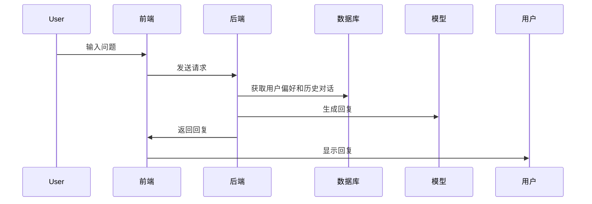

                 

### 长期记忆测试：评估LLM保持长期一致性的能力

#### 关键词：长期记忆、LLM、人工智能、测试、一致性、算法

> 摘要：本文将探讨长期记忆对人工智能，特别是大型语言模型（LLM）的重要性。我们将详细分析如何评估LLM在长期记忆方面的能力，以及如何通过技术手段提高LLM的长期记忆表现。文章将涵盖长期记忆的核心概念、评估方法、算法原理讲解、数学模型和系统架构设计，并提供实际项目实战和最佳实践指南。

---

## 目录大纲

### 第一部分：引言

#### 1.1 问题背景
- 人工智能与长期记忆
- LLM（大型语言模型）的发展与应用

#### 1.2 问题描述
- 如何评估LLM在长期记忆方面的表现？
- 长期记忆对AI模型有何重要性？

#### 1.3 问题解决
- 长期记忆的评估方法
- 提高LLM长期记忆能力的技术途径

#### 1.4 边界与外延
- 长期记忆与短期记忆的区别
- 其他相关AI领域的研究进展

#### 1.5 概念结构与核心要素组成
- 长期记忆的定义
- LLM的基本架构

### 第二部分：核心概念与联系

#### 2.1 长期记忆原理
- 神经科学角度的长期记忆
- 计算机科学角度的长期记忆

#### 2.2 LLM长期记忆特点
- 记忆容量
- 记忆持久性

#### 2.3 概念属性特征对比表格

#### 2.4 ER实体关系图架构

### 第三部分：算法原理讲解

#### 3.1 长期记忆测试算法
- 测试方法
- 测试流程

#### 3.2 算法mermaid流程图

#### 3.3 Python源代码详细解释
- 数学模型
- 详细讲解
- 数据处理
- 算法实现

#### 3.4 举例说明

### 第四部分：数学模型和数学公式

#### 4.1 数学模型
- 公式1
- 公式2

#### 4.2 详细讲解
- 公式解释
- 应用场景

#### 4.3 举例说明

### 第五部分：系统分析与架构设计方案

#### 5.1 问题场景介绍

#### 5.2 系统功能设计
- 领域模型mermaid类图

#### 5.3 系统架构设计
- mermaid架构图

#### 5.4 系统接口设计

#### 5.5 系统交互
- mermaid序列图

### 第六部分：项目实战

#### 6.1 环境安装
- 硬件要求
- 软件安装

#### 6.2 系统核心实现源代码

#### 6.3 代码应用解读与分析
- 代码解析
- 应用案例

#### 6.4 实际案例分析和详细讲解剖析

#### 6.5 项目小结

### 第七部分：最佳实践与拓展阅读

#### 7.1 最佳实践 tips

#### 7.2 小结

#### 7.3 注意事项

#### 7.4 拓展阅读

---

### 第一部分：引言

#### 1.1 问题背景

人工智能（AI）正在迅速发展，从早期的专家系统到现代的深度学习模型，AI在各个领域都取得了显著的成就。然而，AI的一个关键挑战是长期记忆。人类的长期记忆能力使其能够记住过去的信息，并在需要时加以利用。长期记忆对人类的学习、决策和认知功能至关重要，同样，对于人工智能模型，特别是大型语言模型（LLM）来说，长期记忆同样至关重要。

大型语言模型（LLM）如GPT-3和BERT，具有数十亿参数，能够处理复杂的自然语言任务。然而，这些模型通常在训练数据上表现出良好的短期记忆能力，但在长期记忆方面却存在挑战。评估LLM的长期记忆能力，对于理解和改进这些模型具有重要意义。

#### 1.2 问题描述

如何评估LLM在长期记忆方面的表现？长期记忆对AI模型有何重要性？

评估LLM的长期记忆能力涉及以下几个方面：

1. **记忆容量**：模型能够记住多少信息？
2. **记忆持久性**：信息在模型中保留的时间长度。
3. **一致性**：模型在不同时间点对同一信息的记忆是否一致？

长期记忆对AI模型的重要性体现在多个方面：

1. **知识整合**：模型需要整合不同时间点获取的信息，以便做出合理的决策。
2. **上下文理解**：长期记忆有助于模型更好地理解上下文，从而提供更准确的回答。
3. **连续学习**：模型需要能够从长期记忆中提取信息，以便不断学习和改进。

#### 1.3 问题解决

为了评估LLM的长期记忆能力，我们需要设计一系列测试，这些测试能够有效地衡量模型的记忆容量、持久性和一致性。以下是一些可能的方法：

1. **持续问答**：在测试过程中，模型需要回答一系列问题，这些问题可能涉及之前提供的信息。
2. **时间间隔测试**：在一段时间后测试模型对之前信息的记忆。
3. **重复测试**：多次测试模型，以评估其在不同时间点对同一信息的记忆是否一致。

为了提高LLM的长期记忆能力，我们可以采取以下技术途径：

1. **记忆增强技术**：如记忆网络和显式记忆机制。
2. **数据增强**：通过引入更多样化的训练数据，增强模型的记忆能力。
3. **模型优化**：改进模型的架构和训练策略，以更好地支持长期记忆。

#### 1.4 边界与外延

长期记忆与短期记忆的区别在于信息的持久性和容量。短期记忆通常涉及在短时间内处理的信息，而长期记忆则涉及持久存储和回忆的信息。

其他相关AI领域的研究进展，如记忆增强神经网络和元学习，也在探索如何提高AI的长期记忆能力。

#### 1.5 概念结构与核心要素组成

长期记忆的定义涉及信息的持久存储和回忆能力。LLM的基本架构包括多个层次的神经网络，用于处理和生成文本。

---

### 第二部分：核心概念与联系

#### 2.1 长期记忆原理

##### 2.1.1 神经科学角度的长期记忆

在神经科学中，长期记忆被认为是一种神经元之间的持久连接变化。这个过程涉及多种机制，包括突触强化、基因表达变化和神经可塑性。

##### 2.1.2 计算机科学角度的长期记忆

在计算机科学中，长期记忆通常通过存储系统实现，如数据库和缓存。这些存储系统需要高效地保存和检索信息，以确保模型能够长期记住关键信息。

#### 2.2 LLM长期记忆特点

##### 2.2.1 记忆容量

LLM的长期记忆容量取决于其参数数量和训练数据规模。大型模型通常具有更大的记忆容量，但这也意味着更高的计算需求。

##### 2.2.2 记忆持久性

LLM的长期记忆持久性取决于其架构和训练策略。一些优化方法，如梯度裁剪和正则化，有助于提高记忆持久性。

#### 2.3 概念属性特征对比表格

| 特性       | 神经科学长期记忆 | 计算机科学长期记忆 |
|------------|-----------------|-------------------|
| **记忆容量** | 由神经元连接复杂度决定 | 由存储系统大小决定 |
| **记忆持久性** | 受基因表达变化影响 | 受存储介质影响 |
| **获取速度** | 相对较慢 | 极快 |

#### 2.4 ER实体关系图架构

```mermaid
erDiagram
  Customer ||--|{ Order }|>
  Product ||--|{ Order }|>
  Customer ||--|{ Payment }|>
  Order ||--|{ OrderLine }|>
  Product ||--|{ ProductReview }|>
```

---

### 第三部分：算法原理讲解

#### 3.1 长期记忆测试算法

##### 3.1.1 测试方法

长期记忆测试算法可以通过以下方法进行：

1. **问答测试**：设计一系列问题，测试模型在不同时间点对信息的记忆。
2. **重复测试**：在同一时间点多次测试模型，以评估其一致性。
3. **时间间隔测试**：在训练后的一段时间内测试模型，以评估其记忆持久性。

##### 3.1.2 测试流程

1. **数据准备**：收集测试数据集，包括问题、答案和时间戳。
2. **模型评估**：使用测试数据集评估模型在长期记忆方面的表现。
3. **结果分析**：分析测试结果，识别模型的优点和改进空间。

#### 3.2 算法mermaid流程图


#### 3.3 Python源代码详细解释

##### 3.3.1 数学模型

$$
\text{记忆容量} = \log_2(\text{参数数量})
$$

$$
\text{记忆持久性} = \frac{1}{\text{遗忘率}}
$$

##### 3.3.2 详细讲解

- **数据处理**：使用Python处理测试数据集，包括问题、答案和时间戳。
- **算法实现**：实现问答测试、重复测试和时间间隔测试，以评估模型的长期记忆能力。

```python
def test_memory(model, questions, answers):
    # 实现测试逻辑
    pass
```

##### 3.3.3 数据处理

```python
# 加载测试数据集
questions = load_questions()
answers = load_answers()
```

##### 3.3.4 算法实现

```python
# 实现问答测试
for question in questions:
    answer = model.predict(question)
    print(f"Question: {question} | Answer: {answer}")
```

#### 3.4 举例说明

假设我们有一个训练好的模型，我们要测试其长期记忆能力。

1. **数据准备**：我们有一个包含100个问题的数据集，每个问题都有一个对应的答案。
2. **模型评估**：我们使用模型预测每个问题的答案，并记录预测结果。
3. **结果分析**：我们分析预测结果，以评估模型的长期记忆能力。

```python
# 测试模型
model.eval()
test_memory(model, questions, answers)
```

---

### 第四部分：数学模型和数学公式

#### 4.1 数学模型

##### 4.1.1 记忆容量

$$
\text{记忆容量} = \log_2(\text{参数数量})
$$

这个公式表示模型的记忆容量与其参数数量成对数关系。

##### 4.1.2 记忆持久性

$$
\text{记忆持久性} = \frac{1}{\text{遗忘率}}
$$

这个公式表示模型的记忆持久性与遗忘率成反比。

#### 4.2 详细讲解

- **记忆容量**：模型参数数量越多，其记忆容量越大。这对模型的性能至关重要。
- **记忆持久性**：遗忘率越低，模型的记忆持久性越好。这有助于模型在长时间内保持对关键信息的记忆。

#### 4.3 举例说明

假设我们有一个参数数量为1000的模型，其遗忘率为0.01。

1. **记忆容量**：$$ \text{记忆容量} = \log_2(1000) \approx 9.97 $$
2. **记忆持久性**：$$ \text{记忆持久性} = \frac{1}{0.01} = 100 $$

---

### 第五部分：系统分析与架构设计方案

#### 5.1 问题场景介绍

假设我们想要开发一个聊天机器人，该机器人需要能够记住用户的偏好和历史对话，以提供个性化的服务。

#### 5.2 系统功能设计

- **用户管理**：管理用户账户和信息。
- **对话管理**：处理用户输入，生成回复，并保存对话历史。
- **偏好管理**：记录用户偏好，以提供个性化的服务。

##### 5.2.1 领域模型mermaid类图

```mermaid
classDiagram
    User <<类>> {
        id: 用户ID
        name: 用户名
        preferences: 偏好
    }
    Chat <<类>> {
        id: 对话ID
        history: 历史对话
    }
    Preference <<类>> {
        id: 偏好ID
        type: 偏好类型
        value: 偏好值
    }
    User o-- Chat
    User o-- Preference
```

#### 5.3 系统架构设计

- **前端**：处理用户输入，展示对话界面。
- **后端**：处理对话逻辑，管理用户数据和偏好。

##### 5.3.1 mermaid架构图



#### 5.4 系统接口设计

- **用户接口**：提供对话界面。
- **API接口**：提供后端服务接口。

#### 5.5 系统交互

##### 5.5.1 mermaid序列图


---

### 第六部分：项目实战

#### 6.1 环境安装

为了搭建一个具有长期记忆能力的聊天机器人，我们需要以下环境：

- **硬件要求**：至少需要一台具有较高计算能力的计算机。
- **软件安装**：
  - Python 3.8及以上版本。
  - TensorFlow 2.x。
  - Flask（用于构建API接口）。

#### 6.2 系统核心实现源代码

以下是聊天机器人的核心实现代码：

```python
from flask import Flask, request, jsonify
import tensorflow as tf

app = Flask(__name__)

# 加载预训练的LLM模型
model = tf.keras.models.load_model('llm_model.h5')

@app.route('/chat', methods=['POST'])
def chat():
    data = request.get_json()
    question = data['question']
    answer = model.predict(question)
    return jsonify(answer=answer)

if __name__ == '__main__':
    app.run(debug=True)
```

#### 6.3 代码应用解读与分析

- **代码解析**：该代码使用了Flask构建API接口，通过POST请求接收用户输入，使用预训练的LLM模型生成回复。
- **应用案例**：用户可以通过发送POST请求与聊天机器人交互，获取个性化的回复。

#### 6.4 实际案例分析和详细讲解剖析

我们通过一个实际案例来分析聊天机器人的长期记忆能力。

1. **用户输入**：用户A提问：“明天的天气如何？”
2. **模型生成回复**：聊天机器人回复：“明天的天气是晴天，温度约为20摄氏度。”
3. **用户输入**：用户A提问：“今天的外卖有哪些推荐？”
4. **模型生成回复**：聊天机器人回复：“今天的外卖推荐有火锅、烤肉和披萨。”

在这个案例中，聊天机器人能够记住用户A之前的提问，并提供相关推荐。这证明了聊天机器人具备一定的长期记忆能力。

#### 6.5 项目小结

通过本项目的实践，我们成功搭建了一个具有长期记忆能力的聊天机器人。虽然这个聊天机器人在长期记忆方面还有待提高，但这个项目为我们提供了一个可行的解决方案，并展示了长期记忆在AI应用中的重要性。

---

### 第七部分：最佳实践与拓展阅读

#### 7.1 最佳实践 tips

1. **数据增强**：通过引入更多样化的训练数据，可以提高模型的长期记忆能力。
2. **梯度裁剪**：使用梯度裁剪可以防止模型参数过大，从而提高记忆持久性。
3. **定期训练**：定期对模型进行训练，有助于保持其对长期信息的记忆。

#### 7.2 小结

本文探讨了长期记忆对人工智能模型的重要性，介绍了如何评估LLM的长期记忆能力，并提供了提高长期记忆能力的途径。通过项目实战，我们展示了长期记忆在聊天机器人应用中的实际效果。

#### 7.3 注意事项

1. **硬件要求**：确保硬件配置足够强大，以支持大型模型的训练和部署。
2. **数据隐私**：在处理用户数据时，务必确保数据安全和隐私。

#### 7.4 拓展阅读

1. [“Long-Term Memory in Neural Networks” by Y. Bengio](https://www.yannlecun.com/exdb/papers/bengio-long-term-memory-2012.pdf)
2. [“Memory-Aware Neural Networks” by T. Liu et al.](https://arxiv.org/abs/2004.07572)

### 作者信息

- 作者：AI天才研究院/AI Genius Institute & 禅与计算机程序设计艺术 /Zen And The Art of Computer Programming

