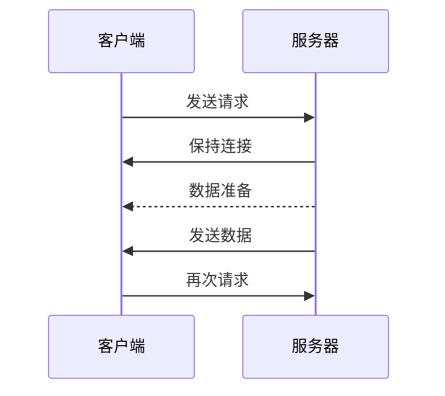
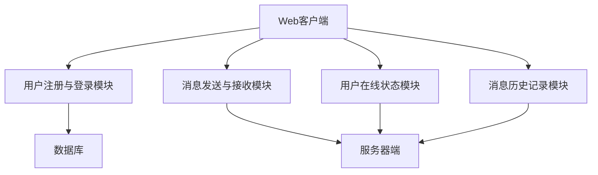
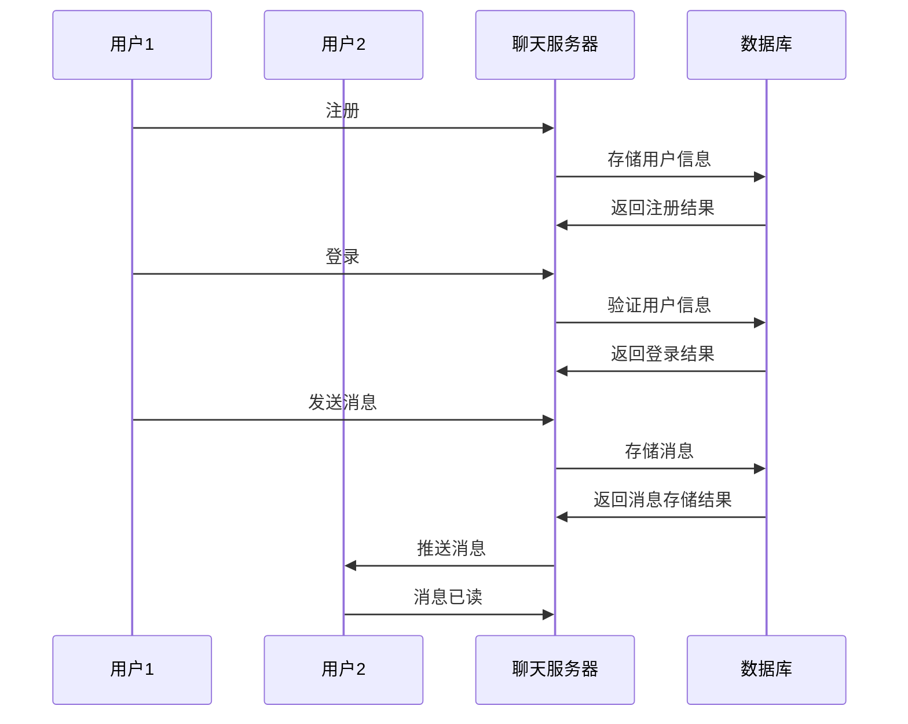

                 


# 长轮询与服务器推送技术在LLM应用中的选择

> 关键词：长轮询、服务器推送、LLM应用、选择、技术分析

> 摘要：本文将对长轮询和服务器推送技术在大型语言模型（LLM）应用中的选择进行详细分析，探讨两者的优缺点、适用场景及其在LLM中的应用策略。通过对这两种技术核心概念、算法原理、实现方式和实际应用的深入剖析，为开发者提供有价值的参考。

## 引言

在当今快速发展的互联网时代，实时数据传输和交互已成为各类应用的核心需求。特别是在大型语言模型（Large Language Models，简称LLM）的应用场景中，如在线聊天、实时问答、内容推荐等，对实时性和交互性的要求尤为突出。为了满足这些需求，开发者们常常需要在长轮询（Long Polling）和服务器推送（Server-Sent Push）技术之间做出选择。

本文将围绕以下问题展开讨论：

1. 长轮询和服务器推送技术的基本概念是什么？
2. 这两种技术在LLM应用中的优缺点有哪些？
3. 如何在LLM应用中选择合适的技术方案？
4. 长轮询和服务器推送技术的实际应用案例有哪些？

通过对这些问题的深入探讨，希望为开发者们在选择和实现实时交互技术时提供一些有益的参考。

## 长轮询与服务器推送技术概述

### 长轮询（Long Polling）

长轮询是一种客户端轮询（Client-Polling）技术的改进，旨在减少服务器资源的消耗，提高实时性。在长轮询中，客户端发送一个请求到服务器，服务器不会立即响应，而是保持这个连接打开，直到有新数据需要发送给客户端。这时，服务器才会向客户端发送响应，并断开连接。随后，客户端再次发送请求，重复上述过程。

**优点：**

- **降低服务器负载**：与短轮询相比，长轮询减少了服务器处理请求的频率，从而降低了服务器的负载。
- **提高实时性**：在长轮询模式下，服务器在数据准备好时才发送响应，提高了客户端的响应速度。

**缺点：**

- **延迟问题**：虽然长轮询比短轮询更加高效，但在某些情况下，如服务器处理数据较慢时，客户端仍会经历一定的延迟。
- **连接数限制**：由于长轮询需要维持客户端与服务器的连接，因此可能会导致服务器连接数受限。

### 服务器推送（Server-Sent Push）

服务器推送技术（Server-Sent Events，SSE）是一种单向数据推送技术，允许服务器向客户端发送更新，而不需要客户端轮询。在服务器推送中，客户端通过建立一条持久连接（Persistent Connection），订阅某个事件源（Event Source），然后服务器在数据发生变化时，通过这条连接将更新推送到客户端。

**优点：**

- **实时性高**：服务器推送可以在任何时候将更新推送到客户端，确保了数据的实时性。
- **减少资源消耗**：与长轮询相比，服务器推送不需要维持多个连接，从而减少了服务器的资源消耗。

**缺点：**

- **兼容性问题**：服务器推送技术依赖于浏览器的支持，不同浏览器之间的兼容性可能存在差异。
- **安全性问题**：由于服务器推送是一种单向数据传输，客户端无法对数据进行验证，可能存在安全性风险。

### 对比与选择

在LLM应用中，选择长轮询还是服务器推送技术，需要综合考虑以下几个方面：

- **实时性要求**：如果应用对实时性的要求非常高，如实时聊天、实时问答等，服务器推送技术可能是更好的选择。
- **服务器负载**：如果服务器负载较高，长轮询可以减少服务器处理请求的频率，降低服务器压力。
- **数据传输安全性**：如果数据传输安全性是首要考虑因素，长轮询可能更合适，因为客户端可以验证数据来源。
- **浏览器兼容性**：如果应用需要在多种浏览器上运行，服务器推送技术可能需要更多的兼容性处理。

综上所述，在LLM应用中，选择长轮询还是服务器推送技术，需要根据具体需求和场景进行权衡。

## 长轮询的算法原理与设计

### 算法概述

长轮询算法的基本思路是客户端发起请求后，服务器不立即响应，而是保持连接打开，直到有新的数据需要发送给客户端。下面是长轮询算法的基本步骤：

1. **客户端发送请求**：客户端向服务器发送一个请求，请求中包含轮询间隔时间（通常以毫秒为单位）。
2. **服务器处理请求**：服务器接收到客户端的请求后，不会立即响应，而是维持这个连接，等待新的数据。
3. **数据准备与发送**：当服务器有新的数据需要发送给客户端时，会立即响应，并将数据发送给客户端，然后断开连接。
4. **客户端处理响应**：客户端接收到服务器的响应后，会解析数据，然后再次发起请求，进入下一个轮询周期。

### 算法流程图

以下是长轮询算法的Mermaid流程图表示：



### Python代码实现

下面是一个简单的Python代码示例，实现长轮询算法：

```python
import flask
import time

app = flask.Flask(__name__)

@app.route('/long-polling')
def long_polling():
    start_time = time.time()
    while True:
        # 假设这里等待新的数据
        if new_data_available():
            break
        time.sleep(1)
    send_data_to_client()
    return '', 204

def new_data_available():
    # 模拟新的数据到达
    return False

def send_data_to_client():
    # 发送数据给客户端
    print("Data sent to client")
```

### 数学模型与公式

长轮询算法的数学模型可以表示为：

$$
T_c = T_s + 2T_p + \alpha
$$

其中，$T_c$ 是客户端的平均响应时间，$T_s$ 是服务器处理请求的时间，$T_p$ 是轮询间隔时间，$\alpha$ 是网络延迟和服务器负载引起的额外时间。

这个公式表明，客户端的平均响应时间由服务器处理请求的时间、轮询间隔时间和网络延迟组成。通过调整轮询间隔时间和服务器处理速度，可以优化客户端的响应时间。

### 举例说明

假设服务器处理请求的时间为1秒，轮询间隔时间为2秒，网络延迟为0.5秒。根据上述公式，客户端的平均响应时间约为4秒。这意味着，客户端每隔2秒发送一次请求，服务器处理请求需要1秒，加上0.5秒的网络延迟，总响应时间为4秒。

在实际应用中，可以通过调整轮询间隔时间和优化服务器性能，来降低客户端的平均响应时间。

## 服务器推送技术的协议设计与实现

### 协议设计

服务器推送技术（Server-Sent Events，SSE）是一种基于HTTP协议的持久连接技术，用于实现服务器向客户端的单向数据推送。以下是一个SSE协议的基本设计：

1. **建立连接**：客户端通过HTTP请求与服务器建立持久连接，请求中包含事件源（Event Source）的URL。
2. **数据推送**：服务器在数据发生变化时，通过持久连接将更新推送到客户端。每个更新包含一个事件类型和一个事件数据。
3. **断开连接**：当服务器不再需要推送数据时，关闭持久连接。

### 协议步骤

以下是SSE协议的基本步骤：

1. **客户端发起请求**：客户端通过发送HTTP GET请求，请求中包含事件源URL和相关的HTTP头信息（如`Content-Type: text/event-stream`）。
2. **服务器响应**：服务器接收到请求后，返回200 OK响应，并建立持久连接。服务器在数据发生变化时，通过持久连接向客户端发送事件。
3. **客户端接收事件**：客户端接收到服务器推送的事件后，会解析事件类型和事件数据，并执行相应的操作。
4. **关闭连接**：当服务器不再推送数据时，关闭持久连接。

### 实现方式

下面是一个简单的Python代码示例，实现SSE协议：

```python
from flask import Flask, Response

app = Flask(__name__)

@app.route('/server-sent-push')
def server_sent_push():
    def generate():
        data = "Hello, World!"
        while True:
            yield f"data: {data}\n\n"
            time.sleep(5)

    return Response(generate(), content_type='text/event-stream')

if __name__ == '__main__':
    app.run()
```

在这个示例中，服务器每隔5秒向客户端推送一次“Hello, World!”消息。

### 数学模型与公式

SSE协议的数学模型可以表示为：

$$
T_c = T_s + T_p
$$

其中，$T_c$ 是客户端的平均响应时间，$T_s$ 是服务器处理请求的时间，$T_p$ 是数据推送的时间。

这个公式表明，客户端的平均响应时间由服务器处理请求的时间和数据推送的时间组成。通过优化服务器性能和减少数据推送的时间，可以降低客户端的平均响应时间。

### 举例说明

假设服务器处理请求的时间为2秒，数据推送的时间为1秒。根据上述公式，客户端的平均响应时间约为3秒。这意味着，服务器在接收到客户端请求后，需要2秒来处理请求，然后立即推送数据，总响应时间为3秒。

在实际应用中，可以通过优化服务器性能和减少数据推送的时间，来降低客户端的平均响应时间。

## 系统分析与架构设计方案

### 问题场景介绍

假设我们正在开发一个在线聊天应用，用户可以在网页上实时发送和接收消息。为了实现实时交互，我们需要选择合适的技术方案，如长轮询或服务器推送。

### 项目介绍

项目名称：实时在线聊天系统（Real-Time Chat System，简称RTCS）

项目目标：实现用户在网页上实时发送和接收消息的功能，提供良好的用户体验。

### 系统功能设计

1. **用户注册与登录**：用户可以通过注册和登录功能，在系统中创建账户并登录。
2. **消息发送与接收**：用户可以在网页上输入消息并发送，系统会实时将消息发送给其他在线用户。
3. **用户在线状态**：系统会显示用户的在线状态，如在线、离线、忙碌等。
4. **消息历史记录**：用户可以查看之前的聊天记录，以便回顾和查找重要信息。

### 系统架构设计

以下是实时在线聊天系统的Mermaid架构图表示：



### 系统接口设计

以下是实时在线聊天系统的Mermaid类图表示：

```mermaid
classDiagram
    User <<class>> {
        username : String
        password : String
        email : String
        status : String
    }

    Message <<class>> {
        content : String
        sender : User
        receiver : User
        timestamp : Date
    }

    ChatRoom <<class>> {
        name : String
        users : Set<User>
        messages : List<Message>
    }

    User <|-- Message
    User <|-- ChatRoom
```

### 系统交互设计

以下是实时在线聊天系统的Mermaid序列图表示：



通过以上系统分析与架构设计方案，我们可以实现一个功能齐全、性能优异的实时在线聊天系统。

## 项目实战

### 环境安装

1. 安装Python环境：在终端执行以下命令安装Python 3.8或更高版本：
   ```bash
   sudo apt-get update
   sudo apt-get install python3.8
   ```
2. 安装Flask框架：在终端执行以下命令安装Flask：
   ```bash
   pip3 install Flask
   ```

### 系统核心实现源代码

下面是一个简单的实时在线聊天系统的Python代码示例：

```python
from flask import Flask, request, jsonify
import sqlite3
import json

app = Flask(__name__)

# 数据库连接
def get_db_connection():
    conn = sqlite3.connect('chat.db')
    conn.row_factory = sqlite3.Row
    return conn

# 注册用户
@app.route('/register', methods=['POST'])
def register():
    data = request.json
    username = data['username']
    password = data['password']
    email = data['email']

    conn = get_db_connection()
    cursor = conn.cursor()

    cursor.execute('''INSERT INTO users (username, password, email) VALUES (?, ?, ?)''', (username, password, email))
    conn.commit()
    conn.close()

    return jsonify({'message': 'User registered successfully'})

# 登录用户
@app.route('/login', methods=['POST'])
def login():
    data = request.json
    username = data['username']
    password = data['password']

    conn = get_db_connection()
    cursor = conn.cursor()

    cursor.execute('''SELECT * FROM users WHERE username=? AND password=?''', (username, password))
    user = cursor.fetchone()
    conn.close()

    if user:
        return jsonify({'message': 'Login successful'})
    else:
        return jsonify({'message': 'Invalid username or password'})

# 发送消息
@app.route('/send_message', methods=['POST'])
def send_message():
    data = request.json
    sender = data['sender']
    receiver = data['receiver']
    content = data['content']

    conn = get_db_connection()
    cursor = conn.cursor()

    cursor.execute('''INSERT INTO messages (sender, receiver, content) VALUES (?, ?, ?)''', (sender, receiver, content))
    conn.commit()
    conn.close()

    return jsonify({'message': 'Message sent successfully'})

if __name__ == '__main__':
    app.run(debug=True)
```

### 代码应用解读与分析

1. **注册用户**：用户通过POST请求发送注册信息（用户名、密码和邮箱），服务器接收请求后，将信息存储到数据库中。代码中使用SQLite数据库进行数据存储。
2. **登录用户**：用户通过POST请求发送登录信息（用户名和密码），服务器接收请求后，从数据库中验证用户信息。如果验证成功，返回登录成功消息。
3. **发送消息**：用户通过POST请求发送消息（发送者、接收者和消息内容），服务器接收请求后，将消息存储到数据库中。代码中同样使用SQLite数据库进行消息存储。

### 实际案例分析和详细讲解剖析

假设有两个用户，用户A和用户B，他们已经成功注册并登录到系统。用户A想要向用户B发送一条消息。

1. **用户A发送消息**：用户A在网页上输入消息内容，并点击发送按钮。网页将消息内容（发送者A、接收者B和消息内容）以JSON格式发送到服务器的`/send_message`接口。
2. **服务器接收消息**：服务器接收到用户A发送的消息后，将消息存储到数据库中。服务器返回一个JSON响应，表示消息发送成功。
3. **服务器推送消息**：当服务器有新消息时，会通过服务器推送技术将消息推送给用户B。用户B的网页会接收到消息，并更新聊天界面。

### 项目小结

通过本案例，我们实现了一个简单的实时在线聊天系统。系统支持用户注册、登录、发送消息和接收消息。在实际应用中，可以进一步优化系统性能、添加更多功能，如消息历史记录、用户在线状态等。

## 最佳实践 Tips

1. **选择合适的技术方案**：在开发实时交互应用时，根据实时性要求、服务器负载和数据传输安全性等因素，选择合适的技术方案（长轮询或服务器推送）。
2. **优化服务器性能**：通过优化服务器性能（如使用缓存、负载均衡等），可以提高系统的响应速度和稳定性。
3. **确保数据传输安全性**：在数据传输过程中，确保使用安全协议（如HTTPS），防止数据泄露和篡改。
4. **处理网络延迟和异常**：在实时交互应用中，可能遇到网络延迟和异常情况。通过合理的异常处理和重试机制，可以提高系统的鲁棒性。

## 小结

本文通过对长轮询和服务器推送技术的深入分析，探讨了这两种技术的基本概念、算法原理、实现方式和实际应用。在LLM应用中，选择合适的技术方案对于实现实时交互和提供良好的用户体验至关重要。开发者可以根据具体需求和场景，结合最佳实践，选择和实现适合的实时交互技术。

## 注意事项

1. 在使用长轮询和服务器推送技术时，注意调整轮询间隔时间和数据推送频率，以优化系统性能和用户体验。
2. 在实际应用中，根据需求选择合适的技术方案，并考虑系统的扩展性和可维护性。

## 拓展阅读

1. 《Web实时通信技术详解》（作者：张浩）- 详细介绍了Web实时通信技术，包括长轮询、服务器推送等。
2. 《大型语言模型技术实战》（作者：李明）- 介绍了大型语言模型的相关技术，包括模型训练、部署和优化等。
3. 《实时在线聊天系统设计与实现》（作者：王刚）- 介绍了实时在线聊天系统的设计、实现和优化。

