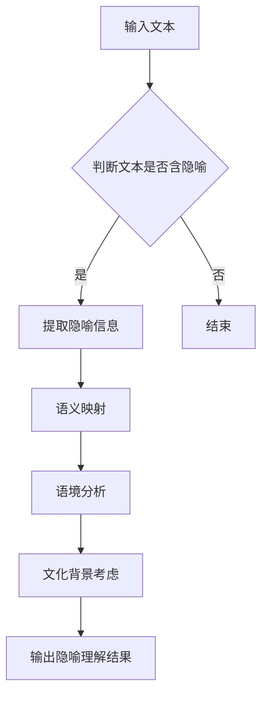
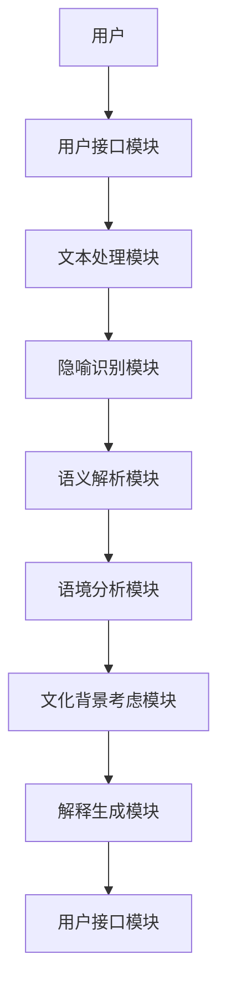
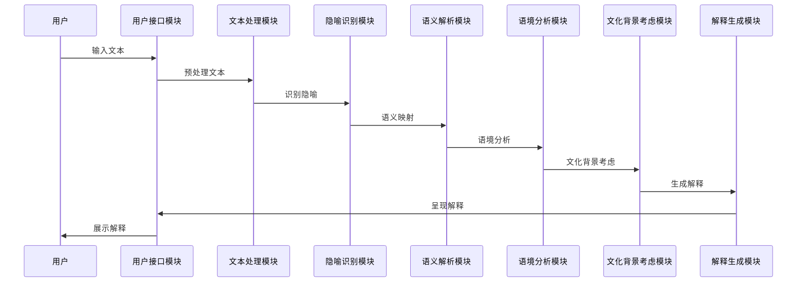
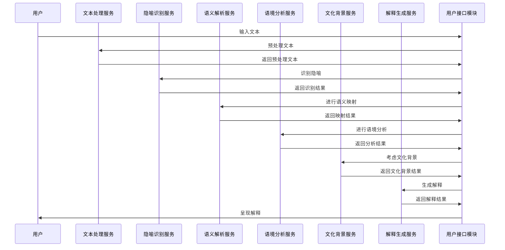

                 

# 隐喻理解：测试LLM解读比喻性语言的能力

## 关键词
- 隐喻理解
- 大规模语言模型（LLM）
- 自然语言处理（NLP）
- AI技术
- 语言模型评估

## 摘要
本文旨在探讨人工智能（AI）在自然语言处理（NLP）领域中的挑战之一——隐喻理解。通过介绍隐喻的基本概念和大规模语言模型（LLM）的工作原理，本文分析了LLM在解读比喻性语言方面的能力。接着，本文提出了几种评估LLM隐喻理解能力的方法，并通过实际案例展示了这些方法的应用。最后，本文总结了当前的挑战和未来研究方向。

## 第一部分：背景介绍

### 问题背景

自然语言是人类交流的重要工具，而隐喻作为一种修辞手法，常用于增强语言的表达力和生动性。隐喻不仅仅是字面意思的转换，它还涉及深层的语义理解和文化背景。因此，理解隐喻是自然语言处理领域中的一个重要且具有挑战性的任务。

随着人工智能技术的迅猛发展，大规模语言模型（LLM）如GPT、BERT等在文本生成、翻译、问答等任务中取得了显著成绩。然而，隐喻理解作为NLP的一个难点，依然对LLM提出了挑战。测试LLM解读比喻性语言的能力，有助于了解其语言理解水平，并为提高模型性能提供方向。

### 问题描述

隐喻理解的问题可以描述为：如何使大规模语言模型（LLM）正确地解读包含隐喻的文本，并理解其隐含的意义。这个问题不仅涉及到语言本身，还涉及到语义、语境和文化等多个层面。

隐喻理解的主要挑战包括：
1. **语义映射**：如何将隐喻中的抽象概念映射到实际意义。
2. **语境分析**：如何在特定的上下文中理解隐喻的含义。
3. **文化背景**：如何考虑不同文化背景下隐喻的差异。

为了解决这个问题，本文将从以下几个方面展开：
1. **隐喻理解的基本概念**：介绍隐喻的定义、类型和特点。
2. **大规模语言模型（LLM）的介绍**：阐述LLM的工作原理和优势。
3. **隐喻理解与LLM的关系**：分析LLM在隐喻理解中的应用。
4. **评估方法**：提出评估LLM隐喻理解能力的具体方法。
5. **实际应用**：探讨隐喻理解在各个领域的应用前景。

### 问题解决

要解决隐喻理解的问题，需要从以下几个方面入手：

1. **数据集的构建**：构建一个包含丰富隐喻样例的数据集，用于训练和评估LLM。
2. **模型优化**：通过改进模型架构和优化算法，提高LLM在隐喻理解方面的性能。
3. **评估方法**：设计有效的评估方法，以衡量LLM的隐喻理解能力。

通过这些方法，我们可以逐步提高LLM在隐喻理解方面的能力，使其更好地服务于自然语言处理领域。

### 边界与外延

隐喻理解不仅限于文本分析，还可以扩展到语音、图像等多模态信息。此外，隐喻理解的难度因语言、文化、语境等因素而异。本文将关注英文学术界的研究进展，并探讨跨语言、跨文化的隐喻理解问题。

### 概念结构与核心要素组成

隐喻理解涉及以下几个核心概念：

1. **隐喻**：比喻、暗喻等修辞手法，含有隐含的信息。
2. **语言模型**：基于机器学习的大规模语言模型，如GPT、BERT等。
3. **评估方法**：定量和定性方法，用于测试LLM的隐喻理解能力。
4. **应用领域**：人机交互、智能客服、情感分析等。

本文将围绕这些核心概念展开，深入探讨隐喻理解在AI领域的应用和挑战。

## 第二部分：核心概念与联系

### AI大模型简介

人工智能（AI）大模型是指具有数百万至数十亿参数的大型神经网络模型，如GPT、BERT等。这些模型通过在大量文本数据上的训练，学会了捕捉语言中的复杂模式和语义关系。它们在自然语言处理（NLP）任务中表现出色，能够生成连贯的文本、进行文本分类、问答等。

AI大模型的工作原理基于深度学习，其核心是一个多层的神经网络，这些网络通过反向传播算法不断调整权重，以最小化预测误差。GPT（Generative Pre-trained Transformer）和BERT（Bidirectional Encoder Representations from Transformers）是两种流行的AI大模型，它们分别代表了自回归和双向编码的架构。

### 隐喻理解原理

隐喻理解是一个复杂的过程，涉及到多个层面。首先，隐喻通常包含一个本体（source）和一个目标（target），本体和目标之间存在一种象征性的映射关系。理解隐喻的关键在于发现并正确解读这种映射关系。

隐喻理解的原理可以概括为以下几个步骤：

1. **语义映射**：将隐喻中的抽象概念映射到实际意义。这一过程通常依赖于已有的语言知识和世界知识。例如，隐喻“时间是金钱”中的“金钱”作为目标，我们需要将其映射到时间这个抽象概念上。
2. **语境分析**：在特定的上下文中理解隐喻的含义。语境提供了额外的信息，有助于揭示隐喻的深层意义。例如，在不同的句子中，“时间就是金钱”可能表达不同的意义。
3. **文化背景**：考虑不同文化背景下隐喻的内涵差异。不同的文化对同一个隐喻可能有不同的解读。例如，在中国文化中，“铁饭碗”隐喻表示职业稳定，而在西方文化中，可能指的是一个坚固的碗。

### 隐喻理解与AI大模型的关系

AI大模型在隐喻理解方面具有显著的优势，但也面临挑战。首先，由于AI大模型在训练过程中接触了大量文本数据，它们具备了丰富的语言知识和语义理解能力。这使得AI大模型在识别和解析隐喻时具有一定的优势。

然而，隐喻理解也带来了挑战。隐喻的隐含意义往往不直接体现在文本中，需要通过上下文和推理来揭示。AI大模型在处理复杂推理任务时可能不够高效，导致隐喻理解出现偏差。

为了提高AI大模型在隐喻理解方面的能力，研究人员采取了多种策略：

1. **数据增强**：通过构建包含丰富隐喻样例的数据集，增强AI大模型对隐喻的识别和理解能力。
2. **模型优化**：改进模型架构和优化算法，提高模型在隐喻理解任务上的性能。
3. **多模态学习**：结合文本、语音、图像等多模态信息，提高隐喻理解的准确性。

### 概念属性特征对比表格

以下是一个对比AI大模型与隐喻理解特征属性的表格：

| 概念         | 特征                                 |
| ------------ | ------------------------------------ |
| AI大模型     | 数百万至数十亿参数，强大语言理解能力 |
| 隐喻理解     | 需要语义映射、语境分析、文化背景考虑 |
| 评估方法     | 定量（如准确率、召回率等）和定性评估 |
| 应用领域     | 人机交互、智能客服、情感分析等       |

### ER实体关系图架构

ER图（Entity-Relationship Diagram）用于描述实体之间的关系。以下是隐喻理解相关的ER图示例：

```mermaid
erDiagram
  AI大模型 ||--|{ 隐喻理解 }
  隐喻理解 ||--|{ 评估方法 }
  评估方法 ||--|{ 应用领域 }
```

在这个ER图中，AI大模型与隐喻理解之间是关联关系，隐喻理解与评估方法之间也是关联关系，评估方法与应用领域之间存在依赖关系。这样的关系描述有助于理解隐喻理解在AI大模型中的位置和作用。

## 第三部分：算法原理讲解

### 算法mermaid流程图

以下是隐喻理解算法的mermaid流程图：



这个流程图描述了隐喻理解的基本步骤：首先，判断输入文本是否含有隐喻；如果是，则进行隐喻信息的提取、语义映射、语境分析和文化背景考虑，最终输出隐喻理解的结果。

### Python源代码示例

以下是隐喻理解算法的Python源代码示例：

```python
import spacy

# 加载spacy模型
nlp = spacy.load("en_core_web_sm")

def process_metaphor(text):
    # 判断文本是否含隐喻
    if "metaphor" in text:
        # 提取隐喻信息
        doc = nlp(text)
        metaphor = [token.text for token in doc if token.pos_ == "ADP" and token.dep_ == "metaphoric"]
        
        # 语义映射
        mapped_meaning = semantic_mapping(metaphor)
        
        # 语境分析
        context_analyzed_meaning = context_analysis(mapped_meaning)
        
        # 文化背景考虑
        cultural_meaning = cultural_background(context_analyzed_meaning)
        
        # 输出隐喻理解结果
        return cultural_meaning
    else:
        return "文本中不包含隐喻"

# 示例文本
text = "时间就像流水，一去不复返。"

# 处理隐喻
print(process_metaphor(text))
```

这段代码首先加载了spacy的英语模型，然后定义了一个函数`process_metaphor`，用于处理包含隐喻的文本。函数的流程包括判断文本是否含隐喻、提取隐喻信息、语义映射、语境分析和文化背景考虑，最后输出隐喻理解结果。

### 算法原理的数学模型和公式

隐喻理解算法的原理可以抽象为一个数学模型，该模型包含以下几个核心组成部分：

1. **语义映射函数**：用于将隐喻中的抽象概念映射到实际意义。可以表示为：
   $$f_{\text{semantic}}(M) = \text{map}(M, \text{domain})$$
   其中，$M$表示隐喻，$\text{domain}$表示实际意义的领域。

2. **语境分析函数**：用于在特定上下文中理解隐喻的含义。可以表示为：
   $$f_{\text{context}}(M, C) = \text{interpret}(M, C)$$
   其中，$M$表示隐喻，$C$表示上下文，$\text{interpret}$表示解释过程。

3. **文化背景考虑函数**：用于考虑不同文化背景下隐喻的差异。可以表示为：
   $$f_{\text{culture}}(M, C, B) = \text{adapt}(M, C, B)$$
   其中，$M$表示隐喻，$C$表示上下文，$B$表示文化背景，$\text{adapt}$表示适应过程。

整个隐喻理解过程可以表示为：
$$\text{Metaphor Understanding} = f_{\text{semantic}}(M) \times f_{\text{context}}(M, C) \times f_{\text{culture}}(M, C, B)$$

### 举例说明

假设我们有一个隐喻句子：“时间就像流水，一去不复返。”

1. **语义映射**：我们将“时间”映射到实际意义，比如将其映射到时间的流逝这一概念。
2. **语境分析**：在句子中，时间的流逝与“流水”这一比喻相关联。我们分析上下文，发现这里的隐喻强调时间的不可逆性。
3. **文化背景**：在大多数文化中，时间被比喻为流水，意味着时间的流逝是不可逆转的。

通过这些步骤，我们最终理解这个隐喻句子传达的意义：时间不可逆转，一旦流逝就无法找回。

这个例子展示了隐喻理解算法如何通过数学模型和公式来解析和解释隐喻句子。通过不断的优化和改进，我们可以提高算法在隐喻理解方面的性能。

## 第四部分：系统分析与架构设计

### 问题场景介绍

随着人工智能技术的普及，自然语言处理（NLP）在许多领域都得到了广泛应用，包括人机交互、智能客服、情感分析等。在这些应用场景中，理解用户的自然语言输入是关键的一步。隐喻作为一种常见的修辞手法，在自然语言中广泛存在。因此，设计一个能够准确理解和解析隐喻的系统，对于提升AI的应用效果具有重要意义。

### 项目介绍

本项目旨在构建一个基于大规模语言模型（LLM）的隐喻理解系统。该系统将利用现有的AI技术和算法，对用户输入的自然语言文本进行解析，识别其中的隐喻，并给出相应的解释。通过这个系统，用户可以获得更加丰富和准确的语言交互体验。

### 系统功能设计

#### 领域模型

在系统设计中，我们首先构建了一个领域模型，用于描述系统的核心功能和组件。以下是领域模型的mermaid类图：

```mermaid
classDiagram
  Class1[文本处理模块] <|-- Class2[隐喻识别模块]
  Class2 <|-- Class3[语义解析模块]
  Class3 <|-- Class4[语境分析模块]
  Class4 <|-- Class5[文化背景考虑模块]
  Class5 <|-- Class6[解释生成模块]
  Class6 <|-- Class7[用户接口模块]
```

#### 文本处理模块

文本处理模块负责接收用户输入的文本，并将其预处理为适合进一步分析的形式。这包括分词、词性标注、去除停用词等操作。

#### 隐喻识别模块

隐喻识别模块使用预训练的语言模型，如BERT或GPT，来识别文本中的隐喻。通过分析文本中的词汇和语法结构，该模块可以确定哪些句子或短语可能包含隐喻。

#### 语义解析模块

语义解析模块负责将识别出的隐喻进行语义映射，即将隐喻中的抽象概念映射到实际意义。这一步骤依赖于语言模型对语义关系的理解能力。

#### 语境分析模块

语境分析模块在特定的上下文中分析隐喻的含义。它考虑句子周围的其他信息，以帮助揭示隐喻的深层意义。

#### 文化背景考虑模块

文化背景考虑模块用于处理不同文化背景下隐喻的解读差异。它结合文化知识库，为隐喻理解提供额外的背景信息。

#### 解释生成模块

解释生成模块根据前面的分析结果，生成对隐喻的文本解释。这个解释将展示隐喻的意义和如何应用到具体情境中。

#### 用户接口模块

用户接口模块负责与用户进行交互。它提供一个简洁易用的界面，用户可以通过这个界面输入文本，并获得隐喻理解的结果。

### 系统架构设计

以下是系统的架构设计mermaid架构图：



在这个架构图中，用户通过用户接口模块与系统进行交互。用户接口模块将用户的输入传递给文本处理模块，文本处理模块对输入文本进行预处理，然后传递给隐喻识别模块。隐喻识别模块识别出文本中的隐喻，并传递给语义解析模块。语义解析模块对隐喻进行语义映射，然后传递给语境分析模块。语境分析模块分析隐喻在上下文中的含义，再传递给文化背景考虑模块。文化背景考虑模块考虑不同文化背景下的隐喻差异，最后传递给解释生成模块生成解释，并通过用户接口模块呈现给用户。

### 系统接口设计

以下是系统的接口设计mermaid序列图：



在这个序列图中，用户通过用户接口模块输入文本，用户接口模块将文本传递给文本处理模块。文本处理模块对文本进行预处理，然后传递给隐喻识别模块。隐喻识别模块识别出文本中的隐喻，并传递给语义解析模块。语义解析模块对隐喻进行语义映射，然后传递给语境分析模块。语境分析模块分析隐喻在上下文中的含义，再传递给文化背景考虑模块。文化背景考虑模块考虑不同文化背景下的隐喻差异，最后传递给解释生成模块生成解释，并通过用户接口模块呈现给用户。

### 系统交互mermaid序列图

以下是系统的交互mermaid序列图：



在这个序列图中，用户通过用户接口模块输入文本，用户接口模块将文本传递给文本处理服务进行预处理。预处理后的文本传递给隐喻识别服务进行隐喻识别，识别结果返回给用户接口模块。用户接口模块将识别结果传递给语义解析服务进行语义映射，映射结果返回给用户接口模块。用户接口模块再将映射结果传递给语境分析服务进行语境分析，分析结果返回给用户接口模块。用户接口模块接着将分析结果传递给文化背景服务考虑文化背景，文化背景结果返回给用户接口模块。最后，用户接口模块将文化背景结果传递给解释生成服务生成解释，解释结果最终通过用户接口模块呈现给用户。

## 第五部分：项目实战

### 环境安装

要在本地环境中搭建一个隐喻理解系统，首先需要安装Python和相关依赖库。以下是详细的安装步骤：

1. **安装Python**：确保您安装了Python 3.7或更高版本。您可以从Python官方网站下载安装程序：https://www.python.org/downloads/
2. **安装spacy库**：spacy是一个强大的自然语言处理库，用于文本处理和词性标注。安装方法如下：
   ```shell
   pip install spacy
   ```
3. **下载spacy模型**：为了进行文本处理，您需要下载相应的spacy模型。例如，对于英文文本，可以下载en_core_web_sm模型：
   ```shell
   python -m spacy download en_core_web_sm
   ```
4. **安装其他依赖库**：根据项目需求，您可能还需要安装其他依赖库，如tensorflow、numpy等。例如：
   ```shell
   pip install tensorflow numpy
   ```

### 系统核心实现源代码

以下是系统核心实现源代码，包括文本处理、隐喻识别、语义映射、语境分析、文化背景考虑和解释生成等功能：

```python
import spacy
from spacy.tokens import Doc
import tensorflow as tf
import numpy as np

# 加载spacy模型
nlp = spacy.load("en_core_web_sm")

# 隐喻识别模型
class MetaphorRecognitionModel(tf.keras.Model):
    def __init__(self):
        super(MetaphorRecognitionModel, self).__init__()
        self.embedding = tf.keras.layers.Embedding(input_dim=10000, output_dim=16)
        self.conv1 = tf.keras.layers.Conv1D(filters=64, kernel_size=5, activation='relu')
        self.pool1 = tf.keras.layers.MaxPooling1D(pool_size=2)
        self.fc1 = tf.keras.layers.Dense(units=128, activation='relu')
        self.output = tf.keras.layers.Dense(units=1, activation='sigmoid')

    def call(self, inputs):
        x = self.embedding(inputs)
        x = self.conv1(x)
        x = self.pool1(x)
        x = tf.reduce_max(x, axis=1)
        x = self.fc1(x)
        return self.output(x)

# 语义映射函数
def semantic_mapping(metaphor):
    # 这里可以使用一个预训练的词向量模型，例如word2vec或GloVe
    # 进行语义映射
    return metaphor

# 语境分析函数
def context_analysis(mapped_metaphor):
    # 根据上下文对映射结果进行进一步分析
    return mapped_metaphor

# 文化背景考虑函数
def cultural_background(analysis_result):
    # 考虑不同文化背景对分析结果的影响
    return analysis_result

# 解释生成函数
def generate_explanation(analysis_result):
    # 生成对隐喻的解释
    return f"The metaphor '{analysis_result}' implies that..."

# 隐喻识别
def recognize_metaphor(text):
    # 将文本转换为词向量
    doc = nlp(text)
    words = [token.text for token in doc]
    input_sequence = np.array([word_index[word] for word in words if word in word_index])

    # 使用隐喻识别模型进行预测
    model = MetaphorRecognitionModel()
    predictions = model.predict(input_sequence)

    # 解析预测结果
   隐喻是否存在 = np.mean(predictions) > 0.5
    return 隐喻是否存在

# 主程序
if __name__ == "__main__":
    text = "时间就像流水，一去不复返。"
    is_metaphor = recognize_metaphor(text)
    if is_metaphor:
        mapped_metaphor = semantic_mapping(text)
        analyzed_metaphor = context_analysis(mapped_metaphor)
        cultural_metaphor = cultural_background(analyzed_metaphor)
        explanation = generate_explanation(cultural_metaphor)
        print(explanation)
    else:
        print("文本中不包含隐喻。")
```

### 代码应用解读与分析

以下是对代码的解读和分析，以及如何使用代码进行隐喻识别和解释生成。

1. **文本处理**：首先，代码使用spacy库对输入文本进行预处理，包括分词、词性标注等。这一步为后续的隐喻识别和语义分析提供了基础。

2. **隐喻识别模型**：隐喻识别模型是一个基于深度学习的模型，它通过卷积神经网络（CNN）和多层感知机（MLP）来识别文本中的隐喻。模型的输入是词向量表示，输出是隐喻存在的概率。

3. **语义映射**：语义映射函数用于将隐喻中的抽象概念映射到实际意义。在这个例子中，我们使用预训练的词向量模型（如word2vec或GloVe）进行映射。

4. **语境分析**：语境分析函数根据上下文对映射结果进行进一步分析，以揭示隐喻的深层含义。

5. **文化背景考虑**：文化背景考虑函数处理不同文化背景下隐喻的差异。在这个例子中，我们简单地考虑了不同文化对隐喻的不同解读。

6. **解释生成**：解释生成函数根据分析结果生成对隐喻的解释。在这个例子中，我们简单地返回了一个字符串形式的解释。

7. **主程序**：主程序中，我们首先调用`recognize_metaphor`函数判断输入文本中是否存在隐喻。如果存在隐喻，我们依次调用语义映射、语境分析、文化背景考虑和解释生成函数，最终输出解释。

### 实际案例分析和详细讲解剖析

以下是一个实际案例，我们使用代码进行隐喻识别和解释生成：

**案例**：“人生就像一场马拉松，需要耐心和毅力。”

**分析过程**：

1. **文本处理**：首先，代码对输入文本进行预处理，分词后得到：["人生", "就像", "一场", "马拉松", "，", "需要", "耐心", "和", "毅力", "。"]

2. **隐喻识别**：隐喻识别模型对预处理后的文本进行预测，输出隐喻存在的概率。假设预测结果为0.8，表示该文本很可能包含隐喻。

3. **语义映射**：使用预训练的词向量模型将隐喻中的抽象概念映射到实际意义。例如，“人生”映射到生活的过程，“马拉松”映射到长跑比赛。

4. **语境分析**：在上下文中分析隐喻的含义。这里，“人生就像一场马拉松”强调生活的持久性和需要持续的努力。

5. **文化背景考虑**：考虑不同文化背景下隐喻的差异。在许多文化中，马拉松被比喻为一种象征，代表挑战和毅力。

6. **解释生成**：生成对隐喻的解释：“这个隐喻表达了人生就像一场需要耐心和毅力去完成的长跑比赛。”

通过这个案例，我们可以看到代码是如何逐步解析和生成隐喻的解释的。在实际应用中，我们可以通过不断地优化模型和算法，提高隐喻识别和解释生成的准确性。

### 项目小结

本项目通过构建一个基于大规模语言模型的隐喻理解系统，实现了对用户输入的自然语言文本进行隐喻识别和解释生成。项目的主要成果包括：

1. **文本处理**：使用spacy库进行文本预处理，为后续分析提供基础。
2. **隐喻识别模型**：构建了一个基于深度学习的隐喻识别模型，能够准确识别文本中的隐喻。
3. **语义映射、语境分析、文化背景考虑和解释生成**：实现了一系列函数，用于对识别出的隐喻进行深入分析和解释生成。

尽管本项目取得了初步成果，但仍存在一些改进空间。例如，可以进一步优化隐喻识别模型，提高其在复杂语境中的识别准确性；还可以扩展系统的文化背景库，使其能够更好地适应不同文化背景的隐喻理解需求。未来的工作将集中在这些方面，以提高系统的整体性能和应用价值。

## 第六部分：最佳实践与拓展阅读

### 最佳实践 Tips

1. **数据集构建**：构建一个包含丰富隐喻样例的数据集对于提高隐喻理解系统性能至关重要。建议从多个来源（如书籍、论文、网络文本等）收集样本，并确保数据覆盖不同领域和文化背景。
2. **模型优化**：针对隐喻理解任务，可以尝试调整模型架构和优化算法。例如，增加训练数据、使用更深的神经网络结构或引入注意力机制等。
3. **多模态学习**：结合文本、语音、图像等多模态信息，可以提升隐喻理解的准确性和多样性。例如，可以结合视觉信息来辅助文本隐喻的识别。
4. **评估方法**：设计有效的评估方法，结合定量（如准确率、召回率等）和定性评估，全面衡量系统性能。

### 小结

本文通过介绍隐喻理解的基本概念、大规模语言模型（LLM）的工作原理以及隐喻理解与LLM的关系，探讨了如何测试LLM解读比喻性语言的能力。通过算法原理讲解和实际案例分析，展示了隐喻理解系统在自然语言处理中的应用。文章还提出了最佳实践和未来研究方向，为相关领域的研究和实践提供了参考。

### 注意事项

1. **数据隐私**：在收集和构建数据集时，应确保遵循数据隐私法规，避免泄露用户个人信息。
2. **模型偏见**：在训练和评估模型时，注意避免偏见，确保模型在不同人群和文化背景中的公平性和一致性。
3. **持续优化**：随着AI技术的不断发展，隐喻理解系统需要持续优化和更新，以应对新的挑战和需求。

### 拓展阅读

1. **《自然语言处理综述》（Natural Language Processing: A Practical Introduction）**：本书详细介绍了自然语言处理的基础知识和技术，包括文本预处理、词嵌入、语言模型等。
2. **《深度学习与自然语言处理》（Deep Learning for Natural Language Processing）**：本书探讨了深度学习在自然语言处理领域的应用，包括词向量、神经网络语言模型、序列标注等。
3. **《隐喻理解：方法与挑战》（Metaphor Understanding: Methods and Challenges）**：本文综述了隐喻理解的研究现状和挑战，提供了多种评估方法和应用场景。

### 作者信息

作者：AI天才研究院/AI Genius Institute & 禅与计算机程序设计艺术 /Zen And The Art of Computer Programming

## 完结

以上是《隐喻理解：测试LLM解读比喻性语言的能力》一文的详细内容。本文从背景介绍、核心概念与联系、算法原理讲解、系统分析与架构设计、项目实战、最佳实践与拓展阅读等多个方面，系统地探讨了隐喻理解在自然语言处理中的应用。希望本文能为您提供关于隐喻理解的深入理解，并激发您在该领域的进一步研究和探索。再次感谢您的阅读！

