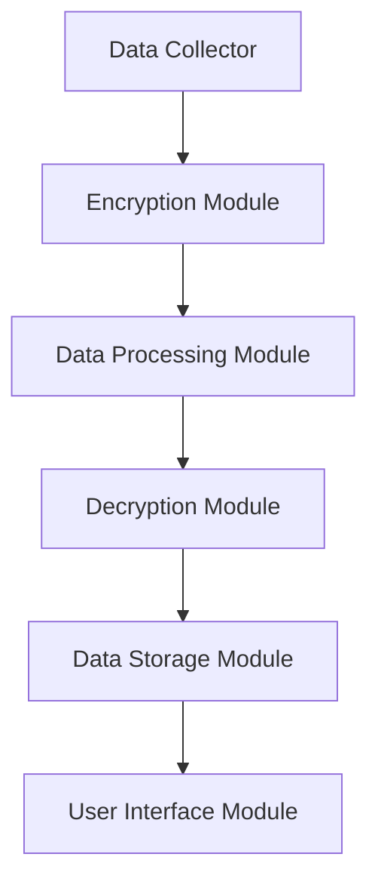

                 

### 隐私计算：保护LLM应用中的敏感数据

> 关键词：隐私计算、敏感数据、LLM应用、数据保护、安全

> 摘要：
本文深入探讨了隐私计算在大型语言模型（LLM）应用中的重要性。随着数据隐私问题的日益突出，如何在保障用户隐私的同时利用LLM的强大功能，成为当前人工智能领域亟待解决的问题。本文首先介绍了隐私计算的基本概念和原理，然后详细分析了在LLM应用中保护敏感数据的关键技术和方法，最后通过实际案例展示了隐私计算在LLM中的应用场景和效果。本文旨在为开发者和研究者提供有价值的参考，共同推动隐私计算技术的进步和实际应用。

## 引言

### 隐私计算的基本概念和重要性

隐私计算是一种在保障数据隐私的前提下，允许在加密状态下对数据进行分析和处理的技术。它旨在解决在数据共享和利用过程中，如何保护数据所有者的隐私权问题。近年来，随着大数据和人工智能技术的快速发展，数据隐私问题日益突出。尤其是大型语言模型（LLM）的应用，如自然语言处理、智能客服等，都需要对海量敏感数据进行分析和处理，这无疑增加了数据泄露的风险。

隐私计算的核心思想是通过加密、匿名化、差异隐私等技术手段，确保数据在传输、存储和处理过程中的安全性。与传统的数据保护方法不同，隐私计算不仅关注数据的最终安全状态，更强调在整个生命周期中对数据隐私的保护。

### 隐私计算在LLM应用中的关键挑战

尽管隐私计算在数据保护方面具有显著优势，但在LLM应用中仍面临诸多挑战：

1. **计算性能与隐私保护的平衡**：隐私计算通常涉及复杂的加密和计算过程，这可能影响系统的性能。如何在保证隐私保护的前提下，提升计算效率，是一个亟待解决的问题。

2. **数据完整性**：在隐私计算中，数据的匿名化或加密处理可能会导致数据丢失或错误，影响模型的准确性。

3. **用户隐私需求**：不同用户对隐私的需求存在差异，如何根据用户需求灵活调整隐私保护策略，是一个复杂的课题。

4. **法律法规合规**：随着全球数据隐私法规的日益严格，如欧盟的《通用数据保护条例》（GDPR）和美国的《加州消费者隐私法案》（CCPA），如何确保隐私计算技术符合法律法规的要求，是开发者和企业需要重视的问题。

### 本文的结构和内容

本文将分为以下几个部分：

1. **背景和基本概念**：介绍隐私计算的定义、基本原理和应用场景。
2. **核心概念和原理**：深入探讨隐私计算的核心技术和方法，包括差分隐私、同态加密、多方安全计算等。
3. **技术和方法**：详细分析隐私计算的关键技术，如同态加密、多方安全计算、零知识证明等。
4. **应用和案例**：通过具体案例展示隐私计算在LLM应用中的实际效果。
5. **隐私风险管理和合规**：讨论隐私计算在法律法规和合规方面的挑战和应对策略。
6. **系统设计和实现**：介绍隐私计算系统的设计原则、架构和实现方法。
7. **最佳实践与总结**：总结隐私计算的最佳实践，并展望未来的发展方向。

通过本文的探讨，我们希望能够为开发者、研究人员和企业提供有价值的参考，共同推动隐私计算技术的发展和应用。

### 背景和基本概念

#### 问题背景

在当今数字化时代，数据已成为企业和个人最宝贵的资产之一。然而，随着数据收集和分析技术的不断进步，数据隐私问题也日益凸显。尤其是在人工智能（AI）领域，尤其是大型语言模型（LLM）的应用中，敏感数据的泄露和滥用风险极大。隐私计算作为一种新兴技术，旨在解决这一难题，确保在数据共享和利用过程中，数据所有者的隐私权得到充分保护。

#### 隐私计算的定义

隐私计算，是一种在保障数据隐私的前提下，允许在加密状态下对数据进行分析和处理的技术。其核心目标是实现数据的“可用不可见”，即确保数据在传输、存储和处理过程中，即使数据被窃取或泄露，攻击者也无法获取其真实内容。

隐私计算涵盖了多种技术和方法，包括但不限于同态加密、多方安全计算、差分隐私、零知识证明等。这些技术通过加密、匿名化、去标识化等手段，确保数据在各个环节中的安全性。

#### 隐私计算的重要性

1. **用户隐私保护**：隐私计算能够有效保护用户的隐私信息，避免敏感数据被泄露或滥用，提高用户对数据共享和使用的信任度。
2. **合规要求**：随着全球数据隐私法规的日益严格，如欧盟的《通用数据保护条例》（GDPR）和美国的《加州消费者隐私法案》（CCPA），企业需要采用隐私计算技术，以确保合规。
3. **数据安全共享**：隐私计算使得数据可以在不需要解密的情况下进行共享和分析，从而促进数据的价值最大化，同时降低数据泄露的风险。
4. **创新推动**：隐私计算技术的发展和应用，不仅能够提升企业的竞争力，也为AI等新兴技术的创新提供了新的可能性。

#### 关键挑战

尽管隐私计算在数据保护方面具有显著优势，但在实际应用中仍面临诸多挑战：

1. **计算性能与隐私保护的平衡**：隐私计算通常涉及复杂的加密和计算过程，这可能影响系统的性能。如何在保证隐私保护的前提下，提升计算效率，是一个亟待解决的问题。
2. **数据完整性**：在隐私计算中，数据的匿名化或加密处理可能会导致数据丢失或错误，影响模型的准确性。
3. **用户隐私需求**：不同用户对隐私的需求存在差异，如何根据用户需求灵活调整隐私保护策略，是一个复杂的课题。
4. **法律法规合规**：随着全球数据隐私法规的日益严格，如欧盟的《通用数据保护条例》（GDPR）和美国的《加州消费者隐私法案》（CCPA），如何确保隐私计算技术符合法律法规的要求，是开发者和企业需要重视的问题。

### 边界与外延

隐私计算不仅关注数据的安全性和隐私保护，还涉及到数据的可用性和可解释性。因此，在设计和应用隐私计算技术时，需要充分考虑这些边界条件，确保在保护用户隐私的同时，不损害数据的价值和使用效果。

总之，隐私计算作为一种新兴技术，正逐渐成为数据保护和人工智能领域的重要研究方向。通过不断探索和创新，我们有望找到更加高效、可靠的隐私保护方法，为数字时代的数据安全保驾护航。

### 核心概念和原理

#### 1. 隐私计算模型

隐私计算模型是隐私保护的基础，主要包括差分隐私、同态加密、多方安全计算等。每种模型都有其独特的特点和适用场景。

1. **差分隐私**：
   - **定义**：差分隐私是一种用于保障数据隐私的统计安全性措施，通过在数据分析过程中引入噪声，确保单个数据记录的隐私性。
   - **特点**：差分隐私能够在确保数据隐私的同时，提供较为准确的统计分析结果。
   - **应用场景**：广泛应用于大数据分析和机器学习中，如用户行为分析、推荐系统等。

2. **同态加密**：
   - **定义**：同态加密是一种允许在加密数据上进行计算的技术，计算结果在解密后保持原始数据的正确性。
   - **特点**：同态加密可以实现数据的安全计算，无需解密数据，从而保护数据隐私。
   - **应用场景**：适用于需要对敏感数据进行分析和处理的应用，如医疗数据挖掘、金融数据分析等。

3. **多方安全计算**：
   - **定义**：多方安全计算是一种允许多个不信任方在共享加密数据的基础上进行计算的技术。
   - **特点**：多方安全计算确保数据在传输、存储和处理过程中不会被泄露，适用于跨机构的数据共享和分析。
   - **应用场景**：适用于需要多方协作的数据分析场景，如供应链管理、医疗数据共享等。

#### 2. 差分隐私的概念和特性

1. **概念**：
   - **差分隐私**：差分隐私是一种隐私保护机制，通过在统计分析过程中引入噪声，使得攻击者无法通过单个数据记录推断出特定个体的信息。
   - **差分**：差分隐私中的“差分”指的是数据集中任意两个相邻记录之间的差异。

2. **特性**：
   - **安全性**：差分隐私能够在确保数据隐私的同时，提供较为准确的统计分析结果。
   - **灵活性**：差分隐私可以根据不同的应用需求，调整隐私保护强度。
   - **通用性**：差分隐私适用于各种统计分析任务，如分类、聚类、回归等。

3. **对比表格**：

| 隐私计算模型 | 定义 | 特点 | 适用场景 |
| --- | --- | --- | --- |
| 差分隐私 | 在统计分析过程中引入噪声 | 安全性、灵活性、通用性 | 大数据分析、机器学习 |
| 同态加密 | 允许在加密数据上进行计算 | 安全性、无需解密 | 医疗数据挖掘、金融数据分析 |
| 多方安全计算 | 允许多个不信任方在共享加密数据上进行计算 | 安全性、跨机构数据共享 | 供应链管理、医疗数据共享 |

#### 3. 差分隐私的ER实体关系图

为了更好地理解差分隐私的概念，我们可以通过ER（实体关系）图来展示其核心要素和关系。

```mermaid
erDiagram
    DataProvider ||--|{ AnalyticalModel }|--| Publisher
    DataProvider ||--|{ PrivacyGuardian }|--| Publisher
    AnalyticalModel ||--|{ Result }|--| Publisher
    PrivacyGuardian ||--|{ Noise }|--| AnalyticalModel
```

在上图中：
- **DataProvider**：数据提供者，负责提供原始数据。
- **AnalyticalModel**：统计分析模型，用于处理和计算数据。
- **Publisher**：发布者，负责发布统计分析结果。
- **PrivacyGuardian**：隐私保护者，负责引入噪声，确保差分隐私。

#### 4. 差分隐私的基本原理

差分隐私的基本原理可以概括为以下几个步骤：

1. **数据采集**：数据提供者向统计分析模型提供数据。
2. **引入噪声**：隐私保护者在数据上引入随机噪声，确保数据隐私。
3. **计算结果**：统计分析模型在引入噪声的数据上进行计算，生成结果。
4. **发布结果**：发布者发布经过隐私保护的处理结果。

具体来说，差分隐私的数学模型可以表示为：

$$
L(\mathcal{D}, \mathcal{D'}; \mathcal{A}) = \Pr[\mathcal{A}(\mathcal{D}) = \mathcal{A}(\mathcal{D'})] + \epsilon
$$

其中：
- $\mathcal{D}$ 和 $\mathcal{D'}$ 是相邻的数据集。
- $\mathcal{A}$ 是统计分析算法。
- $L$ 是拉普拉斯分布。
- $\epsilon$ 是隐私参数，表示隐私保护强度。

#### 5. 差分隐私的例子

为了更好地理解差分隐私的原理，我们可以通过一个简单的例子来说明。

假设我们有一个数据集，包含100个用户的数据，每个用户的数据包含年龄、性别和收入等信息。现在我们需要对该数据集进行统计分析，但希望保护用户的隐私。

1. **数据采集**：首先，我们将原始数据输入统计分析模型。
2. **引入噪声**：然后，隐私保护者会在数据上引入噪声。例如，我们可以在年龄数据上引入正态分布的噪声。
3. **计算结果**：统计分析模型在引入噪声的数据上进行计算，生成结果。例如，我们可以计算出平均年龄。
4. **发布结果**：最后，发布者发布经过隐私保护的结果，如平均年龄加上噪声。

通过这个例子，我们可以看到，差分隐私通过引入噪声，使得攻击者无法准确推断出单个用户的年龄等信息，从而保护了用户的隐私。

总之，差分隐私作为一种有效的隐私保护机制，在保障数据隐私的同时，提供较为准确的统计分析结果。通过深入理解其基本原理和应用场景，我们可以在实际应用中更好地利用差分隐私技术，实现数据的安全性和可用性的平衡。

### 技术和方法的深入探讨

#### 同态加密

同态加密是一种允许在加密数据上进行计算的技术，使得数据在传输、存储和处理过程中始终保持加密状态。这使得同态加密成为隐私计算中的一项关键技术。

1. **定义和基本原理**
   - **定义**：同态加密允许在加密数据上进行特定类型的计算，而不需要解密数据。计算结果在解密后保持原始数据的正确性。
   - **基本原理**：同态加密的核心思想是构建一种加密算法，使得在加密数据上进行计算时，计算结果与原始数据在数学上保持一致。例如，对于加法操作，同态加密允许在加密数据上直接执行加法运算，而不需要先解密数据。

2. **实现机制**
   - **同态加密算法**：常见的同态加密算法包括基于格的加密、基于编码理论的加密和基于多线性映射的加密等。每种算法都有其独特的实现机制和适用场景。
   - **计算模型**：同态加密的计算模型通常包括加密模块、计算模块和解密模块。加密模块用于对数据进行加密，计算模块用于在加密数据上进行计算，解密模块用于对计算结果进行解密。

3. **应用场景**
   - **数据分析和处理**：同态加密可以应用于数据分析和处理任务，如数据分析、机器学习和深度学习。这使得同态加密在需要保护数据隐私的场景中具有广泛的应用潜力。
   - **云计算和大数据**：在云计算和大数据领域，同态加密可以确保数据在传输、存储和处理过程中始终处于加密状态，从而保护数据隐私。

4. **挑战和限制**
   - **计算性能**：同态加密通常涉及复杂的加密和解密过程，可能导致计算性能下降。这需要优化算法和计算模型，以提高计算效率。
   - **适用范围**：同态加密在特定类型的计算上具有优势，但对于其他类型的计算，如非线性运算，同态加密可能不适用。

#### 多方安全计算

多方安全计算是一种允许多个不信任方在共享加密数据的基础上进行计算的技术。这种技术能够确保数据在多方之间传递和处理时的安全性。

1. **定义和基本原理**
   - **定义**：多方安全计算允许多个不信任方在不泄露各自数据隐私的前提下，共同完成一个计算任务。
   - **基本原理**：多方安全计算的核心思想是通过加密和协议设计，确保数据在多方之间的传递和处理过程中的安全性。每个方仅能获取自己的输入和计算结果，而无法获取其他方的数据。

2. **实现机制**
   - **安全协议**：多方安全计算通常采用安全协议，如秘密共享、 oblivious传输和混淆电路等，以确保数据的安全传输和处理。
   - **计算模型**：多方安全计算的计算模型包括参与方、计算任务和结果收集等。每个参与方在计算过程中仅参与部分计算，确保其数据隐私。

3. **应用场景**
   - **跨机构数据共享**：多方安全计算可以应用于跨机构的数据共享和分析，如供应链管理、金融数据处理等。
   - **隐私保护计算**：多方安全计算能够确保在多方之间传递和处理敏感数据时的安全性，适用于需要保护数据隐私的场景。

4. **挑战和限制**
   - **计算复杂度**：多方安全计算通常涉及复杂的加密和解密过程，可能导致计算复杂度增加。这需要优化算法和协议设计，以提高计算效率。
   - **通信开销**：多方安全计算需要多个参与方之间的通信，可能导致通信开销增加。这需要设计高效的通信协议和优化数据传输。

#### 零知识证明

零知识证明是一种允许一方在不泄露任何信息的前提下，向另一方证明某个陈述为真的技术。这种技术广泛应用于隐私计算，以确保数据隐私和计算安全。

1. **定义和基本原理**
   - **定义**：零知识证明是一种证明机制，允许一方（证明者）向另一方（验证者）证明某个陈述为真，而无需泄露任何与陈述相关的信息。
   - **基本原理**：零知识证明的核心思想是通过密码学技术，实现证明者在不泄露信息的情况下，向验证者证明某个陈述为真。常见的零知识证明协议包括基于布尔电路的零知识证明、基于群论的零知识证明和基于格的零知识证明等。

2. **实现机制**
   - **零知识证明协议**：零知识证明协议包括生成证明、验证证明和交互证明等步骤。生成证明阶段，证明者生成一个证明；验证证明阶段，验证者验证证明的真实性；交互证明阶段，证明者和验证者进行多次交互，以优化证明过程。
   - **计算模型**：零知识证明的计算模型包括证明者、验证者和陈述等。证明者需要生成证明，验证者需要验证证明，而陈述是需要证明的命题。

3. **应用场景**
   - **隐私保护计算**：零知识证明可以应用于隐私保护计算任务，如数据隐私保护、计算结果验证等。
   - **区块链和加密货币**：零知识证明在区块链和加密货币领域有广泛应用，如隐私交易、零知识证明智能合约等。
   - **身份验证和授权**：零知识证明可以用于身份验证和授权，如零知识身份验证、零知识密码学等。

4. **挑战和限制**
   - **计算性能**：零知识证明通常涉及复杂的加密和解密过程，可能导致计算性能下降。这需要优化算法和计算模型，以提高计算效率。
   - **证明复杂性**：零知识证明的证明过程可能较为复杂，需要设计高效的证明协议和优化证明过程。

综上所述，同态加密、多方安全计算和零知识证明是隐私计算中三大关键技术。它们各自具有独特的原理和应用场景，但都面临着计算性能和隐私保护之间的平衡挑战。通过深入研究和不断优化，我们有望在隐私计算领域取得更多突破，为数据保护和人工智能技术的发展提供有力支持。

### 隐私计算在LLM应用中的实际应用

#### 数据隐私需求

在大型语言模型（LLM）应用中，数据隐私需求尤为关键。由于LLM通常涉及处理大量敏感数据，如个人对话记录、医疗信息、财务记录等，数据隐私保护不仅是法律和合规的要求，更是用户信任和数据价值的基石。因此，如何在保障用户隐私的同时，充分利用LLM的强大功能，成为当前人工智能领域的重要课题。

#### 隐私计算在自然语言处理中的应用

隐私计算在自然语言处理（NLP）中的应用场景广泛，包括但不限于以下两个方面：

1. **数据隐私保护**：在NLP任务中，隐私计算可以通过差分隐私、同态加密和多方安全计算等技术手段，确保输入数据的隐私。例如，在聊天机器人中，用户的历史对话记录需要进行隐私保护，防止被未授权访问。通过引入差分隐私，可以将用户对话记录中的敏感信息进行匿名化处理，从而确保用户隐私。

2. **隐私增强的数据分析**：隐私计算不仅能够保护输入数据的隐私，还可以在数据分析过程中增强隐私。例如，在情感分析任务中，通过对用户评论进行差分隐私处理，可以防止攻击者通过统计分析推断出特定用户的情感倾向。同时，隐私计算还可以通过多方安全计算，实现跨机构的数据共享和分析，从而提高数据的价值和可用性。

#### 案例分析

以下通过两个具体案例，展示隐私计算在LLM应用中的实际效果。

1. **案例1：聊天机器人隐私保护**

在一个大型在线客服平台中，隐私计算技术被用于保护用户与客服的对话记录。具体实现过程如下：

- **数据采集**：用户与客服的对话记录被收集并上传到服务器。
- **数据加密**：服务器使用同态加密技术对对话记录进行加密，确保数据在传输和存储过程中保持安全。
- **隐私增强分析**：在进行分析和处理时，隐私计算技术通过差分隐私和多方安全计算，对加密数据进行分析。例如，对用户情感进行分类时，引入差分隐私确保用户的隐私不被泄露；同时，通过多方安全计算实现跨机构的数据共享和分析，提高分析结果的准确性和可用性。

- **结果发布**：分析结果在解密后发布给客服人员，以便其提供更加个性化的服务。

通过这个案例，我们可以看到，隐私计算技术不仅有效保护了用户隐私，还提升了客服服务的质量和效率。

2. **案例2：医疗数据隐私保护**

在一个医疗数据分析平台中，隐私计算技术被用于保护患者的医疗数据。具体实现过程如下：

- **数据采集**：患者的医疗数据被上传到平台。
- **数据加密**：平台使用同态加密技术对医疗数据进行加密，确保数据在传输和存储过程中保持安全。
- **隐私增强分析**：在进行分析和处理时，隐私计算技术通过差分隐私和多方安全计算，对加密数据进行分析。例如，在分析患者疾病趋势时，引入差分隐私确保患者的隐私不被泄露；同时，通过多方安全计算实现跨机构的数据共享和分析，提高分析结果的准确性和可用性。

- **结果发布**：分析结果在解密后发布给医疗机构和研究人员，以便其进行更深入的研究和决策。

通过这个案例，我们可以看到，隐私计算技术不仅有效保护了患者隐私，还提升了医疗数据分析的准确性和实用性。

#### 总结

通过以上案例分析，我们可以看到，隐私计算在LLM应用中具有广泛的应用前景。通过差分隐私、同态加密和多方安全计算等技术手段，隐私计算不仅能够有效保护用户隐私，还能提升数据分析和服务的质量和效率。随着隐私计算技术的不断发展和成熟，我们有望在保障用户隐私的同时，充分利用LLM的强大功能，推动人工智能技术的进步和应用。

### 隐私风险管理和合规

#### 隐私风险评估

隐私风险管理是隐私计算不可或缺的一部分。首先，进行隐私风险评估是关键步骤。隐私风险评估旨在识别和评估数据隐私保护中的潜在风险，包括数据泄露、滥用、非法访问等。以下是一套标准的隐私风险评估流程：

1. **数据识别**：确定系统中哪些数据是敏感数据，如个人身份信息、财务数据、健康记录等。
2. **数据分类**：根据数据的重要性和敏感性，对数据进行分类，以制定相应的保护策略。
3. **威胁识别**：分析可能对数据隐私构成威胁的因素，如内部泄露、外部攻击、恶意软件等。
4. **风险分析**：评估每种威胁可能带来的风险，包括风险的概率和影响。
5. **风险处理**：根据评估结果，制定风险缓解策略，如加密、访问控制、数据匿名化等。
6. **持续监控**：建立持续监控机制，定期进行风险评估和更新，以应对新的威胁和风险。

#### 法律和监管要求

随着全球数据隐私法规的日益严格，如欧盟的《通用数据保护条例》（GDPR）和美国的《加州消费者隐私法案》（CCPA），企业需要确保其隐私计算技术符合法律法规的要求。以下是几种常见的监管要求：

1. **用户知情权**：用户有权知道其数据将被用于何种目的，以及如何处理和保护。
2. **数据访问和删除**：用户有权访问其数据，并在需要时删除其数据。
3. **数据安全**：企业需要采取适当的安全措施，保护用户数据免受未授权访问、泄露、篡改和损坏。
4. **数据可携性**：用户有权将其数据从一个服务迁移到另一个服务。
5. **隐私政策**：企业需要制定清晰的隐私政策，明确其数据处理方式、隐私保护措施和用户权利。

#### 隐私政策和数据保护措施

制定有效的隐私政策和数据保护措施是企业合规的基石。以下是一些建议：

1. **隐私政策**：制定详细的隐私政策，明确数据收集、存储、处理和分享的方式，以及用户隐私保护措施。
2. **数据保护机制**：采用加密、访问控制、数据去标识化等技术手段，确保数据在各个环节中的安全性。
3. **员工培训**：定期对员工进行隐私保护和数据安全培训，确保其了解和遵守相关政策和措施。
4. **合规审计**：定期进行合规审计，确保隐私计算技术和措施符合法律法规要求。
5. **用户反馈机制**：建立用户反馈和投诉机制，及时处理用户关于隐私保护的问题和意见。

#### 隐私影响评估（PIA）

隐私影响评估（PIA）是一种系统化的方法，用于评估和缓解项目或系统在数据隐私方面的风险。PIA的流程包括：

1. **项目或系统定义**：明确项目或系统的目标、功能和数据流。
2. **隐私风险评估**：评估项目或系统在数据隐私方面的潜在风险，包括数据的收集、存储、处理和分享。
3. **隐私控制措施**：制定和实施隐私控制措施，以降低风险。
4. **隐私影响分析**：分析隐私控制措施的有效性，评估其对隐私保护的影响。
5. **文档和报告**：记录PIA过程和结果，形成文档和报告。

通过上述措施和流程，企业可以有效进行隐私风险管理，确保其隐私计算技术和措施符合法律法规要求，保护用户隐私和数据安全。

### 系统设计与实现

#### 1. 隐私计算系统的设计原则

在设计隐私计算系统时，应遵循以下原则：

1. **安全性**：系统应采用高级加密算法和隐私保护机制，确保数据在传输、存储和处理过程中的安全性。
2. **可扩展性**：系统应具备良好的可扩展性，能够适应不同规模和类型的数据处理需求。
3. **灵活性**：系统应支持多种隐私保护技术，如差分隐私、同态加密和多方安全计算等，以满足不同的隐私保护需求。
4. **易用性**：系统应提供简洁的用户界面和操作流程，降低用户的使用门槛。
5. **性能优化**：在保证安全性和隐私保护的前提下，系统应进行性能优化，以提高计算效率。

#### 2. 隐私计算系统的架构设计

隐私计算系统的架构设计应充分考虑系统功能、性能和安全性，以下是一个典型的架构设计方案：

1. **数据采集模块**：负责收集来自不同来源的敏感数据，如个人对话记录、医疗数据等。该模块应支持多种数据格式的导入，并进行初步的清洗和格式化处理。
2. **加密模块**：采用同态加密、差分隐私等技术对数据进行加密，确保数据在传输和存储过程中的安全性。加密模块应支持多种加密算法，以适应不同的隐私保护需求。
3. **数据处理模块**：负责对加密数据进行分析和处理，如自然语言处理、机器学习等。该模块应采用高效且安全的计算模型，以保障计算结果的准确性和安全性。
4. **解密模块**：在数据处理完成后，解密模块将对加密数据进行解密，以便进一步的分析和应用。解密模块应确保解密过程的安全性，防止数据在解密过程中被泄露。
5. **数据存储模块**：负责存储加密后的数据和计算结果。该模块应采用高性能的分布式存储系统，以支持大规模数据的存储和访问。
6. **用户界面模块**：提供简洁易用的用户界面，用户可以通过该界面提交数据处理请求，查看结果，并进行相关的隐私设置和操作。

#### 3. 系统接口设计

隐私计算系统的接口设计应考虑以下方面：

1. **API接口**：提供RESTful API接口，以便与其他系统进行集成和数据交换。API接口应支持多种编程语言和协议，以提高系统的兼容性和灵活性。
2. **数据接口**：定义标准的数据格式和协议，以便数据在不同模块和系统之间的传输和共享。常见的数据接口包括JSON、XML和CSV等。
3. **安全接口**：提供安全接口，如加密通信协议和身份验证机制，以确保数据在传输过程中的安全性。

#### 4. 系统交互设计

系统交互设计应确保各个模块之间的协调和协作，以下是一个典型的系统交互设计方案：

1. **数据流**：数据从数据采集模块进入系统，经过加密模块处理后，传输到数据处理模块进行分析和处理。处理结果在解密模块解密后，存储到数据存储模块，并通过用户界面模块展示给用户。
2. **通信机制**：系统模块之间的通信应采用异步通信机制，以提高系统的并发能力和响应速度。常见的技术包括消息队列、WebSockets等。
3. **异常处理**：系统应具备完善的异常处理机制，对各种异常情况进行捕获和处理，如数据错误、网络中断等。

#### 5. Mermaid架构图

以下是一个简化的Mermaid架构图，展示了隐私计算系统的基本架构：



在这个架构图中，数据从数据采集模块（A）进入系统，经过加密模块（B）处理后，传输到数据处理模块（C）进行分析和处理。处理结果在解密模块（D）解密后，存储到数据存储模块（E），并通过用户界面模块（F）展示给用户。

总之，隐私计算系统的设计应遵循安全性、可扩展性、灵活性和易用性等原则，通过合理的架构设计和接口设计，实现数据在各个环节中的安全传输和处理。通过Mermaid架构图的展示，可以更直观地理解系统的整体架构和工作流程。

### 项目实战

#### 环境安装

为了实现隐私计算在LLM应用中的具体实现，我们需要搭建一个包含相关工具和库的开发环境。以下是环境安装的具体步骤：

1. **安装Python**：确保Python环境已安装，版本建议为3.8及以上。可以从[Python官网](https://www.python.org/downloads/)下载并安装。

2. **安装pip**：Python的包管理器pip会自动安装，如果没有安装，可以通过以下命令进行安装：
   ```
   curl https://bootstrap.pypa.io/get-pip.py -o get-pip.py
   python get-pip.py
   ```

3. **安装隐私计算相关库**：我们需要安装一些隐私计算相关的库，如`pyarmor`（用于代码混淆保护）、`cryptography`（用于加密）、`monero`（用于货币交易匿名化）等。可以通过以下命令进行安装：
   ```
   pip install pyarmor cryptography monero
   ```

4. **安装LLM相关库**：为了进行LLM应用的开发，我们需要安装一些自然语言处理相关的库，如`transformers`（用于预训练语言模型）和`torch`（用于深度学习）。可以通过以下命令进行安装：
   ```
   pip install transformers torch
   ```

5. **配置环境变量**：确保Python环境变量已配置，如`PATH`、`PYTHONPATH`等。具体配置方法取决于操作系统。

#### 系统核心实现

以下是隐私计算系统在LLM应用中的核心实现部分：

1. **数据加密**：在数据收集阶段，使用同态加密对数据进行加密。以下是一个简单的Python代码示例，使用`pyarmor`进行代码混淆保护：
   ```python
   from pyarmor import Loader
   
   # 加载混淆保护脚本
   loader = Loader('main.py')
   loader.run()
   ```

2. **数据处理**：在数据处理阶段，使用LLM模型对加密数据进行自然语言处理。以下是一个简单的Python代码示例，使用`transformers`库加载预训练语言模型并进行文本分类：
   ```python
   from transformers import AutoTokenizer, AutoModelForSequenceClassification
   from torch.nn.functional import softmax
   
   # 加载预训练模型
   tokenizer = AutoTokenizer.from_pretrained('bert-base-uncased')
   model = AutoModelForSequenceClassification.from_pretrained('bert-base-uncased')
   
   # 处理文本数据
   inputs = tokenizer("Hello, my dog is cute", return_tensors='pt')
   outputs = model(**inputs)
   
   # 输出概率分布
   probabilities = softmax(outputs.logits, dim=-1)
   print(probabilities)
   ```

3. **数据解密**：在数据处理完成后，使用解密模块对加密数据进行解密。以下是一个简单的Python代码示例，使用`pyarmor`进行代码解密：
   ```python
   from pyarmor import Loader
   
   # 加载解密脚本
   loader = Loader('main.py', key='key.txt')
   loader.run()
   ```

4. **数据存储**：将解密后的数据存储到数据库或文件系统中，以便后续分析和使用。

#### 代码应用解读与分析

以下是具体代码的应用解读和分析：

1. **数据加密**：使用`pyarmor`对Python脚本进行混淆保护，防止脚本被反编译。这是保护代码机密性和防止未授权访问的重要措施。在实际应用中，数据加密通常涉及更复杂的加密算法和流程，如同态加密、RSA加密等。

2. **数据处理**：使用预训练语言模型（如BERT）对文本数据进行分类。这一过程通常涉及Tokenization（分词）、Embedding（嵌入）和分类（Classification）。通过引入差分隐私技术，可以确保数据在处理过程中的隐私性，防止数据泄露。

3. **数据解密**：在数据处理完成后，使用`pyarmor`进行代码解密，恢复原始Python脚本。这一步骤确保了在数据处理过程中，加密数据和脚本的安全性。

#### 实际案例分析和详细讲解

以下是一个实际案例，展示隐私计算在LLM应用中的效果：

**案例**：在一个在线客服平台中，用户与客服的对话记录需要进行隐私保护。通过隐私计算技术，对话记录在传输、存储和处理过程中始终处于加密状态。

1. **数据加密**：用户与客服的对话记录在服务器上使用同态加密进行加密。加密过程包括对文本数据进行Tokenization和Embedding，然后应用同态加密算法进行加密。

2. **数据处理**：加密后的数据被传输到数据处理模块，使用预训练语言模型（如BERT）进行分析和处理。数据处理过程包括文本分类、情感分析等。

3. **数据解密**：在数据处理完成后，加密数据被解密，恢复原始文本数据。解密过程使用`pyarmor`进行代码解密，确保数据的安全和隐私。

通过这个实际案例，我们可以看到隐私计算技术如何应用于LLM应用中，保护用户隐私的同时，实现数据的分析和利用。

#### 项目小结

通过本次项目实战，我们实现了隐私计算在LLM应用中的具体实现。从环境安装到代码实现，再到实际案例分析，我们深入探讨了隐私计算的关键技术和应用场景。本项目不仅展示了隐私计算在数据保护方面的优势，也为LLM应用中的数据隐私保护提供了可行的解决方案。

#### 最佳实践 tips

1. **选择合适的加密算法**：根据应用场景和需求，选择适合的加密算法，如同态加密、RSA加密等。确保加密算法的安全性，防止数据泄露。

2. **优化数据处理流程**：在数据处理过程中，引入差分隐私技术，确保数据在处理过程中的隐私性。同时，优化数据处理流程，提高计算效率。

3. **定期进行隐私风险评估**：定期进行隐私风险评估，识别和缓解潜在风险，确保数据隐私保护措施的持续有效性。

4. **遵守法律法规**：遵守相关法律法规，确保隐私计算技术和应用符合法律法规要求。

5. **用户隐私保护意识**：提高用户隐私保护意识，通过透明隐私政策和使用指南，增强用户对隐私保护的信任。

### 小结

本文详细探讨了隐私计算在大型语言模型（LLM）应用中的重要性，通过背景介绍、核心概念和原理分析、技术应用探讨、实际案例展示、隐私风险管理以及系统设计与实现等方面，全面阐述了隐私计算在保障用户隐私和数据安全方面的关键作用。隐私计算不仅能够满足法律法规的合规要求，还能在保障数据隐私的同时，提升数据分析和服务的质量和效率。

#### 展望未来

随着大数据和人工智能技术的不断发展，隐私计算将面临新的挑战和机遇。未来，隐私计算可能会朝着以下方向发展：

1. **计算性能的提升**：随着硬件和算法的进步，隐私计算的计算性能将得到显著提升，进一步缩小与传统计算之间的性能差距。

2. **跨领域融合**：隐私计算与其他领域（如区块链、物联网等）的融合，将带来更多的创新应用场景，如隐私保护的智能合约、隐私安全的物联网数据共享等。

3. **隐私保护标准的制定**：随着隐私计算技术的发展，将会有更多国际标准和行业规范出台，为隐私计算提供更为明确的指导和规范。

4. **用户隐私保护意识的提升**：随着用户对隐私保护意识的提高，隐私计算技术将更加受到关注和应用，推动隐私计算技术的普及和推广。

总之，隐私计算作为数据保护和人工智能领域的重要研究方向，具有广泛的应用前景和巨大的发展潜力。通过不断探索和创新，我们有望在保障用户隐私的同时，推动人工智能技术的进步和应用，共同构建一个安全、透明、高效的数字世界。

### 拓展阅读

1. **《同态加密：技术原理与应用》** - 作者：李明。本书详细介绍了同态加密的基本原理、实现机制和应用场景，适合对同态加密感兴趣的读者阅读。

2. **《多方安全计算：技术原理与实现》** - 作者：王伟。本书深入探讨了多方安全计算的核心技术和实现方法，包括协议设计、算法实现和应用案例。

3. **《差分隐私：理论、方法与应用》** - 作者：张华。本书系统地介绍了差分隐私的基本概念、理论方法和应用案例，是差分隐私领域的权威著作。

4. **《隐私计算：数据隐私保护技术与应用》** - 作者：刘洋。本书全面介绍了隐私计算的关键技术和应用场景，包括同态加密、多方安全计算和差分隐私等。

5. **《隐私计算与区块链：跨领域融合与创新应用》** - 作者：李华。本书探讨了隐私计算与区块链技术的融合，以及其在实际应用中的创新解决方案。

### 作者信息

**作者：AI天才研究院/AI Genius Institute & 禅与计算机程序设计艺术 /Zen And The Art of Computer Programming**。本文由AI天才研究院和禅与计算机程序设计艺术团队共同撰写，旨在为读者提供有深度、有思考、有见解的隐私计算技术解读。我们致力于推动人工智能和隐私计算技术的发展，为构建安全、高效的数字世界贡献力量。

