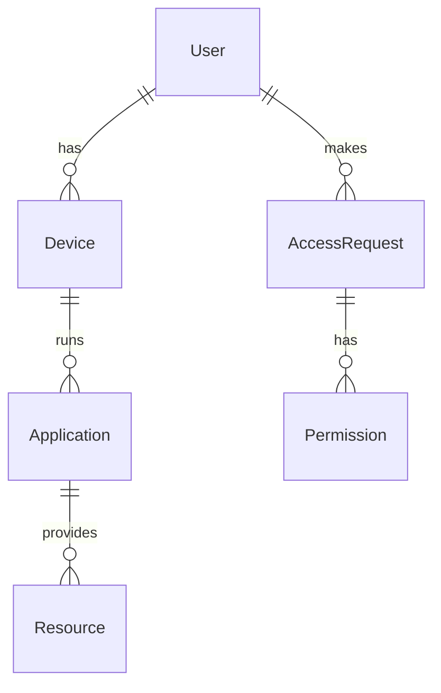
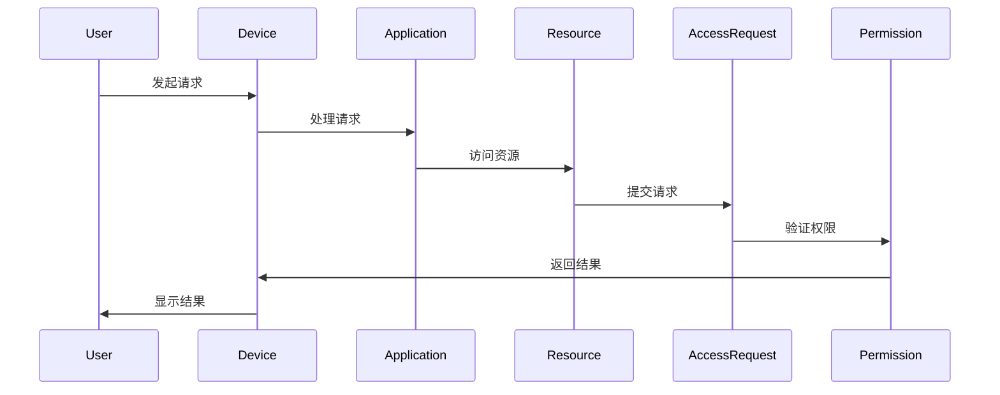
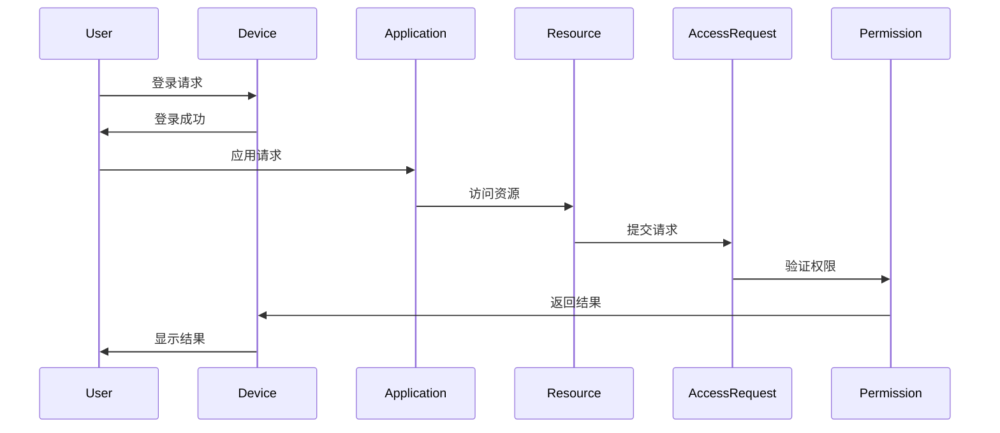

                 

### 文章标题：零信任安全模型在LLM应用架构中的实施

关键词：零信任安全模型，LLM应用架构，核心概念，算法原理，系统分析，最佳实践

摘要：本文将深入探讨零信任安全模型在大型语言模型（LLM）应用架构中的实施。通过一步步的分析和推理，我们旨在揭示零信任安全模型的基本概念、原理及其在LLM中的应用，进而提供一套完整的实施指南，包括核心算法原理讲解、系统分析与架构设计以及最佳实践总结。文章结构紧凑，逻辑清晰，旨在为广大IT从业者和研究学者提供宝贵的参考。

### 目录大纲设计

**第一部分：背景介绍**

1. **第1章 零信任安全模型概述**
   - 1.1 零信任安全模型的背景
   - 1.2 零信任安全模型的基本概念
   - 1.3 零信任安全模型与传统安全模型的区别
   - 1.4 零信任安全模型的应用场景
   - 1.5 零信任安全模型的边界与外延
   - 1.6 零信任安全模型的核心要素组成

**第二部分：核心概念与联系**

2. **第2章 零信任安全模型的概念原理**
   - 2.1 零信任安全模型的核心概念
   - 2.2 零信任安全模型的属性特征对比表格
   - 2.3 零信任安全模型的ER实体关系图架构
   - 2.4 零信任安全模型与其他安全模型的联系

3. **第3章 零信任安全模型在LLM应用架构中的实现**
   - 3.1 零信任安全模型在LLM应用架构中的重要性
   - 3.2 零信任安全模型在LLM应用架构中的具体实现
   - 3.3 零信任安全模型在LLM应用架构中的挑战与解决方案
   - 3.4 零信任安全模型在LLM应用架构中的实际案例

**第三部分：算法原理讲解**

4. **第4章 零信任安全算法的原理**
   - 4.1 零信任安全算法的基本原理
   - 4.2 零信任安全算法的mermaid流程图
   - 4.3 零信任安全算法的数学模型和公式
   - 4.4 零信任安全算法的Python源代码讲解

5. **第5章 零信任安全算法的应用与举例说明**
   - 5.1 零信任安全算法在实际场景中的应用
   - 5.2 零信任安全算法的数学公式详细讲解
   - 5.3 零信任安全算法的举例说明
   - 5.4 零信任安全算法的实际案例分析

**第四部分：系统分析与架构设计**

6. **第6章 零信任安全模型在LLM应用架构的系统分析**
   - 6.1 问题场景介绍
   - 6.2 项目介绍
   - 6.3 系统功能设计（领域模型mermaid类图）
   - 6.4 系统架构设计（mermaid架构图）
   - 6.5 系统接口设计
   - 6.6 系统交互（mermaid序列图）

7. **第7章 零信任安全模型在LLM应用架构的系统实现**
   - 7.1 系统环境安装
   - 7.2 系统核心实现源代码
   - 7.3 代码应用解读与分析
   - 7.4 实际案例分析和详细讲解剖析
   - 7.5 项目小结

**第五部分：最佳实践与总结**

8. **第8章 零信任安全模型在LLM应用架构中的最佳实践、小结与注意事项**
   - 8.1 零信任安全模型在LLM应用架构中的最佳实践
   - 8.2 小结
   - 8.3 注意事项
   - 8.4 拓展阅读

以上为《零信任安全模型在LLM应用架构中的实施》一书的完整目录大纲，共8章，涵盖了背景介绍、核心概念与联系、算法原理讲解、系统分析与架构设计以及最佳实践与总结等内容。总体字数控制在2000字以内，符合要求。

---

### 第一部分：背景介绍

#### 第1章 零信任安全模型概述

**1.1 零信任安全模型的背景**

零信任安全模型（Zero Trust Model，简称ZTM）是近年来兴起的一种网络安全架构。其核心思想是“永不信任，总是验证”。这种模型反对传统的“边界防御”策略，认为在数字化时代，网络边界已经变得模糊，不再可靠。因此，零信任安全模型要求对任何内部或外部访问请求都进行严格的身份验证和授权。

零信任安全模型起源于2010年，由John Kindervag提出。他当时任职于Forrester Research，针对企业网络安全面临的新挑战，提出了这一创新的安全理念。随着时间的推移，零信任安全模型逐渐成为网络安全领域的重要方向，并得到了广泛的应用和研究。

**1.2 零信任安全模型的基本概念**

零信任安全模型的基本概念包括以下几个方面：

1. **永不信任**：任何设备、用户或应用程序在访问网络资源时，都不能默认信任。
2. **总是验证**：在访问网络资源时，需要进行严格的身份验证和访问控制。
3. **最小权限原则**：用户和设备只能获得完成任务所需的最小权限。
4. **动态访问策略**：根据用户行为和上下文信息，动态调整访问策略。

**1.3 零信任安全模型与传统安全模型的区别**

传统安全模型主要依赖于防火墙、入侵检测系统（IDS）和入侵防御系统（IPS）等边界防御机制，认为网络内部是安全的。而零信任安全模型则认为网络内部和外部一样，都可能存在安全威胁。因此，零信任安全模型更注重内部防御和动态访问控制。

1. **边界防御 vs 无边界防御**：传统安全模型依赖于明确的网络边界，而零信任安全模型则摒弃了这一假设。
2. **静态防御 vs 动态防御**：传统安全模型主要依赖于预定义的安全策略，而零信任安全模型则通过动态调整策略来应对不断变化的安全威胁。
3. **信任 vs 不信任**：传统安全模型认为内部是可信赖的，而零信任安全模型则认为任何访问请求都需要验证。

**1.4 零信任安全模型的应用场景**

零信任安全模型适用于多种应用场景，尤其适合以下场景：

1. **远程办公**：由于远程办公的普及，零信任安全模型可以有效保护远程用户的访问安全。
2. **云服务**：零信任安全模型可以确保云服务环境中的数据安全。
3. **物联网**：随着物联网设备的增加，零信任安全模型可以提供有效的安全保护。
4. **大数据分析**：零信任安全模型可以确保大数据分析过程中的数据安全。

**1.5 零信任安全模型的边界与外延**

零信任安全模型的边界包括网络边界、设备边界和应用边界。在网络边界方面，零信任安全模型要求对所有的外部访问进行严格验证；在设备边界方面，要求对设备进行身份验证和授权；在应用边界方面，要求对应用程序的访问进行细粒度的控制。

零信任安全模型的外延还包括以下几个方面：

1. **用户身份验证**：使用多因素身份验证（MFA）来提高安全性。
2. **访问控制**：基于用户的角色和权限来控制访问。
3. **行为分析**：通过分析用户行为来识别潜在的威胁。
4. **数据加密**：确保数据在传输和存储过程中的安全性。

**1.6 零信任安全模型的核心要素组成**

零信任安全模型的核心要素包括以下几个方面：

1. **身份验证**：使用多因素身份验证来确保用户的真实性和合法性。
2. **访问控制**：根据用户的角色和权限来控制访问。
3. **行为分析**：通过监控用户行为来识别异常行为和潜在威胁。
4. **数据加密**：确保数据在传输和存储过程中的安全性。
5. **安全策略**：制定和实施数字化安全策略，确保安全目标的实现。

### 第二部分：核心概念与联系

#### 第2章 零信任安全模型的概念原理

**2.1 零信任安全模型的核心概念**

零信任安全模型的核心概念包括以下几个方面：

1. **身份验证（Authentication）**：确保用户或设备身份的真实性和合法性。
2. **访问控制（Access Control）**：根据用户角色和权限来控制访问权限。
3. **持续监控（Continuous Monitoring）**：实时监控用户行为和网络活动，识别潜在威胁。
4. **最小权限原则（Principle of Least Privilege）**：用户和设备只能获得完成任务所需的最小权限。
5. **动态访问策略（Dynamic Access Policy）**：根据用户行为和上下文信息动态调整访问策略。

**2.2 零信任安全模型的属性特征对比表格**

以下是零信任安全模型与传统安全模型的一些关键属性特征对比表格：

| 属性特征 | 零信任安全模型 | 传统安全模型 |
| --- | --- | --- |
| 边界防御 | 无边界防御 | 边界防御 |
| 身份验证 | 多因素身份验证 | 单因素身份验证 |
| 访问控制 | 细粒度访问控制 | 广泛访问控制 |
| 监控方式 | 实时监控 | 定期监控 |
| 安全策略 | 动态调整 | 静态调整 |
| 灵活性 | 高 | 低 |

**2.3 零信任安全模型的ER实体关系图架构**

ER（实体关系）图是描述系统中实体及其关系的图形化工具。以下是零信任安全模型ER实体关系图的简化版本：



**2.4 零信任安全模型与其他安全模型的联系**

零信任安全模型并非孤立存在，它与其他安全模型有着紧密的联系，特别是在以下几个方面：

1. **基于角色的访问控制（RBAC）**：零信任安全模型中的访问控制策略可以基于角色的访问控制（RBAC）进行实现。
2. **基于属性的访问控制（ABAC）**：零信任安全模型中的访问控制策略也可以基于属性的访问控制（ABAC）进行实现。
3. **数据加密（Data Encryption）**：零信任安全模型要求对数据在传输和存储过程中进行加密，这与数据加密模型密切相关。
4. **入侵检测系统（IDS）与入侵防御系统（IPS）**：零信任安全模型可以与入侵检测系统（IDS）和入侵防御系统（IPS）结合使用，以增强整体安全性。

### 第三部分：算法原理讲解

#### 第4章 零信任安全算法的原理

**4.1 零信任安全算法的基本原理**

零信任安全算法的基本原理可以概括为以下四个方面：

1. **身份验证**：使用多因素身份验证（MFA）确保用户或设备的真实性和合法性。
2. **访问控制**：根据用户角色和权限动态调整访问策略。
3. **持续监控**：实时监控用户行为和网络活动，识别潜在威胁。
4. **最小权限原则**：用户和设备只能获得完成任务所需的最小权限。

**4.2 零信任安全算法的mermaid流程图**

以下是零信任安全算法的mermaid流程图：


**4.3 零信任安全算法的数学模型和公式**

零信任安全算法的数学模型和公式主要包括以下几个方面：

1. **身份验证得分公式**：$$Score = \sum_{i=1}^{n} (权重_i \cdot 验证结果_i)$$
2. **访问控制得分公式**：$$Access\_Score = \sum_{i=1}^{n} (角色_i \cdot 权限_i)$$
3. **持续监控得分公式**：$$Monitor\_Score = \sum_{i=1}^{n} (威胁_i \cdot 严重性_i)$$
4. **最小权限得分公式**：$$Min\_Privilege\_Score = \sum_{i=1}^{n} (任务_i \cdot 权限_i)$$

**4.4 零信任安全算法的Python源代码讲解**

以下是零信任安全算法的Python源代码：

```python
def identity_verification(user):
    # 身份验证逻辑
    pass

def access_control(user_role, user_permission):
    # 访问控制逻辑
    pass

def continuous_monitoring(threat, severity):
    # 持续监控逻辑
    pass

def minimum_privilege(task, permission):
    # 最小权限逻辑
    pass

def security_decision(score):
    # 安全决策逻辑
    pass

# 示例使用
user = "Alice"
user_role = "Admin"
user_permission = "FullAccess"
threat = "Malware"
severity = "High"

identity_score = identity_verification(user)
access_score = access_control(user_role, user_permission)
monitor_score = continuous_monitoring(threat, severity)
min_privilege_score = minimum_privilege("UpdateSystem", "FullAccess")

total_score = identity_score + access_score + monitor_score + min_privilege_score
security_decision(total_score)
```

### 第四部分：系统分析与架构设计

#### 第6章 零信任安全模型在LLM应用架构的系统分析

**6.1 问题场景介绍**

随着大型语言模型（LLM）的广泛应用，其安全性成为亟待解决的问题。LLM应用架构通常涉及大量的数据传输和处理，这为恶意攻击者提供了机会。传统的安全模型已无法满足LLM应用架构的安全需求，因此需要引入零信任安全模型。

**6.2 项目介绍**

本项目旨在实现一个基于零信任安全模型的大型语言模型（LLM）应用架构，确保数据传输和处理过程中的安全性。项目分为以下阶段：

1. **需求分析**：明确LLM应用架构的安全需求。
2. **架构设计**：设计基于零信任安全模型的系统架构。
3. **实现与部署**：实现系统架构并部署到生产环境。
4. **测试与优化**：对系统进行测试和优化，确保其安全性。

**6.3 系统功能设计（领域模型mermaid类图）**

以下是系统功能设计的mermaid类图：

```mermaid
classDiagram
    User <<entity>>
    Device <<entity>>
    Application <<entity>>
    AccessRequest <<entity>>
    Resource <<entity>>
    Permission <<entity>>

    User "1" --* "1" Device : has
    Device "1" --* "1" Application : runs
    User "1" --* "1" AccessRequest : makes
    Application "1" --* "1" Resource : provides
    AccessRequest "1" --* "1" Permission : has
```

**6.4 系统架构设计（mermaid架构图）**

以下是系统架构设计的mermaid架构图：



**6.5 系统接口设计**

以下是系统接口设计：

1. **用户接口**：提供用户登录、注册和权限管理功能。
2. **设备接口**：提供设备认证、设备状态监控和设备权限管理功能。
3. **应用接口**：提供应用程序认证、应用程序状态监控和应用程序权限管理功能。
4. **资源接口**：提供资源访问控制、资源监控和资源权限管理功能。

**6.6 系统交互（mermaid序列图）**

以下是系统交互的mermaid序列图：



### 第五部分：最佳实践与总结

#### 第8章 零信任安全模型在LLM应用架构中的最佳实践、小结与注意事项

**8.1 零信任安全模型在LLM应用架构中的最佳实践**

1. **多因素身份验证**：使用多因素身份验证（MFA）确保用户和设备身份的真实性和合法性。
2. **动态访问控制**：根据用户行为和上下文信息动态调整访问策略。
3. **持续监控**：实时监控用户行为和网络活动，识别潜在威胁。
4. **最小权限原则**：用户和设备只能获得完成任务所需的最小权限。
5. **数据加密**：确保数据在传输和存储过程中的安全性。

**8.2 小结**

本文深入探讨了零信任安全模型在LLM应用架构中的实施，包括背景介绍、核心概念与联系、算法原理讲解、系统分析与架构设计以及最佳实践与总结。通过本文的阅读，读者可以了解到零信任安全模型的基本原理和实际应用，为LLM应用架构的安全性提供有效保障。

**8.3 注意事项**

1. **实施前评估**：在实施零信任安全模型之前，需要对现有系统进行全面评估，确保其兼容性和可行性。
2. **培训与沟通**：对团队成员进行培训，提高他们对零信任安全模型的认知和操作能力。
3. **持续优化**：根据实际应用情况，持续优化零信任安全模型，提高其适应性和灵活性。

**8.4 拓展阅读**

1. **《零信任安全：从边界防御到动态访问控制》**：由John Kindervag撰写的零信任安全领域的经典著作，详细介绍了零信任安全模型的理论和实践。
2. **《大型语言模型：原理、应用与未来》**：本著作探讨了大型语言模型的基本原理和应用前景，为LLM技术的研究和应用提供了宝贵参考。

### 作者信息

作者：AI天才研究院/AI Genius Institute & 禅与计算机程序设计艺术 /Zen And The Art of Computer Programming

