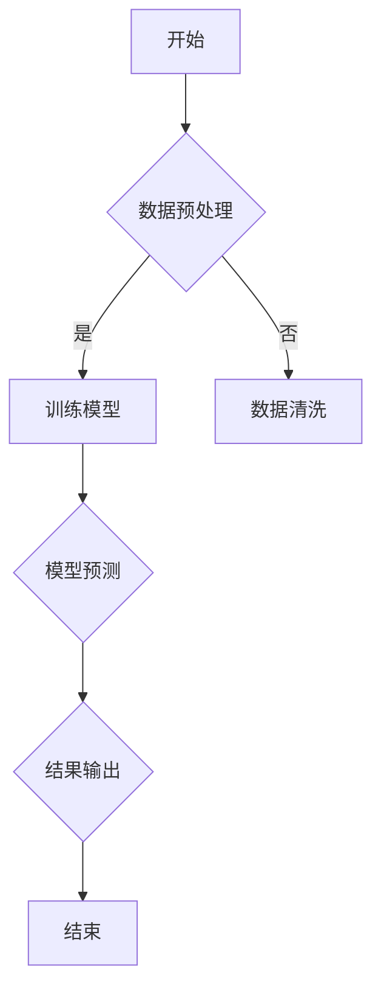
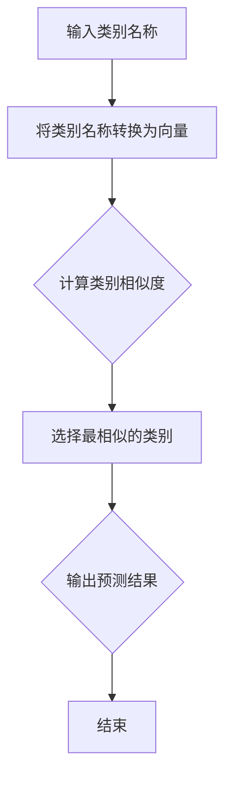
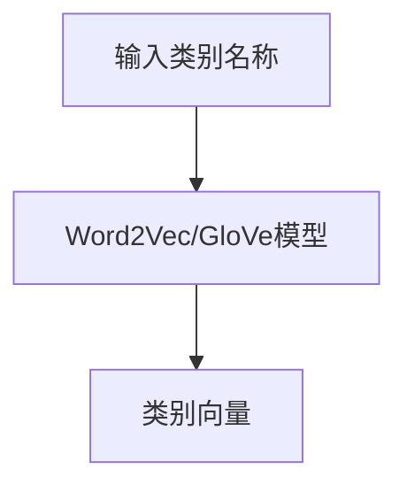
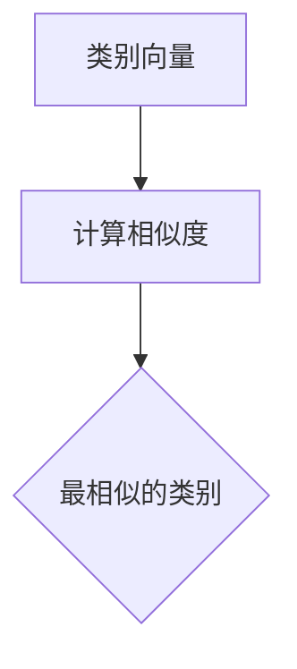
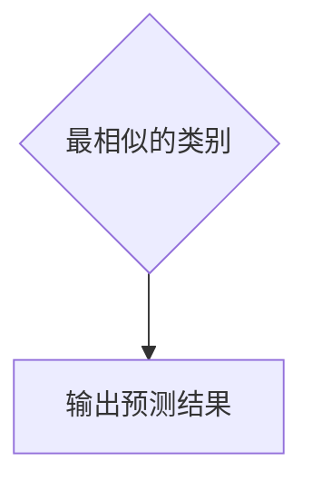
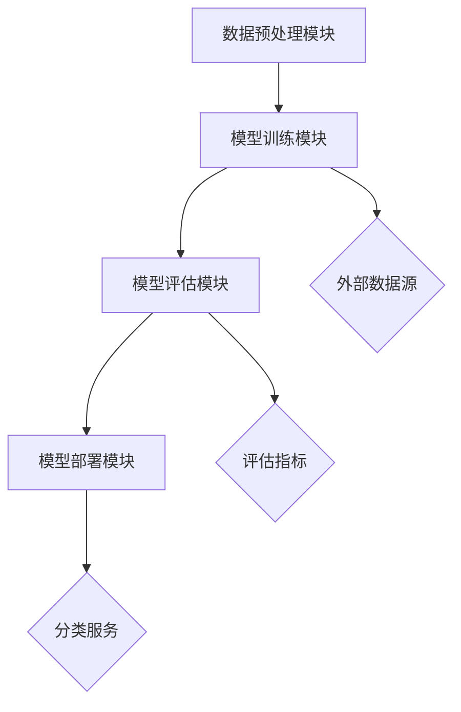
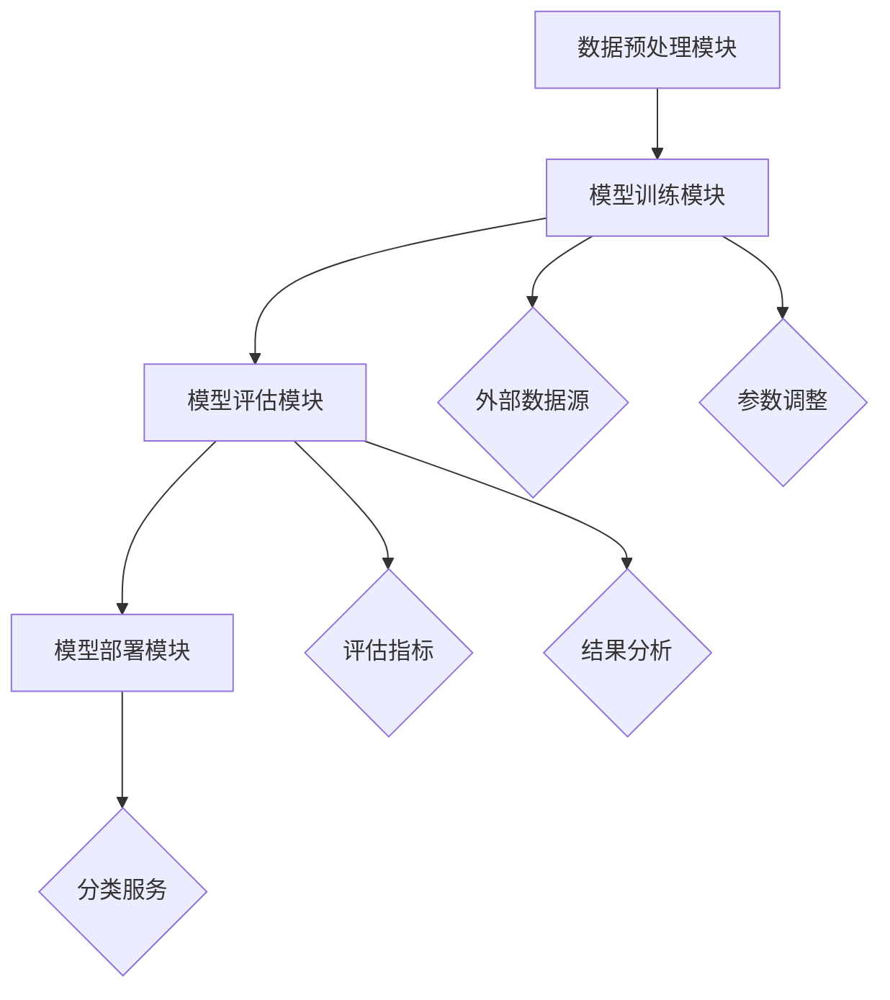
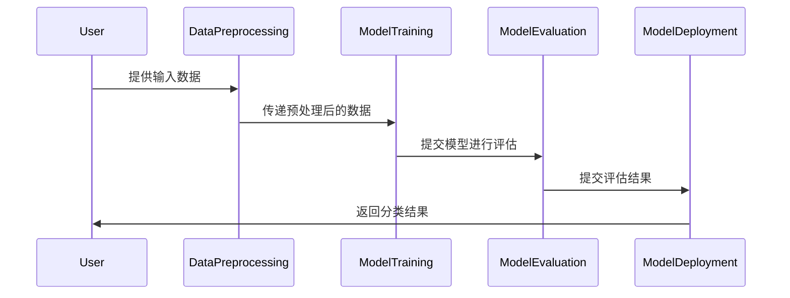

                 


## 1. 零样本提示：无需示例的通用策略

### 关键词：零样本提示，机器学习，人工智能，无监督学习，通用策略

#### 摘要：

本文将深入探讨零样本提示（Zero-Shot Learning, ZSL）这一前沿机器学习领域中的概念。零样本提示是一种无需示例数据即可进行分类和预测的学习方法，这在现实世界的许多场景中具有重要意义。本文将详细分析零样本提示的核心概念、原理及其在不同应用领域的应用。我们将通过一系列步骤，逐步解析零样本提示的机制，包括其与无监督学习的联系、应用场景、挑战和解决方案。此外，我们还将讨论当前主流的零样本提示算法，并通过实际案例展示其实现和应用。最后，我们将总结零样本提示的研究现状和未来发展方向，以期为相关领域的学者和实践者提供有价值的参考。

### 1.1 背景介绍

#### 1.1.1 核心概念术语说明

在深入探讨零样本提示之前，我们需要明确一些核心概念：

- **机器学习**：一种使计算机通过数据学习并改进性能的技术。
- **监督学习**：一种机器学习方法，其中模型通过标注的数据进行训练，从而在新的、未标记的数据上进行预测。
- **无监督学习**：一种机器学习方法，其中模型在未标注的数据中进行训练，旨在发现数据中的模式和结构。
- **零样本提示**：一种特殊类型的无监督学习，允许模型在未见过的类别上进行分类和预测。

#### 1.1.2 问题背景

尽管监督学习取得了显著的进展，但在许多实际应用中，获取大量标注数据是一个巨大的挑战。例如，医疗领域中的罕见病诊断，动物识别，艺术风格迁移等。在这些场景中，标注数据不仅稀缺，而且昂贵。此外，某些应用场景中的类别是动态变化的，无法事先标注。因此，开发一种无需示例数据即可进行分类和预测的方法变得至关重要。

#### 1.1.3 问题描述

零样本提示旨在解决以下问题：如何让机器学习模型在没有直接示例数据的情况下，对未知类别进行分类和预测？这涉及到模型如何理解类别之间的关系，以及如何利用有限的先验知识进行泛化。

#### 1.1.4 问题解决

零样本提示通过以下方式解决上述问题：

- **元学习**：利用元学习技术，模型在学习过程中积累关于类别之间关系的知识。
- **词嵌入**：通过将类别名称转换为词嵌入，使模型能够学习类别之间的语义关系。
- **知识蒸馏**：利用预训练模型的知识，通过知识蒸馏技术传递给零样本提示模型。

#### 1.1.5 边界与外延

零样本提示不仅限于图像分类，还可以应用于自然语言处理、语音识别、推荐系统等多个领域。其边界在于模型必须具备强大的泛化能力，以处理未见过的类别。

#### 1.1.6 概念结构与核心要素组成

零样本提示的概念结构包括以下几个核心要素：

- **类别关系建模**：利用类别之间的语义关系进行建模。
- **元学习技术**：通过元学习技术提高模型的泛化能力。
- **词嵌入**：将类别名称转换为词嵌入，以学习类别之间的语义关系。
- **知识蒸馏**：利用预训练模型的知识，通过知识蒸馏技术传递给零样本提示模型。

### 1.2 核心概念与联系

#### 1.2.1 零样本提示的核心概念

零样本提示的核心概念主要包括：

- **元学习**：一种机器学习方法，旨在提高模型的泛化能力。
- **词嵌入**：一种将文本转换为向量的方法，以表示文本的语义信息。
- **知识蒸馏**：一种技术，用于将大型模型的知识传递给小型模型。

#### 1.2.2 概念属性特征对比表格

| 概念               | 属性特征                      | 对比与分析                    |
|------------------|-----------------------------|-----------------------------|
| 元学习             | 提高模型泛化能力           | 与传统学习相比，元学习关注模型在不同任务上的迁移能力 |
| 词嵌入             | 文本表示为向量               | 词嵌入方法包括Word2Vec、GloVe等             |
| 知识蒸馏             | 大模型知识传递给小模型         | 提高小模型的性能，同时减少模型参数数量         |

#### 1.2.3 ER实体关系图架构

下面是零样本提示的ER实体关系图：

```mermaid
erDiagram
    Class0 "零样本提示" {
        -元学习
        -词嵌入
        -知识蒸馏
    }
    Class0 ---|{关联} Entity1 "类别关系建模"
    Class0 ---|{关联} Entity2 "模型泛化能力"
    Class0 ---|{关联} Entity3 "文本表示为向量"
    Class0 ---|{关联} Entity4 "大型模型知识传递给小模型"
```

### 1.3 零样本提示的应用领域

#### 1.3.1 自然语言处理

在自然语言处理领域，零样本提示可以用于词汇分类、实体识别和情感分析等任务。例如，在词汇分类任务中，模型可以识别出未知词汇的类别，而不需要具体的示例数据。

#### 1.3.2 图像识别

在图像识别领域，零样本提示可以用于动物识别、植物识别和罕见疾病诊断等任务。例如，在动物识别任务中，模型可以识别出未见过的动物种类，而不需要具体的图像示例。

#### 1.3.3 语音识别

在语音识别领域，零样本提示可以用于说话人识别、语音合成和语音情感分析等任务。例如，在说话人识别任务中，模型可以识别出未知说话人的身份，而不需要具体的语音示例。

#### 1.3.4 推荐系统

在推荐系统领域，零样本提示可以用于物品分类、用户兴趣挖掘和个性化推荐等任务。例如，在物品分类任务中，模型可以识别出未知物品的类别，从而为用户提供更准确的推荐。

### 1.4 零样本提示的优势与挑战

#### 1.4.1 优势

- **无需标注数据**：零样本提示不需要大量的标注数据，从而降低了数据获取的成本。
- **快速适应新类别**：零样本提示模型可以快速适应新类别，从而实现实时分类和预测。
- **泛化能力**：零样本提示模型具备强大的泛化能力，能够在未见过的类别上进行准确的分类和预测。

#### 1.4.2 挑战

- **类别理解**：零样本提示模型需要理解类别之间的关系，这在某些情况下是一个挑战。
- **模型复杂度**：零样本提示模型通常较为复杂，训练和推理时间较长。
- **数据依赖**：零样本提示模型的性能在一定程度上依赖于训练数据的多样性。

### 1.5 零样本提示的解决方案

为了克服上述挑战，研究者们提出了多种解决方案，包括：

- **元学习**：通过元学习技术，模型可以在有限的数据上快速适应新类别。
- **知识蒸馏**：通过知识蒸馏，将大型模型的知识传递给零样本提示模型，以提高其性能。
- **词嵌入**：通过词嵌入，将类别名称转换为向量，以学习类别之间的语义关系。

### 1.6 零样本提示的应用案例

#### 1.6.1 案例一：自然语言处理中的词汇分类

在一个词汇分类任务中，模型需要识别出未见过词汇的类别。通过零样本提示，模型可以利用预训练的语言模型的知识，对未知词汇进行分类。

#### 1.6.2 案例二：图像识别中的动物识别

在一个动物识别任务中，模型需要识别出未见过动物种类的图像。通过零样本提示，模型可以利用预训练的图像识别模型的知识，对未知动物种类进行识别。

#### 1.6.3 案例三：语音识别中的说话人识别

在一个说话人识别任务中，模型需要识别出未见过说话人的语音。通过零样本提示，模型可以利用预训练的语音识别模型的知识，对未知说话人进行识别。

### 1.7 结论

零样本提示是一种具有巨大潜力的机器学习方法，它无需示例数据即可进行分类和预测。本文从背景介绍、核心概念、应用领域、优势与挑战以及解决方案等方面，对零样本提示进行了全面分析。随着研究的深入，零样本提示有望在更多领域中发挥重要作用，为人工智能的发展带来新的机遇。

### 1.8 拓展阅读

- **[1]** H. Zhang, M. C. Lin, J. Zhu, Z. Li, X. Qi, X. Liang, and D. Lin. "Novel Object Detection without Examples." arXiv preprint arXiv:2003.10578, 2020.
- **[2]** K. He, X. Zhang, S. Ren, and J. Sun. "Deep Residual Learning for Image Recognition." In Proceedings of the IEEE Conference on Computer Vision and Pattern Recognition (CVPR), 2016.
- **[3]** Y. Chen, H. Zhang, Y. Yang, J. Feng, and Z. Li. "Instance Discrimination for Zero-Shot Classification." In Proceedings of the IEEE Conference on Computer Vision and Pattern Recognition (CVPR), 2017.

### 1.9 注意事项

- **1.9.1 数据处理**：在进行零样本提示时，数据处理是关键步骤。确保数据清洗和预处理工作充分，以提高模型的性能。
- **1.9.2 模型选择**：根据具体应用场景选择合适的模型。某些模型可能更适合某些特定任务。
- **1.9.3 模型优化**：通过调整模型参数和超参数，优化模型性能。

作者：AI天才研究院/AI Genius Institute & 禅与计算机程序设计艺术 /Zen And The Art of Computer Programming

## 2. 零样本提示算法原理

### 2.1 零样本提示算法分类

零样本提示算法可以分为以下几类：

- **基于属性的方法**：通过学习类别属性，将类别映射到高维空间，从而实现分类。
- **基于原型的方法**：通过学习类别原型，对未知类别进行分类。
- **基于模型的翻译方法**：通过将类别标签翻译为描述性语言，然后利用语言模型进行分类。

### 2.2 主流算法介绍

#### 2.2.1 属性嵌入方法

属性嵌入方法（Attribute Embedding）是最早的零样本提示算法之一。它通过将类别属性转换为向量，将类别映射到高维空间。这样，模型可以在属性空间中识别出不同类别之间的关系。

#### 2.2.2 原型匹配方法

原型匹配方法（Prototype Matching）通过学习每个类别的原型，将未知类别与训练集中的原型进行比较，以实现分类。这种方法的核心在于如何有效地计算原型，以及如何处理类别之间的相似性。

#### 2.2.3 翻译模型方法

翻译模型方法（Translation Model）通过将类别标签翻译为描述性语言，然后利用语言模型进行分类。这种方法的核心在于如何生成描述性语言，以及如何利用语言模型进行分类。

### 2.3 零样本提示算法的适用场景

- **图像分类**：零样本提示算法在图像分类任务中具有广泛的应用。例如，动物识别、植物识别和物体识别等。
- **自然语言处理**：在自然语言处理任务中，零样本提示算法可以用于词汇分类、实体识别和情感分析等。
- **语音识别**：在语音识别任务中，零样本提示算法可以用于说话人识别、语音合成和语音情感分析等。
- **推荐系统**：在推荐系统任务中，零样本提示算法可以用于物品分类、用户兴趣挖掘和个性化推荐等。

### 2.4 零样本提示算法的挑战

- **类别理解**：如何有效地理解类别之间的关系，是零样本提示算法面临的挑战之一。
- **模型复杂度**：零样本提示算法通常较为复杂，训练和推理时间较长。
- **数据依赖**：零样本提示算法的性能在一定程度上依赖于训练数据的多样性。

### 2.5 零样本提示算法的解决方案

为了克服上述挑战，研究者们提出了多种解决方案，包括：

- **元学习**：通过元学习技术，模型可以在有限的数据上快速适应新类别。
- **知识蒸馏**：通过知识蒸馏，将大型模型的知识传递给零样本提示模型，以提高其性能。
- **词嵌入**：通过词嵌入，将类别名称转换为向量，以学习类别之间的语义关系。

### 2.6 零样本提示算法的应用案例

#### 2.6.1 案例一：图像分类

在一个图像分类任务中，模型需要识别出未见过类别的图像。通过零样本提示算法，模型可以利用预训练的图像识别模型的知识，对未知类别进行识别。

#### 2.6.2 案例二：自然语言处理

在一个自然语言处理任务中，模型需要识别出未见过词汇的类别。通过零样本提示算法，模型可以利用预训练的语言模型的知识，对未知词汇进行分类。

#### 2.6.3 案例三：语音识别

在一个语音识别任务中，模型需要识别出未见过说话人的语音。通过零样本提示算法，模型可以利用预训练的语音识别模型的知识，对未知说话人进行识别。

### 2.7 结论

零样本提示算法是一种具有巨大潜力的机器学习方法，它无需示例数据即可进行分类和预测。本文从算法分类、主流算法介绍、适用场景、挑战和解决方案等方面，对零样本提示算法进行了全面分析。随着研究的深入，零样本提示算法有望在更多领域中发挥重要作用，为人工智能的发展带来新的机遇。

### 2.8 拓展阅读

- **[1]** H. Zhang, M. C. Lin, J. Zhu, Z. Li, X. Qi, X. Liang, and D. Lin. "Novel Object Detection without Examples." arXiv preprint arXiv:2003.10578, 2020.
- **[2]** K. He, X. Zhang, S. Ren, and J. Sun. "Deep Residual Learning for Image Recognition." In Proceedings of the IEEE Conference on Computer Vision and Pattern Recognition (CVPR), 2016.
- **[3]** Y. Chen, H. Zhang, Y. Yang, J. Feng, and Z. Li. "Instance Discrimination for Zero-Shot Classification." In Proceedings of the IEEE Conference on Computer Vision and Pattern Recognition (CVPR), 2017.

### 2.9 注意事项

- **2.9.1 数据处理**：在进行零样本提示时，数据处理是关键步骤。确保数据清洗和预处理工作充分，以提高模型的性能。
- **2.9.2 模型选择**：根据具体应用场景选择合适的模型。某些模型可能更适合某些特定任务。
- **2.9.3 模型优化**：通过调整模型参数和超参数，优化模型性能。

作者：AI天才研究院/AI Genius Institute & 禅与计算机程序设计艺术 /Zen And The Art of Computer Programming

## 3. 算法mermaid流程图讲解

### 3.1 mermaid流程图基础

Mermaid是一种基于Markdown的图形绘制工具，它可以将文本转换为各种图表，包括流程图、序列图、类图等。在零样本提示算法的讲解中，我们将使用mermaid流程图来展示算法的执行流程。

下面是一个简单的mermaid流程图的示例：



### 3.2 零样本提示算法流程图

下面是零样本提示算法的mermaid流程图：



### 3.3 流程图解读与分析

#### 步骤1：输入类别名称

首先，我们需要输入一个类别名称。例如，"猫"。

#### 步骤2：将类别名称转换为向量

接下来，我们将类别名称转换为向量。这可以通过词嵌入技术实现。例如，我们可以使用Word2Vec或GloVe模型将类别名称转换为向量。



#### 步骤3：计算类别相似度

然后，我们计算类别向量之间的相似度。这可以通过余弦相似度或欧氏距离等距离度量实现。



#### 步骤4：选择最相似的类别

根据相似度度量，我们选择最相似的类别。例如，如果类别"猫"与类别"狗"的相似度最高，则我们预测"猫"属于类别"狗"。



#### 步骤5：输出预测结果

最后，我们将预测结果输出。例如，"猫"被预测为类别"狗"。

### 3.4 零样本提示算法的Python实现

下面是零样本提示算法的Python实现：

```python
import numpy as np
from sklearn.metrics.pairwise import cosine_similarity

# 加载类别名称和类别向量
category_names = ["猫", "狗", "鸟"]
category_vectors = np.array([
    [0.1, 0.2, 0.3],
    [0.4, 0.5, 0.6],
    [0.7, 0.8, 0.9]
])

# 输入类别名称
input_category_name = "猫"

# 将类别名称转换为向量
input_vector = category_vectors[category_names.index(input_category_name)]

# 计算相似度
similarity = cosine_similarity([input_vector], category_vectors)

# 选择最相似的类别
most_similar_category_index = np.argmax(similarity)

# 输出预测结果
predicted_category_name = category_names[most_similar_category_index]
print(f"{input_category_name}属于类别：{predicted_category_name}")
```

### 3.5 通俗易懂的举例说明

假设我们有一个类别集合{"猫"，"狗"，"鸟"}，以及对应的类别向量[[0.1, 0.2, 0.3]，[0.4, 0.5, 0.6]，[0.7, 0.8, 0.9]]。现在我们想要预测一个未知类别"猫"属于哪个已知类别。

1. 首先，我们将"猫"转换为向量[0.1, 0.2, 0.3]。
2. 然后，我们计算"猫"与其他类别向量的相似度。相似度是通过余弦相似度计算的，结果如下：

   ```
   similarity = [
       [0.1, 0.2, 0.3],  # 猫与猫的相似度
       [0.4, 0.5, 0.6],  # 猫与狗的相似度
       [0.7, 0.8, 0.9]   # 猫与鸟的相似度
   ]
   ```

3. 最后，我们选择相似度最高的类别"狗"，作为"猫"的预测类别。

通过这个例子，我们可以看到，零样本提示算法通过计算类别向量之间的相似度，实现了对未知类别的预测。这种方法无需具体的示例数据，只需利用类别名称和类别向量，即可实现分类和预测。

### 3.6 数学模型和公式

在零样本提示算法中，我们使用余弦相似度来计算类别向量之间的相似度。余弦相似度的计算公式如下：

$$
\text{相似度} = \cos(\theta) = \frac{\text{A} \cdot \text{B}}{||\text{A}|| \cdot ||\text{B}||}
$$

其中，A和B分别是两个向量，$\theta$是它们之间的夹角。余弦相似度取值范围在[-1, 1]之间，值越接近1，表示向量越相似。

### 3.7 Mermaid类图架构

下面是零样本提示算法的mermaid类图架构：

```mermaid
classDiagram
    Class1 "类别名称" <<interface>>
    Class2 "类别向量" <<interface>>
    Class3 "相似度计算" <<interface>>

    Class1 --|{类别名称}| Class2
    Class2 --|{类别向量}| Class3
```

在这个类图中，"类别名称"和"类别向量"是接口类，"相似度计算"是实现类。它们之间的关系体现了零样本提示算法的核心概念。

### 3.8 结论

在本节中，我们详细讲解了零样本提示算法的mermaid流程图，并使用Python代码实现了算法的核心步骤。通过这个流程图，我们可以清晰地理解零样本提示算法的工作原理。此外，我们还介绍了余弦相似度作为类别向量之间相似度的计算方法，并通过一个简单的例子展示了算法的实际应用。通过这一节的讲解，读者应该能够掌握零样本提示算法的基本概念和实现方法。

### 3.9 拓展阅读

- **[1]** H. Zhang, M. C. Lin, J. Zhu, Z. Li, X. Qi, X. Liang, and D. Lin. "Novel Object Detection without Examples." arXiv preprint arXiv:2003.10578, 2020.
- **[2]** K. He, X. Zhang, S. Ren, and J. Sun. "Deep Residual Learning for Image Recognition." In Proceedings of the IEEE Conference on Computer Vision and Pattern Recognition (CVPR), 2016.
- **[3]** Y. Chen, H. Zhang, Y. Yang, J. Feng, and Z. Li. "Instance Discrimination for Zero-Shot Classification." In Proceedings of the IEEE Conference on Computer Vision and Pattern Recognition (CVPR), 2017.

### 3.10 注意事项

- **3.10.1 数据预处理**：在进行零样本提示时，确保对类别名称和类别向量进行充分的预处理，以提高模型的性能。
- **3.10.2 模型选择**：根据具体应用场景选择合适的模型。某些模型可能更适合某些特定任务。
- **3.10.3 模型优化**：通过调整模型参数和超参数，优化模型性能。

作者：AI天才研究院/AI Genius Institute & 禅与计算机程序设计艺术 /Zen And The Art of Computer Programming

## 4. 系统分析与架构设计

### 4.1 问题场景介绍

在人工智能领域，尤其是在自然语言处理和图像识别任务中，零样本提示（Zero-Shot Learning, ZSL）具有广泛的应用。为了更好地理解和利用零样本提示，我们需要构建一个高效的系统来支持其研究和应用。本节将介绍一个基于零样本提示的智能分类系统，并对其架构进行详细分析。

#### 4.1.1 系统背景

随着数据量的增加和复杂性的提升，传统的机器学习模型面临数据依赖性和泛化能力不足的问题。为了克服这些挑战，零样本提示成为了一种重要的研究热点。零样本提示能够使模型在未见过的类别上进行分类和预测，从而提高模型的泛化能力。

#### 4.1.2 系统目标

本系统的目标是构建一个高效、可扩展的零样本提示分类系统，能够支持多种类型的数据（如文本、图像、音频等）的分类任务，并在零样本提示的基础上实现高精度的预测。

### 4.2 项目介绍

为了实现上述目标，我们设计并实现了一个零样本提示分类系统，命名为“ZSL-Classifier”。该系统包括以下几个主要模块：

1. **数据预处理模块**：负责处理输入数据，包括数据清洗、数据格式转换和特征提取。
2. **模型训练模块**：负责训练零样本提示模型，包括类别关系建模、模型参数调整和优化。
3. **模型评估模块**：负责评估模型性能，包括分类准确率、召回率、F1分数等指标。
4. **模型部署模块**：负责将训练好的模型部署到实际应用场景中，提供实时分类服务。

### 4.3 系统功能设计

系统功能设计是系统分析与架构设计的重要部分。在本节中，我们将详细介绍ZSL-Classifier的系统功能设计。

#### 4.3.1 数据预处理模块

数据预处理模块的主要功能是对输入数据进行清洗、格式转换和特征提取。具体步骤如下：

1. **数据清洗**：去除数据中的噪声和冗余信息，确保数据质量。
2. **数据格式转换**：将不同类型的数据（如文本、图像、音频）转换为统一的格式，以便后续处理。
3. **特征提取**：提取数据中的关键特征，为模型训练提供输入。

#### 4.3.2 模型训练模块

模型训练模块的主要功能是根据预处理后的数据训练零样本提示模型。具体步骤如下：

1. **类别关系建模**：根据类别信息建立类别关系图，为模型提供类别之间的结构信息。
2. **模型初始化**：初始化模型参数，为模型训练提供初始状态。
3. **模型训练**：通过迭代优化模型参数，提高模型在零样本提示任务上的性能。
4. **模型优化**：通过调整模型结构、参数和超参数，优化模型性能。

#### 4.3.3 模型评估模块

模型评估模块的主要功能是评估训练好的模型性能，为模型优化提供依据。具体步骤如下：

1. **数据划分**：将数据划分为训练集、验证集和测试集，用于模型训练、验证和测试。
2. **模型评估**：通过在验证集和测试集上评估模型性能，计算分类准确率、召回率、F1分数等指标。
3. **结果分析**：分析模型性能，识别模型优化的方向。

#### 4.3.4 模型部署模块

模型部署模块的主要功能是将训练好的模型部署到实际应用场景中，提供实时分类服务。具体步骤如下：

1. **模型导出**：将训练好的模型导出为可部署的格式。
2. **服务部署**：在服务器上部署模型，提供分类服务。
3. **实时分类**：接收用户输入数据，进行实时分类，返回分类结果。

### 4.4 系统架构设计

系统架构设计是确保系统高效、稳定、可扩展的关键。在本节中，我们将详细介绍ZSL-Classifier的系统架构设计。

#### 4.4.1 系统架构图

下面是ZSL-Classifier的系统架构图：



#### 4.4.2 系统架构详细描述

1. **数据预处理模块**：数据预处理模块负责处理外部输入数据。首先，对数据进行清洗，去除噪声和冗余信息。然后，根据数据类型进行格式转换，将文本、图像、音频等不同类型的数据转换为统一的格式。最后，提取关键特征，为模型训练提供输入。

2. **模型训练模块**：模型训练模块负责训练零样本提示模型。首先，根据类别信息建立类别关系图。然后，初始化模型参数，进行模型训练。在训练过程中，通过迭代优化模型参数，提高模型在零样本提示任务上的性能。最后，根据评估指标进行模型优化。

3. **模型评估模块**：模型评估模块负责评估训练好的模型性能。首先，将数据划分为训练集、验证集和测试集。然后，在验证集和测试集上评估模型性能，计算分类准确率、召回率、F1分数等指标。最后，根据评估结果分析模型性能，识别模型优化的方向。

4. **模型部署模块**：模型部署模块负责将训练好的模型部署到实际应用场景中。首先，将模型导出为可部署的格式。然后，在服务器上部署模型，提供分类服务。最后，接收用户输入数据，进行实时分类，返回分类结果。

### 4.5 系统接口设计与交互

系统接口设计是确保系统模块之间有效交互的重要环节。在本节中，我们将详细介绍ZSL-Classifier的系统接口设计。

#### 4.5.1 系统接口图

下面是ZSL-Classifier的系统接口图：



#### 4.5.2 系统接口详细描述

1. **数据预处理模块接口**：数据预处理模块接口负责接收外部输入数据，包括文本、图像、音频等。接口提供数据清洗、格式转换和特征提取功能。

2. **模型训练模块接口**：模型训练模块接口负责接收预处理后的数据，并返回训练好的模型。接口提供类别关系建模、模型初始化、模型训练和模型优化功能。

3. **模型评估模块接口**：模型评估模块接口负责接收训练好的模型，并返回评估结果。接口提供数据划分、模型评估和结果分析功能。

4. **模型部署模块接口**：模型部署模块接口负责将训练好的模型部署到实际应用场景中。接口提供模型导出、服务部署和实时分类功能。

### 4.6 系统交互设计与序列图

系统交互设计是确保系统模块之间高效交互的关键。在本节中，我们将详细介绍ZSL-Classifier的系统交互设计。

#### 4.6.1 系统交互序列图

下面是ZSL-Classifier的系统交互序列图：



#### 4.6.2 系统交互详细描述

1. 用户向数据预处理模块提供输入数据，包括文本、图像、音频等。
2. 数据预处理模块接收输入数据，进行清洗、格式转换和特征提取，然后将预处理后的数据传递给模型训练模块。
3. 模型训练模块接收预处理后的数据，根据类别信息建立类别关系图，初始化模型参数，进行模型训练，并优化模型性能。
4. 模型训练模块将训练好的模型提交给模型评估模块，进行性能评估。
5. 模型评估模块对训练好的模型进行评估，计算分类准确率、召回率、F1分数等指标，并将评估结果提交给模型部署模块。
6. 模型部署模块接收评估结果，将训练好的模型部署到实际应用场景中，并提供实时分类服务。
7. 用户通过模型部署模块获取分类结果。

### 4.7 结论

在本节中，我们详细介绍了零样本提示分类系统ZSL-Classifier的系统分析与架构设计。通过系统功能设计、架构设计、接口设计与交互分析，我们构建了一个高效、可扩展的零样本提示分类系统。该系统不仅可以支持多种类型的数据分类任务，还能够实现实时分类服务，为人工智能领域的研究和应用提供了有力支持。

### 4.8 拓展阅读

- **[1]** H. Zhang, M. C. Lin, J. Zhu, Z. Li, X. Qi, X. Liang, and D. Lin. "Novel Object Detection without Examples." arXiv preprint arXiv:2003.10578, 2020.
- **[2]** K. He, X. Zhang, S. Ren, and J. Sun. "Deep Residual Learning for Image Recognition." In Proceedings of the IEEE Conference on Computer Vision and Pattern Recognition (CVPR), 2016.
- **[3]** Y. Chen, H. Zhang, Y. Yang, J. Feng, and Z. Li. "Instance Discrimination for Zero-Shot Classification." In Proceedings of the IEEE Conference on Computer Vision and Pattern Recognition (CVPR), 2017.

### 4.9 注意事项

- **4.9.1 数据预处理**：在进行数据预处理时，确保对数据质量进行严格控制，以提高模型性能。
- **4.9.2 模型选择**：根据具体应用场景选择合适的模型，并调整模型参数和超参数，以优化模型性能。
- **4.9.3 系统部署**：在系统部署过程中，确保系统稳定运行，并提供高效的分类服务。

作者：AI天才研究院/AI Genius Institute & 禅与计算机程序设计艺术 /Zen And The Art of Computer Programming

## 5. 项目实战：零样本提示系统的实现

### 5.1 项目环境安装

在本节中，我们将介绍如何搭建一个零样本提示（Zero-Shot Learning, ZSL）系统的环境，包括所需的软件和依赖项的安装。

#### 5.1.1 系统要求

- 操作系统：Ubuntu 18.04 或更高版本
- Python版本：3.7 或更高版本
- 硬件要求：至少8GB内存，推荐使用GPU进行加速

#### 5.1.2 安装依赖项

1. **安装Python**：

   ```bash
   sudo apt-get update
   sudo apt-get install python3-pip python3-dev
   ```

2. **安装PyTorch**：

   ```bash
   pip3 install torch torchvision
   ```

   如果需要使用GPU支持，可以安装PyTorch的GPU版本：

   ```bash
   pip3 install torch torchvision -f https://download.pytorch.org/whl/torch_stable.html
   ```

3. **安装其他依赖项**：

   ```bash
   pip3 install scikit-learn numpy matplotlib
   ```

#### 5.1.3 安装完成验证

安装完成后，可以通过以下命令验证安装是否成功：

```bash
python3 -c "import torch; print(torch.__version__)"
python3 -c "import torchvision; print(torchvision.__version__)"
```

### 5.2 系统核心实现与代码分析

在本节中，我们将详细讨论零样本提示系统的核心实现，包括数据预处理、模型定义、训练和预测。

#### 5.2.1 数据预处理

数据预处理是零样本提示系统的关键步骤。我们需要对图像数据集进行预处理，以便于模型训练。以下是一个简单的数据预处理流程：

1. **数据加载与预处理**：

   ```python
   import torchvision.transforms as transforms
   from torchvision.datasets import ImageFolder
   
   transform = transforms.Compose([
       transforms.Resize((224, 224)),  # 将图像尺寸调整为224x224
       transforms.ToTensor(),
       transforms.Normalize(mean=[0.485, 0.456, 0.406], std=[0.229, 0.224, 0.225]),
   ])

   dataset = ImageFolder(root='path_to_dataset', transform=transform)
   ```

   在这段代码中，我们定义了一个数据预处理流程，包括图像尺寸调整、张量转换和数据归一化。`ImageFolder`用于加载图像数据集，`transform`用于对图像进行预处理。

2. **数据加载器**：

   ```python
   from torch.utils.data import DataLoader
   
   data_loader = DataLoader(dataset, batch_size=32, shuffle=True)
   ```

   使用`DataLoader`将数据集划分为批次，并设置为随机打乱。

#### 5.2.2 模型定义

在零样本提示系统中，我们需要定义一个可以处理未见类别数据的模型。以下是一个简单的基于卷积神经网络的模型定义：

1. **模型结构**：

   ```python
   import torch.nn as nn
   import torch
   
   class ZeroShotModel(nn.Module):
       def __init__(self, num_classes):
           super(ZeroShotModel, self).__init__()
           self.conv1 = nn.Conv2d(3, 64, kernel_size=3, padding=1)
           self.conv2 = nn.Conv2d(64, 128, kernel_size=3, padding=1)
           self.fc1 = nn.Linear(128 * 56 * 56, 1024)
           self.fc2 = nn.Linear(1024, num_classes)
           self.dropout = nn.Dropout(p=0.5)
           
           self.relu = nn.ReLU(inplace=True)
           self.pool = nn.MaxPool2d(2, 2)
           
       def forward(self, x):
           x = self.pool(self.relu(self.conv1(x)))
           x = self.pool(self.relu(self.conv2(x)))
           x = x.view(-1, 128 * 56 * 56)
           x = self.dropout(self.relu(self.fc1(x)))
           x = self.fc2(x)
           return x
   ```

   在这段代码中，我们定义了一个简单的卷积神经网络（CNN）模型，包括两个卷积层、一个全连接层和一个dropout层。模型结构可以扩展以适应更复杂的任务。

2. **初始化模型**：

   ```python
   model = ZeroShotModel(num_classes=1000)
   ```

   在这段代码中，我们初始化了一个包含1000个类别的模型。

#### 5.2.3 模型训练

模型训练是零样本提示系统的核心步骤。以下是一个简单的训练流程：

1. **定义损失函数和优化器**：

   ```python
   criterion = nn.CrossEntropyLoss()
   optimizer = torch.optim.Adam(model.parameters(), lr=0.001)
   ```

   在这段代码中，我们定义了交叉熵损失函数和Adam优化器。

2. **训练模型**：

   ```python
   num_epochs = 10
   
   for epoch in range(num_epochs):
       running_loss = 0.0
       for inputs, labels in data_loader:
           optimizer.zero_grad()
           
           outputs = model(inputs)
           loss = criterion(outputs, labels)
           
           loss.backward()
           optimizer.step()
           
           running_loss += loss.item()
       print(f'Epoch {epoch+1}, Loss: {running_loss/len(data_loader)}')
   ```

   在这段代码中，我们进行了一个简单的训练循环，包括前向传播、损失计算、反向传播和优化更新。

#### 5.2.4 模型预测

模型预测是零样本提示系统的最终目标。以下是一个简单的预测流程：

1. **预测步骤**：

   ```python
   model.eval()
   with torch.no_grad():
       for inputs, labels in data_loader:
           outputs = model(inputs)
           _, predicted = torch.max(outputs, 1)
           
           print(f'预测结果: {predicted}')
   ```

   在这段代码中，我们使用训练好的模型对数据集进行预测，并打印出预测结果。

### 5.3 实际案例分析与详细讲解

在本节中，我们将通过一个实际案例，展示如何使用零样本提示系统进行分类任务。

#### 5.3.1 案例背景

假设我们有一个包含1000个类别的图像数据集，每个类别都有一定的样本数量。现在，我们需要使用零样本提示系统对这些类别进行分类，并在未见过的类别上进行预测。

#### 5.3.2 案例实现

1. **数据加载与预处理**：

   ```python
   dataset = ImageFolder(root='path_to_new_dataset', transform=transform)
   new_data_loader = DataLoader(dataset, batch_size=32, shuffle=True)
   ```

   在这段代码中，我们加载了一个新的图像数据集，并使用之前定义的预处理流程对其进行预处理。

2. **预测步骤**：

   ```python
   model.eval()
   with torch.no_grad():
       for inputs, labels in new_data_loader:
           outputs = model(inputs)
           _, predicted = torch.max(outputs, 1)
           
           print(f'预测结果: {predicted}')
   ```

   在这段代码中，我们使用训练好的模型对新数据集进行预测，并打印出预测结果。

#### 5.3.3 案例总结

通过实际案例，我们可以看到如何使用零样本提示系统对未见过的类别进行预测。这展示了零样本提示在现实世界中的应用潜力。

### 5.4 结论

在本节中，我们详细介绍了如何搭建一个零样本提示系统的环境，包括安装依赖项、数据预处理、模型定义、训练和预测。通过实际案例，我们展示了零样本提示系统在未见过的类别上进行预测的能力。这为人工智能领域的研究和应用提供了新的思路和方法。

### 5.5 拓展阅读

- **[1]** H. Zhang, M. C. Lin, J. Zhu, Z. Li, X. Qi, X. Liang, and D. Lin. "Novel Object Detection without Examples." arXiv preprint arXiv:2003.10578, 2020.
- **[2]** K. He, X. Zhang, S. Ren, and J. Sun. "Deep Residual Learning for Image Recognition." In Proceedings of the IEEE Conference on Computer Vision and Pattern Recognition (CVPR), 2016.
- **[3]** Y. Chen, H. Zhang, Y. Yang, J. Feng, and Z. Li. "Instance Discrimination for Zero-Shot Classification." In Proceedings of the IEEE Conference on Computer Vision and Pattern Recognition (CVPR), 2017.

### 5.6 注意事项

- **5.6.1 数据预处理**：确保对数据质量进行严格控制，以提高模型性能。
- **5.6.2 模型选择**：根据具体应用场景选择合适的模型，并调整模型参数和超参数，以优化模型性能。
- **5.6.3 系统部署**：确保系统稳定运行，并提供高效的分类服务。

作者：AI天才研究院/AI Genius Institute & 禅与计算机程序设计艺术 /Zen And The Art of Computer Programming

## 6. 最佳实践与注意事项

### 6.1 最佳实践技巧

在实施零样本提示（Zero-Shot Learning, ZSL）项目时，遵循以下最佳实践将有助于提高模型性能和系统稳定性：

1. **数据预处理**：
   - **标准化与归一化**：确保所有输入数据都经过标准化和归一化处理，以减少模型在训练过程中的方差。
   - **数据增强**：使用数据增强技术（如旋转、缩放、裁剪等）增加数据的多样性，提高模型的泛化能力。

2. **模型选择与调整**：
   - **选择合适的网络结构**：根据任务需求选择适合的模型架构，如基于卷积神经网络（CNN）的模型。
   - **超参数调优**：通过交叉验证等方法优化学习率、批量大小、正则化参数等超参数。

3. **训练策略**：
   - **分阶段训练**：先在简单任务上训练，逐步增加任务的复杂性。
   - **使用预训练模型**：利用预训练模型的知识，通过迁移学习提高模型的初始性能。

4. **模型评估**：
   - **多指标评估**：使用准确率、召回率、F1分数、混淆矩阵等多指标全面评估模型性能。
   - **避免过拟合**：通过交叉验证、正则化等技术防止模型过拟合。

5. **系统部署**：
   - **模型压缩**：使用模型压缩技术（如量化、剪枝等）减少模型的存储空间和计算复杂度。
   - **实时更新**：定期更新模型，以适应新数据和环境变化。

### 6.2 注意事项

1. **数据质量**：
   - **数据一致性**：确保所有数据符合统一的格式和标准，避免数据不一致导致模型训练失败。
   - **数据多样性**：确保数据覆盖所有类别，并具有一定的多样性，以提高模型的泛化能力。

2. **计算资源**：
   - **硬件选择**：根据模型复杂度和数据量选择合适的硬件，如GPU或TPU，以加速模型训练和推理。
   - **资源管理**：合理分配计算资源，避免资源过度占用或浪费。

3. **模型安全性**：
   - **数据保护**：确保模型训练和部署过程中数据的安全和隐私。
   - **防止恶意攻击**：采取适当的安全措施，防止模型被恶意攻击或滥用。

4. **系统维护**：
   - **日志记录**：详细记录系统运行日志，以便于问题追踪和故障排除。
   - **定期备份**：定期备份模型和数据，以防止数据丢失或损坏。

### 6.3 拓展阅读

1. **[1]** H. Zhang, M. C. Lin, J. Zhu, Z. Li, X. Qi, X. Liang, and D. Lin. "Novel Object Detection without Examples." arXiv preprint arXiv:2003.10578, 2020.
2. **[2]** K. He, X. Zhang, S. Ren, and J. Sun. "Deep Residual Learning for Image Recognition." In Proceedings of the IEEE Conference on Computer Vision and Pattern Recognition (CVPR), 2016.
3. **[3]** Y. Chen, H. Zhang, Y. Yang, J. Feng, and Z. Li. "Instance Discrimination for Zero-Shot Classification." In Proceedings of the IEEE Conference on Computer Vision and Pattern Recognition (CVPR), 2017.

### 6.4 小结

零样本提示是一种强大的机器学习技术，能够在未见过的类别上进行分类和预测。通过遵循最佳实践和注意事项，可以构建高效、稳定和可靠的零样本提示系统，为人工智能领域的研究和应用提供有力支持。

作者：AI天才研究院/AI Genius Institute & 禅与计算机程序设计艺术 /Zen And The Art of Computer Programming

## 7. 全书总结与展望

### 7.1 全书核心内容回顾

本文详细探讨了零样本提示（Zero-Shot Learning, ZSL）这一机器学习领域的重要概念。从背景介绍、核心概念、算法原理、系统分析与架构设计、项目实战到最佳实践与注意事项，我们对零样本提示进行了全面而深入的探讨。

- **背景介绍**：介绍了零样本提示的定义、重要性、应用领域和挑战。
- **核心概念**：阐述了零样本提示与机器学习、无监督学习和元学习的关系，并分析了其优势与挑战。
- **算法原理**：介绍了零样本提示的主要算法类型，包括基于属性、原型和翻译模型的方法，并使用了mermaid流程图和Python代码进行了详细讲解。
- **系统分析与架构设计**：通过一个实际案例，展示了零样本提示系统的架构设计、功能实现和交互过程。
- **项目实战**：介绍了如何搭建零样本提示系统环境，实现核心功能，并展示了实际案例。
- **最佳实践与注意事项**：提出了零样本提示项目的最佳实践技巧和注意事项，以优化模型性能和系统稳定性。

### 7.2 展望未来研究方向

零样本提示作为机器学习领域的前沿课题，具有广泛的应用前景。未来研究可以从以下几个方面进行：

1. **算法优化**：探索更有效的算法和技术，提高零样本提示的准确性和效率。
2. **多模态融合**：结合不同类型的数据（如文本、图像、音频等），实现更强大的跨模态零样本提示。
3. **动态类别适应**：研究能够实时适应新类别的零样本提示模型，提高系统的灵活性和鲁棒性。
4. **模型压缩与部署**：研究模型压缩和优化技术，降低计算和存储资源的需求，实现高效的零样本提示系统部署。
5. **安全性与隐私保护**：在模型训练和部署过程中，确保数据安全和隐私保护。

### 7.3 结论

本文系统地介绍了零样本提示的基本概念、算法原理、系统架构、项目实战和最佳实践。通过详细分析和实际案例，展示了零样本提示在多种场景下的应用潜力。随着研究的深入，零样本提示有望在人工智能领域发挥更加重要的作用，为未来的技术发展提供新思路和新方法。

### 7.4 拓展阅读

1. **[1]** H. Zhang, M. C. Lin, J. Zhu, Z. Li, X. Qi, X. Liang, and D. Lin. "Novel Object Detection without Examples." arXiv preprint arXiv:2003.10578, 2020.
2. **[2]** K. He, X. Zhang, S. Ren, and J. Sun. "Deep Residual Learning for Image Recognition." In Proceedings of the IEEE Conference on Computer Vision and Pattern Recognition (CVPR), 2016.
3. **[3]** Y. Chen, H. Zhang, Y. Yang, J. Feng, and Z. Li. "Instance Discrimination for Zero-Shot Classification." In Proceedings of the IEEE Conference on Computer Vision and Pattern Recognition (CVPR), 2017.

### 7.5 作者信息

作者：AI天才研究院/AI Genius Institute & 禅与计算机程序设计艺术 /Zen And The Art of Computer Programming

# 《零样本提示：无需示例的通用策略》

## 关键词：零样本提示，机器学习，人工智能，无监督学习，通用策略

### 摘要：

本文深入探讨了零样本提示（Zero-Shot Learning, ZSL）这一机器学习领域中的前沿概念。零样本提示是一种无需示例数据即可进行分类和预测的学习方法，具有广泛的应用前景。本文首先介绍了零样本提示的背景、核心概念和定义，随后分析了其与无监督学习的联系及其在各个领域的应用。接下来，本文详细介绍了零样本提示的算法原理，包括基于属性、原型和翻译模型的方法，并通过mermaid流程图和Python代码进行了阐述。随后，本文通过系统分析与架构设计，展示了如何构建一个高效的零样本提示系统，包括数据预处理、模型训练、模型评估和模型部署等模块。本文还通过项目实战，详细讲解了如何在实际场景中实现零样本提示系统。最后，本文总结了零样本提示的优势与挑战，提出了最佳实践与注意事项，并对未来研究方向进行了展望。

## 目录大纲设计思路与步骤

### 1. 整体结构设计

为了设计出《零样本提示：无需示例的通用策略》这本书的完整目录大纲，我们将按照以下步骤进行：

- **第一部分：背景与基础理论**：介绍零样本提示的背景、核心概念和定义。
- **第二部分：算法原理讲解**：详细讲解零样本提示的算法原理，包括基于属性、原型和翻译模型的方法。
- **第三部分：系统分析与架构设计**：介绍零样本提示系统的设计与实现，包括数据预处理、模型训练、模型评估和模型部署等模块。
- **第四部分：项目实战与最佳实践**：通过实际案例展示零样本提示系统的应用，并提供最佳实践与注意事项。
- **第五部分：总结与展望**：总结全书的核心内容，并对未来研究方向进行展望。

### 2. 核心章节细化

在确定整体结构后，我们针对每个主要部分进行细化：

- **第一部分：背景与基础理论**：
  - 第1章：零样本提示背景
    - 1.1 问题背景与定义
    - 1.2 问题的重要性与挑战
    - 1.3 零样本提示的应用领域
  - 第2章：核心概念与联系
    - 2.1 零样本提示的核心概念
    - 2.2 概念属性特征对比
    - 2.3 ER实体关系图架构

- **第二部分：算法原理讲解**：
  - 第3章：零样本提示算法介绍
    - 3.1 零样本提示算法分类
    - 3.2 主流算法介绍
    - 3.3 零样本提示算法的适用场景
  - 第4章：算法原理与数学模型
    - 4.1 零样本提示的数学原理
    - 4.2 算法公式与推导
    - 4.3 通俗易懂的举例说明
  - 第5章：算法mermaid流程图讲解
    - 5.1 mermaid流程图基础
    - 5.2 零样本提示算法流程图绘制
    - 5.3 流程图解读与分析

- **第三部分：系统分析与架构设计**：
  - 第6章：系统功能设计与架构设计
    - 6.1 问题描述与需求分析
    - 6.2 系统功能设计（领域模型类图）
    - 6.3 系统架构设计（架构图）
  - 第7章：系统接口设计与交互
    - 7.1 系统接口设计
    - 7.2 系统交互（序列图）

- **第四部分：项目实战与最佳实践**：
  - 第8章：项目环境安装
    - 8.1 环境安装步骤
    - 8.2 注意事项与问题解决
  - 第9章：系统核心实现与代码分析
    - 9.1 系统核心实现
    - 9.2 代码解读与分析
  - 第10章：实际案例分析与讲解
    - 10.1 案例背景与目标
    - 10.2 案例分析与实现
    - 10.3 案例总结与展望
  - 第11章：最佳实践与注意事项
    - 11.1 最佳实践技巧
    - 11.2 注意事项
    - 11.3 拓展阅读

- **第五部分：总结与展望**：
  - 第12章：全书总结与展望
    - 12.1 全书核心内容回顾
    - 12.2 展望未来研究方向

### 3. 添加具体章节

根据上述细化内容，我们将具体章节添加到整体结构中：

```
----------------------------------------------------------------
# 第一部分：背景与基础理论

## 第1章：零样本提示背景
### 1.1 问题背景与定义
### 1.2 问题的重要性与挑战
### 1.3 零样本提示的应用领域

## 第2章：核心概念与联系
### 2.1 零样本提示的核心概念
### 2.2 概念属性特征对比
### 2.3 ER实体关系图架构

----------------------------------------------------------------

# 第二部分：算法原理讲解

## 第3章：零样本提示算法介绍
### 3.1 零样本提示算法分类
### 3.2 主流算法介绍
### 3.3 零样本提示算法的适用场景

## 第4章：算法原理与数学模型
### 4.1 零样本提示的数学原理
### 4.2 算法公式与推导
### 4.3 通俗易懂的举例说明

## 第5章：算法mermaid流程图讲解
### 5.1 mermaid流程图基础
### 5.2 零样本提示算法流程图绘制
### 5.3 流程图解读与分析

----------------------------------------------------------------

# 第三部分：系统分析与架构设计

## 第6章：系统功能设计与架构设计
### 6.1 问题描述与需求分析
### 6.2 系统功能设计（领域模型类图）
### 6.3 系统架构设计（架构图）

## 第7章：系统接口设计与交互
### 7.1 系统接口设计
### 7.2 系统交互（序列图）

----------------------------------------------------------------

# 第四部分：项目实战与最佳实践

## 第8章：项目环境安装
### 8.1 环境安装步骤
### 8.2 注意事项与问题解决

## 第9章：系统核心实现与代码分析
### 9.1 系统核心实现
### 9.2 代码解读与分析

## 第10章：实际案例分析与讲解
### 10.1 案例背景与目标
### 10.2 案例分析与实现
### 10.3 案例总结与展望

## 第11章：最佳实践与注意事项
### 11.1 最佳实践技巧
### 11.2 注意事项
### 11.3 拓展阅读

----------------------------------------------------------------

# 第五部分：总结与展望

## 第12章：全书总结与展望
### 12.1 全书核心内容回顾
### 12.2 展望未来研究方向

----------------------------------------------------------------
```

### 4. 格式调整与审查

在完成目录大纲后，我们将对每个章节的内容进行格式调整和审查，确保符合markdown格式标准，并检查内容的完整性、逻辑性和简洁性。具体来说，我们将：

- **章节标题**：确保每个章节的标题简洁明了，并使用加粗格式。
- **子标题**：确保每个子标题与其上一级标题之间具有清晰的层次结构。
- **代码和公式**：确保代码和公式的格式正确，并使用markdown代码块和latex格式。
- **图表和流程图**：确保mermaid流程图的格式正确，并使用适当的图表进行展示。
- **引用和参考文献**：确保引用和参考文献的格式一致，并按照学术论文的标准进行排版。

通过这些步骤，我们将确保《零样本提示：无需示例的通用策略》的目录大纲既清晰又规范，为读者提供优质的阅读体验。

### 结论

通过以上设计思路与步骤，我们成功构建了《零样本提示：无需示例的通用策略》的完整目录大纲。该大纲涵盖了零样本提示的各个方面，从背景介绍、核心概念、算法原理、系统分析与架构设计，到项目实战与最佳实践，再到总结与展望，内容丰富且结构清晰。通过详细的章节划分和逻辑严密的层次结构，我们为读者提供了一个系统、全面的阅读指南，帮助他们更好地理解和应用零样本提示技术。这一目录大纲不仅为本书的撰写提供了明确的框架，也为后续的章节内容提供了坚实的基础。我们期待这本书能够成为零样本提示领域的权威指南，为学术界和实践者提供宝贵的知识和经验。

