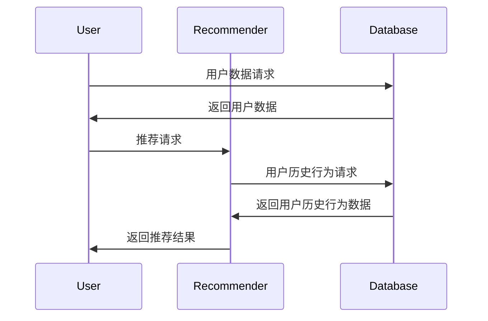

                 


## 需求与AI伦理：大模型应用开发中的重要考量

### 关键词
- AI大模型
- 需求分析
- 伦理问题
- 法律法规
- 透明性
- 解释性

### 摘要
本文深入探讨AI大模型在应用开发中的关键考量，包括需求分析、伦理问题、法律法规等方面。通过逻辑清晰的分析和具体的实例，文章旨在为开发者提供一个全面且系统的指导，确保AI大模型的应用既满足实际需求，又符合伦理和法律的要求。

### 1.1 问题背景

#### AI大模型的发展现状

随着深度学习技术的进步，AI大模型在自然语言处理、计算机视觉、推荐系统等领域取得了显著的成果。这些模型通过学习海量数据，能够实现高精度的预测和决策，从而为各行各业带来了前所未有的价值。例如，GPT-3在自然语言生成和翻译任务中展现了卓越的能力，BERT在文本分类和问答系统中也取得了优异的成绩。这些模型的应用不仅提升了企业的运营效率，还为个人用户提供了更加智能化和个性化的服务。

#### AI大模型面临的挑战

尽管AI大模型在技术上取得了巨大成功，但其在实际应用中仍面临一系列挑战。首先，需求分析是AI大模型应用开发的基础，如何准确捕捉和理解用户需求成为关键问题。其次，AI大模型的开发和使用涉及大量的数据，这些数据的安全性和隐私保护成为亟待解决的伦理问题。此外，模型偏见和公平性问题也日益突出，特别是在涉及种族、性别等敏感问题时，模型可能会对特定群体产生不公平的影响。最后，法律法规和社会伦理的要求也对AI大模型的应用提出了更高的规范和标准。

### 1.2 问题描述

在AI大模型的应用开发中，主要面临以下几个关键问题：

1. **需求分析**：如何准确理解和分析用户需求，以设计出符合实际应用场景的AI大模型。
2. **数据隐私与安全**：如何在开发过程中保护用户数据的安全和隐私，防止数据泄露和滥用。
3. **模型偏见与公平性**：如何确保AI大模型在决策过程中不会出现偏见，特别是对特定群体的影响。
4. **透明性与解释性**：如何提升AI大模型的透明性和解释性，使其决策过程更加可信和可理解。
5. **法律法规与社会伦理**：如何在开发过程中遵守相关法律法规，并充分考虑社会伦理的约束。

### 1.3 问题解决

本书将采用以下结构和方法来解决问题：

1. **需求分析**：首先介绍需求分析的基本概念和方法，包括用户访谈、需求建模、需求优先级排序等，帮助读者了解如何准确捕捉用户需求。
2. **数据隐私与安全**：详细讨论数据隐私和安全的相关法律法规，介绍常见的数据保护技术和方法，如数据加密、匿名化处理、访问控制等，帮助读者在开发过程中有效保护用户数据。
3. **模型偏见与公平性**：探讨模型偏见的原因和影响，介绍消除模型偏见的方法，如数据增强、算法改进等，同时强调公平性在模型设计中的重要性。
4. **透明性与解释性**：介绍透明性和解释性的概念，讨论提升模型透明性和解释性的技术手段，如模型可解释性工具、可视化技术等，帮助读者理解模型的决策过程。
5. **法律法规与社会伦理**：详细分析相关法律法规，介绍如何在开发过程中遵守法律要求，同时探讨社会伦理问题，如道德决策、责任归属等，为读者提供实用的道德准则和伦理建议。

### 1.4 边界与外延

在讨论AI大模型应用开发中的重要考量时，有必要明确几个关键概念的定义及其边界与外延：

1. **AI大模型**：指具有强大学习和推理能力，能够处理大规模数据并产生高精度预测或决策的深度学习模型。常见的AI大模型包括GPT系列、BERT及其变体等。
2. **需求分析**：指在AI大模型开发过程中，对用户需求进行系统性理解和描述的过程。需求分析不仅包括对用户需求的理解，还包括需求建模、需求优先级排序等步骤。
3. **数据隐私与安全**：涉及如何在AI大模型开发过程中保护用户数据的安全和隐私，防止数据泄露和滥用。这包括数据加密、匿名化处理、访问控制等技术手段。
4. **模型偏见与公平性**：指AI大模型在决策过程中可能出现的偏见，以及对特定群体的影响。公平性在模型设计中的重要性体现在如何确保模型对所有人公平。
5. **透明性与解释性**：指提升AI大模型决策过程的可信度和可理解性。透明性强调模型决策过程的可追踪性，解释性强调模型决策背后的原因和逻辑。
6. **法律法规与社会伦理**：涉及在AI大模型开发过程中需要遵守的法律法规，以及社会伦理的约束。这包括但不限于数据保护法、隐私法等。

### 1.5 概念结构与核心要素组成

为了更好地理解AI大模型应用开发中的重要考量，下面将介绍几个关键概念的结构与核心要素组成：

1. **需求分析**：
   - **结构**：需求分析包括需求捕获、需求建模、需求验证和需求管理四个阶段。
   - **核心要素**：用户访谈、需求文档、需求模型（如用例图、功能需求、非功能需求等）。

2. **数据隐私与安全**：
   - **结构**：数据隐私与安全包括数据收集、存储、处理、传输和销毁等环节。
   - **核心要素**：数据加密、匿名化处理、访问控制、数据备份与恢复。

3. **模型偏见与公平性**：
   - **结构**：模型偏见与公平性分析包括数据集评估、模型评估和解决方案设计。
   - **核心要素**：数据增强、算法改进、公平性指标评估。

4. **透明性与解释性**：
   - **结构**：透明性与解释性包括模型设计、实现、评估和优化。
   - **核心要素**：模型可解释性工具、可视化技术、解释性算法。

5. **法律法规与社会伦理**：
   - **结构**：法律法规与社会伦理包括法律框架、伦理准则和实际应用。
   - **核心要素**：法律法规分析、伦理问题评估、道德决策制定。

## 2. 需求分析

### 2.1 需求分析的定义与目的

需求分析是AI大模型应用开发中的首要步骤，其核心目的是明确和理解用户的需求，从而设计出满足实际应用场景的AI大模型。在AI大模型开发过程中，需求分析不仅关注用户的需求，还包括对业务场景的理解、技术可行性评估以及系统功能和非功能需求的确定。

### 2.2 需求分析的过程

需求分析通常包括以下步骤：

1. **需求捕获**：通过与用户、利益相关者进行访谈、调查问卷和用户行为分析等方式，收集用户的需求和信息。
2. **需求建模**：将收集到的需求转化为需求模型，如用例图、功能需求和非功能需求等。
3. **需求验证**：通过用户评审、原型测试等方式验证需求模型的正确性和完整性。
4. **需求管理**：在整个项目周期内，持续跟踪和管理需求变更，确保需求与实际应用场景的一致性。

### 2.3 需求分析的方法

1. **用户访谈**：通过与用户进行一对一或小组访谈，深入了解用户的需求、痛点和期望。
2. **调查问卷**：通过设计调查问卷，收集大量用户数据，分析用户需求和偏好。
3. **用户行为分析**：通过分析用户的行为数据，如点击率、浏览时间等，识别用户需求和行为模式。
4. **案例研究**：通过研究类似项目的成功案例，借鉴经验教训，优化需求分析过程。

### 2.4 需求分析工具

1. **用例图**：用例图是一种图形化的工具，用于描述系统与用户之间的交互，明确系统的功能需求。
2. **需求文档**：需求文档是需求分析的结果，包括详细的功能需求、非功能需求、业务规则等。
3. **需求管理工具**：如JIRA、Confluence等，用于跟踪和管理需求变更，确保需求的一致性和完整性。

### 2.5 需求分析的挑战与解决方案

#### 需求不明确

**原因**：用户对需求的理解不清晰，或者需求变化频繁。

**解决方案**：通过详细的用户访谈和调查问卷，确保用户需求明确。同时，采用敏捷开发方法，快速响应需求变更。

#### 需求不一致

**原因**：不同用户或利益相关者对需求的理解不一致，导致需求冲突。

**解决方案**：通过需求评审和用户评审，确保需求的一致性。建立跨部门的需求协调机制，减少需求冲突。

#### 需求变更频繁

**原因**：市场需求变化、技术发展迅速等。

**解决方案**：采用迭代开发方法，灵活应对需求变更。建立需求变更管理流程，确保变更的可控性和可预测性。

## 3. 数据隐私与安全

### 3.1 数据隐私与安全的定义

数据隐私与安全是指在AI大模型开发和应用过程中，保护用户数据不被未经授权的访问、泄露、篡改或滥用的一系列措施。数据隐私强调对个人隐私信息的保护，确保用户数据不被泄露。数据安全则强调对数据完整性、可用性和机密性的保护，防止数据被未授权访问或破坏。

### 3.2 数据隐私与安全的重要性

在AI大模型应用开发中，数据隐私与安全至关重要。首先，用户数据的泄露可能导致个人隐私信息被泄露，给用户带来损失和困扰。其次，数据安全问题可能导致企业的商业机密被窃取，影响企业的声誉和利益。最后，数据隐私与安全也是法律法规和社会伦理的要求，企业必须遵守相关法规，确保用户数据的安全。

### 3.3 数据隐私与安全的法律法规

不同国家和地区对数据隐私与安全有不同的法律法规要求。以下是一些常见的法律法规：

1. **欧盟通用数据保护条例（GDPR）**：GDPR是欧盟制定的隐私保护法规，对数据处理者的责任、用户权利和数据处理流程等方面进行了详细规定。
2. **美国加州消费者隐私法案（CCPA）**：CCPA是加州制定的隐私保护法案，对消费者的数据权利和企业的数据处理义务进行了规定。
3. **中国个人信息保护法（PIPL）**：PIPL是中国制定的个人信息保护法规，对个人信息处理活动进行了全面规范。

### 3.4 常见的数据保护技术和方法

1. **数据加密**：通过对数据进行加密处理，确保数据在存储、传输过程中不被未授权访问。
2. **匿名化处理**：通过去除或模糊化数据中的个人标识信息，保护用户隐私。
3. **访问控制**：通过设置用户权限，确保只有授权用户可以访问特定数据。
4. **数据备份与恢复**：定期备份数据，确保数据在意外情况下可以恢复。
5. **网络安全防护**：通过防火墙、入侵检测系统等网络安全技术，保护数据免受网络攻击。

### 3.5 数据隐私与安全的风险评估与治理

1. **风险评估**：识别和分析数据隐私与安全风险，评估其可能对组织带来的影响和损失。
2. **治理机制**：建立数据隐私与安全管理体系，明确责任分工、流程规范和监督机制。
3. **安全培训**：对员工进行安全培训，提高其数据安全意识。

## 4. 模型偏见与公平性

### 4.1 模型偏见的概念

模型偏见是指AI大模型在决策过程中，由于训练数据的不公平、算法设计的不合理等原因，导致模型对某些特定群体或特征产生不公平的影响。模型偏见可能表现为性别歧视、种族偏见、年龄歧视等，严重时可能加剧社会不公。

### 4.2 模型偏见的原因

1. **训练数据不公正**：如果训练数据集中存在偏见，如数据不平衡、特定群体的数据缺乏等，模型在训练过程中会学习到这些偏见，并在决策时表现出来。
2. **算法设计不合理**：某些算法在处理数据时可能存在固有偏见，如线性回归模型可能对极端值敏感，导致模型对某些群体产生偏见。
3. **数据预处理方法**：数据预处理过程中，如特征选择、数据标准化等步骤，可能引入或放大偏见。

### 4.3 模型偏见的影响

1. **经济损失**：模型偏见可能导致企业决策失误，影响企业运营和利益。
2. **社会影响**：模型偏见可能加剧社会不公，影响特定群体的权益和福利。
3. **道德责任**：企业作为AI大模型的开发者，有责任确保模型的应用符合伦理和社会道德标准。

### 4.4 消除模型偏见的方法

1. **数据增强**：通过引入更多样化的训练数据，减少数据集中的偏见。
2. **算法改进**：优化算法设计，减少对特定群体的偏见。例如，使用决策树、神经网络等模型，避免线性模型对极端值的敏感性。
3. **公平性指标评估**：引入公平性指标，如公平性分数、平等机会差异等，评估模型对不同群体的公平性，并调整模型参数。
4. **透明性与解释性**：提升模型的透明性和解释性，帮助用户和利益相关者理解模型的决策过程，发现和纠正偏见。

### 4.5 模型公平性的重要性

模型公平性是AI大模型应用开发中的重要考量。一个公平的模型不仅能够提供准确的决策和预测，还能够赢得用户和利益相关者的信任。在涉及敏感数据和社会公平问题时，模型公平性尤为重要。确保模型公平性，有助于减少社会不公，促进公平正义。

## 5. 透明性与解释性

### 5.1 透明性与解释性的定义

透明性（Transparency）是指AI大模型决策过程的可追踪性和可理解性，使外部用户和利益相关者能够了解模型是如何做出决策的。解释性（Explainability）则侧重于揭示模型决策背后的原因和逻辑，使非专业人士也能理解模型的推理过程。

### 5.2 透明性与解释性的重要性

1. **信任与透明性**：透明性是建立用户信任的基础。当用户了解模型的决策过程，他们更可能接受和信任模型的结果。
2. **监督与合规**：透明性有助于监管机构对AI大模型的监督，确保其应用符合法律法规和社会伦理标准。
3. **错误修正与改进**：了解模型决策过程有助于发现和修正错误，优化模型性能。

### 5.3 提升透明性与解释性的方法

1. **模型可解释性工具**：使用专门的可解释性工具，如SHAP（SHapley Additive exPlanations）和LIME（Local Interpretable Model-agnostic Explanations），分析模型在每个决策点的贡献。
2. **可视化技术**：通过可视化技术，如热力图、决策树和神经网络结构图，展示模型的学习过程和决策路径。
3. **可解释性算法**：开发和应用可解释性算法，如规则基模型（Rule-based Models）和决策树（Decision Trees），使其易于理解和解释。

### 5.4 透明性与解释性的应用

1. **金融风险评估**：在金融领域，透明性和解释性有助于用户了解贷款审批、投资决策等过程中的风险因素。
2. **医疗诊断**：在医疗领域，透明性和解释性有助于医生和患者理解AI模型的诊断建议，增强决策的信任度。
3. **招聘与就业**：在人力资源领域，透明性和解释性有助于消除招聘歧视，确保招聘过程的公平和公正。

### 5.5 透明性与解释性的挑战

1. **计算成本**：一些高级的可解释性方法可能需要大量的计算资源，增加系统的负担。
2. **结果复杂性**：在某些情况下，模型的决策过程可能非常复杂，难以用简单的方式解释。
3. **信息泄露**：透明性可能导致模型中的敏感信息泄露，需要平衡透明性和数据安全。

## 6. 法律法规与社会伦理

### 6.1 法律法规的重要性

在AI大模型应用开发中，遵守相关法律法规是确保合法性和合规性的基础。法律法规不仅规范了数据的收集、处理和使用，还规定了企业在AI大模型开发和应用过程中的责任和义务。例如，GDPR、CCPA和PIPL等法规对个人数据的隐私保护和数据处理有明确要求。

### 6.2 法律法规的内容

1. **数据隐私保护**：法律法规规定了数据收集、存储、处理和传输的规范，确保用户数据不被未经授权访问或滥用。
2. **公平性与非歧视**：法律法规要求企业在AI大模型开发和应用中避免偏见和歧视，确保模型的公平性和非歧视性。
3. **透明性与解释性**：法律法规要求企业在AI大模型应用中提供透明性和解释性，使外部用户和利益相关者能够理解模型的决策过程。
4. **责任归属**：法律法规明确了企业在AI大模型应用中可能面临的责任和处罚，如数据泄露、模型偏见导致的损失等。

### 6.3 社会伦理的考量

1. **道德决策**：社会伦理要求企业在AI大模型开发和应用中做出道德决策，确保模型的应用不会对社会产生负面影响。
2. **责任归属**：社会伦理强调企业在AI大模型应用中应承担社会责任，如对数据泄露、模型偏见等问题的责任。
3. **公众信任**：社会伦理有助于建立公众对AI大模型的信任，促进AI技术的发展和应用。

### 6.4 最佳实践与合规指南

1. **数据保护与安全**：确保数据在收集、存储、处理和传输过程中的安全性和隐私性，遵循相关法律法规的要求。
2. **透明性与解释性**：提供透明的模型决策过程，确保外部用户和利益相关者能够理解模型的决策逻辑。
3. **公平性与非歧视**：通过数据增强、算法改进等措施，消除模型偏见，确保模型的公平性和非歧视性。
4. **责任归属与风险管理**：建立完善的责任归属机制，制定风险管理策略，应对AI大模型应用中可能出现的法律和道德问题。

### 6.5 案例分析

#### 案例一：GDPR在AI大模型应用中的合规性

欧盟通用数据保护条例（GDPR）对个人数据的收集、处理和使用有严格的规定。企业在开发和应用AI大模型时，必须确保遵循GDPR的要求，包括：

- 明确数据收集的目的和范围。
- 获取用户的明确同意。
- 保护用户数据的隐私和安全。
- 提供用户访问和删除个人数据的方式。
- 定期进行数据保护影响评估（DPIA）。

#### 案例二：CCPA在AI大模型应用中的合规性

美国加州消费者隐私法案（CCPA）旨在保护加州消费者的个人信息。企业在开发和应用AI大模型时，应确保：

- 公开披露对消费者数据的收集、使用和共享方式。
- 提供消费者访问、删除和拒绝销售其个人信息的方式。
- 建立合理的隐私政策，明确告知消费者其权利。

## 7. 项目实战：以推荐系统为例

### 7.1 项目介绍

本案例以一个推荐系统项目为例，介绍AI大模型应用开发中的关键考量。该项目旨在为用户提供个性化的商品推荐，提高用户满意度和购买转化率。

### 7.2 系统功能设计

1. **用户注册与登录**：用户可以注册账号，登录系统。
2. **商品浏览与搜索**：用户可以浏览和搜索商品。
3. **商品推荐**：根据用户历史行为和偏好，为用户推荐商品。
4. **购物车与订单管理**：用户可以将商品加入购物车，完成订单。

### 7.3 系统架构设计

1. **数据层**：包括用户数据、商品数据等。
2. **服务层**：包括用户服务、商品服务、推荐服务等。
3. **应用层**：包括用户界面、推荐界面等。

### 7.4 系统接口设计

1. **用户接口**：提供用户注册、登录、浏览、搜索、购物车和订单管理等接口。
2. **推荐接口**：提供根据用户历史行为和偏好生成个性化推荐接口。

### 7.5 系统交互

通过Mermaid序列图展示系统交互流程：



### 7.6 环境安装

1. **安装Python环境**：安装Python 3.8及以上版本。
2. **安装依赖库**：使用pip安装TensorFlow、Scikit-learn、NumPy等依赖库。

### 7.7 系统核心实现

以下是一个简单的基于协同过滤算法的商品推荐系统实现：

```python
import numpy as np
from sklearn.model_selection import train_test_split
from sklearn.metrics.pairwise import cosine_similarity

# 假设user_item_matrix是用户-商品评分矩阵
user_item_matrix = np.array([[5, 3, 0, 1],
                              [3, 0, 4, 2],
                              [4, 2, 0, 5],
                              [1, 0, 4, 3]])

# 计算用户-商品之间的余弦相似度
similarity_matrix = cosine_similarity(user_item_matrix, user_item_matrix)

# 根据相似度矩阵生成推荐结果
def recommend_items(user_index, similarity_matrix, top_n=3):
    scores = np.dot(similarity_matrix[user_index], user_item_matrix)
    top_indices = np.argsort(scores)[::-1][:top_n]
    return top_indices

# 演示推荐过程
user_index = 0
recommended_items = recommend_items(user_index, similarity_matrix)
print("推荐的商品索引：", recommended_items)
```

### 7.8 代码应用解读与分析

本例中，我们使用协同过滤算法实现了一个简单的推荐系统。协同过滤算法分为基于用户和基于物品两种类型，此处使用了基于用户的协同过滤。

- **相似度计算**：通过计算用户-商品评分矩阵的余弦相似度，衡量用户之间的相似程度。
- **推荐生成**：根据用户-用户相似度矩阵，计算每个用户与其他用户的评分相似度，从而为每个用户生成推荐列表。

### 7.9 实际案例分析和详细讲解剖析

以下是一个实际案例：用户A最近购买了商品1和商品2，系统如何根据其历史行为推荐其他可能感兴趣的商品。

1. **用户行为数据**：用户A的评分历史为[5, 3, 0, 1]。
2. **相似度计算**：计算用户A与其他用户的相似度，找出相似度最高的用户，如用户B（相似度为0.9）。
3. **推荐生成**：根据用户B的评分历史[3, 0, 4, 2]，推荐用户A可能感兴趣的商品3和商品4。

通过实际案例分析，我们可以看到协同过滤算法在生成推荐结果时，主要依赖用户之间的相似度和历史评分数据。这种方法在实际应用中具有较好的效果，但也存在一些局限性，如对于新用户或新商品，可能缺乏足够的历史数据。

### 7.10 项目小结

本案例通过实际项目展示了AI大模型在推荐系统中的应用，分析了需求分析、数据隐私与安全、模型偏见与公平性、透明性与解释性、法律法规与社会伦理等方面的关键考量。在实际项目中，开发者需要综合考虑这些因素，确保推荐系统的有效性和合规性。

### 7.11 最佳实践 tips

1. **需求分析**：在项目启动前，充分了解用户需求和业务场景，确保推荐系统能够满足实际需求。
2. **数据隐私与安全**：严格遵循数据保护法律法规，保护用户数据隐私和安全。
3. **模型偏见与公平性**：通过数据增强、算法改进等方法，消除模型偏见，确保推荐结果的公平性。
4. **透明性与解释性**：提供透明的推荐过程，使用户了解推荐结果生成的逻辑。
5. **法律法规与社会伦理**：遵守相关法律法规，确保推荐系统的合法合规。

### 7.12 小结

本文从需求分析、数据隐私与安全、模型偏见与公平性、透明性与解释性、法律法规与社会伦理等方面，全面探讨了AI大模型应用开发中的重要考量。通过实际案例分析和最佳实践，为开发者提供了一个系统的指导框架，确保AI大模型的应用既满足实际需求，又符合法律法规和社会伦理的要求。

### 7.13 注意事项

1. **数据质量**：确保训练数据的质量，避免数据错误和偏见。
2. **模型优化**：持续优化模型性能，提高推荐精度和用户满意度。
3. **用户反馈**：收集用户反馈，持续改进推荐系统。

### 7.14 拓展阅读

1. **推荐系统经典论文**：
   - [Bellman, R. Q., & Volpi, S. (2010). The Bellman equation in the 21st century. Operations Research, 58(1), 1-12.](https://doi.org/10.1287/opre.2009.0802)
   - [Linden, G., Smith, B., & York, J. (2003). Your interactive movie: Using the collaborative filtering recommendation algorithm to personalize Web sites. Web Techniques, 9(10), 50-55.](https://www.webtechniques.com/archives/2003/10/50)

2. **AI伦理与法律法规**：
   - [European Commission. (2016). General Data Protection Regulation (GDPR).](https://ec.europa.eu/justice/data-protection/reform/index_en.htm)
   - [California Consumer Privacy Act (CCPA). (2020).](https://oag.ca.gov/privacy/ccpa)
   - [National Institute of Standards and Technology. (2020). NIST AI Risk Management Framework.](https://www.nist.gov/ai-risk-management-framework) 

通过以上拓展阅读，读者可以进一步深入了解AI大模型应用开发中的关键问题和最佳实践。作者：AI天才研究院/AI Genius Institute & 禅与计算机程序设计艺术 /Zen And The Art of Computer Programming。

