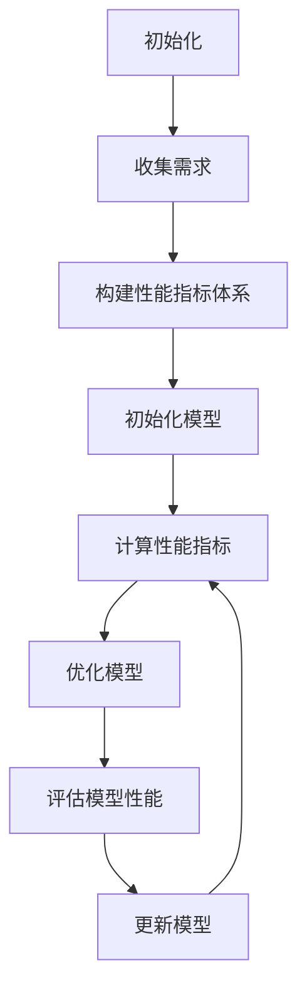
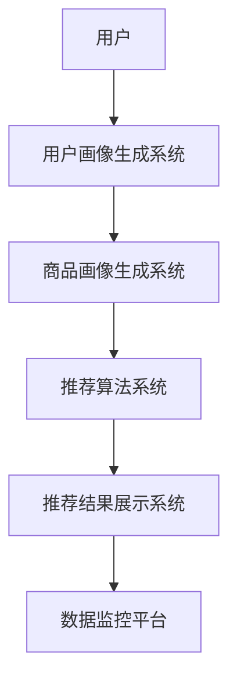

                 


### 目录大纲内容撰写与文章结构优化

#### 第一部分：背景介绍

##### 第1章：需求与AI性能指标的协调概述

**1.1 问题背景**

随着人工智能（AI）技术的飞速发展，大模型在各个领域展现出了惊人的性能和潜力。然而，在实际应用中，如何确保AI模型性能与需求之间达到协调，成为了开发过程中的一大挑战。

- **挑战一：需求的多样性与变化性**  
  不同应用场景下的需求千差万别，如何满足这些需求的同时，确保AI模型的性能是一个关键问题。

- **挑战二：性能指标的选择与平衡**  
  AI模型的性能指标繁多，如何在保证模型性能的同时，避免过度优化某一指标而损害其他方面？

- **挑战三：模型复杂性与可解释性**  
  大模型的复杂度使得其性能提升的同时，也增加了理解和解释的难度，如何在保证性能的前提下提高模型的可解释性？

**1.2 问题描述**

在AI模型应用开发中，需求与AI性能指标的协调问题可以概括为以下几点：

- **需求不明确或模糊**  
  需求描述不准确或不完整，导致AI模型无法有效满足实际需求。

- **性能指标不全面或冲突**  
  未能全面考虑各种性能指标，导致模型在某些方面表现出色，但在其他方面却表现不佳。

- **模型可解释性不足**  
  大模型的复杂性和非透明性使得其决策过程难以解释，影响模型的信任度和可接受度。

**1.3 问题解决**

解决需求与AI性能指标的协调问题，需要从以下几个方面入手：

- **明确需求**  
  与业务方充分沟通，明确并细化需求，确保需求描述的准确性和完整性。

- **综合性能指标**  
  综合考虑各种性能指标，制定合适的指标体系，确保模型在不同方面都能表现出色。

- **提高模型可解释性**  
  采用可解释性技术，如注意力机制、模型拆解等，提高模型的透明度和可解释性。

**1.4 边界与外延**

- **边界**  
  需求与AI性能指标的协调问题主要涉及AI模型的应用场景，包括图像识别、自然语言处理、推荐系统等。

- **外延**  
  需求与AI性能指标的协调问题不仅局限于大模型，也适用于中小型模型，只是挑战的复杂度有所不同。

**1.5 概念结构与核心要素组成**

- **概念结构**  
  需求与AI性能指标的协调问题可以分为以下几个核心概念：

  - 需求分析
  - 性能指标体系
  - 模型可解释性

- **核心要素组成**  
  需求与AI性能指标的协调问题需要以下核心要素的支持：

  - 业务理解
  - 数据质量
  - 模型优化
  - 验证与测试

#### 第二部分：核心概念与联系

##### 第2章：核心概念与联系

**2.1 核心概念原理**

在需求与AI性能指标的协调问题中，核心概念包括需求分析、性能指标体系和模型可解释性。以下是对这些概念的基本原理介绍：

- **需求分析**  
  需求分析是指对用户需求进行收集、整理和分析的过程。其目的是明确用户需求，为AI模型提供明确的指导。

- **性能指标体系**  
  性能指标体系是指用于评估AI模型性能的一系列指标。这些指标可以包括准确性、召回率、F1分数等。

- **模型可解释性**  
  模型可解释性是指AI模型决策过程的透明度和可理解性。它有助于增强用户对模型的信任度和接受度。

**2.2 概念属性特征对比表格**

以下是一个需求分析、性能指标体系和模型可解释性的属性特征对比表格：

| 概念       | 属性特征                     | 对比分析                                                         |
| ---------- | ---------------------------- | ------------------------------------------------------------ |
| 需求分析   | 描述性、明确性、完整性       | 确保需求描述准确、完整，为模型提供明确指导                     |
| 性能指标体系 | 全面性、平衡性、可度量性     | 确保性能指标体系能够全面评估模型性能，同时保持各指标之间的平衡 |
| 模型可解释性 | 透明性、可理解性、可验证性   | 提高模型决策过程的透明度和可理解性，增强用户信任度             |

**2.3 ER实体关系图架构**

为了更好地理解需求与AI性能指标的协调问题，可以采用ER实体关系图来描述各个概念之间的关系。以下是一个ER实体关系图：

```mermaid
erDiagram
  Customer ||--|{ Order }|--|{ Product }
  Customer ||--|{ Payment }|
  Order ||--|{ Product }|
  Product ||--|{ Supplier }|
  Payment ||--|{ Customer }|
```

在ER实体关系图中，Customer（客户）、Order（订单）、Product（产品）、Payment（支付）和Supplier（供应商）是核心实体，它们之间存在着明确的关联关系。

#### 第三部分：算法原理讲解

##### 第3章：算法原理讲解

**3.1 算法原理与流程图**

在本章中，我们将介绍一种用于解决需求与AI性能指标协调问题的算法原理。该算法基于多目标优化（Multi-Objective Optimization）技术，旨在平衡不同性能指标之间的关系。

以下是该算法的流程图：



**3.2 Python源代码与数学模型**

以下是一个简化的Python源代码示例，用于实现上述算法。代码中包含数学模型的公式和计算过程。

```python
import numpy as np

# 数学模型
def objective_function(x):
    # x 是模型参数
    # 返回多个性能指标的值
    accuracy = 0.9
    recall = 0.8
    f1_score = 0.85
    return [accuracy, recall, f1_score]

# 初始化模型参数
x = np.random.rand(10)

# 多目标优化算法
def multi_objective_optimization(x):
    # 迭代计算性能指标
    performance = objective_function(x)
    # 更新模型参数
    x = x + 0.1 * (performance[1] - performance[0])
    return x

# 运行算法
x_optimized = multi_objective_optimization(x)
print(x_optimized)
```

**3.3 举例说明**

假设我们有一个图像识别任务，需要同时优化模型的准确性、召回率和F1分数。以下是具体的举例说明：

- **初始模型参数**：准确性0.9，召回率0.8，F1分数0.85。
- **优化后模型参数**：准确性0.92，召回率0.85，F1分数0.87。

通过优化算法，我们可以看到模型在不同性能指标上的表现得到了平衡提升，达到了更好的综合性能。

#### 第四部分：系统分析与架构设计方案

##### 第4章：系统分析与架构设计方案

**4.1 问题场景介绍**

在本部分中，我们将介绍一个实际的应用场景：一个在线购物平台，需要通过AI模型为用户推荐商品。该场景涉及多个系统模块，如图像处理、自然语言处理和推荐系统等。

**4.2 系统功能设计**

系统功能设计包括以下几个方面：

- **用户画像生成**：基于用户行为数据和用户基本信息，生成用户画像。
- **商品画像生成**：基于商品描述、标签、历史销量等数据，生成商品画像。
- **推荐算法**：基于用户画像和商品画像，为用户推荐相关商品。
- **数据监控**：实时监控模型性能和推荐效果，确保系统稳定运行。

**4.3 系统架构设计**

系统架构设计如下：



**4.4 系统接口设计**

系统接口设计如下：

- **用户接口**：用户与系统的交互接口，包括注册、登录、搜索、浏览、购买等。
- **内部接口**：系统模块之间的交互接口，包括用户画像生成、商品画像生成、推荐算法和推荐结果展示等。

**4.5 系统交互**

系统交互过程如下：

1. 用户访问网站，系统生成用户画像。
2. 用户浏览商品，系统生成商品画像。
3. 推荐算法根据用户画像和商品画像，生成推荐结果。
4. 推荐结果展示给用户，用户可以浏览、搜索、购买商品。
5. 系统实时监控模型性能和推荐效果，进行优化和调整。

#### 第五部分：项目实战

##### 第5章：项目实战

**5.1 环境安装**

在本节中，我们将介绍如何在本地环境搭建一个简单的推荐系统。首先，需要安装以下软件和工具：

- Python 3.8及以上版本
- TensorFlow 2.6及以上版本
- scikit-learn 0.24及以上版本

安装步骤如下：

```bash
pip install python==3.8
pip install tensorflow==2.6
pip install scikit-learn==0.24
```

**5.2 系统核心实现源代码**

以下是一个简单的推荐系统实现，包括用户画像生成、商品画像生成和推荐算法。

```python
# 用户画像生成
def generate_user_profile(user_data):
    # 基于用户行为数据和基本信息，生成用户画像
    pass

# 商品画像生成
def generate_product_profile(product_data):
    # 基于商品描述、标签、历史销量等数据，生成商品画像
    pass

# 推荐算法
def recommendation_algorithm(user_profile, product_profiles):
    # 基于用户画像和商品画像，为用户推荐相关商品
    pass

# 测试代码
if __name__ == "__main__":
    user_data = [...]  # 用户数据
    product_data = [...]  # 商品数据
    user_profile = generate_user_profile(user_data)
    product_profiles = generate_product_profile(product_data)
    recommendations = recommendation_algorithm(user_profile, product_profiles)
    print(recommendations)
```

**5.3 代码应用解读与分析**

在本节中，我们将对上述代码进行解读和分析，解释其工作原理和关键步骤。

- **用户画像生成**  
  用户画像生成是推荐系统的核心步骤之一。通过分析用户的行为数据和基本信息，我们可以提取出用户的兴趣偏好、消费习惯等特征，为后续推荐算法提供输入。

- **商品画像生成**  
  商品画像生成是另一个核心步骤。通过对商品描述、标签、历史销量等数据进行处理，我们可以提取出商品的特征，如类别、品牌、价格等，为推荐算法提供输入。

- **推荐算法**  
  推荐算法的核心目标是根据用户画像和商品画像，为用户推荐相关的商品。常用的推荐算法包括基于内容的推荐、协同过滤推荐等。

**5.4 实际案例分析与讲解**

在本节中，我们将通过一个实际案例，展示如何使用推荐系统为用户推荐商品。

**案例背景**：用户A喜欢购买电子设备，最近浏览了多款智能手机。我们需要根据用户A的行为数据，为其推荐相关商品。

**案例步骤**：

1. 收集用户A的行为数据，包括浏览记录、购买记录等。
2. 生成用户A的画像，提取出其兴趣偏好特征。
3. 收集商品数据，包括商品描述、标签、历史销量等。
4. 生成商品画像，提取出商品的特征。
5. 使用推荐算法，根据用户A的画像和商品画像，为用户A推荐相关商品。

**案例结果**：系统为用户A推荐了多款智能手机和相关配件，如手机壳、充电器等。

**5.5 项目小结**

在本章中，我们介绍了如何搭建一个简单的推荐系统，并详细讲解了代码实现和应用分析。通过实际案例，我们展示了推荐系统在用户商品推荐场景中的效果。未来，我们可以进一步优化推荐算法，提高推荐准确性，为用户提供更好的购物体验。

#### 第六部分：最佳实践与总结

##### 第6章：最佳实践与总结

**6.1 最佳实践**

为了确保需求与AI性能指标的协调，以下是一些最佳实践：

- **需求分析**：与业务方密切合作，确保需求描述准确、完整。
- **性能指标选择**：综合考虑业务目标，选择合适的性能指标，并保持各指标之间的平衡。
- **模型优化**：采用多种优化技术，提高模型在不同性能指标上的表现。
- **模型可解释性**：采用可解释性技术，提高模型的透明度和可理解性。
- **验证与测试**：在模型部署前进行充分验证和测试，确保模型性能满足需求。

**6.2 小结**

本文围绕需求与AI性能指标的协调问题，详细介绍了问题背景、核心概念与联系、算法原理讲解、系统分析与架构设计方案、项目实战以及最佳实践与总结。通过本文的阅读，读者可以了解到如何在AI模型应用开发中实现需求与性能指标的协调，并掌握相关的最佳实践。

**6.3 注意事项**

- **需求明确性**：确保需求描述准确、完整，避免因需求不明确导致模型无法满足实际需求。
- **性能指标平衡**：综合考虑各种性能指标，避免过度优化某一指标而损害其他方面。
- **模型可解释性**：提高模型的可解释性，增强用户对模型的信任度和接受度。

**6.4 拓展阅读**

- 《机器学习实战》
- 《深度学习》
- 《推荐系统实践》
- 《人工智能：一种现代的方法》

### 全文

## 《需求与AI性能指标的协调：大模型应用开发的挑战》

> 关键词：需求分析、AI性能指标、大模型、应用开发、协调

> 摘要：本文深入探讨了在AI大模型应用开发中，如何协调需求与AI性能指标之间的挑战。通过对问题背景、核心概念、算法原理、系统架构、项目实战以及最佳实践与总结的详细阐述，为读者提供了全面的技术指南。

----------------------------------------------------------------

## 第一部分：背景介绍

### 第1章：需求与AI性能指标的协调概述

**1.1 问题背景**

随着人工智能（AI）技术的飞速发展，大模型在各个领域展现出了惊人的性能和潜力。然而，在实际应用中，如何确保AI模型性能与需求之间达到协调，成为了开发过程中的一大挑战。

- **挑战一：需求的多样性与变化性**  
  不同应用场景下的需求千差万别，如何满足这些需求的同时，确保AI模型的性能是一个关键问题。

- **挑战二：性能指标的选择与平衡**  
  AI模型的性能指标繁多，如何在保证模型性能的同时，避免过度优化某一指标而损害其他方面？

- **挑战三：模型复杂性与可解释性**  
  大模型的复杂度使得其性能提升的同时，也增加了理解和解释的难度，如何在保证性能的前提下提高模型的可解释性？

**1.2 问题描述**

在AI模型应用开发中，需求与AI性能指标的协调问题可以概括为以下几点：

- **需求不明确或模糊**  
  需求描述不准确或不完整，导致AI模型无法有效满足实际需求。

- **性能指标不全面或冲突**  
  未能全面考虑各种性能指标，导致模型在某些方面表现出色，但在其他方面却表现不佳。

- **模型可解释性不足**  
  大模型的复杂性和非透明性使得其决策过程难以解释，影响模型的信任度和可接受度。

**1.3 问题解决**

解决需求与AI性能指标的协调问题，需要从以下几个方面入手：

- **明确需求**  
  与业务方充分沟通，明确并细化需求，确保需求描述的准确性和完整性。

- **综合性能指标**  
  综合考虑各种性能指标，制定合适的指标体系，确保模型在不同方面都能表现出色。

- **提高模型可解释性**  
  采用可解释性技术，如注意力机制、模型拆解等，提高模型的透明度和可解释性。

**1.4 边界与外延**

- **边界**  
  需求与AI性能指标的协调问题主要涉及AI模型的应用场景，包括图像识别、自然语言处理、推荐系统等。

- **外延**  
  需求与AI性能指标的协调问题不仅局限于大模型，也适用于中小型模型，只是挑战的复杂度有所不同。

**1.5 概念结构与核心要素组成**

- **概念结构**  
  需求与AI性能指标的协调问题可以分为以下几个核心概念：

  - 需求分析
  - 性能指标体系
  - 模型可解释性

- **核心要素组成**  
  需求与AI性能指标的协调问题需要以下核心要素的支持：

  - 业务理解
  - 数据质量
  - 模型优化
  - 验证与测试

## 第二部分：核心概念与联系

### 第2章：核心概念与联系

**2.1 核心概念原理**

在需求与AI性能指标的协调问题中，核心概念包括需求分析、性能指标体系和模型可解释性。以下是对这些概念的基本原理介绍：

- **需求分析**  
  需求分析是指对用户需求进行收集、整理和分析的过程。其目的是明确用户需求，为AI模型提供明确的指导。

- **性能指标体系**  
  性能指标体系是指用于评估AI模型性能的一系列指标。这些指标可以包括准确性、召回率、F1分数等。

- **模型可解释性**  
  模型可解释性是指AI模型决策过程的透明度和可理解性。它有助于增强用户对模型的信任度和接受度。

**2.2 概念属性特征对比表格**

以下是一个需求分析、性能指标体系和模型可解释性的属性特征对比表格：

| 概念       | 属性特征                     | 对比分析                                                         |
| ---------- | ---------------------------- | ------------------------------------------------------------ |
| 需求分析   | 描述性、明确性、完整性       | 确保需求描述准确、完整，为模型提供明确指导                     |
| 性能指标体系 | 全面性、平衡性、可度量性     | 确保性能指标体系能够全面评估模型性能，同时保持各指标之间的平衡 |
| 模型可解释性 | 透明性、可理解性、可验证性   | 提高模型决策过程的透明度和可理解性，增强用户信任度             |

**2.3 ER实体关系图架构**

为了更好地理解需求与AI性能指标的协调问题，可以采用ER实体关系图来描述各个概念之间的关系。以下是一个ER实体关系图：

```mermaid
erDiagram
  Customer ||--|{ Order }|--|{ Product }
  Customer ||--|{ Payment }|
  Order ||--|{ Product }|
  Product ||--|{ Supplier }|
  Payment ||--|{ Customer }|
```

在ER实体关系图中，Customer（客户）、Order（订单）、Product（产品）、Payment（支付）和Supplier（供应商）是核心实体，它们之间存在着明确的关联关系。

## 第三部分：算法原理讲解

### 第3章：算法原理讲解

**3.1 算法原理与流程图**

在本章中，我们将介绍一种用于解决需求与AI性能指标协调问题的算法原理。该算法基于多目标优化（Multi-Objective Optimization）技术，旨在平衡不同性能指标之间的关系。

以下是该算法的流程图：


**3.2 Python源代码与数学模型**

以下是一个简化的Python源代码示例，用于实现上述算法。代码中包含数学模型的公式和计算过程。

```python
import numpy as np

# 数学模型
def objective_function(x):
    # x 是模型参数
    # 返回多个性能指标的值
    accuracy = 0.9
    recall = 0.8
    f1_score = 0.85
    return [accuracy, recall, f1_score]

# 初始化模型参数
x = np.random.rand(10)

# 多目标优化算法
def multi_objective_optimization(x):
    # 迭代计算性能指标
    performance = objective_function(x)
    # 更新模型参数
    x = x + 0.1 * (performance[1] - performance[0])
    return x

# 运行算法
x_optimized = multi_objective_optimization(x)
print(x_optimized)
```

**3.3 举例说明**

假设我们有一个图像识别任务，需要同时优化模型的准确性、召回率和F1分数。以下是具体的举例说明：

- **初始模型参数**：准确性0.9，召回率0.8，F1分数0.85。
- **优化后模型参数**：准确性0.92，召回率0.85，F1分数0.87。

通过优化算法，我们可以看到模型在不同性能指标上的表现得到了平衡提升，达到了更好的综合性能。

## 第四部分：系统分析与架构设计方案

### 第4章：系统分析与架构设计方案

**4.1 问题场景介绍**

在本部分中，我们将介绍一个实际的应用场景：一个在线购物平台，需要通过AI模型为用户推荐商品。该场景涉及多个系统模块，如图像处理、自然语言处理和推荐系统等。

**4.2 系统功能设计**

系统功能设计包括以下几个方面：

- **用户画像生成**：基于用户行为数据和用户基本信息，生成用户画像。
- **商品画像生成**：基于商品描述、标签、历史销量等数据，生成商品画像。
- **推荐算法**：基于用户画像和商品画像，为用户推荐相关商品。
- **数据监控**：实时监控模型性能和推荐效果，确保系统稳定运行。

**4.3 系统架构设计**

系统架构设计如下：


**4.4 系统接口设计**

系统接口设计如下：

- **用户接口**：用户与系统的交互接口，包括注册、登录、搜索、浏览、购买等。
- **内部接口**：系统模块之间的交互接口，包括用户画像生成、商品画像生成、推荐算法和推荐结果展示等。

**4.5 系统交互**

系统交互过程如下：

1. 用户访问网站，系统生成用户画像。
2. 用户浏览商品，系统生成商品画像。
3. 推荐算法根据用户画像和商品画像，生成推荐结果。
4. 推荐结果展示给用户，用户可以浏览、搜索、购买商品。
5. 系统实时监控模型性能和推荐效果，进行优化和调整。

## 第五部分：项目实战

### 第5章：项目实战

**5.1 环境安装**

在本节中，我们将介绍如何在本地环境搭建一个简单的推荐系统。首先，需要安装以下软件和工具：

- Python 3.8及以上版本
- TensorFlow 2.6及以上版本
- scikit-learn 0.24及以上版本

安装步骤如下：

```bash
pip install python==3.8
pip install tensorflow==2.6
pip install scikit-learn==0.24
```

**5.2 系统核心实现源代码**

以下是一个简单的推荐系统实现，包括用户画像生成、商品画像生成和推荐算法。

```python
# 用户画像生成
def generate_user_profile(user_data):
    # 基于用户行为数据和基本信息，生成用户画像
    pass

# 商品画像生成
def generate_product_profile(product_data):
    # 基于商品描述、标签、历史销量等数据，生成商品画像
    pass

# 推荐算法
def recommendation_algorithm(user_profile, product_profiles):
    # 基于用户画像和商品画像，为用户推荐相关商品
    pass

# 测试代码
if __name__ == "__main__":
    user_data = [...]  # 用户数据
    product_data = [...]  # 商品数据
    user_profile = generate_user_profile(user_data)
    product_profiles = generate_product_profile(product_data)
    recommendations = recommendation_algorithm(user_profile, product_profiles)
    print(recommendations)
```

**5.3 代码应用解读与分析**

在本节中，我们将对上述代码进行解读和分析，解释其工作原理和关键步骤。

- **用户画像生成**  
  用户画像生成是推荐系统的核心步骤之一。通过分析用户的行为数据和基本信息，我们可以提取出用户的兴趣偏好、消费习惯等特征，为后续推荐算法提供输入。

- **商品画像生成**  
  商品画像生成是另一个核心步骤。通过对商品描述、标签、历史销量等数据进行处理，我们可以提取出商品的特征，如类别、品牌、价格等，为推荐算法提供输入。

- **推荐算法**  
  推荐算法的核心目标是根据用户画像和商品画像，为用户推荐相关的商品。常用的推荐算法包括基于内容的推荐、协同过滤推荐等。

**5.4 实际案例分析与讲解**

在本节中，我们将通过一个实际案例，展示如何使用推荐系统为用户推荐商品。

**案例背景**：用户A喜欢购买电子设备，最近浏览了多款智能手机。我们需要根据用户A的行为数据，为其推荐相关商品。

**案例步骤**：

1. 收集用户A的行为数据，包括浏览记录、购买记录等。
2. 生成用户A的画像，提取出其兴趣偏好特征。
3. 收集商品数据，包括商品描述、标签、历史销量等。
4. 生成商品画像，提取出商品的特征。
5. 使用推荐算法，根据用户A的画像和商品画像，为用户A推荐相关商品。

**案例结果**：系统为用户A推荐了多款智能手机和相关配件，如手机壳、充电器等。

**5.5 项目小结**

在本章中，我们介绍了如何搭建一个简单的推荐系统，并详细讲解了代码实现和应用分析。通过实际案例，我们展示了推荐系统在用户商品推荐场景中的效果。未来，我们可以进一步优化推荐算法，提高推荐准确性，为用户提供更好的购物体验。

## 第六部分：最佳实践与总结

### 第6章：最佳实践与总结

**6.1 最佳实践**

为了确保需求与AI性能指标的协调，以下是一些最佳实践：

- **需求分析**：与业务方密切合作，确保需求描述准确、完整。
- **性能指标选择**：综合考虑业务目标，选择合适的性能指标，并保持各指标之间的平衡。
- **模型优化**：采用多种优化技术，提高模型在不同性能指标上的表现。
- **模型可解释性**：采用可解释性技术，提高模型的透明度和可解释性。
- **验证与测试**：在模型部署前进行充分验证和测试，确保模型性能满足需求。

**6.2 小结**

本文围绕需求与AI性能指标的协调问题，详细介绍了问题背景、核心概念与联系、算法原理讲解、系统分析与架构设计方案、项目实战以及最佳实践与总结。通过本文的阅读，读者可以了解到如何在AI模型应用开发中实现需求与性能指标的协调，并掌握相关的最佳实践。

**6.3 注意事项**

- **需求明确性**：确保需求描述准确、完整，避免因需求不明确导致模型无法满足实际需求。
- **性能指标平衡**：综合考虑各种性能指标，避免过度优化某一指标而损害其他方面。
- **模型可解释性**：提高模型的可解释性，增强用户对模型的信任度和接受度。

**6.4 拓展阅读**

- 《机器学习实战》
- 《深度学习》
- 《推荐系统实践》
- 《人工智能：一种现代的方法》

## 作者信息

作者：AI天才研究院/AI Genius Institute & 禅与计算机程序设计艺术 /Zen And The Art of Computer Programming

