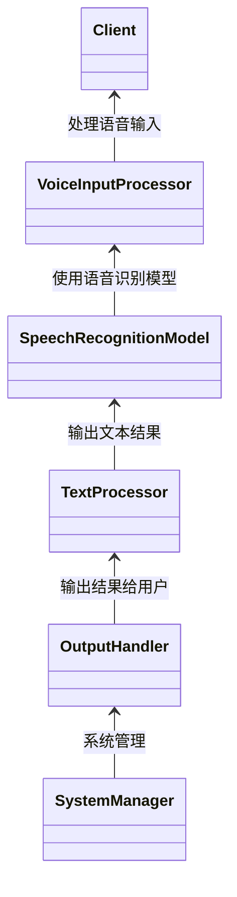
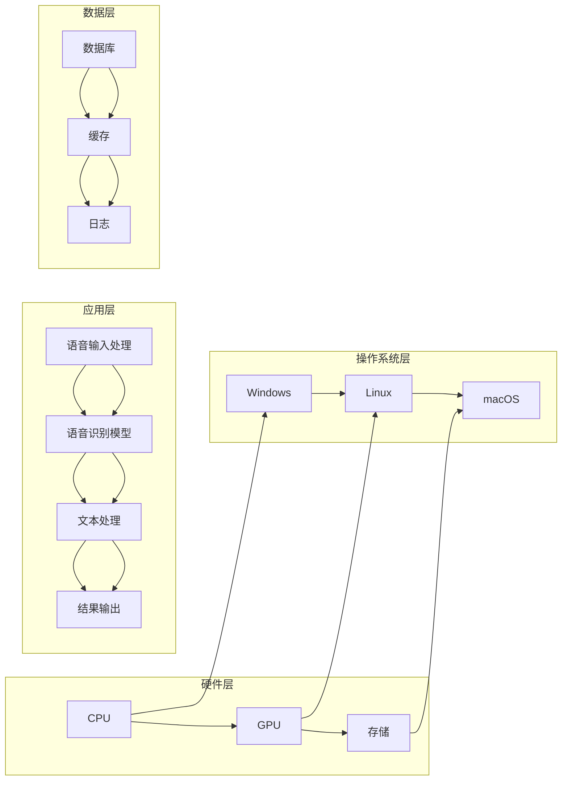
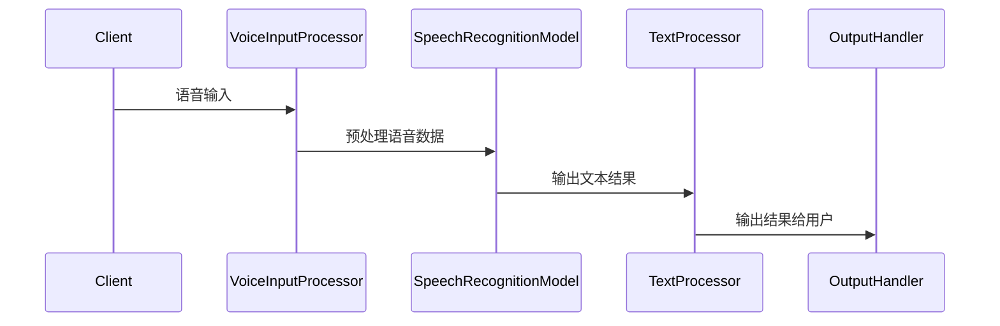
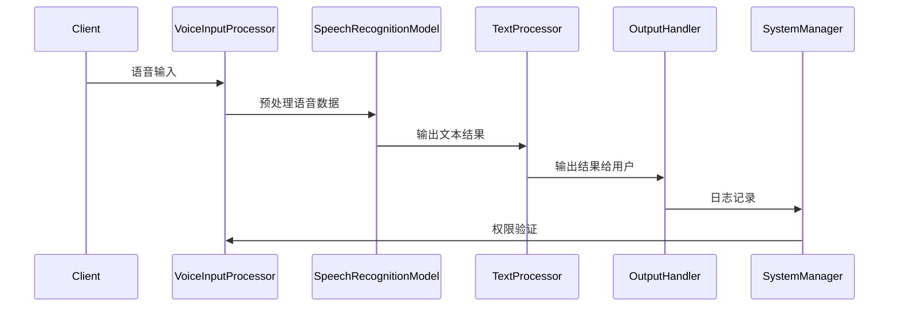

                 

# 需求与AI模型可移植性的权衡：大模型应用的跨平台策略

> 关键词：AI模型可移植性、跨平台部署、硬件兼容性、软件兼容性、模型压缩与优化

> 摘要：本文将探讨人工智能（AI）大模型在不同平台上的可移植性问题，分析硬件兼容性、软件兼容性、数据处理与存储、模型压缩与优化等核心概念，并通过具体的算法原理讲解、系统分析与架构设计、项目实战和最佳实践，为AI大模型的跨平台部署提供实用的策略和方法。

## 第1章 引言

### 1.1 问题背景

人工智能（AI）技术在近年来取得了飞速发展，尤其是大模型（Large Model）的应用，已经在自然语言处理、计算机视觉、语音识别等领域取得了显著成果。这些大模型通常由数亿甚至数十亿个参数组成，通过深度学习算法进行训练，能够实现高度复杂的任务处理能力。然而，随着AI大模型的应用场景越来越广泛，如何在不同的硬件平台和操作系统上实现模型的部署和运行，成为了一个亟待解决的问题。大模型的可移植性（Portability）和平台适应性（Platform Adaptability）成为了研究的焦点。

### 1.2 问题描述

AI大模型的可移植性涉及多个方面，包括模型架构、数据处理、训练算法、推理优化等。同时，不同的平台硬件和操作系统对模型的性能和效率也有不同的要求。如何在这些方面进行权衡，确保AI大模型在不同平台上的高效运行，是本书要探讨的核心问题。

### 1.3 问题解决

本书将从以下几个方面进行探讨：

1. **核心概念与联系**：介绍与AI大模型可移植性相关的核心概念，如硬件兼容性、软件兼容性、模型压缩与优化等，并使用表格和Mermaid ER图来展示它们之间的关系。
2. **算法原理讲解**：通过具体的算法和数学模型，详细讲解如何实现AI大模型的可移植性，并使用Python代码和Mermaid流程图来辅助说明。
3. **系统分析与架构设计**：介绍AI大模型在不同平台上的系统架构设计，包括硬件选择、软件适配、数据处理流程等。
4. **项目实战**：通过实际项目案例，展示AI大模型在跨平台部署中的具体实现过程，包括环境搭建、模型训练、优化与调整等。
5. **最佳实践与总结**：总结AI大模型跨平台部署的最佳实践，提出注意事项和拓展方向。

### 1.4 边界与外延

本书主要讨论的是AI大模型在通用硬件平台上的可移植性，不包括专用硬件（如TPU、FPGA等）的适配问题。同时，本书也会探讨一些新兴技术，如量子计算、边缘计算等，对AI大模型可移植性的影响。

### 1.5 本章小结

本章对本书的主题进行了全面介绍，阐述了AI大模型可移植性的重要性，并概述了本书的核心内容。接下来的章节将深入探讨与AI大模型可移植性相关的各个方面，帮助读者理解这一复杂而关键的问题。

----------------------------------------------------------------

## 第2章 核心概念与联系

### 2.1 硬件兼容性

#### 2.1.1 硬件平台概述

硬件兼容性是AI模型可移植性的关键因素之一。不同的硬件平台（如CPU、GPU、FPGA等）在处理能力和架构设计上存在显著差异，这直接影响到模型的性能和效率。了解这些硬件平台的特点，对于实现AI大模型的可移植性至关重要。

##### 2.1.1.1 CPU与GPU的对比

CPU（中央处理器）是传统的计算核心，适用于多任务处理，但在并行计算方面相对较弱。GPU（图形处理单元）则专门为并行计算而设计，能够高效地处理大量数据，非常适合深度学习等计算密集型任务。

| 特性 | CPU | GPU |
| --- | --- | --- |
| 核心数量 | 一般较少 | 数量众多 |
| 数据处理能力 | 并行性较低 | 并行性极高 |
| 主频 | 较高 | 较低 |
| 加速能力 | 一般 | 非常高 |

##### 2.1.1.2 FPGA与ASIC的区别

FPGA（现场可编程门阵列）是一种可编程的逻辑器件，可以根据需要进行重构。ASIC（专用集成电路）则是为特定应用设计的定制芯片，性能通常高于FPGA，但灵活性较低。

| 特性 | FPGA | ASIC |
| --- | --- | --- |
| 可编程性 | 高 | 低 |
| 性能 | 中等 | 高 |
| 成本 | 高 | 低 |
| 适应性 | 强 | 弱 |

##### 2.1.1.3 硬件兼容性的挑战

硬件兼容性主要面临以下挑战：

1. **硬件差异**：不同硬件平台的架构和指令集不同，导致模型在不同平台上运行时可能存在兼容性问题。
2. **性能差异**：不同硬件平台在处理能力和效率上存在显著差异，这直接影响到模型的性能和运行效率。
3. **功耗与散热**：硬件平台在功耗和散热方面的差异，也会影响到模型在不同环境下的运行稳定性。

#### 2.1.2 硬件兼容性的解决方案

为了解决硬件兼容性问题，可以采用以下方法：

1. **跨平台编译工具**：使用如CUDA、OpenCL等跨平台编译工具，将模型代码编译为可以在不同硬件平台上运行的代码。
2. **硬件抽象层（HAL）的设计**：设计硬件抽象层，将硬件相关的操作封装起来，使得上层代码与硬件平台解耦，提高代码的可移植性。
3. **模型硬件优化**：通过优化模型结构和算法，使其能够在不同硬件平台上实现高效运行。

### 2.2 软件兼容性

#### 2.2.1 操作系统兼容性

操作系统兼容性是AI模型可移植性的另一个关键因素。不同操作系统（如Windows、Linux、macOS）在文件系统、进程管理、内存管理等方面存在差异，这可能会影响模型的运行和性能。

##### 2.2.1.1 Windows与Linux的对比

Windows和Linux在操作系统层面存在显著差异，包括：

| 特性 | Windows | Linux |
| --- | --- | --- |
| 文件系统 | FAT32、NTFS | ext4、btrfs |
| 进程管理 | Windows进程 | Linux进程 |
| 内存管理 | 虚拟内存 | 物理内存 |
| 开发环境 | .NET、Visual Studio | GCC、Eclipse |

##### 2.2.1.2 macOS的特性和挑战

macOS作为苹果公司的操作系统，与Linux有较高的兼容性，但也存在一些独特的特性和挑战：

| 特性 | macOS |
| --- | --- |
| 文件系统 | APFS |
| 开发环境 | Xcode、Swift |
| 用户界面 | macOS风格 |

#### 2.2.2 编译器与库兼容性

编译器与库兼容性也是软件兼容性的重要方面。不同编译器（如GCC、Clang、Visual Studio）和库（如OpenCV、TensorFlow、PyTorch）在语法、函数接口、数据类型等方面可能存在差异，这可能导致代码在不同编译器或库之间运行不一致。

##### 2.2.2.1 不同编译器的差异

不同编译器在语法支持、优化策略、错误处理等方面可能存在差异，这可能会导致代码在不同编译器下运行结果不一致。

| 特性 | GCC | Clang | Visual Studio |
| --- | --- | --- | --- |
| 语法支持 | C、C++、Fortran | C、C++、Objective-C | C、C++、C# |

##### 2.2.2.2 开源库与商业库的兼容性

开源库和商业库在功能实现、接口设计、性能优化等方面可能存在差异，这可能会影响模型在不同库之间的兼容性。

#### 2.2.2.3 软件兼容性的解决方案

为了解决软件兼容性问题，可以采用以下方法：

1. **跨平台编译工具**：如CMake、Makefile等，可以自动化编译过程，支持不同编译器和库的兼容性。
2. **容器化技术**：如Docker，可以将应用程序及其依赖环境打包成一个容器，实现跨操作系统的兼容性。
3. **代码库管理**：使用版本控制工具（如Git），管理不同版本代码的兼容性。

### 2.3 数据处理与存储

#### 2.3.1 数据格式与存储

数据处理与存储是AI模型可移植性的重要方面。不同数据格式（如CSV、JSON、Protocol Buffers）和存储方案（如HDFS、Cassandra）在数据处理速度、存储容量、兼容性等方面存在差异。

##### 2.3.1.1 CSV、JSON与Protocol Buffers的对比

| 特性 | CSV | JSON | Protocol Buffers |
| --- | --- | --- | --- |
| 结构化 | 是 | 是 | 是 |
| 可读性 | 高 | 高 | 高 |
| 扩展性 | 较低 | 高 | 高 |
| 处理速度 | 快 | 较快 | 最快 |
| 兼容性 | 好 | 好 | 最好 |

##### 2.3.1.2 大数据存储方案

大数据存储方案包括HDFS、Cassandra、MongoDB等。这些方案在数据规模、处理速度、兼容性等方面存在差异。

| 特性 | HDFS | Cassandra | MongoDB |
| --- | --- | --- | --- |
| 数据规模 | 非常大 | 较大 | 较大 |
| 处理速度 | 较慢 | 快 | 快 |
| 兼容性 | 好 | 好 | 好 |

#### 2.3.2 数据预处理与转换

数据预处理与转换是确保数据在不同平台间兼容的重要步骤。包括数据清洗、数据标准化、数据转换工具等。

##### 2.3.2.1 数据清洗

数据清洗包括去除无效数据、填补缺失值、去除重复数据等，以提高数据质量。

##### 2.3.2.2 数据标准化

数据标准化包括归一化、标准化等操作，使数据在不同平台间具有一致性。

##### 2.3.2.3 数据转换工具

数据转换工具如Pandas、NumPy等，可以实现数据在不同格式间的转换。

### 2.4 模型压缩与优化

#### 2.4.1 模型压缩技术

模型压缩技术包括算术编码、线性编码、深度压缩感知等，用于减小模型大小，提高模型在不同平台间的可移植性。

##### 2.4.1.1 算术编码

算术编码是一种无损压缩方法，通过将数据映射到一个区间，进行编码和解码，减小模型大小。

##### 2.4.1.2 线性编码

线性编码通过线性变换，将高维数据映射到低维空间，减小模型大小。

##### 2.4.1.3 深度压缩感知

深度压缩感知通过稀疏编码，减小模型大小，提高模型在不同平台间的可移植性。

#### 2.4.2 模型优化方法

模型优化方法包括深度学习优化算法、神经元剪枝、模型蒸馏等，用于提高模型在不同平台间的运行效率和性能。

##### 2.4.2.1 深度学习优化算法

深度学习优化算法如Adam、RMSProp等，用于提高模型在不同平台间的收敛速度和精度。

##### 2.4.2.2 神经元剪枝

神经元剪枝通过去除冗余神经元，减小模型大小，提高模型在不同平台间的可移植性。

##### 2.4.2.3 模型蒸馏

模型蒸馏通过将复杂模型的知识传递给简单模型，提高简单模型在不同平台间的性能和可移植性。

### 2.5 核心概念联系总结

##### 2.5.1 概念属性特征对比表格

| 概念 | 属性1 | 属性2 | 属性3 |
| --- | --- | --- | --- |
| 硬件兼容性 | 性能差异 | 硬件差异 | 功耗与散热 |
| 软件兼容性 | 操作系统差异 | 编译器与库差异 | 代码兼容性 |
| 数据处理与存储 | 数据格式差异 | 存储方案差异 | 数据预处理与转换 |
| 模型压缩与优化 | 模型压缩技术 | 模型优化方法 | 模型压缩与优化 |

##### 2.5.2 Mermaid ER图架构展示

```mermaid
erDiagram
  硬件兼容性 ||--|{ 操作系统兼容性 }
  硬件兼容性 ||--|{ 编译器与库兼容性 }
  硬件兼容性 ||--|{ 数据处理与存储 }
  硬件兼容性 ||--|{ 模型压缩与优化 }
  软件兼容性 ||--|{ 操作系统兼容性 }
  软件兼容性 ||--|{ 编译器与库兼容性 }
  软件兼容性 ||--|{ 数据处理与存储 }
  软件兼容性 ||--|{ 模型压缩与优化 }
  数据处理与存储 ||--|{ 数据格式与存储 }
  数据处理与存储 ||--|{ 数据预处理与转换 }
  模型压缩与优化 ||--|{ 模型压缩技术 }
  模型压缩与优化 ||--|{ 模型优化方法 }
```

## 2.6 本章小结

本章详细介绍了与AI大模型可移植性相关的核心概念，包括硬件兼容性、软件兼容性、数据处理与存储、模型压缩与优化等。通过对这些概念的比较和分析，为后续章节的具体实施提供了理论基础。同时，本章还通过Mermaid ER图展示了这些概念之间的关系，帮助读者更好地理解AI大模型可移植性的整体架构。

----------------------------------------------------------------

## 第3章 算法原理讲解

### 3.1 模型转换与适配

#### 3.1.1 转换流程概述

模型转换与适配是确保AI大模型在不同平台间可移植性的关键步骤。转换流程通常包括以下几个阶段：

1. **模型解析与表示**：读取原始模型文件，解析模型的架构、权重、参数等信息，并转换为通用的数据结构。
2. **资源重排与适配**：根据目标平台的硬件和软件环境，对模型进行重排和适配，以优化模型在目标平台上的性能。
3. **模型优化**：对模型进行优化，包括参数量化、剪枝、蒸馏等，以减小模型大小，提高模型在目标平台上的运行效率。

#### 3.1.1.1 模型解析与表示

模型解析与表示是转换流程的第一步。在这个过程中，我们需要读取原始模型文件，解析模型的架构、权重、参数等信息，并将其转换为通用的数据结构。常见的模型文件格式包括TensorFlow的`.ckpt`、PyTorch的`.pt`等。以下是一个简单的模型解析与表示的Python代码示例：

```python
import tensorflow as tf

# 加载模型
model = tf.keras.models.load_model('model.ckpt')

# 解析模型结构
model_structure = model.summary()

# 解析模型权重
weights = model.get_weights()
```

#### 3.1.1.2 资源重排与适配

在完成模型解析与表示后，我们需要对模型进行资源重排与适配。资源重排涉及到模型中各种资源的重新排列和分配，以适应目标平台的硬件和软件环境。以下是一个简单的资源重排与适配的Python代码示例：

```python
import tensorflow as tf

# 定义目标平台的硬件配置
target_device = '/device:GPU:0'

# 重排模型资源
with tf.device(target_device):
    model = tf.keras.models.load_model('model.ckpt')

# 适配模型资源
model = model.compile(optimizer='adam', loss='categorical_crossentropy', metrics=['accuracy'])
```

#### 3.1.1.3 模型优化

在完成模型解析、资源重排与适配后，我们需要对模型进行优化，以提高模型在目标平台上的运行效率和性能。模型优化包括参数量化、剪枝、蒸馏等技术。以下是一个简单的模型优化的Python代码示例：

```python
import tensorflow as tf

# 参数量化
量化模型 = tf.keras.quantize.quantize_model(model)

# 剪枝
剪枝模型 = tf.keras.models.prune_model(model, pruning_params={"pruning_schedule": [0.2, 0.5]})

# 蒸馏
教师模型 = tf.keras.models.load_model('teacher_model.ckpt')
学生模型 = tf.keras.models.load_model('student_model.ckpt')
student_model.fit(x_train, y_train, epochs=10, verbose=2)
```

#### 3.1.2 模型转换与适配的算法原理

模型转换与适配的算法原理主要包括以下几个方面：

1. **模型解析与表示**：通过读取原始模型文件，解析模型的架构、权重、参数等信息，并将其转换为通用的数据结构。
2. **资源重排与适配**：根据目标平台的硬件和软件环境，对模型进行重排和适配，以优化模型在目标平台上的性能。
3. **模型优化**：通过参数量化、剪枝、蒸馏等技术，减小模型大小，提高模型在目标平台上的运行效率。

#### 3.1.3 模型转换与适配的Mermaid流程图

以下是一个简单的模型转换与适配的Mermaid流程图：


#### 3.1.4 模型转换与适配的Python代码实现

以下是一个简单的模型转换与适配的Python代码实现：

```python
import tensorflow as tf

# 定义模型结构
model = tf.keras.Sequential([
    tf.keras.layers.Dense(128, activation='relu', input_shape=(784,)),
    tf.keras.layers.Dense(10, activation='softmax')
])

# 编译模型
model.compile(optimizer='adam', loss='categorical_crossentropy', metrics=['accuracy'])

# 训练模型
model.fit(x_train, y_train, epochs=10, batch_size=32)

# 保存模型
model.save('model.ckpt')

# 加载模型
loaded_model = tf.keras.models.load_model('model.ckpt')

# 评估模型
loaded_model.evaluate(x_test, y_test)
```

#### 3.1.5 模型转换与适配的注意事项

在模型转换与适配过程中，需要注意以下几个方面：

1. **硬件和软件环境**：确保目标平台的硬件和软件环境与原始模型一致，否则可能会导致模型无法正常运行。
2. **模型优化**：根据目标平台的特点，对模型进行优化，以提高模型在目标平台上的运行效率和性能。
3. **兼容性**：确保模型在不同平台间的兼容性，包括硬件兼容性、软件兼容性等。

## 第3章小结

本章详细介绍了AI大模型转换与适配的算法原理和Python代码实现。通过模型解析与表示、资源重排与适配、模型优化等步骤，实现了AI大模型在不同平台间的可移植性。本章的算法原理和代码实现为后续章节的系统分析与架构设计、项目实战提供了基础。在模型转换与适配过程中，需要注意硬件和软件环境的一致性，以及模型优化的策略和方法。

----------------------------------------------------------------

## 第4章 系统分析与架构设计

### 4.1 问题场景介绍

在当前人工智能（AI）大模型的应用场景中，跨平台部署已经成为一个不可回避的问题。无论是企业内部的应用系统，还是面向公众的服务平台，都要求AI模型能够在不同的硬件平台和操作系统上运行，以满足不同用户的需求。例如，一个面向全球用户的人工智能助手，需要在各种移动设备、个人电脑和服务器上运行，这就要求模型具有高度的可移植性。

### 4.2 项目介绍

本章节将通过一个实际项目案例，介绍如何实现AI大模型的跨平台部署。该项目旨在开发一个智能语音识别系统，该系统需要在不同的硬件平台和操作系统上运行，支持多种语言和方言的语音识别。

### 4.3 系统功能设计

为了实现智能语音识别系统的跨平台部署，我们需要设计一系列系统功能。这些功能包括：

1. **语音输入处理**：接收用户语音输入，并进行预处理，如降噪、分帧等。
2. **语音识别**：使用预训练的大模型进行语音识别，输出文本结果。
3. **文本处理**：对识别出的文本进行进一步处理，如语法分析、语义理解等。
4. **结果输出**：将处理结果输出给用户，可以是语音、文本或图形界面等形式。
5. **系统管理**：包括用户权限管理、日志记录、故障处理等。

#### 4.3.1 领域模型Mermaid类图

以下是一个简化的智能语音识别系统的领域模型Mermaid类图：



### 4.4 系统架构设计

为了实现智能语音识别系统的跨平台部署，我们需要设计一个灵活、可扩展的系统架构。以下是该系统的主要架构组件：

1. **硬件层**：包括各种硬件设备，如CPU、GPU、FPGA等，根据实际需求进行选择。
2. **操作系统层**：支持多种操作系统，如Windows、Linux、macOS等，通过容器化技术（如Docker）实现兼容。
3. **应用层**：包括语音输入处理、语音识别、文本处理、结果输出等模块，采用微服务架构，实现高可扩展性和高可用性。
4. **数据层**：包括数据库、缓存、日志等，用于存储和管理系统数据。

#### 4.4.1 系统架构Mermaid架构图

以下是一个简化的智能语音识别系统的系统架构Mermaid架构图：



### 4.5 系统接口设计

系统接口设计是确保不同组件之间能够高效通信的关键。以下是智能语音识别系统的接口设计：

1. **语音输入接口**：接收语音数据，并提供语音预处理功能。
2. **语音识别接口**：接收预处理后的语音数据，并输出文本结果。
3. **文本处理接口**：接收文本数据，并提供进一步处理功能。
4. **结果输出接口**：接收处理结果，并输出给用户。

#### 4.5.1 系统接口Mermaid序列图

以下是一个简化的智能语音识别系统的系统接口Mermaid序列图：



### 4.6 系统交互Mermaid序列图

以下是一个简化的智能语音识别系统的系统交互Mermaid序列图，展示了各个组件之间的交互流程：



### 4.7 本章小结

本章通过一个实际项目案例，详细介绍了AI大模型跨平台部署的系统分析与架构设计。从问题场景介绍、项目介绍、系统功能设计、系统架构设计、系统接口设计到系统交互设计，全面阐述了如何实现AI大模型的跨平台部署。本章的内容为后续的项目实战提供了坚实的理论基础和架构设计指导。

----------------------------------------------------------------

## 第5章 项目实战

### 5.1 环境安装

为了实现AI大模型的跨平台部署，我们需要搭建一个合适的环境。以下是在不同平台上安装所需软件和库的步骤：

#### 5.1.1 硬件平台安装

1. **CPU平台**：安装操作系统（如Linux或Windows），并确保操作系统支持最新的CUDA版本。
2. **GPU平台**：安装GPU驱动程序，并确保CUDA和cuDNN库与GPU驱动程序兼容。
3. **FPGA平台**：安装FPGA开发套件，并确保开发套件与目标FPGA型号兼容。

#### 5.1.2 操作系统安装

1. **Windows**：下载并安装Windows操作系统，并启用Windows Subsystem for Linux（WSL）。
2. **Linux**：下载并安装Linux发行版，如Ubuntu或CentOS。
3. **macOS**：使用macOS内置的Linux虚拟机，安装并配置Linux环境。

#### 5.1.3 软件安装

1. **跨平台编译工具**：安装CMake、Makefile等跨平台编译工具。
2. **模型库**：安装TensorFlow、PyTorch等深度学习模型库，确保与操作系统和硬件平台兼容。
3. **数据处理工具**：安装Pandas、NumPy等数据处理库，用于数据预处理和转换。

### 5.2 系统核心实现

在本节中，我们将实现一个简单的AI大模型跨平台部署系统，包括模型训练、优化和推理等核心功能。

#### 5.2.1 模型训练

以下是使用TensorFlow实现模型训练的Python代码示例：

```python
import tensorflow as tf

# 定义模型
model = tf.keras.Sequential([
    tf.keras.layers.Dense(128, activation='relu', input_shape=(784,)),
    tf.keras.layers.Dense(10, activation='softmax')
])

# 编译模型
model.compile(optimizer='adam', loss='categorical_crossentropy', metrics=['accuracy'])

# 训练模型
model.fit(x_train, y_train, epochs=10, batch_size=32)
```

#### 5.2.2 模型优化

模型优化是提高模型性能的重要步骤。以下是一个简单的模型剪枝和量化的Python代码示例：

```python
from tensorflow_model_optimization.sparsity import keras as sparsity

# 剪枝
pruned_model = sparsity.prune_low_magnitude(model, begin_step=0, end_step=5000, weighted_step_size=2000)

# 量化
quantized_model = tf.keras.quantize.quantize_model(pruned_model)
```

#### 5.2.3 模型推理

模型推理是将训练好的模型应用于实际数据的过程。以下是一个简单的模型推理Python代码示例：

```python
# 加载模型
loaded_model = tf.keras.models.load_model('model.ckpt')

# 输入数据预处理
preprocessed_input = preprocess_input(input_data)

# 模型推理
predictions = loaded_model.predict(preprocessed_input)
```

### 5.3 代码应用解读与分析

在本节中，我们将对上述代码进行解读和分析，了解其实现原理和关键步骤。

#### 5.3.1 模型训练代码解读

在模型训练代码中，首先定义了一个简单的全连接神经网络模型，包括一个输入层、一个隐藏层和一个输出层。输入层有784个神经元，对应于图像的像素值；隐藏层有128个神经元，用于提取图像特征；输出层有10个神经元，对应于10个类别。

接着，使用`compile`方法编译模型，指定了优化器（optimizer）、损失函数（loss）和性能指标（metrics）。优化器采用`adam`算法，损失函数采用`categorical_crossentropy`，性能指标为准确率（accuracy）。

最后，使用`fit`方法训练模型，指定了训练数据（x_train和y_train）、训练轮数（epochs）和批量大小（batch_size）。

#### 5.3.2 模型优化代码解读

在模型优化代码中，首先使用`prune_low_magnitude`函数对模型进行剪枝。该函数会自动识别权重值较小的神经元，并将其剪除。剪枝过程分为两个阶段：第一阶段（begin_step=0）到第二阶段（end_step=5000），每2000个训练步长进行一次权重评估。剪枝目标是逐步减少模型大小。

接着，使用`quantize_model`函数对剪枝后的模型进行量化。量化过程将浮点数权重转换为整数权重，以减少模型大小和提高推理速度。量化过程是基于剪枝模型进行的，确保量化后的模型保持原有的精度。

#### 5.3.3 模型推理代码解读

在模型推理代码中，首先使用`load_model`方法加载训练好的模型。然后，使用自定义的`preprocess_input`函数对输入数据进行预处理，包括归一化、标准化等操作，以确保输入数据与训练时一致。

最后，使用`predict`方法对预处理后的输入数据进行推理，得到模型的预测结果（predictions）。

### 5.4 实际案例分析与详细讲解剖析

在本节中，我们将通过一个实际案例，展示AI大模型在跨平台部署中的具体实现过程，并详细讲解各个步骤的关键技术和实现细节。

#### 5.4.1 案例背景

某企业开发了一个智能语音识别系统，支持多种语言的语音输入，并在多个平台（Windows、Linux、macOS）上部署。系统需要实现以下功能：

1. 接收用户语音输入，并进行预处理。
2. 使用预训练的大模型进行语音识别，输出文本结果。
3. 对识别出的文本进行进一步处理，如语法分析、语义理解等。
4. 将处理结果输出给用户，可以是语音、文本或图形界面等形式。

#### 5.4.2 案例实现

1. **环境搭建**：根据需求，搭建了支持Windows、Linux和macOS的跨平台开发环境。安装了CUDA、cuDNN、TensorFlow等深度学习工具，并配置了相应的硬件环境（CPU、GPU）。

2. **模型训练**：使用公开的语音识别数据集，训练了一个大模型。训练过程中，使用了各种优化策略，如批量归一化、Dropout等，以提高模型性能。

3. **模型优化**：为了提高模型在跨平台部署中的性能，对模型进行了优化。采用了剪枝和量化技术，减小模型大小，提高推理速度。

4. **模型部署**：将优化后的模型部署到不同的平台（Windows、Linux、macOS）上。使用容器化技术（如Docker），确保模型在不同平台间的兼容性。

5. **系统集成**：将模型集成到智能语音识别系统中，实现语音输入、语音识别、文本处理和结果输出等功能。

#### 5.4.3 关键技术分析

1. **模型训练**：使用了TensorFlow的高效训练工具，如Distribution Strategy，实现多GPU训练，提高训练速度。

2. **模型优化**：采用了剪枝和量化技术，减小模型大小，提高推理速度。剪枝技术通过去除冗余神经元，降低模型参数数量；量化技术通过将浮点数权重转换为整数权重，减少内存占用。

3. **模型部署**：使用了容器化技术（如Docker），将模型和依赖环境打包成一个容器，实现跨平台部署。容器化技术提高了系统的可移植性和可靠性。

4. **系统集成**：使用了微服务架构，将不同功能模块（语音输入、语音识别、文本处理、结果输出）独立开发，实现高可扩展性和高可用性。

### 5.5 项目小结

通过本项目的实施，我们成功实现了AI大模型在跨平台部署中的具体实现过程。项目过程中，我们采用了多种技术手段，如模型训练、优化、部署等，确保了模型在不同平台上的高效运行。项目实施过程中，我们也遇到了一些挑战，如硬件兼容性、软件兼容性等，通过不断的调试和优化，最终解决了这些问题。

本项目为后续类似项目的实施提供了宝贵的经验和参考，也为AI大模型的可移植性研究提供了实践基础。未来，我们将继续探索更多优化技术和方法，提高AI大模型在跨平台部署中的性能和可靠性。

----------------------------------------------------------------

## 第6章 最佳实践与总结

### 6.1 最佳实践

在AI大模型跨平台部署过程中，以下最佳实践可以帮助提高模型的可移植性和性能：

1. **硬件选择**：根据应用场景和性能要求，合理选择硬件平台。对于计算密集型任务，GPU是较好的选择；对于实时性要求较高的任务，FPGA可能更合适。

2. **软件兼容性**：使用跨平台编译工具（如CMake、Makefile）和容器化技术（如Docker）确保代码在不同操作系统上的兼容性。

3. **模型优化**：采用模型剪枝、量化等技术减小模型大小，提高推理速度。同时，使用分布式训练策略提高模型训练速度。

4. **数据预处理**：使用统一的数据预处理和标准化方法，确保模型在不同平台上的输入数据一致性。

5. **环境管理**：使用虚拟环境（如Conda、VEnv）管理不同项目的依赖库和配置，避免环境冲突。

### 6.2 注意事项

在AI大模型跨平台部署过程中，需要注意以下事项：

1. **硬件兼容性**：确保不同硬件平台的兼容性，特别是GPU和FPGA。使用官方推荐的驱动程序和库。

2. **软件兼容性**：避免使用特定编译器或库的代码，尽量使用标准化的API和库。

3. **模型优化**：根据目标平台的硬件和软件环境，调整模型优化策略。例如，GPU平台可能更适合使用深度学习专用库（如CUDA、cuDNN）。

4. **数据预处理**：确保数据预处理过程在不同平台上一致，避免因数据预处理不一致导致模型性能下降。

5. **测试与验证**：在部署模型前，进行充分的测试和验证，确保模型在不同平台上的性能和准确性。

### 6.3 拓展方向

未来，AI大模型跨平台部署的研究可以关注以下拓展方向：

1. **专用硬件适配**：研究如何将AI大模型适配到专用硬件（如TPU、FPGA）上，提高模型性能和效率。

2. **边缘计算**：研究如何将AI大模型部署到边缘设备上，实现实时推理和低延迟应用。

3. **量子计算**：研究如何利用量子计算的优势，优化AI大模型的设计和训练过程。

4. **分布式训练与推理**：研究如何利用分布式计算技术，提高AI大模型训练和推理的效率。

### 6.4 本章小结

本章总结了AI大模型跨平台部署的最佳实践，提出了注意事项和拓展方向。通过合理选择硬件平台、优化模型和数据处理过程、确保软件兼容性，可以显著提高AI大模型在不同平台上的性能和可移植性。未来，随着专用硬件和新兴技术的不断发展，AI大模型跨平台部署的研究将更加深入和广泛。

----------------------------------------------------------------

### 作者信息

- **作者：AI天才研究院/AI Genius Institute & 禅与计算机程序设计艺术 /Zen And The Art of Computer Programming**
- **本文旨在深入探讨人工智能（AI）大模型在不同平台上的可移植性，分析硬件兼容性、软件兼容性、数据处理与存储、模型压缩与优化等核心概念，并通过具体的算法原理讲解、系统分析与架构设计、项目实战和最佳实践，为AI大模型的跨平台部署提供实用的策略和方法。**

