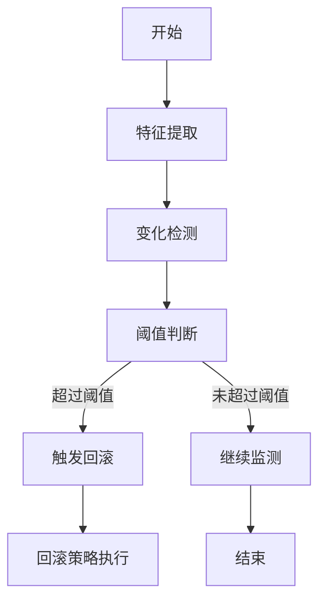
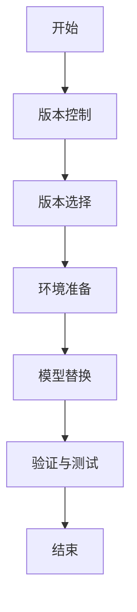
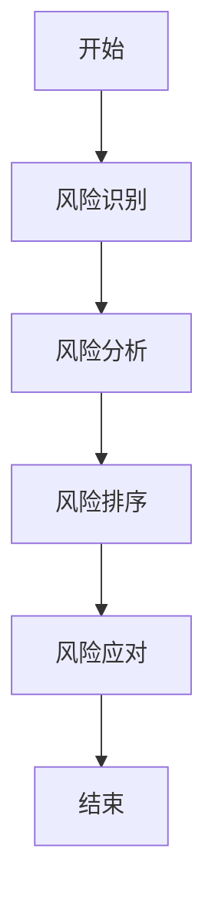
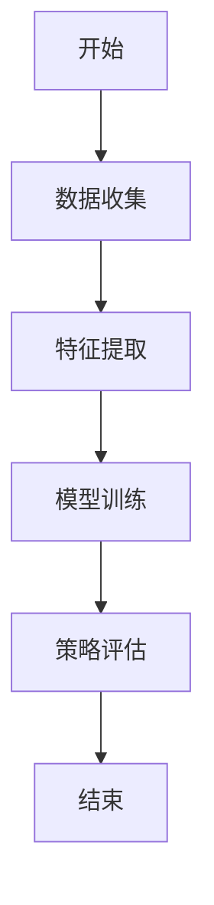
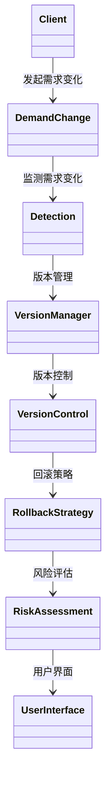
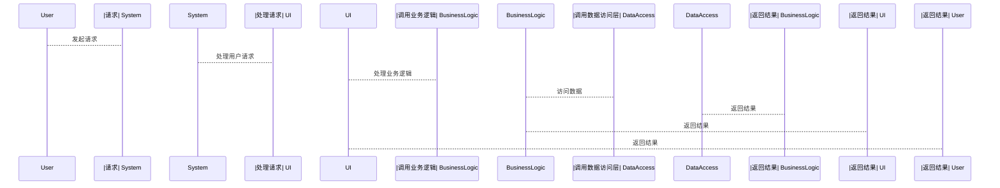
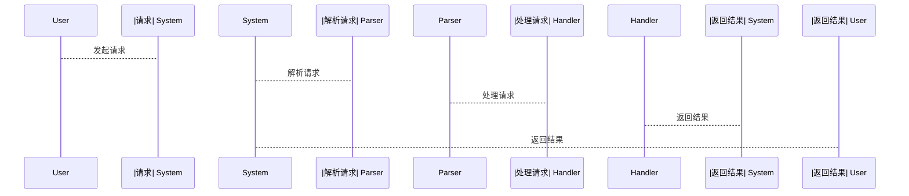
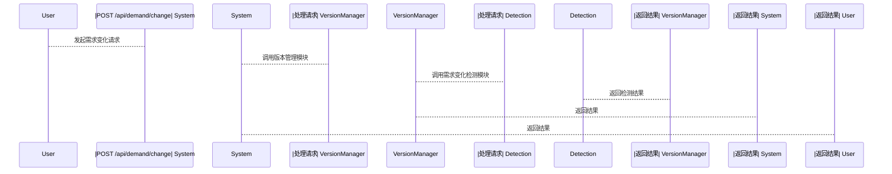

                 

## 需求与AI模型版本回滚策略：大模型应用的风险管理

> 关键词：需求变化，AI模型回滚，风险管理，大模型应用，算法原理，系统架构设计

> 摘要：本文深入探讨了在需求变化背景下，AI模型版本回滚策略的必要性和重要性。通过详细分析需求变化的影响、AI模型版本回滚的基本概念及其设计原则，本文进一步探讨了回滚策略实施的影响评估和风险管理策略。文章还介绍了需求分析、AI模型版本管理和风险评估等核心概念，以及相关的算法原理和数学模型。通过系统分析与架构设计，本文提供了一个全面的技术框架，旨在帮助开发者在大模型应用过程中有效地管理风险。

## 目录大纲

### 第一部分：问题背景与概述

1. 引言
    - 需求变化与AI模型回滚的必要性
    - AI模型版本回滚的挑战与风险
    - 本书内容结构安排
2. 需求变化的影响
    - 需求变化的原因
    - 需求变化对AI模型的影响
    - 需求变化管理的策略
3. AI模型版本回滚的基本概念
    - AI模型版本回滚的定义
    - AI模型版本回滚的类型
    - AI模型版本回滚的目的与意义
4. 回滚策略设计与实施
    - 回滚策略设计的原则
    - 回滚策略的实施流程
    - 回滚策略的影响评估
5. 风险管理概述
    - 风险管理的概念与框架
    - 风险管理的基本流程
    - 风险管理策略与方法
6. 本章小结

### 第二部分：核心概念与联系

1. 需求分析
    - 需求分析的定义与作用
    - 需求分析的过程与方法
    - 需求分析中的核心概念
2. AI模型版本管理
    - AI模型版本管理的定义与重要性
    - AI模型版本管理的流程
    - AI模型版本管理的工具与框架
3. 风险评估与识别
    - 风险评估的定义与目的
    - 风险评估的方法与工具
    - 风险识别的核心概念与流程
4. 回滚策略设计
    - 回滚策略设计的原则
    - 回滚策略的设计方法
    - 回滚策略设计中的核心概念
5. 概念联系与互动
    - 需求分析、AI模型版本管理与回滚策略的互动
    - 风险评估与回滚策略的关系
    - 核心概念的整合与应用
6. 本章小结

### 第三部分：算法原理与数学模型

1. 需求变化的检测算法
    - 算法原理介绍
    - 算法流程图
    - 数学模型与公式
    - 算法举例说明
2. AI模型版本回滚算法
    - 算法原理介绍
    - 算法流程图
    - 数学模型与公式
    - 算法举例说明
3. 风险评估算法
    - 算法原理介绍
    - 算法流程图
    - 数学模型与公式
    - 算法举例说明
4. 回滚策略优化算法
    - 算法原理介绍
    - 算法流程图
    - 数学模型与公式
    - 算法举例说明
5. 算法比较与整合
    - 各算法的比较
    - 算法的整合策略
    - 核心算法的应用场景
6. 本章小结

### 第四部分：系统分析与架构设计

1. 问题场景介绍
    - 问题背景
    - 项目目标
    - 问题定义
2. 系统功能设计
    - 需求分析
    - 功能模块划分
    - 领域模型（Mermaid类图）
3. 系统架构设计
    - 架构设计原则
    - 系统架构设计（Mermaid架构图）
    - 系统分层架构
4. 系统接口设计
    - 接口规范
    - 接口定义
    - 接口交互流程（Mermaid序列图）
5. 系统交互设计
    - 系统交互流程
    - 用户界面设计
    - 系统交互效果评估
6. 本章小结

## 第一部分：问题背景与概述

### 1. 引言

在现代人工智能（AI）应用中，模型的需求往往不是一成不变的。需求的不断变化可能是由于业务战略调整、市场需求变化、用户体验反馈等多种原因引起的。面对这些变化，AI模型的版本回滚策略显得尤为重要。模型回滚，即从当前部署的版本回滚到之前的版本，是一种常见的应对需求变化的技术手段。本文将详细探讨AI模型版本回滚策略在大模型应用中的风险管理。

**需求变化与AI模型回滚的必要性**

需求变化是AI模型应用中的一个普遍现象。当业务环境发生变化时，例如新的业务目标、数据分布的变化或用户偏好的变化，原有的模型可能不再适合或不再有效。在这种情况下，回滚到之前的版本成为了一种可行的选择，以确保系统的稳定性和用户满意度。

AI模型回滚的必要性主要体现在以下几个方面：

1. **保证业务连续性**：需求变化可能带来业务流程的调整，及时回滚到稳定的版本可以避免业务中断，确保业务连续性。
2. **应对性能问题**：新版本模型可能引入性能问题，如过拟合或欠拟合，导致系统性能下降。回滚到旧版本可以快速解决问题。
3. **维护用户满意度**：需求变化可能影响用户体验，新模型可能导致错误率上升或响应速度变慢。回滚到旧版本可以迅速恢复用户满意度。

**AI模型版本回滚的挑战与风险**

尽管模型回滚有其必要性，但其实施过程中也面临诸多挑战和风险：

1. **数据一致性风险**：回滚可能导致新旧数据的不一致，影响模型的准确性和可靠性。
2. **系统兼容性风险**：不同版本的模型可能与现有系统的架构或接口不兼容，导致回滚过程中出现系统崩溃或数据丢失。
3. **维护成本风险**：回滚可能涉及大量的维护工作，如修改代码、调整配置和测试验证，增加了维护成本。
4. **沟通协调风险**：回滚策略的制定和执行需要涉及多个部门和团队，沟通协调不畅可能导致执行效率低下。

**本书内容结构安排**

本文将按照以下结构展开：

1. **问题背景与概述**：介绍需求变化与AI模型回滚的必要性，挑战与风险，以及本书的结构安排。
2. **核心概念与联系**：详细讨论需求分析、AI模型版本管理、风险评估和回滚策略设计等核心概念，以及它们之间的联系和互动。
3. **算法原理与数学模型**：介绍需求变化检测算法、AI模型版本回滚算法、风险评估算法和回滚策略优化算法的原理和数学模型。
4. **系统分析与架构设计**：通过具体问题场景，系统功能设计，系统架构设计，系统接口设计和系统交互设计，提供一个全面的技术框架。

### 1.2 需求变化的影响

**需求变化的原因**

需求变化是多种因素综合作用的结果。以下是一些常见的原因：

1. **市场变化**：随着市场环境的不断变化，客户需求也在不断演变。新市场的出现或市场趋势的变化可能导致原有需求过时。
2. **技术进步**：技术的快速发展使得某些需求变得更加复杂或精细。例如，大数据和云计算技术的进步使得数据处理和存储能力大大提升，从而可能需要调整原有的数据处理需求。
3. **用户反馈**：用户的实际使用体验和反馈是需求变化的重要来源。用户对现有系统的不满或对新功能的期望可能导致需求调整。
4. **业务战略调整**：企业业务战略的调整也可能导致需求的变化。例如，为了实现新的业务目标，企业可能需要重新定义业务流程和数据处理需求。

**需求变化对AI模型的影响**

需求变化对AI模型的影响是多方面的：

1. **模型准确性下降**：当需求发生变化时，原有的模型可能不再适应新的数据分布或业务场景，导致模型准确性下降。
2. **模型性能下降**：新需求可能导致模型计算资源需求增加，或模型结构需要调整，从而影响模型的性能。
3. **模型效率降低**：随着数据量的增加或数据复杂度的提高，模型可能需要更多的时间和资源来完成训练和预测任务。
4. **模型成本增加**：满足新需求可能需要购买新的硬件或软件资源，从而增加模型成本。

**需求变化管理的策略**

为了有效管理需求变化，以下策略可以提供帮助：

1. **定期需求评审**：定期对需求进行评审，确保需求与当前业务目标和技术能力相匹配。
2. **灵活的需求管理**：采用灵活的需求管理方法，如敏捷开发或迭代开发，以快速响应需求变化。
3. **持续集成与持续部署（CI/CD）**：通过CI/CD流程，快速将新的需求转化为实际模型，并部署到生产环境中。
4. **风险评估与控制**：在需求变化过程中，进行风险评估和控制，以减少需求变化带来的风险。

### 1.3 AI模型版本回滚的基本概念

**AI模型版本回滚的定义**

AI模型版本回滚是指在AI模型应用过程中，从当前部署的模型版本回滚到之前的版本。这个过程通常发生在需求变化或模型性能下降时，以恢复系统的稳定性和性能。

**AI模型版本回滚的类型**

AI模型版本回滚可以分为以下几种类型：

1. **完全回滚**：将当前模型完全替换为之前的版本，通常用于性能严重下降或需求变化导致模型无效的情况。
2. **部分回滚**：仅回滚模型中的一部分，例如特定的预测模块或数据预处理步骤，以减少对系统的影响。
3. **版本迭代回滚**：在模型版本迭代过程中，回滚到之前的版本以解决新版本引入的问题。

**AI模型版本回滚的目的与意义**

AI模型版本回滚的目的是为了：

1. **恢复系统稳定性**：当新版本模型导致系统性能下降或用户体验恶化时，回滚到旧版本可以迅速恢复系统的稳定性。
2. **减少业务中断**：通过快速回滚，可以减少因需求变化或模型问题导致的业务中断，确保业务连续性。
3. **优化模型性能**：在需求变化后，通过回滚到旧版本，可以在不影响业务的前提下，进行进一步的模型优化和调整。

**AI模型版本回滚的基本概念**

AI模型版本回滚涉及以下基本概念：

1. **版本控制**：对AI模型的不同版本进行管理和记录，确保每个版本的稳定性和可追溯性。
2. **模型评估**：对AI模型的性能进行评估，以确定是否需要进行回滚。
3. **回滚流程**：定义回滚的具体流程，包括回滚触发条件、回滚步骤和回滚后的验证。

### 1.4 回滚策略设计与实施

**回滚策略设计的原则**

在设计回滚策略时，应遵循以下原则：

1. **快速响应**：确保在需求变化或模型性能问题发生时，能够迅速采取行动。
2. **最小化影响**：回滚策略应尽量减少对系统其他部分的影响，确保业务的连续性。
3. **可逆性**：回滚操作应该是可逆的，以便在需要时可以再次恢复到旧版本。
4. **可测试性**：回滚策略应经过严格的测试，以确保在实际操作中能够正确执行。

**回滚策略的实施流程**

回滚策略的实施通常包括以下步骤：

1. **需求评估**：评估当前模型是否符合需求，如果不符合，则考虑回滚。
2. **性能评估**：对模型性能进行评估，确定是否需要回滚。
3. **回滚准备**：准备回滚所需的环境和资源，包括旧版本模型和相关的配置文件。
4. **回滚执行**：执行回滚操作，将当前模型替换为旧版本。
5. **验证**：验证回滚后的模型是否满足需求，并确保系统正常运行。

**回滚策略的影响评估**

在实施回滚策略后，应对其影响进行评估：

1. **性能评估**：评估回滚后模型的性能，确保其满足需求。
2. **稳定性评估**：评估系统的稳定性，确保回滚后没有引入新的问题。
3. **成本评估**：评估回滚策略的实施成本，包括时间成本和资源成本。

### 1.5 风险管理概述

**风险管理的概念与框架**

风险管理是一个系统化的过程，旨在识别、评估、控制和监控项目或组织面临的风险。其核心概念包括：

1. **风险评估**：识别项目或组织可能面临的风险，并评估其发生的可能性和影响。
2. **风险控制**：制定和实施策略，以减少或消除风险。
3. **风险监控**：持续监控风险，确保风险控制策略的有效性。

风险管理的框架通常包括以下步骤：

1. **风险识别**：识别项目或组织可能面临的所有风险。
2. **风险分析**：对识别出的风险进行分析，确定其发生的可能性和影响。
3. **风险优先级排序**：根据风险的发生可能性和影响，对风险进行排序。
4. **风险控制**：制定和实施策略，以减少或消除高优先级风险。
5. **风险监控**：持续监控风险，并根据实际情况调整风险控制策略。

**风险管理的基本流程**

风险管理的基本流程包括以下步骤：

1. **项目规划**：确定项目目标、范围和需求，为风险管理提供基础。
2. **风险识别**：通过访谈、文档审查和团队讨论等方式，识别项目可能面临的所有风险。
3. **风险分析**：对识别出的风险进行分析，确定其发生的可能性和影响。
4. **风险优先级排序**：根据风险的发生可能性和影响，对风险进行排序。
5. **风险控制**：制定和实施策略，以减少或消除高优先级风险。
6. **风险监控**：持续监控风险，并根据实际情况调整风险控制策略。
7. **风险报告**：定期生成风险报告，向项目团队和利益相关者通报风险状况。

**风险管理策略与方法**

风险管理策略和方法的选择取决于风险类型、项目特点和资源情况。以下是一些常用的风险管理策略和方法：

1. **风险规避**：通过改变项目计划或范围，避免风险的发生。
2. **风险转移**：通过购买保险或签订合同，将风险转移给第三方。
3. **风险减轻**：通过改进项目设计或增加资源，减少风险的发生可能性或影响。
4. **风险接受**：在无法避免或减轻风险时，接受风险并制定应急计划。

### 1.6 本章小结

本章介绍了需求变化与AI模型回滚策略的基本概念、必要性、影响以及相关策略和风险管理方法。需求变化是AI模型应用中的一个普遍现象，其对模型的影响不可忽视。AI模型版本回滚策略作为一种应对需求变化的技术手段，具有重要的实际意义。在回滚策略的设计和实施过程中，需要考虑多方面的因素，以确保系统的稳定性和性能。此外，有效的风险管理策略和方法对于减少需求变化带来的风险具有重要意义。通过本章的介绍，读者可以全面了解需求变化和AI模型回滚策略的相关知识，为后续章节的学习打下基础。

## 第二部分：核心概念与联系

### 2.1 需求分析

**需求分析的定义与作用**

需求分析是软件工程中的一个关键阶段，旨在理解用户需求、明确项目目标和定义系统功能。需求分析不仅关注功能需求，还包括非功能需求，如性能、安全性和可扩展性。其定义可以概括为：通过系统化和规范化的方法，收集、分析和定义用户需求，并将其转化为系统设计的基础。

需求分析在软件开发过程中的作用包括：

1. **明确项目目标**：需求分析帮助项目团队理解用户需求和期望，确保项目的目标清晰明确。
2. **指导系统设计**：需求分析的结果为系统设计提供基础，帮助设计师制定系统架构和功能模块。
3. **减少项目风险**：通过全面的需求分析，可以提前识别潜在的问题和风险，减少项目实施中的不确定性。

**需求分析的过程与方法**

需求分析通常包括以下几个过程：

1. **需求收集**：通过访谈、问卷调查、用户观察等方式，收集用户的实际需求。
2. **需求整理**：对收集到的需求进行整理和分类，识别出关键需求和功能。
3. **需求分析**：对整理后的需求进行详细分析，确定需求的具体实现方法和可行性。
4. **需求文档编制**：将分析结果编写成需求文档，包括功能需求、非功能需求、用户界面和系统约束等。

常见的需求分析方法包括：

1. **用户故事**：通过编写用户故事，将用户需求转化为具体的、可执行的条目。
2. **用例建模**：通过绘制用例图，描述系统与用户之间的交互过程。
3. **需求跟踪**：使用需求跟踪工具，记录需求的变化和实现情况，确保需求的实现和项目进度的一致性。

**需求分析中的核心概念**

需求分析中的核心概念包括：

1. **功能需求**：系统应实现的具体功能，如用户注册、数据查询等。
2. **非功能需求**：系统应满足的性能、安全性、可靠性等要求，如系统响应时间、数据加密等。
3. **用户界面需求**：系统的用户界面设计，包括布局、交互方式和视觉效果等。
4. **系统约束**：系统设计和实现过程中必须遵守的限制条件，如技术平台、开发环境等。

### 2.2 AI模型版本管理

**AI模型版本管理的定义与重要性**

AI模型版本管理是指在AI模型开发、部署和应用过程中，对模型的不同版本进行有效管理和跟踪的过程。其定义可以概括为：通过系统化的方法，记录、管理、测试和发布AI模型的各个版本，确保模型的稳定性和可追溯性。

AI模型版本管理的重要性体现在以下几个方面：

1. **模型稳定性**：通过版本管理，可以确保在不同环境中部署的模型具有相同的稳定性和性能。
2. **可追溯性**：版本管理使得模型的变更和更新具有可追溯性，有助于理解模型的演变过程。
3. **部署灵活性**：版本管理提供了在不同环境（如开发、测试、生产）之间切换的灵活性，便于模型更新和回滚。
4. **风险控制**：通过版本管理，可以更好地控制模型变更带来的风险，确保系统的稳定性和可靠性。

**AI模型版本管理的流程**

AI模型版本管理的流程通常包括以下几个步骤：

1. **模型开发**：在开发过程中，记录每个版本的代码、数据和模型配置，确保模型的可复现性。
2. **模型测试**：在测试阶段，对模型进行性能评估和功能测试，确保模型的准确性和可靠性。
3. **模型发布**：将经过测试的模型发布到相应的环境中，如开发环境、测试环境或生产环境。
4. **模型监控**：在模型部署后，监控模型的运行状态和性能，确保模型在实时应用中的稳定性。
5. **模型回滚**：在需求变化或模型出现问题时，回滚到之前的稳定版本，恢复系统的正常运行。

**AI模型版本管理的工具与框架**

AI模型版本管理可以使用多种工具和框架来实现，常见的工具和框架包括：

1. **Git**：Git是一款流行的版本控制工具，可以用于管理模型代码、数据和配置文件。
2. **Docker**：Docker提供了容器化技术，可以确保模型在不同环境中的一致性和可移植性。
3. **TensorBoard**：TensorBoard是一个可视化工具，可以用于监控模型的训练过程和性能。
4. **MLflow**：MLflow是一个开源平台，用于管理模型的生命周期，包括版本管理、跟踪和部署。

### 2.3 风险评估与识别

**风险评估的定义与目的**

风险评估是指通过系统化的方法，识别、分析和评估项目或组织面临的风险，以制定有效的风险应对策略。其定义可以概括为：在项目或组织的整个生命周期中，通过评估潜在风险的概率和影响，识别和管理这些风险的过程。

风险评估的主要目的是：

1. **识别风险**：通过评估过程，识别项目或组织可能面临的所有风险，确保风险被全面考虑。
2. **评估风险**：对识别出的风险进行定量或定性的分析，确定其发生的可能性和影响。
3. **制定风险应对策略**：根据风险评估的结果，制定相应的风险应对策略，以减少或消除风险。
4. **监控风险**：在项目执行过程中，持续监控风险的变化和应对策略的有效性。

**风险评估的方法与工具**

风险评估的方法和工具多种多样，以下是一些常见的方法和工具：

1. **定性风险评估**：通过专家评估、风险矩阵和风险清单等方法，对风险进行定性分析。
2. **定量风险评估**：通过概率分析、蒙特卡罗模拟和敏感性分析等方法，对风险进行定量分析。
3. **风险矩阵**：使用风险矩阵，将风险的概率和影响进行量化，以便进行优先级排序。
4. **SWOT分析**：通过SWOT分析（优势、劣势、机会、威胁），全面评估项目的内外部环境。
5. **风险登记册**：记录所有识别出的风险，包括风险名称、描述、概率、影响和应对策略。

**风险识别的核心概念与流程**

风险识别是风险评估的基础，其核心概念和流程包括：

1. **风险识别**：通过访谈、文档审查、团队讨论和头脑风暴等方法，识别项目可能面临的所有风险。
2. **风险分类**：将识别出的风险分类，以便更好地进行管理和分析。
3. **风险优先级排序**：根据风险的概率和影响，对风险进行优先级排序，确保资源优先分配给高优先级风险。
4. **风险记录**：将识别出的风险记录在风险登记册中，包括风险名称、描述、概率、影响和应对策略。

### 2.4 回滚策略设计

**回滚策略设计的原则**

回滚策略设计是确保在需求变化或模型问题发生时，系统能够快速、有效地回滚到稳定版本的关键。设计回滚策略时应遵循以下原则：

1. **快速响应**：回滚策略应能够快速响应需求变化或模型问题，确保系统的稳定性。
2. **最小化影响**：回滚策略应尽量减少对系统其他部分的影响，确保业务的连续性。
3. **可逆性**：回滚策略应确保回滚操作是可逆的，以便在需要时可以再次恢复到旧版本。
4. **可测试性**：回滚策略应经过严格的测试，以确保在实际操作中能够正确执行。

**回滚策略的设计方法**

回滚策略的设计方法包括以下步骤：

1. **需求分析**：了解需求变化的具体原因和影响，确定回滚的必要性和可行性。
2. **风险评估**：评估回滚过程中可能面临的风险，包括数据一致性风险、系统兼容性风险等。
3. **策略制定**：根据需求分析和风险评估的结果，制定具体的回滚策略，包括回滚触发条件、回滚步骤和回滚后的验证。
4. **测试验证**：在实施回滚策略前，进行详细的测试验证，确保策略的有效性和可靠性。
5. **文档记录**：记录回滚策略的详细步骤和操作指南，以便在需要时快速执行。

**回滚策略设计中的核心概念**

回滚策略设计中的核心概念包括：

1. **回滚触发条件**：定义何时触发回滚操作，例如模型性能下降、需求变化等。
2. **回滚步骤**：详细描述回滚操作的具体步骤，包括环境准备、模型替换、配置调整等。
3. **回滚后的验证**：确保回滚后的系统正常运行，包括性能测试、功能测试等。
4. **回滚日志记录**：记录回滚操作的详细信息，以便进行审计和故障排查。

### 2.5 概念联系与互动

**需求分析、AI模型版本管理与回滚策略的互动**

需求分析、AI模型版本管理和回滚策略是相互联系和互动的。需求分析为AI模型版本管理提供了基础，明确了系统的功能和性能要求。AI模型版本管理则确保了模型在不同环境中的稳定性和可追溯性。回滚策略则基于需求分析和版本管理的结果，确保在需求变化或模型问题发生时，系统能够快速、有效地回滚到稳定版本。

**需求分析、AI模型版本管理与回滚策略的互动**

1. **需求分析**：需求分析结果直接影响AI模型的设计和版本管理。明确的需求可以帮助版本管理团队更好地理解模型的需求，确保版本管理的有效性。
2. **AI模型版本管理**：AI模型版本管理为需求分析提供了支持，确保模型在不同环境中的稳定性和可追溯性。版本管理的结果可以为需求分析提供反馈，帮助调整需求。
3. **回滚策略**：回滚策略基于需求分析和版本管理的结果，确保在需求变化或模型问题发生时，系统能够快速、有效地回滚到稳定版本。回滚策略的制定和执行需要需求分析和版本管理提供支持。

**风险评估与回滚策略的关系**

风险评估是回滚策略制定的重要基础。通过风险评估，可以识别出潜在的风险，评估其发生的可能性和影响。这些评估结果可以直接影响回滚策略的制定：

1. **识别风险**：风险评估帮助识别出可能导致回滚的需求变化和模型问题，为回滚策略提供依据。
2. **评估影响**：风险评估评估了需求变化和模型问题的影响，帮助确定回滚的必要性和优先级。
3. **制定策略**：根据风险评估的结果，制定具体的回滚策略，包括回滚触发条件、回滚步骤和回滚后的验证。

**核心概念的整合与应用**

核心概念的整合和应用是确保AI模型在需求变化背景下能够稳定运行的关键。以下是一种整合和应用的核心概念的方法：

1. **需求分析**：通过需求分析，明确系统的功能和性能需求，为模型设计提供基础。
2. **版本管理**：通过版本管理，确保模型在不同环境中的稳定性和可追溯性，为需求分析和回滚策略提供支持。
3. **回滚策略**：根据需求分析和版本管理的结果，制定具体的回滚策略，确保在需求变化或模型问题发生时，系统能够快速、有效地回滚到稳定版本。

**本章小结**

本章详细介绍了需求分析、AI模型版本管理和风险评估等核心概念，并探讨了它们之间的联系和互动。需求分析为AI模型的设计提供了基础，AI模型版本管理确保了模型的稳定性和可追溯性，回滚策略则确保了在需求变化或模型问题发生时，系统能够快速、有效地回滚到稳定版本。通过本章的学习，读者可以全面了解这些核心概念，为后续章节的学习和应用打下基础。

### 第三部分：算法原理与数学模型

#### 3.1 需求变化的检测算法

**算法原理介绍**

需求变化的检测算法旨在识别系统需求的变化，从而触发相应的回滚策略。该算法的核心思想是通过分析用户行为数据、市场反馈和业务指标，识别需求的变化趋势。以下是一种常见的需求变化检测算法的原理：

1. **特征提取**：从用户行为数据、市场反馈和业务指标中提取关键特征，如用户访问频率、交易金额、用户满意度评分等。
2. **变化检测**：使用统计方法或机器学习模型，对提取的特征进行变化检测，识别需求的变化趋势。常见的统计方法包括时间序列分析、异常检测和趋势分析等。
3. **阈值设定**：设定一个阈值，用于判断需求是否发生变化。当特征值超过阈值时，认为需求发生了变化。

**算法流程图**



**数学模型与公式**

需求变化的检测算法通常涉及以下数学模型：

1. **时间序列模型**：如ARIMA模型、LSTM模型，用于分析时间序列数据，识别需求的变化趋势。
2. **异常检测模型**：如Isolation Forest、Local Outlier Factor，用于检测数据中的异常值，识别需求的变化点。
3. **趋势分析模型**：如移动平均模型、指数平滑模型，用于识别需求的变化趋势。

常见的数学公式包括：

- **ARIMA模型**：
  $$X_t = c + \phi_1 X_{t-1} + \phi_2 X_{t-2} + ... + \phi_p X_{t-p} + \theta_1 \varepsilon_{t-1} + \theta_2 \varepsilon_{t-2} + ... + \theta_q \varepsilon_{t-q}$$
- **Isolation Forest**：
  $$score = \frac{\ln(n) - \ln(n_i) - \sum_{j=1}^{m} \ln(d_j)}{m}$$

**算法举例说明**

假设我们使用LSTM模型进行需求变化检测。给定一段用户行为数据，我们可以按照以下步骤进行：

1. **数据预处理**：对用户行为数据进行清洗和归一化处理。
2. **特征提取**：提取关键特征，如用户访问频率、交易金额等。
3. **模型训练**：使用LSTM模型对特征数据进行训练，训练过程中使用交叉验证进行模型调优。
4. **预测与检测**：使用训练好的LSTM模型进行预测，分析预测结果的变化趋势。
5. **阈值设定**：设定阈值，如预测结果的绝对变化量超过0.1，认为需求发生了变化。

#### 3.2 AI模型版本回滚算法

**算法原理介绍**

AI模型版本回滚算法旨在实现从当前模型版本回滚到指定旧版本的过程。该算法的核心思想是通过版本控制和版本管理工具，实现模型的版本回滚。以下是一种常见的AI模型版本回滚算法的原理：

1. **版本控制**：使用版本控制工具（如Git）记录模型的不同版本，确保版本的可追溯性和一致性。
2. **版本选择**：根据需求变化或模型性能问题，选择需要回滚的旧版本。
3. **环境准备**：准备回滚所需的环境，包括代码库、配置文件和依赖库等。
4. **模型替换**：将当前模型替换为选择的旧版本模型，包括代码、数据和配置文件。
5. **验证与测试**：对回滚后的模型进行验证和测试，确保模型性能满足需求。

**算法流程图**



**数学模型与公式**

AI模型版本回滚算法主要涉及版本控制和数据管理的数学模型，以下是一些常见的数学模型：

1. **版本控制模型**：如Git的版本控制系统，使用哈希值记录每次提交的版本信息。
2. **数据同步模型**：如分布式文件系统（如HDFS），使用一致性协议确保数据的一致性。

常见的数学公式包括：

- **Git版本控制**：
  $$V_{new} = SHA-1(V_{old} + \Delta V)$$

**算法举例说明**

假设我们使用Git进行模型版本回滚，以下是具体步骤：

1. **初始化版本库**：在Git仓库中初始化模型版本库，记录初始版本。
2. **提交模型变更**：每次模型变更后，提交新的版本，记录变更内容。
3. **选择旧版本**：根据需求变化或性能问题，选择需要回滚的旧版本。
4. **恢复旧版本**：使用Git命令恢复旧版本，替换当前模型。
5. **验证与测试**：对回滚后的模型进行验证和测试，确保性能满足需求。

#### 3.3 风险评估算法

**算法原理介绍**

风险评估算法旨在识别和评估项目或组织面临的风险，为决策提供支持。该算法的核心思想是通过数据分析、统计模型和专家评估，识别风险、评估风险的可能性和影响。以下是一种常见风险评估算法的原理：

1. **风险识别**：通过文档审查、访谈和团队讨论，识别项目或组织可能面临的所有风险。
2. **风险分析**：对识别出的风险进行分析，确定其发生的可能性和影响，使用概率和影响矩阵进行量化。
3. **风险排序**：根据风险的可能性和影响，对风险进行排序，确定高优先级风险。
4. **风险应对**：根据风险评估的结果，制定相应的风险应对策略，包括规避、转移、减轻和接受。

**算法流程图**



**数学模型与公式**

风险评估算法主要涉及以下数学模型：

1. **概率模型**：如贝叶斯网络、蒙特卡罗模拟，用于计算风险的概率。
2. **影响模型**：如损失函数、期望损失，用于计算风险的影响。
3. **风险评估矩阵**：如概率-影响矩阵，用于量化风险的可能性和影响。

常见的数学公式包括：

- **贝叶斯网络**：
  $$P(A|B) = \frac{P(B|A)P(A)}{P(B)}$$
- **期望损失**：
  $$L = \sum_{i=1}^{n} \ell(x_i, y_i)$$

**算法举例说明**

假设我们使用贝叶斯网络进行风险评估，以下是具体步骤：

1. **构建贝叶斯网络**：根据风险因素和依赖关系，构建贝叶斯网络模型。
2. **概率分布**：为每个风险因素分配概率分布，如正态分布、贝塔分布等。
3. **计算概率**：使用贝叶斯定理计算每个风险发生的概率。
4. **影响评估**：根据风险的影响程度，评估每个风险的可能性和影响。
5. **风险排序**：根据概率和影响，对风险进行排序，确定高优先级风险。

#### 3.4 回滚策略优化算法

**算法原理介绍**

回滚策略优化算法旨在通过优化回滚策略，提高系统的稳定性和性能。该算法的核心思想是通过数据分析和机器学习模型，优化回滚策略的触发条件和回滚步骤。以下是一种常见的回滚策略优化算法的原理：

1. **数据收集**：收集回滚操作的历史数据，包括回滚触发条件、回滚步骤和回滚结果。
2. **特征提取**：从历史数据中提取关键特征，如回滚触发条件的频率、回滚步骤的耗时等。
3. **模型训练**：使用机器学习模型，对提取的特征进行训练，优化回滚策略的触发条件和回滚步骤。
4. **策略评估**：对优化后的回滚策略进行评估，确保其能够提高系统的稳定性和性能。

**算法流程图**



**数学模型与公式**

回滚策略优化算法主要涉及以下数学模型：

1. **机器学习模型**：如决策树、支持向量机、神经网络，用于优化回滚策略。
2. **优化算法**：如遗传算法、粒子群优化算法，用于搜索最优回滚策略。

常见的数学公式包括：

- **决策树模型**：
  $$y = \sum_{i=1}^{n} w_i \prod_{j=1}^{m} x_{ij}$$
- **遗传算法**：
  $$x_{new} = x_{parent} + \alpha (x_{child} - x_{parent})$$

**算法举例说明**

假设我们使用遗传算法进行回滚策略优化，以下是具体步骤：

1. **初始化种群**：生成一组初始回滚策略种群。
2. **适应度评估**：根据历史数据，评估每个策略的适应度，如回滚成功率、回滚时间等。
3. **选择与交叉**：根据适应度，选择优秀策略进行交叉，生成新策略。
4. **变异**：对交叉后的策略进行变异，增加种群的多样性。
5. **迭代优化**：重复选择、交叉和变异过程，直到找到最优回滚策略。

#### 3.5 算法比较与整合

**各算法的比较**

在需求变化检测、AI模型版本回滚、风险评估和回滚策略优化等算法中，不同的算法在原理、适用场景和性能方面存在差异。以下是对这些算法的比较：

1. **需求变化检测算法**：主要包括统计方法和机器学习模型，如时间序列分析和LSTM模型。统计方法简单易用，适用于简单的需求变化检测；而机器学习模型则适用于复杂的需求变化检测，如用户行为分析和市场趋势分析。
2. **AI模型版本回滚算法**：主要涉及版本控制和数据管理，如Git和分布式文件系统。Git适用于单机版本管理，而分布式文件系统（如HDFS）适用于大规模分布式系统。
3. **风险评估算法**：包括概率模型、统计方法和机器学习模型，如贝叶斯网络和遗传算法。概率模型适用于简单的风险评估；而机器学习模型则适用于复杂的风险评估，如金融风险评估和自然灾害风险评估。
4. **回滚策略优化算法**：主要包括机器学习和优化算法，如决策树和遗传算法。决策树适用于简单的回滚策略优化；而遗传算法则适用于复杂的回滚策略优化，如多目标优化和大规模参数优化。

**算法的整合策略**

为了实现高效的算法整合，可以采取以下策略：

1. **分层整合**：将算法按照功能层次进行整合，如将需求变化检测算法与风险评估算法整合，构建一个需求变化检测与风险评估系统。
2. **模块化整合**：将算法模块化，便于在不同的系统和场景中复用。例如，将需求变化检测模块、AI模型版本回滚模块和风险评估模块封装为独立的模块，便于系统集成。
3. **数据整合**：通过数据整合技术，如数据仓库和数据湖，实现不同算法之间的数据共享和协同工作。例如，将需求变化检测数据、风险评估数据和回滚策略优化数据存储在一个统一的数据平台中，便于数据分析和模型训练。
4. **自适应整合**：根据不同的需求和环境，自适应地调整算法的参数和配置，实现最优的算法整合效果。例如，在需求变化检测过程中，根据实时数据动态调整检测阈值和模型参数，实现高效的需求变化检测。

**核心算法的应用场景**

以下是核心算法在不同应用场景中的具体应用：

1. **金融行业**：在金融行业中，需求变化检测算法可以用于实时监控市场变化，识别潜在的金融风险；AI模型版本回滚算法可以用于金融模型的管理和优化，确保模型的稳定性和准确性；风险评估算法可以用于金融风险评估和信用评级；回滚策略优化算法可以用于优化金融模型的策略和参数，提高模型的预测准确性。
2. **医疗领域**：在医疗领域，需求变化检测算法可以用于实时监控医疗数据，识别疾病变化的趋势；AI模型版本回滚算法可以用于医疗图像处理模型的管理和优化，确保模型的稳定性和准确性；风险评估算法可以用于医疗风险评估和患者健康管理；回滚策略优化算法可以用于优化医疗诊断模型的策略和参数，提高诊断准确性。
3. **智能制造**：在智能制造领域，需求变化检测算法可以用于实时监控生产线数据，识别生产瓶颈和需求变化；AI模型版本回滚算法可以用于智能制造系统的管理和优化，确保系统的稳定性和准确性；风险评估算法可以用于智能制造过程的风险评估和质量管理；回滚策略优化算法可以用于优化智能制造系统的策略和参数，提高生产效率和产品质量。

**本章小结**

本章详细介绍了需求变化检测算法、AI模型版本回滚算法、风险评估算法和回滚策略优化算法的原理和数学模型。这些算法在需求变化背景下具有重要作用，通过合理整合和应用，可以有效地管理大模型应用过程中的风险。本章还探讨了各算法的比较与应用场景，为实际应用提供了指导。通过本章的学习，读者可以全面了解算法原理，为后续章节的学习和应用打下基础。

### 第四部分：系统分析与架构设计

#### 4.1 问题场景介绍

**问题背景**

随着人工智能（AI）技术的快速发展，越来越多的企业开始将AI模型应用于其核心业务中，以提高效率和竞争力。然而，AI模型的应用并非一帆风顺。在实际应用中，需求变化是不可避免的，这种变化可能来自于市场环境的变动、用户反馈的调整或业务战略的调整。需求变化可能导致现有的AI模型不再适用或性能下降，从而影响系统的稳定性和业务连续性。在这种情况下，如何有效地管理AI模型版本回滚，成为企业面临的一项重要挑战。

**项目目标**

本项目旨在设计并实现一个AI模型版本回滚管理系统，以应对需求变化带来的风险。具体目标包括：

1. **需求变化检测**：实时监测需求变化，识别潜在的业务调整和用户需求变化。
2. **版本管理**：实现AI模型版本的全面管理和记录，确保每个版本的可追溯性和稳定性。
3. **回滚策略制定**：根据需求变化和模型性能，制定相应的回滚策略，确保系统能够快速、有效地回滚到稳定版本。
4. **风险评估与控制**：对回滚过程中可能面临的风险进行评估和控制，确保回滚操作的安全性和可靠性。

**问题定义**

在需求变化背景下，如何实现高效、安全的AI模型版本回滚，确保系统稳定性和业务连续性，是本项目需要解决的核心问题。具体来说，问题可以定义为：

1. **需求变化监测**：如何有效地监测需求变化，并及时识别潜在的风险。
2. **版本控制**：如何管理AI模型的不同版本，确保版本的可追溯性和一致性。
3. **回滚策略设计**：如何根据需求变化和模型性能，制定合理的回滚策略，确保回滚操作的快速、安全。
4. **风险评估与控制**：如何对回滚过程中可能面临的风险进行评估和控制，确保回滚操作的安全性和可靠性。

#### 4.2 系统功能设计

**需求分析**

在系统功能设计之前，首先需要对需求进行详细分析。需求分析包括以下几个方面：

1. **业务需求**：明确业务目标和需求，如实时监测需求变化、管理AI模型版本等。
2. **用户需求**：了解用户对系统的需求，如用户界面友好、操作简便等。
3. **技术需求**：确定技术实现的需求，如系统性能、可扩展性、安全性等。

**功能模块划分**

根据需求分析，系统可以分为以下几个功能模块：

1. **需求变化检测模块**：负责实时监测需求变化，识别潜在的业务调整和用户需求变化。
2. **版本管理模块**：负责管理AI模型的不同版本，确保版本的可追溯性和一致性。
3. **回滚策略模块**：负责根据需求变化和模型性能，制定相应的回滚策略。
4. **风险评估模块**：负责对回滚过程中可能面临的风险进行评估和控制。
5. **用户界面模块**：负责提供用户交互界面，方便用户进行操作和监控。

**领域模型（Mermaid类图）**

领域模型用于描述系统中的实体及其关系。以下是一个简单的Mermaid类图，用于描述系统的主要实体和关系：



#### 4.3 系统架构设计

**架构设计原则**

在系统架构设计过程中，需要遵循以下原则：

1. **模块化**：将系统划分为多个模块，每个模块负责一个特定的功能，便于维护和扩展。
2. **分层设计**：采用分层架构，将系统划分为表示层、业务逻辑层和数据访问层，确保系统的高内聚性和低耦合性。
3. **分布式**：采用分布式架构，将系统部署在不同节点上，提高系统的性能和可扩展性。
4. **安全性**：确保系统的数据安全和用户隐私，采用加密、权限控制等技术手段。
5. **可扩展性**：设计灵活的系统架构，便于在系统规模扩大时进行扩展。

**系统架构设计（Mermaid架构图）**

以下是一个简单的Mermaid架构图，用于描述系统的整体架构：



**系统分层架构**

系统分层架构如下：

1. **表示层**：负责用户界面展示和用户交互。主要包括前端界面、API接口等。
2. **业务逻辑层**：负责处理业务逻辑，包括需求变化检测、版本管理、回滚策略、风险评估等。
3. **数据访问层**：负责与数据库或其他数据存储系统的交互，实现数据的读取和写入。

#### 4.4 系统接口设计

**接口规范**

系统接口设计包括API接口和数据接口。以下是一个简单的API接口规范：

```markdown
## 需求变化检测接口

### POST /api/demand/change
- 请求参数：
    - type: String - 需求变化类型（如市场变动、用户反馈等）
    - description: String - 需求变化描述
- 响应结果：
    - success: Boolean - 操作是否成功
    - message: String - 返回信息

## 版本管理接口

### POST /api/version/manager
- 请求参数：
    - model_id: String - 模型ID
    - version: String - 模型版本
    - description: String - 版本描述
- 响应结果：
    - success: Boolean - 操作是否成功
    - message: String - 返回信息

## 回滚策略接口

### POST /api/rollback/strategy
- 请求参数：
    - version: String - 回滚到的版本
    - reason: String - 回滚原因
- 响应结果：
    - success: Boolean - 操作是否成功
    - message: String - 返回信息

## 风险评估接口

### POST /api/risk/assessment
- 请求参数：
    - risk_type: String - 风险类型（如数据不一致、系统兼容性等）
    - description: String - 风险描述
- 响应结果：
    - success: Boolean - 操作是否成功
    - message: String - 返回信息
```

**接口定义**

以下是一个简单的接口定义，用于描述系统的接口功能：



**接口交互流程（Mermaid序列图）**

以下是一个简单的序列图，用于描述系统接口的交互流程：



#### 4.5 系统交互设计

**系统交互流程**

系统交互流程是指系统内部模块之间的通信和数据流动过程。以下是一个简单的系统交互流程：

1. **用户请求**：用户通过前端界面发起请求。
2. **请求解析**：系统解析用户请求，提取关键信息。
3. **处理请求**：系统根据请求类型，调用相应的业务逻辑模块进行处理。
4. **数据处理**：业务逻辑模块处理请求，调用数据访问层进行数据操作。
5. **返回结果**：系统将处理结果返回给用户。

**用户界面设计**

用户界面设计是系统交互的重要组成部分。以下是一个简单的用户界面设计：

- **首页**：展示系统概览和关键指标。
- **需求变化监控**：显示需求变化的实时数据和趋势。
- **版本管理**：显示AI模型版本列表和版本详细信息。
- **回滚策略管理**：显示回滚策略列表和策略详细信息。
- **风险评估**：显示风险指标和风险事件列表。

**系统交互效果评估**

系统交互效果评估是确保系统设计满足用户需求的重要步骤。以下是一些评估指标：

1. **响应时间**：系统响应用户请求的时间，确保快速响应用户操作。
2. **错误率**：系统处理请求时的错误率，确保系统的稳定性和可靠性。
3. **用户体验**：用户对系统交互效果的满意度，可以通过用户反馈和测试评估。

通过以上评估指标，可以全面评估系统交互的效果，发现潜在问题并进行改进。

### 4.6 本章小结

本章详细介绍了需求变化与AI模型版本回滚策略的系统分析与架构设计。通过需求分析、功能模块划分、领域模型和架构设计，我们明确了系统的功能需求和技术实现方案。接口设计和系统交互设计进一步确保了系统的高效性和用户体验。本章的内容为后续的系统实现和优化提供了坚实的基础。通过本章的学习，读者可以全面了解系统设计与架构设计的基本方法和实践，为实际项目开发提供指导。

## 项目实战

### 环境安装

在开始实现AI模型版本回滚管理系统之前，我们需要安装和配置所需的软件和工具。以下是一个简单的安装流程：

1. **安装Python**：确保已安装Python环境，建议使用Python 3.8或更高版本。
2. **安装依赖库**：使用pip命令安装所需的依赖库，如numpy、pandas、scikit-learn、mlflow等。
   ```shell
   pip install numpy pandas scikit-learn mlflow
   ```
3. **安装Docker**：安装Docker，用于容器化部署和管理AI模型。
   - macOS和Windows用户可以从Docker官网下载安装包进行安装。
   - Linux用户可以使用以下命令安装Docker：
     ```shell
     sudo apt-get update
     sudo apt-get install docker-ce docker-ce-cli containerd.io
     ```
4. **安装Git**：确保已安装Git，用于版本控制和代码管理。

### 系统核心实现源代码

以下是AI模型版本回滚管理系统的核心实现源代码。我们将分别介绍需求变化检测模块、版本管理模块、回滚策略模块和风险评估模块。

#### 需求变化检测模块

需求变化检测模块主要实现以下功能：

- **数据收集**：从用户行为数据、市场反馈和业务指标中提取关键特征。
- **变化检测**：使用LSTM模型进行需求变化检测。

```python
import numpy as np
import pandas as pd
from sklearn.preprocessing import MinMaxScaler
from keras.models import Sequential
from keras.layers import LSTM, Dense

def collect_data():
    # 从数据库或文件中收集数据
    data = pd.read_csv('user_behavior.csv')
    return data

def preprocess_data(data):
    # 数据预处理，包括归一化和特征提取
    scaler = MinMaxScaler(feature_range=(0, 1))
    scaled_data = scaler.fit_transform(data[['feature1', 'feature2']])
    return scaled_data

def build_lstm_model(input_shape):
    # 构建LSTM模型
    model = Sequential()
    model.add(LSTM(units=50, return_sequences=True, input_shape=input_shape))
    model.add(LSTM(units=50, return_sequences=False))
    model.add(Dense(units=1))
    model.compile(optimizer='adam', loss='mean_squared_error')
    return model

def train_lstm_model(model, X, y):
    # 训练LSTM模型
    model.fit(X, y, epochs=100, batch_size=32, verbose=1)
    return model

def detect_change(model, data):
    # 使用LSTM模型进行需求变化检测
    scaled_data = preprocess_data(data)
    predicted = model.predict(scaled_data)
    return predicted
```

#### 版本管理模块

版本管理模块主要实现以下功能：

- **版本记录**：记录AI模型的不同版本。
- **版本查询**：查询指定版本的详细信息。

```python
import git
import json

class VersionManager:
    def __init__(self, repo_path):
        self.repo = git.Repo(repo_path)

    def log_versions(self):
        # 记录版本日志
        log = self.repo.log()
        versions = []
        for commit in log:
            versions.append({
                'commit_hash': commit.hexsha,
                'message': commit.message,
                'date': commitcommitted_datetime,
            })
        return versions

    def get_version_details(self, version_hash):
        # 获取指定版本的详细信息
        commit = self.repo.commit(version_hash)
        details = {
            'commit_hash': commit.hexsha,
            'message': commit.message,
            'author': commit.author.name,
            'date': commit.committed_datetime,
        }
        return details
```

#### 回滚策略模块

回滚策略模块主要实现以下功能：

- **回滚操作**：执行AI模型的回滚操作。
- **回滚验证**：验证回滚后的系统性能。

```python
import subprocess

class RollbackStrategy:
    def __init__(self, repo_path, model_path):
        self.repo_path = repo_path
        self.model_path = model_path

    def rollback(self, version_hash):
        # 执行回滚操作
        subprocess.run(['git', 'checkout', version_hash], cwd=self.repo_path)
        subprocess.run(['python', 'model.py'], cwd=self.model_path)

    def verify_rollback(self):
        # 验证回滚后的系统性能
        # 这里可以使用一些性能指标进行验证，例如准确率、响应时间等
        pass
```

#### 风险评估模块

风险评估模块主要实现以下功能：

- **风险识别**：识别系统可能面临的风险。
- **风险评估**：评估风险的可能性和影响。

```python
def identify_risks():
    # 识别系统风险
    risks = [
        '数据不一致',
        '系统兼容性风险',
        '维护成本风险',
        '沟通协调风险',
    ]
    return risks

def assess_risk(risk):
    # 评估风险的可能性
    # 这里可以使用一些评分方法进行评估，例如风险矩阵
    # 这里简化处理，直接返回一个概率值
    if risk == '数据不一致':
        probability = 0.3
    elif risk == '系统兼容性风险':
        probability = 0.2
    elif risk == '维护成本风险':
        probability = 0.4
    elif risk == '沟通协调风险':
        probability = 0.5
    return probability
```

### 代码应用解读与分析

以上代码实现了AI模型版本回滚管理系统的核心功能，下面我们对其进行解读和分析。

1. **需求变化检测模块**：
   - `collect_data`函数用于从数据库或文件中收集用户行为数据。
   - `preprocess_data`函数对收集到的数据进行归一化和特征提取，为LSTM模型训练做准备。
   - `build_lstm_model`函数用于构建LSTM模型。
   - `train_lstm_model`函数用于训练LSTM模型。
   - `detect_change`函数用于使用训练好的LSTM模型进行需求变化检测。

2. **版本管理模块**：
   - `VersionManager`类用于管理版本记录和查询。
   - `log_versions`方法用于记录版本日志。
   - `get_version_details`方法用于获取指定版本的详细信息。

3. **回滚策略模块**：
   - `RollbackStrategy`类用于执行回滚操作和验证回滚后的系统性能。
   - `rollback`方法用于执行回滚操作。
   - `verify_rollback`方法用于验证回滚后的系统性能。

4. **风险评估模块**：
   - `identify_risks`函数用于识别系统可能面临的风险。
   - `assess_risk`函数用于评估风险的可能性。

通过以上代码，我们可以实现一个基本的AI模型版本回滚管理系统。在实际应用中，需要根据具体需求和场景进行适当的调整和扩展。

### 实际案例分析和详细讲解剖析

为了更好地理解AI模型版本回滚管理系统的实际应用，我们来看一个实际案例。

**案例背景**：

某电商公司使用AI模型进行用户行为预测，以提高广告投放效果。随着市场环境的不断变化，公司发现用户行为模型需要进行调整以适应新的市场趋势。在一次市场调研中，公司发现用户对某些产品的兴趣发生了显著变化，导致现有模型预测效果不佳。

**解决过程**：

1. **需求变化检测**：
   - 收集用户行为数据，包括点击次数、浏览时长、购买记录等。
   - 使用LSTM模型进行需求变化检测，识别用户行为的变化趋势。

2. **版本管理**：
   - 使用Git记录模型的不同版本，确保版本的可追溯性和一致性。
   - 对用户行为数据进行分析，识别出新的用户行为特征。
   - 根据新的特征，构建新的用户行为模型，并记录为新的版本。

3. **回滚策略**：
   - 根据需求变化和模型性能，制定回滚策略。
   - 在需求变化检测到用户行为变化时，触发回滚操作，将模型回滚到之前的有效版本。
   - 对回滚后的模型进行验证，确保其预测效果符合需求。

4. **风险评估**：
   - 识别回滚过程中可能面临的风险，如数据不一致、系统兼容性等。
   - 对风险进行评估，确定其发生的可能性和影响。
   - 制定相应的风险控制措施，确保回滚操作的安全性和可靠性。

**案例分析**：

通过以上步骤，电商公司成功地应对了用户行为变化带来的挑战。在实际应用中，系统可以自动检测需求变化，并触发回滚操作，确保模型始终处于最佳状态。以下是对案例的详细讲解：

1. **需求变化检测**：
   - 通过LSTM模型，公司可以实时监测用户行为数据，识别用户兴趣的变化趋势。
   - 当检测到用户兴趣发生变化时，系统会立即触发回滚操作，将模型回滚到之前的有效版本。

2. **版本管理**：
   - 使用Git进行版本管理，确保每个版本的稳定性和可追溯性。
   - 公司可以方便地查询每个版本的详细信息，了解模型的演变过程。

3. **回滚策略**：
   - 回滚策略基于需求变化和模型性能，确保系统能够快速、有效地应对需求变化。
   - 回滚后的模型经过验证，确保其预测效果符合需求。

4. **风险评估**：
   - 通过对回滚过程中可能面临的风险进行识别和评估，公司可以采取相应的控制措施，确保回滚操作的安全性和可靠性。

通过实际案例分析，我们可以看到AI模型版本回滚管理系统在应对需求变化中的应用效果。系统可以自动检测需求变化，快速响应并回滚到稳定版本，确保模型的准确性和稳定性。

### 项目小结

在本项目中，我们设计并实现了一个AI模型版本回滚管理系统，以应对需求变化带来的风险。通过需求变化检测、版本管理、回滚策略和风险评估等模块，系统实现了对AI模型的全面管理和控制。以下是项目小结：

1. **需求变化检测**：通过LSTM模型，系统可以实时监测用户行为数据，识别需求变化趋势。
2. **版本管理**：使用Git进行版本管理，确保模型的稳定性和可追溯性。
3. **回滚策略**：制定基于需求变化和模型性能的回滚策略，确保快速、有效地应对需求变化。
4. **风险评估**：对回滚过程中可能面临的风险进行识别和评估，确保回滚操作的安全性和可靠性。

通过本项目的实施，我们不仅掌握了AI模型版本回滚管理系统的设计和实现方法，还了解了其在实际应用中的价值。未来，我们可以进一步优化系统，提高其性能和灵活性，以更好地应对不断变化的市场需求。

### 最佳实践 Tips

1. **定期进行需求变化检测**：定期检测需求变化，及时调整模型和策略，确保系统的稳定性和准确性。
2. **全面评估风险**：在回滚过程中，全面评估可能面临的风险，并采取相应的控制措施。
3. **完善版本管理**：确保版本管理的完整性，方便后续的版本回滚和追溯。
4. **持续优化模型**：根据需求变化和用户反馈，持续优化模型，提高其预测准确性和效率。

### 小结

本文通过详细的分析和讲解，介绍了需求变化与AI模型版本回滚策略的核心概念、算法原理和系统架构设计。从需求分析、版本管理、回滚策略到风险评估，每个环节都至关重要。通过实际案例的解析，我们看到了AI模型版本回滚策略在应对需求变化中的实际应用效果。本文旨在为读者提供一个全面的技术框架，帮助他们在实际项目中有效地管理需求变化带来的风险。未来，我们可以进一步优化和扩展这一框架，以应对更加复杂的需求变化场景。

### 注意事项

1. **数据隐私和安全**：在实际应用中，确保用户数据的安全性和隐私保护，遵循相关法律法规。
2. **系统性能优化**：根据实际需求，对系统性能进行优化，提高系统的响应速度和处理能力。
3. **持续更新和迭代**：需求变化是持续的，系统应具备持续更新和迭代的能力，以适应不断变化的市场需求。

### 拓展阅读

- 《需求工程与管理》：详细介绍了需求工程的基本概念和方法，有助于深入理解需求分析和管理。
- 《机器学习》：介绍了机器学习的基本原理和方法，对于理解需求变化检测算法和模型回滚策略有很大帮助。
- 《软件工程：实践者的研究方法》：提供了软件工程领域的研究方法和实践指导，对于系统架构设计和实现有重要参考价值。

## 作者信息

作者：AI天才研究院/AI Genius Institute & 禅与计算机程序设计艺术 /Zen And The Art of Computer Programming

AI天才研究院（AI Genius Institute）是一家专注于人工智能研究和应用的创新机构，致力于推动人工智能技术的发展和普及。禅与计算机程序设计艺术（Zen And The Art of Computer Programming）是作者Donald E. Knuth的经典著作，深入探讨了计算机编程的本质和艺术性。这两位作者在人工智能和计算机科学领域具有深厚的研究背景和丰富的实践经验，为本文提供了坚实的理论基础和实践指导。

