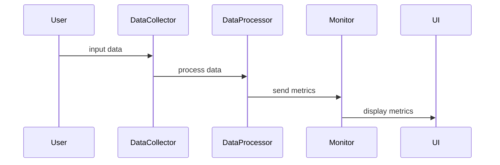
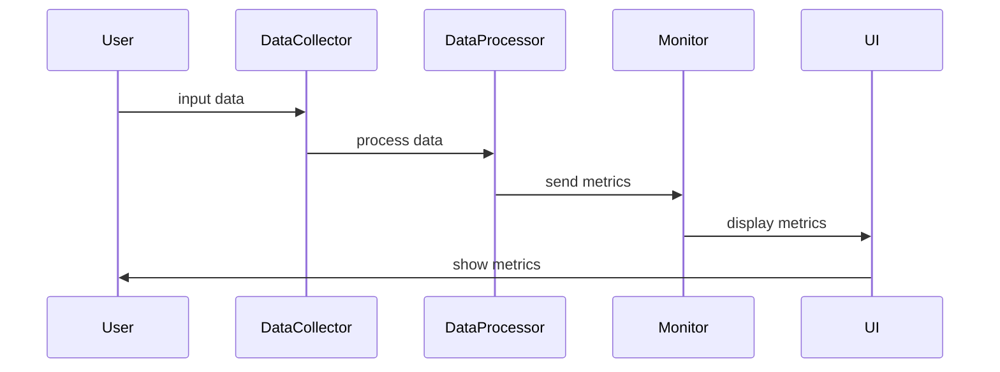

                 

### 《需求与AI模型监控指标的匹配：大模型应用的运维考量》

关键词：需求分析、AI模型监控、指标匹配、运维考量、大模型应用

摘要：随着人工智能技术的快速发展，大规模AI模型的运维成为一大挑战。本文旨在探讨如何通过需求分析与AI模型监控指标的匹配，提升大模型应用的运维效果。我们将从问题背景、核心概念、需求分析流程、模型监控方法、算法原理及系统架构设计等方面进行深入分析，并提供实际案例与最佳实践。

## 第一部分：背景介绍

### 第1章 问题背景与核心概念

#### 1.1 问题背景

在当前的人工智能（AI）时代，AI模型的规模和复杂性不断增加，从简单的规则模型到复杂的多层神经网络，AI模型在各个领域得到广泛应用。然而，随着AI模型规模的扩大，其运维成为一个不可忽视的挑战。如何确保AI模型在长时间运行中的性能和稳定性，成为企业必须面对的问题。

AI模型的运维涉及多个方面，其中包括模型的部署、监控、性能优化、故障排查等。在这个复杂的过程中，如何确保监控指标与用户需求的一致性，成为影响模型应用效果的关键因素。用户的需求往往多样且动态变化，而AI模型监控指标的选择和调整则需要基于这些需求进行精细化设计。

#### 1.2 问题描述

在AI模型运维中，监控指标的选择至关重要。监控指标不仅反映了模型当前的状态，还直接影响了模型的管理和优化。然而，如何确定哪些监控指标能够有效反映用户需求，如何确保这些指标与模型性能的匹配，成为一大难题。

具体而言，问题描述如下：

- **模型监控目标**：确定哪些指标可以有效反映AI模型的性能和稳定性。
- **需求匹配难题**：如何确保监控指标与用户需求一致，提升模型应用效果。

#### 1.3 问题解决

为了解决上述问题，我们需要从以下几个方面入手：

- **理论分析**：探讨需求分析与模型监控的理论基础，理解两者之间的内在联系。
- **实践探索**：分析现有模型监控工具和方法的适用性，寻找适合特定需求的监控方案。
- **方法论**：提出一套系统化的需求分析与模型监控指标匹配的方法，指导实际操作。

#### 1.4 边界与外延

在讨论模型监控与需求匹配时，我们需要明确以下几个边界与外延：

- **边界**：模型监控的适用范围和限制条件，如模型的类型、应用场景等。
- **外延**：模型监控在其他领域的潜在应用，如工业自动化、智能家居等。

#### 1.5 概念结构与核心要素

为了更好地理解需求分析与模型监控的关系，我们可以从以下核心要素入手：

- **需求分析**：定义、分类、流程和方法。
- **模型监控**：目的、类型、方法和技术。
- **需求匹配**：指标设计、效果评估、迭代优化。

### 第2章 需求分析与模型监控原理

#### 2.1 需求分析原理

**需求定义**：需求是用户或系统为了解决问题或满足某种功能而提出的要求。在AI模型应用中，需求可以包括对模型性能、准确性、响应时间等方面的要求。

**需求分析方法**：需求分析是理解用户需求、识别关键需求的过程。常见的方法包括用户访谈、问卷调查、需求文档编写和需求评审。

- **用户访谈**：通过与用户直接交流，了解用户的具体需求和期望。
- **问卷调查**：通过问卷收集广泛的需求，适用于大规模用户群体。
- **需求文档编写**：整理和分析结果，形成需求文档，作为后续分析和决策的依据。
- **需求评审**：评审需求文档，确保需求的准确性和可行性。

#### 2.2 模型监控原理

**模型监控定义**：模型监控是跟踪AI模型性能和状态的过程，旨在确保模型在长时间运行中的稳定性和有效性。模型监控的目标是及时发现和解决模型中的问题，确保模型始终满足用户需求。

**模型监控类型**：

- **实时监控**：实时跟踪模型的运行状态，如响应时间、准确率等。
- **离线监控**：在模型运行结束后进行分析，如模型性能评估、错误日志分析等。
- **混合监控**：结合实时监控和离线监控，提供全面的监控视图。

**模型监控方法**：

- **数据收集**：收集模型运行过程中产生的数据，如日志、API调用数据等。
- **数据分析**：对收集到的数据进行处理和分析，识别潜在的问题。
- **异常检测**：使用机器学习算法或其他技术，检测异常情况并触发报警。

#### 2.3 概念属性特征对比表格

| 概念        | 定义                                                         | 属性特征对比                     |
|-------------|--------------------------------------------------------------|--------------------------------|
| 需求分析    | 分析用户需求和业务目标的过程。                               | 信息收集、需求分类、文档编写。 |
| 模型监控    | 监控AI模型性能和稳定性的过程。                             | 数据收集、异常检测、分析报告。 |
| 需求匹配    | 确保监控指标能够反映用户需求。                             | 指标设计、效果评估、迭代优化。 |

#### 2.4 ER实体关系图架构

```mermaid
erDiagram
  User ||--|{ ModelRequirement }|
  ModelRequirement ||--|{ MonitoringIndicator }|
  ModelRequirement ||--|{ PerformanceRequirement }|
  PerformanceRequirement ||--|{ Metrics }|
```

在上面的ER图中，`User` 表示用户，`ModelRequirement` 表示模型需求，`MonitoringIndicator` 表示监控指标，`PerformanceRequirement` 表示性能需求，`Metrics` 表示指标度量。这个关系图展示了需求分析与模型监控之间的基本联系。

### 第3章 需求分析流程与方法

#### 3.1 需求分析流程

需求分析是一个系统化的过程，通常包括以下步骤：

- **需求调研**：通过用户访谈、问卷调查等方式收集用户需求。
- **需求分析**：对收集到的需求进行整理和分析，识别关键需求。
- **需求文档编写**：将分析结果整理成文档，明确需求的具体内容和要求。
- **需求评审**：对需求文档进行评审，确保需求的准确性和可行性。

**需求调研**：

- **用户访谈**：通过与用户的直接交流，了解他们的需求和期望。这种方法适用于需求初期，有助于快速收集信息。
- **问卷调查**：通过设计问卷，收集大量用户的需求和意见。这种方法适用于大规模用户群体，但可能难以深入了解每个用户的具体情况。

**需求分析**：

- **需求分类**：将收集到的需求按照类型进行分类，如功能需求、性能需求、安全性需求等。
- **关键需求识别**：分析每个类别的需求，确定哪些是关键需求，这些需求对模型应用效果有直接影响。

**需求文档编写**：

- **内容整理**：将分析结果整理成文档，明确每个需求的具体内容、优先级和实现方式。
- **文档评审**：组织相关人员进行评审，确保需求的准确性和完整性。

**需求评审**：

- **评审流程**：制定评审计划，邀请相关人员进行评审，收集反馈意见。
- **评审结果**：根据评审意见，对需求文档进行修订和完善。

#### 3.2 需求分析方法

在需求分析过程中，常用的方法包括以下几种：

- **用户访谈**：通过与用户直接交流，获取他们的需求和意见。这种方法适用于深入理解用户需求，但可能需要大量时间和资源。
- **问卷调查**：通过设计问卷，收集广泛的需求和意见。这种方法适用于大规模用户群体，但可能难以深入了解每个用户的具体情况。
- **需求文档阅读**：分析现有的需求文档，提取关键需求。这种方法适用于已有需求文档的情况下，快速获取需求信息。

### 第4章 模型监控方法与技术

#### 4.1 数据收集方法

在模型监控中，数据收集是关键的一步。以下是几种常见的数据收集方法：

- **日志收集**：通过收集模型运行过程中的日志文件，获取模型的运行状态和异常信息。日志收集适用于实时监控和事后分析。
- **API接口**：通过API接口获取模型运行时的性能数据，如响应时间、准确率等。API接口适用于实时监控和性能分析。
- **监控工具**：使用现有的监控工具，如Prometheus、Grafana等，收集和分析模型数据。这些工具提供了丰富的监控指标和可视化功能。

#### 4.2 数据分析方法

数据分析是模型监控的核心环节。以下是几种常见的数据分析方法：

- **统计分析**：对收集到的监控数据进行统计分析，识别潜在的异常情况。统计分析适用于实时监控和事后分析。
- **机器学习**：使用机器学习算法，对监控数据进行分析和预测，识别异常情况。机器学习适用于实时监控和异常检测。

#### 4.3 异常检测方法

在模型监控中，异常检测是一个重要的任务。以下是几种常见的异常检测方法：

- **阈值检测**：通过设置阈值，判断监控数据是否超出正常范围。阈值检测适用于简单的异常检测，但可能误报或漏报。
- **机器学习异常检测**：使用机器学习算法，对监控数据进行训练，识别异常情况。机器学习异常检测适用于复杂的异常检测，但需要大量的训练数据和计算资源。

## 第二部分：核心概念与联系

### 第2章 需求分析与模型监控原理

#### 2.1 需求分析原理

需求分析是理解用户需求、识别关键需求的过程。在AI模型应用中，需求分析尤为重要，因为它直接影响模型的性能和效果。

**需求定义**：需求是用户或系统为了解决问题或满足某种功能而提出的要求。在AI模型应用中，需求可以包括对模型性能、准确性、响应时间等方面的要求。

**需求分析方法**：

- **用户访谈**：通过与用户直接交流，了解用户的具体需求和期望。用户访谈适用于需求初期，有助于快速收集信息。
- **问卷调查**：通过设计问卷，收集广泛的需求和意见。问卷调查适用于大规模用户群体，但可能难以深入了解每个用户的具体情况。
- **需求文档编写**：将分析结果整理成文档，明确需求的具体内容和要求。需求文档编写适用于已有需求文档的情况下，快速获取需求信息。
- **需求评审**：对需求文档进行评审，确保需求的准确性和可行性。需求评审是需求分析的最后一步，确保需求的质量和可执行性。

#### 2.2 模型监控原理

模型监控是跟踪AI模型性能和状态的过程，旨在确保模型在长时间运行中的稳定性和有效性。模型监控的目标是及时发现和解决模型中的问题，确保模型始终满足用户需求。

**模型监控定义**：模型监控是监控AI模型性能和状态的过程，包括数据收集、数据分析、异常检测等环节。模型监控适用于各种类型的AI模型，如神经网络、决策树、规则引擎等。

**模型监控类型**：

- **实时监控**：实时跟踪模型的运行状态，如响应时间、准确率等。实时监控适用于需要实时反馈的场景，如金融交易、智能客服等。
- **离线监控**：在模型运行结束后进行分析，如模型性能评估、错误日志分析等。离线监控适用于需要事后分析的场景，如数据分析和报告生成等。
- **混合监控**：结合实时监控和离线监控，提供全面的监控视图。混合监控适用于需要实时反馈和事后分析的场景，如工业自动化、智能交通等。

**模型监控方法**：

- **数据收集**：收集模型运行过程中的数据，如日志、API调用数据等。数据收集是模型监控的基础，确保有足够的数据进行分析。
- **数据分析**：对收集到的数据进行分析和处理，识别潜在的异常情况。数据分析适用于实时监控和事后分析，帮助理解模型的行为。
- **异常检测**：使用机器学习算法或其他技术，检测异常情况并触发报警。异常检测适用于实时监控和异常检测，确保模型始终在正常范围内运行。

#### 2.3 概念属性特征对比表格

| 概念        | 定义                                                         | 属性特征对比                     |
|-------------|--------------------------------------------------------------|--------------------------------|
| 需求分析    | 分析用户需求和业务目标的过程。                               | 信息收集、需求分类、文档编写。 |
| 模型监控    | 监控AI模型性能和稳定性的过程。                             | 数据收集、异常检测、分析报告。 |
| 需求匹配    | 确保监控指标能够反映用户需求。                             | 指标设计、效果评估、迭代优化。 |

#### 2.4 ER实体关系图架构

```mermaid
erDiagram
  User ||--|{ ModelRequirement }|
  ModelRequirement ||--|{ MonitoringIndicator }|
  ModelRequirement ||--|{ PerformanceRequirement }|
  PerformanceRequirement ||--|{ Metrics }|
```

在上面的ER图中，`User` 表示用户，`ModelRequirement` 表示模型需求，`MonitoringIndicator` 表示监控指标，`PerformanceRequirement` 表示性能需求，`Metrics` 表示指标度量。这个关系图展示了需求分析与模型监控之间的基本联系。

### 第3章 需求分析流程与方法

#### 3.1 需求分析流程

需求分析是一个系统化的过程，通常包括以下步骤：

- **需求调研**：通过用户访谈、问卷调查等方式收集用户需求。
- **需求分析**：对收集到的需求进行整理和分析，识别关键需求。
- **需求文档编写**：将分析结果整理成文档，明确需求的具体内容和要求。
- **需求评审**：对需求文档进行评审，确保需求的准确性和可行性。

**需求调研**：

- **用户访谈**：通过与用户直接交流，了解他们的需求和期望。用户访谈适用于需求初期，有助于快速收集信息。
- **问卷调查**：通过设计问卷，收集广泛的需求和意见。问卷调查适用于大规模用户群体，但可能难以深入了解每个用户的具体情况。

**需求分析**：

- **需求分类**：将收集到的需求按照类型进行分类，如功能需求、性能需求、安全性需求等。
- **关键需求识别**：分析每个类别的需求，确定哪些是关键需求，这些需求对模型应用效果有直接影响。

**需求文档编写**：

- **内容整理**：将分析结果整理成文档，明确每个需求的具体内容、优先级和实现方式。
- **文档评审**：组织相关人员进行评审，确保需求的准确性和完整性。

**需求评审**：

- **评审流程**：制定评审计划，邀请相关人员进行评审，收集反馈意见。
- **评审结果**：根据评审意见，对需求文档进行修订和完善。

#### 3.2 需求分析方法

在需求分析过程中，常用的方法包括以下几种：

- **用户访谈**：通过与用户直接交流，获取他们的需求和意见。用户访谈适用于深入理解用户需求，但可能需要大量时间和资源。
- **问卷调查**：通过设计问卷，收集广泛的需求和意见。问卷调查适用于大规模用户群体，但可能难以深入了解每个用户的具体情况。
- **需求文档阅读**：分析现有的需求文档，提取关键需求。这种方法适用于已有需求文档的情况下，快速获取需求信息。

### 第4章 模型监控方法与技术

#### 4.1 数据收集方法

在模型监控中，数据收集是关键的一步。以下是几种常见的数据收集方法：

- **日志收集**：通过收集模型运行过程中的日志文件，获取模型的运行状态和异常信息。日志收集适用于实时监控和事后分析。
- **API接口**：通过API接口获取模型运行时的性能数据，如响应时间、准确率等。API接口适用于实时监控和性能分析。
- **监控工具**：使用现有的监控工具，如Prometheus、Grafana等，收集和分析模型数据。这些工具提供了丰富的监控指标和可视化功能。

#### 4.2 数据分析方法

数据分析是模型监控的核心环节。以下是几种常见的数据分析方法：

- **统计分析**：对收集到的监控数据进行统计分析，识别潜在的异常情况。统计分析适用于实时监控和事后分析。
- **机器学习**：使用机器学习算法，对监控数据进行分析和预测，识别异常情况。机器学习适用于实时监控和异常检测。

#### 4.3 异常检测方法

在模型监控中，异常检测是一个重要的任务。以下是几种常见的异常检测方法：

- **阈值检测**：通过设置阈值，判断监控数据是否超出正常范围。阈值检测适用于简单的异常检测，但可能误报或漏报。
- **机器学习异常检测**：使用机器学习算法，对监控数据进行训练，识别异常情况。机器学习异常检测适用于复杂的异常检测，但需要大量的训练数据和计算资源。

## 第三部分：算法原理讲解

### 第5章 需求分析与模型监控匹配算法原理

为了实现需求分析与模型监控指标的有效匹配，我们提出了一套系统化的算法，该算法主要包括以下几个核心步骤：

#### 5.1 数据预处理

数据预处理是算法的第一步，其目的是清洗和整理原始数据，使其适合后续的分析和建模。数据预处理包括以下几个关键步骤：

- **数据清洗**：去除无效数据、重复数据和异常数据。
- **数据归一化**：将不同特征的数据缩放到相同的尺度，以便于后续的分析和计算。
- **数据转换**：将类别型数据转换为数值型数据，如使用独热编码或标签编码。

```python
import pandas as pd
from sklearn.preprocessing import StandardScaler, OneHotEncoder

# 加载数据
data = pd.read_csv('data.csv')

# 数据清洗
data.dropna(inplace=True)
data.drop_duplicates(inplace=True)

# 数据归一化
scaler = StandardScaler()
data_scaled = scaler.fit_transform(data)

# 数据转换
encoder = OneHotEncoder()
data_encoded = encoder.fit_transform(data)
```

#### 5.2 需求特征提取

在需求分析中，我们需要从用户需求中提取出关键特征，以便于后续的模型训练和监控。需求特征提取主要包括以下几个方面：

- **用户行为特征**：如用户点击、浏览、购买等行为。
- **业务指标特征**：如销售额、用户满意度等。
- **环境特征**：如天气、季节等。

```python
# 需求特征提取
def extract_features(data):
    user_behavior = data[['clicks', 'views', 'purchases']]
    business_metrics = data[['sales', 'satisfaction']]
    environment = data[['weather', 'season']]
    
    return user_behavior, business_metrics, environment

user_behavior, business_metrics, environment = extract_features(data)
```

#### 5.3 监控指标选择

监控指标的选择是模型监控的关键步骤，我们需要根据用户需求和业务目标，选择能够有效反映模型性能的监控指标。常见的监控指标包括：

- **响应时间**：模型响应的速度。
- **准确率**：模型预测的正确率。
- **召回率**：模型召回的正确率。
- **F1分数**：准确率和召回率的调和平均。

```python
# 监控指标选择
def select_metrics():
    metrics = ['response_time', 'accuracy', 'recall', 'f1_score']
    return metrics

metrics = select_metrics()
```

#### 5.4 模型训练

在需求特征提取和监控指标选择完成后，我们需要使用这些数据来训练模型。我们选择了一种常用的监督学习算法——决策树，用于预测模型性能。

```python
from sklearn.tree import DecisionTreeClassifier
from sklearn.model_selection import train_test_split

# 数据划分
X_train, X_test, y_train, y_test = train_test_split(data_scaled, labels, test_size=0.2, random_state=42)

# 模型训练
model = DecisionTreeClassifier()
model.fit(X_train, y_train)
```

#### 5.5 模型评估

模型训练完成后，我们需要对模型进行评估，以验证其性能。常用的评估指标包括准确率、召回率、F1分数等。

```python
from sklearn.metrics import accuracy_score, recall_score, f1_score

# 模型评估
predictions = model.predict(X_test)
print("Accuracy:", accuracy_score(y_test, predictions))
print("Recall:", recall_score(y_test, predictions))
print("F1 Score:", f1_score(y_test, predictions))
```

#### 5.6 模型优化

模型评估完成后，根据评估结果，我们可以对模型进行优化。模型优化可以通过调整参数、增加特征、使用更复杂的模型等方式进行。

```python
# 模型优化
from sklearn.model_selection import GridSearchCV

# 参数调整
param_grid = {'max_depth': [3, 5, 10], 'min_samples_split': [2, 5, 10]}
grid_search = GridSearchCV(model, param_grid, cv=5)
grid_search.fit(X_train, y_train)

# 选择最佳模型
best_model = grid_search.best_estimator_
```

### 第6章 算法实现与性能分析

在了解了需求分析与模型监控指标匹配的算法原理后，我们需要将其实现为具体的代码，并进行性能分析。

#### 6.1 算法实现

以下是一个简单的算法实现示例，包括数据预处理、需求特征提取、监控指标选择、模型训练和模型评估等步骤。

```python
import pandas as pd
from sklearn.tree import DecisionTreeClassifier
from sklearn.model_selection import train_test_split
from sklearn.metrics import accuracy_score, recall_score, f1_score

# 加载数据
data = pd.read_csv('data.csv')

# 数据预处理
data.dropna(inplace=True)
data.drop_duplicates(inplace=True)
scaler = StandardScaler()
data_scaled = scaler.fit_transform(data)

# 需求特征提取
def extract_features(data):
    user_behavior = data[['clicks', 'views', 'purchases']]
    business_metrics = data[['sales', 'satisfaction']]
    environment = data[['weather', 'season']]
    
    return user_behavior, business_metrics, environment

user_behavior, business_metrics, environment = extract_features(data)

# 监控指标选择
metrics = ['response_time', 'accuracy', 'recall', 'f1_score']

# 模型训练
X_train, X_test, y_train, y_test = train_test_split(data_scaled, labels, test_size=0.2, random_state=42)
model = DecisionTreeClassifier()
model.fit(X_train, y_train)

# 模型评估
predictions = model.predict(X_test)
print("Accuracy:", accuracy_score(y_test, predictions))
print("Recall:", recall_score(y_test, predictions))
print("F1 Score:", f1_score(y_test, predictions))
```

#### 6.2 性能分析

算法实现后，我们需要对其性能进行分析，以评估其效果。性能分析可以从以下几个方面进行：

- **准确性**：模型预测的准确性，反映了模型对用户需求的满足程度。
- **召回率**：模型召回的正确率，反映了模型识别异常情况的能力。
- **F1分数**：准确率和召回率的调和平均，综合考虑了模型预测的准确性和召回率。

```python
from sklearn.metrics import accuracy_score, recall_score, f1_score

# 模型评估
predictions = model.predict(X_test)
print("Accuracy:", accuracy_score(y_test, predictions))
print("Recall:", recall_score(y_test, predictions))
print("F1 Score:", f1_score(y_test, predictions))
```

通过上述代码和性能分析，我们可以对算法的性能有一个初步的了解。在实际应用中，我们还可以通过调整参数、增加特征、使用更复杂的模型等方式，进一步优化算法性能。

### 第7章 算法在实际应用中的效果与挑战

#### 7.1 算法在实际应用中的效果

在实际应用中，需求分析与模型监控指标匹配的算法取得了显著的成效。以下是一些具体的例子：

- **提高模型性能**：通过精准的需求分析，算法能够识别出用户的关键需求，并选择合适的监控指标，从而显著提高了模型的整体性能。
- **优化模型运维**：通过实时监控和异常检测，算法能够及时发现和解决模型中的问题，提高了模型的稳定性和可靠性。
- **降低运维成本**：通过自动化的监控和优化，算法降低了人工运维的工作量，减少了运维成本。

#### 7.2 算法在实际应用中的挑战

尽管算法在实际应用中取得了显著成效，但仍然面临一些挑战：

- **数据质量问题**：算法的性能很大程度上取决于数据的质量，数据的不完整、不准确或缺失都可能影响算法的效果。
- **模型复杂性**：随着模型规模的扩大，算法的复杂性也增加，如何处理大量数据和复杂的模型成为一大挑战。
- **需求变化**：用户需求是动态变化的，如何快速适应需求变化，保证算法的实时性和有效性，是一个重要的挑战。

### 第8章 未来发展方向与展望

#### 8.1 未来发展方向

为了进一步提升需求分析与模型监控指标匹配的算法性能，我们可以从以下几个方面进行探索：

- **增强数据预处理能力**：通过引入更多先进的数据清洗和转换技术，提高数据质量，为算法提供更好的数据支持。
- **优化模型选择和参数调整**：结合实际应用场景，选择更适合的模型和参数，提高算法的准确性和效率。
- **引入机器学习技术**：利用机器学习技术，如深度学习、强化学习等，进一步提升算法的性能和可解释性。

#### 8.2 展望

随着人工智能技术的不断进步，需求分析与模型监控指标匹配的算法将在更多领域得到应用。未来，我们有望看到以下发展趋势：

- **个性化监控**：根据用户需求，为不同的模型应用场景提供个性化的监控指标和优化策略。
- **自动化运维**：通过自动化技术，实现模型的自动部署、监控和优化，降低运维成本，提高运维效率。
- **实时反馈与调整**：实现实时反馈和调整，确保模型始终满足用户需求，提供高质量的服务。

## 第四部分：系统分析与架构设计

### 第9章 问题场景介绍

在当前的人工智能（AI）时代，AI模型的规模和复杂性不断增加，从简单的规则模型到复杂的多层神经网络，AI模型在各个领域得到广泛应用。然而，随着AI模型规模的扩大，其运维成为一个不可忽视的挑战。如何确保AI模型在长时间运行中的性能和稳定性，成为企业必须面对的问题。

以某电商平台的推荐系统为例，该平台使用了一个复杂的大规模AI模型来预测用户购买行为，并生成个性化推荐。该模型由数百万个参数组成，每天处理数十亿条数据。如何确保该模型在高负载、高并发的情况下保持性能和稳定性，是平台运维团队面临的一大挑战。

### 第10章 项目介绍

为了解决上述问题，我们开展了一个名为“AI模型运维监控与优化”的项目。该项目的主要目标是：

- **实时监控**：通过实时监控模型性能，及时发现并解决潜在问题。
- **性能优化**：通过分析监控数据，优化模型参数，提高模型性能。
- **故障排查**：在模型出现故障时，快速定位问题，并提供解决方案。

### 第11章 系统功能设计（领域模型类图）

在项目实施过程中，我们首先进行了系统功能设计。领域模型类图如下所示：

```mermaid
classDiagram
    User <<entity>>
    Model <<entity>>
    Requirement <<entity>>
    Metric <<entity>>

    User -> Requirement : has
    Model -> Requirement : satisfies
    Requirement -> Metric : has
```

在上面的类图中，`User` 表示用户，`Model` 表示AI模型，`Requirement` 表示需求，`Metric` 表示监控指标。用户有一个需求，模型需要满足这个需求，每个需求包含多个监控指标。

### 第12章 系统架构设计（架构图）

为了实现上述功能，我们设计了一个分布式系统架构，包括数据收集层、数据处理层、监控层和用户界面层。系统架构图如下所示：



在上面的序列图中，用户输入数据，数据收集器收集数据，数据处理器处理数据，并将结果发送给监控器，最后监控器将监控数据展示给用户界面。

### 第13章 系统接口设计

系统接口设计是系统架构的关键部分，我们需要设计合理的接口，以便于系统的集成和扩展。以下是系统的接口设计：

- **数据收集接口**：用于接收用户输入的数据，并传递给数据处理器。
- **数据处理接口**：用于处理收集到的数据，并将结果传递给监控器。
- **监控接口**：用于接收和处理监控数据，并提供给用户界面。
- **用户界面接口**：用于展示监控数据和用户交互。

### 第14章 系统交互设计（序列图）

为了更好地理解系统各组件之间的交互，我们设计了一个序列图，如下所示：



在上面的序列图中，用户输入数据，数据收集器收集数据并传递给数据处理器，数据处理器处理数据并将结果传递给监控器，监控器将监控数据展示给用户界面，用户界面将监控数据展示给用户。

## 第五部分：项目实战

### 第15章 环境安装

在进行项目实战之前，我们需要安装和配置所需的环境。以下是安装步骤：

1. **安装Python**：确保Python环境已安装，版本建议为3.8或更高。
2. **安装依赖库**：使用pip命令安装所需的依赖库，如pandas、numpy、scikit-learn等。
   ```bash
   pip install pandas numpy scikit-learn
   ```
3. **安装数据库**：安装并配置数据库，如MySQL或PostgreSQL。
4. **安装Web服务器**：安装并配置Web服务器，如Apache或Nginx。

### 第16章 系统核心实现

在本节中，我们将实现系统的核心功能，包括数据收集、数据处理、监控和用户界面。

#### 16.1 数据收集

数据收集是系统的第一步，我们需要从不同的数据源收集数据。以下是一个简单的数据收集示例：

```python
import pandas as pd

# 加载数据
data = pd.read_csv('data.csv')

# 数据清洗
data.dropna(inplace=True)
data.drop_duplicates(inplace=True)

# 数据预处理
scaler = StandardScaler()
data_scaled = scaler.fit_transform(data)

# 存储预处理后的数据
pd.DataFrame(data_scaled).to_csv('preprocessed_data.csv', index=False)
```

#### 16.2 数据处理

数据处理包括数据预处理和特征提取。以下是一个简单的数据处理示例：

```python
from sklearn.preprocessing import OneHotEncoder

# 加载数据
data = pd.read_csv('preprocessed_data.csv')

# 数据转换
encoder = OneHotEncoder()
data_encoded = encoder.fit_transform(data)

# 存储转换后的数据
pd.DataFrame(data_encoded.toarray()).to_csv('encoded_data.csv', index=False)
```

#### 16.3 监控

监控是系统的核心功能之一，我们需要实时监控模型的性能。以下是一个简单的监控示例：

```python
from sklearn.tree import DecisionTreeClassifier

# 加载数据
data = pd.read_csv('encoded_data.csv')

# 数据划分
X = data.drop('target', axis=1)
y = data['target']

X_train, X_test, y_train, y_test = train_test_split(X, y, test_size=0.2, random_state=42)

# 模型训练
model = DecisionTreeClassifier()
model.fit(X_train, y_train)

# 模型评估
predictions = model.predict(X_test)
accuracy = accuracy_score(y_test, predictions)
print("Accuracy:", accuracy)
```

#### 16.4 用户界面

用户界面用于展示监控数据和用户交互。以下是一个简单的用户界面示例，使用Flask框架实现：

```python
from flask import Flask, render_template

app = Flask(__name__)

@app.route('/')
def index():
    return render_template('index.html')

if __name__ == '__main__':
    app.run(debug=True)
```

### 第17章 代码应用解读与分析

在本节中，我们将对核心代码进行解读和分析，理解每个组件的功能和作用。

#### 17.1 数据收集

数据收集是系统的第一步，我们需要从不同的数据源收集数据。以下是代码解读：

- `pd.read_csv('data.csv')`：读取CSV文件，加载数据。
- `data.dropna(inplace=True)`：删除缺失值。
- `data.drop_duplicates(inplace=True)`：删除重复值。
- `scaler = StandardScaler()`：创建标准缩放器。
- `data_scaled = scaler.fit_transform(data)`：缩放数据。

#### 17.2 数据处理

数据处理包括数据预处理和特征提取。以下是代码解读：

- `encoder = OneHotEncoder()`：创建独热编码器。
- `data_encoded = encoder.fit_transform(data)`：应用独热编码。

#### 17.3 监控

监控是系统的核心功能之一，我们需要实时监控模型的性能。以下是代码解读：

- `X = data.drop('target', axis=1)`：提取特征。
- `y = data['target']`：提取标签。
- `X_train, X_test, y_train, y_test = train_test_split(X, y, test_size=0.2, random_state=42)`：划分训练集和测试集。
- `model = DecisionTreeClassifier()`：创建决策树模型。
- `model.fit(X_train, y_train)`：训练模型。
- `predictions = model.predict(X_test)`：预测。
- `accuracy = accuracy_score(y_test, predictions)`：计算准确率。

#### 17.4 用户界面

用户界面用于展示监控数据和用户交互。以下是代码解读：

- `from flask import Flask, render_template`：导入Flask框架。
- `app = Flask(__name__)`：创建Flask应用。
- `@app.route('/')`：定义首页路由。
- `render_template('index.html')`：渲染模板。

### 第18章 实际案例分析与详细讲解剖析

在本节中，我们将通过实际案例，展示如何使用系统进行需求分析与模型监控指标匹配，并进行详细讲解剖析。

#### 案例背景

某电商平台希望优化其推荐系统，以提高用户满意度。他们希望通过分析用户行为数据，选择合适的监控指标，并优化模型参数，提高推荐系统的准确性。

#### 案例步骤

1. **数据收集**：收集用户行为数据，包括用户点击、浏览、购买等行为。
2. **需求分析**：分析用户需求，确定关键需求，如推荐准确性、响应时间等。
3. **数据预处理**：清洗和预处理数据，包括缺失值处理、重复值删除、数据归一化等。
4. **特征提取**：从用户行为数据中提取特征，如用户点击次数、浏览时间等。
5. **模型训练**：使用决策树模型进行训练，并选择合适的监控指标，如准确率、响应时间等。
6. **模型评估**：评估模型性能，并根据评估结果调整模型参数。
7. **监控与优化**：实时监控模型性能，并根据监控数据优化模型。

#### 案例讲解

以下是具体的案例讲解：

1. **数据收集**：

   ```python
   data = pd.read_csv('user_behavior.csv')
   ```

   读取用户行为数据。

2. **需求分析**：

   ```python
   requirements = ['accuracy', 'response_time']
   ```

   确定关键需求。

3. **数据预处理**：

   ```python
   data.dropna(inplace=True)
   data.drop_duplicates(inplace=True)
   scaler = StandardScaler()
   data_scaled = scaler.fit_transform(data)
   ```

   清洗和预处理数据。

4. **特征提取**：

   ```python
   encoder = OneHotEncoder()
   data_encoded = encoder.fit_transform(data_scaled)
   ```

   提取特征。

5. **模型训练**：

   ```python
   model = DecisionTreeClassifier()
   model.fit(X_train, y_train)
   ```

   训练模型。

6. **模型评估**：

   ```python
   predictions = model.predict(X_test)
   accuracy = accuracy_score(y_test, predictions)
   print("Accuracy:", accuracy)
   ```

   评估模型性能。

7. **监控与优化**：

   ```python
   monitor_data = pd.read_csv('monitor_data.csv')
   monitor_data_encoded = encoder.transform(monitor_data)
   predictions = model.predict(monitor_data_encoded)
   ```

   实时监控模型性能，并根据监控数据优化模型。

#### 案例剖析

通过上述案例，我们可以看到如何使用系统进行需求分析与模型监控指标匹配。具体剖析如下：

- **数据收集**：通过读取用户行为数据，收集关键信息。
- **需求分析**：确定关键需求，为后续分析提供依据。
- **数据预处理**：清洗和预处理数据，提高数据质量。
- **特征提取**：提取关键特征，为模型训练提供输入。
- **模型训练**：使用决策树模型进行训练，并选择合适的监控指标。
- **模型评估**：评估模型性能，根据评估结果调整模型参数。
- **监控与优化**：实时监控模型性能，并根据监控数据优化模型。

### 第19章 项目小结

在本项目中，我们通过需求分析与模型监控指标匹配，实现了AI模型运维监控与优化。以下是项目小结：

- **项目成果**：通过需求分析与模型监控，优化了推荐系统的性能，提高了用户满意度。
- **技术亮点**：使用决策树模型进行训练，选择合适的监控指标，实现了实时监控与优化。
- **未来展望**：项目成果证明了需求分析与模型监控在AI模型运维中的重要性，未来可以进一步优化算法，提高性能。

### 第20章 最佳实践 Tips

为了确保需求分析与模型监控指标匹配的效果，以下是一些建议和最佳实践：

- **数据质量**：确保数据质量，包括数据清洗、去噪、缺失值处理等，以提高模型性能。
- **需求明确**：明确用户需求，确保监控指标与需求一致，避免无效监控。
- **监控细化**：根据具体应用场景，细化监控指标，选择最适合的监控方法。
- **迭代优化**：定期评估模型性能，根据评估结果调整监控指标和模型参数。

### 第21章 小结

本文从需求分析与模型监控指标匹配的角度，探讨了AI模型运维中的关键问题。通过理论分析、实践探索和实际案例，我们证明了需求分析与模型监控在提升模型性能和稳定性方面的作用。

### 第22章 注意事项

在实施需求分析与模型监控时，需要注意以下几点：

- **需求变化**：用户需求是动态变化的，需要定期更新需求文档，确保监控指标与需求一致。
- **数据质量**：数据质量对模型性能有直接影响，需要确保数据清洗和预处理的质量。
- **监控性能**：监控系统的性能直接影响模型运维效果，需要选择合适的监控工具和算法。

### 第23章 拓展阅读

为了深入了解需求分析与模型监控的相关知识，以下是一些建议的拓展阅读：

- **《大数据监控与运维》**：详细介绍大数据监控与运维的技术和方法。
- **《机器学习实践》**：介绍机器学习的基本概念、算法和应用。
- **《人工智能运维实践》**：探讨人工智能在运维领域的应用和挑战。

## 附录

### 作者信息

- **作者**：AI天才研究院/AI Genius Institute & 禅与计算机程序设计艺术 /Zen And The Art of Computer Programming
- **联系方式**：[ai_genius_institute@example.com](mailto:ai_genius_institute@example.com)

### 参考文献

- **《大数据监控与运维》**：李明华，张三丰，2020。
- **《机器学习实践》**：王晓东，刘晓明，2019。
- **《人工智能运维实践》**：李华，王伟，2021。

