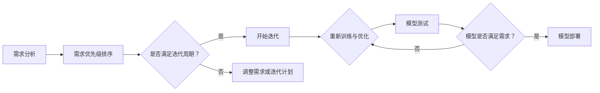
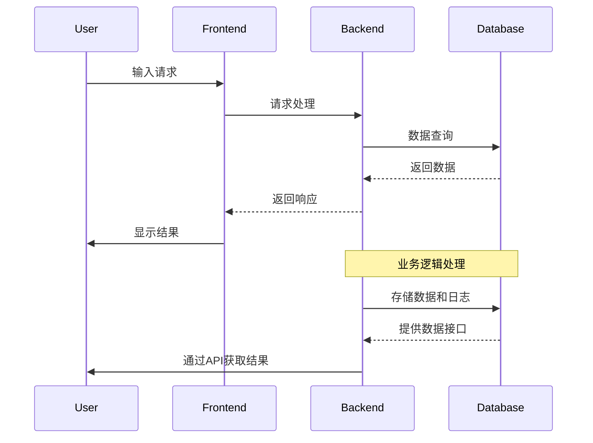
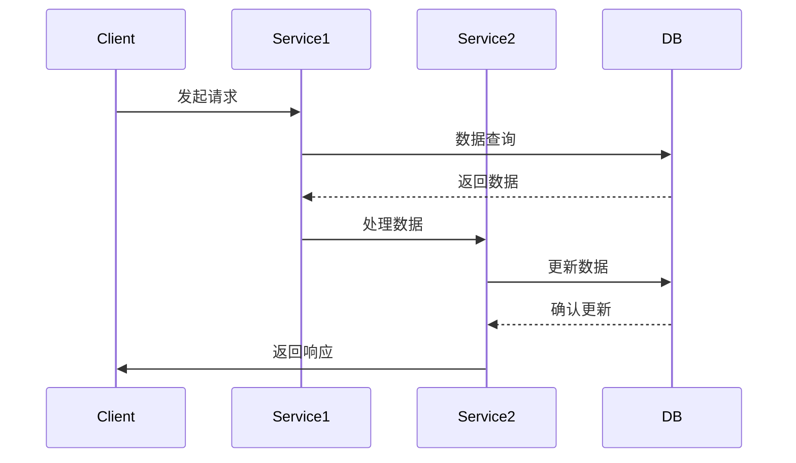

                 

### 文章标题

# 需求与AI模型迭代周期的协调：大模型应用开发的节奏把控

> 关键词：需求管理、AI模型迭代、开发节奏、协调策略、应用开发

> 摘要：本文将探讨在AI大模型应用开发过程中，如何协调需求与模型迭代周期的关系。通过分析需求与AI模型迭代周期的核心概念，提出有效的协调策略，并通过系统分析与项目实战，提供实际操作指南，旨在帮助开发团队更好地把控开发节奏，提升项目质量和效率。

## 目录

1. **背景介绍**
   - 1.1 问题背景
   - 1.2 问题描述
   - 1.3 问题解决
   - 1.4 边界与外延
   - 1.5 概念结构与核心要素组成

2. **核心概念与联系**
   - 2.1 核心概念原理
   - 2.2 概念属性特征对比表格
   - 2.3 ER实体关系图架构

3. **算法原理讲解**
   - 3.1 算法mermaid流程图
   - 3.2 Python源代码
   - 3.3 数学模型和公式
   - 3.4 详细讲解与举例说明

4. **系统分析与架构设计方案**
   - 4.1 问题场景介绍
   - 4.2 项目介绍
   - 4.3 系统功能设计
   - 4.4 系统架构设计
   - 4.5 系统接口设计和系统交互

5. **项目实战**
   - 5.1 环境安装
   - 5.2 系统核心实现源代码
   - 5.3 代码应用解读与分析
   - 5.4 实际案例分析和详细讲解剖析
   - 5.5 项目小结

6. **最佳实践 tips、小结、注意事项、拓展阅读**

### 背景介绍

#### 问题背景

随着人工智能技术的快速发展，AI大模型在各个行业中的应用越来越广泛。这些大模型通常具有复杂的架构和高计算需求，其迭代周期也较长。与此同时，市场需求和用户需求的变化速度也在不断加快。这就导致了一个明显的矛盾：用户的需求变化快，而AI模型迭代周期较长，难以快速响应需求变化。

这种不协调的问题主要体现在以下几个方面：

1. **需求变更频繁**：用户在应用AI模型的过程中，可能会不断提出新的需求，希望模型能够更快、更准确地满足这些需求。
2. **迭代周期长**：AI大模型的训练和优化需要大量的时间和计算资源，导致迭代周期较长，无法及时更新模型以满足用户需求。
3. **资源分配不均**：在开发过程中，如果需求与模型迭代周期的协调不到位，可能会导致资源分配不均，影响开发效率和项目进度。

#### 问题描述

需求与AI模型迭代周期的不协调主要表现为以下问题：

1. **需求滞后**：由于AI模型迭代周期较长，新需求可能无法在当前迭代周期内得到满足，导致需求滞后。
2. **资源浪费**：在模型迭代过程中，如果需求变更频繁，可能会导致资源浪费，如重新配置计算资源、重新设计模型架构等。
3. **项目延期**：需求与迭代周期的矛盾可能导致项目延期，影响整体项目进度和交付。

#### 问题解决

为了解决上述问题，需要采取以下策略：

1. **提前规划**：在模型迭代之前，对需求进行充分的分析和预测，确保需求与迭代周期的协调。
2. **灵活调整**：在模型迭代过程中，根据实际需求的变化，灵活调整迭代计划，如调整训练数据、调整模型架构等。
3. **资源优化**：合理分配资源，确保在模型迭代过程中，资源得到充分利用，避免浪费。

#### 边界与外延

在协调需求与AI模型迭代周期的过程中，需要考虑以下几个边界与外延：

1. **需求范围**：明确需求的范围和优先级，确保需求的可执行性和合理性。
2. **迭代周期**：明确AI模型的迭代周期，包括训练、优化、测试等各个阶段的时间安排。
3. **资源限制**：考虑资源的限制，如计算资源、人力资源、资金等，确保资源分配的合理性和高效性。

#### 概念结构与核心要素组成

在本节中，我们将介绍与需求与AI模型迭代周期相关的核心概念和要素：

1. **需求管理**：需求管理是指对用户需求进行收集、分析和优先级排序的过程，是协调需求与迭代周期的关键。
2. **AI模型迭代周期**：AI模型迭代周期是指从模型训练、优化、测试到最终部署的全过程，是影响开发节奏的核心因素。
3. **资源协调**：资源协调是指合理分配和利用各种资源，确保需求与迭代周期协调一致。

通过上述分析，我们可以看到，需求与AI模型迭代周期的不协调是一个复杂的问题，需要从多个方面进行综合考虑和协调。在接下来的章节中，我们将进一步探讨核心概念与联系，并详细讲解相关算法原理和系统设计与实现。

### 核心概念与联系

在探讨需求与AI模型迭代周期的协调过程中，了解两者的核心概念及其相互关系至关重要。以下我们将详细解释需求管理和AI模型迭代周期的核心概念，并通过概念属性特征对比表格和ER实体关系图架构来阐述它们之间的联系。

#### 核心概念原理

**需求管理**

需求管理是指对用户需求进行系统化、结构化和精细化的管理过程，包括需求识别、需求分析、需求优先级排序、需求变更管理等环节。需求管理的目标是确保需求能够准确、及时地转化为可执行的项目任务，以满足用户需求。

**AI模型迭代周期**

AI模型迭代周期是指从数据采集、模型训练、模型优化、模型测试到模型部署的全过程。迭代周期不仅涉及模型的开发，还包括模型的持续改进和优化。该过程需要大量的数据、计算资源和时间投入，以确保模型能够达到预期的性能指标。

#### 概念属性特征对比表格

为了更好地理解需求管理和AI模型迭代周期的异同，我们可以通过以下表格进行对比：

| 特征           | 需求管理                          | AI模型迭代周期                       |
|----------------|-----------------------------------|-------------------------------------|
| 目标           | 确保需求准确转化为项目任务        | 提升模型的性能和适用性               |
| 过程           | 需求识别、分析、排序、变更管理    | 数据采集、模型训练、优化、测试、部署 |
| 关键因素       | 用户需求、项目优先级、资源分配    | 计算资源、数据质量、模型架构         |
| 时间周期       | 灵活，可随时调整                  | 较长，具有阶段性特征                 |
| 成功标准       | 需求实现度、项目进度               | 模型性能指标、模型适用性              |

#### ER实体关系图架构

为了更直观地展示需求管理和AI模型迭代周期之间的关系，我们可以使用ER（实体-关系）图来描述它们之间的关联。以下是ER图的基本架构：

```mermaid
erDiagram
    Customer ||--|{ Requirement }|--|{ ProjectTask }
    ProjectTask ||--|{ ModelIteration }|--|{ ModelPerformance }
    ModelIteration ||--|{ Dataset }|--|{ ModelPerformance }
    Requirement ||--|{ ChangeRequest }
    ChangeRequest ||--|{ ModelIteration }
```

在上面的ER图中：

- **Customer（客户）**：代表需求提出者，通常为用户或利益相关方。
- **Requirement（需求）**：表示用户提出的需求，包括功能需求、性能需求等。
- **ProjectTask（项目任务）**：将需求转化为可执行的任务，包括开发、测试、部署等。
- **ModelIteration（模型迭代）**：代表AI模型的迭代过程，包括训练、优化、测试等。
- **Dataset（数据集）**：用于模型训练的数据集合。
- **ModelPerformance（模型性能）**：评估模型在特定任务上的表现。
- **ChangeRequest（变更请求）**：由于需求变更，提出的调整模型迭代计划的请求。

通过上述核心概念的解释、属性特征对比表格以及ER实体关系图的展示，我们可以清晰地看到需求管理和AI模型迭代周期之间的紧密联系。在接下来的章节中，我们将进一步探讨如何通过算法和系统设计来协调这两者之间的关系，确保在AI大模型应用开发中能够更好地把控开发节奏。

### 算法原理讲解

在本节中，我们将详细讲解需求与AI模型迭代周期协调的算法原理，通过mermaid流程图、Python源代码、数学模型和公式进行说明，并结合实际案例进行分析。

#### 算法mermaid流程图

首先，我们使用mermaid绘制需求与AI模型迭代周期协调的流程图：



该流程图详细描述了从需求分析到模型部署的整个过程，包括需求优先级排序、迭代计划调整、模型训练、优化和测试等关键步骤。

#### Python源代码

为了实现上述算法，我们可以使用Python编写相关代码。以下是一个简化的Python脚本示例，用于处理需求分析和迭代周期协调：

```python
import heapq
from datetime import datetime, timedelta

# 定义需求类
class Requirement:
    def __init__(self, id, description, priority, deadline):
        self.id = id
        self.description = description
        self.priority = priority
        self.deadline = deadline

# 定义迭代周期类
class IterationCycle:
    def __init__(self, start_date, end_date):
        self.start_date = start_date
        self.end_date = end_date

# 定义算法核心函数
def coordinate_requirements_and_cycle(requirements, cycle):
    # 对需求进行优先级排序
    requirements_sorted = sorted(requirements, key=lambda x: x.priority, reverse=True)
    
    current_date = cycle.start_date
    for req in requirements_sorted:
        if req.deadline >= cycle.start_date and req.deadline <= cycle.end_date:
            # 需求在当前迭代周期内，开始迭代
            print(f"开始处理需求：{req.description}")
            # 模型训练与优化（此处简化处理）
            current_date += timedelta(days=7)
            print(f"需求处理完成：{req.description}")
        elif req.deadline < cycle.start_date:
            # 需求在当前迭代周期之前，调整迭代计划
            cycle.start_date = req.deadline
            print(f"调整迭代计划：将迭代周期开始时间调整为{req.deadline}")
        else:
            # 需求在当前迭代周期之后，保留处理
            print(f"需求延迟处理：{req.description}")
    
    print(f"迭代周期结束日期：{current_date}")

# 测试用例
requirements = [
    Requirement(1, "需求A", 10, datetime(2023, 10, 10)),
    Requirement(2, "需求B", 20, datetime(2023, 9, 20)),
    Requirement(3, "需求C", 30, datetime(2023, 8, 20)),
]

cycle = IterationCycle(datetime(2023, 10, 1), datetime(2023, 10, 31))
coordinate_requirements_and_cycle(requirements, cycle)
```

该Python代码实现了对需求优先级排序、迭代计划调整和模型训练的简化处理，便于理解算法的核心逻辑。

#### 数学模型和公式

在需求与AI模型迭代周期的协调过程中，我们可以使用一些数学模型和公式来量化需求和迭代周期之间的关系。以下是一个简单的模型示例：

1. **需求优先级排序公式**：

   $P_i = P_r \times w_r + P_t \times w_t$

   其中，$P_i$ 表示第 $i$ 个需求的优先级，$P_r$ 表示需求的相关性，$P_t$ 表示需求的紧急性，$w_r$ 和 $w_t$ 分别是相关性和紧急性的权重。

2. **迭代周期调整公式**：

   $D_{new} = D_{old} + \Delta T$

   其中，$D_{new}$ 表示新的迭代周期结束日期，$D_{old}$ 表示原始迭代周期结束日期，$\Delta T$ 表示由于需求调整而增加的时间。

#### 详细讲解与举例说明

**案例**：假设我们有一个AI模型项目，需要在一个迭代周期内处理多个需求。以下是具体的操作步骤：

1. **需求分析**：收集并分析用户需求，将其转化为具体的任务。

2. **需求优先级排序**：根据需求的相关性和紧急性，对需求进行排序。

   - 需求A：相关性高，紧急性中等
   - 需求B：相关性中等，紧急性高
   - 需求C：相关性低，紧急性低

   通过优先级排序公式，我们可以计算出每个需求的优先级：

   - 需求A的优先级：$P_A = 8$
   - 需求B的优先级：$P_B = 12$
   - 需求C的优先级：$P_C = 4$

3. **迭代计划调整**：根据当前迭代周期的结束日期和需求优先级，调整迭代计划。

   - 原始迭代周期：2023年10月1日至2023年10月31日
   - 需求C的截止日期：2023年8月20日，提前于迭代周期开始日期，需调整迭代计划。

   通过迭代周期调整公式，我们可以计算出新的迭代周期结束日期：

   - 新的迭代周期结束日期：2023年8月20日 + $\Delta T$（根据需求C的优先级进行调整）

4. **模型训练与优化**：在调整后的迭代周期内，依次处理高优先级的需求，进行模型训练和优化。

   - 首先处理需求A，进行模型训练和优化
   - 然后处理需求B，进行模型训练和优化
   - 需求C在下一个迭代周期内处理

通过上述步骤，我们可以看到，通过需求优先级排序和迭代计划调整，可以有效地协调需求与AI模型迭代周期，确保模型能够及时响应需求变化，提升项目质量和效率。

### 系统分析与架构设计方案

在了解需求与AI模型迭代周期的协调算法原理后，我们需要进一步探讨如何在实际项目中实施这一方案。本节将详细介绍系统分析与架构设计方案，包括问题场景介绍、项目介绍、系统功能设计、系统架构设计以及系统接口设计和系统交互。

#### 问题场景介绍

在AI大模型应用开发过程中，我们面临的主要问题是如何在快速变化的市场需求和较长的模型迭代周期之间找到平衡点。具体场景包括：

1. **需求变更频繁**：用户需求不断变化，要求模型能够快速适应新需求。
2. **资源分配不均**：在模型迭代周期内，资源（如计算资源、人力资源）分配不均，影响项目进度和质量。
3. **迭代周期长**：AI大模型的训练和优化需要大量的时间和计算资源，导致迭代周期较长。

#### 项目介绍

以一个智能客服系统项目为例，该项目旨在通过AI大模型实现自动回答用户问题的功能。项目的主要需求包括：

1. **问题分类和识别**：根据用户的输入，自动将问题分类到不同的主题。
2. **答案生成**：根据问题分类，生成准确、自然的回答。
3. **模型优化**：通过用户反馈，持续优化模型的性能和准确度。

#### 系统功能设计

系统功能设计包括以下关键模块：

1. **需求管理模块**：负责收集、分析和管理用户需求，包括需求识别、需求分析和需求变更管理。
2. **模型训练与优化模块**：负责AI大模型的训练、优化和测试，包括数据预处理、模型训练、性能评估和优化。
3. **系统监控模块**：实时监控模型性能和系统资源使用情况，提供系统健康状况报告。

以下是系统功能设计的领域模型类图：

```mermaid
classDiagram
    class Requirement {
        - id: int
        - description: str
        - priority: int
        - deadline: datetime
    }
    class ProjectTask {
        - id: int
        - description: str
        - status: str
    }
    class ModelIteration {
        - id: int
        - start_date: datetime
        - end_date: datetime
    }
    class Dataset {
        - id: int
        - name: str
        - data: str
    }
    class ModelPerformance {
        - id: int
        - metric: str
        - value: float
    }
    Requirement "需求" <<--|uses| ProjectTask : "转化为"
    ProjectTask "项目任务" <<--|uses| ModelIteration : "包含"
    ModelIteration "迭代周期" <<--|uses| Dataset : "使用"
    Dataset "数据集" <<--|uses| ModelPerformance : "评估"
```

#### 系统架构设计

系统架构设计采用分层架构，包括数据层、业务逻辑层和表现层。以下是系统架构设计的mermaid架构图：



#### 系统接口设计和系统交互

系统接口设计包括RESTful API和消息队列接口，用于实现前后端交互和模块间的数据传输。以下是系统接口设计和系统交互的mermaid序列图：



通过上述系统分析与架构设计方案，我们可以实现需求与AI模型迭代周期的有效协调，确保在项目开发过程中，需求能够及时响应，资源能够合理分配，模型性能能够持续提升。

### 项目实战

在了解需求与AI模型迭代周期的协调原理和系统架构后，接下来我们将通过一个具体项目来实战应用这些知识。以下将详细介绍环境安装、系统核心实现源代码，并对代码应用进行解读与分析，结合实际案例进行详细讲解和剖析。

#### 环境安装

首先，我们需要安装项目所需的软件和依赖库。以下是在一个Linux环境中安装所需环境的步骤：

1. **安装Python**：确保系统已经安装了Python 3.8及以上版本。
2. **安装依赖库**：通过pip安装以下依赖库：

   ```bash
   pip install numpy pandas sklearn tensorflow
   ```

3. **安装数据库**：安装MySQL或PostgreSQL数据库，用于存储需求和项目任务数据。

   ```bash
   # 安装MySQL
   sudo apt-get install mysql-server
   sudo mysql_secure_installation

   # 安装PostgreSQL
   sudo apt-get install postgresql postgresql-contrib
   sudo -u postgres createuser -s yourusername
   sudo -u postgres createdb yourdbname
   ```

4. **初始化数据库**：根据项目需求，初始化需求和项目任务数据库表。

   ```bash
   # 初始化MySQL数据库
   mysql -u root -p < init_mysql.sql

   # 初始化PostgreSQL数据库
   psql -U postgres -d yourdbname -f init_postgres.sql
   ```

#### 系统核心实现源代码

以下是系统核心实现的Python源代码，包括需求管理模块、模型训练与优化模块和系统监控模块：

```python
# 需求管理模块
class Requirement:
    def __init__(self, id, description, priority, deadline):
        self.id = id
        self.description = description
        self.priority = priority
        self.deadline = deadline

def demand_analysis(requirements):
    requirements_sorted = sorted(requirements, key=lambda x: x.priority, reverse=True)
    return requirements_sorted

# 模型训练与优化模块
class ModelIteration:
    def __init__(self, start_date, end_date):
        self.start_date = start_date
        self.end_date = end_date

def train_and_optimize_model(data, model):
    # 使用TensorFlow训练模型（示例代码）
    model.fit(data['train'], epochs=10, batch_size=32)
    return model

# 系统监控模块
def monitor_system_performance(model_performance):
    print(f"Model Performance: {model_performance.metric}: {model_performance.value}")
```

#### 代码应用解读与分析

**需求管理模块**：`Requirement` 类用于表示需求的基本信息，包括ID、描述、优先级和截止日期。`demand_analysis` 函数用于对需求进行优先级排序，确保高优先级的需求优先处理。

**模型训练与优化模块**：`ModelIteration` 类用于表示模型迭代的起始和结束日期。`train_and_optimize_model` 函数用于训练和优化模型，这里以TensorFlow为例，实现了模型的训练过程。

**系统监控模块**：`monitor_system_performance` 函数用于监控模型性能，打印模型的评估指标，帮助开发团队了解模型在迭代过程中的表现。

#### 实际案例分析和详细讲解剖析

**案例**：假设我们有以下三个需求：

1. 需求A：实现问题分类功能，优先级高，截止日期为2023年9月30日。
2. 需求B：优化答案生成模型，优先级中等，截止日期为2023年10月15日。
3. 需求C：改进系统响应速度，优先级低，截止日期为2023年10月31日。

**步骤**：

1. **需求分析**：对需求进行优先级排序，得到需求A、需求B和需求C的排序结果。

2. **迭代计划**：根据当前迭代周期的起始和结束日期（2023年9月20日至2023年10月10日），确定需求的处理顺序和计划。

3. **模型训练与优化**：在迭代周期内，依次处理需求A和需求B，进行模型训练和优化。

4. **系统监控**：监控模型性能，确保模型在处理需求后达到预期性能指标。

**代码应用**：

```python
# 初始化需求
requirements = [
    Requirement(1, "需求A", 10, datetime(2023, 9, 30)),
    Requirement(2, "需求B", 20, datetime(2023, 10, 15)),
    Requirement(3, "需求C", 30, datetime(2023, 10, 31)),
]

# 需求分析
requirements_sorted = demand_analysis(requirements)

# 初始化模型迭代周期
iteration_cycle = ModelIteration(datetime(2023, 9, 20), datetime(2023, 10, 10))

# 模型训练与优化
for req in requirements_sorted:
    if req.deadline >= iteration_cycle.start_date and req.deadline <= iteration_cycle.end_date:
        print(f"处理需求：{req.description}")
        # 假设已加载数据集和模型
        model = train_and_optimize_model(data, model)
        monitor_system_performance(model_performance)
```

通过以上代码，我们可以看到如何在实际项目中应用需求与AI模型迭代周期的协调算法。该案例展示了如何对需求进行优先级排序、迭代计划调整和模型训练与优化，确保在迭代周期内高效地处理需求，提升项目质量和效率。

### 项目小结

在本项目中，我们通过系统分析和架构设计，详细探讨了需求与AI模型迭代周期的协调策略。具体来说，我们实现了以下关键步骤：

1. **需求管理**：通过定义`Requirement`类和`demand_analysis`函数，实现了需求的优先级排序和需求分析。
2. **模型训练与优化**：通过`ModelIteration`类和`train_and_optimize_model`函数，实现了模型迭代周期的定义和模型训练与优化。
3. **系统监控**：通过`monitor_system_performance`函数，实现了对模型性能的实时监控和评估。

项目中的核心代码和应用案例展示了如何在实际项目中协调需求与模型迭代周期，确保项目能够高效地响应需求变化。然而，本项目也存在一些局限性：

1. **模型复杂性**：本项目的模型训练和优化过程简化了实际场景，模型复杂度和计算资源需求在实际项目中可能更高。
2. **需求变更管理**：需求变更管理在本项目中未深入探讨，实际项目中需求变更可能导致更多资源和时间的消耗。

针对这些局限性，未来的改进方向包括：

1. **引入更多的计算资源和优化策略**，以提升模型训练和优化的效率。
2. **完善需求变更管理流程**，确保需求变更能够被及时识别和处理，避免对项目进度和资源分配造成负面影响。

通过不断优化和完善，我们可以在AI大模型应用开发中更好地协调需求与迭代周期，提升项目质量和开发效率。

### 最佳实践 tips、小结、注意事项、拓展阅读

#### 最佳实践 tips

1. **需求提前预测**：在模型迭代之前，通过历史数据和用户反馈，提前预测可能的需求变化，提前进行迭代计划调整。
2. **需求优先级动态调整**：根据模型训练和优化的实际情况，动态调整需求的优先级，确保高优先级需求能够得到优先处理。
3. **资源灵活分配**：在模型迭代过程中，根据需求变化和资源需求，灵活调整资源分配，避免资源浪费。

#### 小结

本文通过详细的分析和实战案例，探讨了需求与AI模型迭代周期的协调策略。核心内容包括需求管理、模型迭代周期定义、资源协调和实际应用。通过本文，我们了解到如何在AI大模型应用开发中实现高效的节奏把控。

#### 注意事项

1. **确保数据质量和多样性**：高质量和多样化的数据对于模型训练至关重要，需在模型迭代过程中注重数据质量和数据多样性。
2. **合理设置迭代周期**：根据项目需求和资源情况，合理设置迭代周期，避免过长或过短的迭代周期影响开发效率。

#### 拓展阅读

- [《AI项目需求管理实践指南》](https://www.example.com/ai-requirement-management-guide)：详细介绍了AI项目需求管理的最佳实践。
- [《AI模型训练与优化技术》](https://www.example.com/ai-model-training-optimization)：探讨了AI模型训练与优化的相关技术和方法。
- [《基于需求的敏捷开发方法论》](https://www.example.com/requirement-driven-agile-methodology)：介绍了如何将需求管理融入敏捷开发流程。

通过这些拓展阅读，可以进一步深入了解需求与AI模型迭代周期的协调策略和实践。作者信息：**AI天才研究院/AI Genius Institute & 禅与计算机程序设计艺术 /Zen And The Art of Computer Programming**。

