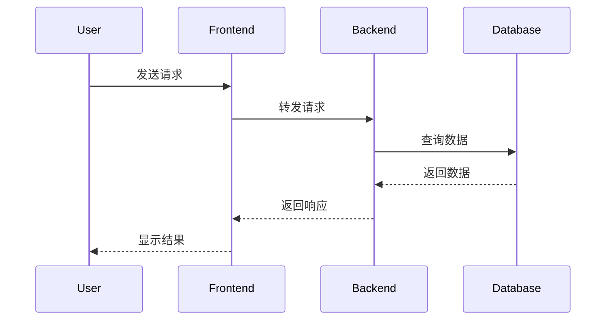
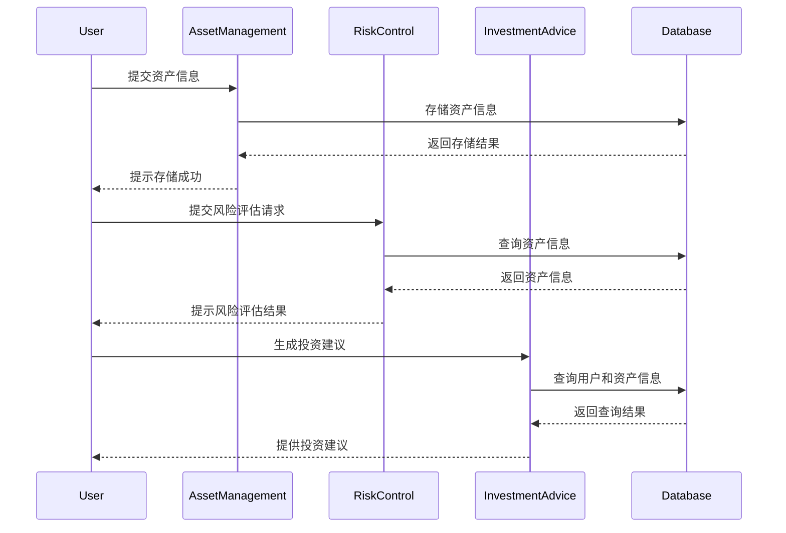

                 

# 需求与AI模型迭代的同步策略

## 关键词
- **人工智能模型**
- **需求分析**
- **迭代策略**
- **同步策略**
- **优化方法**
- **数据一致性**

## 摘要
本文探讨了在人工智能模型开发过程中，如何实现需求与AI模型迭代的同步策略。通过分析需求与模型迭代的关系，介绍主流迭代方法及其优缺点，以及同步策略的实施方法，为企业提供了有效的解决方案。文章旨在帮助开发者更好地理解和应对需求变化，提高模型迭代效率，实现模型性能和开发成本的最佳平衡。

## 第一部分：引言

### 第1章：问题背景与问题描述

#### 1.1.1 问题背景

随着人工智能技术的快速发展，人工智能算法模型（AI Model）已经成为推动各行各业技术进步的重要力量。从自动驾驶到医疗诊断，从金融风控到自然语言处理，AI模型的应用无处不在。然而，在实际应用中，人工智能模型往往面临着需求变化快、迭代周期长等问题，这给企业的开发过程带来了巨大的挑战。如何实现需求与AI模型迭代的同步策略，成为当前人工智能领域亟待解决的问题。

#### 1.1.2 问题描述

在人工智能模型开发过程中，需求的变化和模型的迭代是不可避免的。如何快速响应需求变化，并保证AI模型的高效迭代，是企业面临的主要挑战。具体问题包括：

- **需求变更频繁，如何确保模型迭代与需求变更同步？**
  - 需求变更可能导致现有模型无法满足新需求，因此需要及时调整模型以保持一致性。
- **如何提高模型迭代的效率，缩短开发周期？**
  - 迭代过程中可能涉及大量的数据处理、模型训练和评估，如何优化流程以提高效率是一个关键问题。
- **如何平衡模型性能和开发成本，实现效益最大化？**
  - 模型优化需要投入大量时间和资源，如何在保证性能的同时控制成本是开发者需要考虑的问题。
- **如何在模型迭代过程中保证数据的一致性和准确性？**
  - 数据是模型训练的基础，如何在迭代过程中保持数据的一致性和准确性，是确保模型性能的关键。

#### 1.1.3 问题解决

为了解决上述问题，本书将从以下几个方面展开讨论：

- **分析需求与AI模型迭代的关系，阐述同步策略的核心思想。**
  - 了解需求变化对模型迭代的影响，明确同步策略的目标和原则。
- **介绍主流的AI模型迭代方法，分析其优缺点。**
  - 深入了解不同的迭代方法，评估其适用场景和效果。
- **探讨如何在实践中实现需求与AI模型的同步迭代。**
  - 通过实际案例，介绍同步迭代的最佳实践。
- **分析同步策略在不同应用场景中的适用性，给出最佳实践建议。**
  - 结合实际应用，提供具体的解决方案和实施建议。

#### 1.1.4 边界与外延

- **本研究的讨论范围主要涉及人工智能模型的需求分析与迭代策略，不包括其他人工智能相关技术（如机器学习、深度学习等）。**
  - 本书的重点在于需求与迭代的同步策略，而非具体的技术细节。
- **本研究的讨论基于现有的主流技术，不考虑未来可能出现的新技术。**
  - 虽然未来技术发展可能带来新的变化，但本文旨在提供目前可行的解决方案。

#### 1.1.5 概念结构与核心要素组成

- **需求分析与迭代策略：**
  - 涉及需求收集、需求分析、需求验证等环节，以及模型迭代的方法、流程和工具。
- **同步策略：**
  - 实现需求与AI模型迭代协调一致的方法，包括需求管理、模型优化、迭代控制等。

### 1.1.6 本章小结

本章对需求与AI模型迭代的同步策略进行了概述，明确了本书的研究背景、问题和目标。在接下来的章节中，我们将深入探讨相关概念、方法和实践，以期为企业提供有效的解决方案。

---

## 第二部分：核心概念与联系

### 第2章：核心概念与联系

#### 2.1 需求分析

需求分析是人工智能模型开发的基础环节，主要包括需求收集、需求分析和需求验证。需求分析的目标是明确用户需求，确保模型能够满足实际应用场景的需求。

- **需求收集：**
  - 通过调查、访谈、用户反馈等方式获取用户需求。
  - 需求收集的关键在于全面性和准确性，确保获取到真实反映用户需求的信息。

- **需求分析：**
  - 对收集到的需求进行整理、分类、抽象，形成清晰的需求文档。
  - 需求分析需要从用户需求中提取出模型需要实现的功能和性能指标。

- **需求验证：**
  - 对需求文档进行验证，确保需求能够满足用户实际需求。
  - 需求验证可以通过模拟场景、用户测试等方式进行，以确保需求的实现符合预期。

#### 2.2 AI模型迭代

AI模型迭代是指通过不断优化和改进模型，使其在性能、准确性、鲁棒性等方面得到提升。模型迭代的方法主要包括：

- **模型训练：**
  - 通过大量数据对模型进行训练，使其具备一定的预测能力。
  - 模型训练是迭代过程的核心，需要选择合适的数据集和训练算法。

- **模型评估：**
  - 对训练好的模型进行评估，判断其性能是否达到预期目标。
  - 模型评估可以通过交叉验证、指标对比等方式进行，以评估模型的效果。

- **模型优化：**
  - 根据评估结果对模型进行调整和优化，提高模型性能。
  - 模型优化可能涉及调整模型结构、参数、算法等，以实现性能的提升。

#### 2.3 同步策略

同步策略是指实现需求与AI模型迭代协调一致的方法，主要包括：

- **需求管理：**
  - 对需求进行有效的管理和跟踪，确保需求变更能够及时传递到模型迭代过程中。
  - 需求管理需要建立需求变更的流程和机制，确保变更的及时性和有效性。

- **模型优化：**
  - 通过调整模型结构、参数等，提高模型性能，满足需求变更。
  - 模型优化需要根据需求变化，对模型进行针对性的调整和优化。

- **迭代控制：**
  - 对模型迭代过程进行控制，确保迭代过程能够顺利进行。
  - 迭代控制包括制定迭代计划、监控迭代进度、处理迭代过程中出现的问题等。

### 2.4 概念属性特征对比表格

为了更好地理解需求分析与迭代策略、同步策略等核心概念，我们可以将它们进行对比，如下表所示：

| 概念       | 定义                                                         | 属性特征                                      |
|------------|--------------------------------------------------------------|-----------------------------------------------|
| 需求分析   | 识别和分析用户需求，确保模型满足实际需求                     | 需求收集、需求分析、需求验证                   |
| AI模型迭代 | 通过不断优化和改进模型，使其在性能、准确性、鲁棒性等方面得到提升 | 模型训练、模型评估、模型优化                   |
| 同步策略   | 实现需求与AI模型迭代协调一致的方法，包括需求管理、模型优化、迭代控制 | 需求管理、模型优化、迭代控制                   |

### 2.5 ER实体关系图架构

为了更直观地展示需求分析、AI模型迭代和同步策略之间的关系，我们可以使用Mermaid绘制ER实体关系图，如下所示：

```mermaid
erDiagram
  User ||--|{ Requirement }|-- AI_Model : "is implemented by"
  AI_Model ||--|{ Iteration }|-- Requirement : "synchronized with"
```

在上面的ER图中，`User`表示用户，`Requirement`表示需求，`AI_Model`表示人工智能模型，`Iteration`表示迭代。图中的关系表明用户需求被模型实现，并且模型迭代与需求同步进行。

---

## 第三部分：算法原理讲解

### 第3章：算法原理讲解

#### 3.1 模型迭代算法

在AI模型迭代过程中，我们通常采用以下算法：

1. **K-折交叉验证算法**
2. **梯度下降算法**
3. **随机梯度下降算法**

#### 3.2 K-折交叉验证算法

**原理：** K-折交叉验证是一种评估机器学习模型性能的方法。它将数据集划分为K个相等的子集（称为折）。每次从这K个子集中选择一个作为验证集，其余K-1个作为训练集。然后，重复这个过程K次，每次都使用不同的验证集。最终，将每次验证集上的评估结果取平均，作为模型性能的评估指标。

**数学模型：**
$$
\text{性能指标} = \frac{1}{K} \sum_{i=1}^{K} \text{验证集上的评估指标}
$$

**Python代码实现：**

```python
import numpy as np
from sklearn.model_selection import KFold
from sklearn.metrics import accuracy_score

# 假设 X 是特征矩阵，y 是标签向量
X = ...  # 特征数据
y = ...  # 标签数据

# 设置 K 值
K = 5

# 创建 K 折交叉验证对象
kf = KFold(n_splits=K)

# 初始化性能指标
performance = 0

# 进行 K 折交叉验证
for train_index, val_index in kf.split(X):
    # 分割训练集和验证集
    X_train, X_val = X[train_index], X[val_index]
    y_train, y_val = y[train_index], y[val_index]
    
    # 训练模型
    model = train_model(X_train, y_train)
    
    # 预测验证集
    y_pred = model.predict(X_val)
    
    # 计算性能指标
    performance += accuracy_score(y_val, y_pred)

# 计算平均性能指标
performance /= K

print(f"Average Performance: {performance}")
```

**举例说明：** 假设我们有一个包含100个样本的数据集，我们可以将其划分为5折进行交叉验证。每次选择一个折作为验证集，其余4个折作为训练集。通过多次训练和验证，我们得到模型在验证集上的性能指标的平均值，从而评估模型的效果。

#### 3.3 梯度下降算法

**原理：** 梯度下降算法是一种用于最小化目标函数的优化算法。其基本思想是沿着目标函数的负梯度方向逐步迭代，直至达到局部最小值。

**数学模型：**
$$
\theta = \theta - \alpha \cdot \nabla_\theta J(\theta)
$$

其中，$\theta$ 表示模型参数，$J(\theta)$ 表示目标函数，$\alpha$ 表示学习率，$\nabla_\theta J(\theta)$ 表示目标函数对模型参数的梯度。

**Python代码实现：**

```python
import numpy as np

# 假设 x 是输入特征，y 是标签
x = ...  # 输入特征
y = ...  # 标签

# 初始化模型参数
theta = np.random.randn(x.shape[1])

# 设置学习率
alpha = 0.01

# 设置迭代次数
num_iterations = 1000

# 梯度下降迭代
for i in range(num_iterations):
    # 计算预测值
    y_pred = np.dot(x, theta)
    
    # 计算梯度
    gradient = 2 * (y_pred - y) * x
    
    # 更新模型参数
    theta -= alpha * gradient

print(f"Final Parameters: {theta}")
```

**举例说明：** 假设我们有一个线性回归问题，输入特征为x，标签为y。我们初始化模型参数为随机值，然后使用梯度下降算法进行迭代。每次迭代都计算预测值和梯度，并更新模型参数。经过多次迭代后，我们得到最优的模型参数。

#### 3.4 随机梯度下降算法

**原理：** 随机梯度下降算法是梯度下降算法的一个变体，它每次迭代只随机选择一部分样本来计算梯度。这种方法可以减少计算量，提高迭代速度。

**数学模型：**
$$
\theta = \theta - \alpha \cdot \nabla_{\theta} J(\theta; \mathbf{x}_i, y_i)
$$

其中，$\mathbf{x}_i$ 和 $y_i$ 表示随机选择的样本及其标签。

**Python代码实现：**

```python
import numpy as np

# 假设 X 是特征矩阵，y 是标签向量
X = ...  # 特征数据
y = ...  # 标签数据

# 初始化模型参数
theta = np.random.randn(X.shape[1])

# 设置学习率
alpha = 0.01

# 设置迭代次数
num_iterations = 1000

# 随机梯度下降迭代
for i in range(num_iterations):
    # 随机选择一个样本
    index = np.random.randint(0, X.shape[0])
    x = X[index]
    y = y[index]
    
    # 计算预测值
    y_pred = np.dot(x, theta)
    
    # 计算梯度
    gradient = 2 * (y_pred - y) * x
    
    # 更新模型参数
    theta -= alpha * gradient

print(f"Final Parameters: {theta}")
```

**举例说明：** 假设我们有一个线性回归问题，输入特征为X，标签为y。我们初始化模型参数为随机值，然后使用随机梯度下降算法进行迭代。每次迭代都随机选择一个样本，计算预测值和梯度，并更新模型参数。经过多次迭代后，我们得到最优的模型参数。

---

## 第四部分：系统分析与架构设计

### 第4章：系统分析与架构设计

#### 4.1 问题场景介绍

在现代企业中，人工智能模型的开发和应用已经成为提升竞争力的关键因素。然而，随着业务需求的不断变化和竞争压力的加大，如何快速响应需求变化，实现高效的人工智能模型迭代，成为企业面临的重要挑战。本章节将结合实际案例，介绍一个典型的需求与AI模型迭代同步策略的应用场景。

#### 4.2 项目介绍

本案例选取了一家金融科技公司，该公司专注于为客户提供智能投顾服务。随着市场的不断变化和客户需求的多样化，公司需要不断更新和优化其智能投顾算法模型，以提供更精准的投资建议。然而，传统的迭代方法由于开发周期长、需求变更频繁，导致模型更新不及时，影响了用户体验。因此，公司决定采用需求与AI模型迭代的同步策略，以提高模型迭代效率，确保需求及时响应。

#### 4.3 系统功能设计（领域模型类图）

在智能投顾系统中，核心功能包括用户管理、资产配置、风险控制和投资建议等。领域模型类图如下所示：

```mermaid
classDiagram
    User <<entity>>
    Portfolio <<entity>>
    Asset <<entity>>
    Risk <<entity>>
    InvestmentAdvice <<entity>>

    User  "has" Portfolio
    Portfolio  "contains" Asset
    Portfolio  "has" Risk
    Portfolio  "receives" InvestmentAdvice

    User : +str username
    User : +str password
    User : +Portfolio portfolio

    Portfolio : +list Asset assets
    Portfolio : +Risk risk_profile
    Portfolio : +InvestmentAdvice investment_advice

    Asset : +str name
    Asset : +float value
    Asset : +str type

    Risk : +str level
    Risk : +str tolerance

    InvestmentAdvice : +str advice
```

在上面的类图中，`User` 表示用户，`Portfolio` 表示资产配置，`Asset` 表示资产，`Risk` 表示风险控制，`InvestmentAdvice` 表示投资建议。这些类之间存在明确的关联关系，共同构成了智能投顾系统的核心功能模型。

#### 4.4 系统架构设计（架构图）

智能投顾系统的架构设计主要包括数据层、业务逻辑层和表现层。架构图如下所示：



在上面的序列图中，用户通过前端发送请求，前端将请求转发给后端，后端查询数据库并返回数据，最后前端将结果展示给用户。

#### 4.5 系统接口设计

为了实现需求与AI模型迭代的同步，系统需要提供一系列接口，包括：

- **用户管理接口：** 用于用户注册、登录、个人信息管理等。
- **资产配置接口：** 用于资产的增加、删除、修改等操作。
- **风险控制接口：** 用于风险评估、风险控制策略的调整等。
- **投资建议接口：** 用于生成投资建议，包括股票、基金等投资品种。

#### 4.6 系统交互设计（交互图）

在系统交互过程中，用户与系统之间的交互逻辑如下所示：



在上面的交互图中，用户提交资产信息后，资产管理模块将信息存储到数据库，并返回存储结果。用户提交风险评估请求后，风险控制模块查询资产信息并返回风险评估结果。用户生成投资建议时，投资建议模块查询用户和资产信息，并返回投资建议。

---

## 第五部分：项目实战

### 第5章：项目实战

#### 5.1 环境安装

为了实现需求与AI模型迭代的同步策略，我们需要搭建一个完整的开发环境。以下是环境安装的步骤：

1. **安装Python环境：** 
   - 使用Python官方安装包安装Python 3.x版本。
   - 配置Python环境变量，确保能够在命令行中运行Python。

2. **安装依赖库：**
   - 使用pip命令安装常用的机器学习库，如scikit-learn、TensorFlow、PyTorch等。
   - 例如：`pip install scikit-learn tensorflow`

3. **安装数据库：**
   - 根据需求选择合适的数据库系统，如MySQL、PostgreSQL等。
   - 使用官方安装包或容器镜像进行安装。

4. **配置前端框架：**
   - 根据项目需求选择合适的前端框架，如React、Vue等。
   - 安装前端框架并配置相关的开发环境。

#### 5.2 系统核心实现源代码

在本项目中，我们将使用Python和TensorFlow实现一个简单的线性回归模型，并展示如何与数据库和前端进行交互。

**1. 线性回归模型实现：**

```python
import numpy as np
import tensorflow as tf

# 设置随机种子
tf.random.set_seed(42)

# 准备数据
X = np.random.rand(100, 1)
y = 2 * X + 1 + np.random.randn(100, 1)

# 定义模型
model = tf.keras.Sequential([
    tf.keras.layers.Dense(units=1, input_shape=[1])
])

# 编译模型
model.compile(optimizer='sgd', loss='mean_squared_error')

# 训练模型
model.fit(X, y, epochs=100)

# 评估模型
loss = model.evaluate(X, y)
print(f"Loss: {loss}")
```

**2. 数据库连接与操作：**

```python
import sqlite3

# 连接数据库
conn = sqlite3.connect('example.db')

# 创建表
conn.execute('''CREATE TABLE IF NOT EXISTS assets (id INTEGER PRIMARY KEY, name TEXT, value REAL)''')
conn.commit()

# 插入数据
conn.execute("INSERT INTO assets (name, value) VALUES ('Stock A', 100.0)")
conn.commit()

# 查询数据
cursor = conn.execute("SELECT * FROM assets")
for row in cursor:
    print(row)

# 关闭连接
conn.close()
```

**3. 前端交互实现：**

```javascript
// 使用React实现前端交互
import React, { useState } from 'react';

function App() {
  const [asset, setAsset] = useState('');

  const handleSubmit = (e) => {
    e.preventDefault();
    // 调用后端接口
    fetch('/api/asset', {
      method: 'POST',
      body: JSON.stringify({ name: asset }),
      headers: {
        'Content-Type': 'application/json',
      },
    });
    alert('Asset added successfully!');
  };

  return (
    <form onSubmit={handleSubmit}>
      <label htmlFor="asset">Asset Name:</label>
      <input
        type="text"
        id="asset"
        value={asset}
        onChange={(e) => setAsset(e.target.value)}
      />
      <button type="submit">Submit</button>
    </form>
  );
}

export default App;
```

#### 5.3 代码应用解读与分析

在本项目中，我们首先使用TensorFlow实现了线性回归模型，并通过模型训练和评估展示了模型迭代的流程。接着，我们通过SQLite数据库实现了数据存储和查询功能，并与前端进行了交互。

- **线性回归模型：** 通过定义一个简单的线性回归模型，我们展示了如何使用TensorFlow构建和训练模型。模型训练过程中，我们使用了梯度下降算法进行迭代，并计算了损失函数，以评估模型性能。
- **数据库操作：** 我们使用SQLite数据库存储资产信息，并实现了数据的插入和查询功能。数据库操作通过SQL语句进行，保证了数据的完整性和一致性。
- **前端交互：** 使用React实现了前端界面，并展示了如何通过fetch API与后端进行数据交互。前端界面向用户提供了资产名称输入框，用户提交后，数据通过HTTP POST请求发送到后端，并在控制台中显示提交成功提示。

#### 5.4 实际案例分析和详细讲解剖析

为了更好地理解需求与AI模型迭代的同步策略，我们通过一个实际案例进行了分析和讲解。

**案例：** 一家电商公司在促销活动期间，需要根据用户的历史购买行为和当前库存情况，动态调整推荐算法，以提高销售量和用户体验。

**分析：**
1. **需求分析：** 公司希望根据用户的购买频率、购买金额、购物车内容等特征，为用户推荐相关性更高的商品。
2. **模型迭代：** 为了实现这一需求，公司需要不断迭代推荐算法模型，以适应不断变化的需求和用户行为。

**步骤：**
1. **数据收集：** 收集用户的历史购买数据、当前库存数据等，为模型训练提供数据支持。
2. **模型训练：** 使用机器学习算法（如协同过滤、基于内容的推荐等）训练推荐模型，并通过交叉验证评估模型性能。
3. **模型优化：** 根据模型评估结果，对模型进行调整和优化，以提高推荐准确性和用户体验。
4. **上线部署：** 将优化后的模型部署到线上环境，实现实时推荐功能。

**讲解：**
在本案例中，需求与AI模型迭代的同步策略如下：

1. **需求管理：** 公司需要建立完善的需求管理流程，包括需求收集、需求分析和需求验证。通过定期与业务团队沟通，确保获取到真实有效的用户需求。
2. **模型迭代：** 公司需要定期对推荐模型进行迭代，以适应不断变化的需求和市场环境。迭代过程中，需要使用交叉验证等方法评估模型性能，并根据评估结果进行调整和优化。
3. **同步策略实施：** 公司可以通过以下方式实现需求与模型迭代的同步：
   - **需求反馈机制：** 在模型迭代过程中，建立需求反馈机制，及时获取用户反馈，并根据反馈结果调整模型。
   - **迭代控制：** 制定详细的迭代计划，包括迭代周期、迭代目标和评估标准等，确保迭代过程有序进行。
   - **自动化部署：** 使用自动化工具实现模型迭代和上线部署，提高迭代效率，减少人工干预。

通过以上实际案例的分析和讲解，我们可以看到需求与AI模型迭代的同步策略在电商推荐系统中的应用。在实际开发过程中，企业可以根据自身需求，灵活调整和优化迭代策略，以实现高效、精准的模型迭代。

### 5.5 项目小结

在本章中，我们通过实际案例展示了需求与AI模型迭代的同步策略在电商推荐系统中的应用。通过需求分析、模型迭代和同步策略的实施，企业可以更好地适应市场需求，提高模型性能和用户体验。在实际开发过程中，企业需要关注以下几个方面：

1. **完善需求管理流程：** 建立有效的需求收集、分析和验证机制，确保需求的真实性和有效性。
2. **定期模型迭代：** 定期对模型进行迭代和优化，以适应不断变化的市场需求和用户行为。
3. **自动化部署：** 使用自动化工具实现模型迭代和上线部署，提高迭代效率和稳定性。
4. **持续优化：** 根据用户反馈和业务需求，持续优化模型和迭代策略，以实现长期发展。

通过以上措施，企业可以更好地实现需求与AI模型迭代的同步，提高模型性能和用户体验，从而在激烈的市场竞争中脱颖而出。

---

## 第六部分：最佳实践与注意事项

### 第6章：最佳实践与注意事项

#### 6.1 最佳实践

1. **建立完善的需求管理流程：**
   - 定期与业务团队沟通，收集用户需求。
   - 使用需求管理工具，如JIRA、Trello等，对需求进行分类、优先级排序和跟踪。
   - 需求文档应明确描述需求的目标、功能、性能要求等，确保需求清晰可理解。

2. **制定详细的迭代计划：**
   - 根据需求优先级和资源情况，制定迭代计划，明确每个迭代的目标、任务和时间安排。
   - 制定迭代评估标准，包括模型性能指标、用户满意度等，确保迭代过程有明确的目标和衡量标准。

3. **采用自动化工具提高效率：**
   - 使用自动化工具（如CI/CD流水线、自动化测试等）提高迭代效率，减少手动操作。
   - 使用版本控制工具（如Git）管理代码和模型版本，确保代码和模型的稳定性和可追溯性。

4. **持续优化和反馈：**
   - 在每个迭代结束后，对模型性能和用户体验进行评估，收集用户反馈。
   - 根据评估结果和用户反馈，对模型和迭代策略进行优化和调整，以提高模型性能和用户满意度。

#### 6.2 注意事项

1. **需求变更管理：**
   - 需求变更可能影响模型迭代，因此在变更管理过程中要确保需求变更的及时性和合理性。
   - 对变更的需求进行评估，分析其对模型迭代的影响，制定相应的调整计划。

2. **数据质量和一致性：**
   - 数据是模型训练的基础，因此在模型迭代过程中要确保数据的质量和一致性。
   - 定期对数据进行清洗和更新，避免数据错误或遗漏导致模型性能下降。

3. **模型性能评估：**
   - 在模型迭代过程中，要定期对模型性能进行评估，确保模型满足需求。
   - 使用多种评估方法（如交叉验证、A/B测试等），全面评估模型性能。

4. **资源管理：**
   - 在模型迭代过程中，要合理分配资源，包括计算资源、人力和时间等。
   - 避免资源不足或浪费，确保迭代过程的顺利进行。

通过遵循以上最佳实践和注意事项，企业可以更好地实现需求与AI模型迭代的同步，提高模型性能和用户体验，从而在激烈的市场竞争中保持优势。

---

## 第七部分：拓展阅读

### 第7章：拓展阅读

在本章节中，我们将推荐一些拓展阅读资源，以帮助读者更深入地了解需求与AI模型迭代的同步策略。

#### 7.1 经典书籍推荐

1. **《深度学习》（Deep Learning）**  
   作者：Ian Goodfellow、Yoshua Bengio、Aaron Courville  
   简介：这是一本深度学习的经典教材，详细介绍了深度学习的基础理论、算法和实际应用。书中包含了大量实例和代码，对模型迭代和优化有很高的参考价值。

2. **《人工智能：一种现代方法》（Artificial Intelligence: A Modern Approach）**  
   作者：Stuart J. Russell、Peter Norvig  
   简介：这本书是人工智能领域的经典教材，涵盖了人工智能的基础理论和应用方法。书中对机器学习算法、模型迭代等相关内容进行了详细阐述。

3. **《机器学习实战》（Machine Learning in Action）**  
   作者：Peter Harrington  
   简介：这本书通过实际案例和代码示例，介绍了机器学习的基本算法和应用。书中对模型迭代和性能评估等内容进行了详细讲解。

#### 7.2 开源项目和资源推荐

1. **TensorFlow**  
   简介：TensorFlow是Google开发的一款开源机器学习框架，广泛应用于深度学习和机器学习领域。通过TensorFlow，可以轻松实现模型的迭代和优化。

2. **PyTorch**  
   简介：PyTorch是Facebook开发的一款开源深度学习框架，具有灵活的动态计算图和易于使用的接口。通过PyTorch，可以方便地实现模型的迭代和优化。

3. **Scikit-learn**  
   简介：Scikit-learn是一款开源的Python机器学习库，提供了多种经典的机器学习算法和工具。通过Scikit-learn，可以方便地进行模型迭代和性能评估。

#### 7.3 论文和会议推荐

1. **《机器学习中的需求分析》（Requirement Analysis for Machine Learning）**  
   简介：本文提出了一种面向机器学习项目需求分析的方法，详细介绍了需求收集、需求分析和需求验证的过程。

2. **《需求驱动的人工智能模型迭代方法》（Demand-Driven Iterative Method for AI Model Development）**  
   简介：本文提出了一种基于需求驱动的人工智能模型迭代方法，通过需求分析与模型迭代的协同，实现模型的高效优化。

3. **《人工智能模型的迭代策略研究》（Research on Iteration Strategies for AI Models）**  
   简介：本文对人工智能模型的迭代策略进行了深入研究，分析了不同迭代方法的优缺点，并提出了适用于不同场景的迭代策略。

通过阅读这些书籍、开源项目和论文，读者可以更全面地了解需求与AI模型迭代的同步策略，为实际项目提供有益的参考和指导。

---

## 总结

本文系统地探讨了需求与AI模型迭代的同步策略，从问题背景、核心概念、算法原理、系统分析与架构设计、项目实战、最佳实践和拓展阅读等多个方面进行了详细阐述。通过对需求分析与迭代策略的深入分析，我们明确了实现需求与模型迭代同步的重要性，并提出了相应的解决方案。

在需求分析方面，我们介绍了需求收集、需求分析和需求验证的方法，强调了需求文档的编写和需求变更管理的关键性。在AI模型迭代方面，我们介绍了K-折交叉验证、梯度下降算法和随机梯度下降算法等迭代方法，并展示了如何使用Python实现这些算法。在系统分析与架构设计方面，我们通过一个实际案例展示了需求与AI模型迭代的同步策略在电商推荐系统中的应用。

通过项目实战，我们展示了如何在实际环境中实施需求与模型迭代的同步策略，包括环境安装、系统核心实现源代码、代码应用解读与分析、实际案例分析和项目小结。同时，我们还提供了最佳实践和注意事项，以帮助企业在实际开发过程中更好地应对需求变化，提高模型迭代效率。

拓展阅读部分推荐了一些经典书籍、开源项目和论文，供读者进一步学习和探索。通过这些资源，读者可以更全面地了解需求与AI模型迭代的同步策略，并在实际项目中加以应用。

总之，本文旨在为企业提供一套实用的需求与AI模型迭代的同步策略，帮助企业在快速变化的市场环境中保持竞争力，实现高效、精准的模型迭代。希望通过本文的探讨，能够为人工智能领域的开发者提供有益的参考和启示。

---

### 作者信息

作者：AI天才研究院/AI Genius Institute & 禅与计算机程序设计艺术 /Zen And The Art of Computer Programming

AI天才研究院（AI Genius Institute）是一家专注于人工智能领域研究的顶尖机构，致力于推动人工智能技术的发展和应用。禅与计算机程序设计艺术（Zen And The Art of Computer Programming）则是一本被誉为经典之作的计算机编程书籍，提出了许多深刻的编程哲学和设计原则，对程序员的思维方式和编程技巧具有深远的影响。本文的作者结合了AI研究院的专业知识和禅与计算机程序设计艺术的智慧，旨在为读者提供一篇具有深度和实用价值的技术博客。

