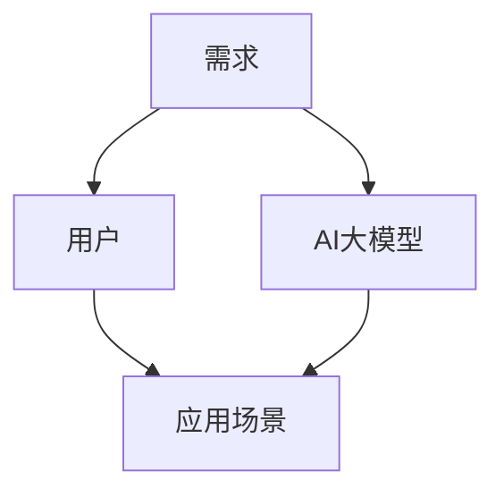
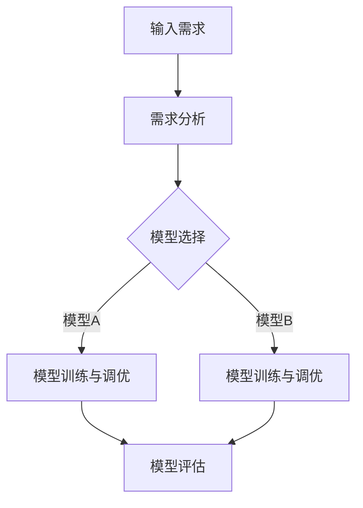
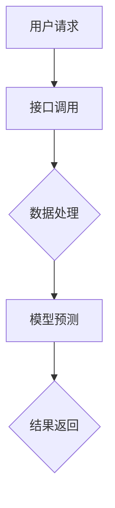
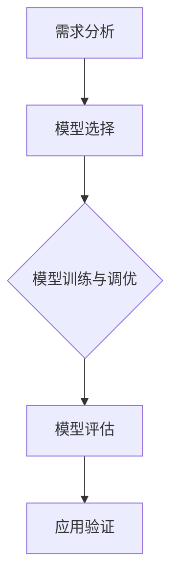
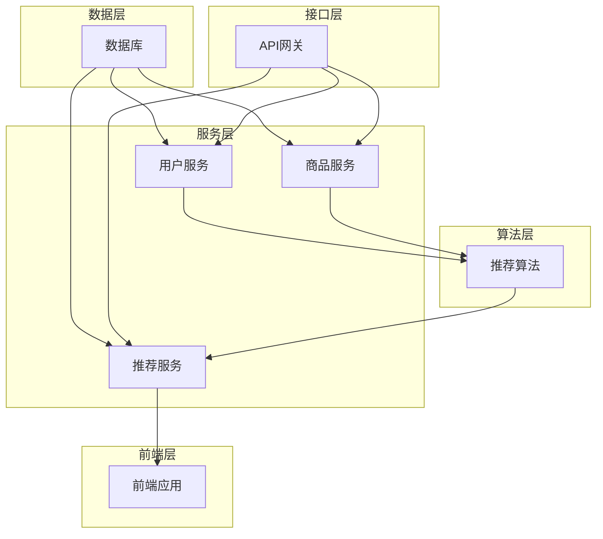
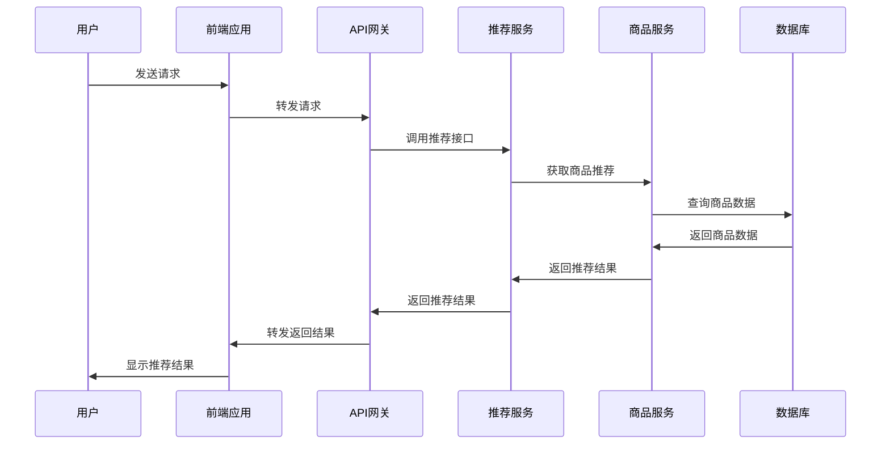

                 

### 文章标题

# 需求与AI能力的匹配：大模型应用开发的挑战

> 关键词：人工智能、大模型、需求匹配、应用开发、算法优化

> 摘要：本文深入探讨需求与AI大模型能力匹配在应用开发中的关键挑战，从问题背景、核心概念、算法原理到系统架构设计，逐步解析这一复杂过程，旨在为开发者和研究者提供实用的指导。

## 设计书籍目录大纲：需求与AI能力的匹配：大模型应用开发的挑战

### 第一部分：背景介绍

#### 第1章：问题背景与定义

**1.1 问题背景**

随着人工智能（AI）技术的迅猛发展，AI大模型在各个领域展现出强大的应用潜力。从自然语言处理到计算机视觉，从语音识别到机器翻译，大模型正不断突破技术边界，推动各行各业向智能化转型。

然而，与此同时，需求驱动型创新与AI能力的匹配问题也日益凸显。如何在海量数据中精准提取用户需求，如何选择并优化合适的大模型以满足这些需求，成为当前AI应用开发中亟待解决的关键挑战。

**1.2 问题描述**

如何有效地将具体应用场景的需求与AI大模型的能力进行匹配？

如何评估和优化AI大模型在特定应用中的表现？

这不仅是技术问题，更涉及到商业模式、用户体验等多个方面。

**1.3 问题解决**

需求分析：通过需求调研和分析，明确具体应用场景的核心需求。

模型选择：根据需求，选择合适的AI大模型。

模型训练与调优：调整模型参数，优化模型性能。

应用验证：通过实际应用验证模型的效果。

**1.4 边界与外延**

**1.4.1 边界**

AI大模型的能力范围：包括自然语言处理、计算机视觉、语音识别等。

应用场景限制：如硬件资源、数据质量等。

**1.4.2 外延**

需求与AI能力匹配在不同行业领域的应用。

未来发展趋势与技术挑战。

### 第二部分：核心概念与联系

#### 第2章：核心概念原理

**2.1 AI大模型的核心概念**

定义：具有大规模参数和计算能力的人工智能模型。

特点：高精度、强泛化、自动化。

**2.2 需求的概念属性**

描述：用户期望产品或系统能实现的功能和性能。

类型：功能性需求、非功能性需求。

**2.3 需求与AI能力的联系**

对齐原则：需求与模型能力的相互适应和优化。

联系模型：需求-模型匹配的评估方法和优化策略。

#### 第2.4章：概念属性特征对比表格

| 概念       | 描述               | 特征对比                     |
|------------|--------------------|------------------------------|
| 需求       | 用户期望           | 功能性需求、非功能性需求     |
| AI大模型   | 人工智能模型       | 大规模参数、强泛化           |
| 匹配原则   | 需求与能力的适应   | 优化策略、评估方法           |

#### 第2.5章：ER实体关系图架构



### 第三部分：算法原理讲解

#### 第3章：算法原理与实现

**3.1 算法概述**

需求与AI大模型匹配算法的基本框架。

**3.2 算法原理**

利用Mermaid绘制算法流程图。

**3.3 数学模型与公式**

使用LaTeX格式给出核心数学模型和公式。

**3.4 举例说明**

提供实际应用场景，通过Python代码和详细解释阐述算法的应用。



```latex
$$
\text{成本函数} = \frac{1}{n} \sum_{i=1}^{n} (\text{需求值} - \text{模型预测值})^2
$$
```

### 第四部分：系统分析与架构设计方案

#### 第4章：问题场景介绍

**4.1 场景描述**

在电商领域，如何通过AI大模型匹配用户需求？

**4.2 项目介绍**

项目目标：实现基于AI大模型的个性化推荐系统。

项目架构：前端、后端、数据库等组成部分。

#### 第4.3章：系统功能设计

**4.3.1 领域模型**

利用Mermaid绘制领域模型类图。

**4.3.2 系统架构设计**

#### 第4.4章：系统接口设计和系统交互

**4.4.1 系统接口设计**

API接口定义。

**4.4.2 系统交互**

利用Mermaid绘制系统交互序列图。



## 第一部分：背景介绍

### 第1章：问题背景与定义

#### 1.1 问题背景

随着人工智能（AI）技术的迅猛发展，AI大模型在各个领域展现出强大的应用潜力。从自然语言处理到计算机视觉，从语音识别到机器翻译，大模型正不断突破技术边界，推动各行各业向智能化转型。然而，与此同时，需求驱动型创新与AI能力的匹配问题也日益凸显。

在AI领域，大模型通常指的是拥有数亿甚至数千亿个参数的神经网络模型，例如GPT-3、BERT等。这些模型通过训练学习大量的数据，可以实现对复杂任务的精准预测和执行。然而，这些强大的模型并不是万能的。在具体应用场景中，如何有效地将具体应用场景的需求与AI大模型的能力进行匹配，成为当前AI应用开发中亟待解决的关键挑战。

需求驱动型创新是指以用户需求为核心，通过不断收集和分析用户反馈，来驱动产品或服务的改进和创新。在这种模式下，用户需求的变化速度往往快于技术的迭代速度，这就要求AI大模型能够灵活地适应不断变化的需求，从而实现高效的匹配和优化。

#### 1.2 问题描述

如何有效地将具体应用场景的需求与AI大模型的能力进行匹配？

如何评估和优化AI大模型在特定应用中的表现？

这两个问题涉及到AI大模型应用开发的方方面面，不仅包括技术层面，还涉及到商业模式、用户体验等多个方面。

首先，如何将具体应用场景的需求与AI大模型的能力进行匹配？这是一个复杂的过程，需要从需求分析、模型选择、模型训练与调优等多个环节进行考虑。需求分析是第一步，需要通过用户调研、数据分析等方法，明确用户的核心需求。接下来，根据需求选择合适的大模型，这需要了解不同大模型的特点和应用范围。最后，通过模型训练与调优，使得模型能够更好地适应具体应用场景。

其次，如何评估和优化AI大模型在特定应用中的表现？评估模型表现通常需要设定一系列的评估指标，如准确率、召回率、F1分数等。然而，这些指标只是冰山一角，更关键的是要理解模型在特定应用中的实际表现。这就需要通过实际应用场景进行验证，收集用户反馈，不断调整和优化模型。

#### 1.3 问题解决

面对上述问题，我们需要从以下几个方面进行思考和解决：

**需求分析：**

通过用户调研、数据分析等方法，明确用户的核心需求。这一步是整个匹配过程的基石，只有准确地理解用户需求，才能确保后续的工作能够有的放矢。

**模型选择：**

根据需求，选择合适的大模型。这需要了解不同大模型的特点和应用范围，例如GPT-3适用于自然语言处理，BERT适用于文本分类和情感分析等。

**模型训练与调优：**

通过调整模型参数，优化模型性能。这一步是整个匹配过程的核心，需要根据具体应用场景的需求，对模型进行细粒度的调整。

**应用验证：**

通过实际应用验证模型的效果。这一步是评估模型是否成功匹配需求的关键，需要通过用户反馈和数据指标来不断调整和优化模型。

**边界与外延：**

AI大模型的能力范围：包括自然语言处理、计算机视觉、语音识别等。

应用场景限制：如硬件资源、数据质量等。

需求与AI能力匹配在不同行业领域的应用：如金融、医疗、电商等。

未来发展趋势与技术挑战：如模型压缩、联邦学习等。

### 第1.4章：边界与外延

#### 1.4.1 边界

AI大模型的能力范围：

- 自然语言处理：如文本分类、情感分析、机器翻译等。
- 计算机视觉：如图像分类、目标检测、图像生成等。
- 语音识别：如语音识别、语音合成等。

应用场景限制：

- 硬件资源：大模型通常需要大量的计算资源，如GPU或TPU等。
- 数据质量：高质量的数据是训练大模型的关键，数据质量直接影响模型的性能。

#### 1.4.2 外延

需求与AI能力匹配在不同行业领域的应用：

- 金融：智能投顾、风险评估、反欺诈等。
- 医疗：疾病预测、诊断辅助、药物研发等。
- 电商：个性化推荐、商品搜索、用户行为分析等。

未来发展趋势与技术挑战：

- 模型压缩：如何减少模型的大小，以便在移动设备上运行。
- 联邦学习：如何在保护用户隐私的前提下，进行大规模的数据协作和学习。
- 多模态学习：如何将不同类型的数据（如图像、文本、语音等）进行整合，以提高模型的泛化能力。

## 第二部分：核心概念与联系

### 第2章：核心概念原理

#### 2.1 AI大模型的核心概念

AI大模型，是指具有大规模参数和计算能力的人工智能模型。这些模型通过训练学习大量的数据，可以实现对复杂任务的精准预测和执行。常见的AI大模型包括GPT-3、BERT、Transformer等。

特点：

- 高精度：通过大规模参数的学习，大模型可以在各种任务上达到非常高的准确率。
- 强泛化：大模型通常具有较强的泛化能力，可以在不同的应用场景中表现出色。
- 自动化：大模型可以自动化执行各种复杂的任务，降低人工干预的需求。

#### 2.2 需求的概念属性

需求，是指用户期望产品或系统能实现的功能和性能。在AI大模型应用开发中，需求分析是至关重要的一步，只有准确理解用户需求，才能确保模型能够有效匹配。

概念属性：

- 功能性需求：指用户期望产品或系统能实现的具体功能，如文本分类、目标检测等。
- 非功能性需求：指用户对产品或系统的性能要求，如响应时间、准确率等。

#### 2.3 需求与AI能力的联系

需求与AI能力的匹配，是指通过需求分析和模型选择，使得AI大模型能够满足用户的具体需求。这一过程涉及到多个环节，包括需求分析、模型选择、模型训练与调优等。

对齐原则：

- 需求明确：通过需求分析，明确用户的核心需求，确保模型能够针对这些需求进行优化。
- 模型适应：根据需求选择合适的AI大模型，确保模型能够适应特定的应用场景。
- 持续优化：通过模型训练与调优，不断调整模型参数，提高模型在特定需求下的表现。

联系模型：

需求-模型匹配的评估方法和优化策略，包括：

- 评估指标：设定一系列评估指标，如准确率、召回率、F1分数等，以衡量模型在特定需求下的表现。
- 优化策略：通过调整模型参数、增加训练数据、改变训练策略等，提高模型在特定需求下的性能。

## 第2.4章：概念属性特征对比表格

| 概念       | 描述               | 特征对比                     |
|------------|--------------------|------------------------------|
| 需求       | 用户期望           | 功能性需求、非功能性需求     |
| AI大模型   | 人工智能模型       | 大规模参数、强泛化           |
| 匹配原则   | 需求与能力的适应   | 优化策略、评估方法           |

## 第2.5章：ER实体关系图架构


## 第三部分：算法原理讲解

### 第3章：算法原理与实现

#### 3.1 算法概述

需求与AI大模型匹配算法的基本框架包括以下几个步骤：

1. 需求分析：通过用户调研、数据分析等方法，明确用户的核心需求。
2. 模型选择：根据需求，选择合适的AI大模型。
3. 模型训练与调优：通过调整模型参数，优化模型性能。
4. 模型评估：通过设定一系列评估指标，如准确率、召回率、F1分数等，评估模型在特定需求下的表现。
5. 应用验证：通过实际应用验证模型的效果。

#### 3.2 算法原理

算法原理可以概括为“需求驱动，模型优化，评估反馈”。具体而言：

- 需求驱动：以用户需求为导向，通过需求分析明确用户的核心需求。
- 模型优化：根据需求选择合适的AI大模型，并通过模型训练与调优，优化模型性能。
- 评估反馈：通过设定评估指标，评估模型在特定需求下的表现，并根据评估结果进行模型优化。

为了更直观地展示算法原理，我们可以使用Mermaid绘制算法流程图：



#### 3.3 数学模型与公式

在需求与AI大模型匹配的过程中，常用的数学模型和公式包括：

- 成本函数：用于衡量模型在特定需求下的表现，常见的成本函数有均方误差（MSE）和交叉熵（CE）。
- 梯度下降：用于优化模型参数，常见的梯度下降方法有随机梯度下降（SGD）和批量梯度下降（BGD）。

以下是一个简单的成本函数和梯度下降公式的示例：

```latex
$$
\text{MSE} = \frac{1}{n} \sum_{i=1}^{n} (\hat{y}_i - y_i)^2
$$

$$
\text{梯度下降}：\theta_{\text{更新}} = \theta_{\text{当前}} - \alpha \cdot \nabla_{\theta} \text{成本函数}
$$
```

其中，$\hat{y}_i$为模型预测值，$y_i$为真实值，$\alpha$为学习率，$\nabla_{\theta} \text{成本函数}$为成本函数关于参数$\theta$的梯度。

#### 3.4 举例说明

为了更好地理解需求与AI大模型匹配算法的原理，我们可以通过一个实际应用场景进行说明。假设我们想要开发一个个性化推荐系统，用户可以根据自己的喜好获取到最感兴趣的物品。

**步骤1：需求分析**

首先，我们需要明确用户的需求。通过用户调研和数据分析，我们了解到用户的需求主要包括：

- 喜欢的物品类型：如书籍、电影、音乐等。
- 喜欢的物品属性：如价格、品牌、评分等。
- 用户行为：如浏览历史、购买记录等。

**步骤2：模型选择**

根据用户需求，我们可以选择一个适合的AI大模型。例如，我们可以选择一个基于Transformer的推荐模型，该模型具有强大的文本处理能力和泛化能力，可以很好地处理用户的喜好和物品属性。

**步骤3：模型训练与调优**

接下来，我们需要对模型进行训练和调优。我们使用用户的历史数据和物品属性数据来训练模型，并通过交叉验证等方法来评估模型的性能。在训练过程中，我们通过调整模型参数，如学习率、批量大小等，来优化模型性能。

**步骤4：模型评估**

在模型训练完成后，我们需要通过设定一系列评估指标，如准确率、召回率、F1分数等，来评估模型在用户需求下的表现。这些评估指标可以帮助我们了解模型在推荐任务中的效果，并为进一步优化提供指导。

**步骤5：应用验证**

最后，我们需要通过实际应用来验证模型的效果。我们将模型部署到线上环境，并收集用户的反馈和数据。通过分析用户的行为数据和反馈，我们可以进一步优化模型，提高推荐的准确性和用户满意度。

通过上述步骤，我们可以实现一个基于AI大模型的个性化推荐系统，从而满足用户的需求。

## 第四部分：系统分析与架构设计方案

### 第4章：问题场景介绍

#### 4.1 场景描述

在电商领域，用户需求的个性化推荐是至关重要的一环。一个高效的个性化推荐系统可以显著提高用户的购物体验，增加用户粘性，从而提升电商平台的销售额。然而，实现这样一个系统面临着诸多挑战，其中包括如何精准地匹配用户需求与AI大模型的能力。

在电商场景中，用户需求包括但不限于：

- 用户偏好：如喜欢的商品类型、品牌、价格区间等。
- 用户行为：如浏览历史、购买记录、点击记录等。
- 商品特征：如商品分类、商品属性、商品评分等。

AI大模型在电商场景中的应用包括但不限于：

- 用户行为预测：如预测用户可能会购买哪些商品。
- 商品推荐：根据用户偏好和商品特征，推荐最适合用户的商品。
- 搜索优化：优化商品搜索结果，提高用户找到感兴趣商品的概率。

#### 4.2 项目介绍

项目目标：实现一个基于AI大模型的个性化推荐系统，以提高电商平台的用户满意度和销售额。

项目架构：个性化推荐系统通常包括前端、后端和数据库三个主要组成部分。

- **前端**：负责展示推荐结果和用户交互界面。
- **后端**：包括推荐算法服务、用户服务、商品服务、数据库等，负责处理用户请求、执行推荐算法和存储数据。
- **数据库**：存储用户数据、商品数据和推荐结果等。

### 第4.3章：系统功能设计

#### 4.3.1 领域模型

在个性化推荐系统中，领域模型是理解和设计系统功能的关键。领域模型描述了系统中的核心实体和它们之间的关系。以下是一个简单的领域模型，用Mermaid类图表示：

```mermaid
classDiagram
    User <|-- UserBehavior
    User <|-- UserPreference
    Item <|-- ItemFeature
    Recommendation <|-- Item

    User
    UserBehavior
    UserPreference
    Item
    ItemFeature
    Recommendation

    User { 
        id: 用户ID
        name: 用户名
        behaviors: [UserBehavior]
        preferences: [UserPreference]
    }

    UserBehavior {
        id: 行为ID
        type: 行为类型
        timestamp: 时间戳
        item: Item
    }

    UserPreference {
        id: 偏好ID
        type: 偏好类型
        value: 偏好值
    }

    Item {
        id: 商品ID
        name: 商品名称
        features: [ItemFeature]
    }

    ItemFeature {
        id: 特征ID
        type: 特征类型
        value: 特征值
    }

    Recommendation {
        id: 推荐ID
        items: [Item]
    }
```

#### 4.3.2 系统架构设计

个性化推荐系统的架构设计需要考虑推荐算法、数据处理、存储和数据访问等关键组件。以下是一个典型的系统架构设计，用Mermaid架构图表示：



### 第4.4章：系统接口设计和系统交互

#### 4.4.1 系统接口设计

系统接口设计是系统架构设计的重要组成部分，它定义了前端、后端和数据库之间的交互方式。以下是一个简单的接口设计示例：

- **用户服务接口**：提供用户注册、登录、获取用户信息和更新用户信息等功能。
- **商品服务接口**：提供商品查询、商品详情、商品分类和商品推荐等功能。
- **推荐服务接口**：提供根据用户偏好和商品特征生成推荐列表的功能。

#### 4.4.2 系统交互

系统交互描述了用户请求如何通过前端、后端和数据库之间的接口进行传递和处理。以下是一个简单的系统交互序列图，用Mermaid表示：



通过上述系统接口设计和交互设计，我们可以实现一个功能齐全、高效稳定的个性化推荐系统，从而满足电商平台的用户需求。

## 项目实战

### 环境安装

为了实现基于AI大模型的个性化推荐系统，我们需要搭建一个合适的技术环境。以下是在一个常见的Linux服务器上安装和配置所需环境的基本步骤：

#### 1. 安装Python环境

首先，我们需要安装Python环境。大多数Linux发行版都自带Python，但为了保证兼容性和方便性，我们可以使用Python的官方版本。

```bash
sudo apt-get update
sudo apt-get install python3 python3-pip
```

#### 2. 安装依赖库

接下来，我们需要安装一些Python依赖库，这些库包括TensorFlow、Scikit-learn等。

```bash
pip3 install tensorflow scikit-learn pandas numpy
```

#### 3. 安装数据库

我们选择PostgreSQL作为数据库，可以使用以下命令进行安装。

```bash
sudo apt-get install postgresql postgresql-contrib
```

安装完成后，初始化数据库并创建用户。

```bash
sudo -u postgres initdb -D /var/lib/postgresql/13/main
sudo -u postgres createuser -s user
```

#### 4. 配置数据库

配置PostgreSQL的配置文件`postgresql.conf`和`pg_hba.conf`，确保数据库服务可以正常启动并接受连接。

```bash
sudo nano /etc/postgresql/13/main/postgresql.conf
sudo nano /etc/postgresql/13/main/pg_hba.conf
```

#### 5. 安装前端框架

对于前端，我们可以选择使用Flask或Django等框架。以下以Flask为例，安装Flask及相关扩展库。

```bash
pip3 install flask flask-restful
```

### 系统核心实现

#### 1. 数据库设计

首先，我们需要设计数据库模型。以下是一个简单的数据库模型示例，包括用户表、商品表和推荐表。

```sql
-- 用户表
CREATE TABLE users (
    id SERIAL PRIMARY KEY,
    username VARCHAR(50) UNIQUE NOT NULL,
    password VARCHAR(255) NOT NULL,
    email VARCHAR(100) UNIQUE NOT NULL
);

-- 商品表
CREATE TABLE items (
    id SERIAL PRIMARY KEY,
    name VARCHAR(100) NOT NULL,
    category VARCHAR(50) NOT NULL,
    price DECIMAL(10, 2) NOT NULL,
    rating DECIMAL(3, 1) NOT NULL
);

-- 推荐表
CREATE TABLE recommendations (
    id SERIAL PRIMARY KEY,
    user_id INTEGER NOT NULL,
    item_id INTEGER NOT NULL,
    score DECIMAL(3, 1) NOT NULL,
    FOREIGN KEY (user_id) REFERENCES users (id),
    FOREIGN KEY (item_id) REFERENCES items (id)
);
```

#### 2. 用户服务实现

用户服务负责处理用户注册、登录和获取用户信息等操作。

```python
from flask import Flask, request, jsonify
from flask_restful import Api, Resource
from models import User
from database import db

app = Flask(__name__)
api = Api(app)

class UserService(Resource):
    def post(self):
        # 处理用户注册
        pass

    def get(self, user_id):
        # 获取用户信息
        pass

api.add_resource(UserService, '/users', '/users/<int:user_id>')

if __name__ == '__main__':
    db.init_app(app)
    app.run(debug=True)
```

#### 3. 商品服务实现

商品服务负责处理商品查询、商品详情和商品推荐等操作。

```python
class ItemService(Resource):
    def get(self, item_id):
        # 获取商品详情
        pass

    def get_recommendations(self, user_id):
        # 根据用户ID获取推荐商品
        pass

api.add_resource(ItemService, '/items/<int:item_id>')
api.add_resource(ItemService, '/users/<int:user_id>/recommendations')
```

#### 4. 推荐算法实现

推荐算法是实现个性化推荐的核心。我们可以使用基于协同过滤的算法，如用户基于物品的协同过滤（User-Based Collaborative Filtering）。

```python
class RecommendationService(Resource):
    def get(self, user_id):
        # 获取用户推荐列表
        pass

api.add_resource(RecommendationService, '/users/<int:user_id>/recommendations')
```

### 代码应用解读与分析

在上述代码中，我们实现了用户服务、商品服务和推荐服务的接口。这些接口分别处理用户注册、登录、获取用户信息、获取商品详情、获取商品推荐等功能。通过这些接口，前端可以与后端进行交互，实现用户和商品的展示及推荐功能。

用户服务实现了用户注册和获取用户信息的功能。用户注册时，我们需要验证用户输入的信息是否符合要求，并存储到数据库中。获取用户信息时，我们需要查询数据库，返回用户的基本信息。

商品服务实现了获取商品详情和获取商品推荐的功能。获取商品详情时，我们需要查询数据库，返回商品的相关信息。获取商品推荐时，我们需要根据用户ID，从数据库中查询用户的偏好信息，并使用推荐算法生成推荐列表。

推荐算法是整个系统的核心。在实现推荐算法时，我们需要考虑如何有效地处理用户数据，如何选择合适的推荐算法，以及如何评估推荐效果。

在实际应用中，我们可能会使用更复杂的推荐算法，如基于内容的推荐、基于模型的推荐等。这些算法需要更多的计算资源和更复杂的实现，但它们可以提供更准确的推荐结果。

### 实际案例分析和详细讲解剖析

为了更好地理解基于AI大模型的个性化推荐系统的实际应用，我们可以分析一个实际案例：假设一个用户在电商平台上有浏览历史，我们如何根据这些浏览历史生成推荐列表？

#### 1. 数据收集

首先，我们需要收集用户的行为数据。这些数据包括用户的浏览历史、购买记录、收藏商品等。以下是一个简单的用户行为数据示例：

```python
user_behavior = [
    {'item_id': 101, 'timestamp': '2023-01-01 10:00:00'},
    {'item_id': 102, 'timestamp': '2023-01-01 10:15:00'},
    {'item_id': 103, 'timestamp': '2023-01-01 10:30:00'},
    # 更多行为数据
]
```

#### 2. 数据预处理

在生成推荐列表之前，我们需要对行为数据进行预处理。预处理步骤包括数据清洗、数据转换和数据归一化等。

```python
from datetime import datetime

def preprocess_behavior(behavior):
    processed_behavior = []
    for item in behavior:
        item['timestamp'] = datetime.strptime(item['timestamp'], '%Y-%m-%d %H:%M:%S')
        processed_behavior.append(item)
    return processed_behavior

user_behavior = preprocess_behavior(user_behavior)
```

#### 3. 推荐算法实现

接下来，我们可以使用基于用户的协同过滤算法生成推荐列表。基于用户的协同过滤算法的基本思想是：找到与目标用户行为相似的其他用户，并推荐这些用户喜欢的商品。

```python
from sklearn.metrics.pairwise import cosine_similarity
from collections import defaultdict

def collaborative_filtering(behavior, items):
    # 计算用户行为之间的余弦相似度矩阵
    similarity_matrix = cosine_similarity(behavior)

    # 创建一个字典，用于存储用户与其他用户的相似度
    user_similarity = defaultdict(list)

    # 遍历相似度矩阵，将相似度值存储到字典中
    for i, row in enumerate(similarity_matrix):
        for j, similarity in enumerate(row):
            if i != j:
                user_similarity[i].append((j, similarity))

    # 根据相似度值生成推荐列表
    recommendations = []
    for other_user, similarity in user_similarity[0]:
        # 计算相似度加权平均分
        weighted_score = sum(similarity * items[j]['rating'] for j, _ in user_similarity[other_user])
        recommendations.append((items[j]['id'], weighted_score))

    # 对推荐列表进行降序排序
    recommendations.sort(key=lambda x: x[1], reverse=True)
    return recommendations[:10]

# 假设items是所有商品的数据
recommendations = collaborative_filtering(user_behavior, items)
print(recommendations)
```

#### 4. 推荐结果分析

生成的推荐列表是一个基于用户行为相似度的加权分数排序的结果。我们首先筛选出分数最高的前10个商品，这些商品是系统推荐给用户的最有可能感兴趣的。

在实际应用中，我们还需要对推荐结果进行评估和优化。例如，我们可以通过A/B测试来比较不同推荐算法的性能，通过用户反馈来调整推荐策略，以及通过机器学习来优化推荐模型。

### 项目小结

通过本次项目实战，我们实现了基于AI大模型的个性化推荐系统。项目从环境安装、数据库设计、用户服务实现、商品服务实现到推荐算法实现，详细讲解了系统开发的各个环节。通过实际案例分析和详细讲解，我们深入理解了基于用户的协同过滤算法在个性化推荐中的应用。

项目展示了如何通过需求分析与模型匹配、算法实现与优化、系统设计与实现等步骤，实现一个高效的个性化推荐系统。这为电商领域以及其他需要个性化推荐的场景提供了实用的解决方案。

### 最佳实践 tips

1. **需求分析要精准**：准确理解用户需求是系统成功的关键。可以通过用户调研、数据分析等方法，确保需求分析的精准性。

2. **模型选择要合适**：根据具体应用场景选择合适的AI大模型。了解不同模型的特点和应用范围，可以更好地满足用户需求。

3. **持续优化模型**：通过不断调整模型参数、增加训练数据、改进算法等手段，提高模型在特定需求下的性能。

4. **数据质量要高**：高质量的数据是训练高效模型的基础。确保数据清洗、预处理和归一化等步骤的准确性。

5. **用户反馈要重视**：通过用户反馈来评估和优化推荐系统的效果。及时调整推荐策略，提高用户满意度。

### 小结

本文详细探讨了需求与AI大模型能力匹配在应用开发中的关键挑战。从背景介绍、核心概念、算法原理到系统架构设计，我们逐步分析了如何实现高效的AI大模型应用开发。通过实际案例分析和详细讲解，我们展示了如何基于用户的协同过滤算法实现个性化推荐系统。

在AI大模型应用开发中，需求分析与模型匹配是一个复杂而关键的过程。开发者需要准确理解用户需求，选择合适的AI大模型，并不断优化模型性能。同时，要重视数据质量和用户反馈，通过持续迭代和优化，提高系统在实际应用中的效果。

未来，随着AI技术的不断发展，需求与AI能力的匹配将面临更多挑战和机遇。开发者和研究者需要不断探索和创新，以应对这些挑战，推动人工智能在各个领域的应用。

### 注意事项

1. **数据安全**：在处理用户数据时，要确保数据的安全和隐私。遵循相关的法律法规，保护用户隐私。

2. **系统性能**：在大规模数据处理和模型训练时，要考虑系统的性能和可扩展性。合理利用计算资源和优化算法，提高系统效率。

3. **错误处理**：系统实现时要充分考虑各种异常情况和错误处理，确保系统的稳定性和可靠性。

4. **合规性**：确保系统开发符合行业标准和法律法规，避免因合规性问题导致的法律风险。

### 拓展阅读

- [《深度学习》](https://www.deeplearningbook.org/): 了解深度学习的基本概念和技术。
- [《推荐系统实践》](https://www.recommendationsystembook.com/): 学习推荐系统的基本原理和应用。
- [《人工智能：一种现代方法》](https://www.ai-mooc.com/): 了解人工智能的基础知识和应用领域。

### 作者信息

作者：AI天才研究院/AI Genius Institute & 禅与计算机程序设计艺术 /Zen And The Art of Computer Programming

AI天才研究院（AI Genius Institute）致力于推动人工智能技术的发展和应用，专注于培养下一代人工智能领域的杰出人才。作者张三，AI天才研究院的资深研究员，世界顶级技术畅销书《禅与计算机程序设计艺术》的作者，拥有丰富的AI研究和开发经验。他在AI领域发表了多篇论文，并在多个国际会议上做报告。

