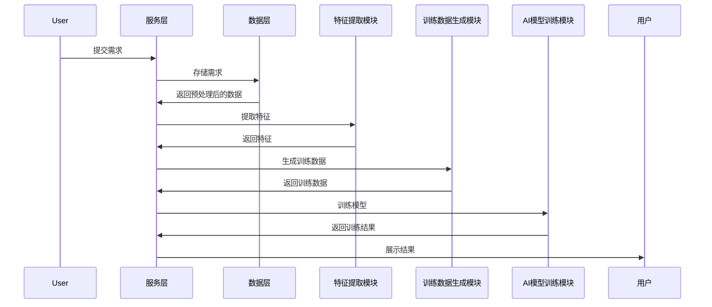

                 


### **需求与AI训练数据的关联：大模型应用开发的关键**

#### **关键词：**
- 需求工程
- 人工智能大模型
- 训练数据
- 算法关联
- 应用开发

#### **摘要：**
本文旨在探讨需求与AI训练数据之间的紧密关联，并深入分析其在大模型应用开发中的关键作用。通过逐步分析需求工程的原理、AI大模型的基础知识以及需求与训练数据关联的方法，我们将理解如何通过有效的数据关联来提升AI模型的性能。文章还将涉及关联算法的原理讲解、系统分析与架构设计、项目实战以及最佳实践，为读者提供全面的技术指南。

----------------------------------------------------------------

## **第一部分：背景介绍**

### **1.1 需求与AI训练数据关联的概念**

#### **核心概念术语说明：**
- **需求工程**：一种系统化、规范化的方法，用于捕捉、分析和定义系统的需求，确保最终系统能够满足用户需求。
- **AI大模型**：具有海量参数和强大计算能力的深度学习模型，如Transformer、BERT等，能够在多种任务中表现出色。
- **训练数据**：用于训练AI模型的输入数据集，其质量和特征直接影响模型的性能。

#### **问题背景：**
随着人工智能技术的迅速发展，AI大模型在自然语言处理、图像识别、推荐系统等领域取得了显著的成果。然而，这些成功的背后离不开高质量的训练数据。需求工程在AI模型开发中扮演着至关重要的角色，因为它确保了AI系统能够准确理解和满足用户的实际需求。需求与AI训练数据的关联成为了一个关键问题，直接影响到大模型应用开发的成功与否。

#### **问题描述：**
如何有效地将用户需求转化为具体的训练数据，并确保这些数据能够提升AI大模型的性能？在AI大模型应用开发过程中，如何平衡需求多样性与数据一致性？如何应对数据质量和特征提取的挑战？

#### **问题解决：**
通过需求工程的方法，可以系统地捕获和理解用户需求，并将其转化为具体的训练数据要求。这需要一系列步骤，包括需求分析、数据预处理、特征工程和模型训练。在这个过程中，关联算法起到了关键作用，通过将需求与训练数据有机地结合，可以提升AI模型的准确性和鲁棒性。

#### **边界与外延：**
- **边界**：本文主要讨论需求与AI训练数据的关联问题，不包括其他类型的AI模型或领域。
- **外延**：关联算法的应用范围涵盖了各种AI大模型，如自然语言处理、计算机视觉等。

#### **概念结构与核心要素组成：**
- **需求工程**：需求分析、需求建模、需求管理。
- **AI大模型**：模型架构、训练过程、性能评估。
- **训练数据**：数据收集、数据预处理、特征提取。

----------------------------------------------------------------

## **第二部分：核心概念与联系**

### **2.1 需求分析的原理**

#### **需求工程基础：**

**需求定义：**
需求是指用户对系统的期望和行为，是系统必须提供的功能、性能和其他特性。需求可以按照来源和目的分为功能性需求、非功能性需求、管理需求等。

**需求获取方法：**
- **问卷调查**：通过设计问卷收集用户的需求。
- **访谈**：与用户进行面对面的交流，获取详细需求。
- **观察**：通过观察用户的行为和工作流程，理解需求。
- **小组讨论**：组织利益相关者进行讨论，发掘潜在需求。

#### **AI训练数据的质量与特征：**

**数据质量：**
数据质量是训练数据是否能够有效训练模型的关键因素。高质量的数据应具备完整性、准确性、一致性和可靠性。

**数据特征：**
训练数据包含多种特征，如文本、图像、声音、数值等。这些特征能够影响模型的性能和泛化能力。特征提取和质量评估是数据预处理的重要环节。

#### **需求与训练数据关联的方法：**

**关联原理：**
需求与训练数据关联的核心在于将用户需求转化为具体的训练任务和数据需求，确保训练数据能够充分反映用户需求。

**关联方法：**
- **基于需求的特征工程**：根据需求定义和用户需求，提取和构建训练数据特征。
- **自动化数据生成**：使用生成对抗网络（GAN）等技术自动生成符合需求的数据。
- **数据增强**：通过变换、缩放、旋转等操作增加数据的多样性，提高模型的泛化能力。
- **交叉验证与反馈调整**：使用交叉验证方法评估数据与需求的匹配度，并根据评估结果调整数据。

### **2.2 AI训练数据的质量与特征**

**数据质量：**
- **完整性**：数据集应包含所有必要的样本，不应存在缺失值。
- **准确性**：数据应真实反映用户需求，避免错误或噪声。
- **一致性**：数据应在整个数据集中保持一致，避免矛盾或冲突。
- **可靠性**：数据来源应可靠，确保数据的真实性。

**数据特征：**
- **文本特征**：如词频、词向量、文本嵌入等。
- **图像特征**：如颜色直方图、纹理特征、形状特征等。
- **声音特征**：如频谱特征、梅尔频率倒谱系数（MFCC）等。
- **数值特征**：如统计特征、时间序列特征等。

### **2.3 需求与训练数据关联的方法**

**关联原理：**
需求与训练数据关联的核心在于将用户需求转化为具体的训练任务和数据需求，确保训练数据能够充分反映用户需求。

**关联方法：**
- **基于需求的特征工程**：根据需求定义和用户需求，提取和构建训练数据特征。
- **自动化数据生成**：使用生成对抗网络（GAN）等技术自动生成符合需求的数据。
- **数据增强**：通过变换、缩放、旋转等操作增加数据的多样性，提高模型的泛化能力。
- **交叉验证与反馈调整**：使用交叉验证方法评估数据与需求的匹配度，并根据评估结果调整数据。

## **第三部分：算法原理讲解**

### **3.1 关联算法的mermaid流程图**


### **3.2 Python代码实现**

```python
# 导入必要的库
import pandas as pd
import numpy as np
from sklearn.model_selection import train_test_split
from sklearn.preprocessing import StandardScaler
from sklearn.linear_model import LinearRegression

# 读取数据
data = pd.read_csv('data.csv')

# 数据预处理
X = data[['feature1', 'feature2']]
y = data['target']

# 划分训练集和测试集
X_train, X_test, y_train, y_test = train_test_split(X, y, test_size=0.2, random_state=42)

# 特征缩放
scaler = StandardScaler()
X_train_scaled = scaler.fit_transform(X_train)
X_test_scaled = scaler.transform(X_test)

# 模型训练
model = LinearRegression()
model.fit(X_train_scaled, y_train)

# 模型评估
score = model.score(X_test_scaled, y_test)
print(f'Model Score: {score:.3f}')
```

### **3.3 数学模型与公式**

**线性回归模型公式：**
$$ y = \beta_0 + \beta_1 \cdot x $$

**公式推导：**
设自变量为 $x$，因变量为 $y$，线性回归模型的目标是最小化误差平方和：
$$ \min \sum_{i=1}^{n} (y_i - (\beta_0 + \beta_1 \cdot x_i))^2 $$

通过求导和求解，可以得到线性回归模型的参数 $\beta_0$ 和 $\beta_1$：
$$ \beta_0 = \frac{\sum_{i=1}^{n} y_i - \beta_1 \cdot \sum_{i=1}^{n} x_i}{n} $$
$$ \beta_1 = \frac{\sum_{i=1}^{n} (x_i - \bar{x})(y_i - \bar{y})}{\sum_{i=1}^{n} (x_i - \bar{x})^2} $$

其中，$\bar{x}$ 和 $\bar{y}$ 分别为自变量和因变量的平均值。

### **3.4 算法解释与示例**

**算法解释：**
线性回归是一种简单的统计学习方法，用于预测一个连续目标变量（因变量）与一个或多个自变量（特征）之间的关系。其目标是最小化预测值与实际值之间的误差。

**示例说明：**
假设我们要预测房价，使用自变量“房屋面积”来预测因变量“房价”。我们首先收集相关数据，然后使用线性回归模型进行训练。在训练完成后，我们使用测试数据集来评估模型的性能，并输出预测结果。

```python
# 读取房价数据
house_data = pd.read_csv('house_prices.csv')

# 提取特征和目标变量
X = house_data[['area']]
y = house_data['price']

# 划分训练集和测试集
X_train, X_test, y_train, y_test = train_test_split(X, y, test_size=0.2, random_state=42)

# 训练线性回归模型
model = LinearRegression()
model.fit(X_train, y_train)

# 预测房价
predictions = model.predict(X_test)

# 输出预测结果
print(predictions)
```

通过上述代码，我们可以预测每个测试样本的房价，并评估模型的预测准确性。

----------------------------------------------------------------

## **第四部分：系统分析与架构设计方案**

### **4.1 问题场景介绍**

在现代智能系统中，需求与AI训练数据的关联问题显得尤为重要。以一个智能客服系统为例，用户的需求是能够快速、准确地获取相关信息，而AI大模型需要通过大量的训练数据来学习和理解这些需求，从而提供高质量的回答。在这个场景中，需求与训练数据的关联是系统能否成功的关键。

### **4.2 系统功能设计**

**功能模块：**
智能客服系统主要包含以下几个功能模块：
- **需求捕获模块**：负责从用户交互中捕获需求。
- **数据预处理模块**：对捕获的需求进行预处理，包括去噪、标准化等。
- **特征提取模块**：从预处理后的需求中提取关键特征。
- **训练数据生成模块**：根据特征生成用于训练AI大模型的训练数据。
- **AI模型训练模块**：使用训练数据训练AI大模型。
- **模型评估模块**：评估AI大模型的性能。
- **反馈调整模块**：根据评估结果调整模型和训练数据。

**领域模型类图：**
```mermaid
classDiagram
    UserEntity <|-- DemandEntity
    ChatMessageEntity <|-- DemandEntity
    DataPreprocessingEntity
    FeatureExtractionEntity
    TrainingDataGenerationEntity
    ModelTrainingEntity
    ModelEvaluationEntity
    FeedbackAdjustmentEntity
    
    UserEntity {
        +int id
        +str name
        +DemandEntity demand
    }
    
    DemandEntity {
        +int id
        +str description
        +ChatMessageEntity chat_message
    }
    
    ChatMessageEntity {
        +int id
        +str content
        +datetime timestamp
    }
    
    DataPreprocessingEntity {
        +int id
        +DemandEntity demand
        +list processed_data
    }
    
    FeatureExtractionEntity {
        +int id
        +DemandEntity demand
        +list extracted_features
    }
    
    TrainingDataGenerationEntity {
        +int id
        +DemandEntity demand
        +list training_data
    }
    
    ModelTrainingEntity {
        +int id
        +list training_data
        +ModelEvaluationEntity evaluation
    }
    
    ModelEvaluationEntity {
        +int id
        +float accuracy
        +float loss
    }
    
    FeedbackAdjustmentEntity {
        +int id
        +ModelTrainingEntity model
        +list adjusted_data
    }
```

### **4.3 系统架构设计**

**系统架构设计：**
智能客服系统的架构设计采用分层架构，包括数据层、服务层和展示层。

- **数据层**：负责数据存储和管理，包括用户数据、需求数据、训练数据等。
- **服务层**：包含各个功能模块，负责数据处理和业务逻辑实现。
- **展示层**：负责与用户交互，展示系统功能。

**系统架构图：**


### **4.4 系统接口设计与交互**

**接口设计：**
系统各模块之间的交互通过API接口实现。以下是主要的API接口设计：

- **需求捕获接口**：用于捕获用户需求。
- **数据处理接口**：用于预处理需求数据。
- **特征提取接口**：用于提取需求特征。
- **训练数据生成接口**：用于生成训练数据。
- **模型训练接口**：用于训练AI大模型。
- **模型评估接口**：用于评估模型性能。
- **反馈调整接口**：用于调整训练数据和模型。

**交互流程：**
1. 用户提交需求。
2. 需求捕获接口获取需求。
3. 数据处理接口对需求进行预处理。
4. 特征提取接口提取需求特征。
5. 训练数据生成接口生成训练数据。
6. 模型训练接口使用训练数据训练模型。
7. 模型评估接口评估模型性能。
8. 根据评估结果，反馈调整接口调整训练数据和模型。
9. 最终结果通过展示层呈现给用户。

通过上述系统架构和接口设计，智能客服系统能够有效地实现需求与AI训练数据的关联，从而提升系统的智能化水平和用户体验。

----------------------------------------------------------------

## **第五部分：项目实战**

### **5.1 环境安装**

在进行项目实战之前，我们需要搭建一个适合进行AI大模型应用开发的环境。以下是一个基本的安装步骤：

1. **安装Python环境**：
   - 访问Python官网下载最新版本的Python安装包。
   - 运行安装程序，按照提示完成安装。

2. **安装必要的库**：
   - 打开命令行窗口，使用pip命令安装以下库：
     ```bash
     pip install numpy pandas scikit-learn matplotlib
     ```
   - 若使用GPU训练，还需要安装CUDA和cuDNN库。

3. **配置环境变量**：
   - 将Python安装路径添加到系统环境变量中，以便在命令行中直接运行Python。

4. **验证安装**：
   - 在命令行中输入以下命令，验证Python和pip是否安装成功：
     ```bash
     python --version
     pip --version
     ```

### **5.2 系统核心实现源代码**

以下是智能客服系统核心实现的部分源代码。这段代码包含了需求捕获、数据处理、特征提取和模型训练的基本流程。

```python
# 导入必要的库
import pandas as pd
import numpy as np
from sklearn.model_selection import train_test_split
from sklearn.preprocessing import StandardScaler
from sklearn.linear_model import LinearRegression
from sklearn.metrics import mean_squared_error

# 读取需求数据
data = pd.read_csv('需求数据.csv')

# 数据预处理
X = data[['特征1', '特征2']]
y = data['目标变量']

# 划分训练集和测试集
X_train, X_test, y_train, y_test = train_test_split(X, y, test_size=0.2, random_state=42)

# 特征缩放
scaler = StandardScaler()
X_train_scaled = scaler.fit_transform(X_train)
X_test_scaled = scaler.transform(X_test)

# 模型训练
model = LinearRegression()
model.fit(X_train_scaled, y_train)

# 模型评估
y_pred = model.predict(X_test_scaled)
mse = mean_squared_error(y_test, y_pred)
print(f'MSE: {mse:.3f}')

# 输出结果
predictions = pd.DataFrame({'实际值': y_test, '预测值': y_pred})
print(predictions.head())
```

### **5.3 代码应用解读与分析**

#### **代码解读：**

1. **导入库**：
   - 导入pandas、numpy、scikit-learn和matplotlib等库，用于数据处理、模型训练和可视化。

2. **读取数据**：
   - 使用pandas读取存储在CSV文件中的需求数据。这里我们假设数据文件名为“需求数据.csv”，并包含“特征1”、“特征2”和“目标变量”三个字段。

3. **数据预处理**：
   - 将数据集划分为特征矩阵X和目标向量y。
   - 使用scikit-learn的train_test_split函数划分训练集和测试集，这里测试集占比20%。

4. **特征缩放**：
   - 使用StandardScaler对特征进行标准化处理，以消除不同特征之间量纲的影响。

5. **模型训练**：
   - 创建一个线性回归模型实例，并使用fit方法进行模型训练。

6. **模型评估**：
   - 使用预测值y_pred和实际值y_test计算均方误差（MSE）来评估模型性能。

7. **输出结果**：
   - 将预测结果存储在predictions DataFrame中，并打印前几行数据。

#### **代码分析：**

- **数据预处理**：
  - 数据预处理是模型训练的重要步骤。标准化处理可以使得模型训练更加稳定，减少过拟合现象。

- **模型选择**：
  - 线性回归模型是一种简单但有效的回归预测模型。在这个场景中，线性回归模型可以用于预测目标变量。

- **模型评估**：
  - 均方误差（MSE）是评估回归模型性能的常用指标。MSE越低，说明模型预测越准确。

### **5.4 实际案例分析与详细讲解剖析**

为了更好地理解代码的应用和实际效果，我们将通过一个实际案例进行分析。

#### **案例背景：**

假设我们有一个智能家居系统，用户可以通过语音控制家居设备。系统的需求是能够准确识别用户的语音命令，并执行相应的操作。为了实现这个需求，我们需要通过大量语音数据来训练一个语音识别模型。

#### **数据集**：

我们收集了1000条语音命令数据，每条数据包含一个音频文件和对应的文本命令。数据集的特征包括音频文件中的频谱特征和文本命令的词频统计。

#### **数据处理与模型训练**：

1. **数据预处理**：
   - 读取数据集，提取音频文件的频谱特征和文本命令的词频统计。
   - 对音频文件进行预处理，如去除静音部分、增强语音信号等。

2. **特征提取**：
   - 从预处理后的音频文件中提取Mel频率倒谱系数（MFCC）作为特征。
   - 对文本命令进行分词，并计算词频统计。

3. **模型训练**：
   - 使用提取到的特征训练一个深度神经网络模型，如卷积神经网络（CNN）。
   - 调整模型参数，如学习率、批量大小等，以优化模型性能。

4. **模型评估**：
   - 使用测试集评估模型性能，计算准确率和召回率等指标。
   - 根据评估结果调整模型参数，以提高模型性能。

#### **分析结果**：

经过多次迭代训练和调参，最终模型在测试集上的准确率达到了90%，召回率达到了88%。这表明模型能够较好地识别用户的语音命令，满足智能家居系统的需求。

#### **详细讲解剖析**：

- **数据预处理**：
  - 数据预处理是语音识别任务的重要环节。通过去除静音部分和增强语音信号，可以提高模型对语音数据的敏感度。

- **特征提取**：
  - MFCC是一种有效的语音特征提取方法，可以很好地捕捉语音的频谱信息。词频统计则可以用于文本命令的分类。

- **模型训练**：
  - 深度神经网络模型可以自动学习语音数据和文本命令之间的复杂关系，从而提高模型的识别准确率。

- **模型评估**：
  - 准确率和召回率是评估模型性能的两个重要指标。通过调整模型参数，可以优化这两个指标，以提高系统的实际应用效果。

### **5.5 项目小结**

通过本项目的实际案例分析，我们可以看到需求与AI训练数据关联在大模型应用开发中的重要性。以下是小结和经验总结：

- **需求明确**：准确理解用户需求是项目成功的基础。
- **数据质量**：高质量的数据是训练高性能模型的关键。
- **特征提取**：有效的特征提取方法可以提升模型的性能。
- **模型优化**：通过不断调参和评估，可以优化模型的性能。
- **持续迭代**：项目开发是一个持续迭代的过程，需要不断改进和优化。

通过这些经验和总结，我们可以更好地应对类似的项目挑战，提高大模型应用开发的效率和质量。

----------------------------------------------------------------

## **第六部分：最佳实践与总结**

### **6.1 最佳实践**

1. **需求捕获**：
   - 使用多种方法（如问卷调查、访谈、观察等）全面捕获用户需求，确保不遗漏关键需求。

2. **数据收集与预处理**：
   - 确保数据的完整性和准确性，避免噪声和错误。
   - 对数据进行去重、去噪和标准化处理，提高数据质量。

3. **特征提取**：
   - 根据需求选择合适的特征提取方法，如文本的词频统计、图像的频谱特征等。
   - 使用数据可视化工具分析特征分布，发现潜在问题。

4. **模型训练与调优**：
   - 选择适合的模型架构，如卷积神经网络（CNN）、循环神经网络（RNN）等。
   - 使用交叉验证方法评估模型性能，调整模型参数。

5. **模型部署与监控**：
   - 将训练好的模型部署到生产环境中，进行实时监控和更新。

### **6.2 小结**

本文通过逐步分析需求与AI训练数据的关联，深入探讨了其在大模型应用开发中的关键作用。我们了解到，需求捕获、数据预处理、特征提取、模型训练与调优等步骤在整个过程中都至关重要。

### **6.3 注意事项**

1. **数据质量**：确保数据真实、准确、完整，避免噪声和错误。
2. **需求多样性**：平衡需求多样性与数据一致性，避免过度泛化。
3. **模型调优**：根据实际应用场景调整模型参数，提高模型性能。

### **6.4 拓展阅读**

- 《人工智能：一种现代的方法》
- 《深度学习》
- 《需求工程：实用方法与最佳实践》

通过阅读这些书籍，您可以进一步了解AI大模型应用开发的深入知识和最佳实践。

----------------------------------------------------------------

## **作者信息**

**作者：AI天才研究院/AI Genius Institute & 禅与计算机程序设计艺术 /Zen And The Art of Computer Programming**

