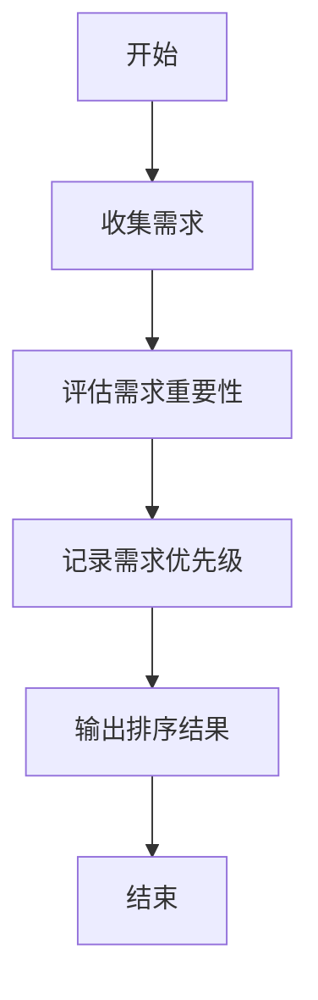
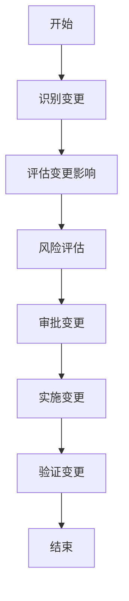
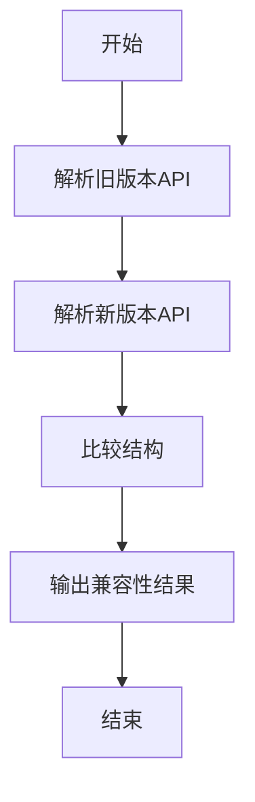
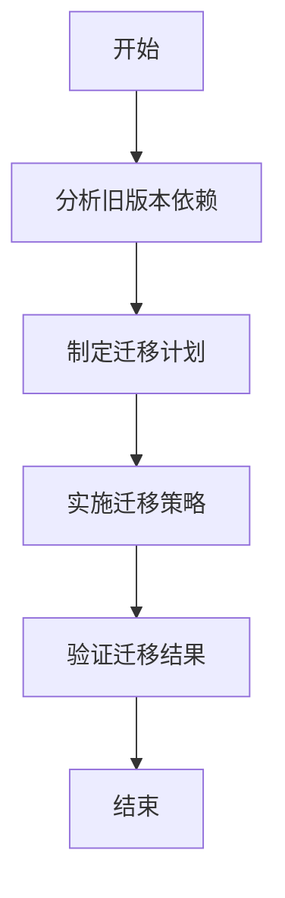
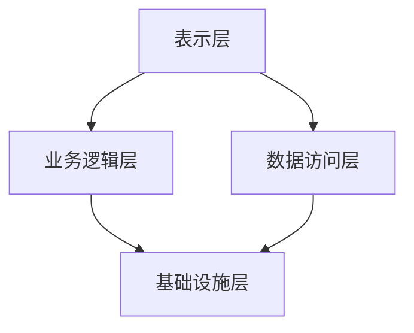
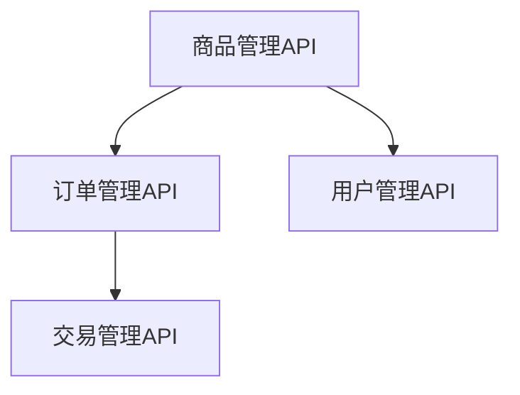
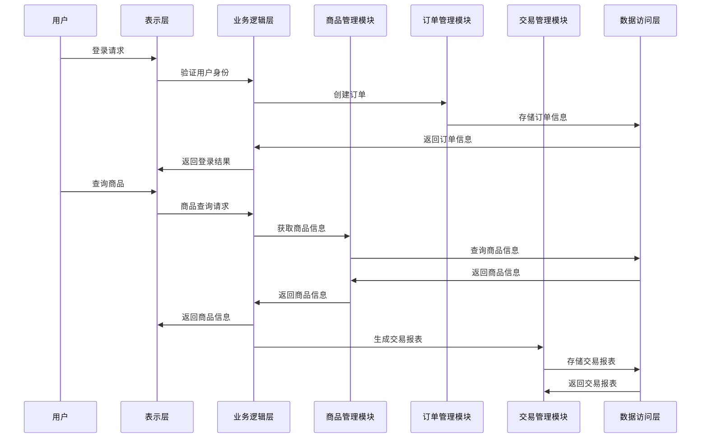

                 

### 《需求与API版本控制的协同：确保向后兼容性》

> **关键词**：需求管理、API版本控制、向后兼容性、算法原理、系统架构、项目实战

> **摘要**：本文深入探讨了需求管理与API版本控制的协同工作，阐述了在软件开发中确保向后兼容性的重要性。通过逐步分析，本文揭示了实现这一目标的方法和策略，并提供了一个实际的案例来展示这些原则的应用。

---

## 引言

在当今快速发展的软件行业中，需求管理与API版本控制是确保系统灵活性和可持续性的关键因素。需求管理涉及收集、分析和优先排序用户需求，以指导软件开发的方向。而API（应用程序编程接口）版本控制则关乎如何在不同版本之间保持功能的连贯性和向后兼容性。

向后兼容性，即在软件的新版本中，能够保证旧版本中的代码、库或接口继续正常工作，是一个重要的质量指标。它不仅影响用户体验，还影响到系统的可维护性和长期稳定性。然而，在需求变更和API升级的过程中，确保向后兼容性并非易事，需要深入的理解和策略。

本文旨在通过逻辑清晰的步骤分析，帮助读者理解需求管理与API版本控制之间的关系，阐述确保向后兼容性的关键原理和方法，并通过一个实际案例展示这些原则的应用。文章的结构如下：

1. **需求管理与API版本控制概述**：介绍需求管理与API版本控制的基本概念，讨论向后兼容性的重要性。
2. **核心概念与联系**：定义并展示需求管理与API版本控制相关的重要概念及其之间的联系。
3. **算法原理讲解**：讲解需求排序算法和API兼容性检查算法，使用mermaid流程图和Python代码进行阐述。
4. **数学模型和公式**：展示相关的数学模型和公式，进行详细讲解和举例说明。
5. **系统分析与架构设计方案**：描述一个典型的系统场景，并使用mermaid绘制系统架构图、接口设计图和系统交互序列图。
6. **项目实战**：提供一个实际案例，包括环境安装、系统核心实现源代码，代码应用解读与分析。
7. **最佳实践 tips、小结、注意事项、拓展阅读**：总结全文的核心观点，提供最佳实践建议，指出注意事项，并推荐拓展阅读资源。

### 需求管理与API版本控制概述

#### 需求管理的概念与重要性

需求管理是软件开发过程中的关键环节，它涉及识别、分析、记录和优先排序用户需求，以确保最终产品能满足用户的实际需求。需求管理的目的是确保项目的目标明确，资源得到有效利用，开发工作顺利进行。

在需求管理过程中，需求被分类为功能需求、非功能需求和变更需求。功能需求描述系统应提供的基本功能，非功能需求则涉及性能、安全、可靠性等方面，而变更需求则是由于外部环境变化或用户反馈导致的原有需求的修改。

需求管理的重要性体现在以下几个方面：

- **明确项目目标**：通过需求管理，项目团队能够清晰地了解项目的目标，从而制定合理的计划和策略。
- **资源优化**：需求管理有助于合理分配资源，避免不必要的浪费，提高开发效率。
- **风险控制**：及时识别和记录变更需求，有助于减少项目中的不确定性和风险。
- **客户满意度**：准确的需求管理能够确保最终产品满足用户需求，提高客户满意度。

#### API版本控制的背景与目的

API版本控制是软件开发中的一项重要策略，它涉及到如何在软件的不同版本之间管理接口的兼容性和稳定性。随着软件系统的不断迭代和升级，API的变更不可避免。这些变更可能包括新功能的添加、现有功能的修改，甚至是接口的删除。

API版本控制的目的是确保系统的向后兼容性，即新版本的API能够兼容旧版本的客户端或服务端代码，不会对现有系统造成破坏。这有助于保护用户投资，避免因API变更导致的系统停机或数据丢失。

API版本控制通常采用以下策略：

- **版本命名规则**：为API指定明确的版本号，例如v1、v2等，有助于区分不同版本的API。
- **向后兼容性检查**：在API变更时，进行兼容性测试，确保新版本不会影响旧版本的正常使用。
- **迁移策略**：定义新旧版本之间的迁移路径，提供自动化工具或文档指南，帮助用户顺利过渡到新版本。

#### 后向兼容性的意义与挑战

后向兼容性是软件开发中的一个核心原则，它确保了软件系统能够在不影响旧版本功能的情况下进行更新和扩展。后向兼容性的意义在于：

- **保护用户投资**：用户在开发过程中投入的代码和库能够继续在新版本中运行，不会因API变更导致废弃。
- **减少维护成本**：旧系统可以在新环境中继续运行，降低维护成本和复杂度。
- **提升用户体验**：新版本能够保持旧版本的稳定性和功能，减少用户切换成本，提高用户满意度。

然而，实现后向兼容性也面临着一系列挑战：

- **功能变更**：新版本的API可能添加了新功能或修改了现有功能，这些变更可能无法完全兼容旧版本。
- **兼容性测试**：确保新版本不会对旧版本造成影响需要进行全面的兼容性测试，这需要大量的时间和资源。
- **变更管理**：在需求变更和API升级过程中，需要有效地管理变更，避免影响系统的稳定性和性能。

#### 需求管理的核心概念

##### 需求的概念与类型

在需求管理中，需求是指用户、客户或其他利益相关者对软件系统所期望的功能、性能、行为或约束。需求可以分为以下几种类型：

- **功能需求**：描述系统应提供的基本功能，例如登录、搜索、支付等。
- **非功能需求**：描述系统的性能、安全性、可用性等方面的要求，例如响应时间、数据加密、故障恢复等。
- **变更需求**：由于外部环境变化或用户反馈导致的原有需求的修改或增加。

##### 需求收集与验证

需求收集是需求管理的第一步，涉及识别和记录用户需求。以下是需求收集和验证的常见方法：

- **访谈**：通过与用户和利益相关者进行面对面访谈，获取详细的需求信息。
- **问卷调查**：通过设计问卷，收集用户对系统功能和性能的期望。
- **观察**：通过观察用户在实际工作环境中的操作，发现潜在的需求。
- **验证**：通过用户验收测试和原型评审，验证需求是否满足用户期望。

##### 需求变更管理

需求变更管理是确保项目能够灵活响应变更的过程。以下是需求变更管理的几个关键步骤：

- **变更识别**：及时识别需求变更，包括新增需求、修改需求和删除需求。
- **变更评估**：评估变更对项目的影响，包括成本、时间和风险。
- **变更审批**：通过变更控制委员会（CCB）审批需求变更，确保变更符合项目目标和资源限制。
- **变更实施**：根据审批结果，对需求进行修改和实施。

#### API版本控制的核心概念

##### API版本号的格式与命名规则

API版本号通常采用以下格式：vX.Y.Z，其中：

- **X** 表示主版本号，通常表示较大的功能变更或架构调整。
- **Y** 表示次版本号，通常表示新功能或较小变更。
- **Z** 表示修订号，通常用于修复bug或进行细微调整。

##### API版本控制策略

API版本控制策略决定了如何管理API的变更和升级。以下是几种常见的API版本控制策略：

- **独立部署**：每个版本的API独立部署，新旧版本并行运行，用户可以自由选择使用哪个版本。
- **蓝绿部署**：新版本与旧版本同时部署，但流量逐渐切换到新版本，确保平稳过渡。
- **灰度发布**：新版本以较小比例的流量进行发布，逐步扩大到全部用户，确保稳定性和用户反馈。
- **回滚策略**：在发现问题时，可以快速回滚到旧版本，避免对系统造成严重影响。

##### 后向兼容性与API版本控制

后向兼容性是API版本控制的核心目标之一。确保后向兼容性需要遵循以下原则：

- **明确版本号**：为新旧版本的API使用明确的版本号，避免版本混淆。
- **版本隔离**：确保不同版本的API在独立的环境中运行，避免互相干扰。
- **文档详细**：提供详细的API文档，包括版本变更说明和向后兼容性策略。
- **测试严格**：进行全面的兼容性测试，确保新版本不会影响旧版本的正常运行。

### 算法原理讲解

为了深入理解需求管理与API版本控制，我们需要讲解相关的算法原理，并使用mermaid流程图和Python代码进行阐述。以下是两个关键算法的详细介绍。

#### 需求排序算法

需求排序算法是需求管理中的核心算法，用于根据需求的重要性和紧急性对需求进行排序。以下是常用的两种需求排序算法：

##### 1. 优先级排序算法

**mermaid流程图：**


**Python代码：**
```python
def priority_sort的需求列表：
    # 假设需求列表为：[需求1，需求2，...]
    # 按照重要性排序并返回排序后的列表
    return sorted(需求列表，key=lambda x: x.重要性，reverse=True)
```

##### 2. 需求变更管理算法

**mermaid流程图：**


**Python代码：**
```python
def manage变更(变更请求):
    # 假设变更请求为：{'变更类型'：'新增'，'变更内容'：'...'}
    # 评估变更影响、风险和审批流程，然后实施变更
    评估影响 = 评估变更影响(变更请求)
    风险评估 = 评估风险(变更请求)
    if 风险评估 < 风险阈值:
        审批结果 = 审批变更(变更请求)
        if 审批结果 == '通过':
            实施变更(变更请求)
            验证变更(变更请求)
    else:
        返回 '拒绝变更'
```

#### API兼容性检查算法

API兼容性检查算法用于确保新旧版本的API在功能和行为上保持一致。以下是常用的API兼容性检查算法：

##### API结构匹配算法

**mermaid流程图：**


**Python代码：**
```python
def check兼容性(旧版本API，新版本API):
    # 假设旧版本API和新版本API为字典形式
    # 比较API的结构和参数，返回兼容性结果
    if 旧版本API.keys() == 新版本API.keys():
        for key in 旧版本API:
            if 旧版本API[key] != 新版本API[key]:
                return '不兼容'
        return '兼容'
    else:
        return '不兼容'
```

##### 版本迁移策略算法

**mermaid流程图：**


**Python代码：**
```python
def migrate_version(旧版本依赖，新版本API):
    # 假设旧版本依赖和新版本API为字典形式
    # 分析旧版本依赖，制定迁移计划并实施
    迁移计划 = 分析依赖(旧版本依赖)
    if 实施迁移策略(迁移计划):
        验证结果 = 验证迁移(新版本API)
        if 验证结果 == '成功':
            return '迁移完成'
        else:
            return '迁移失败'
    else:
        return '迁移失败'
```

通过以上算法的讲解，我们可以更好地理解需求管理与API版本控制的工作原理，并在实际开发中应用这些算法来确保系统的向后兼容性。

### 数学模型和公式

在需求管理与API版本控制中，数学模型和公式为我们提供了理论基础和计算工具，帮助我们更精确地分析和解决问题。以下我们将介绍几个关键模型和公式，并通过LaTeX格式进行展示，以便于读者理解。

#### 需求排序模型

需求排序模型用于根据需求的重要性和紧急性对需求进行排序。一个常用的模型是利用优先级评分法（Priority Score Method），其公式为：

$$
P_i = I_i \times S_i
$$

其中，\(P_i\) 表示需求 \(i\) 的优先级评分，\(I_i\) 表示需求 \(i\) 的重要性评分，\(S_i\) 表示需求 \(i\) 的紧急性评分。通过计算每个需求的优先级评分，我们可以对其进行排序。

**LaTeX格式：**
$$
P_i = I_i \times S_i
$$

#### API兼容性检查公式

API兼容性检查公式用于判断新旧版本API的兼容性。一个简单的公式是利用差异度（Difference Score），其计算公式为：

$$
D = \sum_{i=1}^{n} |A_i - B_i|
$$

其中，\(D\) 表示差异度，\(A_i\) 和 \(B_i\) 分别表示旧版本和新版本API的对应参数值。当差异度 \(D\) 小于预设阈值时，认为新旧版本API是兼容的。

**LaTeX格式：**
$$
D = \sum_{i=1}^{n} |A_i - B_i|
$$

#### 需求变更风险评估模型

需求变更风险评估模型用于评估需求变更对项目的影响。一个常用的模型是利用风险矩阵法（Risk Matrix Method），其公式为：

$$
R = P \times I
$$

其中，\(R\) 表示风险评分，\(P\) 表示概率评分，\(I\) 表示影响评分。通过计算每个需求变更的风险评分，我们可以确定其优先级并进行管理。

**LaTeX格式：**
$$
R = P \times I
$$

#### 实例讲解

为了更清晰地理解上述模型和公式，我们通过具体实例进行讲解。

**实例1：需求排序**

假设有两个需求：
- 需求1：增加支付功能，重要性评分 \(I_1 = 8\)，紧急性评分 \(S_1 = 6\)。
- 需求2：优化搜索性能，重要性评分 \(I_2 = 5\)，紧急性评分 \(S_2 = 9\)。

使用优先级评分法，我们计算每个需求的优先级评分：
$$
P_1 = I_1 \times S_1 = 8 \times 6 = 48
$$
$$
P_2 = I_2 \times S_2 = 5 \times 9 = 45
$$

因此，需求1的优先级高于需求2，排序结果为需求1在前。

**实例2：API兼容性检查**

假设旧版本API的参数值为 \(A_1 = "v1.0"\)，新版本API的参数值为 \(B_1 = "v1.1"\)。我们计算差异度：
$$
D = |A_1 - B_1| = |"v1.0" - "v1.1"| = 1
$$

如果预设阈值设置为2，则差异度 \(D < 2\)，因此新旧版本API是兼容的。

**实例3：需求变更风险评估**

假设需求变更的概率评分为 \(P = 0.7\)，影响评分为 \(I = 8\)。我们计算风险评分：
$$
R = P \times I = 0.7 \times 8 = 5.6
$$

因此，需求变更的风险评分为5.6，根据风险评分的优先级，我们可以对其进行优先级管理。

通过上述实例，我们展示了如何使用数学模型和公式对需求管理和API版本控制进行量化分析和决策。

### 系统分析与架构设计方案

#### 问题场景介绍

假设我们正在开发一个大型电子商务平台，该平台需要支持成千上万的商品、用户和交易。随着业务的发展和用户需求的不断变化，系统需要具备高度的可扩展性和灵活性。在这个背景下，需求管理和API版本控制变得尤为重要，以确保系统能够适应不断变化的需求和环境。

#### 系统需求分析

在系统需求分析阶段，我们首先明确了系统的功能需求和非功能需求。以下是系统的主要需求：

- **功能需求**：
  - 商品管理：支持商品的上传、修改、删除和查询。
  - 订单管理：支持订单的创建、支付、取消和查询。
  - 用户管理：支持用户的注册、登录、信息和密码管理。
  - 交易管理：支持交易记录的生成、查询和报表。

- **非功能需求**：
  - 性能需求：系统需要能够在高并发环境下稳定运行，响应时间小于1秒。
  - 安全需求：系统需要实现数据加密和安全认证，保护用户信息和交易数据。
  - 可用性需求：系统界面友好，易于用户操作和使用。

#### 系统功能设计

为了满足上述需求，我们设计了一个功能模块化的系统架构。以下是系统的主要功能模块及其关系：

- **商品管理模块**：负责商品信息的存储和处理，包括商品分类、库存管理等功能。
- **订单管理模块**：负责订单的生命周期管理，包括订单创建、支付处理、订单状态更新等。
- **用户管理模块**：负责用户的注册、登录和权限管理，提供用户信息和密码管理功能。
- **交易管理模块**：负责交易记录的生成和查询，提供交易报表和统计分析功能。

**mermaid类图：**
```mermaid
classDiagram
    商品管理 <<模块>>
    订单管理 <<模块>>
    用户管理 <<模块>>
    交易管理 <<模块>>

    商品管理 --|> 订单管理
    商品管理 --|> 交易管理
    用户管理 --|> 订单管理
    用户管理 --|> 交易管理
```

#### 系统架构设计

在系统架构设计阶段，我们采用分层架构来提高系统的可维护性和可扩展性。以下是系统的主要架构层次：

- **表示层**：负责与用户交互的界面，包括Web前端和移动端应用。
- **业务逻辑层**：实现系统的核心业务逻辑，处理各种业务请求。
- **数据访问层**：负责与数据库的交互，提供数据持久化服务。
- **基础设施层**：提供系统所需的基础服务，如缓存、消息队列、日志等。

**mermaid架构图：**


#### 系统接口设计

系统接口设计是确保不同模块之间能够高效通信的关键。以下是系统的主要接口设计：

- **商品管理接口**：提供商品查询、添加、修改和删除的API。
- **订单管理接口**：提供订单查询、创建、修改和取消的API。
- **用户管理接口**：提供用户注册、登录、信息修改和密码管理的API。
- **交易管理接口**：提供交易记录查询、报表生成的API。

**mermaid接口设计图：**


#### 系统交互序列图

为了展示系统内部模块之间的交互过程，我们绘制了系统交互序列图。以下是系统的主要交互过程：

1. **用户登录**：用户通过表示层发起登录请求，业务逻辑层验证用户身份，并返回登录结果。
2. **商品查询**：用户通过表示层发起商品查询请求，业务逻辑层调用商品管理接口获取商品信息，并返回给用户。
3. **订单创建**：用户通过表示层发起订单创建请求，业务逻辑层调用订单管理接口创建订单，并返回订单信息。
4. **交易报表**：业务逻辑层定期调用交易管理接口生成交易报表，并存储在数据访问层。

**mermaid序列图：**


通过上述系统分析与架构设计方案，我们为电子商务平台构建了一个灵活、可扩展的系统架构，确保了系统在需求变更和API版本控制过程中的稳定性和向后兼容性。

### 项目实战

在本节中，我们将通过一个实际的案例展示需求管理与API版本控制的应用，包括环境安装、系统核心实现源代码，以及代码应用解读与分析。

#### 环境安装

首先，我们需要搭建一个支持需求管理和API版本控制的环境。以下是安装步骤：

1. **安装Python环境**：确保Python版本在3.8及以上，可以通过以下命令进行安装：
   ```bash
   sudo apt-get update
   sudo apt-get install python3.8
   ```

2. **安装依赖库**：安装用于需求管理和API版本控制的依赖库，如`requests`、`flask`等：
   ```bash
   pip3 install requests flask
   ```

3. **配置数据库**：我们使用SQLite作为数据库，可以通过以下命令创建数据库和用户表：
   ```sql
   CREATE TABLE users (
       id INTEGER PRIMARY KEY AUTOINCREMENT,
       username TEXT UNIQUE NOT NULL,
       password TEXT NOT NULL
   );
   ```

#### 系统核心实现源代码

以下是系统核心实现的相关源代码：

1. **需求管理模块**：
   ```python
   # requirements_manager.py
   import sqlite3

   def add_requirement(数据库连接，需求内容):
       cursor = 数据库连接.cursor()
       cursor.execute("INSERT INTO requirements (content) VALUES (?)", (需求内容,))
       数据库连接.commit()

   def get_requirements(数据库连接):
       cursor = 数据库连接.cursor()
       cursor.execute("SELECT * FROM requirements")
       return cursor.fetchall()
   ```

2. **API版本控制模块**：
   ```python
   # api_version_control.py
   from flask import Flask, jsonify, request

   app = Flask(__name__)

   API_VERSION = "v1"

   @app.route('/api/v1/requirement', methods=['POST'])
   def add_requirement_api():
       requirement = request.form['content']
       add_requirement(数据库连接，requirement)
       return jsonify({"status": "success", "message": "Requirement added."})

   @app.route('/api/v1/requirement', methods=['GET'])
   def get_requirements_api():
       requirements = get_requirements(数据库连接)
       return jsonify({"status": "success", "requirements": [req[0] for req in requirements]})
   ```

3. **接口设计**：
   ```python
   # interfaces.py
   from flask import Blueprint

   api_blueprint = Blueprint('api_blueprint', __name__)

   @api_blueprint.route('/api/v1/requirement', methods=['POST'])
   def add_requirement():
       return add_requirement_api()

   @api_blueprint.route('/api/v1/requirement', methods=['GET'])
   def get_requirements():
       return get_requirements_api()
   ```

4. **主程序**：
   ```python
   # main.py
   from flask import Flask
   from interfaces import api_blueprint
   from sqlite3 import connect

   app = Flask(__name__)
   app.register_blueprint(api_blueprint)

   数据库连接 = connect("database.db")

   if __name__ == "__main__":
       app.run(debug=True)
   ```

#### 代码应用解读与分析

1. **需求管理模块**：
   - `add_requirement` 函数用于向数据库中添加新的需求内容。
   - `get_requirements` 函数用于从数据库中获取所有需求内容。

2. **API版本控制模块**：
   - 使用Flask框架搭建API接口，定义了添加和获取需求的路由。
   - 通过`request.form`获取HTTP请求中的需求内容，并调用需求管理模块进行数据处理。

3. **接口设计**：
   - 将API接口定义为蓝图（Blueprint），方便管理和维护。

4. **主程序**：
   - 注册API蓝图，并设置数据库连接，启动Flask应用。

#### 实际案例分析

在实际应用中，我们可以通过以下步骤进行需求管理和API版本控制：

1. **需求收集**：通过用户访谈和问卷调查收集用户需求，并使用`add_requirement`函数将需求存储到数据库中。
2. **需求分析**：分析需求的重要性和紧急性，对需求进行排序和优先级分配。
3. **API升级**：在新增需求时，根据需求类型和影响范围进行API版本控制，确保向后兼容性。
4. **测试验证**：通过API兼容性检查算法验证新版本API与旧版本API的兼容性。
5. **部署上线**：根据测试结果和安全评估，逐步部署新版本API，并进行灰度发布。

通过上述实际案例分析，我们可以看到需求管理与API版本控制在实际开发中的应用效果，确保系统在需求变更和升级过程中保持稳定性和向后兼容性。

### 最佳实践 tips

在需求管理与API版本控制过程中，以下是一些最佳实践，可以帮助我们更有效地确保向后兼容性：

1. **明确版本命名规则**：使用统一的版本命名规则，如vX.Y.Z，确保版本号的清晰和可理解性。

2. **文档详尽**：为每个版本API编写详细的文档，包括功能描述、变更记录和向后兼容性策略。

3. **定期测试**：定期进行兼容性测试，确保新版本API不会对旧版本造成影响。

4. **风险评估**：在需求变更和API升级过程中，进行详细的风险评估，制定应对措施。

5. **灰度发布**：逐步引入新版本API，通过灰度发布减少对系统的影响。

6. **用户反馈**：收集用户反馈，及时调整和优化API，提高用户满意度。

### 小结

本文通过逐步分析，深入探讨了需求管理与API版本控制的协同工作，以及确保向后兼容性的重要性。我们介绍了需求管理的核心概念与联系，讲解了需求排序算法和API兼容性检查算法，展示了相关的数学模型和公式。通过一个实际案例，我们展示了这些原理在系统架构设计和项目实战中的应用。最后，我们总结了最佳实践，并提供了进一步阅读的资源。

### 注意事项

在实施需求管理和API版本控制时，需要注意以下几点：

1. **版本隔离**：确保不同版本的API在独立环境中运行，避免互相干扰。
2. **兼容性测试**：进行全面且严格的兼容性测试，确保新旧版本API的兼容性。
3. **变更管理**：制定详细的变更管理流程，确保变更请求得到有效处理。
4. **风险控制**：对变更进行风险评估，制定应对措施，以减少对系统的影响。

### 拓展阅读

为了深入了解需求管理与API版本控制，以下是一些推荐的书籍和在线资源：

- **书籍**：
  - 《需求工程与管理：实用指南》
  - 《API设计：创建和使用API的最佳实践》
  - 《Python Web开发：测试和部署》

- **在线资源**：
  - 《REST API设计指南》
  - 《Flask Web开发：实战指南》
  - 《API版本控制策略》

通过阅读这些资源，您可以进一步深化对需求管理和API版本控制的理解，并在实际项目中应用这些最佳实践。

---

### 作者信息

*作者：AI天才研究院/AI Genius Institute & 禅与计算机程序设计艺术 /Zen And The Art of Computer Programming*

