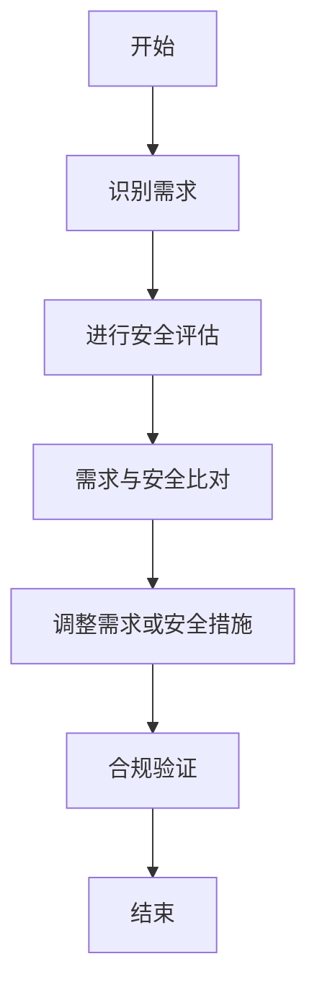
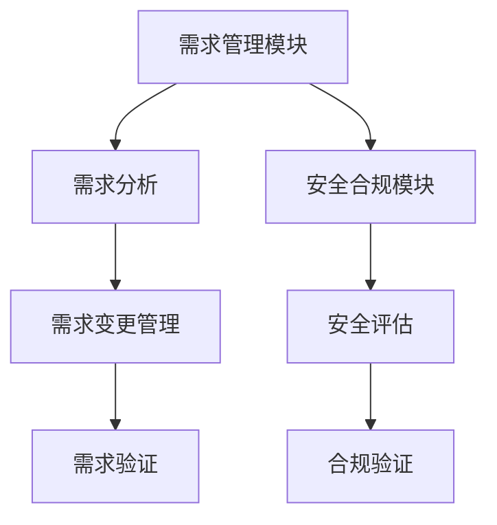
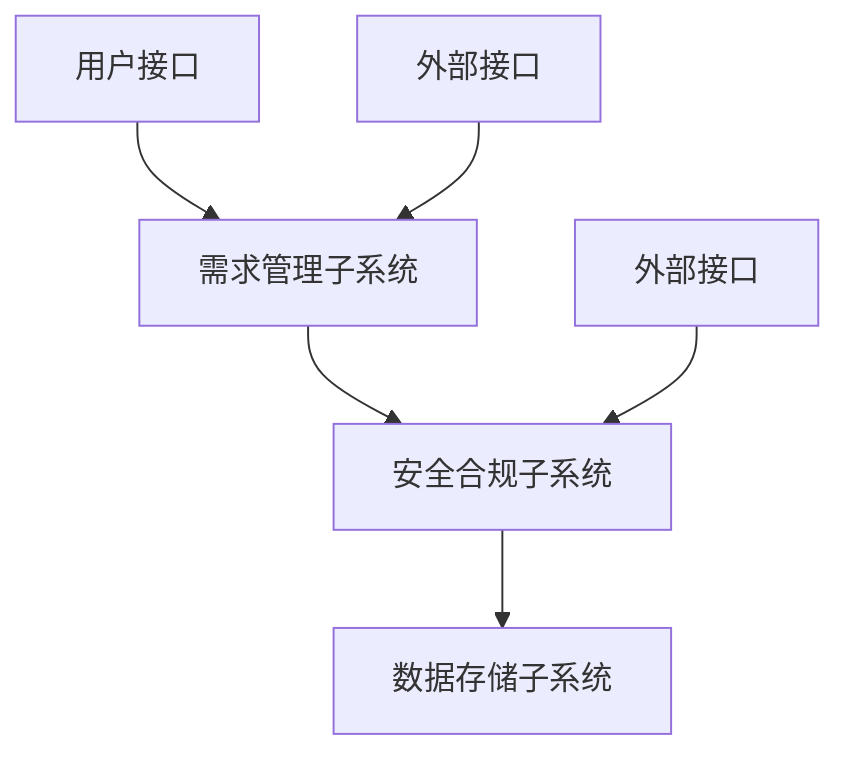
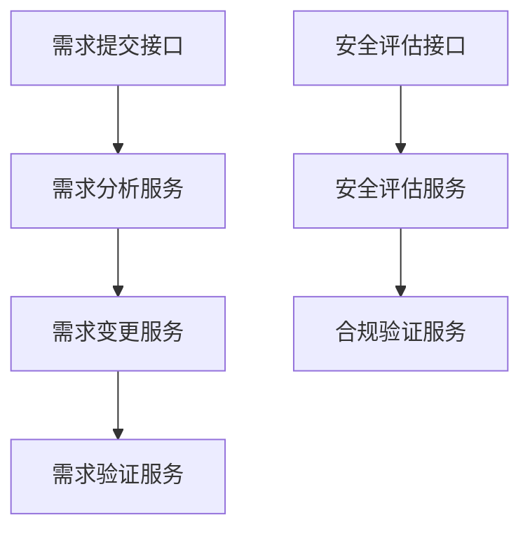
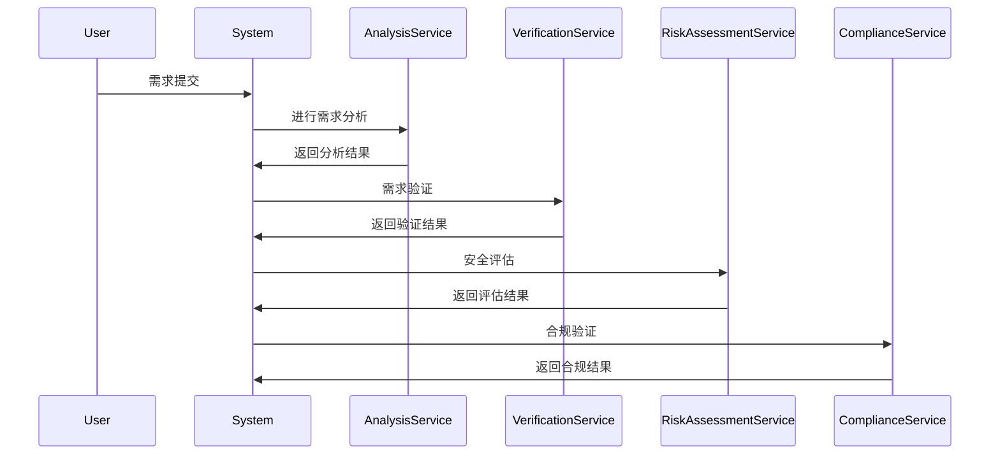

                 


### 第1章: 问题背景

#### 1.1.1 问题背景概述

在现代软件开发过程中，特别是大型应用系统的开发中，需求管理、安全合规成为项目成功的关键因素。需求管理涉及如何收集、分析和实现用户需求，确保软件产品能满足业务需求和用户期望。然而，需求往往多变，这在一定程度上增加了项目的复杂性。安全合规则关注系统安全性的保障，遵循一系列法律、法规和行业标准，避免因合规问题导致的项目失败。

随着互联网的快速发展，大型应用系统在各个行业得到了广泛应用。这些系统不仅需要满足用户多样化的需求，还要保证数据的隐私和安全。然而，需求变更频繁与安全合规要求日益严格之间存在矛盾。需求变更可能导致原有安全措施失效，而忽视安全合规则可能带来法律风险和业务损失。

#### 1.1.2 问题描述

在大型应用开发的背景下，需求变更和安全合规之间存在以下主要问题：

1. **需求变更频繁**：随着市场环境的变化和用户需求的不断升级，开发团队往往需要频繁调整软件需求，这增加了项目的复杂性，同时也可能影响到系统的安全性。
   
2. **安全合规要求日益严格**：随着信息安全的重视程度提高，法律法规和行业标准对系统的安全要求越来越严格。这些要求需要在软件开发和迭代过程中得到严格遵守，否则可能导致系统面临法律风险。

3. **需求变更与安全合规的矛盾**：需求变更可能导致原有的安全措施无法满足新的合规要求，而遵循合规要求又可能需要投入额外的时间和资源，影响项目进度和成本。

#### 1.1.3 问题解决

为了解决需求变更频繁和安全合规要求日益严格之间的矛盾，需要采取一系列整合方法：

1. **需求驱动与安全合规相结合**：在需求变更时，充分考虑安全合规的要求，确保每次需求变更都不会对系统的安全造成威胁。

2. **安全合规驱动的设计**：在系统设计和开发阶段，就将安全合规的要求纳入考虑，避免需求变更后需要额外进行安全合规的调整。

3. **持续的安全评估和合规验证**：在整个开发周期内，定期进行安全评估和合规验证，及时发现并解决问题，确保系统始终满足安全合规的要求。

4. **自动化工具的使用**：利用自动化工具进行需求管理和安全合规检查，提高工作效率，减少人为错误。

#### 1.1.4 边界与外延

为了更好地理解需求与安全合规的整合，需要明确以下边界与外延：

1. **需求管理**：涉及需求收集、需求分析、需求变更管理和需求验证等方面。
   
2. **安全合规**：包括安全风险评估、安全合规标准、合规验证和法规遵从性检查等。

3. **相关术语**：需求变更、安全风险、合规性、信息安全、安全合规体系、需求驱动安全等。

#### 1.1.5 核心要素组成

整合需求与安全合规的过程需要以下核心要素：

1. **需求分析**：准确理解和分析用户需求，确保需求合理、可行。
   
2. **安全评估**：对系统进行安全风险评估，识别潜在的安全威胁和风险。

3. **合规验证**：验证系统是否符合安全合规标准，确保系统安全、可靠。

通过以上分析，我们可以看出，需求与安全合规的整合是大型应用开发中不可或缺的一环。在接下来的章节中，我们将进一步探讨核心概念、整合方法、算法原理、系统分析与架构设计等内容，帮助读者全面了解这一领域的最佳实践。希望本文能为从事大型应用开发的读者提供有益的参考和指导。

### 第2章: 核心概念与联系

#### 2.1.1 需求管理概念

需求管理是软件开发过程中的关键环节，它涉及对用户需求的理解、分析和管理。在需求管理中，通常需要完成以下几个步骤：

1. **需求收集**：通过与用户、业务分析师和项目团队进行沟通，收集用户的需求和期望。
   
2. **需求分析**：对收集到的需求进行分类、优先级排序，并分析需求的可行性和实现难度。
   
3. **需求变更管理**：在项目开发过程中，需求可能发生变化，需要及时记录变更、评估变更影响，并调整项目计划和资源分配。
   
4. **需求验证**：在开发完成后，对需求进行验证，确保实现的需求满足用户预期。

#### 2.1.2 安全合规概念

安全合规是指在软件开发和运营过程中，遵循一系列安全标准和法规，确保系统安全和数据保护。安全合规包括以下几个关键方面：

1. **安全风险评估**：识别系统中的潜在安全威胁和风险，评估其影响和可能性。
   
2. **安全合规标准**：遵循相关的安全标准和法规，如ISO 27001、GDPR、HIPAA等。

3. **合规验证**：定期对系统进行安全合规检查，确保系统符合相关法规和标准。

4. **安全培训和意识提升**：对团队成员进行安全培训，提高其安全意识和合规意识。

#### 2.1.3 需求与安全合规的联系

需求管理与安全合规之间存在紧密的联系，主要体现在以下几个方面：

1. **相互影响**：需求变更可能影响系统的安全性，而安全合规的要求可能限制需求的实现方式。

2. **整合策略**：在需求变更时，需要考虑安全合规的要求，确保每次变更不会降低系统的安全性。

3. **协同工作**：需求管理和安全合规团队需要紧密合作，共同确保项目的成功。

通过以上分析，我们可以看出，需求管理与安全合规是软件开发过程中不可或缺的两个方面。在接下来的章节中，我们将进一步探讨主流的整合方法和工具，以及具体的算法原理和系统架构设计。希望本文能为读者提供有价值的参考。

### 第3章: 主流整合方法与工具

#### 3.1.1 整合方法

在大型应用开发过程中，整合需求与安全合规的方法主要包括以下几种：

1. **需求驱动的安全合规**：
   - **方法原理**：以用户需求为导向，将安全合规要求嵌入到需求管理流程中，确保需求变更时，安全合规能够同步调整。
   - **实施步骤**：
     1. 在需求收集和分析阶段，明确需求中的安全合规要求。
     2. 在需求变更管理中，评估变更对安全合规的影响，必要时进行调整。
     3. 在需求验证阶段，确保实现的需求同时满足安全合规标准。
   - **优点**：有助于降低需求变更对安全合规的影响，提高整体项目的安全性。
   - **适用场景**：适用于需求较为稳定，安全合规要求较高的项目。

2. **安全合规驱动的设计**：
   - **方法原理**：在系统设计和开发阶段，优先考虑安全合规要求，将安全合规需求融入系统架构和功能设计中。
   - **实施步骤**：
     1. 在系统设计阶段，制定安全合规策略，明确安全要求和标准。
     2. 在系统开发过程中，确保代码和功能设计符合安全合规要求。
     3. 在系统测试阶段，进行安全合规验证，确保系统满足相关法规和标准。
   - **优点**：能够在早期阶段识别和解决安全合规问题，降低项目风险。
   - **适用场景**：适用于安全合规要求严格，需求变动较小的项目。

3. **持续集成与持续部署（CI/CD）**：
   - **方法原理**：通过自动化工具将需求变更、安全评估和合规验证集成到持续集成和持续部署流程中，实现快速响应和持续改进。
   - **实施步骤**：
     1. 使用自动化工具收集需求变更，生成变更日志。
     2. 在代码提交和构建过程中，自动执行安全评估和合规验证。
     3. 在部署前，进行最终的安全合规检查，确保系统安全可靠。
   - **优点**：提高开发效率，减少人为错误，确保安全合规要求得到持续满足。
   - **适用场景**：适用于需求频繁变更，对交付速度要求较高的项目。

#### 3.1.2 主流工具

为了实现需求与安全合规的整合，以下是一些主流的工具和平台：

1. **需求管理工具**：
   - **Confluence**：用于文档管理和协作的工具，可以方便地记录和管理需求变更。
   - **JIRA**：项目管理工具，支持需求收集、分析和变更管理，与安全合规工具集成方便。

2. **安全合规工具**：
   - **OWASP ZAP**：开源网络应用安全扫描工具，用于发现和验证系统中的安全漏洞。
   - **Qualys**：提供全面的安全合规解决方案，包括漏洞扫描、合规性检查和安全报告。

3. **自动化测试工具**：
   - **Selenium**：用于Web应用的自动化测试工具，可以结合安全合规检查，提高测试覆盖率。
   - **Postman**：API测试工具，可以与安全合规检查相结合，确保API的安全性。

4. **持续集成和持续部署工具**：
   - **Jenkins**：开源的持续集成和持续部署工具，支持与各种安全合规工具集成，实现自动化测试和部署。
   - **GitLab CI/CD**：GitLab自带的CI/CD工具，方便进行需求变更和合规验证的自动化处理。

通过以上整合方法和工具，开发团队可以在需求变更和安全合规之间实现良好的平衡，确保大型应用系统既满足用户需求，又具备高安全性。在接下来的章节中，我们将进一步探讨算法原理、系统分析与架构设计等内容，帮助读者更深入地理解需求与安全合规的整合实践。

### 第4章: 算法原理讲解

#### 4.1.1 算法概述

在需求与安全合规的整合过程中，算法起着至关重要的作用。本节将介绍一种常见的算法——安全风险评估算法。该算法用于识别系统中的潜在安全威胁，评估其风险等级，从而为安全合规提供依据。

#### 4.1.2 数学模型与公式

安全风险评估算法的核心是风险计算公式。以下是该算法的数学模型：

$$
\text{安全风险} = \text{威胁概率} \times \text{资产价值} \times \text{脆弱性}
$$

其中：
- **威胁概率**：指在一定时间内，威胁发生的概率。
- **资产价值**：指受威胁的资产对组织的重要性和价值。
- **脆弱性**：指系统或资产存在的漏洞或弱点。

通过上述公式，我们可以量化安全风险，为后续的安全措施和合规验证提供依据。

#### 4.1.3 算法流程图

为了更直观地理解安全风险评估算法，我们使用Mermaid绘制了以下流程图：



#### 4.1.4 举例说明

为了更好地说明安全风险评估算法的应用，我们来看一个具体的案例。

假设我们正在开发一个电子商务网站，其核心需求是保障用户数据和交易安全。以下是该网站的几个潜在安全威胁及其相关参数：

1. **威胁：SQL注入**
   - **威胁概率**：0.3（较常见）
   - **资产价值**：5（重要）
   - **脆弱性**：0.6（较易受攻击）

2. **威胁：DDoS攻击**
   - **威胁概率**：0.1（较少见）
   - **资产价值**：3（中等）
   - **脆弱性**：0.4（一般）

根据上述参数，我们可以计算每个威胁的风险：

- **SQL注入风险**：0.3 \* 5 \* 0.6 = 0.9
- **DDoS攻击风险**：0.1 \* 3 \* 0.4 = 0.12

从计算结果可以看出，SQL注入的风险较高，需要优先采取安全措施。开发团队可以加强输入验证，使用Web应用防火墙（WAF）等技术手段来防范SQL注入攻击。

通过这个案例，我们可以看到，安全风险评估算法能够帮助我们识别系统中的潜在威胁，量化风险，从而有针对性地采取安全措施，确保系统的安全合规。

综上所述，安全风险评估算法是需求与安全合规整合的重要工具。在接下来的章节中，我们将进一步探讨系统分析与架构设计，帮助读者更好地理解如何在实际项目中应用这一算法。

### 第5章: 系统功能设计

#### 5.1.1 领域模型

在需求与安全合规整合的背景下，我们需要设计一个能够同时满足需求管理和安全合规要求的系统。为了清晰表达系统的功能和模块关系，我们使用Mermaid绘制了以下领域模型：



在这个领域模型中，需求管理模块负责处理用户需求的相关操作，包括需求分析、需求变更管理和需求验证。安全合规模块则负责对系统进行安全评估和合规验证，确保系统符合相关法规和标准。

#### 5.1.2 系统架构设计

为了更好地支持需求与安全合规的整合，我们需要设计一个合理的系统架构。以下是一个简化的系统架构设计，同样使用Mermaid表示：



在这个系统架构中：
- **用户接口**：提供与用户的交互界面，用户可以通过接口提交需求或查询系统的状态。
- **需求管理子系统**：处理用户需求的收集、分析和变更管理，确保需求变更时不会影响到安全合规。
- **安全合规子系统**：负责对系统进行安全评估和合规验证，确保系统的安全性。
- **数据存储子系统**：存储需求、安全评估结果和合规验证记录，为系统提供数据支持。
- **外部接口**：提供与其他系统的集成接口，如用户认证系统、第三方支付系统等。

#### 5.1.3 系统接口设计

为了实现系统各模块之间的有效通信，我们需要设计清晰的接口。以下是一个简化的系统接口设计，使用Mermaid表示：



在这个接口设计中：
- **需求提交接口**：用于接收用户提交的需求，传递给需求分析服务。
- **需求分析服务**：对需求进行分析和处理，生成分析报告。
- **需求变更服务**：处理需求变更，评估变更对系统的影响。
- **需求验证服务**：对实现的需求进行验证，确保满足用户预期。
- **安全评估接口**：用于接收安全评估请求，传递给安全评估服务。
- **安全评估服务**：进行安全风险评估，识别系统中的潜在威胁。
- **合规验证服务**：验证系统是否符合安全合规标准，生成合规报告。

#### 5.1.4 系统交互序列图

为了更直观地展示系统模块之间的交互过程，我们使用Mermaid绘制了以下系统交互序列图：



在这个序列图中，用户提交需求后，系统会依次调用需求分析服务、需求验证服务、安全评估服务和合规验证服务，最终返回相应的结果。

通过以上系统功能设计，我们可以看到，需求与安全合规的整合不仅需要考虑功能模块的划分，还需要设计清晰的接口和交互流程，确保系统能够高效、稳定地运行。在接下来的章节中，我们将进一步探讨如何实现这些功能，并通过项目实战来验证设计的可行性。

### 第6章: 项目实战

#### 6.1.1 环境安装

在进行项目实战之前，首先需要搭建一个合适的环境。以下是安装步骤：

1. **安装Java环境**：
   - 下载并安装JDK（Java Development Kit），确保版本不低于1.8。
   - 配置环境变量，如JAVA_HOME和PATH。

2. **安装Maven**：
   - 下载并安装Maven，确保版本不低于3.6.3。
   - 配置环境变量，如MAVEN_HOME和PATH。

3. **安装数据库**：
   - 下载并安装MySQL数据库，确保版本不低于5.7。
   - 创建数据库和用户，并设置访问权限。

4. **安装Git**：
   - 下载并安装Git，确保版本不低于2.30.0。

5. **安装IDE**：
   - 选择并安装一个合适的IDE，如IntelliJ IDEA或Eclipse。

6. **克隆项目代码**：
   - 打开命令行工具，执行以下命令：
     ```
     git clone https://github.com/your-username/requirement-security-compliance.git
     ```
   - 进入项目目录：
     ```
     cd requirement-security-compliance
     ```

7. **构建项目**：
   - 在项目根目录下执行Maven命令，构建项目：
     ```
     mvn clean install
     ```

安装完成后，我们就可以开始进行项目开发了。

#### 6.1.2 系统核心实现

在项目实战中，我们将实现以下核心功能：

1. **需求管理**：
   - 实现需求收集、需求分析和需求变更管理。
   - 使用Spring Boot框架，构建RESTful API服务，提供需求管理的接口。

2. **安全合规**：
   - 实现安全评估和合规验证功能。
   - 使用Spring Security框架，确保系统安全性。

以下是一个简单的需求管理模块的实现示例：

```java
@RestController
@RequestMapping("/requirements")
public class RequirementController {

    @Autowired
    private RequirementService requirementService;

    @PostMapping
    public ResponseEntity<Requirement> createRequirement(@RequestBody Requirement requirement) {
        Requirement savedRequirement = requirementService.saveRequirement(requirement);
        return new ResponseEntity<>(savedRequirement, HttpStatus.CREATED);
    }

    @GetMapping("/{id}")
    public ResponseEntity<Requirement> getRequirementById(@PathVariable Long id) {
        Requirement requirement = requirementService.getRequirementById(id);
        if (requirement == null) {
            return ResponseEntity.notFound().build();
        }
        return new ResponseEntity<>(requirement, HttpStatus.OK);
    }

    @PutMapping("/{id}")
    public ResponseEntity<Requirement> updateRequirement(@PathVariable Long id, @RequestBody Requirement requirement) {
        Requirement updatedRequirement = requirementService.updateRequirement(id, requirement);
        if (updatedRequirement == null) {
            return ResponseEntity.notFound().build();
        }
        return new ResponseEntity<>(updatedRequirement, HttpStatus.OK);
    }
}
```

#### 6.1.3 代码应用解读与分析

以上代码示例实现了需求管理的RESTful API接口，包括创建、获取和更新需求的功能。

- **创建需求**：`createRequirement`方法接受一个`Requirement`对象，调用`RequirementService`的`saveRequirement`方法保存需求，并返回保存后的需求对象。HTTP状态码为201（Created）。

- **获取需求**：`getRequirementById`方法根据需求的ID查询需求，如果找到需求则返回，否则返回404（Not Found）。

- **更新需求**：`updateRequirement`方法根据需求的ID和新的需求对象更新需求，如果更新成功则返回更新后的需求对象，否则返回404（Not Found）。

通过这些接口，开发团队可以方便地管理需求，包括创建、查询和更新需求。在需求变更时，系统会自动更新相关的安全合规信息，确保系统的安全性。

#### 6.1.4 实际案例分析

为了更具体地展示项目实战的应用，我们来看一个实际案例。

**案例背景**：

某电子商务平台在进行需求变更时，发现原有支付模块存在安全隐患，需要重新设计和开发。平台希望通过需求与安全合规的整合，确保新支付模块的安全性。

**案例过程**：

1. **需求收集**：
   - 平台市场部提出新需求，要求支付模块支持多种支付方式，提高用户体验。

2. **需求分析**：
   - 需求分析团队对需求进行详细分析，确定新支付模块的功能需求和安全要求。

3. **安全评估**：
   - 安全团队对新支付模块进行安全评估，发现原有支付模块存在SQL注入和XSS漏洞。

4. **需求变更**：
   - 根据安全评估结果，开发团队调整需求，增加安全功能，如数据加密、输入验证等。

5. **合规验证**：
   - 安全团队对新支付模块进行合规验证，确保其符合相关法律法规和行业标准。

6. **测试与部署**：
   - 开发团队完成新支付模块的开发，并进行全面的测试，确保其安全性和功能完整性。

7. **上线与监控**：
   - 新支付模块上线后，持续监控其安全性和性能，及时处理潜在的安全问题。

通过这个案例，我们可以看到需求与安全合规整合在实际项目中的应用。在需求变更过程中，平台能够及时识别和解决安全问题，确保支付模块的安全性。这不仅提高了用户体验，也减少了法律风险。

#### 6.1.5 详细讲解剖析

**案例分析与总结**：

1. **需求变更管理**：
   - 平台在需求变更过程中，充分考虑了安全合规的要求，确保每次变更不会对系统安全性造成影响。

2. **安全评估与合规验证**：
   - 安全团队在新支付模块开发前进行了详细的安全评估，发现并解决了潜在的安全漏洞。

3. **自动化工具应用**：
   - 平台使用自动化工具进行安全评估和合规验证，提高了工作效率，减少了人为错误。

4. **持续监控**：
   - 平台上线后持续监控新支付模块的安全性和性能，确保系统的稳定性。

**总结**：

通过实际案例分析，我们可以看到需求与安全合规整合在项目实战中的重要性。只有将需求与安全合规紧密结合，才能确保大型应用系统的安全性和可靠性。在接下来的章节中，我们将进一步探讨最佳实践和注意事项，帮助读者更好地实现需求与安全合规的整合。

### 第7章: 最佳实践与总结

#### 7.1.1 最佳实践

在大型应用开发过程中，为了实现需求与安全合规的有效整合，以下是一些最佳实践：

1. **早期规划**：在项目启动阶段，明确需求与安全合规的目标和策略，制定详细的计划，确保后续开发过程中能够顺利执行。

2. **持续沟通**：保持与用户、业务分析师、开发团队和安全团队的紧密沟通，确保需求变更和安全合规要求能够及时传达和落实。

3. **自动化工具**：利用自动化工具进行需求收集、安全评估和合规验证，提高工作效率，减少人为错误。

4. **迭代开发**：采用敏捷开发方法，分阶段进行需求实现和安全合规验证，确保每次迭代都能满足安全合规要求。

5. **持续监控**：上线后持续监控系统的安全性和性能，及时发现并解决问题，确保系统始终处于安全合规状态。

6. **培训与教育**：对开发团队进行安全合规培训，提高其安全意识和合规意识，减少因误解或操作不当导致的安全合规问题。

#### 7.1.2 注意事项

在实现需求与安全合规整合的过程中，需要注意以下几点：

1. **避免频繁变更**：频繁的需求变更可能导致安全合规问题，应尽量保持需求的稳定性，减少不必要的变更。

2. **合规标准选择**：选择合适的合规标准，如ISO 27001、GDPR、HIPAA等，确保系统能够满足相关法规和行业标准。

3. **风险评估**：在需求变更时，进行详细的风险评估，确保变更不会对系统的安全性和合规性造成负面影响。

4. **持续更新**：定期更新安全合规标准和工具，确保系统能够应对最新的安全威胁和合规要求。

5. **文档记录**：详细记录需求变更、安全评估和合规验证的过程，便于后续审计和问题追踪。

6. **责任分配**：明确各团队和成员的责任和角色，确保每个人都能清楚自己的任务和职责。

#### 7.1.3 拓展阅读

对于希望深入了解需求与安全合规整合的读者，以下是一些拓展阅读资源：

1. 《信息安全管理体系：ISO/IEC 27001：2013标准解读与应用》
2. 《软件工程：实践者的研究方法》
3. 《敏捷开发：原则、实践与模式》
4. OWASP网站（[https://owasp.org](https://owasp.org)）：提供丰富的安全漏洞和合规资源
5. GDPR官方网站（[https://www.eugdpr.org](https://www.eugdpr.org)）：了解欧盟通用数据保护条例的具体要求

通过以上最佳实践、注意事项和拓展阅读资源，读者可以更好地理解需求与安全合规的整合方法，并在实际项目中加以应用，确保大型应用系统的安全性和合规性。

### 结语

本文围绕“需求与安全合规的整合：大型应用开发的必要考量”这一主题，从问题背景、核心概念、整合方法、算法原理、系统设计、项目实战到最佳实践进行了详细探讨。通过本文的阅读，读者应能够全面理解需求与安全合规在大型应用开发中的重要性，掌握实现整合的方法和工具。

在未来的软件开发中，需求与安全合规的整合将变得更加紧密。开发者不仅需要关注功能需求的实现，还要时刻关注系统的安全性和合规性。只有将两者紧密结合，才能构建出安全、可靠、合规的软件系统。

希望本文能为读者在大型应用开发过程中提供有益的指导，帮助读者在实现需求与安全合规整合的道路上更加顺利。未来，我们将继续探索更多关于软件开发和人工智能领域的先进技术和应用，与您共同进步。

**作者：AI天才研究院/AI Genius Institute & 禅与计算机程序设计艺术 /Zen And The Art of Computer Programming**

