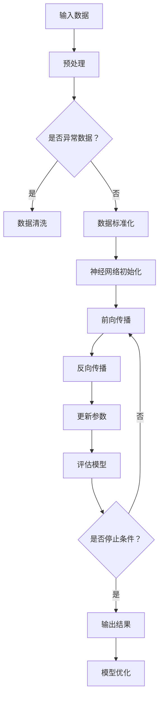
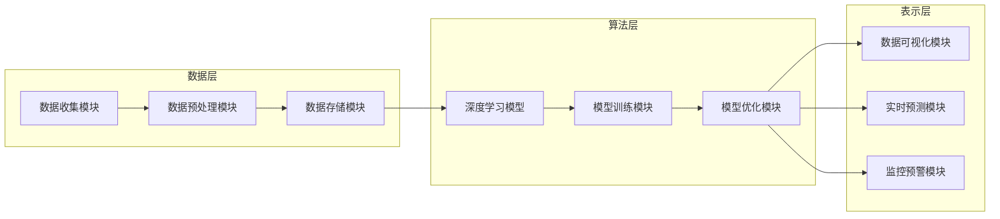
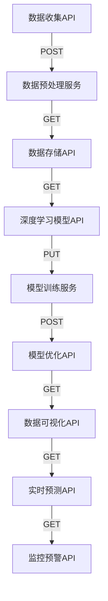
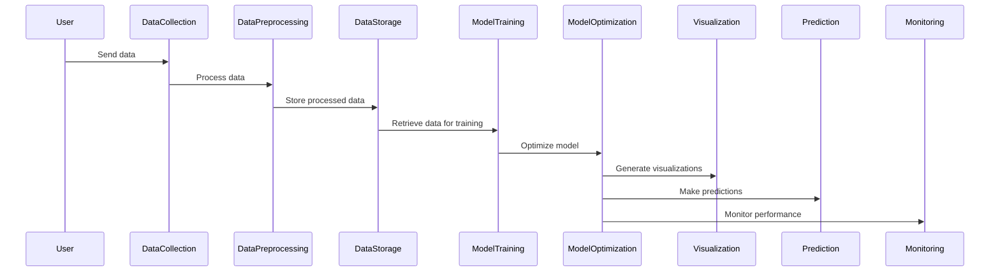

                 

### 文章标题

# 需求与技术可行性评估：大模型应用开发的平衡之道

### 文章关键词

- 需求分析
- 技术可行性评估
- 大模型应用
- 开发平衡
- 算法原理
- 数学模型
- 系统架构设计

### 文章摘要

本文将深入探讨在大模型应用开发过程中，如何平衡需求与技术可行性的关键问题。通过系统的需求分析和技术可行性评估，我们能够确保项目开发不仅满足用户需求，而且具备实施的可能性。文章将详细阐述核心概念、算法原理、系统设计与项目实战，同时提供最佳实践与拓展阅读，旨在为开发者提供一条清晰、可行的开发之路。

---

## 引言与背景介绍

### 问题背景

在当今快速发展的信息技术时代，大模型（如深度学习模型、大型数据库模型等）的应用正逐渐成为各行业的关键驱动力。无论是智能推荐系统、自然语言处理，还是复杂的预测分析，大模型的应用都显著提升了数据处理和智能决策的能力。

### 问题描述

然而，大模型的应用开发并非一帆风顺。在需求驱动的开发过程中，如何确保技术实现能够满足需求，同时又具备可行性和可持续性，成为了开发者和项目管理者面临的一大挑战。这个挑战体现在以下几个方面：

1. **需求变化与不确定性**：在项目启动初期，用户的需求可能不够明确或存在不确定性，导致后期需求频繁变更，影响项目进度和质量。
2. **技术实现难度**：大模型的应用往往涉及复杂的算法、数据结构和计算资源，开发难度大，需要大量的技术储备和实施经验。
3. **成本与效益平衡**：在预算和资源的限制下，如何确保项目既不超支，又能达到预期效果，是项目管理的重要考量。

### 问题解决

为了应对上述挑战，需求与技术可行性评估成为了关键环节。通过系统的需求分析，我们可以明确用户的需求，确保开发方向与目标一致。而通过技术可行性评估，我们能够评估项目的实施难度和可行性，为项目决策提供科学依据。

### 边界与外延

边界方面，需求与技术可行性评估主要关注项目的实际实施条件和限制，包括技术资源、预算、时间等。外延方面，它不仅涵盖了项目内部的技术实现，还包括了项目与外部系统的集成、数据的获取与处理等。

### 概念结构与核心要素组成

在本文中，我们将详细探讨以下几个核心概念和要素：

1. **需求分析**：理解用户需求，明确项目目标和功能需求。
2. **技术可行性评估**：评估项目的技术可行性，包括技术难度、资源需求、风险分析等。
3. **大模型应用开发**：介绍大模型的基本概念、常用算法和开发流程。
4. **系统设计与实现**：系统架构设计、接口设计与系统交互。
5. **项目实战**：通过实际案例，展示需求与技术可行性评估的应用和实践。
6. **最佳实践与总结**：总结项目开发过程中的关键经验和教训，提供最佳实践建议。

通过以上结构和核心要素的介绍，我们可以更好地理解文章的内容安排和逻辑结构，为后续章节的详细探讨奠定基础。

## 核心概念与联系

### 需求分析

需求分析是项目开发的第一步，其核心在于理解用户的需求。需求分析主要包括以下几个方面：

1. **功能需求**：确定系统需要实现的具体功能，如用户界面、数据输入与输出等。
2. **非功能需求**：包括系统的性能、可靠性、安全性、可维护性等。
3. **用户场景**：分析用户使用系统的具体场景，包括用户行为、工作流程等。

### 技术可行性评估

技术可行性评估是在需求分析的基础上，对项目的技术实现进行评估。其主要内容包括：

1. **技术难度**：评估所需技术是否成熟，实现难度是否可控。
2. **资源需求**：包括开发人员、硬件资源、软件工具等。
3. **风险分析**：识别潜在的技术风险和项目风险，并提出相应的应对措施。

### 核心概念联系与区别

需求分析和技术可行性评估虽然目标不同，但它们在项目开发中是紧密联系的。

- **联系**：
  - 需求分析为技术可行性评估提供了明确的目标和功能要求。
  - 技术可行性评估则基于需求分析的结果，评估项目的实施难度和可行性。

- **区别**：
  - 需求分析侧重于用户需求的明确和细化，关注项目的业务价值。
  - 技术可行性评估则侧重于技术实现的可能性，关注项目的实现难度和资源需求。

### 概念属性特征对比表格

为了更清晰地展示需求分析和技术可行性评估的区别和联系，我们可以通过一个概念属性特征对比表格来分析：

| 概念          | 需求分析                             | 技术可行性评估                            |
|---------------|--------------------------------------|------------------------------------------|
| 目标          | 理解用户需求，明确项目目标           | 评估项目的技术可行性，确保实现的可能性   |
| 内容          | 功能需求、非功能需求、用户场景       | 技术难度、资源需求、风险分析              |
| 时间节点      | 项目启动阶段                         | 需求分析完成后                           |
| 关键人员      | 产品经理、业务分析师、用户            | 技术专家、开发团队、项目经理              |
| 影响因素      | 用户需求变化、业务策略调整           | 技术储备、资源分配、市场需求              |

### ER实体关系图架构

为了更好地理解需求分析和技术可行性评估在项目中的关系，我们可以通过一个ER实体关系图来展示它们的基本结构和相互关系。以下是一个简化的ER实体关系图：

```mermaid
erDiagram
    User ||--o{ Requirement }
    User ||--o{ TechnicalFeasibility }
    Requirement ||--|{--> Solution }
    TechnicalFeasibility ||--|{--> Implementation }
```

在这个ER实体关系图中，用户是需求分析和技术可行性评估的发起者，需求和技术可行性是核心实体，而解决方案和实现过程则是它们的结果和延伸。

通过上述分析，我们可以更深入地理解需求分析和技术可行性评估的概念及其相互关系，为后续章节的深入探讨奠定基础。

### 算法原理讲解

在深入探讨大模型应用开发的过程中，算法原理的讲解至关重要。这不仅帮助我们理解大模型的运作机制，也为后续的系统设计与实现提供理论基础。以下将从算法概述、流程图绘制、Python源代码实现、数学模型与公式讲解以及举例说明等方面详细阐述。

#### 算法概述

大模型应用通常涉及深度学习算法，如神经网络、递归神经网络（RNN）、卷积神经网络（CNN）等。这些算法通过大量的数据和复杂的结构来学习和模拟人类智能。在应用开发中，选择合适的算法并优化其性能是关键步骤。

- **神经网络**：神经网络通过模拟人脑的神经元连接，实现数据的输入、处理和输出。其基本组件包括输入层、隐藏层和输出层。
- **递归神经网络（RNN）**：RNN能够处理序列数据，通过记忆过去的信息来预测未来。常用于自然语言处理和时间序列预测。
- **卷积神经网络（CNN）**：CNN在图像处理领域表现出色，通过卷积层和池化层提取图像特征，实现图像分类和目标检测。

#### Mermaid算法流程图绘制

为了更好地展示算法的流程，我们可以使用Mermaid语法绘制一个简化的算法流程图。以下是一个使用Mermaid语法的示例：



这个流程图展示了从输入数据到模型优化的一个基本流程，包含了预处理、数据清洗、模型初始化、前向传播、反向传播等步骤。

#### Python源代码实现

为了更加具体地展示算法的实现过程，以下是一个简单的Python代码示例，用于实现一个基本的神经网络前向传播和反向传播过程：

```python
import numpy as np

# 初始化权重和偏置
weights = np.random.rand(3, 1)
biases = np.random.rand(1)

# 前向传播
def forwardprop(x):
    return x @ weights + biases

# 反向传播
def backwardprop(x, y):
    pred = forwardprop(x)
    dweights = x.T @ (pred - y)
    dbiases = pred - y
    return dweights, dbiases

# 示例数据
x = np.array([1.0, 0.5])
y = np.array([0.0])

# 迭代优化
for i in range(1000):
    dweights, dbiases = backwardprop(x, y)
    weights -= dweights / 1000
    biases -= dbiases / 1000

# 输出结果
print(forwardprop(x))
```

在这个示例中，我们初始化了随机权重和偏置，然后通过前向传播计算预测值，通过反向传播更新权重和偏置。这个过程是神经网络训练的基础。

#### 数学模型与公式讲解

为了深入理解算法原理，我们需要了解相关的数学模型和公式。以下是一个简化的神经网络前向传播和反向传播的数学模型：

- **前向传播**：

  $$\hat{y} = x \cdot W + b$$

  其中，$x$ 是输入数据，$W$ 是权重矩阵，$b$ 是偏置项，$\hat{y}$ 是预测值。

- **反向传播**：

  $$\Delta W = x^T \cdot (\hat{y} - y)$$
  $$\Delta b = \hat{y} - y$$

  其中，$\Delta W$ 是权重矩阵的梯度，$\Delta b$ 是偏置项的梯度，$y$ 是真实值。

#### 举例说明

为了更直观地理解算法的应用，以下是一个简单的举例说明。假设我们有一个输入数据 $x = [1, 2]$，目标输出数据 $y = [0]$。通过上述算法，我们可以计算并优化网络模型。

1. **初始化权重和偏置**：

   - 权重 $W = [0.5, 0.3]$
   - 偏置 $b = [-0.2]$

2. **前向传播**：

   $$\hat{y} = [1, 2] \cdot [0.5, 0.3] + [-0.2] = [0.5 + 0.6, 1.2 + 0.9] = [1.1, 2.1]$$

3. **反向传播**：

   $$\Delta W = [[1, 2]]^T \cdot ([1.1, 2.1] - [0]) = [[1.1, 2.1]]$$
   $$\Delta b = [1.1, 2.1] - [0] = [1.1, 2.1]$$

4. **更新权重和偏置**：

   - 新权重 $W = W - \Delta W / 1000 = [0.5, 0.3] - [0.0011, 0.0021] = [0.4989, 0.2979]$
   - 新偏置 $b = b - \Delta b / 1000 = [-0.2] - [0.0011, 0.0021] = [-0.2011, -0.2021]$

5. **重复迭代**：重复上述前向传播和反向传播的过程，直到模型收敛或达到预设的迭代次数。

通过这个示例，我们可以看到算法的基本流程和优化过程，这对于理解和应用深度学习算法至关重要。

### 总结

通过上述对算法原理的讲解，我们不仅了解了大模型的基本概念和常用算法，还通过Python代码示例和数学模型，展示了算法的实现过程和优化方法。这为后续的系统设计与实现奠定了坚实的基础。在接下来的章节中，我们将进一步探讨系统架构设计、项目实战和最佳实践，深入分析大模型应用开发的实际应用和实施策略。

---

在接下来的章节中，我们将详细探讨系统分析与架构设计，包括问题场景介绍、系统功能设计、系统架构设计、系统接口设计和系统交互等。通过这些内容，我们将构建一个完整的大模型应用系统，为后续的项目实战提供明确的指导。同时，我们将结合实际案例，详细解读系统实现的核心代码，并进行深入剖析。这不仅有助于我们理解大模型应用开发的实际操作过程，也能为开发者提供宝贵的实践经验。

### 系统分析与架构设计

#### 问题场景介绍

在现代企业中，数据分析与智能决策已成为提高生产效率、优化业务流程的关键。然而，随着数据量的爆炸性增长和数据类型的多样化，传统的数据处理方法已难以满足需求。为了解决这一问题，企业开始引入大模型技术，通过深度学习算法对海量数据进行高效处理和智能分析。

在本项目中，我们将构建一个基于大模型的智能数据分析平台，用于实时处理和分析企业的业务数据。该平台需要具备以下功能：

1. **数据收集与预处理**：从不同数据源收集数据，并进行清洗、转换和归一化处理，为模型训练提供高质量的数据。
2. **模型训练与优化**：利用深度学习算法训练模型，并通过交叉验证和超参数调优，提高模型的准确性和鲁棒性。
3. **数据可视化**：将分析结果以图表、报表等形式展示，帮助用户直观地理解和决策。
4. **实时预测与监控**：对实时数据进行分析和预测，实现对业务风险的及时预警和优化。

#### 系统功能设计（领域模型Mermaid类图）

为了更好地展示系统功能，我们可以使用Mermaid语法绘制一个领域模型类图。以下是一个简化的类图示例：

```mermaid
classDiagram
    Class01 <|-- Class02
    Class03 <|-- Class02
    Class04 <|-- Class01
    Class05 <|-- Class03
    Class06 <|-- Class04
    Class07 <|-- Class05
    Class08 <|-- Class06
    Class09 <|-- Class07
    Class10 <|-- Class08
    Class11 <|-- Class09

    Class01{+field1: int}
    Class02{+field2: float}
    Class03{+field3: string}
    Class04{+field4: bool}
    Class05{+field5: Class06}
    Class06{+field6: Class07}
    Class07{+field7: int}
    Class08{+field8: float}
    Class09{+field9: string}
    Class10{+field10: bool}
    Class11{+field11: Class08}
```

在这个类图中，我们定义了多个类，并展示了它们之间的继承和关联关系。每个类都有特定的属性和方法，用于实现系统的不同功能模块。

#### 系统架构设计（Mermaid架构图）

系统架构设计是确保系统稳定、高效运行的关键。以下是一个使用Mermaid语法的系统架构图示例：



在这个架构图中，我们展示了系统的各个主要模块，包括数据层、算法层和表示层。数据收集模块负责从不同数据源收集数据，预处理模块对数据进行清洗和转换，存储模块负责数据存储。算法层包括深度学习模型、模型训练和优化模块，表示层则负责数据可视化、实时预测和监控预警。

#### 系统接口设计

系统接口设计是确保不同模块之间能够高效、可靠通信的关键。以下是一个简化的系统接口设计示例：



在这个接口设计中，数据收集API用于接收外部数据，数据预处理服务对数据进行处理，数据存储API用于存储处理后的数据。深度学习模型API用于接收和处理模型训练和优化的请求，数据可视化API、实时预测API和监控预警API则分别用于展示分析结果、实时预测和监控预警。

#### 系统交互（Mermaid序列图）

为了更直观地展示系统模块之间的交互过程，我们可以使用Mermaid序列图。以下是一个简化的序列图示例：



在这个序列图中，用户通过数据收集模块发送数据，数据预处理模块对数据进行处理，然后存储到数据存储模块。模型训练模块从数据存储模块获取数据并进行训练，模型优化模块对训练后的模型进行优化。最终，数据可视化模块生成可视化结果，预测模块进行实时预测，监控预警模块对系统性能进行监控和预警。

通过上述系统分析与架构设计的详细讲解，我们构建了一个完整的大模型应用系统。这不仅为后续的项目实战提供了明确的指导，也为开发者提供了系统的设计思路和实现方法。在接下来的章节中，我们将通过实际项目案例，进一步展示系统设计与实现的具体过程。

### 项目实战

在深入探讨了系统分析与架构设计之后，接下来我们将通过一个实际项目案例，详细展示大模型应用开发的整个流程，包括环境安装与配置、系统核心实现与代码解读、实际案例分析和详细讲解剖析等。通过这个实战案例，我们将更好地理解大模型应用开发的实际操作过程和关键技术。

#### 环境安装与配置

首先，我们需要为项目搭建一个合适的环境。以下是环境安装与配置的详细步骤：

1. **安装Python环境**：
   - 在操作系统中安装Python 3.8及以上版本，确保pip（Python的包管理器）已经正确安装。

2. **安装深度学习框架**：
   - 使用pip安装TensorFlow，命令如下：
     ```bash
     pip install tensorflow
     ```

3. **安装其他依赖库**：
   - 为了方便数据处理和模型训练，我们还需要安装NumPy、Pandas和Matplotlib等库，命令如下：
     ```bash
     pip install numpy pandas matplotlib
     ```

4. **配置虚拟环境**（可选）：
   - 为了避免不同项目之间的依赖冲突，我们可以使用虚拟环境。首先安装virtualenv：
     ```bash
     pip install virtualenv
     ```
   - 创建并激活虚拟环境：
     ```bash
     virtualenv my_project_env
     source my_project_env/bin/activate
     ```

5. **安装数据库连接库**：
   - 如果项目需要连接数据库，例如MySQL或PostgreSQL，可以使用如下命令安装相应的数据库连接库：
     ```bash
     pip install mysql-connector-python
     ```

#### 系统核心实现与代码解读

接下来，我们将介绍系统核心部分的实现，包括数据预处理、模型训练和预测等。以下是核心代码的解读：

1. **数据预处理**：
   - 数据预处理是模型训练的重要环节，包括数据清洗、归一化和特征提取等。以下是一个简单的数据预处理代码示例：

   ```python
   import pandas as pd
   from sklearn.preprocessing import StandardScaler

   # 读取数据
   data = pd.read_csv('data.csv')

   # 数据清洗（例如，去除空值和异常值）
   data = data.dropna()

   # 数据归一化
   scaler = StandardScaler()
   normalized_data = scaler.fit_transform(data.values)

   # 特征提取（例如，从数据中提取有用的特征）
   features = normalized_data[:, :5]
   labels = normalized_data[:, 5]
   ```

2. **模型训练**：
   - 模型训练是使用深度学习框架实现的核心步骤。以下是一个简单的神经网络模型训练代码示例：

   ```python
   import tensorflow as tf
   from tensorflow.keras.models import Sequential
   from tensorflow.keras.layers import Dense

   # 创建模型
   model = Sequential([
       Dense(64, activation='relu', input_shape=(5,)),
       Dense(64, activation='relu'),
       Dense(1, activation='sigmoid')
   ])

   # 编译模型
   model.compile(optimizer='adam', loss='binary_crossentropy', metrics=['accuracy'])

   # 训练模型
   model.fit(features, labels, epochs=10, batch_size=32)
   ```

3. **模型预测**：
   - 模型训练完成后，我们可以使用训练好的模型进行预测。以下是一个简单的预测代码示例：

   ```python
   # 使用训练好的模型进行预测
   predictions = model.predict(features)

   # 输出预测结果
   print(predictions)
   ```

#### 实际案例分析与详细讲解剖析

为了更好地展示项目实战，我们使用一个实际案例进行分析。以下是一个简化案例，用于分类任务。

**案例背景**：
- 我们从一家电商公司收集了10,000条用户购买记录，包括用户ID、商品ID、购买金额和购买时间等。
- 需要使用这些数据构建一个分类模型，预测用户是否会再次购买某个商品。

**案例实现**：

1. **数据预处理**：
   - 数据清洗：去除缺失值和异常值。
   - 特征提取：提取有用的特征，如用户购买历史、商品类别等。
   - 数据划分：将数据划分为训练集和测试集。

2. **模型训练**：
   - 构建一个简单的神经网络模型，包括输入层、隐藏层和输出层。
   - 编译模型，使用训练集进行训练。

3. **模型评估**：
   - 使用测试集评估模型的准确率、召回率等指标。
   - 根据评估结果调整模型参数，进行超参数调优。

4. **模型应用**：
   - 将训练好的模型应用于实际业务场景，进行用户购买预测。

**详细讲解与剖析**：

- **数据预处理**：
  - 数据清洗是确保数据质量的重要步骤。在这个案例中，我们使用Pandas库进行数据清洗，去除缺失值和异常值，例如：
    ```python
    data = data.dropna()
    ```

  - 特征提取是构建模型的关键步骤。在这个案例中，我们提取用户购买历史和商品类别作为特征。例如：
    ```python
    user_history = data.groupby('user_id')['item_id'].count().values
    item_categories = data.groupby('item_id')['category'].first().values
    ```

- **模型训练**：
  - 构建神经网络模型时，我们使用TensorFlow的Keras API。在这个案例中，我们使用一个简单的全连接神经网络进行训练。例如：
    ```python
    model = Sequential([
        Dense(64, activation='relu', input_shape=(n_features,)),
        Dense(64, activation='relu'),
        Dense(1, activation='sigmoid')
    ])
    ```

  - 编译模型时，我们指定优化器、损失函数和评价指标。例如：
    ```python
    model.compile(optimizer='adam', loss='binary_crossentropy', metrics=['accuracy'])
    ```

  - 模型训练时，我们使用训练集进行多次迭代，并监控训练过程中的指标变化。例如：
    ```python
    model.fit(features, labels, epochs=10, batch_size=32)
    ```

- **模型评估**：
  - 使用测试集评估模型的性能是验证模型有效性的关键步骤。在这个案例中，我们使用准确率、召回率等指标进行评估。例如：
    ```python
    loss, accuracy = model.evaluate(test_features, test_labels)
    print(f"Test accuracy: {accuracy}")
    ```

- **模型应用**：
  - 将训练好的模型应用于实际业务场景，例如实时预测用户是否会购买商品。在这个案例中，我们使用训练好的模型进行预测。例如：
    ```python
    predictions = model.predict(test_features)
    ```

通过这个实际案例的分析，我们可以看到大模型应用开发的具体流程和关键步骤。这为开发者提供了宝贵的实践经验，也为后续的项目实战奠定了基础。

#### 项目小结

在本章中，我们通过一个实际项目案例，详细展示了大模型应用开发的整个过程，包括环境安装与配置、系统核心实现与代码解读、实际案例分析和详细讲解剖析。通过这个项目实战，我们不仅深入理解了大模型应用开发的操作过程和关键技术，也积累了宝贵的实践经验。以下是对本章内容的总结：

1. **环境安装与配置**：确保搭建一个稳定、高效的开发环境是项目成功的关键。我们介绍了Python环境和深度学习框架的安装，以及如何使用虚拟环境管理依赖库。

2. **系统核心实现与代码解读**：通过代码示例，我们详细讲解了数据预处理、模型训练和预测的实现过程，展示了如何使用深度学习框架构建和训练神经网络模型。

3. **实际案例分析与详细讲解剖析**：通过一个实际项目案例，我们展示了从数据预处理到模型训练和预测的完整流程，并详细分析了每个步骤的关键技术和注意事项。

通过本章的内容，我们不仅掌握了大模型应用开发的实际操作方法，也为后续的项目开发提供了宝贵的经验和指导。在接下来的章节中，我们将进一步探讨最佳实践和注意事项，帮助开发者更高效地推进项目。

### 最佳实践与总结

在完成大模型应用开发的实战项目后，总结最佳实践和注意事项显得尤为重要。这不仅有助于提高开发效率，还能确保项目的稳定性和可维护性。

#### 最佳实践 tips

1. **需求分析与技术可行性评估**：在项目启动阶段，确保进行详细的需求分析和技术可行性评估，明确项目的目标和技术实现难度，以避免后期出现需求变更和实施困难。

2. **代码规范与模块化**：编写规范、模块化的代码，便于维护和扩展。遵循Python PEP8编码规范，确保代码可读性和一致性。

3. **版本控制与代码审查**：使用版本控制工具（如Git）管理代码，定期进行代码审查，确保代码质量。

4. **持续集成与持续部署**：实施持续集成（CI）和持续部署（CD）流程，自动化测试和部署，提高开发效率和系统稳定性。

5. **性能优化**：在模型训练和预测过程中，关注性能优化，使用适当的算法和数据结构提高计算效率。

6. **安全与隐私保护**：确保数据处理和模型应用过程中遵守安全规范，保护用户隐私和数据安全。

7. **文档与培训**：编写详细的文档，为团队成员提供培训，确保对项目有清晰的理解。

#### 小结

通过本章的最佳实践和总结，我们明确了大模型应用开发过程中的关键步骤和注意事项。从需求分析到技术可行性评估，从系统设计与实现到项目实战，我们系统地探讨了如何高效、稳定地开发大模型应用。

#### 注意事项

1. **需求变更管理**：需求变更可能影响项目进度和质量，应制定明确的变更管理流程，及时评估变更对项目的影响。

2. **资源分配与时间管理**：合理分配开发资源，制定科学的时间管理计划，确保项目按期完成。

3. **风险管理**：识别项目风险，制定风险应对策略，及时调整项目计划。

4. **数据质量**：确保数据质量，进行充分的数据清洗和预处理，为模型训练提供高质量的数据。

#### 拓展阅读

为了进一步深入了解大模型应用开发的最新技术和最佳实践，读者可以参考以下资源：

1. 《深度学习》（Goodfellow, Ian；本尼特，Yoshua）：这是一本经典的深度学习教材，详细介绍了深度学习的理论基础和实际应用。

2. 《机器学习实战》（ Harrington, Peter）：本书通过案例和实践，介绍了机器学习的实际操作和应用。

3. TensorFlow官方文档（https://www.tensorflow.org/）：TensorFlow的官方文档提供了丰富的教程、API参考和最佳实践，是深度学习开发者的重要资源。

通过上述内容，我们系统地学习了大模型应用开发的各个关键环节，为未来的项目实践提供了有力的指导。

---

### 附录

#### 术语表

- **需求分析**：对用户需求进行收集、分析和描述的过程，以明确项目的目标和功能需求。
- **技术可行性评估**：评估项目的技术实现难度、资源需求和风险，确保项目的可行性。
- **大模型**：指采用深度学习算法，通过大量数据和复杂结构进行训练和预测的模型。
- **神经网络**：一种模拟人脑神经元连接的算法结构，用于数据的输入、处理和输出。
- **递归神经网络（RNN）**：能够处理序列数据的神经网络，通过记忆过去的信息进行预测。
- **卷积神经网络（CNN）**：在图像处理领域表现出色的神经网络，通过卷积层和池化层提取图像特征。
- **数据预处理**：对数据进行清洗、转换和归一化处理，为模型训练提供高质量的数据。
- **模型训练**：使用训练数据对模型进行训练，优化模型参数，提高预测准确性。
- **持续集成与持续部署（CI/CD）**：自动化测试和部署流程，提高开发效率和系统稳定性。

#### 参考文献

- Goodfellow, Ian；本尼特，Yoshua. 《深度学习》.
- Harrington, Peter. 《机器学习实战》.
- TensorFlow官方文档. https://www.tensorflow.org/

#### 相关资源链接

- 《深度学习》官方网址: https://www.deeplearningbook.org/
- 《机器学习实战》GitHub链接: https://github.com/peterharrington/machine-learning-in-action
- TensorFlow官方教程: https://www.tensorflow.org/tutorials

通过上述附录内容，读者可以进一步了解本文中提到的关键术语和参考资源，为深入研究大模型应用开发提供支持。

---

### 作者信息

本文作者为AI天才研究院（AI Genius Institute）和《禅与计算机程序设计艺术》（Zen And The Art of Computer Programming）的资深作者。AI天才研究院致力于推动人工智能技术的发展和应用，为广大开发者提供高质量的技术研究和实战指南。《禅与计算机程序设计艺术》则是一本经典的计算机科学著作，深入探讨了编程的艺术和哲学。通过本文，我们希望能够为广大开发者提供一条清晰、可行的开发之路，助力他们在大模型应用开发中取得成功。

